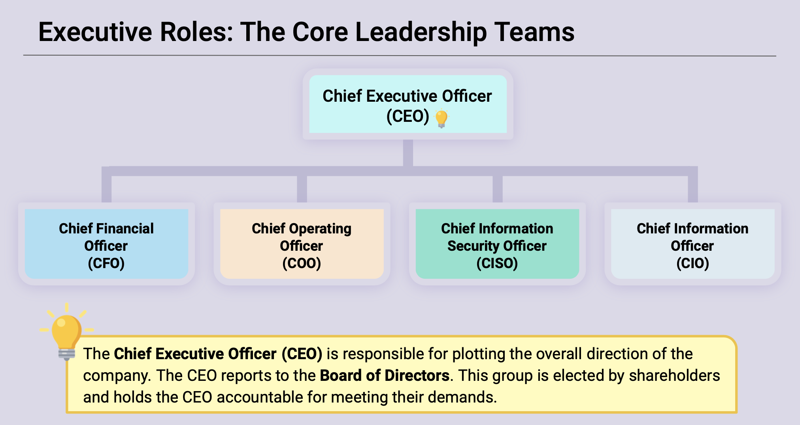
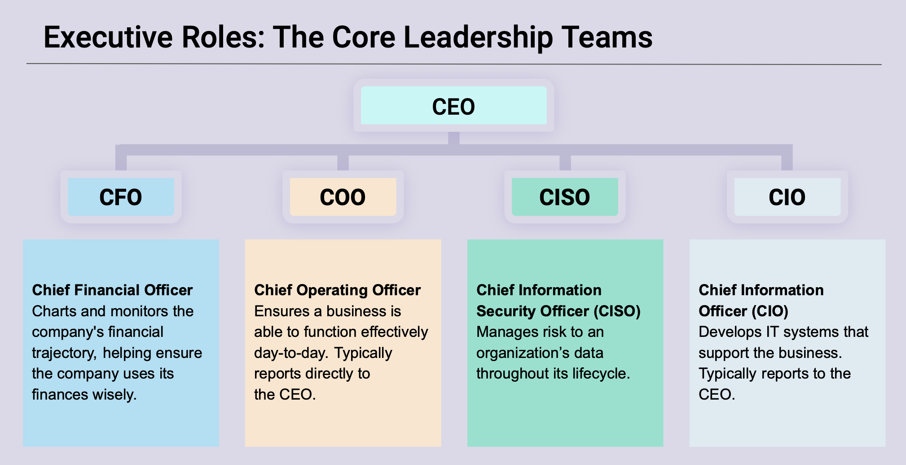
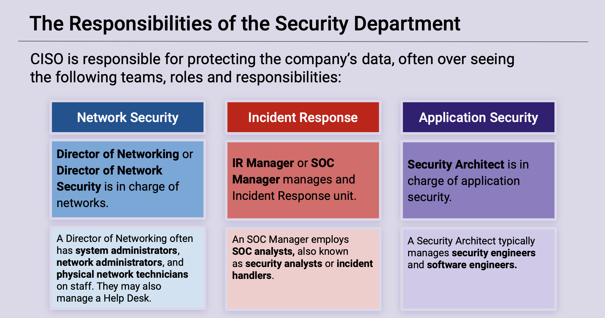

## 2.1: Introduction to Security Within the Organization

### Overview

Today's class will introduce students to organizational security. Students will get a holistic impression of how the different security topics and fields they will study connect to one another as well as to the larger business organization.

### Class Objectives

By the end of today's class, students will be able to:

- Identify at least three benefits of a healthy security culture.

- Articulate the responsibilities of common C-Suite officers, including the CISO.

- Explain the responsibilities of the security department.

- Identify appropriate security controls for a given resource and situation.

### Instructor Notes

Today's class will introduce students to technical security teams working within the context of a larger security department.

- In lectures, you will discuss security roles, responsibilities, and planning using the scenario of an organization solving the problem of employees downloading malicious files from emails.

- In exercises, students will play the role of risk consultants hired to help a company analyze and plan a solution for tailgating: when employees hold the door open for others, who may not be authorized to enter the premises. Encourage students to work in pairs or small groups for these activities.

Class will proceed as follows:

  - Overview of the Roles and Responsibilities of the Security Department
  - Overview of Security in the Organization and the Importance of Security Culture
  - Introduction to the Security Culture Framework
  - Security Controls

Today's discussion sets the stage for discussion threat modeling, governance, and compliance in later classes.

#### Slideshow 

The lesson slides are available on Google Drive here: [2.1 Slides](https://docs.google.com/presentation/d/1alICzTFw-ZXxhQ7Mm8rJ7-cTI6a32erW_6F7oEIJT38/edit#slide=id.g480f0dd0a7_0_1803)

- To add slides to the student-facing repository, download the slides as a PDF by navigating to File > "Download as" and choose "PDF document." Then, add the PDF file to your class repository along with other necessary files.

- **Note:** Editing access is not available for this document. If you or your students wish to modify the slides, please create a copy by navigating to File > "Make a copy...".

### Time Tracker

The lesson slides are available on Google Drive here: [2.1 Time Tracker](https://docs.google.com/spreadsheets/d/1RKy_tQXA4UdF4pO0AD_N7AlMenfKAam9k2CbzY2olHY/edit#gid=0)

### Student Guide

Send class the student facing version of the lesson plan: [2.1 Student Guide](StudentGuide.md)

---

### 01. Instructor Do: How Security Aligns within an Organization (0:20)

Welcome students to their second week of class and explain that this unit will explore how security teams integrate with their broader organizations. This lesson will introduce the foundational principles of governance, risk management, and compliance (GRC).

- Explain that this course will focus on equipping students with the tools they need to perform common technical roles. The GRC unit will explain how teams that carry out these responsibilities interact with one another and the organization at large.

We'll begin our discussion with an overview of a typical GRC framework.

#### GRC Framework

Organizations are pressed to address two important questions: 

- What assets are most important to our organization?

- What is adequate protection for those assets?

Specifically, each component of GRC provides the following to this framework: 

- **Governance** provides management frameworks used to implement security practices in the organization. It helps a business decide how to enforce its security practices by developing policies, standards, processes, and procedures.

- **Risk Management** identifies which assets are most important and determine how they are most likely to be compromised. The business then uses this information to decide how to protect its most important and at-risk assets. This decision then informs the business's security practices.

- **Compliance** ensures internal security policies are being followed and verifies that the business is following relevant security laws.

As we'll note in coming examples, implementations of these frameworks may conflict with a business's primary goal of driving profits. 

- GRC is futile without enforcement. It may be tempting to circumvent security best practices, laws and regulations in order to drive more profit. 

In this section, we will study how GRC frameworks are considered and implemented into a business by first examining the following: 

- The executive management team that is ultimately responsible for the adherence and enforcement of laws, regulations, and security practices.

- The role a security team plays within their larger organization. 

Let's explore the specific roles and responsibilities of the executive team.

#### Roles of Executive Management (C-Suite)

All companies have a core leadership team that delegates the responsibility of separate business functions. This team usually consists of **C-Suite officers**, such as: 

  - Chief Executive Officer (CEO)
  - Chief Information Security Officer (CISO)
  - Chief Operating Officer (COO)

     

- **Chief Executive Officer (CEO)**

  - The CEO is responsible for plotting the overall direction of the company and conceiving and communicating a corporate mission or ultimate goal, determining what the business should focus on in order to meet those goals, assessing risks, and setting standards of social responsibility for the organization.

    

  - As part of the core leadership team, the CEO is not actively engaged in managing the day-to-day operations of each individual department within the organization. This is where the departmental executive leadership team comes into play.

- The departmental executive team is **actively** engaged in managing the day-to-day operations within their departments and report directly to the CEO.

  - **Chief Operating Officer (COO)**
    -  The COO is responsible for ensuring business functions operate effectively day-to-day, monitor day-to-day operations, keeps the CEO aware of significant achievements and setbacks, and is in charge of people management (hiring, promotion, firing).

  - **Chief Financial Officer (CFO)**
    - The CFO is responsible for charting and monitoring the company's financial trajectory, in other words, they are ultimately responsible for **budgeting**, which helps ensure that the company uses its funds wisely.

  - **Chief Information Officer (CIO)**

    - The CIO is responsible for developing IT systems that support the business including setting up corporate networks, provisioning services like VPN, setting up and recycling employee devices, and ceasing servers for data storage and internal application development.

  - **Chief Information Security Officer (CISO):**

    - The CISO is responsible for managing risk to an organization's data throughout its life cycle. In other words, the CISO is responsible for ensuring that the company's data is safe from the time it's collected, stored, retrieved to when it's destroyed, purged, and wiped.

      - Other responsibilities include: supervising a security operations organization, which identifies, contains, and responds to threats, developing and disseminating information security policies, developing and disseminating training to personnel, working with the CIO to coordinate implementation of security policies by IT teams.

    - **Traditionally, the CISO reports to the CIO**, however, it's increasingly common for the CISO to report directly to the CEO, as data security is becoming significantly more important for many organizations.

  - Some organizations only have a CISO and not a CIO. In this case, the CISO serves both roles, CISO and CIO combined.

Explain that it's important to understand the basic role and responsibilities of each department within the typical business architecture. The following are examples of essential departments that exists within almost every organization:

- **Human Resources Department**: HR is responsible for internal communications, scheduling trainings, and tracking attendance.

- **Finance Department**: Responsible for maintaining the businesses financial.

- **Security Department**: Security must develop the training exercise and collaborate with HR to determine details of scheduling and delivery.

We'll continue our discussion by exploring the common roles and responsibilities within the security department.

#### The Responsibilities of the Security Department

Remind students that the CISO is responsible for protecting the company's data. There are many ways to meet this broad goal, but organizations typically have the following functions in-house:

  

  - **Network Security** 

    - Roles: **Director of Networking** or **Director of Network Security** 
    
    - Responsibilities: in charge of securing networks and implementing network security policies. This group also manages services like the corporate VPN. They are responsible for purchasing or leasing, configuring, maintaining, and troubleshooting the organization's network infrastructure. 

  - **Incident Response** 

     - Roles: **Incident Response (IR) Manager** or a  **Security Operation Center (SOC) Manager** 

     - Responsibilities: in charge of identifying and responding to security breaches. IR is responsible for security operations centers (SOCs), which monitor the organization's devices for incidents. IR is also responsible for escalating serious breaches to the executive team for handling.
  
  - **Application Security** 
  
    - Role:  **Security Architect** 

    - Responsibilities: responsible for ensuring that internally developed applications meet security standards. This means minimizing the number of breaches due to the application, ensuring these applications pass security audits, and teaching developers to follow best practices of secure development.

#### Security Teams and the Aligning Organization

Explain that we'll continue our discussion in regard to how the roles and responsibilities of various teams within a security department interact, as well as how the behavior of an organization's employees, known as its **security culture**, influences the security decisions of the business.

Explain the following:

- Security teams do not work in isolation.

  - For example: An organization's Incident Response team will need to work closely with its IT and Networking department in order to alert those teams of breaches and provide recommendations as to how to better secure their systems.

- These teams also do not work in isolation from the business they are a part of.

  - For example: An organization's Marketing and Communications teams use the networks and accounts that IT and Networking manage.

- Everything that the security team does is related to the broader needs of the business.

  - For example: An organization's engineering team may propose an innovative but insecure new feature for their flagship product. The security team would probably advise against developing the feature due to its poor security. However, the business might decide to develop it, deciding that the feature's profit potential is worth the insecurity.

  - In this example, the security team must adapt its operations to accommodate a product they know is insecure.

  - The security team's reaction might include: implementing more aggressive monitoring on data servers that are likely to be exposed by the new feature, and advising IT and Networking to implement more sophisticated access controls on important servers and proxies.

#### Security Goals vs. Business Goals

Emphasize that a security team's main goal is to protect the business's data, while the business's main goal is to make a profit.

  - The most profitable decision is not always the most secure.

  - Therefore, the security team often finds itself in tension with the rest of the organization because its goals are not always aligned with those of the business as a whole.

It costs money to run a security department.

  - Therefore, "perfect" security is never the realistic goal for any organization.

  - Instead, businesses strive to provide _adequate_ protection for their _most important_ resources.

  - This way, they can focus their budget and security resources where they matter most.

Security professionals must determine which assets are "most important" and then determine what will be an "adequate" protection.

- Present the following example of an insecure feature that may drive considerable profit:

  - An organization may perform a **risk assessment** and conclude that a new feature could lead to a 25% increase in quarterly profits, but will also expose an isolated data server that contains customer names, usernames, and email addresses, but no other PII.

  - The security team might object to the feature because it is insecure. However, the business might decide that dealing with a breach of an isolated server that contains no confidential information would cost less than the amount of profit they would make by building the feature.

  - In this case, the business objective of meeting profit targets overrides the risks in the strategy.

  - However, if the feature exposed a core data server that contained customer social security numbers and credit card numbers, the business might decide that the feature isn't worth the risk to its customers' privacy or the penalties for violating federal laws and regulations that mandate the careful protection of this data.

Explain that, after making a decision, the business should update its security practices to manage the risks they've chosen to undertake and periodically verify that everyone is following the rules. This is where **governance** and **compliance** come in.

Take a moment to address questions before proceeding.

### 02. Student Do: Considering Security and Business Objectives (0:15)

Remind students that a business's main goals are usually to grow profits and improve efficiency. Businesses will often be interested in making decisions that achieve these goals, regardless of security issues the decisions introduce.

Explain that, in this exercise:

- Students will play the role of a security consultant hired to help a business determine how risky its plans are. They will review each idea the business wants to implement, identify ways it might put the business's systems at risk, and determine if the business should cancel or proceed with the project.

- They will also have to assess a number of suggestions that the organization's security teams have for improving security. They must determine whether these suggestions are inadequate, excessive, or just right.

- They will need to consider the benefits of each suggestion against its implementation cost. This is essentially a simple **risk analysis** exercise, which we will explore in greater detail later.

:globe_with_meridians: This activity will use breakout rooms. Assign students into groups of 2-4 and move them into breakout rooms. 

Send students the following file:

- [Activity File: Weighing Security and Business Objectives](Activities/02_Weighing_Security/Unsolved/Readme.md)

### 03. Review Class Discussion: Review Business vs. Security Activity (0:15)

:bar_chart: Using [Zoom's](https://support.zoom.us/hc/en-us/articles/213756303-Polling-for-meetings) or [Slack's](https://slack.com/help/articles/229002507-Create-a-poll-) poll feature, conduct a comprehension check and evaluate how well students completed the activity. 

Ask students to provide their responses to each question. As you move through each situation, explain the sample answers provided below.

Share the solution file with students:

- [Solution Guide: Weighing Security and Business Objectives](Activities/02_Weighing_Security/SOLVED/Readme.md)

#### Business Plans

1. The director of engineering suggested giving all developers access to all data. 
  
    - **Pros**: Makes development easier. 
    
    - **Cons**: Allows _any_ developer to access _any_ user data, including sensitive PII that has nothing to do with their jobs. 
    
 - **Recommendation**: The business should **reject** on grounds of privacy.

2. The director of IT suggested exposing administration servers to the public internet. 

    - **Pros:** Administrators can work from any computer. 
    
    - **Cons:** The servers would be publicly accessible, which is unacceptable for a private network. 
    
- **Recommendation**: The organization should **reject** this request. A VPN would be a better solution to this problem.

3. An SOC analyst recommended merging all of the company's mail servers into a single server, in order to cut costs and improve SOC efficiency. 

    - **Pros:** It would ultimately cost less and reduce the number of servers that attackers could potentially compromise, the number of machines that could expose vulnerabilities, and the number of machines that SOC has to monitor.

    - **Cons**: If the company has so many emails that it _needs_ to maintain multiple servers, this suggestion won't be possible.

  - **Recommendation**: If the company doesn't have so many emails that multiple servers are necessary, hosting all of the data on a single machine is a good idea. 
    
#### Security Recommendations

The Security team suggested hardening the merged mail server via encryption or placing the mail server behind a firewall and only allowing access from the corporate VPN.
  
 - In general, encryption is not a good idea. It requires a lot of power to encrypt and decrypt data, and email doesn't usually contain confidential data.

    However, selectively encrypting emails that do contain encrypted data is a good idea.
    
  - Only allowing access to the mail servers from the corporate VPN also seems a bit of an extreme measure. 
    
    Again, email usually does not contain confidential information, so access does not need to be so strictly controlled. 
    
    However, this approach might make sense in environments with lots of confidential information, such as government agencies, law firms, or medical records companies.

Take a moment to address questions before proceeding.

### 04. Instructor Do: Security Culture Framework (0:15)

Now that we have a better understanding of the organizational layout of the business, we'll continue discussing the security culture framework.

Emphasize that some of the business plans that students analyzed in the previous exercise implied major vulnerabilities.

For example: Giving all developers access to all data and exposing administration servers to the internet.

  - Remind students that the first suggestions was made by the organization's _director of engineering_ and the latter by the _director of IT_.

  - However, both requests show extreme disregard for data security.

  - These directors would not have made these requests if they understood how insecure they were and if they considered security an important goal for their teams.

 Explain that ensuring a strong organizational security posture begins by ensuring employees both _consider security important_ and _understand the security implications of their decisions_.

 - These two factors ensure that employees do not make decisions that compromise the business's security due to disinterest or lack of understanding.

Explain that when employees are invested in the organization's security and understand how to "behave securely," the company is said to have a healthy **security culture**. Developing a healthy security is an important goal for security departments in all organizations.

Define security culture as the way members of an organization think about and approach security issues. The health of an organization's security culture is determined by the following:

  - How important its employees consider security.

  - How aware employees are of common security risks.

  - Whether its employees know how to avoid insecure behavior.

Mention that the organization from the previous activity likely has an unhealthy security culture, because neither the director of engineering nor the director of IT were aware of the security risks implied in their requests. Or, if they were aware, they didn't care.

- Emphasize that the effectiveness of an organization's security guidelines and controls ultimately depends on whether or not employees follow those guidelines and controls. Therefore, employees must believe that security is important and follow an organization's established security rules.

Next, we'll study the **security culture framework** in order to understand how to develop a healthy security culture that motivates employees to value security and trains them to avoid insecure behavior.

#### The Security Culture Framework

Simply put, a security culture framework is a process for identifying problems in an organization's security culture and developing plans to solve them. This is another way cybersecurity professionals assess threats and mitigate risks. Emphasize that bad security culture can lead to a breach. 
  - For example: Target was alerted of a potential security issue, but because the security teams received many alerts, they missed the identification of this critical security alert. 
  
    A good security culture guarantees all staff pays close attention to all critical alerts.

Explain the following steps for developing a security culture framework:

 **Step 1: Measure and Set Goals**: First, we need to understand the current state of the organization's security culture.          

  - Start by identifying a particular security concern, such as employees downloading untrusted files from emails.

  - Then, define what people *should* do. In this case, only download emails from trusted domains.

  - Next, define a goal for how well you want the organization to perform. For example: Fewer than 5% of employees download untrusted files every month.

  - Finally, measure how often employees currently perform this behavior properly. In this case, you could run a survey, or even have penetration testers send phishing emails to your organization and determine how many people they can infect. This data will serve as a baseline you can use to measure progress.

  **Step 2: Involve the Right People**: After defining a goal, inform the relevant employees of the new target.

  - Meeting this particular goal requires input from the security department, but also from personnel in charge of training and internal communications.

  **Step 3: Create an Action Plan**: After the relevant stakeholders have been informed, develop an action plan. A plan typically involves developing a training exercise that addresses the security issue at hand. Training might cover the following topics:

  - The dangers of malware.
  - How malware spreads through phishing.
  - How malware spreads through vishing.
  - How to avoid phishing and vishing attacks.

**Step 4: Execute the Plan**: After developing the plan, run the training.

**Step 5: Measure Changes**: Collect data on how well people are adhering to the guidelines taught in the training and compare this to the baseline you established before training. Determine if your exercise was effective.

Next, we'll go through these steps using a new example.

#### Applying the Security Culture Framework

Present the following social engineering problem:

  - Employees are receiving emails to their company email addresses from external sources. The employees are then clicking on links and downloading attachments in these emails. The security team at the organization has determined that the links/downloads in many of these emails contain malware.

Go through the following process to demonstrate how to address this email problem and improve security culture:

  - **1. Measure and Set Goals**:

    - Hire a penetration testing firm to begin a phishing campaign that will send out phishing emails to users in the company. They will then keep track of how many users would fall for a potential phish.

    - Use this data to determine two things: what percentage of employees fall for the phishing attempt and exactly who downloads them.

    - Suppose that 9% of employees engage with the phishing attempt. Based on these findings, set a goal that only 5% of employees will engage by the start of the next fiscal year.

    - In addition to this end goal, aim to train 25% of employees every quarter, until you've trained everyone by the end of the year.

  - **2. Involve the Right People**:

    - Since this training will affect all members of the organization, you decide to inform the executive team about the problem and your decision to implement training.

    - We'll cover specific roles in detail later. For now, inform at least the CEO and/or CIO, the director of HR, and the person in charge of internal communications and training.

    - In addition, you might draft a contract with the pentesting team that implemented the original phishing campaign to ensure that they can apply the same test next year to provide reliable measurements of training effectiveness.

  - **3. Create an Action Plan**: After getting approval to implement the training, plan to deliver an annual cybersecurity awareness training event that teaches employees about:

    - The dangers of malware.
    - How malware spreads through phishing.
    - How malware spreads through vishing.
    - How to avoid phishing and vishing attacks.

  - **4. Execute the Plan**: After developing the training, implement it and aim to train 25% of employees every quarter in accordance with your original goal.

  - **5. Measure Changes**: After training the entire company, have the pentesters implement the original phishing campaign. You might find that only 6% of employees fall for the phish. In this case, you observed approximately 30% reduction in malicious file downloads, but didn't quite meet your initial goal. 
    - At this point, you would either revise that target, or implement the training again until you get below 5%.

Mention that the details of this plan will vary for every situation. However, the high-level steps remain the same, regardless of context.

Inform students that the next exercise will provide an opportunity to apply the framework to solve an organizational security culture problem.

Take a moment to address questions before proceeding.

### 05. Student Do: Security Culture Framework - Part 1  (0:15)

Explain that in this exercise, students will develop a plan to address a physical security issue that recently resulted in the breach of a local bank's financial data servers.

- They will play the role of a security consultant who's been contracted to help a local bank. They will first review a physical security issue (tailgating), which recently resulted in the breach.

- They will then explain the security risks this behavior introduces, and describe a method for finding out how many people engage in tailgating, and keeping track of those who do.

- They will then set a goal for how many employees _should_ engage in this behavior, and will identify three potential solutions to this problem, such as training and hiring guards.

- They will set an estimated timeline for each potential solution.

:globe_with_meridians: This activity will use breakout rooms. Assign students into groups of 2-4 and move them into breakout rooms. 

Send the following file:

- [Activity File: Security Culture Framework - Part 1](Activities/05_Sec_Culture_Part_1/Readme.md)

### 06. Instructor Review: Security Culture Framework Part 1 Activity (0:10)

:bar_chart: Using [Zoom's](https://support.zoom.us/hc/en-us/articles/213756303-Polling-for-meetings) or [Slack's](https://slack.com/help/articles/229002507-Create-a-poll-) poll feature, conduct a comprehension check and evaluate how well students completed the activity. 

Share the solution file with students:

- [Solution Guide: Security Culture Framework - Part 1](Activities/05_Sec_Culture_Part_1/SOLVED/Readme.md)

Ask students to explain their solutions to the activity. As you move through each step, provide the solutions below.

  - Let students know that this solution is ony a sample, and their own goals, solutions, and timelines can differ from what you suggest.

  - For each step, always ask students what they came up before presenting the solution.

1. Explain the security risks that this behavior introduces.

    - This behavior is insecure because it enables non-employees to get into the building without providing identification.

2. Describe a method for finding out how many people encourage tailgating, and keeping track of those who do.

    - One method involves simply counting how many employees engage in this behavior.

      - The organization should have the security team audit surveillance feeds to determine what percentage of employees entering secure buildings hold the door for people behind them. 
      
      - They can also keep track of which employees let others in. This number is the average tailgating rate, which can be calculated for each secure building the company manages.

3. Set a goal for how many employees _should_ engage in this behavior.
  
    - Ideally, no employees entering secure buildings will allow unauthorized people in. The target should be 0% of employees engaging in tailgating.

  4. Identify three potential high-level solutions to this problem, such as training or hiring guards. Note one advantage and disadvantage for each.  
      - **Develop and deliver a training**. The advantage is that this training might have a lasting effect on the company's security. The disadvantage is that it takes a long time to develop and execute.
      
      - **Hire guards for all hours**. The advantage is that this provides a direct solution to the problem. The disadvantage is that it raises costs, and doesn't change how employees think about the problem.
      
      - **Require keycards for access**. This is the most secure option, because it restricts access to only those who have been explicitly allowed to enter. The disadvantage is that it takes a lot of work to implement.

5. Set an estimated timeline for each potential solution.

    - The company has over 500 employees. Training all of them will probably take a full year.

    - Hiring and assigning guards would be faster. This only takes as long as getting the budget approved and hiring the security personnel. At most, this should take one quarter (three months).

    - Developing and implementing key card access would require at least a year, as it requires physical changes to the organization's properties and distributing ID cards. 

**Bonus**

We'll cover these topics in more depth later. For now, consider these sample responses a starting point:

- What C-level officer titles do you know? Which do you think this company has?
  - Most companies relevant to this course have a Chief Executive Officer (CEO), Chief Operating Officer (COO), Chief Finance Officer (CFO), and Chief Information Security Officer (CISO).

 - What security functions/responsibilities does a Security department have?

    - The Security department is responsible for protecting the CIA of the organization's data.

  - Which teams within the department would fulfill these responsibilities?
    - Most security teams have at least Incident Response and Networking teams. Companies that build their own applications usually have an Application Security team as well.

Take a moment to address remaining questions before proceeding.

### 07. Break (0:10)

### 08. Instructor Do: Revisiting the Security Culture Framework (0:15)

Remind students of the following hypothetical social engineering example involving email phishing:

-  Employees are receiving emails to their company email address from external sources. The employees are clicking on links and downloading attachments from these emails. The security team at the organization has determined that the links/downloads in many of these emails contain malware.

Let's go through the following steps again, with the added context and additional information of coordinating with other team members.

 - Be creative and engaging with how you move from step-to-step.
 - Ask students guiding questions after each step that will lead into next step.
 - Some suggestions are provided below, but feel free to ask your own questions.

To facilitate this discussion, send students the following file, which contains the steps and information: [File: Security Culture Framework](Stu_SecCultureFramework.md).

Below is a step-by-step guide for approaching the problem:

- **Step 1**: The Security Culture Framework (SCF) Team meets privately to assess the impact of the phishing incident and understand the risk future phishing campaigns pose to the organization. This discussion includes:

  - An assessment of the damages incurred by the previous phishing incident.

  - A measurement of how many employees download malicious files, obtained by having a pentesting firm launch a phishing attack against the company. This assessment might find a 10% click-through rate, meaning that 10% of employees download malicious email attachments.

  - Setting a target click-through rate. The team might decide that a 5% click-through rate is acceptable.

- **Step 2**: The SCF Team Manager (in this case, the IR manager) meets with the CISO to explain that the previous phishing attack was successful because 10% of employees often download arbitrary files from arbitrary email addresses. They request a budget to execute a plan to bring this number down to 5% and explain how this would be profitable for the business.

- **Step 3**: The SCF Team develops a training plan to educate employees.

  - In addition, the SCF Team develops a Supplemental Security Awareness training plan. This plan will be delivered only to employees who continue to click malicious links after training.

- **Step 4**: After developing the training, the SCF Team decides on incentives and disincentives. These incentives/disincentives will be awarded based on how employees behave during penetration tests and security audits. Since employees won't know exactly when these assessments are being conducted, the team expects greater adherence to the new download guidelines.

  - **Incentives**: Incentives for not clicking through during the assessment include $40 gift card, free or discounted security conference attendance, and additional vacation time.

  - **Disincentives**: Disincentives for clicking through during the assessment include supplemental security awareness training and additional random device audits for one quarter.

- **Step 5**: The SCF Team collaborates with HR to determine the best dates to implement trainings. During these meetings, the HR Team explains that the most reliable way to ensure 100% attendance over the next fiscal year is to have quarterly training sessions, training 25% of employees each time. SCF and HR coordinate the specific dates and location of the training.

- **Step 6**: The SCF Team collaborates with Communications to develop and distribute information about the training.

- **Step 7**: The SCF Team sets up and implements the training as scheduled.

- **Step 8**: Every quarter, the SCF Team contracts the same pentesting firm to run the phishing campaign against all employees who have already been trained.

- **Step 9**: After every test, the SCF Team identifies employees who still clicked malicious links, and requires them to go through Supplemental Security Awareness training. In addition, they verify whether the click-through rate drops closer to 5%.

- **Step 10**: After training the entire company, the SCF Team implements a final phishing campaign to evaluate the overall effectiveness of the training. If they find that the click-through rate is 5% or lower, it can be considered a success. Otherwise, they may decide to implement the training for an additional year, or take a different approach to solving the problem.

:question: **Ask class**: Review the steps again by posing the following recap questions to class:

  - **When will the plan be executed?**
    - The SCF and HR Teams agree to implement the training once every quarter and train 25% of employees each time. They do this to ensure that they can train 100% of employees over the course of the year, and move people between sessions if necessary.

  - **When will you measure progress?**
    - The SCF Team decides to implement a phishing campaign every quarter. Each time, they'll implement the campaign only against the most recently trained cohort. After all cohorts have been trained, they will implement a final assessment to evaluate how well everyone adheres to the new guidelines over time.

  - **How will you quantify progress?**
    - The SCF Team decided to quantify the click-through rate, which is the percentage of employees who download malicious links from emails. Their ultimate goal is to bring this number from 10% down to 5% after training.

Emphasize that the company can take different approaches if the SCF Team doesn't reach their target. If the click-through rate _increases_, for example, they might choose a different strategy altogether. If it lowered to 6%, but not 5%, they might simply implement the training again.

Inform students that the next activity will give them an opportunity to develop a similar plan for their client.

Take a moment to address questions before proceeding.

### 09. Student Do: Security Culture Framework - Part 2 (0:20)

Explain that in this exercise, students will complete the plan they began drafting in Security Culture Framework Part 1.

* Their plan should identify the teams and managers who will be involved, the actions themselves, and the timelines for implementation.

* They will also create metrics and KPIs and will explain how they will measure the success of their plan.

:globe_with_meridians: This activity will use the same breakout room groups as the previous activity. 

Send the following file:

- [Activity File: Security Culture Framework - Part 2](Activities/09_Sec_Culture_Part_2/Unsolved/Readme.md)

### 10. Instructor Review: Security Culture Framework - Part 2 Activity (0:10)

:bar_chart: Using [Zoom's](https://support.zoom.us/hc/en-us/articles/213756303-Polling-for-meetings) or [Slack's](https://slack.com/help/articles/229002507-Create-a-poll-) poll feature, conduct a comprehension check and evaluate how well students completed the activity. 

Share the solution file with students:

- [Solution Guide: Security Culture Framework - Part 2](Activities/09_Sec_Culture_Part_2/SOLVED/Readme.md)

Ask students to share their solutions to the previous exercise. In addition, discuss the sample solution below:

1. **Action Plan**:   
    - Schedule quarterly trainings.
    - Design and develop training.
    - Implement quarterly training.
    - Evaluate impact after each training.
    - Evaluate overall impact after one year.
  
2. **Schedule**: The Security and HR Teams decided that _quarterly_ trainings made the most sense.

3. **Metrics and KPIs**: The security team wants 0% of employees to allow tailgating after the training is complete.

4. **Measurements**: One month after each quarter's training, security personnel will audit security cameras and identify employees who allow others to tailgate. 

    Those who have already been through training will be disciplined. Those who follow training guidelines will be rewarded. Those who have not yet been trained will be notified that they should stop, but will _not_ be disciplined.

Take a moment to address questions before proceeding.

### 11. Instructor Do: Security Controls (0:10)

Explain that the goal of the activity was to develop a way to improve the organization's security culture.

* However, training won't address the problem in the short term: It will take at least a quarter to train just 25% of the company. Improving the organization's security culture is a valuable long-term outcome, but the issue also needs to be mitigated immediately.

- Inform students that, in addition to training, the organization can implement security controls that prevent the problem before training is complete.

  - For example, the firm might implement a content filter that prevents employees from downloading files from non-company emails.

- Explain that security controls address the problem in two ways:

  - Addresses employee behavior and security culture by educating the organization in best practices.

  - Addresses the issue directly by "patching" the vulnerability.

- Layering security controls is fundamental to a security design framework known as **defense in depth**.

We'll proceed by discussing different types of access control and using them to further explore the concept of defense in depth.

#### Security Controls

Define a **security control** as any system, process, or technology that protects the confidentiality, integrity, and accessibility of a resource.

Explain that controls can be administrative, technical, or physical in nature. Give the following examples of each type of control:

  - **Administrative**: Requiring employees to adhere to training guidelines.

  - **Technical**: Forcing developers to authenticate using SSH keys rather than passwords.

  - **Physical**: Protecting a building by requiring keycard access.

Explain that each type of control can have different goals:

  - **Preventive** controls _prevent_ access with physical or logical/technical barriers. Keycard access is a preventive control.

  - **Deterrent** controls discourage attackers from attempting to access a resource.

  - **Detective** controls do not protect access to a confidential resource. Rather, they identify and record attempts at access.

  - **Corrective** controls attempt to fix an incident and possibly prevent reoccurrence.

  - **Compensating** controls do not prevent attacks, but restore the function of compromised systems.
  
Inform students that these categories are important to know for the Security+ Exam.

Mention that, regardless of type, all controls attempt to restrain or respond to _access_ to a given resource. **Access control** is the practice of controlling who can access which resources. This topic will be covered in detail in future units. 

For now, here are some high-level examples of controls for specific domains:

  - Linux: File permissions act as access controls by preventing users from modifying files they don't own.
  - Networks: Firewalls control access to networks.
  - Incident response: Monitoring systems act as detective controls.

Explain that controlling access often also implies tracking identity, as observed with key cards. Together, these make up the field of **Identity and Access Management (IAM)**.

#### Defense in Depth

- Explain that **defense in depth** is a concept in which multiple defenses are used to secure a resource. For example, a secure network might protect an SSH server in three ways:

  - Hiding it behind a firewall that only forwards connections from the corporate VPN.
  - Forcing users to authenticate with SSH keys _and_ passwords.
  - Requiring them to generate new keys, with new strong passwords, every quarter.

- Acknowledge the nature of the controls above:

  - Technical: Protect the server with a firewall. Require password-protected key authentication.

  - Procedural: Invalidate keys every quarter and require users to generate new ones.

- Since security is ensured by implementing three layers of protection, the SSH server has **control diversity**.

- Mention that these securities are probably excessive protection for an SSH server, but they illustrate the principle of defense in depth: Defending the system in multiple ways ensures that it remains protected _even if one of them fails_.

  This concept is known as **redundancy**. Redundancy is achieved because:

  - Protecting the SSH server with a firewall prevents unwanted connections from unintentional attackers.

  - If an attacker bypasses the VPN, they still can't easily compromise the server. Since it forces users to authenticate with SSH keys _and_ passwords, they can't easily brute-force the login. In addition, they would be unable to use even a valid, stolen SSH key without also uncovering its password. Thus, just requiring password-protected SSH keys offers two layers of protection.

  - If an attacker does steal both a valid SSH key _and_ its password, they would only be able to compromise the server for a limited amount of time, since the stolen key would be invalidated in at most three months.

- Explain that ensuring redundancy eliminates the inherent risk of **single points of failure**. If the system above only had a single control, that control would be its single point of failure. An attacker could compromise the system by breaking just a _single_ control.

- In addition to technical and procedural controls, defense in depth strategies can be built with:

  - **Personnel security**: Issuing ID cards to all employees.
  - **Physical security**: Requiring ID cards for access to physical buildings.

- Mention that the training plan students developed in the previous activities addresses _personnel security_. However, defense in depth suggests that the action plan should include additional measures to address the tailgating problem.

Inform students that they'll develop additional security controls for their client firm in the next exercise.

### 12. Student Do: Implementing Security Controls (0:10)

Explain that in this activity, students will draft the final piece of security recommendations that will be submitted to GeldCorp.

* They will consider physical, technical, or procedural controls that would immediately reduce tailgating.

* They will set and analyze the benefits of at least *three* different controls.

:globe_with_meridians: This activity will use the same breakout room groups as the previous activity. 

Send the following file:

- [Activity File: Implementing Security Controls](Activities/12_Sec_Controls/Unsolved/Readme.md)

### 13. Instructor Review: Implementing Security Controls Activity (0:10)

:bar_chart: Using [Zoom's](https://support.zoom.us/hc/en-us/articles/213756303-Polling-for-meetings) or [Slack's](https://slack.com/help/articles/229002507-Create-a-poll-) poll feature, conduct a comprehension check and evaluate how well students completed the activity. 

Share the solution file with students: 

- [Solution Guide: Implementing Security Controls](Activities/12_Sec_Controls/SOLVED/Readme.md)

Results may vary. Ask students to share their solutions and use the following as starting points for discussion:

1. **Implement a turnstile**. The organization could implement turnstiles in all of its data centers. 
    - These turnstiles would only allow one person through at a time and require employees to scan an ID card to proceed. 

    - This requires installing the system at all sites, and issuing keycards to all employees, both of which have significant costs attached. 

    - However, a financial organization might deem the added security of such physical access controls worth the expense.
  
2. **Encrypt top-secret data**. The attacker wouldn't have been successful if they'd broken into the data facility and stolen _encrypted_ financial records. 
    - The organization could choose to encrypt all of its top-secret data, and only allow it to be decrypted by a single server, verified by digital signature. 
    
    - As an advanced suggestion, the company could then choose to allow access to that decrypted data via API, and restrict access to this API to only trusted individuals. This is a technical control.

Emphasize that suggestions could be implemented _on top of_ or _separately from_, the training solution. **Stacking** solutions that address the problem in different ways strengthens your security perimeter and makes your system more robust to failure.

Encourage students to remain attentive to such "multi-factor solutions," as they are generally more robust.

Take a moment to address questions before proceeding.

### 14. Instructor Do: Wrap-Up and Summary (0:05)

Review that today's exercise put students in the role of a security consultant hired to help a financial technology firm respond to a major security breach. Students had to:

  - Identify the source of the breach.
  - Develop a plan to improve security and security culture.
  - Define metrics to measure whether the plan was successful.
  - Devise possible controls, in addition to training, that can mitigate risk.

Remind students that the security controls, such as the turnstile data encryption, are meant to address the problem immediately.  
- By contrast, the training solution helps by improving the organization's security culture over time.

- It relies on the strategy of teaching a desired behavior, and then enforcing that behavior through incentives and disincentives.

Explain that many organizations settle on a set of "good behaviors" that they want employees to engage in. These inform standards, polices, and procedures.

- Emphasize that these behavior "rules," as well as controls like encryption and keycard access, are only good if they're followed.

These considerations relate to the study of **governance**,  the field of enforcing these standards, policies, and procedures, so they are always followed.

Students should now have a good understanding of how organizations begin to develop best practices, and can now study how an organization codifies these practices into standards and applies ideas of governance to keep them enforced.

Answer any remaining questions before dismissing class.  

---

© 2020 Trilogy Education Services, a 2U, Inc. brand. All Rights Reserved.
