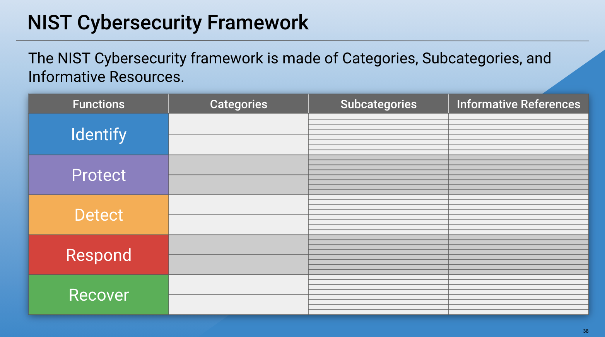
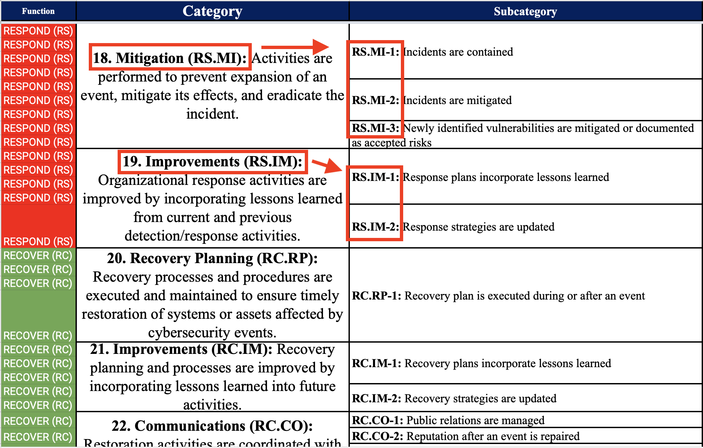

## 2.3 Lesson Plan: Governance Frameworks, Compliance, and BCP/DR

### Overview

In the final class in the GRC unit, we will cover policy, compliance, and business continuity planning / disaster recovery. Students will familiarizes themselves with these topics via activities around the GeldCorp scenario.

### Class Objectives

By the end of this class, students will be able to:

- Explain how organizations use policy and procedure to formalize standards of "right" and "wrong."

- Use governance frameworks to determine which policies an organization must develop.

- Explain how business continuity planning and disaster recovery ensure business and mission critical functions in the event of a disruption.


### Instructor Notes

In 06. Student Do: CEO Interview, you will act the role of a CEO and respond to questions posed by students regarding the security posture of your fictional business. 

- Questions will correspond to [NIST Cybersecurity Framework](https://www.nist.gov/system/files/documents/cyberframework/cybersecurity-framework-021214.pdf), especially the framework starting at page 18. 

- You will be required to improvise answers. Your answers should be demonstrable of a combination of good and bad security practices. 

### Slideshow and Time Tracker

The class slides are available on Google Drive here: [2.3 Slides](https://docs.google.com/presentation/d/1ZGr2tV0wk7rX7LDzq0bsiuBOaQVH-eZwFtLxkzFLWww/edit#slide=id.gcb76b091db_0_1141)

- To add slides to the student-facing repository, download the slides as a PDF by navigating to File > "Download as" and choose "PDF document." Then, add the PDF file to your class repository along with other necessary files.

- **Note:** Editing access is not available for this document. If you or your students wish to modify the slides, please create a copy by navigating to File > "Make a copy...".

The time tracker is available on Google Drive here: [2.3 Time Tracker](https://docs.google.com/spreadsheets/d/1RKy_tQXA4UdF4pO0AD_N7AlMenfKAam9k2CbzY2olHY/edit#gid=1047115118)

### Student Guide

- Send class the student facing version of the lesson plan: [2.3 Student Guide](StudentGuide.md)


---

### 01. Instructor Do: Welcome and Overview (0:05)

Welcome students to class, and review what's been covered thus far:
  - **Day 1** discussed the structure of the security organization, and the importance of a strong security culture.
  - **Day 2** introduced threat modeling and risk analysis.

Explain that today's class will introduce students to governance, compliance, and business continuity planning and disaster recovery.
  - **Governance** is concerned with codifying and enforcing proper behavior and operations. Governance is the field in which standards of "right" and "wrong" are established and enforced.

  - **Compliance** is about enforcing the policies necessary to meet those standards.

Emphasize that knowledge of governance, compliance, and BCP/DR is crucial for all security professionals. Most of what security professionals do is mandated by governance policies and subject to compliance audits.


Today's class will cover the following topics:

  - Codifying Rules with Policy and Procedures
  - Using Governance Frameworks to Guide Policy Decisions
  - Risk Management within an IT Organization.
  - Business Continuity Planning and Disaster Recovery
  - Describing BCP/DR Recommendations for an Organization


Take a moment to address questions before proceeding.

### 02. Instructor Do: Codifying and Enforcing Behavior with Policies and Procedures (0:15)

Remind students that the week began by developing a training plan to improve GeldCorp's security culture. This training plan was meant to protect the organization by changing employee behavior.

- The training exercise defined what employees _should_ do when faced with suspicious links. In other words, it defined the "right" behavior.

Explain that a rule that defines the "right" behavior is called a **policy**. Organizations use policies to define standards for behavior and operations.

-  Each individual policy is just one rule. In practice, organizations will have many policies, and therefore many rules, to support a given goal.
- For example, a company must have many security policies in place to protect its data.

Explain that guidelines for which kinds of policies an organization should have in place are called **governance frameworks**. Governance frameworks describe what a company must do to remain compliant with federal regulations and industry standards.

Today, we'll explore these concepts  by:
- Defining formal policies for GeldCorp.
- Assessing what user data collected by GeldCorp is subject to GDPR and PCI.
- Determining whether GeldCorp's data collection practices are GDPR and PCI compliant.

Take a moment to address questions before proceeding.

#### Using Organizational Goals to Define Policies

Remind students that they developed their training plan by setting a goal and determining the necessary steps to achieve it.

- The training plan prescribed a specific rule that employees should follow. For example: "Do _not_ click on links to domains outside of the corporate intranet."

- This rule is an example of a **policy**, which is a course of action proposed by a business. In this case, the rule specifies a download policy.

- Remind students that the goal of defining and implementing a new download policy was to reduce employee click-through rate to less than five percent. In other words, the business implemented policy as a means of achieving this goal.

Explain that such business goals often drive the development of policies. There are two general categories of business goals:

- **Internal/Volitional**: Targets that the business sets in its own interest. For example, an organization might aim to reduce long-term security expenses to less than $400,000.

- **External/Imposed**: These are targets that the business must hit because they will suffer consequences if they do not. Examples include requiring e-merchants to handle all credit card transactions securely or face legal consequences if they experience a breach of customer PII (personally identifiable information).

Let students know that this lecture will focus on volitional objectives. Students will study imposed objectives in the next section.

#### Internal Objectives and Policies

Present the following example:

Suppose we want to reduce unauthorized root-level login incidents on domain controllers to zero:

- Explain that an organization that adopts such a policy would hand it off the IT team, who would be responsible for determining how best to implement it.

- One possible implementation is to require all domain administrators to use strong passwords and force them to create a new password every month.

- Explain that a password policy might require that administrators create passwords with:
  - At least 16 characters.
  - At least one letter and one number.
  - At least one special character (`'`, `(`, `]`, etc.).

- Additionally, explain that the password policy could require that passwords do not contain any portion of the administrator's username, and that new, strong passwords are created every month.

Point out that this policy defines clear standards of behavior: 
  - Administrators are expected to follow very specific rules when creating passwords, which their computers will enforce. 

  - And, these rules are specifically designed to achieve the goal of reducing the incidence of unauthorized root-level logins on domain controllers to zero.

Present the below example of a completed password policy:

  ```md
  DATE: 5/17/2017
  AUTHOR: Jane Author

  DOMAIN ADMINISTRATOR PASSWORD POLICY
  This document lays out a password policy for Domain Administrators.

  PURPOSE
  The purpose of implementing a Domain Administrator password policy is to reduce the incidence of unauthorized root-level logins on Domain Controllers.

  The organization has prioritized this objective in the interest of protecting the integrity and confidentiality of data on the corporate intranet.

  POLICY DESCRIPTION
  Domain Administrators will be required to create a new strong password every month. This password MUST NOT include any substring of the Domain Administrator's username.

  In addition, the password must include:
  - At least 16 characters.
  - At least 1 letter and 1 number.
  - At least 1 special character (`'`, `(`, `]`, etc.)

  For example, the following passwords are legal for the user guest:

  - CloGyPTioNEntEDist5$
  - coffee&Donuts975
  - n0tparticularly!strong

  The following password is illegal:
  - `gue1st12345678901342`


  ENFORCEMENT
  All workstations on the corporate domain have been configured to force Administrators to adhere to the above password complexity constraints and refresh intervals.

  Non-compliant passwords will be rejected by the operating system.

  MONITORING
  All attempts to log in as a Domain Administrator, both remote and local, will be monitored.
  ```

- Point out that this policy still does not guarantee strong passwords:

  For example, `n0tparticularly!strong` is legal, but easy to crack. It is up to policy developers to determine whether a policy is secure enough.

Let students know that they will have an opportunity to define a policy to support one of GeldCorp's volitional goals in the next activity.

Take a moment to address questions before proceeding.

### 03. Student Do: Documenting Company Policies (0:20)

Explain the following to students:

- In the previous class, you performed a risk analysis to help GeldCorp gain visibility into its most prominent threats. Since then, they've used your results to set numerous internal security goals.

- In this activity, you will develop a policy for one of these goals. You will choose from a list of three options.

:globe_with_meridians: This activity will use breakout rooms. Assign students into groups of 2-3 and move them into breakout rooms. 

Send students the following activity file:  
- [Activity File: Documenting Company Policies](./Activities/03_Documenting_Company_Policies/Unsolved/README.md)

### 04. Instructor Review: Documenting Company Policies Activity (0:15)

:bar_chart: Using [Zoom's](https://support.zoom.us/hc/en-us/articles/213756303-Polling-for-meetings) or [Slack's](https://slack.com/help/articles/229002507-Create-a-poll-) poll feature, conduct a comprehension check and evaluate how well students completed the activity. 

To review the activity, facilitate a discussion about policies addressing the goals. 

Call on groups to present their findings and ask other students to pose critical questions that examine the soundness of the policies.

Share the following solution file after the discussion:  
- [Solution Guide: Documenting Company Policies](./Activities/03_Documenting_Company_Policies/Solved/Readme.md)  

### 05. Instructor Do: Managing Risk in IT Organizations (0:25)

Point out that internal policies often support business goals, such as guaranteeing 99% uptime. 

- However, businesses often have to follow rules that they don't necessarily set for themselves. 

- Such rules may not directly benefit the business, but rather, may be mandated by regulations, laws, or industry standards.
 
As information security professionals, it is important to understand the distinctions between **laws**, **regulations**, **policies**, **guidelines**, and **frameworks**. All of these will help guide your decision making process in everything you do.
 
#### Policies
 
Explain that a policy is a set of ideas or plans that inform decision making within business, government, politics, or economics.
 
Examples of policies include:
 
- **Bring Your Own Device (BYOD)** is a non-intrusive policy adopted by organizations that specifically defines the acceptable use of non-company owned devices. Devices referenced in this policy may include personally owned devices such as desktop computers, routers, switches, test measurement equipment, and weather equipment.
 
- **Mobile Device Management (MDM)** is an example of a restrictive or intrusive policy that is a subset of a BYOD policy. MDM is an **acceptable use policy** related to personally owned mobile devices. Devices referenced in this policy include cell phones, laptops, and WiFi hotspots.
 
:question: **Ask class**: Can anyone think of circumstances in which an organization would require a mobile device management policy?

  - **Answer**: Any company that has a remote workforce.

#### Guidelines
 
Explain that a guideline is similar to a rule. Guidelines are issued by organizations to make the actions of its employees or departments more predictable and, presumably, higher quality.
 
 - Guidelines are not mandatory. They are suggestions meant to be followed by those to which they apply.

 
#### Laws
 
Explain that laws are policies that are written in legal language, voted on, and passed by legislative bodies of government.

Laws are enforced by agencies who are tasked with overseeing and monitoring the rules of law. 

- One such organization is the **Security and Exchange Commission** (**SEC**).
  
  - Governance frameworks codify standards that all businesses should follow. 
   
  - In the United States, these frameworks come from statutes (laws passed by Congress) adopted by the SEC, the regulatory body in charge of enforcing and proposing laws about financial instruments (stocks, bonds, options, etc.), and protecting consumers from fraud.
 
  - In the 1990s, the internet grew explosively, leading to the emergence of cybercrime. During the 90s, the SEC worked with Congress to pass anti-fraud statutes to discourage cybercrime.
 
  - **Note:** An anti-fraud statute, in our context, is a law criminalizing the use of technology to commit fraud.
 
- Since businesses in different industries manage different kinds of data, they must meet these obligations in different ways. This is why there are different laws for different industries. You should be aware of some of these, including:

  - **The Family Educational Rights and Privacy Act (FERPA)** protects the privacy of student educational records. Parents or eligible students have the right to request that records be corrected if they believe they are misleading and/or inaccurate.

  - **Gramm-Leach-Bliley Act (GLBA)** requires financial institutions who provide consumers financial products and services to provide an explanation of their information-sharing practices to safeguard sensitive data.

  - **Federal Information Security Management Act of 2002 (FISMA)** defines the framework for protecting government data, operations, and assets against natural or man-made threats.
 
  - **Health Insurance Portability and Accountability Act (HIPAA)** regulates the flow of healthcare information and defines how personally identifiable information (PII) must be protected from misuse and theft within the healthcare industry.
 
    - Any organization that collects, stores, administers, or provides PII is obligated to abide by HIPPA. This includes such organizations as health maintenance organizations (HMOs), dental offices, optometrist practices, and chiropractic offices.
 
#### Regulations
 
Explain that regulations are detailed instructions for how to enforce laws.

- Sometimes referred to as administrative laws, regulations are legally required and their application is mandatory.

- Legislative bodies pass laws, and government agencies create regulations that implement the laws.

Emphasize that the difference between laws and regulations are:

  - Laws govern everyone equally. 

  - Regulations only affect organizations whose operations are directly enforced by the regulation, i.e., SOX and GDPR, which we'll discuss next.

Point out some of the more popular regulations within information security:

- **Sarbanes Oxley (SOX)**, a result of the Enron and WorldCom scandal, holds corporate officers, board members, and executive management responsible if the organization they represent is not compliant with a law. Noncompliance includes negligence and failure to implement any recommended precautions. Due diligence and due care must be demonstrated at all times.
 
  - **Due diligence** is, for example, when a company or individual properly investigates all of the possible weaknesses and vulnerabilities, in order to fully understand threats.
 
  - **Due care** is, for example, when a company has done all it can reasonably do to prevent a security breach, compromise, or disaster, and implemented the necessary countermeasures, such as security controls (safeguards).
 
- **General Data Protection Regulation (GDPR)** protects the private data of all citizens of the European Union (EU) and European Economic Area (EEA). It requires organizations that process data belonging to EU citizens to protect the data sufficiently. GDPR regulations apply to organizations based in the EU, as well as those based elsewhere that process data belonging to EU citizens.
 
Let students know that they'll learn more about individual regulations on the job, but the ones that they need to know specifically depend on the industry they work in.

:question: **Ask class**: Can anyone describe the difference between a regulation and a law?

  - **Answer**: Laws govern each person equally. Regulations affect organizations or entities whose operations, such as the protection of data, require specific vigilance.

#### Standards
 
Explain that standards are published specifications used to establish a common language and technical criteria across an organization or industry.
 
- For example, merchants that process financial transactions are legally required to comply with the **Payment Card Industry Data Security Standard** (**PCI-DSS**) to help guarantee that their customers' data remains confidential. If a company suffers a breach that results in the disclosure of customer PII, they may have to pay large fines and/or face other legal penalties.
 

#### Risk Management Frameworks

Explain that a risk management framework (RMF) is a set of standards developed by the **National Institute of Standards and Technology** (**NIST**). 

- Point out that the RMF is explicitly covered in the following NIST publications and encourage students to read them after class. 

  - [Special Publication 800-37r2](https://nvlpubs.nist.gov/nistpubs/SpecialPublications/NIST.SP.800-37r2.pdf), “Risk Management Framework for Information Systems and Organizations” describes the formal RMF certification and accreditation process.

  - [Special Publication 800-53](https://nvlpubs.nist.gov/nistpubs/specialpublications/nist.sp.800-53r4.pdf), “Security and Privacy Controls for Federal Information Systems and Organizations” describes a structured process for selecting system security controls and integrating them as part of an organizational risk management program.

Explain that a properly implemented information security framework allows security professionals to more intelligently manage cyber risks within their organizations.
 
- Frameworks consist of various documents that clearly define adopted procedures, policies, and processes followed by an organization. 
 
- Having an information security framework in place reduces an organization's risk and exposure to vulnerabilities.
 
Other advantages of establishing a solid information security framework include:
 
 - Instills confidence in your industry.
 - Establishes a strong reputation with business partners.
 - Provides a reputable relationship with customers.

Point out that NIST produces one of the most commonly used cybersecurity frameworks today. We'll discuss NIST in greater detail next.

#### National Institute of Standards and Technology (NIST)
 
NIST is a federal agency in the United States Department of Commerce.
 
- NIST’s mission is to develop and promote standards, measurements, and technology that enhances productivity, facilitates trade, and improves quality of life.
 
- Since 2014, the [NIST Cybersecurity Framework](https://www.nist.gov/cyberframework) has provided guidance for critical infrastructure so organizations can better manage and reduce cybersecurity risks.

Explain that at the core of the framework is a set of actions that enable specific outcomes. The framework core isn't a checklist, rather it provides a set of key cybersecurity outcomes to work towards. 
 
The core of the framework includes four elements: 
 
 - **Functions:** Identify, Protect, Detect, Respond, and Recover. These functions aid in the expression of cybersecurity risk management by organizing information that enables risk management decisions. Functions also align with current methodologies for incident management.
 
 - **Categories:** Subdivisions of functions. These are grouped cybersecurity outcomes that are closely related to specific needs and activities. 
   - Examples include Detection Processes, Access Control, and Asset Management.
 
 - **Subcategories:** Divides categories further into specific outcomes of specific activities. The results of of this subset lead to the achievement of outcomes within each category.
 
 - **Informative References:** Specific sections of guidelines, standards, and practices that describe methods for achieving outcomes in each subcategory. 

   

Next we'll take a look at how an organization would implement the adoption of the NIST RMF.

- The image below contains a snippet of a security control category from the NIST RMF for response (RS)  and recover (RC).

  - If an organization wanted to include any of these security controls in their local policies, they would adopt the use of the category and subcategory codes along with the associated language. It could be as easy as a copy and paste.

   

- For example: An organization has just recovered from an attack. The organization must now consider what can they can do to mitigate this attack from happening again.

    - The organization decides to incorporate "lessons learned" as part of their incident response. They will adopt and incorporate a security control from the **Improvements** category of the NIST RMF with a subcategory of **RS.IM-1**.
  
      - **Improvements (RS.IM):** Organizational response activities are improved by incorporating lessons learned from current and previous detection/response activities.

       - **RS.IM-1**: Response plans incorporate lessons learned.


 
- Emphasize that an RMF is a set of documents that define best practices that an organization voluntarily follows to manage its cybersecurity risks most efficiently.
 
- Point out that RMFs are completely voluntary and designed to increase the resiliency of an organization’s defenses.

:question: **Ask class**: Can anyone think of two advantages of implementing a risk management framework?

  - **Answer**: Three examples are: instills confidence in your industry,  establishes a strong reputation with business partners, and provides a reputable relationship with customers.
 
Explain that we'll explore the NIST Cybersecurity Framework in the following activity.
 
Take a moment to address questions before proceeding.

### 06. Student Do: Introduction to CEO Interviews and Question Prep (0:10)

Explain the following: 

- In this activity, you will play the role of a security consultant for a new online auction company, E-Auctions.com.

- You are tasked with determining E-Auctions.com's security posture before they launch their business later this year.

- You'll accomplish this by conducting an interview with the CEO of E-Auctions.com. Your instructor will play the role of CEO. 

- You and your classmates will each develop one question and then take turns asking the CEO about E-Auctions.com's security posture. 

Students will be assigned a number between 1 and 22. 

   - This number will correspond to a NIST category. 

   - You will develop one question relevant to the NIST category you are assigned.

   - NIST documentation is provided so you can learn about your category and subcategories. 


#### Instructor Notes

- In this activity, you will be role playing the CEO of E-Auctions.com. 

- This activity will involve improvising the answers to all the questions your students come up with.
  
- Your responses should contain answers that suggest a range of good and bad security practices at E-Auctions.com. 

  - For example, if you are asked "What is your disaster recovery plan?"
      - A **good** answer could be: "We have developed a comprehensive DR plan with hot sites." 
      - A **poor** answer could be: "We don't have one yet," or "We don't need one, since disasters are unlikely to occur."

- If there is a question you do not have an answer to, it is acceptable to simply say "I don't know." Emphasize that CEOs often do not know everything about their company's security posture.


#### Assign Numbers 

Assign each student a number between 1 and 22.  Explain that students will use this number to determine which NIST category they base their question on.   
    
   - If your class has more than 22 students, assign the same number to more than one student. Each category has multiple subcategories.
    
Send students the following files:  

- [Activity File: CEO Interviews](Activities/06_CEO_Interviews/README.md)

- [NIST Framework for Improving Critical Infrastructure Cybersecurity Core](https://docs.google.com/spreadsheets/d/1cPaPyNTsl07T928rOmObw_mlk1jQ89radwEbtAs80Mc/edit#gid=822421512)

Class should take five to seven minutes to create one question.

### 07. Everyone Do: CEO Interviews (0:25)

#### CEO Interview

| :warning: Large Class Consideration :warning: |
|:-:|
| If your class is large, it is recommended that you ask students to Slack their questions to you. Answer questions until the 25 minutes is up. |

Once students are finished creating their questions, begin the CEO interviews:

 - Introduce yourself as the CEO of E-Auctions.com and explain that you are looking forward to being transparent and answering all of their questions to determine if E-Auctions.com is secure enough to launch.

 - Call on each student, one at a time, so they can ask their question.

 - Improvise the answer to each student question with an assortment of good and bad answers.
  
- Be aware of the time and try to fit in each student's question. 
   
#### Class Discussions
  
After the CEO interviews, open up the discussion to class. Pose the following questions:  

  - Based on the CEO's answers, do you believe E-Auctions.com is secure and ready to start their business?

  - If not, what are the major vulnerabilities that need to be addressed? How would you recommend they address them?

  - What are some of the good security measures that E-Auctions.com is already taking?

Summarize this activity by explaining the following:

  - The NIST framework can help a business make good decisions to improve their security posture and become compliant with various laws.

  - In the real world, businesses often make some good and some bad security decisions for their business.
 
Answer any remaining questions before proceeding to the break.

### 08. Break (0:10)

### 09. Instructor Do: Contingency Planning for Business Continuity and Disaster Recovery (0:15)

Point out that even with all of the measures put in place by governance and compliance, it's not guaranteed that an organization will not experience a breach. This is why businesses engage in contingency planning to "plan for the worst."

Point out that organizations need to be ready for any disturbances that can lead to interruptions or completely stop their operations.

- We’ve discussed controls as a way to mitigate threats, vulnerabilities, and risks. But organizations also simultaneously need to think on a larger scale about building an infrastructure that can minimize the impact on critical functions.

- Contingency planning not only takes into account technology and information systems, but also the larger business processes, employees, and facility requirements.

A breach can have one of two results:

  - **Mild/Moderate Breach**: The business has been impacted, but can still handle day-to-day operations at greater cost.

  - **Serious/Catastrophic Breach**: The business has been impacted so severely that it cannot operate. Instead, it must use its resources to _contain_ the incident, _recover_ from the disaster, and eventually _return_ to operation.


Business continuity planning (BCP) and disaster recovery (DR) planning produce contingency plans in case of a disruption or disaster, and ensure that the business can get back on its feet and remain operational.

- Ask students for examples of disruptions or disasters. Possible answers include: cyberattacks, human errors, and environmental disasters, such as earthquakes and fires.

- As it relates to the CIA triad, contingency planning is focused primarily on ensuring the availability of information, including timely and reliable access to it.

It is important to note the differences between BCP and DR:

- Business continuity planning focus on processes and procedures that an organization needs to consider in order to ensure that critical functions continue both during and after a disaster. 
  - Since this takes into consideration business processes, business continuity involves much more comprehensive and thorough planning to ensure an organization’s long-term success.

- Disaster recovery is more focused on the specific steps that a organization needs to take to resume work after a disaster. It is concerned more with the technology and information infrastructure and related complexities.

  - For example, some of the concerns for DR are how information systems and their operations can be moved to another location following an incident, how information is backed up, and the costs associated with equipment replacement.

#### Contingency Planning

Point out that both BCP and DR begin with a contingency planning policy and business impact analysis.

- Refer to this description taken from from the  [NIST Contingency Planning Guide for Federal Information Systems](<https://nvlpubs.nist.gov/nistpubs/Legacy/SP/nistspecialpublication800-34r1.pdf>):

  - Contingency planning considerations and strategies address the impact level of the availability security objective of information systems.

  - Strategies for high-impact information systems should consider high availability and redundancy options in their design. Options may include fully redundant load balanced systems at alternate sites, data mirroring, and offsite database replication.

  - High-availability options are normally expensive to set up, operate, and maintain and should be considered only for those high-impact information systems categorized with a high-availability security objective.

  - Lower-impact information systems may be able to use less expensive contingency options and tolerate longer downtimes for recovery or restoration of data.


Refer to the below information regarding impact levels taken directly from the [NIST Contingency Planning Guide for Federal Information Systems](<https://nvlpubs.nist.gov/nistpubs/Legacy/SP/nistspecialpublication800-34r1.pdf>):

- If the potential impact is LOW, the loss of confidentiality, integrity, or availability could be expected to have a limited adverse effect on organizational operations, organizational assets, or individuals.

- If the potential impact is MODERATE, the loss of confidentiality, integrity, or availability could be expected to have a serious adverse effect on organizational operations, organizational assets, or individuals.

- If the potential impact is HIGH,  the loss of confidentiality, integrity, or availability could be expected to have a severe or catastrophic adverse effect on organizational operations, organizational assets, or individuals.

Contingency planning should result in a **contingency policy statement**. This establishes the larger organizational framework and responsibilities related to maintaining confidentiality, integrity, and availability of data, and the impact level to those objectives in the event of a disruption.

- Additionally, a policy statement also considers roles and responsibilities of an emergency response team, resource requirements, training requirements such as exercise and testing schedules, and schedules for maintaining the plan.

#### Business Impact Analysis

Explain that the first step in BCP and DR planning is to conduct a **business impact analysis (BIA)** and risk assessment. We covered many aspects of risk analysis in the previous class.

- Conducting a BIA is a lengthy process and outside the scope of today's class. Typically, it is a multiphase process that involves gathering and evaluating information, and preparing a report for senior management.

- The goals of BIA include:

  - Identify key processes and functions of the business.
  - Establish a detailed list of requirements for business recovery.
  - Determine what the resource interdependencies are.
  - Determine the impact on daily operations.
  - Develop priorities and classification of business processes and functions.
  - Develop recovery time requirements.
  - Determine financial, operational, and legal impacts of disruption.

The results of the BIA will impact how the DR plan develops. In particular, there are two specific BIA metrics that will impact the disaster recovery plan.

- **Recovery Point Objective (RPO**): The amount of data that a mission/business process data can afford to lose (taking into account the most recent backup of the data) following a disruption or system outage.

  - For example, if your company performs weekly backups, they have determined that they can tolerate and recover from a week’s loss of data.

- **Maximum Tolerable Downtime (MTD)**: The total amount of downtime that a system can be unavailable to users and the business. Within the time span of MTD, there are two other metrics:

  - **Recovery Time Objective (RTO)**: The maximum tolerable amount of time needed to bring all critical systems back online after a disaster.

  - **Work Recovery Time (WRT)**: The remaining time from the MTD after RTO. For example, if the MTD is four days and the RTO is one day, the WRT needed to get everything up and running again is three days. 
    - The longer the MTD, the more costly it is to the business. 
    - Shorter RTOs mean more costs will need to be allotted to recovery efforts.

Point out that disaster recovery plans will vary by organization. Recovery priorities are dependent on the above metrics as well as outage impacts, resource availability, and costs.

One last major consideration for disaster recovery is having alternate sites to house critical data and technology functions. While rare, disasters may require operations be moved to an alternate site. The facility will need to support the operations established in the contingency plan.

- There are three common types of alternate sites: hot sites, cold sites, and warm sites.

  - A hot site is one that is ready to go and running at all time, and and can immediately continue operations. It will have equipment set up with current available data. While costly, hot sites are important to have for mission-critical data.

  - A cold site is a space with very little set up. These are typically not set up until a disaster occurs, and there should be a strategy in place for rapid setup. While the costs of maintaining a cold site are less expensive, these are not ideal for mission-critical data.

  - A warm site is in-between. For example, servers, hardware, software, and other equipment might be set up but not be loaded with the latest data. There should be a plan for getting this data in place.

- Let students know that comprehensive business continuity planning and disaster recovery is outside of the scope of this course. In the following activity, students will think of a high-level disaster recovery plan for GeldCorp.

Take a moment to address questions before proceeding to the final activity of the day.


### 10. Student Do: Disaster Recovery Planning for GeldCorp (0:20)

Explain the following to students:

* In this activity, you will continue to work in groups to create a high-level disaster recovery plan for GeldCorp.

* A full DR plan is a multiphase project that can take several weeks to complete. For this activity, you will focus on some of the high-level details.

* The goal is to think like a security professional and get a better understanding of the complexities involved in DR planning.

:globe_with_meridians: Students should stay in the same breakout room groups as the 03. Documenting Company Policies activity. 


Send students the following activity file:

- [Activity File: Disaster Recovery Planning](./Activities/13_DR_Planning/README.md)

### 11. Instructor Review: Disaster Recovery Planning for GeldCorp Activity (0:10)

:bar_chart: Using [Zoom's](https://support.zoom.us/hc/en-us/articles/213756303-Polling-for-meetings) or [Slack's](https://slack.com/help/articles/229002507-Create-a-poll-) poll feature, conduct a comprehension check and evaluate how well students completed the activity. 

There is no formal solution for this activity, as students will have different DR plans. Instead, facilitate a discussion using the following questions:

* What details of GeldCorp were relevant to DR planning?

  * For example, since GeldCorp uses vendors, the organization has to think about third-party agreements and service-level agreements for aspects of DR, such as the alternate backup site.

  * If all data is stored in one location, then backup strategies and procedures are critical.

  * Lack of security awareness means that training for the plan is crucial.

* What factors did students consider when establishing RTO, MTD, and RPO?

* How did these measurements impact disaster recovery priorities?

* How did student determine frequency of training, who should be involved, and what should go into the training?

* How did students determine the various stakeholders who should be involved in DR planning?

If students want to compare their work, suggest that they share results between classmates.

### 12. Wrap-Up and Summary (0:05)

Explain that we've covered a lot of material this week.
 
Point of the following key takeaways:
 
- It's useful for security professionals, in an effort to foster more effective communications, to have an understanding of the roles and responsibilities of C-suite corporate executives.
- We discussed the responsibilities of the security department and interdepartmental communications.
- We also discussed how to properly identify appropriate security controls for a given resource and situation.
- We also learned how to prioritize risks based on likelihood and impact potential through the use of risk management spreadsheets.
- As an information security professional, it's important to use governance frameworks to determine which policies an organization must develop.
- Developing business continuity and disaster recovery plans is a critical skill to help foster fast recoveries during outages.
 
Point out that next week, we will use our Vagrant installations to perform basic commands using the command line in Ubuntu Linux.
 
:warning: **Homework Note**: Submissions will vary for this week's homework. Therefore, there isn't a standard solution guide. Instead, you can use the general grading rubric as a guide and focus on students' critical thinking abilities and creativity. 
 
Pause to answer any remaining questions before ending class.

---

© 2020 Trilogy Education Services, a 2U, Inc. brand. All Rights Reserved.
