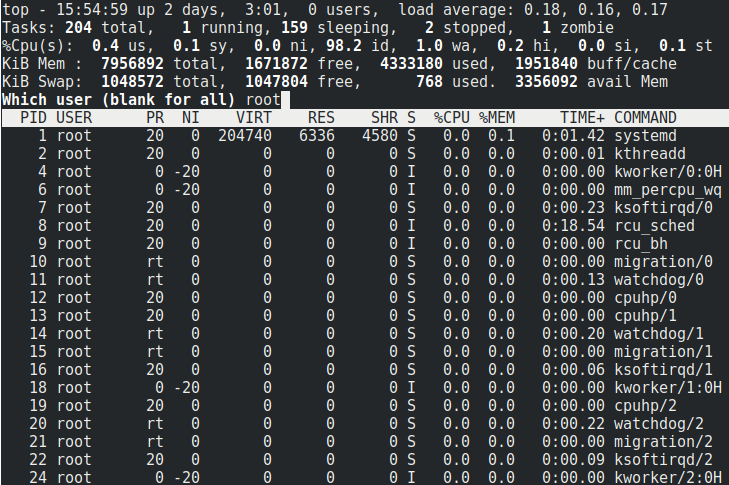
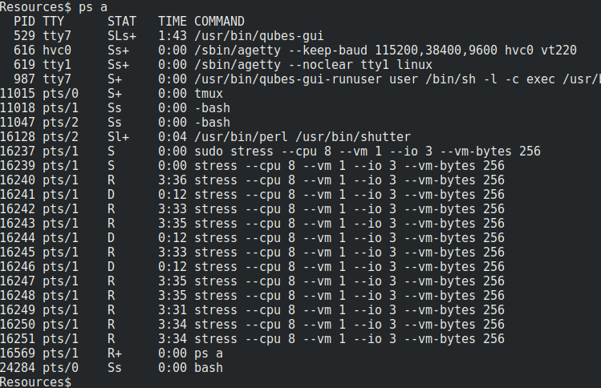

## 4.1 Lesson Plan: Introduction to Linux

### Class Overview

This week, students will work through a series of command-line exercises in which they will explore a Linux file system, collect evidence of a security breach, audit and reconfigure a Linux machine's user and group permissions, and take steps to harden the system.

Today's class will introduce students to the Linux operating system.


### Class Objectives

By the end of class students should be able to:

- Name three of the most important distributions of Linux.

- Navigate the Linux file structure by using the command line.

- Manage processes with the `top`, `ps`, and `kill` commands.

- Install packages by using `apt install`.

### Instructor Notes

- This class will be the first of three units in which we learn the fundamentals of the Linux operating system.

- This week, students will be investigating and troubleshooting a malfunctioning server.
  - Each activity includes instructions from a senior administrator with several actions to take.
  - Each lecture will prepare students to complete the activities.

- Be prepared to conduct activities as `root` or run `sudo` prior to demonstrations and activities. There may be instances requiring `sudo` that aren't called out in the instructions.

- In **05. Instructor Do: Linux File System Structure**, it is recommended to provide students with a [Linux filesystem structure diagram](https://www.google.com/search?q=linux+filesystem+structure+diagram&source=lnms&tbm=isch&sa=X&ved=2ahUKEwjVjfn9-crrAhWFneAKHTsECsoQ_AUoAXoECA8QAw&biw=1400&bih=686).

  - Additionally, the steps of walking through the audit of the directory structure are very time consuming, especially when copying and moving files. If time is an issue, then simply go over the directory structure and provide a high-level overview.


### Lab Environment

You will use your local Vagrant virtual machine for today's activities. Please note that instructors and students have different access credentials.

- Instructor access:
  - Username: `instructor`
  - Password: `instructor`

- Student access:
  - Username:`sysadmin`
  - Password: `cybersecurity`


### Slideshow

You can access the slides for today on Google Drive here: [4.1 Slides](https://docs.google.com/presentation/d/1HI73cjG9SolDervfsoYLs201N-q8LOWhgoH4x67mwJc).

- To add slides to the student-facing repository, download the slides as a PDF by navigating to File > "Download as" and choose "PDF document." Then, add the PDF file to your class repository along with other necessary files.

- **Note:** Editing access is not available for these document. If you or your students wish to modify the slides, please create a copy by navigating to File > "Make a copy...".

### Time Tracker

You can access the time tracker for today's lesson on Google Drive here: [4.1 Time Tracker](https://docs.google.com/spreadsheets/d/1OjjRuTsG-JJC02HyInFAPeXNpr0MrJeAK0IrkYf_6OI).


### Student Guide

Send the class a student-facing version of the lesson plan: [4.1 Student Guide](StudentGuide.md)

---
### 01. Instructor Do: So, Why Linux? (0:10)

Welcome students to the class and let them know that today's lesson will introduce the fundamental concepts and details of Linux systems.

Let students know that, while Linux is uncommon as an operating system on personal computers, it is widespread on the Internet and in enterprise networks: By some estimates, [over 70% of websites on the web run some variant of Unix](https://w3techs.com/technologies/overview/operating_system/all).

Point out that the ubiquity of Linux machines on modern networks makes them a common target for attackers. Therefore, familiarity with the operating system is crucial for cybersecurity professionals.

Emphasize that this knowledge is essential for the following technical roles, among others:

- **Help Desk/IT Support**: Help Desk and IT Support specialists often need to troubleshoot issues on Linux workstations. People in these roles often find themselves troubleshooting issues with macOS as well. Since macOS shares most of its structure with "classical" Linux operating systems, this knowledge is valuable even for personnel who are not in charge of configuring or managing machines themselves.

- **Systems Administration**: As most complex networks contain at least one Linux server, systems administrators need to understand how to audit, configure, and secure Linux servers and workstations.

- **Penetration Testing**: Again, most complex networks contain at least one Linux server, making them frequent targets for pentesters. Since pentesters must exploit machines to gain access, deep knowledge of how the operating system works and where it stores its most important files is essential.

- **Network Forensics**: Forensics specialists spend much of their time inspecting server logs. Often, these logs are generated by or stored on a Linux server, and forensic examiners must be able to navigate the file system. In addition, they must be careful not to inadvertently alter the file system while investigating, making knowledge of how and where data is stored on Linux machines a crucial element of the job.

Let students know that today's exercises will require them to investigate a malfunctioning Linux server, which users have reported is running slower than usual. Students will be tasked with identifying evidence of suspicious activity on the system, and then taking steps to contain it.

Explain that students will use the following methodology across the student activities:

- **Audit files.** You’ll begin by checking for suspicious files on the machine. To do this, you will learn how files are organized on Linux and where important system and user files are normally found. This will enable you to identify malicious files that seem "out of place."

- **Audit processes.** After identifying suspicious files, you will make note of which programs users are running. This will allow you to check that no one is running malicious software on the server.

- **Installing security packages.** Next, you will install security applications, also known as packages. These will help secure the machine from future attacks.

- **Configuring security services.** Finally, you will configure one of these packages, called Tripwire, to automatically notify us whenever someone saves suspicious files on the machine.

Explain that the skills covered will help them complete the activities.

- Take a moment to address questions before proceeding.

### 02. Instructor Do: Linux History and Distributions (0:10)

Provide a brief history of Unix and Linux by covering the following:

  - In 1969-1970, Dennis Ritchie, Kenneth Thompson, and several others at AT&T Bell Labs began developing a small operating system called **Unix**.

  - Within the next two decades, different updates and distributions of Unix were created. Most were proprietary.
  
  - In 1984 Richard Stallman's Free Software Foundation (FSF) started the GNU project, which created a free distribution of the Unix operating system. 

  - In 1991, Linus Torvalds used many of the components from the GNU project to create a free, open source operating system, which is now known as **Linux**.

Explain the following about operating systems in general, and Linux in particular:

- An **operating system**, or OS, is the software that supports a computer's basic functions, such as scheduling tasks, executing applications, and controlling peripherals.

- Windows, Mac OS X, and Linux are all examples of operating systems.

- Of these operating systems, Linux is by far the most commonly used on the Internet, and most enterprise networks feature at least one Linux machine.

Explain that this is because, unlike Windows and OS X, Linux is **free, open source software (FOSS)**.

- This means that anyone can read or modify its **source code**.

- Linux is free and open source specifically because Windows and Unix, Linux's early competitors, were not. In other words, Linux was developed for researchers and students in direct response to the fact that Windows and Unix were extremely expensive and/or inaccessible in the early days of computing.

- Today, most tools in the hacker/security community are still published as open-source and a belief in free software and free information is widespread in the industry. Almost all the tools students will use in class are open source, and nearly all technical security professionals are familiar with the Linux FOSS ecosystem.

- Because Linux is FOSS, many different people have developed their own special-purpose variants of the operating system. These variants are called **distributions**, or **distros**.

Explain the two most common distributions in use:

- There are many different distributions in use today. In this course, we will use two: **Ubuntu** and **Kali Linux**.

- Both Ubuntu and Kali Linux are distributions based on another distribution called **Debian**. Ubuntu is essentially Debian with customizations for general-purpose users, and Kali is Debian with customizations for security professionals.

- Since both distributions are based on Debian, everything students learn in this module will transfer directly to everything they learn about Kali in the latter half of the course.

Point out that one of the most important skills students will acquire in this module is comfort with the **command line**, which they will use extensively on both Ubuntu and Kali.

- Knowledge of the command line is particularly important in the professional world, because most production Linux servers don't even offer a graphical interface. They can only be used from the command line!

- Command line-only machines are called **headless servers**. Headless servers are the norm because, by today's standards, the command line requires very few resources. This gives the server maximum resources to run its services and applications. A GUI based system is neither required nor desirable.

- Being able to navigate a headless Linux server is the main reason students need to learn Linux and the bash command line. Reiterate that learning the bash command line environment will enable them to work with both Linux _and_ Unix systems, such as Mac OS X.

Let students know that the next exercise will familiarize them with the most popular Debian and Red Hat distributions in use today. This will help them identify Linux machines on networks they meet "in the wild," as well as determine which distributions to install when setting up networks on the job.

Ask the class if there are any questions before moving on.

### 03. Student Do: Distribution Research (0:15)

Explain the following :

- In this exercise, students will play the role of a **system administrator** at X Corp, which has recently experienced a number of breaches involving servers running outdated Linux distributions.

- In response, the IT Department has decided to upgrade the affected servers with newer distributions and versions of Linux.

- Students will be responsible for conducting research to determine which distribution is most appropriate for each machine.

Let students know that, while there are hundreds of distributions in use, this exercise will focus only on those they are likely to encounter on the job.

Send the students the following files:

  - [Activity File: Distribution Research](Activities/03_Distro_Research/Unsolved/README.md)


### 04. Instructor Review: Distribution Research (0:10)

:bar_chart: Run a comprehension check poll before reviewing the activity. 

Review the premise of the previous exercise:

- An attacker has breached X Corp's network by exploiting outdated Linux servers on the network.

- X Corp has decided to contain the breach by wiping the compromised machines, and installing newer, more secure distributions.

- Students were responsible for identifying which distributions were most appropriate for each machine.

Remind students that the specific machines they had to choose distributions for were:

- **Central Data Server**

- **Public Web Server**

- **IT Audit Workstation**

- **User Workstations**

Before going through the solutions, ask students which distribution they thought was most appropriate for each use case.

Then, explain the following solutions:

- Since the Central Data Server stores sensitive human resources data, it should use an intrinsically secure distribution. **Fedora** and **CentOS** use SELinux by default, making them good choices for this purpose.

- The Public Web Server needs to run quickly and handle large amounts of traffic. Many distributions could work, but **Ubuntu** and **Fedora** are amongst the best choices, because they are well-supported.

- The IT Audit Workstation should use **Kali Linux**, because it is specifically designed for performing security assessments.

- User Workstations should use **Ubuntu**, which comes with a GUI and basic productivity software, such as an email client, web browser, and text editor.

Next, review the answers to the general research questions provided below.

#### Questions & Answers

1.  Which distribution is most flexible and best suited for day-to-day and administrative tasks?
    - Ubuntu.

2. Which distribution is built specifically for penetration testers?
    - Kali.

3. Which distributions would you use to set up a web or data server?
    - Really, you could use any of them; however, Ubuntu Server and Fedora Server both have easy-to-configure web services. If you wanted to do things more manually, you could use Debian or CentOS.

4. What is the most widely used Linux desktop environment?
    - Ubuntu.
    
#### Bonus Questions    

1. What is a "headless server"?
    -  A command line only server without a desktop environment.

    1a. Does Ubuntu make a headless server variant? What about Fedora? CentOS?

      -  Yes, all three of them do.

2. What distribution is Ubuntu based on? What about Kali?
    -  They are both based on Debian.

3. Which distribution is CentOS based on? What about Fedora?
    -  They are both based on Red Hat.

4. What is SELinux? Which distributions implement SELinux by default?  
    -  SElinux is a built-in file permissions security enhancement developed by the NSA. CentOS and Fedora have it implemented by default.

5. If you were deciding between versions of Ubuntu Server and you wanted a version that was going to remain stable over time, what version would you choose?
    -  You would choose the "Long Term Support" or _LTS_ version. The latest version is one that will have continual updates and changes. The _LTS_ version will remain stable and only changes about once a year.

6. What are some security implications of using free and open source software or forks of popular Linux distributions?
    -  As demonstrated in the Mint OS article, _open source_ means that anyone can contribute. This makes it somewhat easy for an attacker with programing skills to attack. Because of this users must be vigilant about where they get their software.

#### Summary

Emphasize the following takeaways from this activity:

- Most Linux distributions are forks of Debian or Red Hat.

- Ubuntu is the most common general-purpose Linux distribution, while Kali is designed specifically for security professionals.

Let the students know that with these distros, they can accomplish most anything they will need with Linux.

Share the solution file with the students:
- [Solution Guide: Distribution Research](Activities/03_Distro_Research/Solved/README.md)

Take a moment to answer any remaining questions.

### 05. Instructor Do: Linux File System Structure (0:20)

Introduce the Linux file system structure by covering the following:

- All operating systems maintain certain conventions for where and how they store different kinds of files. For example, Windows and Mac machines typically place images in a `~/Pictures` folder. 

- Linux also has a conventional file system structure.

- These conventions are consistent across distributions. For example, user applications are typically stored in `/usr/bin`, and this will always be the case across distributions. 

- Students therefore can apply what they learn today to other distributions they encounter, as they all have the files and folders they will learn about today.

- In addition, all popular Linux distributions use the bash shell by default. This means that students can use the command line tools they learn here on other distros as well.

- Being able to use the same command line on many distributions is a major advantage, because GUI-based desktop environments are usually not the same across distros.
  - For example, Ubuntu and Fedora look very different, and need to be configured with different GUI tools, but the shell commands used to configure each machine are almost identical.

  - Understanding the command line allows administrators to work with any Linux machine using a bash shell, even if it has an unfamiliar desktop environment.

Reiterate that this means students will be able to use the skills they learn today to navigate any Linux server they come across.

Point out that once we master the Linux file system structure, we can better identify potentially malicious applications and files where they do not belong. Often, this indicates that the system has been compromised.

Explain that there are several conventional directories in Linux: 

- `/`: This is the **root** directory, which contains every other directory on the system.

- `/home`: This directory contains each user's private files. Users should not be able to save files anywhere else.

- `/etc`: This directory contains configuration files, which define how the machine should run and who is allowed to use it. For example, this directory includes information on registered users and their passwords.

- `/bin` and `/sbin`: These directories contain applications, such as web browsers, and commands, such as `ls`.

- `/var`: This directory contains files that change over time. For example, `/var/log` contains log files, which programs update frequently as they run.

- `/tmp`: This directory contains files that are only needed for a short period of time.

Mention that there are other important directories, such as `/proc` and `/boot`. However, these have very specific use cases, and are beyond the scope of today's lesson.

#### Tour of the Linux File Structure

Explain that we will now go through the Linux file system:

- Launch a terminal. 

- Explain that we will start at the top of the directory structure, the Root Directory

#### / Root Directory

Explain that `/` refers to the root directory - that is, the directory that contains every other directory. All files and folders are ultimately contained within the root directory.

- Run: `cd /`

- Run: `ls`

Your output should resemble the following:

```bash
$ cd /
$ ls 
bin  boot  cdrom dev  etc  home  initrd.img initrd.img.old lib lb32 lib64 lost+found media  mnt  opt  proc  root  run  sbin  snap srv swapfile sys tmp usr vagrant var vmlinuz
```

Indicate to students that each item listed here is a directory, because the main purpose of `/` is to store other crucial directories, not bare files.
- Because we are working within a VM, we have mounting provisioners such as `initrd.img`, `initrd.img.old`, `swapfile`, vagrant, and vmlinuz. Although we won't cover these in great detail, these files allow the Ubuntu virtual machine to communicate with our host machine.

Let students know that the next directory we'll explore is `/home`, where users store their own private data.

#### /home Directory

Introduce the `/home` directory by covering the following:

- Linux allows you to create multiple user accounts. This allows many people to use the machine at the same time.

- Each user is allowed to personalize their environment. For example, users can change their desktop backgrounds or install new software.

- The files that contain each user's personal preferences are called **local configurations**, or **configs**. These configurations only apply to the user who wrote them.

- Each user is given their own dedicated folder on the file system. This is where they store their own private files, folders, and local configurations.

- By default, users are only allowed to modify files and folders in their own dedicated directory. This means they cannot modify files in other users' directories, or in protected folders like `/`.

- These private directories are stored in `/home`.

Explain that the name of a user's private directory is the same as their username.

- For example, the user `sally` would have a directory at `/home/sally`, while the user `jack` would have a directory at `/home/jack`.

- Only active registered users should have private directories in `/home`. Directories belonging to users who have been deleted or who no longer use the computer should be deleted.

- Note: `root` is a special user, and root's home directory is not `/home/root`, but rather `/root`.

#### /etc Directory

Introduce the `/etc` and configuration files by covering the following:

- The `/etc` contains configuration files, which define how the machine should run and who is allowed to use it.

- While normal users can only modify their own local configurations, an administrator can make changes that apply to all users of the system.

- These are called **system-wide configurations**, and apply to every user on the system. For example, an administrator might configure a machine to prevent people from going to https://facebook.com.

- Configurations are typically stored as simple text files. Therefore, they can easily be inspected with familiar tools like `cat` and `less`.

Discuss `/etc/passwd` and `/etc/shadow` by covering the following: 

- The files `/etc/passwd` and `/etc/shadow` contain information about all registered users on the system.

- `/etc/passwd` contains a list of registered users on the system. Contrary to its name, it contains no information about user passwords.

- This means that attackers who steal `/etc/passwd` will get a list of users to attack, but will not be able to steal their passwords.

- By contrast, `/etc/shadow` contains both a list of usernames and information about their passwords.

- Specifically, it stores something called a **password hash**. This is a string that is different from the user's password, but the operating system can still use it to check that they've entered the correct password.

- Because hashes aren't passwords, they cannot be used to log in. Additionally, the process of turning a hash back into a password, called **password cracking**, is extremely time-consuming.

- This means that an attacker who steals `/etc/shadow` cannot break into user accounts without first spending the time to crack their passwords.

- In general, an attacker cannot crack strong passwords, but cracking passwords is much easier to do if the passwords are weak. 

- Since most users do not use strong passwords, an attacker who steals `/etc/shadow` is likely to be able to crack at least one of the passwords it contains.

- This makes `/etc/shadow` one of the **most important files** to protect on a Linux system.

Inform students that in the next class, we’ll begin with a password cracking activity that will use the `/etc/shadow` file. 

- Run `less /etc/passwd` to show the contents of `/etc/passwd`.

- Run `sudo less /etc/shadow` to show the contents of `/etc/shadow` .

Mention that we need `sudo` to read `/etc/shadow` because the permissions on that file are strict. `sudo` temporarily grants `root` permissions.

We will cover permissions in depth on Day 2 of this unit.

Explain the following about the output:

- This file appears nearly identical to `/etc/passwd`, with one stark difference: instead of an `x`, the second field contains a long, complex string, such as `$6$6Y/fI1nx$zQJj6AH9asTNfhxV7NoVgxByJyE.rVKK6tKXiOGNCfWBsrTGY7wtC6Cep6co9eVNkRFrpK6koXs1NU3AZQF8v/`.

  - This string is a password hash.

  - This hash cannot be used to log in, but can be cracked to retrieve the user's original password.

- If a row in `/etc/shadow` contains a `!` instead of a password hash, this means the account is locked.

- If a row in `/etc/shadow` contains a `*` instead of a password hash, this means the user is not allowed to login.
  - Explain that this is usually implemented on a user reserved for the system, and not a human user.

Ask students if they have any questions before proceeding.

#### /sbin and /bin Directories

Explain that now we’ll look into several directories that contain program files that run on your Linux distribution.

Introduce program files by covering the following: 

- Every application or command you run on a Linux system is a program whose code is stored in files.

- Files containing programs are unique because you can run them. This is in contrast to other, "normal" files, such as PDFs, which you can only read and write.

- Files you can run are called "executable files" because they execute some task.

- All software, including malware, is stored in executable files.

- Malware files can be dangerous because there is nothing preventing them from doing things that might harm the system.

Introduce `/bin` and `/sbin` by covering the following: 

- Executables can be stored anywhere on the file system, but the two main directories that store commands are `/sbin` and `/bin`.

- `bin` stands for "binary," because executable files contain "machine code." This is code written in 1s and 0s, which is not readable by humans.

- The `/bin` directory contains programs used by average users, such as `ls` and `cp`.

- The `/sbin` directory contains programs used by administrators, such as `adduser`, which can add users to a system, and `passwd`, which is used to change a user's password.

- Run `ls /bin` to display the contents of `/bin`. 

- Run `ls /sbin` to display the contents of `/sbin`.

Output should resemble the following:

  ```bash
  $ ls /bin
bash          cp             grep        ls              ntfs-3g.probe  ps          systemd                         unicode_start
bunzip2       cpio           gunzip      lsblk           ntfscat        pwd         systemd-ask-password            vdir
busybox       dash           gzexe       lsmod           ntfscluster    rbash       systemd-
...
  ```

Display the contents of `/sbin` by running `ls /sbin`:

  ```bash
  $ ls /sbin
  acpi_available        e2image       ifdown             lvdisplay    mkfs.vfat          pvresize           unix_chkpwd
  agetty                e2label       ifquery            lvextend     mkhomedir_helper   pvs                unix_update
  apm_available         e2undo        ifup               lvm          mkntfs             
  ```

Pause and ask if the students have any questions about these directories

#### /var Directory

Remind students that many programs save information about errors or suspicious behavior in **log files**. These log files often contain valuable evidence about malicious activity.

Explain that, since the list of installed programs seems fine, you'll proceed to verify that these programs are saving the expected logs.

Cover the following about log files and `/var`:

- Log files change constantly, because programs that keep them add information to them as they run. This means these files are _variable_; in other words, they change over time.

- Files that change over time are stored in `/var`, for "variable."

- Log files are stored in their own directory, called `/var/log`.

- Other types of variable files are stored in `/var`, but they will not be discussed in today's class.

- Explain that Linux systems may contain the following logs:

  - `/var/log/ufw.log`: Stores firewall logs, which include attempts by users to visit unauthorized sites. 

  - `/var/log/auth.log`: Stores failed login attempts when a user is trying to log in as the root user.

- Run `ls /var/log` to display the directory's contents. You should see some of the following logs:

  ```bash
  $ ls /var/log
  alternatives.log  btmp  kern.log  syslog   apport.log  dpkg.log  auth.log
  ```

  - You should not have a `ufw.log`.

  - Mention that this listing reveals the server is _not_ maintaining firewall logs, but _is_ saving records about failed login attempts.

  - This means you do not know if users have visited malicious websites, but you can tell if anyone has tried and failed to log in as an administrator or different user.


#### /tmp Directory

Explain that we have one last directory to explore: `/tmp`, which stores temporary files, and is often attacked by cybercriminals.

Introduce temporary files and `/tmp` by covering the following: 

- Logs are meant to be _permanent_. In other words, programs expect to add information to log files, and not to rewrite or delete them and create new ones (though administrators can do these things manually).

- Programs often need to create files that do not need to be permanent. For example, a text editor might save copies of your work every few minutes, even if you don't manually save it, to ensure it can restore your work if you accidentally close the editor before saving.

- Such files are _variable_, in that they change regularly, but also _temporary_, in that they do not need to be maintained long term.

- Since these files are different from logs and other such files, they are typically stored in their own dedicated directory: `/tmp`.

- Since files saved to `/tmp` are intended as temporary, the operating system deletes files in `/tmp` whenever the machine is restarted.

Explain that because files in `/tmp` are deleted between reboots, cybercriminals often save malicious files or scripts to this directory, knowing that they'll be available for use while they're exploiting the machine, but automatically deleted _by the target itself_ at reboot.

:bar_chart: Take a moment to run a comprehension check poll and address any questions before moving on.  

####  Summary

Remind students that this exploration took you to the following directories:

- `/etc`: Stores host-specific system-wide configuration files, as well as the most sensitive files on a Linux system.

- `/var`: Stores files that are continually updated.

- `/home`: Stores user home folders.

- `/tmp`: Where applications write temporary files that can be deleted on reboot.

- `/bin` and `/sbin`: Where the system keeps its main _binary_ or program files.

Let students know that the next exercise will give them an opportunity to explore the directory structure within their Linux VM.

- Take a moment to address questions before proceeding.

### 06. Student Do: Linux Landmarks (0:30)

Explain the following to students:

- Most technical roles in cybersecurity require comfort with the command line and familiarity with the structure of a Linux file system.

- Security professionals use this knowledge to guide them through the file system when checking for suspicious activity or administering the machine.

- The next exercise will give students an opportunity to explore these locations in the file system themselves, and practice using the command line along the way.

:warning: **Heads Up**: Students need to run the following command to set up this activity: 
  -  `sudo bash /home/instructor/Documents/setup_scripts/instructor/landmarks_review.sh`

Slack the following files to students:
- [Activity File: Linux Landmarks](Activities/06_Linux_Landmarks/Unsolved/README.md)

### 07. Instructor Review: Linux Landmarks (0:10)

:bar_chart: Run a comprehension check poll before reviewing the activity. 

Explain that the goal of this activity was to practice navigating the file structure.

Completing this task required:

- Inspecting `/`, `/etc`, `/var` and `/home` directories.
- Noting suspicious scripts or out-of-place directories

Share the solution file with the class:
- [Solution Guide: Linux Landmarks](Activities/06_Linux_Landmarks/Solved/README.md)

#### Walkthrough

Log into the lab environment with the username `sysadmin` and password `cybersecurity`.


1. Create a `research` directory in your home folder.
     - Run `cd /home/sysadmin/`
     - Run `mkdir research`


2. Access the /var/log directory; check whether the `auth.log` exists as you need this to check for suspicious logins.
    - Run `ls /var/log/auth.log`.
    - This will confirm the file exists.

3. Access your personal home directory; check whether you have a `Desktop` and `Downloads` directory.

    - Run `ls /home/sysadmin/`.
    - The Desktop and Downloads directories will appear.

4. Access the binary directory; check whether you can find `cat` and `ps` binary files.
    
    - Run `ls /bin/cat`.
    - Run `ls /bin/ps`.
    - This will confirm the files exist.

5. Check whether there are any scripts in temporary directories, as those may be suspicious.
    - Run `ls /tmp`.
    - This directory contains a shell script, called `str.sh`. This file is out of place, and should be noted for later analysis.

6. Check that the only users with accounts in the `/home` directory are `adam`, `billy`, `instructor`, `jane`, `john` `max`, `sally`, `student`, `sysadmin` and `vagrant`. There should not be additional directories. Note any other users that you find.
    
    - Run `ls /home` 
    - This revealed home folders named `jack` and `http`.

Ask students if they have any questions before proceeding. 

Encourage students who didn't finish this exercise in class to attempt to complete it at home.


Mention that in the next activities, students will dive deeper into analyzing logs, inspecting user files, and investigating the intricacies of this system. After these additional investigative steps, students will begin to actually harden the machine.

---

### 08. Break (0:10)

---

### 09. Instructor Do: Resources and Processes  (0:20)

Welcome the students back from break, and remind them that the previous activity revealed a suspicious script in `/tmp`.

Explain that since scripts are executable programs, our next step is to check which programs are currently running on the machine to determine if anything malicious is taking place.

Explain that when a program runs, it must process data and potentially make changes to the file system. This is why we call a running program a **process**.

  - For example, a text-editing application needs to save temporary files to back up users' work, and then save their final draft to a file on disk.

Explain that when these programs process, save, and modify data, they consume a computer's  **resources**.

- The two important resources we'll look at are **memory** and **the Central Processing Unit (CPU)**.

- As we will see shortly, programs compete to use a finite amount of resources available on a machine.

- This limited amount of resources is something attackers will take advantage of when attacking a machine.

Before diving into these attacks, cover the following about memory: 

- Memory comes in two forms: **Random Access Memory (RAM)** and disk space.

- Disk space is used to save data "permanently.” In other words, files saved to a disk persist even after a process ends.

- By contrast, RAM is used to run the program's code. In other words, it is only used while the program is running.

- The more work a process does, the more RAM it needs to use. Processes that do a lot of work often use a lot of RAM. However, there is only a finite amount of RAM available, so such massive processes often slow down the computer by snapping up available memory from other ones.

Explain that the Central Processing Unit also works to process programs on a system:

- The CPU acts as the central brain of a system,  determining how much work a process has to do, and how "difficult" that work is.

- A difficult task (such as encrypting a large file) will use a lot of RAM and/or CPU, while an easier task (like executing the `ls` command) will require minimal amounts of these resources.

Explain that hackers can take advantage of a system's finite resources: 

- Linux systems can run multiple processes at once. Since a system only has finite memory and disk space, all of these processes must compete for resources. 

- Hackers can perform denial of service (DoS) attacks by launching processes that use up memory on a target machine. This can slow down or crash the machine, making it unavailable to users, and thus denying them service.

- Hackers can also start malicious processes that don't use a lot of memory, and are therefore not easy to spot without specifically looking for them. 

  - One example is a "backdoor" process, which allows cybercriminals to break into machines they shouldn't have access to without being detected. These don't use much memory because they essentially make a network connection to the cybercriminal's machine and then listen for instructions.

-  These threats emphasize the importance of being able to identify normal system processes from runaway or malicious processes.

Explain that Linux has several commands for managing processes: 

- `top` allows you to observe all the running processes in real time. It updates every three seconds to let you know what's happening on the system.
  - `top` is often used by administrators to get a general ide of how the system is running in real time. It is immediately obvious if a process is using too much memory or CPU.

- `ps` allows you to take a snapshot of all the running processes on the system. You can use different arguments to observe different subsets of processes and use this output with other commands in the command line.
  - Snapshots are good if you want to get some process information programmatically or if you don't need to see how the program is behaving and only want some basic info.

- `kill` is used to stop processes, usually ones that are causing problems. `kill` attempts to allow a process to finish what it's doing before it shuts down. However, we will learn how to use a flag that will immediately stop any process.

Explain that overall, we use `top` and `ps` to get a idea of the overall "system health" of the machine. These commands let us identify details such as how much memory/CPU a process is using and even what user started each process.

- A healthy machine is one in which a system is not being overtaxed. In other words, the machine is not using too much memory, RAM, disk space, or other resources.

- When a system _is_ overtaxed, it affects uptime, which in turn compromises the availability of the services that system provides. A machine only has a finite amount of resources, so when they are used up, the machine slows down and cannot process requests as easily.

- An extreme example of this would be an attacker intentionally using up a system's resources to slow the machine down and compromise its availability. This type of attack is often carried out on a web server, and stops the machine from being able to display its website. It is known as a denial of service or (DoS) attack.

Explain that we want to run the potentially malicious script to determine how it affects system health. This is usually done by:

- Moving the malicious script or program to a contained environment (such as a virtual machine) where it cannot escape or affect other machines.

- Executing the malicious script or program.

- Monitoring how it uses memory/CPU, which files it accesses, any network communications it makes along with any other behavior it exhibits.

- This is called **dynamic analysis** and helps us understand an attacker's intent.

- Dynamic analysis is useful for determining how we should harden the system and where else to look for consequences or evidence of compromise.

Explain that in real life you wouldn't run the script right on the machine you're auditing, but for the purposes of this exercise, we will run it on the same machine.
  - Note that this machine is already a VM.

Explain that in the upcoming demo, we will run the suspicious script we found in the `/tmp` directory during our previous audit. We will then use `top` and `ps` to understand what it does, and use `kill` to end the process after you understand its behavior.

:bar_chart: Take a moment to run a comprehension check poll and address any questions before moving on.  


#### Inspecting Malicious Files Demo

Log into the Instructor VM environment with the following credentials before proceeding.

- Username: `instructor`
- Password: `instructor`

Explain that first, we’ll run `top` on our system to better understand its output.

- Run `top`

Mention that `top` splits its output into two panes: An upper "summary" pane, and a lower "details" pane.


Explain the following about the output:

- The information in the summary pane summarizes **overall resource usage**.

  

- The first row shows the current time of the system, how long it has been up, and how many users are using the system.

- The second row contains information on how many processes, also known as **tasks**, are currently running.

- The remaining lines in the summary pane show overall CPU and memory usage. **CPU usage** refers to how much the computer has to "work" to finish its task. **Memory usage** refers to how much RAM and disk space are used to do that work.

- A quick glance at the summary pane reveals the general state of the system.  High CPU and memory usage indicates that the computer is running inefficiently. The number of active users reveals whether more people than usual are using the machine.

Explain that while this summary pane is useful for diagnosing a machine's general health, we must read the details pane to understand which specific processes are using CPU and/or memory.

Move on to the details pane, and mention that it breaks down usage by each individual process running on the system.


Call out the following columns as the most important sections for our purposes:

- **PID**: A number identifying each running process. This is essentially a name for each process. The PID is **extremely important**, as this is how you specify which process to stop when using `kill`.

- **USER**: Which user started the process.

- **PR**: "Process priority." The higher the number, the more important the process. This determines how many resources are dedicated to each process and if one action gets processed before another. It is determined by the system.

- **NI**: "Nice value." This is related to the process priority. A nice value of -20 means "highest process priority." A nice value of 19 means "lowest process priority." Most processes have a nice value of zero. A process priority can be escalated in a number of ways, though it is usually managed automatically.

- **COMMAND**: Name of the command that started the process.

- **%CPU**: Percentage of CPU the process is using.

- **%MEM**: Percentage of RAM the process is using.

Explain that you can enable column highlighting and sorting by pressing the `x` key. By default, the `%CPU` column is highlighted and sorted by highest `CPU` usage.


Explain that you can also sort the processes by what user started it by pressing the `u` key:

- Press the `u` key.

- Enter `root` to demonstrate sorting by processes started by the root user.



Mention that, at the moment, nothing much is happening on the system, so CPU usage is relatively low. This is how you'd expect a system to usually appear.

Explain that you can close `top` by pressing `q`.

- Press `q` to return to the command line.

Reiterate that top generates a live display of all running processes, which includes a lot of information.

Explain that sometimes all you need is a "snapshot" of which processes are running and their PIDs, so you can stop those that are causing problems.

Explain that `ps` is great if you want to look at only one process or a few processes and get their PID to interact with them or shut them down. Because it outputs a static list of processes, it is also useful for interacting with processes programmatically.  

While not as powerful as `top`, `ps` is a "quick and dirty" way to get information about running processes.

- Run `ps`

Your output should be similar to the following:

```bash
$ ps
  PID  TTY         TIME  CMD
 1319  pts/0   00:00:00  bash
29243  pts/0   00:00:00  ps
```

Explain the following about the output:

- This lists the PID, TIME, and CMD (command).

- The `bash` process is the shell you're using.

- The `ps` process is the command you just ran.


Explain that `ps` can generate more detailed output with the addition of special flags.

- Type `ps a`

Your output should be similar to the following:

```bash
  PID TTY      STAT   TIME COMMAND
  625 hvc0     Ss+    0:00 /sbin/agetty --keep-baud 115200,38400,9600 hvc0 vt220
  627 tty1     Ss+    0:00 /sbin/agetty --noclear tty1 linux
 1319 pts/0    Ss     0:00 bash
 3692 pts/0    T      0:00 top
17959 pts/0    R+     0:00 ps a
27778 pts/1    Ss     0:00 bash
```

Break down the syntax:

- `ps` is the process command.

- `a` stands for _all_ processes that have a terminal assigned to them.

Explain that a "terminal" refers to the command line terminal that we are using.
  - In the past, terminals used to be one physical screen or monitor called a "teletype terminal" or TTY terminal. Today, terminals are still referred to as a TTY terminal, but they are virtual. A Linux system has multiple virtual TTY terminals.

Explain that some processes are assigned a virtual TTY terminal in case you need to interact with that process later.

- Type: `ps aux`

Break down the syntax:

- `ps a` is the same as the previous command.
- `u` selects by effective user ID.
- `x` lists processes that do not have a terminal assigned to them.

Note that we do not need to start these options with `-` because `ps` is a very old program written before the `-` standard for options was adopted.

When used together, these three options take a snapshot of every process running within a few milliseconds of you pressing the Enter key.

- Run `ps aux`

Output should look like the following:

  ```bash
  $ ps aux
USER       PID %CPU %MEM    VSZ   RSS TTY      STAT START   TIME COMMAND
root         1  0.0  0.0 204740  6276 ?        Ss   Jul24   0:01 /sbin/init
root         2  0.0  0.0      0     0 ?        S    Jul24   0:00 [kthreadd]
root         4  0.0  0.0      0     0 ?        I<   Jul24   0:00 [kworker/0:0H]
root         6  0.0  0.0      0     0 ?        I<   Jul24   0:00 [mm_percpu_wq]
root         7  0.0  0.0      0     0 ?        S    Jul24   0:00 [ksoftirqd/0]
root         8  0.0  0.0      0     0 ?        I    Jul24   0:12 [rcu_sched]
root         9  0.0  0.0      0     0 ?        I    Jul24   0:00 [rcu_bh]
root        10  0.0  0.0      0     0 ?        S    Jul24   0:00 [migration/0]
root        11  0.0  0.0      0     0 ?        S    Jul24   0:00 [watchdog/0]
root        12  0.0  0.0      0     0 ?        S    Jul24   0:00 [cpuhp/0]
root        13  0.0  0.0      0     0 ?        S    Jul24   0:00 [cpuhp/1]
root        14  0.0  0.0      0     0 ?        S    Jul24   0:00 [watchdog/1]
root        15  0.0  0.0      0     0 ?        S    Jul24   0:00 [migration/1]
root        16  0.0  0.0      0     0 ?        S    Jul24   0:00 [ksoftirqd/1]
root        18  0.0  0.0      0     0 ?        I<   Jul24   0:00 [kworker/1:0H]
root        19  0.0  0.0      0     0 ?        S    Jul24   0:00 [cpuhp/2]
...
  ```

Explain the following about the output:

- This output lists all processes sorted by the user that started them. Mention that it gives you a snapshot of _all_ of the processes running on the machine at the time you ran the command.

- This command is great if you want to review every process running from all users and potentially investigate everything from a high level.

- Mention that you can use other command line programs like `cut`, `grep`, or `less` to make this output more manageable.

Filter the output for any line that contains `bash`.

 - Run `ps aux | grep bash`

Your output should be similar to the following:

```bash
user      1319  0.0  0.0  21604  5520 pts/0    Ss   Jul24   0:00 bash
user     27778  0.0  0.0  21488  5360 pts/1    Ss   17:44   0:00 bash
user     29979  0.0  0.0  12720   936 pts/0    S+   18:56   0:00 grep bash
```

Mention that this output is much more manageable than sorting through _every_ process manually.

Explain that now that we understand the information report `top`, we’ll run our potentially malicious script to see if that information changes. This is an indication that the script is causing the system to run abnormally. 

:warning: **Heads Up**:  This script intentionally eats up CPU usage, which will be the focus of the demonstration. Move through this section quickly, so the `stress` process is not running for very long. You want to launch the script, inspect the `stress` process with `top`, inspect it again with `ps`, and then `kill` it.

Point out that in order to both process and inspect the results with `top`, you'll need two terminals: one to start the script, an another to run `top`.

- Open two terminals.

- Locate the suspicious `a9xk.sh` script in your `~/research` directory.

- Run `cat /home/instructor/Documents/research/a9xk.sh`

  - Point out that this script is using the `stress` command, so you will be looking for the `stress` process to kill it.

- Run `sudo bash ~/Documents/research/a9xk.sh` in one of the terminals. The script runs a `sudo` command, so you may need to enter a password.

- In the second terminal, open `top` again.

- Press `x` again to sort by `%CPU`. Your resulting output should be similar to the following image:

  

Mention the following:

- You can easily see the `stress` command in the command column.

- The %CPU column reveals that this process is using a substantial amount of resources.

Use the `<` and `>` keys to sort by the CPU column. Then, sort by the Memory column.

Mention the following:

- CPU usage is very high, but memory is relatively low.

- This is because the malicious script causes the computer to perform a lot of computations, but does _not_ require much memory to do them.

- This demonstrates that _either_ high CPU usage _or_ high memory consumption can slow down a computer.

- Security professionals and systems administrators should inspect _both_ values to accurately identify why a machine might be running slowly.

Mention that, upon identifying a suspicious process, the natural next steps include:

1. Identifying the user who started it.

2. Killing the process.

Explain that, in this case, we can see that the `stress` command was started by `root`, because the script uses the `sudo` command. However, we’ll demonstrate how to search for processes started by a particular user:

- Press `u` to get a prompt in between the two panes.

- Enter `sysadmin` as the username to filter for your own processes.

- Note that `stress` does not appear, since it was started by `root`.

Mention that we cannot observe the process for `a9xk.sh` here.

Emphasize that `top` contains the PID for the `stress` commands and this is all the information you need to stop them. However, for the sake of demonstration, we’ll use `ps aux` to give us this information. 

- Press `q` to close  `top`.

- Run `ps aux  | less` to get a snapshot of all running processes in a more navigable output. 

Mention that looking at _all_ the processes this way is a bit cumbersome.

- Run `ps a` and note that this gives us a much more manageable output and we can observe the `stress` processes clearly.



Note one of the `stress` PIDs you want to stop.  Remember that the PID is the second column from the left.

Explain that once we know what process we are checking for, we can now use the `kill` command to stop it. Running `kill <PID>` will send a signal to that process to stop what it is doing and return resources to the system before exiting.

- Run `sudo kill <PID for stress>`

- Run `ps a` again to prove that the process has been stopped.

Mention that this might take a long time if you have to stop each one individually.

Finally, explain the following about programs that launch several processes:

- Some programs must launch several processes in order to do their jobs. For example, an application like Spotify might need to start a network process to stream music as well as a GUI process to display the user interface.

- If a program has several processes going, administrators can use `killall <process name>` to tell the OS to stop the target process and any sub-processes it has started.

- This command is also good if you do not know the PID of the specific process to stop, but do know the name of the application you want to close.


 Run `sudo killall stress`

- Run `ps a` again to demonstrate that all the stress processes are stopped.

- Finally, run `top`. Mention that its output now looks like it did originally.

Mention that quitting those processes brought CPU usage back down, thus allowing the machine to run faster.

Ask students if they have any questions before proceeding. 

Explain that while this example is simple for ease of demonstration, the `kill` processes is important for controlling exactly what is running on a host, which is important for both system administrators and security professionals.

### 10. Student Do: Process Investigation (0:25)

Explain the following: 

- In the previous activity, you completed a basic audit of the system and found some malicious script files and a user that was not supposed to be on the system. 

- In this activity, you will investigate all the processes running on the system to determine if there are any obvious processes that should not be running.

- Your senior administrator has asked that you record snapshots of processes as well as review the processes in real time for anything suspicious.

- If you find any processes amiss, `kill` them and add your findings to your report.

Explain that students will need to run `sudo bash /home/instructor/Documents/setup_scripts/instructor/processes.sh </dev/null &>/dev/null` before starting this activity.

Send the students the following file over Slack:

- [Activity File: Process Investigation](Activities/10_Process_Investigation/Unsolved/README.md)

### 11. Instructor Review: Process Investigation (0:10)

:bar_chart: Run a comprehension check poll before reviewing the activity. 

Remind the students that the main take away from this activity is to understand how to look at the system processes in a few different ways. Managing processes, starting, stopping, and identifying processes that shouldn't or do not need to be running is an important part of a sysadmin role.

This activity required the following steps:

- Use `top` to monitor for suspicious processes.

- Use `ps` to see what processes are running.

- Identify a suspicious process.

- Research signal flags used with the `kill` command.

- Use the appropriate `kill` signal to stop the suspicious process.

These steps are the basis for Linux command line process management and should be included in the tool belt for any command line user.

Start by logging into the lab environment with:
- Username: `sysadmin`
- Password: `cybersecurity`

Share the solution file with the class:
- [Solution Guide: Process Investigation](Activities/10_Process_Investigation/Solved/README.md)


#### Walkthrough

Have students take a look at the contents of the script files you found in order to get an idea of what you might be checking for.

The `str.sh` script presents two commands:
- `stress-ng --matrix 0 --times`
- `yes`

Mention that we are checking for `str.sh`, `yes` and `stress-ng`.

Ask the students if anyone knows what these commands do.

- These commands intentionally stress the system and consume resources, which could result in a denial of service from the server.

Explain that you will now check to see if these commands are running.

Remind the students that to list processes in real time we will use `top`.

- Press the `x` key to highlight the CPU column that it's sorting by.

Answer the following questions (Note: These answers will vary depending on the machine):

1. How many tasks have been started on the host?

2. How many of these are sleeping?

3. Which process uses the most memory?

Remind the students that they can press `u` to get a prompt to search all running processes for a specific user.
- Press `u`.
- Mention that if you sort by the user we found earlier named `jack` you will see the `yes` and `stress-ng` processes that we saw in those scripts.

- Press `q` to close `top`.

Let students know that next you'll present only processes with a TTY terminal.

- Run `ps a` and mention that you can observe the `yes` and `stress-ng` processes here too.

Identify the ID of the `yes` command and stop that process with the `kill` command.

- Run `kill <PID for yes>`.

Explain that you will stop all processes launched by the malicious user Jack.

:warning: **Heads Up**:  Make sure all students run the following command to end the `stress-ng` processes.

- Run `sudo killall -u jack`.

Ask students if they have any questions before proceeding.


Reiterate that these steps are fundamental to Linux command line process management and should be included in the tool belt for any command-line user.


### 12. Instructor Do: Installing Packages (0:10)

Review that in the previous exercises, you identified malicious files, then used `top` and `ps` to determine who was using them.

Mention that these suspicious files are a problem because a malicious user was able to save them to disk. 

Explain that, fortunately, just like on Windows and Mac machines, we can enhance our Linux experience and download additional tools and programs to help us do our jobs more efficiently.

Explain that these additional tools are called **packages**: 

- Administrators often have no choice but to install additional software to properly harden the machines they manage.

- New packages are installed with a tool called a package manager. The package manager used by Ubuntu is called **Aptitude**. We will use aptitude with the command `apt`.

Explain the following about `apt`:

- Installing software with `apt` is very simple. The syntax is: `sudo apt install <package name>`.

- When you install a package with `apt`, Linux searches special databases to find information about `<package name>`. If it finds it, it will download and install the package.

- These databases are known as repositories. Repositories specifically used to store and distribute packages are known as Personal Package Archives, or PPAs.

- PPAs are simply servers where Linux software is stored and maintained.

Let students know that today they will use `apt` to install several packages that they will use throughout the week to secure their machine. They will install the following: 

- `lynis`: Checks that a Linux machine is properly secured.

- `john`: A password (hash) cracker that can be used to test password strength, thus ensuring that weak passwords are not in use.

- `chkrootkit`: Scans the machine for a particularly dangerous kind of malware called a rootkit.

- `tripwire`: Monitors the file system for suspicious changes.

#### Installing lynis Demo

Explain that in the upcoming demo, you will first install `lynis` so that students can get comfortable with package installation.


Open a terminal in your lab environment. 

- Run: `sudo apt install lynis`

Explain that since `apt` is an administrator's command, it must be run with `sudo`, which allows average users to perform potentially dangerous tasks, such as installing new software or deleting important files. Let students know that you’ll cover `sudo` in depth in the next class. 

Mention that this raises the prompt: `Do you want to continue? [y/n]`

- Type `y` for yes. This allows the program to continue.

Mention that `apt` will download and install the package.

- Wait for the command to complete.

- Run `sudo lynis --help` to confirm that the command was successfully installed.

Emphasize that using `apt` to install software is practically a daily task for sysadmins, and makes installing new software straightforward.

 - Explain that the final activity of the day will be a take-home activity to practice installing several packages.
 
 Answer any questions from the students before sending out the take-home activity and dismissing class.

### 13. Student Take-Home Activity: Installing Packages (0:00)

Explain the following:

Now that we have stopped a malicious service from running and completed a basic audit, we're now going to explore some of the miscellaneous utilities that we can install onto our VMs. Specifically we'll be installing the following services:

- `emacs` is a traditional file editor. 
- `cowsay` is a utility that takes in input, and displays a cow repeating it. 


Send students the following file:
  - [Activity File: Installing Packages](Activities/13_Installing_Packages/Unsolved/README.md)

### 14. Take-Home Activity Review: Installing Packages (0:00)

Remind the students that in this activity, we are both getting set up to implement file integrity monitoring and practicing installing packages using `apt`.

Explain that the activity requires the completion of the following steps:

1. Use `sudo apt` to install the three listed packages.

2. Use the man pages to find a solution.


Send students the following solution file **after class**:

- [Solution Guide: Installing Packages](Activities/13_Installing_Packages/Solved/README.md)

#### Walkthrough

Complete this during office hours if any students have trouble with the take-home activity:

- Run `sudo apt install emacs`.

Remind students that each time you install a package, `apt` will ask for permission to acquire the disk space needed to install the package. To find out how to automatically answer prompts:

- Run  `man apt`

Mention that adding `-y` will let you automatically answer `yes` to any prompts that may come up when installing a package. To install the remaining packages, run the following commands:

- `sudo apt -y install cowsay`

  
**Bonus**:

- Is there a way to install multiple packages with a single command?
    - Yes. Include each package name in the command, separated by a space: 
    
      `sudo apt -y install emacs cowsay`

- Run the cowsay command by running:
  - Run: `cowsay "Linux is fun!"`
  
-------

© 2020 Trilogy Education Services, a 2U, Inc. brand. All Rights Reserved.
