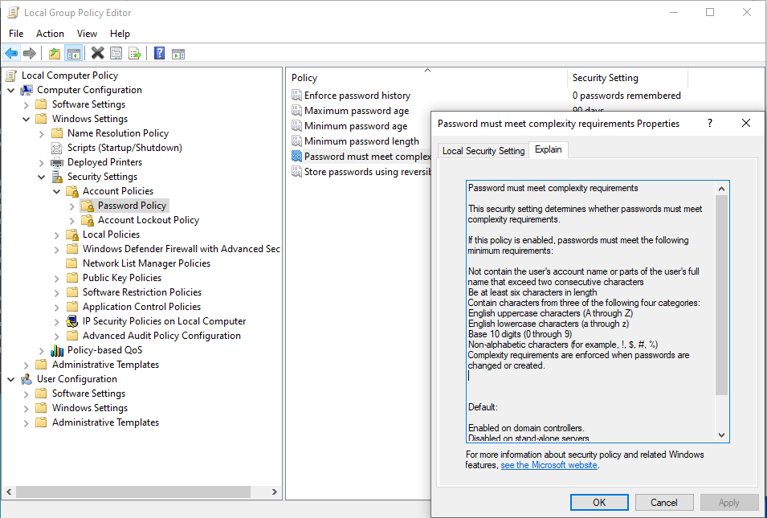
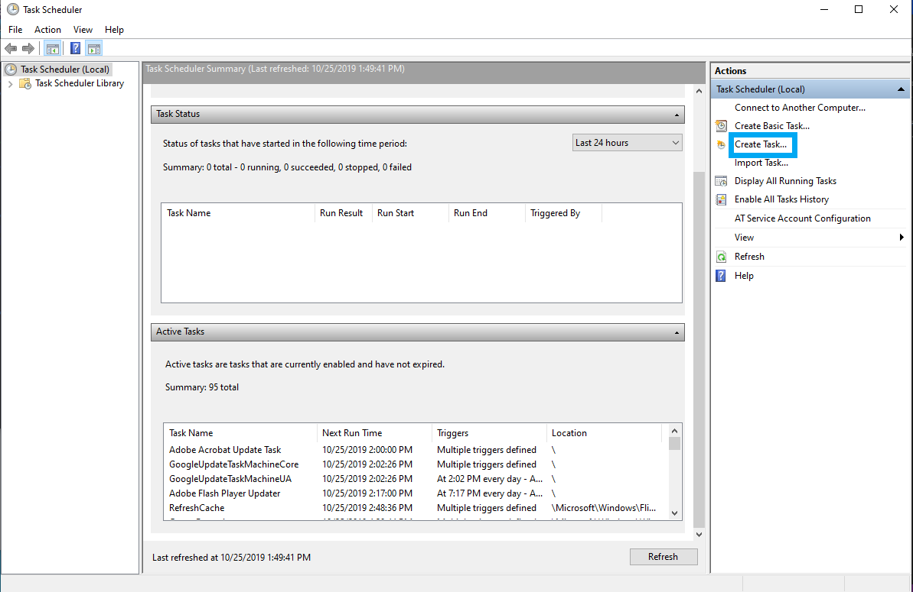

## 7.1 Lesson Plan: Introduction to Windows and CMD

### Class Overview

Today's class begins our unit on Windows administration and hardening. Students will be introduced to the Windows operating system and command line by performing basic system administration tasks. 

### Class Objectives

By the end of class, students will be able to:

- Leverage the Windows Command Prompt (CMD) to navigate and manage directories and files. 
- Use `wmic` and Task Manager to manage processes and retrieve system info.  
- Create, manage, and view user information using the command-line tool `net`.
- Manage password policies using `gpedit`.
- Optionally, schedule tasks using Task Scheduler.


### Lab Environment


<details><summary>Lab Details</summary>
<br>

In this unit, you will be using a new Windows lab environment located in Windows Azure Lab Services. RDP into the **Windows RDP host machine** using the following credentials:

  - Username: `azadmin`
  - Password: `p4ssw0rd*`


Open the Hyper-V Manager in the Windows RDP Host machine to access the nested virtual machines:


- Windows 10 machine
  - Username: `sysadmin`
  - Password: `cybersecurity`

- Windows Server machine
  - Username: `sysadmin`
  - Password: `p4ssw0rd*`

The instructor lectures, demonstrations, student activities and reviews will all be completed using the Windows RDP Host Machine. 

We won't need the nested Hyper-V virtual machines until the third day of this unit. 

#### RDP Client Credential Issues

Sometimes the RDP client (specifically the Windows RDP client) fails to connect to the Azure lab when the same session is re-used. The solution, for some reason, seems to be to manually reloading the RDP file, re-entering the credentials, and attempting to reconnect again.

#### Azure Lab Provisions 

Each student will be provided **30 hours** of Azure lab access outside of class time. 

- If students exceed that quota, they will be provided an additional 10 hours. 

- If they exceed those additional hours, they will be provided an additional 5 hours. 

Once students exceed that final quota, they will not be provided any additional hours. It is extremely important that students preserve their allotted hours by **shutting off their machines** at the end of each class.

</details>

### Instructor Notes

- Today's activities focus on maintaining a standardized Windows workstation. The other lessons for this unit will focus on PowerShell and Active Directory.

- The demonstrations and activities use the scenario of creating a report of a Windows machine. Because of overlap with many concepts covered in the Linux units, we will move fairly quickly between topics. 

- When first logging into the Windows RDP Host machine, you will notice unnecessary applications start up automatically which we will take care of in the demos and activities. 

- If students are having issues connecting to VMs, read the following note about deleting saved state: 

  - [Deleting Saved State Guide](https://docs.google.com/document/d/18Mz12q82nhxkypVRdIVgIqsLeNG1oCQj_TPsFJ3RgGk/edit)

- At the end of class, tell students to turn off the VMs and the host machines to prevent issues connecting to the VMs in the future. They should do this every time they access the environment outside of class hours. 

- The following document contains a list of common Windows issues that may occur during this unit. Be sure to distribute this guide to students. Review the content to prepare for any potential troubleshooting:

  - [Windows Lab Environment Guide](https://docs.google.com/document/d/18Mz12q82nhxkypVRdIVgIqsLeNG1oCQj_TPsFJ3RgGk/edit)

### Slideshow  

The slides for today can be viewed on Google Drive here: [7.1 Slides](https://docs.google.com/presentation/d/1zxa5Y1sXPUSlTGig7oPq-rvgMfW7C7e3KIY46kO-zQU/edit#slide=id.g104f71ac7a5_0_1236)

- To add slides to the student-facing repository, download the slides as a PDF by navigating to File > "Download as" and choose "PDF document." Then, add the PDF file to your class repository along with other necessary files.

- **Note**: Editing access is not available for this document. If you or your students wish to modify the slides, please create a copy by navigating to File > "Make a copy...".

### Time Tracker

The time tracker can be viewed on Google Drive here: [7.1 Time Tracker](https://docs.google.com/spreadsheets/d/1rE0rbzsar66bxVsR93SasZeOV7ySERJDrWIloN6jONs/edit#gid=0)

### Student Guide 

Distribute a student-facing version of the lesson plan: [7.1 Student Guide](StudentGuide.md)  

---

### 01. Instructor Do: Introduction to Windows (0:05)

Welcome students to class and let them know that today's lesson will cover fundamental system administration of Windows.

Ask the following question: Who uses Windows machines at home? At work?

- Note that while many IT professionals prefer Mac OS and Linux for their operating systems, Windows is still the market leader for desktop operating systems.

Point out that the widespread use of Windows for personal computers and workstations makes them the most common target for today's attackers. 

- Much of the malware that exists today specifically targets vulnerabilities in unpatched and unsecured Windows personal computers and servers.

- Therefore, as a cybersecurity professional, you will likely interact with Windows—whether it's the operating system you use daily, or as part of your company or client's infrastructure.

Emphasize that understanding Windows is essential for the following IT and cybersecurity specializations:

- **SOC Analysis**: As an SOC (Security Operations Center) analyst, your familiarity with Windows will be tested almost every day. As part of your daily work, you may observe anywhere from one to several thousand security-related incidents and alerts dealing with Windows endpoints.

- **System Administration**: The large majority of system administrators work with one or more Microsoft products and/or services, including Windows PCs, Windows Servers, Office 365, and Exchange to name a few.

- **Penetration Testing**: Due to Windows workstations and servers being widely used in organizations and businesses, it is vital that penetration testers know how to exploit Windows and Microsoft-related products.

- **Endpoint Forensics**: Because the most commonly supported endpoint device in an organization is likely to be Windows, it is critical that forensics investigators have a detailed understanding of how Windows works. 

Tell students that today's activities and demonstrations will cover common system administration tasks using command-line and GUI tools to troubleshoot a problematic Windows PC. During this process, we will create a report with our findings.

Explain that students will complete the following tasks throughout the day:

- Audit processes with Task Manager.

- Use the command line to gather information and create files.

- Enforce password policies.

- Manage users.

- Automate tasks.

Explain that today's Windows activities move quickly. Students will be learning the "Windows way" of performing basic system administration tasks that they've already learned to do on Linux.

Emphasize that this gives students a substantial learning advantage. What is new today are the operating system and the syntax, not the concepts.

Take a moment to address questions before proceeding.

### 02. Everyone Do: Launching Your Windows Lab (0:10)

Begin class by making sure everyone is logged into their Windows Azure Lab.

Instruct students to use RDP to log into their Azure lab if they have not yet. 

  - Credentials for the Azure labs Windows RDP Host machine:
    - Username: `azadmin`
    - Password: `p4ssw0rd*`

### 03. Instructor Do: Introduction to Task Manager (0:15)

:question: **Ask students**: "Did anyone notice processes that started up when they logged into the Windows RDP Host machine?"

Explain that this Windows RDP Host machine has some applications installed on it (which will be dealt with in a few moments). To get started, we will need to close the startup application windows.

This is what a Windows workstation can look like if it's not properly maintained by an organization's system administrators.

- For any application or installer window that launches after booting the machine:

  - Select the application window in the bottom toolbar

  - Click the top-right **X** in each window to close it.

  - Students should not log into these applications

- The following is a list of the applications you may expect to see when booting up the lab:

  - The `Skype` launcher
  - The `Spotify` browser signup page (may not show)
  - The `Spotify` login screen (may not show)

We'll look at uninstalling these applications with a PowerShell script on our second day of the unit.

Remind students that during the Linux system administration lessons they learned how to enumerate and inspect running processes using `top`.

#### Introducing Task Manager

Today's first demonstration focuses on cleaning up these unnecessary processes with a Windows process management tool: **Task Manager**.

Cover the following about Task Manager:

- Windows, like Linux, has the concept of errant/runaway processes.

- We need a way to inspect and troubleshoot process resource utilization in Windows.

- On Windows, we can use the Task Manager GUI to inspect and manage processes, instead of `top`'s CLI.

- Because of this, using Task Manager to manage processes is easier than using `top`.

- Task Manager also allows us to manage other important system components, such as startup processes.

Explain that processes in Windows are much like the processes and PIDs that the students worked with in the Linux units.

Present some use cases for Task Manager:

- Some programs, when left running while not in use, can take up excessive resources or even allow for unwanted remote connections. Some examples are:

  - Google Chrome, which is well-known for its high memory usage.

  - Teamviewer, the remote desktop application, has had critical issues that have left systems extremely vulnerable, and accessible from public connections.

- Some processes can cause memory leaks that result in system instability and abrupt system crashes. These crashes are commonly associated with the "blue screen of death".

:books: Distribute the following link for students who want to learn more about Task Manager and its usage: 

  - [How to Geek: Windows Task Manager - The Complete Guide/](https://www.howtogeek.com/405806/windows-task-manager-the-complete-guide/)

Explain that security professionals can also use Task Manager to audit processes to identify incorrect or malicious processes:

- For example, many cryptojacking processes, or cryptominers, use excessive CPU and/or network resources even while a system is idle.

#### Task Manager Overview

For this upcoming demo, we'll use Task Manager to identify resource bottlenecks and startup processes that are potential issues within our Windows RDP Host machine.

First, we'll walk through how to audit processes based on resource utilization. 

Tell the students to follow along on their Windows RDP Host machine:  

- Right-click on the taskbar at the bottom of the Windows desktop and choose **Task Manager**. Expand this window as needed.

- With Task Manager launched, make sure you're on the Processes tab. 

Explain that all running processes on the computer can be seen in this Processes tab. 

- Each column header shows the resource utilization of each process: CPU, Memory, Disk, and Network. These can be sorted in ascending or descending order.

- Demonstrate this by clicking on the **Memory** resource column header.

- Click the **Performance** tab.

This tab shows resource utilization visualized in charts. This is useful information for system administrators when there are extended periods of high resource usage.

One of the key functions of Task Manager is ending unwanted processes.

For example, suppose that we notice spikes in CPU usage. We would need to identify the errant process creating these spikes, and end it.

In our case, we have a process that may be considered a security risk.

#### Task Manager Demo: Ending Processes

Explain that this Windows RDP Host machine has a process we have identified to be a potential security risk: **TeamViewer**.

TeamViewer is a remote desktop application that is used similarly to RDP to connect to remote computers.

:books: Distribute the following link and explain that it provide information of past and recent critical vulnerabilities of TeamViewer:

  - [threatpost: TeamViewer Flaw in Windows App Allows Password-Cracking](https://threatpost.com/teamviewer-fhigh-severity-flaw-windows-app/158204/) 

  - Have students briefly review the article and explain that we'll want to end the TeamViewer process with Task Manager.

With Task Manager still open, do the following on the Processes tab:

  - Click the **Process** column header to show all the running processes.

  - Click the **Name** column header to sort all processes alphabetically.

  - Finally click on **TeamViewer**.

Reiterate that due to the security risk of having TeamViewer running, we'll want to end its process.

  - With TeamViewer process highlighted, click **End task**.

#### Disabling Startup Processes

Now that we've seen how to stop a process, we'll take a look at how to disable processes from automatically starting up when our machine boots up.

We can do this by examining the list of startup process in the Task Manager's Startup tab.

- With Task Manager still open, go to the **Startup** tab:

  - Each listing under the Startup tab is a process that boots up when the machine does.

- Have everyone select the **Spotify** startup process.

Explain that this is not a process we want starting up anymore.

- Click **Disable** and explain that this will prevent the process from starting up with the Windows machine.

Explain that the next time this machine is booted, this process will no longer start up with the machine.

Point out that while troubleshooting with Task Manager seems like a simple process, being able to manage running and startup processes is an important skill to have across all platforms. It is also a vital first step to solving many security-related problems, such as incident response, digital forensics, and threat hunting.

Explain that managing startup applications is important for system and security administrators for multiple reasons:	

- Startup applications can slow boot time due to their execution priority.	

- These applications may use excessive resources while in the background, causing random system slowdowns.	

- Applications might use the network in the background. They can, for example, initiate their own automatic updates, hogging network bandwidth but also become a security risk by opening ports to listen to.	

- Startup applications may require special permissions for their functionality. These can pose security risks if, for example, they are compromised through malware. Malware can then potentially run theses rogue processes as administrators.

### 04. Instructor Do: Introduction to Command Prompt (CMD) (0:15) 

Now that we have looked at ending startup processes, we can move on to learning about the Windows command line.

First, let's look at the common directory structure in Windows.

#### Directory and File Structure

Introduce the Windows file system structure by covering the following:

- Directories are indicated with a backslash (`\`), as opposed to Unix's forward slash (`/`).

- Discuss the following default Windows directory structure:

  ```console
  C:\
  ├── PerfLogs\
  ├── Program Files\
  ├── Program Files (x86)\
  ├── ProgramData\ [hidden folder]
  ├── Users\
  │     └── [username]\
  │           └── Desktop\
  │           └── Documents\
  └── Windows\
        └── System32\
              └── Config\
              └── Drivers\
                      └── etc\
                            └──hosts
                            └──networks
        └── Spool
        └── Temp
  ```

- Let students know that the Windows directory structure does not follow the conventional naming scheme or structure of common Unix systems. For example, instead of directories named `/etc` and `/var`, there are directory names such as `Program Files` and `PerfLogs`.

#### Common Directories 

Now let's look at some common and important Windows directories, and compare them to Linux counterparts, where applicable. (In these examples, our root drive is `C:\`.):

- `C:\` (or whichever drive Windows is installed on) is the root drive.

- `C:\Program Files\` is where 64-bit applications are installed.

- `C:\Program Files (x86)\` is where 32-bit applications are installed.

  - Cover the differences between 32 and 64-bit applications and operating systems:

    - Modern processors are 64-bit while older ones are 32-bit. 

    - The bits represent the instruction sets that the processors can handle. 64-bit processes can handle more complex instruction sets than 32-bit ones.

    - 32-bit processors can also only handle a maximum of 4 GB of memory, which in these days, is considered to be a low amount of memory. 32-bit operating systems and applications designed for 32-bit processors share this memory limitation.

    - The 32-bit Windows applications folder, or "Program Files (x86)" contains these 32-bit applications that were either originally created as 32-bit applications or require 32-bit compatibility.

  - :books: Distribute the following link for students who want to know more about the differences between 32-bit and 64-bit operating systems: 

      - [Digital Trends: 32-bit vs 64-bit](https://www.digitaltrends.com/computing/32-bit-vs-64-bit-operating-systems/)

- `C:\ProgramData\`  is a hidden directory containing application-specific settings.

- `C:\Users\` is the directory for all users, including our `azadmin` user. This is similar to Linux's `/home` directory.

- `C:\Users\[username]\` is each specific user's home folder. Their settings and files are saved here and in subdirectories.

  - `C:\Users\azadmin\Documents\` is the `Documents` folder for our `azadmin` user.

  - `C:\Users\azadmin\Desktop\` is the `Desktop` folder for the `azadmin` user.

- `C:\Windows\` is where Windows-specific programs and libraries are located.

  - `C\Windows\System32\` is where main component Windows system applications configuration settings are located.

Assure students that familiarity with these directories will develop over time, as we complete activities and learn more about Windows. 

#### CMD and Environment (ENV) Variables

Explain to students that the Windows Command Prompt, also referred to as CMD or `cmd.exe`, is the command-line interface for Windows, comparable to a Unix shell, such as Bash for Linux.

Today's lesson will heavily use CMD. We'll get started by introducing some basic commands. 

Have everyone launch CMD by going to the bottom-left Windows icon and typing "CMD". Right-click **Command Prompt** and select **Run as administrator**.

Explain that **environment variables** from the bash programming unit work the same way on Windows.

Environment variables, also called envvars, are special values that contain information about the system, such as the user's home directory, or the system's program files directory.

Envvars in Windows can be used for the following:

- Replacing long directory paths with shorter ones.
- Grabbing the current time.
- Finding the location of your system files.

Environment variables differ from Linux's in that they are surrounded by percent signs (`%`) instead of starting with a `$` sign. For example: 

- In Windows, the environment variable `VAR` would be: `%VAR%`

- In Linux, the environment variable `VAR` would be: `$VAR`  

Explain that we can combine environment variables with regular directory names. 

- Run `cd %USERPROFILE%\Desktop` to navigate to the Desktop directory.

Explain that `%USERPROFILE%` is a variable assigned to the value of the current user's home directory, or in this case: `C:\Users\azadmin`. This is the same as `$HOME` in Linux.

Explain to students that, like in Linux, Windows has many default environment variables.

Mention a couple of the following default Windows environment variables:

| Environment Variable | Default Value          |
| :------------------- | :--------------------- |
| `%CD%`                 | Current directory      |
| `%DATE%`               | Current date       |
| `%OS%`                 | Windows                |
|` %ProgramFiles%`     | `C:\Program Files`       |
| `%ProgramFiles(x86)%`  | `C:\Program Files (x86)` |
| `%TIME`                | Current time       |
| `%USERPROFILE%`        | `C:\Users\{username}`    |
|` %SYSTEMDRIVE%`        | `C:\`                    |
| `%SYSTEMROOT%`         | `C:\Windows`             |

Reassure students that they won't need to know all of these and that a list of common envvars will be provided as reference whenever needed.

#### CMD Commands

Some commands are similar to Linux, while some are completely different.

Cover the following navigation commands. We will practice them in the following demo.

  - `cd` or `chdir` changes directories. This works like Linux's `cd`, however

    - `cd` by itself will function like `pwd` (print working directory) in Linux.

  - `dir` lists the contents of a directory. This works like Linux's `ls`.

Let's try these navigation commands with an environment variable.

- While still in `cd %USERPROFILE%\Desktop`, have everyone run the following:

  - `cd` to see the current directory.
  - `cd ..` to move up to the parent directory.
  - `dir` to list the contents of the directory. This should list the contents of `C:\Users\azadmin`.

Next, cover the following command prompt operations:

  - `md` or `mkdir` creates directories.

  - `copy` copies a file. This works like Linux's `cp`.

  - `move` cuts and pastes files. This works like Linux's `mv`.

  - `del` or `erase` deletes files and directories. Directories will prompt a user to confirm.

    - Note that files deleted with these commands do not go to the Recycle Bin, as they do when we delete files with a GUI. Deleted files cannot be restored. 

  - `rd` or `rmdir` removes a directory if it's empty. Non-empty directories must be removed with the `/s` parameter: `rmdir /S` or `rd /S`.

  - `find` functions like `grep` in that it searches a file for specific criteria. For example, `find "hello" greeting.txt` will search the `greeting.txt` file for the string `hello`.

    - In this example, the first argument or parameter `"hello"` is the string to search for and the second argument/parameter is the path and filename.

    - Note that `find` is case sensitive while most command prompt commands are not case sensitive.

  - `echo` prints output to the screen like in Linux.

  - `type` followed by a file name shows the contents of a file. This is similar to `cat` in Linux.

  - `cls` clears the screen of the CMD prompt.

  - `exit` closes CMD, like in most terminals.

#### CMD Parameters and Help

Note that CMD uses what are known as "parameters" which can be considered to be the equivalent of "arguments" from our Bash lessons. The terminology "options" or "switches" may also be used to specify parameters with specific functionality. 

Know that the terminology you use isn't as important as understanding the function of a parameter. To find out more about a command, you can use `help <command>`.

- With CMD open, run `help del` and note the entries.

```
Deletes one or more files.

DEL [/P] [/F] [/S] [/Q] [/A[[:]attributes]] names
ERASE [/P] [/F] [/S] [/Q] [/A[[:]attributes]] names

  names         Specifies a list of one or more files or directories.
                Wildcards may be used to delete multiple files. If a
                directory is specified, all files within the directory
                will be deleted.

  /P            Prompts for confirmation before deleting each file.
  /F            Force deleting of read-only files.
  /S            Delete specified files from all subdirectories.
  /Q            Quiet mode, do not ask if ok to delete on global wildcard
  /A            Selects files to delete based on attributes
  attributes    R  Read-only files            S  System files
                H  Hidden files               A  Files ready for archiving
                I  Not content indexed Files  L  Reparse Points
                O  Offline files              -  Prefix meaning not

If Command Extensions are enabled DEL and ERASE change as follows:

The display semantics of the /S switch are reversed in that it shows
you only the files that are deleted, not the ones it could not find.
```

We can see here that the `/f` parameter "force" will cause `del` to delete a read-only file when used.

Explain that documentation can also be found by  entering "cmd <command name>" into your search engine. 

  - For example, the first result for "cmd del" is [Microsoft's official online documentation for `del`]([https://docs.microsoft.com/en-us/windows-server/administration/windows-commands/del](https://docs.microsoft.com/en-us/windows-server/administration/windows-commands/del))


#### Use CMD to Create Todo List Demo

Let's try a few of these commands by using CMD to create a todo list. We'll do this by outputting and appending printed console output to a text file. To start, have everyone run the following:

  - `cd Desktop` to return to the `C:\Users\azadmin\Desktop` directory.

  - `mkdir Audit` to create an `Audit` subdirectory.

  - `cd Audit` or `chdir Audit` to enter that subdirectory.

Explain that we can use `echo` with `>` in Windows to output console text to a file. Have everyone run:

  - `echo hello > todo.txt` to create a new file called `todo.txt`.

  - `dir` to display the directory's contents, to confirm that the file exists.

  - `type todo.txt` to show the contents of `todo.txt`, which is `hello`. 
    - Reiterate that `type` works like `cat` in Linux.

Explain that if we use `echo` with `>` again, it will overwrite the file's contents. Have everyone run:

  - `echo Review Task > todo.txt` to overwrite the contents of `todo.txt`.

  - Run `type todo.txt` again to show that the contents of `todo.txt` are now `Review Task`.

Explain that we can use `>>` instead of `>` to append contents to a file without overwriting anything. Have everyone run:

  - `echo 1. Check for CPU-Intensive Processes >> todo.txt` to append a todo task to our `todo.txt` list. 

  - Run `echo 2. Disable Unnecessary Startup Processes >> todo.txt` to append a second todo task to our todo list.

  - `type todo.txt` to show the new contents of the `todo.txt` file:

      ```
      1. Check for CPU-Intensive Processes
      2. Disable Unnecessary Startup Processes
      ```

Explain that we can use `del` to delete files. Have everyone run:

  - `del todo.txt` to delete the `todo.txt` file. 

  - Confirm by running `dir` to show `todo.txt` has been deleted. 

  - Lastly, run `cls` to clear the terminal screen.

Explain that as students get more proficient with the command line, they will be more prepared to execute and automate tasks in future systems and security-related roles.

### 05. Student Do: Intro to Task Manager and CMD Activity (0:15)

Explain the following:

- In this activity, you will be playing the role of a junior systems administrator at Good Corp Inc.

- Your CIO has requested that you start a baseline report about a Windows machine. In an upcoming lesson, this Windows workstation will be joined to an Active Directory Domain Controller.

- Your CIO has requested that you do the following on the Windows workstation:

   - Use Task Manager to clean up running and startup processes.

   - Use CMD to create a simple text file in the current user's Desktop directory called `report.txt`. You will later append Windows system information to it.

Let students know that if they are comfortable with Linux navigation commands like `ls` and `cd` and inputting commands, this activity should not be too difficult.

Also remind students that there are differences between Windows and Linux command lines. For example:

- While navigating, they will be using `dir` instead of `ls` to list directories and files.

- Also, students will need `>` to output `echo` text to a file and `>>` to append `echo` text to a file.

Send students the following file:

- [Activity File: Task Manager and CMD ](Activities/05_Intro_CMD/Unsolved/readme.md)

Answer any questions students may have. 

### 06. Instructor Review: Intro to Task Manager and CMD Activity (0:10)

This activity aimed to familiarize students with a few Windows system administration-related tasks involving Task Manager and CMD. They had to audit tasks with the GUI, re-familiarize themselves with the command line, and use basic commands such as `echo` and `type`.

Completing this activity required the following steps:

- Stopping processes.

- Disabling startup processes.

- Creating a `reports` folder.

- Appending terminal output using `echo` and environment variables into a `report.txt` file.

Share the following file with the class: 

- [Solution Guide: Task Manager and CMD](Activities/05_Intro_CMD/Solved/readme.md)

#### Walkthrough

Start by making sure you're logged into the **Windows RDP Host Machine** with the following credentials:

- Username: `azadmin`
- Password: `p4ssw0rd*`

To find what processes are running, we'll launch the GUI tool, Task Manager: 

  - Press Ctrl+Alt+Del or navigate to Task Manager through the Start menu. 

- Once Task Manager is open, navigate to the Process tab and click the **Name** column to sort by process name.

- For each of the following processes, if it is running, select it, then **End task**.

  - Apple Push
  - iCloud Services
  - iPod Service
  - iTunesHelper
  - Skype
  - TeamViewer

Now we'll disable startup processes. Within the Startup tab, select each startup process and disable it, except for the following:

   - Microsoft OneDrive
   - Windows Security notification icon

Now we'll create a reports folder and file. Open CMD and do the following:

  - Run `cd C:\Users\%USERNAME%\Desktop` to navigate to the `Desktop` folder.

  - Run `echo Baselining Report > report.txt` to create a report titled `report.txt`.

  - Run `echo Created by [your name here] >> report.txt` to add the subtitle.

Explain that this will print out the text info to the screen and will append it to this newly created `report.txt` file.  

- Remind students that we append with `>>` in the Windows command line, just as we do in Linux. A single greater-than sign (`>`) will **overwrite** the contents of a file.

- Run `type report.txt` to view the contents of our `report.txt` file.

Next, we will add to the report using ENV variables. Append the machine's operating system, date, and username to our report:

  - Run `echo %OS% system report created on %DATE% with logged in user, %USERNAME%. >> report.txt`

  - Run `type report.txt`

    Your output should look like:
    
    ```console
    Baselining Report
    Created by [your name here]
    Windows_NT system report created on Thu 11/14/2019 with logged in user, azadmin.
    ```

**Bonus**

For the bonus, we'll use two environment variables to add a list of installed programs to our report.

- Using the environment variables `%ProgramFiles%` and `%ProgramFiles(x86)%`, list the contents of these directories and append them to the report:

  - Run `dir "%ProgramFiles%" >> report.txt`

  - Run `dir "%ProgramFiles(x86)%" >> report.txt`

  - Run `type report.txt` to see the current report.

Ask if there are any questions before moving onto the next section.

### 07. Instructor Do: Creating a Report with wmic Output (0:15)

Explain to students that we will be further developing the Windows command line proficiency with the command-line tool `wmic`: **Windows Management Instrumentation Command**.

- `wmic` is a very powerful tool for managing Windows computers, allowing users to query a large range of system information and diagnostics, including information about the operating system and hard disks.

- System administrators can also use `wmic` to do things such as launch, terminate, install, and uninstall processes.

Let students know that we will be using this command-line tool extensively to retrieve information about the system to add to our Windows report.

#### Wmic Structure and Conventions

Explain to students that `wmic` has the following query structure:

- `wmic [global switches] [alias] [verbs] [properties]`

Break down the parts of a `wmic` query:

- `[global switches]`, not to be confused with normal switches, are `wmic`-specific global commands that alter its behavior. They can do things like specify a file to append output to. Today, we will use the command `/APPEND`.

  - For example: `wmic /APPEND:report.txt os get buildnumber` will append the Windows build number to the `report.txt` file. 
  
    - This will add the output content to the end of the file much like `>>` does in Bash. It does **not** overwrite the file.

- `[alias]` is the Windows component that we want `wmic` to query. Common aliases include:

  - `os` (operating system), containing properties specific to the operating system, such as the Windows edition name and build number.

  - `logicaldisk`, containing properties specific to the disk drives, such as drive name, file system, free space, size, and volume serial number.

    - **Note** that a hard drive's volume serial number is an eight digit serial number that is assigned a hard disk and uniquely identifies it.

- `[verbs]` are actions we want to complete with the `wmic` command. 

  - For example, if we are using `wmic os` to find operating system information, we will then use the `get` verb, followed by the various `[properties]` we want to find.

- Common properties retrieved using `get` include:

  - `caption` (i.e., `get caption`): Returns a one-line description of the given alias.

  - `/value` (i.e., `get /value`): Returns all of the properties and values of an alias and lists each on a separate line. 

#### Wmic Demo

- Encourage students to follow along with this demo and, optionally, save the queries in a text file for easy reference.

    - **Note**: Having students follow along in real time may add time to the demo. If that is a concern, keep this as a one-way demo and make sure students follow along with their Student Guides.

Now that we've covered the parts of a `wmic` query, let's look at how to retrieve information about the current operating system, which we will later add to our report.

Please use the Windows RDP Host machine for this demonstration. 

First we're going to use the `get /value` verb on the `os` alias:

- Run `wmic os get /value` to return:

  ```console
  BootDevice=\Device\HarddiskVolume6
  BuildNumber=18362
  BuildType=Multiprocessor Free
  Caption=Microsoft Windows 10 Pro
  ... [results truncated]
  ```

Now we want to retrieve brief information about the operating system (`caption`) and its build number. We will call those properties with `get`:

- Run `wmic os get caption, buildnumber`  

  This should return:

  ```console
  BuildNumber  Caption
  18362        Microsoft Windows 10 Pro
  ```

- The output shows that we retrieved the `caption` and `buildnumber` properties of the operating system alias using the verb `get`.

Remember the `caption` is the primary descriptive line of the alias we're retrieving information for.

The `buildnumber` that we're retrieving is the OS build number of Windows that we're running.

You can find the corresponding version of each build at Microsoft's site:

:books: Distribute the following URL: [Microsoft | Docs: Windows 10 release information](https://docs.microsoft.com/en-us/windows/release-information/)

  - On this page is a table on this page, we can see versions for this build, `18362`. The version is `1903`. 

  - On the left side of the page, we can navigate to that version's "Known issues..." and "Resolved issues". 

  - Knowing the version information allows us to find further information about the operating system, for example, what vulnerabilities might exist for this version of the operating system or what issues currently exist that we might need to find solutions for.

Once we've verified the results are what we want, we can append them to a file:

- Run `wmic /APPEND:report.txt os get caption, buildnumber`

Verify the output using the `type` command:

- Run `type report.txt` to return:

  ```console
  BuildNumber  Caption
  18362        Microsoft Windows 10 Pro
  ```

- If the file's contents do not match what we want, we can simply use `del` to delete the file and start again.

Explain to students that now we're going to look for the following properties for each disk drive on the system with the the `logicaldisk` alias:

- Each disk drive's name (or `caption`)
- Installed file system
- Amount of free space capacity
- Total drive capacity
- Volume serial number

Run `wmic logicaldisk get caption, filesystem, freespace, size, volumeserialnumber`

- The output is:

  ```
  Caption  FileSystem  FreeSpace    Size          VolumeSerialNumber
  A:
  C:       NTFS        55366582272  135838822400  D6DAFA63
  D:       NTFS        63518740480  68718358528   767473C4
  ```

Explain to students that after we verify that the output looks good, we can add the `/APPEND` global switch:

- Run `wmic /APPEND:report.txt logicaldisk get caption, filesystem, freespace, size, volumeserialnumber`

- Run `type report.txt`

Point out to students that now we have both of the previous outputs in our report:

```console
  Baselining Report
  Created by [your name here]
  Windows_NT system report created on Tue 11/19/2019 with logged in user, azadmin
  BuildNumber  Caption
  18362        Microsoft Windows 10 Pro

  Caption  FileSystem  FreeSpace    Size          VolumeSerialNumber
  A:
  C:       NTFS        55366582272  135838822400  D6DAFA63
  D:       NTFS        63518740480  68718358528   767473C4
```

Explain to students that knowing how to query system information using the command line is a vital first step to learning Windows system administration. 

While these are simple queries, `wmic` has many more powerful features that can manage and retrieve information on local and remote Windows personal computers and servers.

:books: For more information about `wmic` usage, you can use the command `wmic /?` in CMD and check out the following URL:

  - [Microsoft | Docs: wmic](https://docs.microsoft.com/en-us/windows/win32/wmisdk/wmic)

Answer any questions before moving on to the next activity.

### 08. Student Do: Creating a Report with wmic Output (0:10)

Explain the following to students: 

- In this activity, you will be playing the role of a junior systems administrator at Good Corp, Inc.

- Your CIO now wants you to run `wmic` queries to continue baselining the system, including the following: 

  - The machine's Windows edition and build number.

  - User account security IDs, usernames, and descriptions.

  - All users' last logon time and number of logons.

  - A list of Windows updates, or `qfe` patches, applied to the system.

Send students the following activity file: 
- [Activity File: Creating a Report with `wmic` Output](Activities/08_WMIC_OS/Unsolved/readme.md)

:warning: **Heads Up**: Instruct students to continue using their Windows RDP Host machine. 

Answer any questions before beginning the activity. 

### 09. Instructor Review: Creating a Report with wmic Output Activity (0:15)

This activity introduced students to using the `wmic` process in the command line. 

Completing this activity required the following steps:

- Using the `wmic [alias] get /value` call to see all of the available alias options.

- Testing the various alias options: `os`, `netlogin`, `useraccount`.
- Running `type report.txt` to examine the report's contents.
- Finding user security IDs and account descriptors.
- Retrieving the number of times a user has logged on, and the last logon time.
- Retrieving Windows update information with `qfe`.

Share the following file with students: 

- [Solution Guide: Creating a Report with `wmic` Output](Activities/08_WMIC_OS/Solved/readme.md)

#### Walkthrough

Please use the Windows RDP Host machine to complete the walkthrough. 

Begin by listing all the different values that can be retrieved from the `os` `wmic` alias. 

Explain that the first operating system `wmic` query was a refresher from the demo.

- Run `wmic os get /value`

- We can see that the operating system edition is `Microsoft Windows 10 Pro`.

Next, we append this info to our `report.txt` file. 

- Run `wmic /APPEND:report.txt os get caption, buildnumber`

  ```console
  BuildNumber  Caption
  18362        Microsoft Windows 10 Pro
  ```

Find all user info, security IDs, and user account descriptors: 

- Run `wmic /APPEND:report.txt useraccount get name, sid, description`

  ```
    Description                                                    Name                SID
    Built-in account for administering the computer/domain        Alex                 S-1-5-21-4186057849-1686307938-2621843307-1000

                                                                  azadmin              S-1-5-21-4186057849-1686307938-2621843307-500

    A user account managed by the system.                         DefaultAccount       S-1-5-21-4186057849-1686307938-2621843307-503

    Built-in account for guest access to the computer/domain      Guest                S-1-5-21-4186057849-1686307938-2621843307-501
                                                                  
    A user account managed and used by the system ...[truncated]. WDAGUtilityAccount   S-1-5-21-4186057849-1686307938-2621843307-504
  ```

  - **Note** that the SID is the Security Identifier of an account. The `S-1-5` portion essentially states that it is a Windows-based Security Identifier, version 1. 

    - The next part of the SID before the last set of numbers is the domain or local computer identifier, in this case: `21-4186057849-1686307938-2621843307`. 
    
    - Lastly, the last number of the SID is the `Relative ID`, which is much like a `UID` or "user identifier" in Linux. `Relative IDs` below `1000` are built-in accounts, such as the `Guest` account. And any `RID` equaling `1000` or higher is for non-built-in user accounts, such as `Alex`.

    - You'll notice that our `azadmin` account has a `RID` of `500`. `500` is the built-in user account reserved for the local system administrator, which has full control rights over the system. 

Find the number of times all users have logged on, and last logon:

- Run `wmic /APPEND:report.txt netlogin get caption, numberoflogons, lastlogon`

  ```
  Caption                       LastLogon                  NumberOfLogons
  NT AUTHORITY\SYSTEM
  NT AUTHORITY\LOCAL SERVICE
  NT AUTHORITY\NETWORK SERVICE
  azadmin                       20200824155508.000000+000  31
  ```

Review the following about looking at logon info:

- While number of logons do not necessarily indicate a security issue, an abnormally high amount of logons may be a sign of suspicious activity.

- Abnormal logon times may be indicators of suspicious activity.

Retrieve Windows update information by running:

  - Run `wmic /APPEND:report.txt qfe get caption, description, installedon, hotfixid`

  ```
  Caption                                     Description      HotFixID   InstalledOn
  http://support.microsoft.com/?kbid=4532938  Update           KB4532938  2/9/2020
  http://support.microsoft.com/?kbid=4513661  Update           KB4513661  2/9/2020
  http://support.microsoft.com/?kbid=4537759  Security Update  KB4537759  2/9/2020
  http://support.microsoft.com/?kbid=4538674  Security Update  KB4538674  2/9/2020
  http://support.microsoft.com/?kbid=4532693  Update           KB4532693  2/9/2020
  ```

- Lastly, run `type report.txt` to see the updated report.

#### Windows Management Instrumentation Command Summary

Summarize what we've done with `wmic` on the command line:

- Before our activity, we retrieved information about the operating system and disk information.

- We used the `wmic` command-line tool to add system information to our report. 

- We found information about the users' login activities. 

- It is important that system administrators can quickly run `wmic` commands to retrieve system information on local and remote machines.

Answer any questions before moving on to the break.

---
### 10. Break (0:15)
---

### 11. Instructor Do: Users, Groups, and Password Policies (0:10)

Now we will use the command line to find user password policy and logon information.

#### Introducing net

Let students know we will be using the command-line utility known as `net`.

- `net` allows an administrator to query and set various settings relating to user accounts, groups, and password policies. 

  - For example, a system administrator might pull information about an employee who has left the company in order to see when they last logged in. They can then use `net` to delete their account.

We will be using the following `net` utilities:

- `net user`: For adding, removing, and managing users. In the following activity, we will use it to enumerate a list of all the users on the system, and then enumerate information about the `azadmin` account.

- `net localgroup`: For adding, removing, and managing local groups.

    - While we are working with local groups now, we will be looking at domain groups in the future. Domain groups are groups created in Windows Server to manage entire sets of users with identical user permissions and policies.

- `net accounts`: Allows you to see password and logon requirements for users to enforce password security policy.

  - `net accounts` can be used to set the following password policies:

    - The time before a password expires.

    - The minimum number of characters required for a password.

    - The amount of time before passwords expire.

    - The minimum number of days before a password can be changed.

    - Number of times a password must be unique before it can be reused again. In other words, if this is set to two, a user needs to change their password to two new ones before an old one can be used again.

Point out that, for now, we will only be retrieving these settings, but will manage them in the following sections.

Let students know that managing these passwords is similar to editing `/etc/pam.d/common-password` settings in Ubuntu Linux.

#### Net Demonstration Setup

Next, we'll demonstrate `net` using the following scenario: 

- Your CIO was curious about the groups and password policies on the Windows workstation. You are to retrieve more information from this Windows workstation using the `net user` command-line utility.

We will be using the `net` tool to find information about user groups and password policies by doing the following tasks:

  - Enumerating users to see `net` output.

  - Enumerating `azadmin`'s groups and password policies.

  - Enumerating local groups with `net localgroup`.

  - Enumerating the Windows workstation's current password policies with `net accounts`.

#### Enumerate Users with net

First, we will use the `net user` account to enumerate all the users on the system.

- Run `net user` and note the output:

  ```console
  User accounts for \\ML-RefVm-447521

  -------------------------------------------------------------------------------
  Alex                     azadmin                  DefaultAccount
  Guest                    WDAGUtilityAccount
  The command completed successfully.
  ```

#### Find azadmin's Password Status

Next, we will look at specific password settings for the `azadmin` user.

- Run `net user azadmin` and point out the following in the output:

  - `Password last set`: When the password was last set. For the user `azadmin`, it was last set on `‎3/‎20/‎2020 10:10:41 PM`. 
    - **Note**: Your output may be different.

  - `Password expires`: The date that the current password for user will expire. For `azadmin`, there is no expiration.

  - `Password changeable`: The earliest date that the user can change their password again. For `azadmin`, the date is `‎‎3/‎20/‎2020 10:10:41 PM`. 
    - **Note**: Your output may be different.

  - `Password required`: The password policy that specifies whether or not the user needs a password. For this user, they _do_ need a password. 
    - **Note**: This is a given because `azadmin` is the primary local administrator account on this machine.

  ```console
  User name                    azadmin
  Full Name
  Comment                      Built-in account for administering the computer/domain
  User's comment
  Country/region code          000 (System Default)
  Account active               Yes
  Account expires              Never

  Password last set            ‎3/‎2/‎2020 10:10:41 PM
  Password expires             Never
  Password changeable          ‎3/‎2/‎2020 10:10:41 PM
  Password required            Yes
  User may change password     Yes

  Workstations allowed         All‎‎‎‎
  Logon script
  User profile
  Home directory
  Last logon                   ‎8/‎24/‎2020 3:55:08 PM

  Logon hours allowed          All

  Local Group Memberships      *Administrators
  Global Group memberships     *None
  The command completed successfully.
  ```

  - **Note**: Your output will look slightly different based on when your class started. 

Let students know that we will be changing these password policies later.

#### Find Groups on the Machine

Now we will enumerate a list of groups on the Windows workstation. It's important to know how to enumerate groups on a system since groups are created, removed, and updated as often as users are. 

Groups of users can include administrators, non-privileged users, users sorted by departments, users from third-party contractors, etc.

- Run `net localgroup` and note the output (your hostname will be different):

  ```console
  Aliases for \\ML-RefVm-447521

  -------------------------------------------------------------------------------
  *Access Control Assistance Operators
  *Administrators
  *Backup Operators
  *Cryptographic Operators
  *Device Owners
  *Distributed COM Users
  *Event Log Readers
  *Guests
  *Hyper-V Administrators
  *IIS_IUSRS
  *Network Configuration Operators
  *Performance Log Users
  *Performance Monitor Users
  *Power Users
  *Remote Desktop Users
  *Remote Management Users
  *Replicator
  *System Managed Accounts Group
  *Users
  The command completed successfully.
  ```
  - **Note**: Your output will look slightly different. 

#### Current Password Policy

Next, we'll pull the password policies that are currently set for the Windows workstation:

- Run `net accounts` and note the output:

  ```console
  Force user logoff how long after time expires?:       Never
  Minimum password age (days):                          0
  Maximum password age (days):                          42
  Minimum password length:                              0
  Length of password history maintained:                None
  Lockout threshold:                                    Never
  Lockout duration (minutes):                           30
  Lockout observation window (minutes):                 30
  Computer role:                                        WORKSTATION
  The command completed successfully.
  ```
  **Note**: Your output may look slightly different.

Finish by explaining that enumerating information about users, groups, and password policies is important. This information helps our organization understand the current security policy posture on Windows workstations. 

:books: For more information about `net` usage,  use the command `net help` or `net help <user/accounts/localgroup>` in CMD and check out the following URLs:

- [net user](https://docs.microsoft.com/en-us/previous-versions/windows/it-pro/windows-server-2012-r2-and-2012/cc771865(v=ws.11))

- [net localgroup](https://docs.microsoft.com/en-us/previous-versions/windows/it-pro/windows-server-2012-r2-and-2012/cc725622(v=ws.11))

- [net accounts](https://support.microsoft.com/en-us/help/556003#:~:text=The%20%E2%80%9CNet%20Accounts%E2%80%9D%20command%20is,only%20used%20on%20local%20computer.)

It is important for system administrators to be able to quickly and reliably pull this type of information from workstations to ensure they adhere to company policies.

### 12. Student Do: Users, Groups and Password Policies (0:10)

Explain the following to students: 

- Your CIO is curious about what groups and password policies are on the Windows workstation. 

- You are tasked with retrieving more information from this Windows workstation using the `net` command-line utility.

Send students the following file: 

- [Activity File: Users, Groups, and Password Policies](Activities/11_Users/Unsolved/readme.md)

### 13. Instructor Review: Users, Groups, and Password Policies (0:05)

In this activity, students used the `net` tool to find information about user groups and password policies.

Completing this activity required the following steps:

- Enumerating users to see `net` output.

- Enumerating `Alex`'s groups and password policies.

- Enumerating local groups with `net localgroup` and appending the output to their report.

- Enumerating the Windows workstation's current password policies with `net accounts`.

Send students the following file:  

- [Solution Guide: Users, Groups, and Password Policies](Activities/11_Users/Solved/readme.md)

#### Walkthrough

Make sure you're using the nested Windows RDP Host machine in Hyper-V. 

Before continuing with your activities, remember to `cd` to the `Desktop/reports` directory.

- First, enumerate users with `net`:

  - Run `net user >> report.txt`

  ```
  User accounts for \\ML-RefVm-447521

  -------------------------------------------------------------------------------
  Alex                     azadmin                  DefaultAccount
  Guest                    WDAGUtilityAccount
  The command completed successfully.
  ```

- Next, find `Alex`'s password status:

  - Run `net user Alex >> report.txt`

  ```
  User name                    Alex
  Full Name                    Alex
  Comment
  User's comment
  Country/region code          000 (System Default)
  Account active               Yes
  Account expires              Never

  Password last set            ‎8/‎24/‎2020 5:29:23 PM
  Password expires             ‎10/‎5/‎2020 5:29:23 PM
  Password changeable          ‎8/‎24/‎2020 5:29:23 PM
  Password required            Yes
  User may change password     Yes

  Workstations allowed         All
  Logon script
  User profile
  Home directory
  Last logon                   Never

  Logon hours allowed          All

  Local Group Memberships      *Remote Desktop Users *Users
  Global Group memberships     *None
  The command completed successfully.
  ```

- Find groups on the machine:

  - Run `net localgroup >> report.txt`

  ```
  Aliases for \\ML-RefVm-447521

  -------------------------------------------------------------------------------
  *Access Control Assistance Operators
  *Administrators
  *Backup Operators
  *Cryptographic Operators
  *Device Owners
  *Distributed COM Users
  *Event Log Readers
  *Guests
  *Hyper-V Administrators
  *IIS_IUSRS
  *Network Configuration Operators
  *Performance Log Users
  *Performance Monitor Users
  *Power Users
  *Remote Desktop Users
  *Remote Management Users
  *Replicator
  *System Managed Accounts Group
  *Users
  The command completed successfully.
  ```

- Print the current password policy:

  - Run `net accounts >> report.txt`

  ```
  Force user logoff how long after time expires?:       Never
  Minimum password age (days):                          0
  Maximum password age (days):                          42
  Minimum password length:                              0
  Length of password history maintained:                None
  Lockout threshold:                                    Never
  Lockout duration (minutes):                           30
  Lockout observation window (minutes):                 30
  Computer role:                                        WORKSTATION
  The command completed successfully.
  ```

- Run `type report.txt` to see the updated report.

Note that we do not have a minimum password length. Many organizations will create and enforce password policies that dictate the minimum length of a password.

Let students know that our next activity will continue with directly managing users and setting password policies.

### 14. Instructor Do: Creating Users and Setting Password Policy (0:10)

In this section, we will be covering another common system administration responsibility: setting user password policies. 

This section builds off of the utilities `net user` and `net localgroup`.

We covered the importance of password policies in the previous Linux units. Now we'll demonstrate applying similar concepts in Windows.

- We will be creating a new administrator and regular user on this machine. 

- We will then set a password policy to ensure these users' passwords follow company-wide password policies.

  - As we saw at the end of the previous activity, there wasn't a minimum password length set. Every organization should have a minimum password length policy. We'll look at how to do that with the `gpedit` tool.

We'll use the `net user` utility to create Windows user accounts for the next two new users: senior developer Andrea, and sales representative Barbara.

Explain to students that we are going to learn how to do the following:

- Create a regular user, `Barbara`.

- Create an administrator user, `Andrea`.

- Change user groups with `net localgroup`.

- Set workstation password policies with `gpedit`.

#### Creating a Regular User

For this demo please use the Windows RDP Host machine. 

Remind class that in the last activity we used the command `net user` to show a list of all users on the system and then appended the results to our report.

Now we will use the `net user` utility again, adding a username after `net user`, and forward-slash-add (`/add`), so that our new command looks like: `net user [username] /add`.

- We can also specify a password for the user by typing a password after the username, with the following syntax: `net user [username] [password] /add`.

Explain that to combine those steps and add a user named `Barbara` with the password `Coldcalls123!`, we use: `net user Barbara Coldcalls123! /add`.

- Run `net user Barbara Coldcalls123! /add` and explain that if successful, we'll get the following output:

  ```console
  The command completed successfully.
  ```
  Now a regular user, `Barbara`, exists.

Next, you will demonstrate how to create an administrative user, `Andrea`.

#### Creating an Administrative User with Elevated Privileges

Tell students that now we'll be creating a new user account for the new Windows senior developer, Andrea, and adding it to the `Administrators` group.

Start by running the same command for creating a new user. You will use the name Andrea instead of Barbara:

- Run `net user Andrea JavaMaster123! /add` and note the output:

  ```console
  The command completed successfully.
  ```

- Note that you may see a message about Windows versions prior to Windows 2000 could not support passwords longer than 14 characters. Press `Y`.

  ```console
    The password entered is longer than 14 characters.  Computers
    with Windows prior to Windows 2000 will not be able to use
    this account. Do you want to continue this operation? (Y/N) [Y]: y
  ```

After creating the user `Andrea` we can use the `net localgroup` command-line utility to add `Andrea` to the `Administrators` local group. This will allow `Andrea` to manage the Windows workstation as a super user.

Demonstrate adding `Andrea` to the `administrators` group:

- Run `net localgroup Administrators Andrea /add` and then note the output:

  ```console
  The command completed successfully.
  ```

Tell students that we can use the `net user` command, as in the previous activity, to check the user's account parameters:

- Run `net user Andrea` and point out the `*Administrators` group at bottom of the output:

  ```console
  ...[results truncated]
  Local Group Memberships      *Administrators       *Users
  Global Group memberships     *None
  The command completed successfully.
  ```

Let students know we've now successfully created a new user and added them to the `Administrators` local group.

#### Setting the Windows Workstation's Password Policy

Tell students that now that we have our users, we want to define and enforce a strong password policy for this Windows computer.

Tell students we will be using the GUI tool `gpedit` to set password policies with the following parameters:

- Maximum password age to 60 days.

- Minimum password length to 8 characters.

- Password complexity requirements to be enabled.

To open `gpedit`, type "gpedit" in the Windows search bar and press Enter.

Under **Computer, Configuration**, navigate to **Windows Settings** > **Security Settings** > **Account Policies** > **Password Policy** and set the following:

- Set maximum password age to 60 days. 
  - While **Maximum password age** is highlighted, right-click it and click **Properties** to see the tabs for enabling and disabling the option. You can also go to the **Explain** tab to see best practices for password expiration policies.

  

- Demonstrate setting minimum password length to eight characters.

- And lastly, double-click **Password must meet complexity requirements**, and set to **Enabled**. Select **Apply**, then click the **Explain** tab and read the following:

  ```console
  Password must meet complexity requirements

  This security setting determines whether passwords must meet complexity requirements.

  If this policy is enabled, passwords must meet the following minimum requirements:

  Not contain the user's account name or parts of the user's full name that exceed two consecutive characters
  Be at least six characters in length
  Contain characters from three of the following four categories:
  English uppercase characters (A through Z)
  English lowercase characters (a through z)
  Base 10 digits (0 through 9)
  Non-alphabetic characters (for example, !, $, #, %)
  Complexity requirements are enforced when passwords are changed or created.
  ```

Explain to students that they will follow these steps to create users and set password policies on the Windows workstation.

### 15. Student Do: Create User and Set Password Policy (0:10)

Explain the following to students: 

- In the last activity, your CIO had you use the `net` command-line tool  to find various types of information, such as the `localgroups` on the machine and the existing password policy, with `accounts`.

- Your CIO noticed that the previous password policies were not very strict, and wants to enforce new password policies on this Windows workstation for the next two new users: senior developer Andrew, and sales representative Bob.

Send students the following file: 
- [Activity File: Creating Users and Setting Password Policies](Activities/14_Create_User_Password_Policy/Unsolved/readme.md)

### 16. Instructor Review: Creating Users and Setting Password Policy Activity (0:05)

Remind students that in today's activity, they learned how to use `net` to create two different kinds of users: a regular user and a user that will have the `Administrators` local group applied to it.

Solution file is available here: 
- [Solution Guide: Creating Users and Setting Password Policies](Activities/14_Create_User_Password_Policy/Solved/readme.md)

#### Walkthrough

- Create a regular user, `Bob`, and set the user's password to `Ilovesales123!`:
  - `net user Bob Ilovesales123! /add`

  - `net user Bob *` will also let you change the password of an existing user (if you added the user without setting the password).

- Create a user, `Andrew` with the password `Ilovedevelopment123!`:

  - `net user Andrew Ilovedevelopment123! /add`

  - `net user Andrew *` will also let you change the password of an existing user (if you added the user without setting the password).

- Add Andrew to the `Administrators` group:

  - `net localgroup administrators Andrew /add`

- Verify that Andrew is in the `Administrators` group:
  - `net user Andrew`

- Launch `gpedit` and set the password policies for the entire Windows machine:

  -  Run `gpedit` and under **Computer Configuration**, navigate to **Windows Settings** > **Security Settings** > **Account Policies** > **Password Policies**.  

    - Set maximum password age to 90 days. While **Maximum password age** is highlighted, right-click it, and click on **Properties** to see the tabs for enabling and disabling the option. You can also go to the **Explain** tab to see what best practices exist for password expiration policies.
    
    - Set minimum password length to 12 characters.
    
    - Double-click **Password must meet complexity requirements**, and set to **Enabled**. Select **Apply**, then click the **Explain** tab to read the following:

   ```console
   Password must meet complexity requirements.

   This security setting determines whether passwords must meet complexity requirements.

   If this policy is enabled, passwords must meet the following minimum requirements:

   Not contain the user's account name or parts of the user's full name that exceed two consecutive characters
   Be at least six characters in length
   Contain characters from three of the following four categories:
   English uppercase characters (A through Z)
   English lowercase characters (a through z)
   Base 10 digits (0 through 9)
   Non-alphabetic characters (for example, !, $, #, %)
   Complexity requirements are enforced when passwords are changed or created.
   ```

    - Click `OK` to apply the changes.

Ask students if they have any questions before proceeding to the final, optional section. 

|:warning: Shut Down Your Machines :warning:|
|:--:|
| At the end of class, remind everyone to shut down their Hyper-V virtual machines and Windows RDP Host machine. It must be shut off after eveery session. |


### 16. Instructor/Student Do: Task Scheduling (0:10) (Optional)

:warning: **Heads Up**: Cover this section if there is time remaining or if the class is being taught on Saturday. Otherwise, students can review this section in their Student Guide and attempt the activity on their own. 

Explain to students that in this final section, we will use the administrative user, `Andrew`, to create scheduled tasks that will automate the reports we've been working on. 

- Instead of completing a separate final activity, students are encouraged to complete the steps of this demonstration as you walk through them. If short on time, keep this as a one-way demo and make sure students follow along using their Student Guides.

Explain to students that Task Scheduler is a GUI tool that allows system administrators to automate the execution of scripts and applications on a Windows system. 

- These are similar to cron jobs in Linux. They can be set to execute at specific times or a certain amount of time after a user logs in. 

- It is important to properly manage systems with scheduled tasks to automate security and system administration actions such as checking for updates for endpoint security software, sending important logs to systems such as SIEM (Security Information and Event Management), and scheduling system maintenance scripts.

#### Task Scheduling Demo

Continue using the Windows RDP Host machine. 

Explain the following demonstration scenario: 

- Your CIO wants to schedule reports to be created on a daily basis. This system isn't remotely managed at the moment, and with a new developer coming in, huge changes might be made to the machine's configuration. 

- This will help reduce workstation development drift for any new users for the Windows environment, and for this specific developer position and project.

- Your CIO has asked you to use the GUI tool Task Scheduler to create a task that will run each day.

Encourage students to follow along on their machines. Send students the following files: 

- [Activity File: Task Scheduling ](Activities/16_Scheduling_Tasks/Unsolved/readme.md)
- [Solution Guide: Task Scheduling](Activities/16_Scheduling_Tasks/Solved/readme.md)

Use the user, `azadmin`, to create a newly scheduled task.

- Click on the Windows search in the taskbar and search for "Task".

- Choose **Task Scheduler** from the list.

  

- Create a new task by selecting **Create Task...** on the **Actions** pane.

  - Note: If you don't see the Actions pane on the right, go to **View** > **Customize** and make sure Action Pane is enabled.

  

#### Setting the Task Trigger

- In the Create Task GUI window, navigate to the **Triggers** tab, and click **New...**.

- Set **Begin the task** to **On a schedule**.

- Make sure our task is set to repeat daily with **Recur every:[x] day** set to **1**, and the start date set to today. (It should already be set, but you may have to input it manually).

- Finally, set the time to be a minute or two after the current time.

- Select **OK** to save your changes and return to the Create Task window.

**Note:** Remind everyone to shut down their Hyper-V virtual machines and Windows RDP Host Machine.

----

© 2020 Trilogy Education Services, a 2U, Inc. brand. All Rights Reserved.
