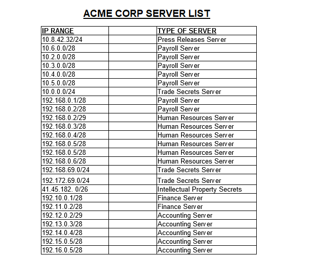

## Activity File: Network Addressing

In this activity, you will continue to play the role of a security analyst at Acme Corp.

- Your security manager has identified the potential hacker that works at Acme Corp. Your manager has also been capturing the potential hacker's traffic. They believe the hacker is accessing secret internal resources.

- While your security manager was able to capture the server IP address the hacker was accessing, they were only able to capture the raw binary traffic. 

- Your task is to convert the binary traffic into an IP address, determine if it is a public or private address, and compare the IP to a list of Acme's servers to see which system the hacker is attempting to access.

### Instructions

1. Convert the following binary representations into numeric IP addresses:
    1.  `11000000101010000100010110010001`
    2.  `00001010000000000000000000101010`
    3. `11000000101011000100010110010001`
    4.  `00101001001011011011011000100000`
    5.  `00001010000000000000000001001100`

2. Determine if the numeric IP addresses are public or private.

3. Compare the numeric IP addresses to the Acme server list and determine which server the IPs belong to.

    - 

4. Summarize your findings to determine what resources the hacker is trying to access.

#### Bonus

Your security manager also found the following binary data in the hacker's logs:

  - `100010001111011111000111011001010001101000110110`
  
Determine what this binary data represents.
  
 *Hint: This may translate to an IP address, but it is not actually an IP address*. 
