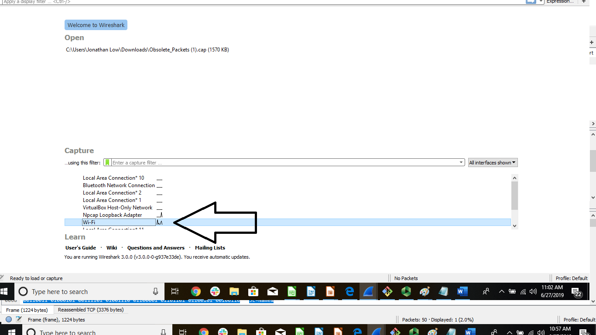
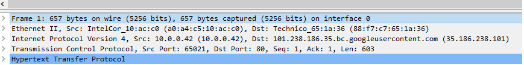
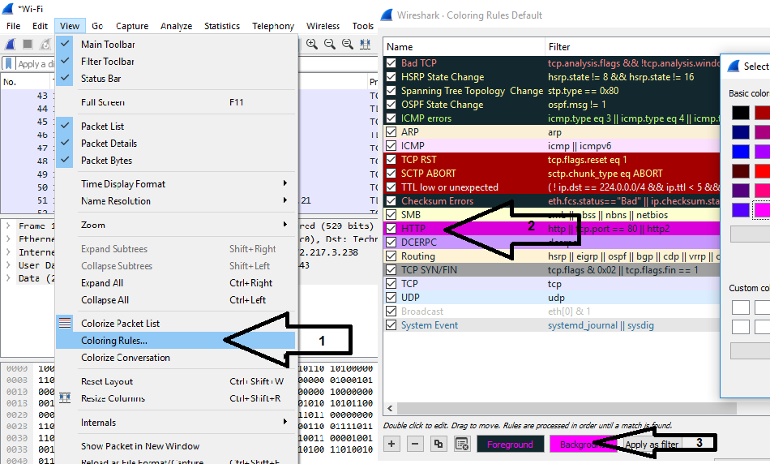
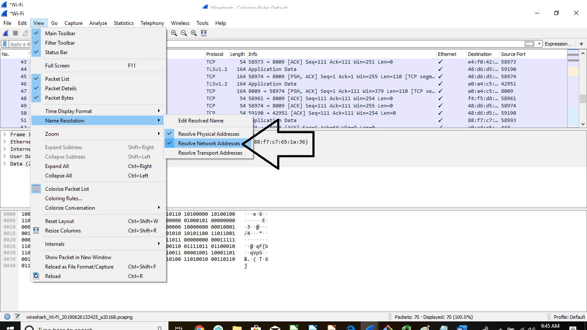
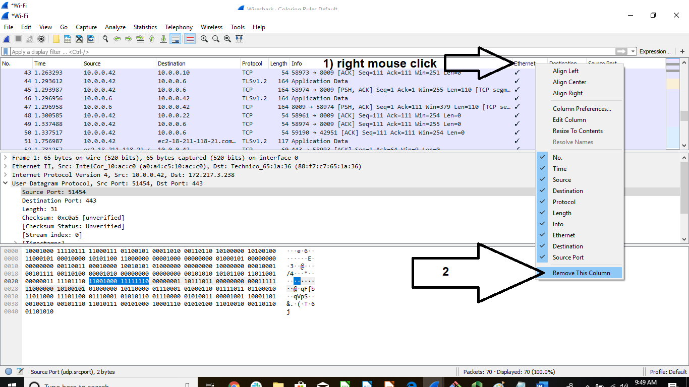
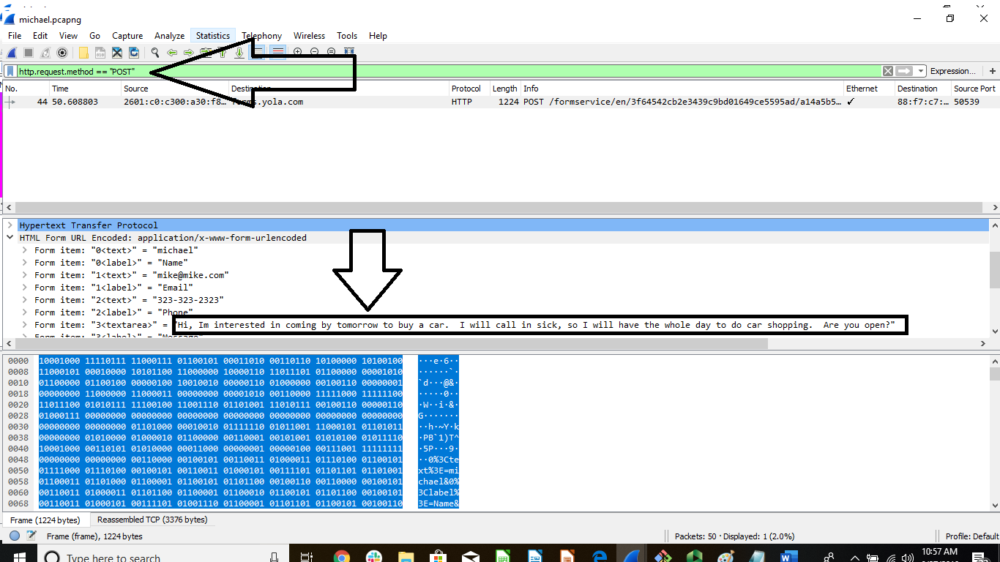

## 8.2 Lesson Plan: Ports, Protocols, and the OSI Model

### Overview

Today's class is the second part of our introduction to networking. Students will learn about **protocols** and **ports**, and then use this knowledge to analyze a suspicious employee's traffic log. They'll learn how protocols work together by studying the **OSI model** and use what they learn to identify the source of various network problems.

After studying these foundational networking concepts, students will learn how to use Wireshark to create and analyze live traffic captures. They will finish class by analyzing a capture file taken on a rogue employee's computer to determine exactly what they were doing and who they were communicating with.


### Class Objectives

By the end of class, students will be able to:

- Interpret data in network packets by analyzing their headers, payloads, and trailers.

- Explain the role of ports in specifying a network packet's destination.

- Associate common protocols with their assigned ports.

- Explain how encapsulation and decapsulation allow different protocols to interact with one another.

- Use the layers of the OSI model to identify sources of problems on a network.

- Capture and analyze live network traffic using Wireshark.

### Lab Environment

<details><summary>Lab Details</summary>
<br>

You will use your local Vagrant virtual machine for today's activities. Please note that instructors and students have different access credentials.
  - Instructor access:
    - Username: `instructor`
    - Password: `instructor`
  - Student access:
    - Username:`sysadmin`
    - Password: `cybersecurity`


</details>

### Online Classroom Strategies 

Refer to the following guidelines and best practices for conducting this class online: 

- [Cybersecurity Online Classroom Strategies](../../../00-Teaching-Staff-Prework/OnlineStrategies.md)


### Class Slides  

The slides for today can be viewed on Google Drive located here: [8.2 Slides](https://docs.google.com/presentation/d/1jITuNdF7DuRZ_fXK07W0sV4XS5nDW5nodvaPTk-5wU8/edit#slide=id.g105e4070612_0_1281)

To add slides to the student-facing repository, download the slides as a PDF by navigating to File > "Download as" and choose "PDF document." Then, add the PDF file to your class repository along with other necessary files.

**Note**: Editing access is not available for this document. If you or your students wish to modify the slides, please create a copy by navigating to File > "Make a copy...".

### Time Tracker

The Time Tracker for today can be viewed on Google Drive here: [8.2 Time Tracker](https://docs.google.com/spreadsheets/d/11RQcttIfu44UsT2pJ0je8IihxQlUasl_3IZsEvo5fF8/edit#gid=1145703143)


### Student Guide

Distribute a student-facing version of the lesson plan: [8.2 Student Guide](StudentGuide.md)


---

### 01. Instructor Do: Welcome and Introduction (0:05)

Welcome students to the second day of our introduction to networking.

Briefly review the topics covered in the previous class:

- Networking's main function is to share data across entities.

- Various network devices are used to facilitate data sharing.

- IP and MAC addresses direct the path that data takes across entities.

Explain that in today's class, we will build on these skills. Note that today, students will learn:

- How protocols standardize the transmission of data across networks.

- How ports determine where the data is sent from and where it is received.

- How the OSI model conceptualizes how data is communicated across a network.

- How to install and use Wireshark to visualize the flow of data across a network.

- How to use Wireshark specifically to capture and analyze network traffic.


### 02. Instructor Do: Protocols (0:10)

Explain that a lot happens behind the scenes to allow machines to share data over a network. This includes:

  - Opening and closing connections.

  - Finding the location to send the data.
  - Converting and deconverting the data.
  - Transmitting the data reliably.
  - Handling errors.

 Explain that issues  will occur during these processes, such as network communication errors. Data transfer relies on **protocols** to clearly communicate vital information and reduce the risk of errors.  

#### Communications and Protocol  

The following analogy will help us understand how **protocols** can prevent communication issues:

- When military officers exchange messages over a radio, they can encounter the following issues:
  - Communications don't come in clearly.

  - Multiple communications are sent at the same time.
  - Communications are cut off.

- Military officers need to make sure that their entire message is transmitted, received, and understood clearly. To do this, they use special words throughout their exchanges:  

  - Military Officer 1:   "This is Military Officer 1. Are you there? **Over**."  

  - Military Officer 2:   "**Roger**, I am here. This is Military Officer 2, **over**."
  - Military Officer 1:   "Start the attack at noon, **over**."
  - Military Officer 2:   "**Roger**, **out**."

- In the communication above:
    - "**Over**" is used to signal the end of a specific line of communication.

    - "**Roger**" is used to signal that the message was received completely.
    - "**Out**" is used to signal the message was received, the exchange is complete, and the order will be followed.

The example shows how military officers avoid communication issues by using a fixed mode of communication specifically designed for radio transmissions.

- This mode ensures there is no ambiguity when sending and receiving messages.

- Assigning clear meanings to certain keywords ("roger," "over," and "out") and strict rules for when to use them drastically improves the efficacy of communications.

- For example, the keyword "over" can only appear at the end of a transmission. The recipient knows not to speak until they hear "over."  This solves the problem of communications being sent at the same time or being cut off.

These strict rules are known as a **protocol**. They impose structure by specifying precisely what keywords mean, and where in a message they must appear.

#### Network Protocols

Explain that, like radio transmissions, machines communicating on networks also need to be certain that a message is transmitted and understood in its entirety.

Explain the concept of a networking protocol by covering the following:

- Networks also solve these problems with protocols, or sets of standardized rules that specify how interactions between communicating entities should work.

- For example, similar to the military's use of "over" to end a communication, a network communication uses the Transmission Control Protocol (TCP) message `FIN` to indicate the end of the transmission.

Explain that networking protocols are used for many communication tasks.

Note the common protocols below and their associated tasks:
  - **HTTP** (_Hypertext Transfer Protocol_) is used to communicate web traffic.

  - **FTP** (_File Transfer Protocol_) is used to transfer files.

Note that there are also some protocols that students may not be as familiar with, such as:
  - **PAP** (_Password Authentication Protocol_) is used for authenticating a user.

  - **SMB** (_Server Message Block_) is a Windows-based protocol used for sharing files.
  - **NetBIOS** (_Network Basic Input/Output System_) allows computers to communicate on a local network.

Point out that there are often multiple protocols available for the same type of task. In these cases, you will choose which protocol to use based on context. For example, both FTP and SMB are used for file sharing, but SMB is only used on Windows, and FTP can be used with any operating system.

#### Network Packet Structure

Point out that protocol rules impose structure on communications. A message adhering to protocol rules is called a **network packet**.

#### Packets

Explain the relationship between protocols and the data they help transmit by covering network packet structure.

 - For each communication task, the client and server exchange data across networks in binary.

 - The binary data is grouped into separate pieces, known as **packets**, and transmitted across networks. Packets are simply sequences of binary data.

 - Packets have a designated structure that determines the order and length of the binary data sequences. This structure allows the recipient to properly interpret the results.

The structure of information in each packet is broken up into three parts:

- **Header**: Contains information about the data in the packet. This information includes the name and version of the protocol in use, the length of the packet, and other data needed by the recipient to properly interpret the message.

- **Payload**: The data being delivered to the destination. This is also known as the **body**, or simply the **data**. In other words, this is the _message itself_. In the military radio example above, the payloads are "I am here," "Start the attack at noon," etc.

- **Trailer**: Informs the receiver that it has reached the end of the packet. The trailer often contains information used by recipients to validate the data in the payload. Trailers are also sometimes known as **footers**. Not all protocols include a trailer.

Explain that each of these three sections is further subdivided into **fields**. Each field consists of a name that describes the kind of data it contains, and a value, which is the data itself.

For example, the header may contain fields such as:

  - **Protocol**: Specifies the name of the protocol in use. The recipient uses the protocol to determine what kind of data is being transmitted and how to decode the data inside the packet payload.

  - **Version**: Specifies which version of the protocol is in use. Protocols will often be improved over time. These improvements sometimes require changing the rules of the protocol. If this is the case, there will be multiple versions of the protocol—those that do not have the improvements and those that do.
    - For example, the original version of HTTP was 1.0, but most sites now use version 1.1, which has additional features and benefits. Recipients must know which version is in use to properly interpret the data in the payload.

  - **Destination address**: Specifies where the packet is going. The receiver uses this to verify that it was intended to be the final recipient.  

  - **Length of packet**: Tells the receiver how much data is in the packet payload. This helps the recipient determine where to start and stop reading data, and helps it verify that it has received the entire message.

Each of these parts and the fields within them will appear in an agreed-upon order and size so that the receiver knows exactly where to find specific information. This order is dictated by the rules of the protocol in use.

- For example, the version field is indicated in the header. As the first field, it starts at the first bit and ends at the fourth bit number. The receiver will always find this information in this exact location.

- Below is an example header displayed in binary, in which the version field is **bolded**, starting at the first bit and ending on the fourth.

  **0100**0101000000000000000111011010000001111000110001000000000000000100000000000110

- In binary, **0100** translates to **4**. Therefore, this field indicates that this header uses **Version 4**.

Emphasize that all protocols contain a header and a payload. Not all protocols include a trailer, unless it's particularly important that the recipient be able to validate a packet's contents.

Since different protocols handle different kinds of data, they often contain different header and payload fields.

- For example, HTTP messages include a **host** field in their header, which contains the name of the website the user is trying to visit. FTP, however, doesn't involve websites, so it does not have a host field.

#### Protocols and Fields

Each protocol has its own unique structure of fields.

Use the slide to cover the **PAP (Password Authentication Protocol)**, which is used to authenticate users.
  - Remind students that **authentication** is the process of verifying that a user really is who they say they are.

    - A common way to authenticate a user is to ask them to provide their credentials, such as their name and a password that only they know.

    - Since passwords are supposed to be secret, if a user can provide their username and the correct password, it's safe to trust that they are who they say they are.

- The diagram in the slide shows the PAP rules that the client uses to send a request.

  - The fields must be in the exact order as indicated in this chart: code, ID, length, username length, username, password length, password.

    - The dark blue row indicates the length of each field in bytes.

    - The light blue row indicates what data is expected in the field.

  - Not all field lengths are set. Some fields lengths vary based on what's contained in the next field.

    - For example: "Username Length" informs the recipient how long the "Username" field is.

    - The recipient (the server) will receive the data in this format and look for the "Username" and "Password" in the associated fields.

  - The most important fields in PAP are `sent-username`, which contains the username the user submitted, and `password`, which contains the password they sent.

Take a moment to address any questions before proceeding.

#### Interpreting Protocols from Raw Binary Data

Explain that security professionals rely on web tools to convert binary data and determine the protocol being used.

Present the following sample capture of raw binary data:

**Instructor Note:** These binary captures are only for demonstration's sake. They are not an exact representation of raw binary data that would come across the wire.

   ``011100000110000101110000001000000111001101100101011011100111010000101101011101010111001101100101011100100110111001100001011011010110010100100000010100000100000101010000010101010101001101000101010100100010000001110000011000010111001101110011011101110110111101110010011001000010000000110111``

  - Explain that security professionals wouldn't be able to determine the protocol based on this binary data.

Inform the class that we will use the [String Functions Binary To String Converter](http://string-functions.com/binary-string.aspx) web tool to convert the binary data to a readable string format.

- Go to the webpage and copy the binary data above into the top field. Next, click "Convert!"

Explain that the output returns a snippet of the protocol header: `pap sent-username PAPUSER password 7`

  - The line displays the protocol of `pap` (Password Authentication Protocol).

  - The `sent-username` is `PAPUSER`.

  - The `password` is `7`.

Take a moment to address questions before proceeding.

Explain that in the next activity, students will convert binary data into readable strings to determine several protocols.

### 03. Student Do: Interpreting Protocols (0:15)

Explain the following to students:

- In this activity, you will play the role of a security analyst at Acme Corp.

- Your manager suspects that one of your colleagues has been stealing important company data. In order to prevent the leak of trade secrets, your manager has requested that you analyze several logs of the potentially rogue employee's recent network activity.

- Your task is to convert the raw binary data into a readable format and determine which protocol is being used.

Send students the following files:

- [Activity File: Interpreting Protocols](Activities/03_protocols/unsolved/readme.md)
- [Protocols Log File](Resources/logfile)


### 04. Instructor Review:  Interpreting Protocols Activity (0:05)


:bar_chart: Run a comprehension check poll before reviewing the activity. 


Remind students that the point of this exercise was to introduce and depict the many different protocols that are used to communicate data across networks.

Point out that this exercise shows that the underlying data being communicated is in binary, which requires transition into clear text.

Completing this activity required the following steps:

- Opening the log file to view the various log records.

- Using a web tool of their choice to convert the binary data into clear text.

- Analyze the data from the clear text in order to determine the protocol being utilized.

Send students the following files:

- [Solution Guide: Interpreting Protocols](Activities/03_protocols/solved/readme.md)

#### Walkthrough

Open the log file and note that it contains multiple log records.

Convert the binary data for each log record to a readable format with a web tool of your choosing.

  - There are many web tools available for converting binary data to readable text. An easy-to-use tool is the
	  [String Functions Binary To String Converter](http://string-functions.com/binary-string.aspx).


  -  Go to the site, copy the binary log records, one at a time, into the top field, and click "Convert!"


**Log Record 1**

Log Record 1 after converting:

```
  GET / HTTP/1.1
  Host: widgets.com
  Connection: keep-alive
  Upgrade-Insecure-Requests: 1
  User-Agent: Mozilla/5.0 (Windows NT 10.0; Win64; x64) AppleWebKit/537.36 (KHTML, like Gecko) Chrome/66.0.3359.117 Safari/537.36
  Accept: text/html,application/xhtml+xml,application/xml;q=0.9,image/webp,image/apng,*/*;q=0.8
  Accept-Encoding: gzip, deflate
  Accept-Language: en-US,en;q=0.9,nb;q=0.8
```

  - The protocol is **HTTP**.


**Log Record 2**


Log Record 2 after converting:
```
  File Transfer Protocol (FTP)
    230 Login successful.\r\n
        Response code: User logged in, proceed (230)
        Response arg: Login successful.
```

  - The protocol is **FTP**.


**Log Record 3**

 Log Record 3 after converting:

```
TLSv1.2 Record Layer: Application Data Protocol: http-over-tls
    Content Type: Application Data (23)
    Version: TLS 1.2 (0x0303)
    Length: 56
    Encrypted Application Data: d03ff41452da9e9c3ec76cbeb35e8ffc1f64bf80f512924a?
```    

- Both **TLS** and **HTTP** would both be acceptable answers.

**Log Record 4**

Log Record 4 after converting:

 ```
 Domain Name System (query)
    Transaction ID: 0x18b6
    Flags: 0x0100 Standard query
        0... .... .... .... = Response: Message is a query
        .000 0... .... .... = Opcode: Standard query (0)
        .... ..0. .... .... = Truncated: Message is not truncated
        .... ...1 .... .... = Recursion desired: Do query recursively
        .... .... .0.. .... = Z: reserved (0)
        .... .... ...0 .... = Non-authenticated data: Unacceptable
    Questions: 1
    Answer RRs: 0
    Authority RRs: 0
    Additional RRs: 0
    Queries
        applegate.com: type A, class IN
    [Response In: 623]    
```

- The protocol is **DNS (Domain Name System)**.


**Log Record 5**   

Log Record 5 after converting:

```
 Address Resolution Protocol (request)
    Hardware type: Ethernet (1)
    Protocol type: IPv4 (0x0800)
    Hardware size: 6
    Protocol size: 4
    Opcode: request (1)
    Sender MAC address: Technico_65:1a:36 (88:f7:c7:65:1a:36)
    Sender IP address: 10.0.0.1
    Target MAC address: 00:00:00_00:00:00 (00:00:00:00:00:00)
    Target IP address: 10.0.0.6`
```    

- The protocol is **ARP (Address Resolution Protocol)**.   

**Bonus Log Record**

Bonus Log Record after converting:

```
HCI H4
    [Direction: Unspecified (0xffffffff)]
    HCI Packet Type: HCI Command (0x01)
HCI Command - Read Local Supported Features
    Command Opcode: Read Local Supported Features (0x1003)
    Parameter Total Length: 0
    [Response in frame: 4]
    [Command-Response Delta: 4.181ms]
```    
  - HCI stands for **Host Controller Interface** which is used by Bluetooth.


Point out that we've touched on only a handful of protocols—there are over 2,000 standardized protocols available.  Note that while knowing all of these protocols isn't required for most security positions, if anyone wants to learn more about the most popular protocols, they are encouraged to do so.

Take a moment to address remaining questions before proceeding to the next section.


### 05. Instructor Do: Ports  (0:15)

Recap that protocols are standardized rules for determining how data is transmitted across networks, and IP addresses help identify where that data is transmitted.

Explain that **ports** also help direct where data is transmitted. Present the following analogy:

- Bob has a video presentation that he wants to show to Alice, a coworker who works across town. Bob will be presenting from the video conference room in his office building, Room 33. Bob told Alice to meet him at his office, but only gave Alice the address of the building, 150 Main Street.

- Because Bob didn't specify which room he'd be in, Alice will be able to find the office building, but not Bob or the video presentation.

If we compared this example to a network:

  - The address of the office building, 150 Main Street, is the **IP address**.

  - The video conference room, Room 33, is the **port**.

  - Since we know in advance that Room 33 is the video conference room, we know that any meeting in Room 33 will involve video conferencing, even if we're not explicitly told what to expect from the meeting. Similarly, port numbers can be associated with a specific network function and protocol.

In other words, when we see a port number in use, we know what type of protocol is in use.

Explain the importance of ports in a security context:

  - Ports are the access points for transmitting and receiving data.

  - Ports are like doors that can be open, closed, or accessible to certain individuals.

  - Since a port is considered an access point into a system, it is important that IT professionals do not allow unauthorized access to them. Unauthorized access can potentially lead to a breach.

  - Network and security professionals are often tasked with checking whether ports are open to unauthorized individuals, and then closing or restricting the access to protect against security issues.

  - When a protocol or service is said to "run on a port," it means the protocol or service can be accessed by connecting to that port.

  - The Internet Assigned Numbers Authority (IANA) is the entity officially responsible for assigning port numbers for a designated purpose.

  - It is important to note that unofficial port numbers can also be used for any protocol or service, but this practice goes against the typical IANA guidelines.

Explain **virtual ports** by covering the following:

  - Computers have physical ports, which allow us to get data into the machine. But computers don't have enough physical ports on a computer for all the different kinds of protocols. Instead, we use software to create **virtual ports**.

  - Every protocol has an assigned numerical virtual port number.

    - The assigned port, known as the **destination port**, is where other machines send data when they want to communicate using that protocol.

      For example: A machine that wants to send an HTTP message to a web server would send traffic to the server's port `80`.

#### Port Numbers and Range

Cover the following about port numbers and ranges:

  - There are 65,536 virtual ports, numbered from `0` to `65535`.

  - These ports are divided into three ranges.

Explain the three port ranges:  

  - `0` - `1023`: **System ports** are *well-known* ports. They are **restricted**, meaning that only the operating system or administrator can bind services to these ports. This helps associate these ports with a given protocol.
    - For example, HTTP typically runs on port `80`. Since normal users can't launch their own services on port `80`, we can reliably trust that machines accepting connections to port `80` are using it to send and receive HTTP traffic.

  - `1024` - `49151`: **Registered ports** are also called user  ports. Unlike system ports, users _can_ bind services to these ports. In general, "normal" users who want to launch their own services will do so using ports in this range.

  - `49152` - `65535`: **Dynamic / private ports**. When a machine sends data to another machine, it must open a port to send data from. This is called a **source port**. Source ports are randomly chosen from the dynamic range whenever a machine sends a message.

     **Note**: It's okay if students find source ports confusing at this stage. They are much easier to understand in practice. We'll revisit them in greater detail when analyzing packets in Wireshark.

Cover some of the most common system ports:

   - Port `80`: **HTTP** - For sending web traffic.

   - Port `443`: **HTTPS** - For sending encrypted web traffic.

   - Port `21`: **FTP** - For sending files.

   - Port `22`: **SSH** - For operating network services securely.

   - Port `25`: **SMTP** - For sending emails.

   - Port `53`: **DNS** - For translating domains to IP addresses.

Explain source and destination ports by covering the following:

- The server, or receiver of a request, will have a **destination port**. This port will depend on the protocol. Destination ports _do not_ change. This is why we can associate a given port with a specific protocol.

- The client, or initiator of a request, will have a **source port**. Source ports are randomly generated from the dynamic port range (`49152` - `65535`).

- When the response is returned by the server, the ports switch places: the source port becomes the destination port, and the destination port becomes the source port. This returns the traffic back to its original destination.

Summarize what we've just covered on ports:

   - IP addresses are used to locate a computer on a network, such as the internet.

   - A port number is used to locate a specific service on that computer.

   - Both numbers are required to transport data.

   - Any service can be run on any port, but certain services have associated ports that they're expected to run on.

Take a moment to address questions before proceeding.

Explain that in the next activity, students will analyze several logs to determine the ports and the associated protocols. They will then determine the type of activity being conducted based on the protocols they found.

### 06. Student Do:  Ports  (0:15)

Explain the following to students:

- In this activity, you will continue to play the role of a security analyst at Acme Corp.

- Your manager would like you to analyze several network requests that have originated from the rogue employee.

- Your task is to determine the **source** and **destination** port for each request as well as the protocol for each destination port. You must then research the protocol to determine what kind of activities the rogue employee may be conducting.


Send students the following files:

- [Activity File: Ports](Activities/06_ports/unsolved/readme.md)
- [Ports Log File](Resources/secondlogfile)


### 07. Instructor Review: Ports Activity (0:05)


:bar_chart: Run a comprehension check poll before reviewing the activity. 


Remind students that the goal of this exercise was to introduce them to ports and demonstrate that each protocol is assigned a specific port number.

This activity required the following steps:

   - Open the log file to view the various log records.

   - Determine the source and destination port for each log record.

   - Determine the protocol for the associated destination port.

   - Determine what type of activity might be occurring based on the protocol.

Send students the following file:

- [Solution Guide: Ports](Activities/06_ports/solved/readme.md)


#### Walkthrough

When you open the log file, you'll see the source and destination port in each record. It will resemble the following example:

 `Src Port: 50152, Dst Port: 80`

**Log Record 1**

  - Source Port: `50152`
  - Destination Port: `80`
  - Destination Protocol: `HTTP`
  - Protocol Summary: Sally Stealer is likely accessing an unencrypted website.


**Log Record 2**		

  - Source Port: `53367`
  - Destination Port: `443`
  - Destination Protocol: `HTTPS`
  - Protocol Summary: Sally Stealer is likely accessing a website with encrypted traffic.

**Log Record 3**

  - Source Port: `64836`
  - Destination Port: `21`
  - Destination Protocol: `FTP`
  - Protocol Summary: Sally Stealer is likely using FTP to transfer files.


Point out that, similar to protocols, there are thousands of port numbers used by networks.  While it's not required to know them all, security professionals are expected to know the many ports that are commonly used.  

Students may want to practice memorizing a few of the common ports to prepare for their security careers.

Take a moment to address remaining questions before proceeding.


### 08. Break (0:15)


### 09. Instructor Do: OSI Layers (0:15)

Explain that when data travels across a network, it goes through multiple steps and processes to reach its destination.

For example, the process of sending an email starts with the following steps:

  1. Convert the text of the user's email into a format the email application can understand.

  2. Add the destination address and destination port to this data.

  3. Convert this packet to a format that can be transmitted through physical wires.

Note that many of these steps are very similar across different protocols.

  - For example, IRC (_Internet Relay Chat_) is a protocol used for chat. As with email, a user's typed message needs to be converted into a format the chat application understands. Then, the destination address and port must be added to the data. Next, it must be converted to a format that can be transmitted through physical wires.

  - The processes used to send an IRC message and an email are the same. The only difference is the kind of application used.

Explain that certain protocols are responsible for handling specific steps of data transmission:

  - The IMAP (_Internet Message Access Protocol_) or POP3 (_Post Office Protocol version 3_) converts the text of a user's email into a format any email application can understand.

  - The IP (_Internet Protocol_) adds destination address information to the email data.

  - The TCP (_Transmission Control Protocol_) adds information about destination ports to this data.

  - Other protocols take care of the remaining steps of the process. These additional steps will be covered soon.

Since many of these steps are common across different scenarios, many protocols often perform the same "general step." Which protocol you use depends on the specific application, network, hardware, or circumstance.

 - For example: TCP and UDP (_User Datagram Protocol_) are both used to transport data, but TCP would be used to transport data from an email application, and UDP would be used to transport data from a video streaming application.

Explain that rather than discuss individual protocols when a security or network issue is detected, security professionals often discuss networks in terms of which "general step" the issue may have occurred on.

- This method helps them focus on the important details, such as which part of the network the security issue exists on, and not be distracted by questions about which specific protocol used for the specific network.

#### The Open Systems Interconnection (OSI) Model

The **Open Systems Interconnection (OSI) model** is a framework that conceptualizes the steps data takes during transmission, making it easier to communicate where issues exist.

Cover the following about the OSI model:
- The OSI model is a seven-layer conceptual framework that allows security analysts to better understand how communication works on a network by detailing the processes, devices, and protocols in place at each layer.

 - The seven layers are:
    1. **Physical**
    2. **Data Link**
    3. **Network**
    4. **Transport**
    5. **Session**
    6. **Presentation**
    7. **Application**

 - IT professionals often refer to the number of the layer, rather than the layer name itself.  
   - For example, you may hear _"This looks to be a layer three issue"_ when someone is referring to an issue on the Network layer.

 - Many IT professionals use mnemonic devices to remember these layers. A few popular ones include:
    - All People Seem To Need Data Processing  
    - All Pros Search Top Notch Doughnut Places

#### Layer by Layer

Now we will move through each layer, covering the following for each:

  - Specific responsibilities related to the transmission of data.

  - Key networking devices that assist with the transmission.

      - **Note:** Not all layers have key devices/protocols.

  - Key protocols used.

  - An example.

**Layer 1: Physical**

  - **Responsibility**: The Physical layer is responsible for transmission of binary data through a physical medium. It handles how data is physically encoded and decoded.

  - **Key Devices**: Hubs, repeaters, cables, fibers, wireless.

  - **Example**: If you send a photo across the internet, the digital binary representation of the image data (zeros and ones) will be converted into a signal that can be transported on a physical medium. It can be an electrical, light, or radio signal, depending on the medium in use.

**Layer 2: Data Link**

  - **Responsibility**: The Data Link layer establishes links between nodes. It also ensures data gets to its final destination without corruption, thus protecting data integrity.

  - **Key Devices**: Network cards, switches.

  - **Key Protocols**: MAC, ARP.

  - **Example**: Sending data from a switch to a computer based on the MAC address of the network card on that computer.

  - **Additional Notes**: Layer 2 protocols locate devices on a LAN.

**Layer 3: Network**

  - **Responsibility**: The Network layer is responsible for routing data through physical networks using an IP address, deciding which physical path the data will take, and ensuring that it gets to the correct destination.

  - **Key Devices**: Routers.

  - **Key Protocols**: IP.

  - **Example**: When sending a file across the internet using FTP, your router sends the file based on the destination IP of the recipient of the file.

  - **Additional Notes**: Layer 3 protocols locate devices on the public internet, outside of a LAN.

**Layer 4: Transport**

  - **Responsibility**: The Transport layer is responsible for actually transmitting data across the network. It puts data onto the network. It is also responsible for assigning the source and destination ports.

  - **Key Protocols**: TCP, UDP.

  - **Example**: When streaming a movie, the movie is transported to your computer with the UDP protocol.

**Layer 5: Session**

- **Responsibility**: The Session layer manages connections between ports on computers and handles data flow.

- **Key Protocols**: NetBios, SQL.

- **Example**: When an email is sent, it starts a session with the receiving mail server.

**Layer 6: Presentation**

- **Responsibility**: The Presentation layer is the translator for the network. It formats the data to be presented to the Application layer. It handles data representation, decryption and encryption, character set translation, and conversion.

- **Key Protocols**: SSL, TLS, JPEG, ASCII.

- **Example**: Converts the data from a .JPG file to the image that appears on your computer.

#### Layer 7:  Application

  - **Responsibility**: The Application layer is responsible for representing data in a way the consuming application can understand.  This is the layer a user interacts with, such as a web or email application.

  - **Key Devices**: User applications.

  - **Key Protocols**: HTTP, FTP, SMTP, DNS.

  - **Example**: Using the Internet Explorer browser to access a website.

#### Encapsulation and Decapsulation

Now that we can identify the different layers of the OSI model, we need to understand how these layers work with reach other to transmit data.

Explain that as data moves through the layers, starting from Layer 7 and ending at Layer 1, the data is **encapsulated**.  

Cover the following about encapsulation:

  - Encapsulation is the process of placing headers, and sometimes trailers, around the data to direct it to its destination.

  - The following examples of encapsulation take place as data moves across layers:

    - At the **Transport** layer, the transmission data and the destination port are added to the **TCP header** based on the protocol being used. Then, the data moves to the next layer.

    - At the **Network** layer, the destination IP address is added to the **IP header** to determine where the data is being sent outside the local network.

    - At the **Data Link** layer, the destination MAC address is added to the **MAC header** to determine what local machine to send the data to.

    - In summary, the TCP, IP, and MAC headers encapsulate the data.

Explain that when the data reaches its destination, it is **decapsulated** across the layers, from Layer 1 to Layer 7.  

Cover the following about decapsulation:

  - **Decapsulation** is the process of removing the headers, and sometimes trailers, around the data to confirm the data has reached the destination.

  - The following examples of decapsulation occur as data is moving across layers in reverse order:

	  - At the **Data Link** layer,  the receiving device analyzes the **MAC header** to determine it matches the recipient's MAC address, therefore confirming it's arrived at the correct destination. If so, the device removes the header and moves to the next layer.

    - At the **Network** layer, the receiving device analyzes the **IP header** to determine if it contains the right IP address.  If so, that header is removed and the data moves on to the next layer.

    - At the **Transport** layer, the receiving device analyzes the **TCP header** to determine the destination port intended to further process the data.

    -  In summary, the **TCP**, **IP**, and **MAC** headers are decapsulated from the data.

#### An Email Moving through the OSI Layers

Now that we know the different OSI layers, we'll discuss a scenario that describes how an email moves across them, starting at Layer 7.

- Layer 7: **Application** – The user types an email in Microsoft Outlook.

- Layer 6: **Presentation** – The email text is converted from plain text to a format the receiving server can understand.

- Layer 5: **Session** – A session with the receiving mail server begins.

- Layer 4: **Transport** – Since email uses SMTP, it assigns the SMTP destination port and initiates a handshake (or, the process of establishing communication between a client and server) with the mail server.

- Layer 3: **Network** – The mail server destination IP is added.

- Layer 2: **Data Link** – The MAC address of the router is added so the email can be sent outside of the local network.

- Layer 1: **Physical** – The digital email is converted into a signal to be transmitted over a physical cable.

#### OSI in a Security Context

Explain some reasons why it is important to understand the OSI model in a security context:

 - The OSI model helps you more easily understand new protocols.

    -    **For example**: If you find out that NetBIOS is a Layer 5 protocol, you immediately know that it's involved in managing user sessions, even if you've never heard of NetBIOS before.

 - The OSI model helps determine where problems in the network are occurring, even if you don't have full knowledge of the issue.

    -   **For example**: If you realize you're having a Layer 3 issue, you know you should start investigating your routers, even if you don't know exactly what the problem is.

 - The OSI model makes it easier to communicate where a security attack has occurred and what should be done.

    -   **For example**: If you know a SQL injection attack is occurring, you can explain to your management that you need a Layer 7 web application firewall to identify and mitigate the attack.


Take a moment to address questions before proceeding.

Explain that in the next activity, we will review ten security related network attacks and determine at which OSI layer each attack has occurred.

### 10. Student Do: OSI Layers (0:15)

Explain the following to students:

- In this activity, you will continue to play the role of a security analyst at Acme Corp.

- Your manager has provided you a list of several suspicious network-related activities that have recently occurred at Acme Corp. Your manager believes Sally Stealer may be connected.

- Your task is to document at which OSI layer each of these situations occurred to help the Networking team pull the necessary logs for investigation.

Send students the following file:

- [Activity File: OSI Layers](Activities/10_osi/unsolved/readme.md)


### 11. Instructor Review:  OSI Activity (0:05)

:bar_chart: Run a comprehension check poll before reviewing the activity. 

Remind students that the goal of this exercise was to introduce them to OSI layers and to understand what types of activities, protocols, and devices exist at each layer.  

Completing this activity required following steps:

   - Review each recent suspicious network-related event that occurred at Acme Corp.

   - Determine at which OSI layer each of these incidents occurred.

Emphasize that security professionals often need to take a network- or security- related event and explain to another department or individual which OSI layer the event occurred at.

Review the List of 10 suspicious activities provided, and the OSI layers they occurred at.

Send students the following file:

- [Solution Guide: OSI Layers](Activities/10_osi/solved/readme.md)

### Walkthrough  

1. A networking cable was cut in the Data Center and now no traffic can go out.

   **Solution:**  Physical cables that are cut or disconnected occur on Layer 1: the Physical layer.

2. A code injection was submitted from an administrative website, and it's possible that an attacker can now see unauthorized directories from your Linux server.

   **Solution:**  Attacks that occur directly on the web application would occur on Layer 7: the Application layer.

3. The MAC address of one of your network interface cards has been spoofed and is preventing some traffic from reaching its destination.

   **Solution:**   Issues or attacks on the MAC Address would occur on the Layer 2: the Data Link layer.

4. Your encrypted web traffic is now using a weak encryption cipher and the web traffic is now vulnerable to decryption.

   **Solution:**  Encryption occurs on the Layer 6: Presentation layer.

5. The destination IP address has been modified and traffic is being routed to an unauthorized location.

   **Solution:** IP Addresses and IP address routing occurs on Layer 3: the Network layer.

6. A flood of TCP requests is causing performance issues.

   **Solution:** TCP and source and destination protocols occur on Layer 4: the Transport layer.

7. A SQL injection attack has been detected by the SOC. This SQL injection may have deleted several database tables.

   **Solution:** Attacks occurring on the web application occur on Layer 7: the Application layer.

8. A switch suddenly stopped working and local machines aren't receiving any traffic.

   **Solution:** Switches use MAC Addresses to route traffic, so this would occur on Layer 2: the Data Link layer.

9. An ethernet cable was disconnected and the machine connected isn't able to receive any external traffic.

   **Solution:** Physical cables that are cut or disconnected occur on Layer 1: the Physical layer.

10. Traffic within the network is now being directed from the switch to a suspicious device.

     **Solution:** Switches use MAC Addresses to route traffic, so this would occur on Layer 2: the Data Link layer.


Take a moment to address remaining questions before proceeding.


### 12. Instructor Do: Introduction to Wireshark (0:10)

Before diving into the packet capturing application, review network packets by covering the following:

- Networks communicate with sequences of binary data called **packets**.

- Each packet contains fields such as the address of its origin, the address of its destination, and the information related packets being sent.

- These work a lot like the post office, except billions of packets are transferred each day, and most packets take less than a few seconds to reach their destination.

- Communicating over a network is not entirely safe, as these packets can be intercepted and analyzed by other users on the network.

- Cybersecurity professionals need to be able to see who's on a network and what they're doing. In other words, we have to be spies...at least a little bit.

Introduce Wireshark by explaining the following:

  - Wireshark is a tool that allows us to monitor real-time communications across a network, and the activities of the devices connected to it.

  - Wireshark does this analysis by looking at individual packets.

  - Multiple packets collected into a file by Wireshark are called a **packet capture**. These have file extensions such as .cap, .pcap, .pcapng.

  - In these packet captures, Wireshark collects and analyzes the kinds of websites and webpages individuals on the network are viewing, as well as the type of communication occurring.

Explain that later in the lesson, we will see how Wireshark can collect someone's username, password, and private communication if they log into an insecure site.

Let the students know that in the next section, they will learn how to capture packets with Wireshark and configure their Wireshark application to assist with analyzing these packets.

#### Capturing Packets

Remind the students that security professionals will often analyze network logs to research security-related issues. Provide the following example:

 - Your manager has tasked you with analyzing web traffic to determine which source ports your system is using for HTTP requests. They want to make sure these aren't being blocked by your firewall.

 - Your manager has provided you with a capture of the logs you need to analyze.

Explain that you could look at the captured network logs using the command line.

Demonstrate by opening the [webtraffic.pcapng file](Resources/webtraffic.pcapng) in your terminal and running the following command:

  - Run `head webtraffic.pcapng`

Running this command is one solution, but it comes with considerable challenges:

- The IP addresses are difficult to isolate out.

- It's difficult to distinguish between requests and responses.

Explain that security analysts can use Wireshark to overcome these challenges:

   - Wireshark is a graphical user interface designed to easily capture and analyze network packets.

   - It can also filter, parse, and isolate data from these packets.

Explain that before we can use Wireshark to find the source IP, we need to configure Wireshark to easily capture the packet data.

#### Wireshark Demo

 First, we'll use Wireshark to capture network traffic.

- Begin by clicking on the Wireshark logo to launch the application.

- Select which interface you want to capture traffic from. For this lesson, we will select “Wi-Fi.”



After selecting to listen on WiFi, Wireshark changes to the packet capture view.
- Students should start to see data scrolling in the application.

- Click the red square on the top-left to stop the network capture.


	 

Wireshark is split up into three panes: Packet List, Packet Details, and Packet Bytes.


The **Packet List** pane displays all the packets in the current capture file.

- Each line in the packet list corresponds to one packet in the packet capture file.

  The default columns will display:

  - `No`: The distinct number of the packet in the packet capture file. This number won’t change, even if a filter is applied.

  - `Time`: The timestamp of the individual packet.

  - `Source`: The address from which this specific packet comes from.

  - `Destination`: The address to which this specific packet is going.

  - `Protocol`: The abbreviated protocol name.

  - `Length`: The length of the packet in bytes.

  - `Info`: Additional information about the packet, typically dependent on the protocol used.


The **Packet Details** pane displays the current packet (selected in the Packet List pane) with additional details.

  - The protocols and fields of the specific packet shown are displayed in multiple trees which can be expanded.

  - Each expanded tree can be linked to a different layer of the OSI model.

    - For example: The field name starting with `Transmission Control Protocol` correlates to the Transport layer because it contains the source and destination port and other fields from the TCP header. The field starting with `Internet Protocol Version 4` correlates to the Network layer because it contains the source and destination IP and other fields from the IP header.

    

The **Packet Bytes** pane shows the data of the current packet (selected in the Packet List pane) in a hex format.

#### Customizing Wireshark

Demonstrate that Wireshark has many configurations for displaying packets.  As a security analyst, configuring your Wireshark display can assist with a variety of tasks such as:

-  Assigning different colors for protocols to easily distinguish them.

    - Navigate from `View` to `Coloring Rules`.

    - Click on the protocol you want to change the color of.  
    - Choose `HTTP` as an example.
    - Select `Background`, choose your color, then select `OK`.

    

- Changing how the time format is displayed in the Packet List pane.

  - Navigate from `View` to  `Time Display Format`.
  - Select the time format you want displayed.

    			

- Translating network (IP) address to a host name in the Packet List pane. This makes it easier to view the host/website for each IP without having to manually look it up.

    - Navigate from `View` to `Name Resolution`.  

    - Check `Resolve Network Addresses`.

    

- Adding a column in the Packet List pane to isolate specific fields for analysis.  To do this with the Source Port field:

  - Find a packet that has that field in the Packet Details pane.
  - Right-click the field you want as a header (in this case, the Source Port field).
  - Select `Apply as Column` .

    

- Removing columns in the Packet List pane that are unnecessary for your analysis.

  - Right-click on the header of the column you want to remove.
  - Select `Remove this Column`.

    		

Now that we've completed several configurations, we can analyze the captured log file.

- To open the packet capture in Wireshark, we first need to access the [webtraffic.pcapng file](Resources/webtraffic.pcapng):

    - From the `File` tab, click `Open`.

    - Navigate to the packet capture.

- To filter for only HTTP request traffic, type the following in the display filter field:

    - Type `http.request` and press `Enter`.

    - Note that only HTTP requests are returned, all displayed with the color we configured earlier.

    - Point out the column called `Source Port` displaying all the source ports being used.

    - The ranges of the source ports are: `51655 - 51659`.


Take a moment to address questions before proceeding.

In the next activity, students will get to configure their Wireshark application in preparation for the final activity of the day.

### 13. Student Do:  Capturing Packets Activity (0:15)

Explain the following to students:

- In this activity, you will continue to play the role of a security analyst at Acme Corp.

- Your manager needs you to configure your Wireshark application to prepare for analyzing Sally's network traffic.

- Your task is to configure your Wireshark application with the five requested configuration settings provided by your manager. These settings will help you analyze Sally's network traffic, which we will capture in the final activity.

Send students the following file:

- [Activity File: Capturing Packets](Activities/13_capturing_packets/unsolved/readme.md)


### 14. Instructor Review: Capturing Packets Activity (0:05)


:bar_chart: Run a comprehension check poll before reviewing the activity. 


Remind students that the goal of this exercise was to introduce them to the user interface of Wireshark, and practice how to capture packets and make configuration changes to assist with analysis.

Explain that completing this activity required the following steps:

  - Capturing web traffic with Wireshark.

  - Configuring five settings in the Wireshark interface.

  - Viewing the captured logs to confirm the settings took effect.

Explain that security professionals often will need to configure Wireshark to make analysis of packet captures easier.

Send students the following file:

- [Solution Guide: Capturing Packets](Activities/13_capturing_packets/solved/readme.md)

#### Walkthrough

Capture live web traffic on your network with Wireshark:

- Within the Wireshark interface, click on the logo to initiate the Wireshark capture.
- Open a web browser and navigate to any website.
- Return to the Wireshark application and click on the red square to stop the capture.

Make the following configurations to your Wireshark application:
   - Configure time to display the date and time of day so you can easily see when a certain activity is occurring.

      - Within the Wireshark user interface, navigate on the top display bar.
      - Select `View` > `Time Display Format` > `Date and Time of Day`.

   -  Configure HTTP to display as a distinct color of your choice:

      - Navigate on the top display bar.
      - Select  `View` > `Coloring Rules` > `Highlight HTTP`.
      - Select `Background` and choose a color.
      - Select `OK` to save the settings.

   -  Configure the network translation to display the webpage being accessed:

      - On the top display bar, select `View` > `Name Resolution` > Check `Resolve Network Addresses`.

   -  Add additional columns, such as source and destination port:

      - Within the Packet Details pane (the middle pane), right-click each value and select `Apply as Column`.     

   -  Remove the column “New Column”:

      - Right-click on the `New Column` column > Select `Remove this Column`.


#### Related Concepts

Remind the students that we only introduced a few of Wireshark's possible configuration settings.

Explain that there are many web resources and video tutorials available for the many other configurations and settings within Wireshark, which students can use for further research.


#### Summary

Note that the goal of this exercise was to introduce students to the user interface of Wireshark, and practice capturing packets and making configuration changes to assist with analyzing the captured packets.

Take a moment to address remaining questions before proceeding.

### 15. Instructor Do: Analyzing HTTP Data (0:15)

Remind  students that in the previous section, we learned how to configure Wireshark to assist with analyzing network traffic. Now we will practice this analysis.  

Introduce how to analyze HTTP web traffic by covering the following scenario:

- Your manager has asked you to see if a new employee, Michael, is in fact working hard on his first day of work.

- You could ask Michael if you could view his browser history, but this might not provide sufficient or accurate data—he could have cleared his browser history, or used more than one browser.

- Fortunately, the networking team has a packet capture of Michael's web traffic, and you can use Wireshark to easily analyze the following:

  - What websites did Michael visit?

  - Were any communications sent from these websites?

Demonstrate how to use Wireshark in order to view HTTP traffic by covering the following:

- Open Michael's web traffic file, [michael.pcapng](Resources/michael.pcapng), in Wireshark.

    - From `File` > `Open`  > Navigate to the packet capture `michael.pcapng`.

- Add an HTTP filter to view only HTTP traffic.

    - Select `HTTP` and press Enter.

  				 

Point out that all HTTP traffic (including requests and responses) is displayed, but we want to focus on the websites that were visited.

-  To view only websites that were accessed, place the following in the filter:

     `http.request.method == "GET"`


  - Breakdown the filter command:

      - `http.request.method` tells the filter to look for the method that HTTP is requesting. In other words, which websites is Michael requesting to see.

      - `*== "GET"` indicates to only return the `GET` method.  The `GET` method is used to **get** HTML data from the web server so your browser can display it.  Another common method is `POST`, which is used to submit or **post** information to the web server.  

  

- Explain that now it is easier to see the websites that Michael was viewing.  Point out how to scroll through the data and view the hosts that were accessed.

Point out that Michael has been accessing the website: carshoppers.yolasite.com. It looks like Michael is car shopping while at work. Further point out that the other HTTP requests in the capture look to be resources that the car site needs to build its webpage.

Next, we need to see if any communications were sent from the website. To do this, we would change the filter to:

  -  `http.request.method == "POST"`

  - This will return all requests made to the web server to submit or post information, such as submitting form data.

Point out the one `POST` request is returned, and note that we will open the Packet Details pane to further analyze the data submitted to the web server.

  - Expand the `urlencoded-form` field to view the data, and read the form communication that was sent:

    		 

This clearly shows that Michael sent a message to the car shop stating that he plans to call in sick to go car shopping.

  - The only reason we can see the clear text data is because this is an unencrypted HTTP website.  Further point out that the students should recognize how important it is to always use encrypted HTTPS sites, as the data being communicated on HTTP sites can easily be intercepted and viewed.

Take a moment to address questions before proceeding.

Explain that in the final activity of the day, students will get to use these same techniques to analyze Sally Stealer's web traffic to see if she is in fact a spy for a rival company.

### 16. Student Do: Analyzing HTTP Data Activity (0:15)

Explain the following to students:

- In this activity, you will continue to play the role of a security analyst at Acme Corp.

- Your manager has provided you with a capture of web traffic from Sally Stealer.  They would like you to analyze it and determine if Sally Stealer is a spy for a rival company, WidgetCorp.

- Your task is to analyze the web traffic to determine what websites and webpages Sally has accessed.  You will also interrogate the logs to see if Sally is sending any communications to WidgetCorp.

Send students the following files:

- [Activity File: Analyzing HTTP Data](Activities/16_http/unsolved/readme.md)
- [Sally Stealer Packet Capture](Resources/sallyStealer.pcapng)


### 17. Instructor Review: Analyzing HTTP Data Activity (0:05)


:bar_chart: Run a comprehension check poll before reviewing the activity. 


Remind students that the point of this exercise was to analyze captured HTTP packets. The students practiced searching, filtering, and interrogating specific packets.  Additionally, the students see the security risk of having unencrypted HTTP traffic.

Explain that this activity required the following steps:

   - Opening a provided packet capture.

   - Creating a filter for HTTP traffic.

   - Isolating out websites and PHP webpages visited within those websites.

   - Analyzing POST requests for transmitted data.

Explain that security professionals often need to analyze on packet captures, which will likely involve filtering for specific packets and searching for specific criteria within those packets.

Send students the following file:

- [Solution Guide: Analyzing HTTP Data](Activities/16_http/solved/readme.md)

#### Walkthrough

First, open the packet capture in Wireshark by selecting `File` > `Open`.

- Determine the websites that were visited by Sally Stealer.  

  - Apply the filter to display HTTP `GET` requests by running the following:

     `http.request.method == "GET"`

- Scan the logs and look in the frame details. Review the various hosts under the HTTP dropdown. The results will be:

    - howtobeaspy.com
    - howtousebitcoin.com
    - acmecompany.yolasite.com
    - widgetcorp.yolasite.com

- Determine which PHP pages were visited on the websites.

  - Filter to display HTTP get requests for PHP pages by running the following:

     `http && frame contains "php HTTP"`

  The results will be:

  - `salesprojections.php`
  - `Intellectualproperty.php`

- Determine if Sally Stealer sent any communications.

  - Filter to look for the `POST` command using:

     `http.request.method == "POST"`

  - Open the HTML Form URL under the HTTP data. The communication states:      

    _"This is Sally Stealer, I have the secret Sales Projections and Intellectual Property as we discussed. Please send me the 5 bitcoins as promised.  Hurry. Acme is starting to have suspicions."_

- Summarize the findings to determine if Sally Stealer has malicious intent.

    - Based on the websites Sally Stealer accessed and the message she sent to WidgetCorp, it's clear she is a spy trying to sell private data to Acme Corp's rival.

#### Summary
Remind students that this packet analysis focused on searching for and analyzing the HTTP protocol.  

Explain to the class that security analysts may be tasked with analyzing many other protocols. As we learned in today's lesson, different protocols have different structures.  

Encourage students to use Wireshark after class to practice analyzing data from the many other protocols and see how the results are structured differently.

-------

### Copyright

© 2022 Trilogy Education Services, a 2U, Inc. brand. All Rights Reserved.
