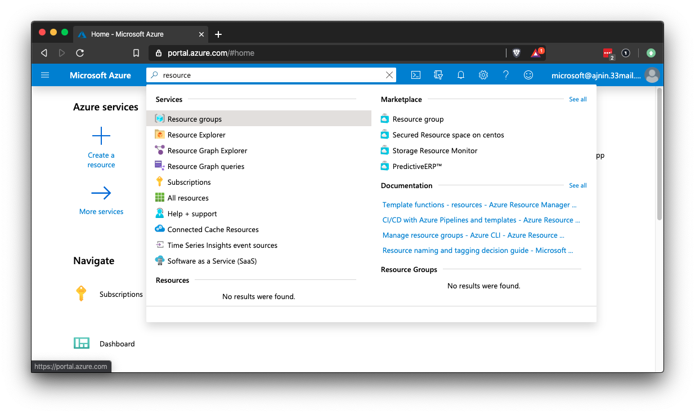
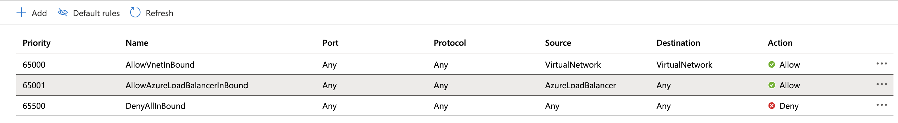
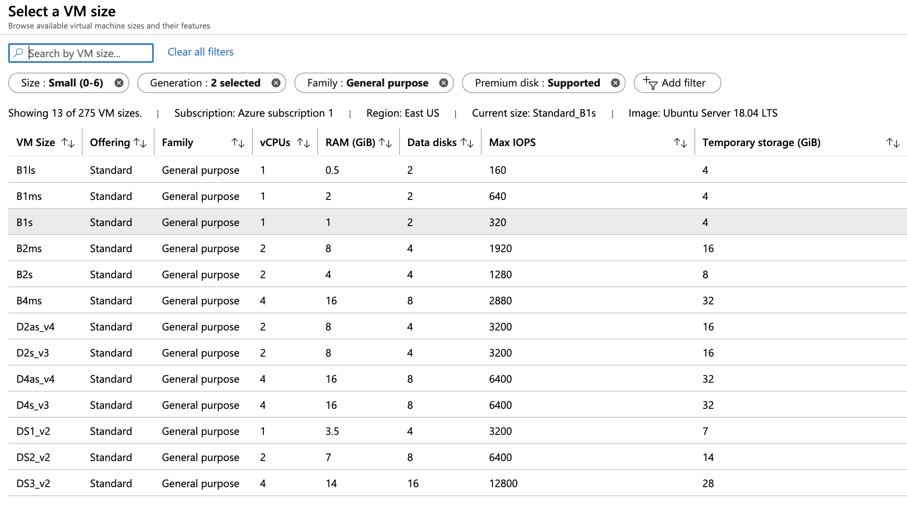
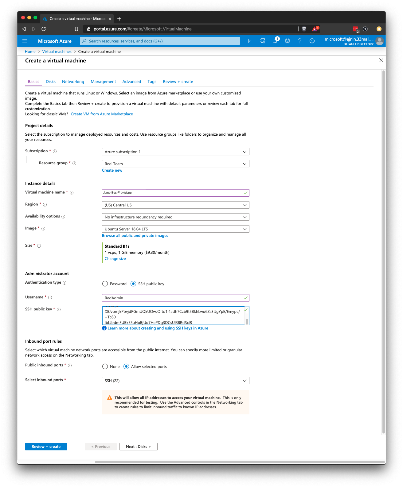
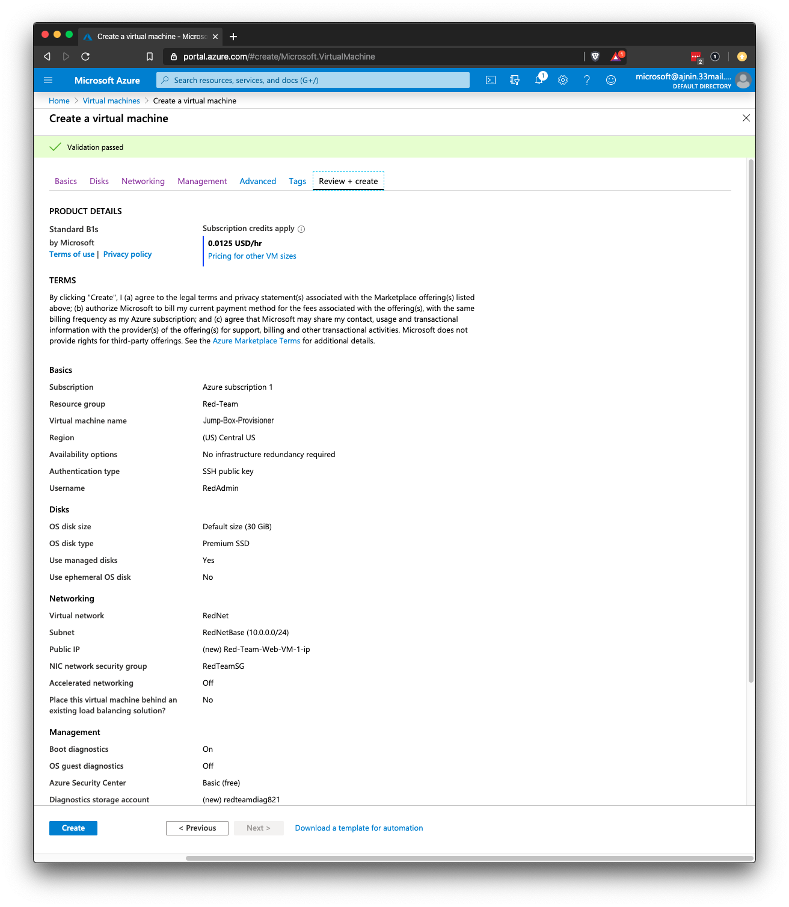
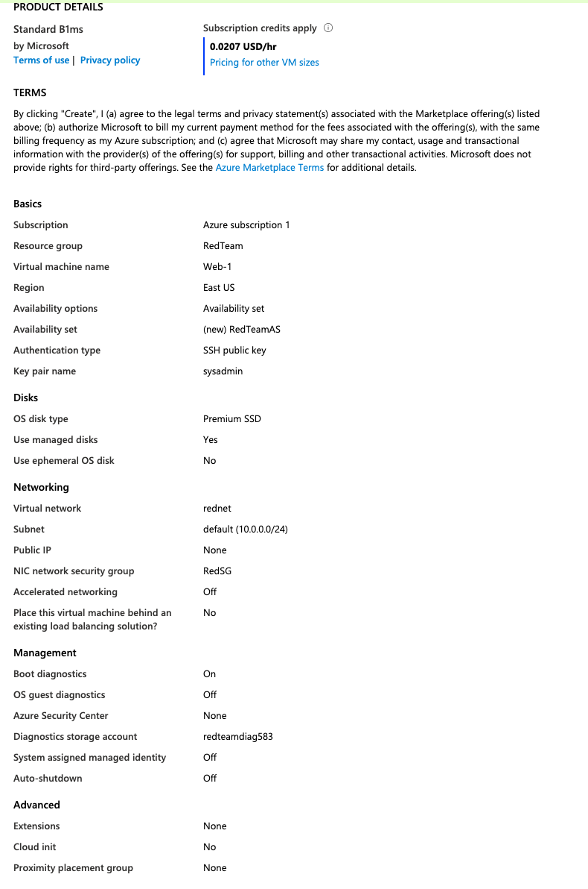

## 12.1 Lesson Plan: Introduction To Cloud Computing


### Class Overview

Today's class is the beginning of the Cloud Security and Virtualization unit. It will introduce students to cloud computing service models, cloud networking, firewalls, and virtual computing.

Over these next four classes, students will build a basic cloud network using VMs and containers.

### Class Objectives

By the end of class, students should be able to:

- Distinguish between cloud services and identify an appropriate service depending on an organization's needs.

- Set up a virtual private cloud network.

- Protect their cloud network with a firewall.

- Deploy a virtual computer to their cloud network.

#### Instructor Notes


|:warning: **Important Note About This Week** :warning:|
|:-:|
| This week is a cumulative lesson. Students cannot miss one day and then continue to the next lesson. If a student is absent during one of the four days, they will assistance from the instructional staff to catch up.|
|Use this checklist to ensure that each student has completed each day's tasks: [Unit 12 Daily Checklist](../Resources/Checklist.md) |
|As Azure interfaces can change frequently, please notify the curriculum team immediately as you're prepping if instructions or screenshots are out of date. Do NOT attempt to adjust settings or perform other workarounds without first consulting the curriculum team, as these workarounds may cut into the $200 credit.|

Over the next week, students will build out cloud infrastructure that includes a jump-box and 4 servers running containers that feed logs to a machine running ELK stack.

- Throughout this setup, we will follow the principle of least privilege and start with setting up a secure virtual network, before deploying machines to that network.

- Machines that are deployed will not have any access until firewall rules are put in place to access a specific service or machine.

- Each step and firewall rule is covered throughout the activities in a real-world development progression.

- Students should have a theoretical understanding of much of the networking portions of this week, but here they will get a chance to put everything together using real VMs and Cloud Infrastructure.

Students will build and document a network similar to the network in this diagram:


Note that this unit is four classes.  This extended length will ensure that students have ample time to complete the required activities for the week. What students set up this week will lead into the set-up for Project Week.

- Day 4 has optional activities if you are able to complete the required activities ahead of time.

- Otherwise, please feel free to extend the suggested times in the first three days as you will have time in Day 4 to catch up.

Azure has limited the free trial to only allow 4 machines to be deployed per region.

**Azure Changes:** Azure makes regular updates to their user interface so you may notice slight differences that come up. If you notice something that has changed or deviates from our included screen shots, please notify the curriculum team as soon as possible so we can apply a patch to the curriculum.

- Remind students that they need to shut off their labs. This is going to be especially important this unit and the Project 1 unit. Students may be charged by Azure if they leave their labs on and exceed their $200 credit. While we can add quota hours to our Azure Lab Services environment, we will not be able to do anything for students who exceed the $200 limit on their personal Azure accounts.

After the cloud section of the course is over, students will want to destroy all of the VMs they have created in their account. Otherwise, Azure will eventually charge for storage space.


### Lab Environment 

<details><summary>Lab Details</summary>
<br>

For the majority of demonstrations and activities, the class will use Microsoft Azure cloud services and the Azure cloud portal.

You will **not** be using any of the Azure lab environments. Instead, you and students will be using personal Azure accounts.

Students should have created free accounts created on [Microsoft Azure](https://azure.microsoft.com/en-us/) **before** the beginning of class. Please make sure every student is signed into their own personal Azure account and **not** the lab environments. If any students still need to create their account, have them do so before you begin class.

Slack out the [Setup Guide](https://docs.google.com/document/d/1gs_09b7eotl7hzTL82xlqPt-OwOd0aWA78qcQxtMr6Y/edit) for anyone who still needs it.

- Slack out [Azure Free Tier FAQ's](https://azure.microsoft.com/en-us/free/free-account-faq/)

**Important:** During these classes, students will need to generate ssh keys. Please remind any students that are using a Windows machine that they should have downloaded and installed [GitBash](https://gitforwindows.org/) on their machine. GitBash should be used to follow all ssh instructions for these units.

#### References

- [Microsoft Azure](https://azure.microsoft.com/en-us/)
- [Docker](https://www.docker.com/)
- [Ansible](https://www.ansible.com/)
- [Microsoft Azure phone app](https://apps.apple.com/us/app/microsoft-azure/id1219013620)
    - It is recommended to use the Azure web portal while completing class activities.
    - This phone app will _not_ be covered in any class or activities, however, students may want to explore using it outside of class.

</details>

### Slideshow 

The slides for today can be viewed on Google Drive here: [12.1 Slides](https://docs.google.com/presentation/d/1k90DrSliE4Ogn8CcJRWzwCSa3EggwW6Ch66D6aufhV4/edit#slide=id.g4789b2c72f_0_6)

- To add slides to the student-facing repository, download the slides as a PDF by navigating to File > "Download as" and choose "PDF document." Then, add the PDF file to your class repository along with other necessary files.

- **Note:** Editing access is not available for these document. If you or your students wish to modify the slides, please create a copy by navigating to File > "Make a copy...".

### Time Tracker

The time tracker for todays lesson can be viewed on Google Drive here: [12.1 Time Tracker](https://docs.google.com/spreadsheets/d/1D-rEaPZXDy-9Ly9LHGakfGXP0gJdBRHAiSXFw8u7Udo/edit#gid=0).

### Student Guide

Make sure to send class the student-facing version of the lesson plan located here: [12.1 Student Guide](StudentGuide.md)

---

### 01. Instructor Do: Introduction To Cloud Computing (0:05)

Welcome the students to class and give them a quick overview of what we'll cover today:

- Overview of cloud service models and the variety of cloud services available to organizations.

- Setting up a virtual cloud network that will run all of their systems during this unit.

- Securing a cloud network with a firewall and creating firewall rules.

- Virtual computing, creating web VMs in the cloud instance, and a jump box.

#### The Rise of the Cloud

Explain that before the cloud, organizations set up their networks on devices that they owned and controlled. These setups are called **on-premises networks** because they live on machines owned and operated on the company's physical property.

Currently, the cloud and cloud services (vs. on-premises setups) dominate the computing industry. Many organizations are looking to move operations to a cloud provider, but are worried about the security of the cloud.

This concern is justified. Since both on-premises and cloud deployments are, essentially, just networks, many fundamental security concerns apply in both contexts. However, some concerns apply to the cloud and not to on-premises setups. These include:

- **Complex architecture**: Systems must be built to both ensure basic security, and allow infrastructure personnel to securely monitor, reconfigure, and redeploy machines as needed. This is typically easier to do securely with on-premises machines, since these are not exposed to public networks unless they need to be. But cloud deployments are remote, and therefore we must take extra steps to ensure they are only exposed to the relevant parties.

- **Extensive management**: The cloud offers much more flexibility than organizations are used to, giving them freedom to create many more machines. This flexibility is a good thing, but it also makes operations management more complex. Machines can appear and disappear seemingly at random, so properly tracking everything requires additional skills and techniques.

- **Different threats**: The cloud is exposed to public networks. Cloud providers handle certain aspects of security for an organization, which means security professionals have new and different things they must pay attention to. Malicious actors will execute escalation and lateral movement tactics differently on the cloud than on-premises.

- **Ensuring availability**: High availability of machines is a large part of security on the cloud. Ensuring availability and redundancy on the cloud is done differently than with on-premises environments.

Emphasize that protecting cloud deployments is not harder than protecting on-premises networks. However, it is distinctly different. Therefore, being able to protect cloud deployments is a valuable skill for a cybersecurity professional.

List some job roles in which these skills are used:

- **Cloud Security Analyst** or **Cloud Penetration Tester**: These roles need to understand cloud architecture in order to test the security settings for a given environment.

- **Cloud Architect**: This role builds out a cloud environment for an organization. They are expected to understand how to build-in security from the beginning.

- **DevSecOps**: These roles are responsible for maintaining production and testing environments for an organization's developer and QA testing teams. They are expected to build and maintain secure systems at every step of the development process.

Let students know that today's activities will take them through the basics of setting up a cloud environment protected by a firewall, and hosting a few virtual machines.

### 02. Instructor Do: Cloud Service Models (0:10)

:warning: **Heads Up**: For all demos, you should be using your own personal Azure account. Please make sure that you are logged in at portal.azure.com.

Explain that students can think of the cloud in the same way they would think about an on-site data center or network. The cloud has all of the same equipment: servers, virtual machines, routers, firewalls, load balancers, etc. The difference is that, in the cloud, most of these items are virtualized, meaning they are software instead of hardware.

Emphasize that this allows a cloud administrator to create entire networks of computers, servers, and other equipment, all virtualized by software. An entire setup may only physically exist on a few powerful virtual servers.

The fact that cloud networks are virtualized and defined by software gives them numerous security benefits:

- **Ground-up security**: From a security perspective, the cloud presents an opportunity to build a secure system from the beginning, as opposed to trying to implement new security measures on old systems.

- **Easy configuration**: Instead of having to learn the many different tools that will be included on a network, an administrator can use the cloud service provider's website portal or command line to create all their needed items.

- **Quick turnaround**: Compromised and insecure machines can be discarded and replaced quickly, at no additional cost to the organization.

- **Personalized networks from cloud providers:** Software and configuration-as-code allows cloud providers to deploy the specific network that engineers need for their circumstances. Security specialists can define the secure network they need, and the cloud provider can create and test the deployments, making the networks more dependable.

- **High availability and fault tolerance**: Without their own physical data centers, engineers can focus on deploying their machines in multiple places, and the provider can maintain the data center. This way, cloud networks are more robust against power outages, DoS attacks and other threats, as long as they are configured correctly.

- **Easy implementation**: Security controls can be implemented more easily, because they require only modifications to software-defined networking patterns. No complicated rearrangements of physical wiring are necessary.

- **Affordability**: Organizations can use powerful machines that they would not be able to afford if they had to purchase and maintain them themselves. For example, GPU processing units, which are very expensive to buy and very expensive to lose to an attacker.

#### Cloud Services

Reiterate that deploying cloud services securely is different from developing secure on-premises networks. We'll need to understand which services cloud providers make available, what each service does, and when to use each one.

Explain that all cloud services add the phrase "as a service" to the name of the service. For example: platform as a service (PaaS) and software as a service (SaaS). Students will see the "aaS" acronym on certification exams as well as in job requirements.

Explain the main cloud services:

**IaaS (Infrastructure as a Service)**: A service provider offers pay-as-you-go access to storage, networking, servers and other computing resources in the cloud.
- Security benefits include high availability, guarantees that base machines are up-to-date at the time of deployment, and provider-enforced security controls, such as basic access management.

- Organizations can focus on implementing functionality and security that is relevant only to their business concerns, and not worry about the basics of secure deployments.

- AWS, Azure, and Google Cloud all offer IaaS.

**PaaS (Platform as a Service)**: A service provider offers access to a cloud-based environment in which users can build and deliver applications. The provider supplies the underlying infrastructure.

- Organizations can leverage powerful applications that are guaranteed to be secure and available, without having to properly implement security themselves.

- Azure Classroom Labs, on top of which this course's lab environments are deployed, is one example. It guarantees availability and provides access only to the ports necessary to connect to the labs.

**SaaS (Software as a Service)**: A service provider delivers software and applications through the internet. Users subscribe to the software and access it through the web or vendor APIs.
- The software runs in environments that are guaranteed by the provider to be secure. Engineers do not need to worry about secure deployment.

- Cloud software such as the Microsoft 365 Cloud Office Suite and Apple's Cloud iWork are examples of SaaS.

**DaaS/DBaaS (Data as a Service/Database as a Service)**: A service that provides a company's data product to the user on demand, regardless of geographic or organizational distance between provider and consumer.

- The main security advantages are high-availability and fault tolerance. DaaS ensures data is always available, even if there is a power outage at a single data center, and ensures that data is still deployed from a center as close to those consuming it, in order to reduce latency.

- An example of a DaaS is a marketing company that keep databases of consumers categorized for many different industries.

**CaaS (Communications as a Service)**: A service that provides an outsourced communications solution. Such communications can include Voice over IP (VoIP or Internet telephony), instant messaging (IM), and collaboration and video conference applications.

- CaaS guarantees security by ensuring that communications are not vulnerable to eavesdropping, and provides comprehensive monitoring/record-keeping for auditing purposes.

- Zoom, FaceTime, Skype, and GoToMeeting are all examples of CaaS.

**XaaS (Anything as a Service)**: Cloud services providing all any combination of the offerings mentioned so far.

Point out that these services are presented differently by different providers. As well, some providers offer simplified versions of these services to make them easier to implement.

Pause and ask if the students have any questions about these services so far.

Point out some pros and cons of using a pre-configured service as opposed to building a custom solution:

- A pre-configured service is faster to set up.
- A pre-configured service requires less training and research for a system administrator.
- A custom solution gives the organization complete control over the solution.
- A custom solution may be less expensive, but requires more internal training.

Note that cloud providers all have the same abilities, but may look different. Additionally, different providers offer different levels of pre-configured services. Which provider an organization chooses will depend on their specific needs.

- We use Azure in this class, but this unit is meant to be provider-agnostic. In other words, students should be able to apply the same skills to other providers.

### 03. Instructor Do: Virtual Networking (0:15)

This week will focus on the IaaS (Infrastructure as a Service) offering from Microsoft's Azure.

- IaaS is the most fundamental cloud service. All other services are software-based and assume that the infrastructure is already set up.

- Focusing on IaaS will allow us to get some hands-on experience configuring a cloud networking environment, as well as configuring the servers inside the network.

#### Creating an Environment

In class today, we will begin creating a cloud infrastructure environment that students will use for the remainder of the unit, as well as for other units, such as Web Vulnerabilities and Projects.

Remind students that finding resources on a virtualized network requires more than just locating the physical machine on which they're deployed. Keeping resources organized on the cloud is often more challenging than in an on-premises environment.

Explain that in Azure, **resource groups** allow engineers to sort related resources into different groups, each of which can be easily located by name.

- A resource group is a logical grouping of all resources used for a particular setup or project. The resource group will contain the network, firewalls, virtual computers, and other resources that are needed for setup.

- Different organizations use different naming conventions for resource groups and their contents. In class, we'll simply name resource groups based on the project or activity they correspond to. Emphasize to students that, when working in a professional setting, they should take note of how their employers name resource groups.

The first step to creating an environment in Azure is to create a resource group. Once we have a resource group, we can start adding items to it, the first of which will be a virtual network.

Explain that the Azure Portal is intuitive and easy to use. The easiest way to find what you need is to use the search bar.

- Open your Azure portal and search for "resource group" to demonstrate.

    

- Select **Resource groups** in the search results and point out the **+ Create** button at the top.

Explain that not all regions will have available well-priced VMs and students may need to change the region as they add resources.
  - Use the default region that will show automatically for your location. In our examples we are using US West.

- Explain that every resource the students create will have this button at the top.

    


Now that we have a resource group, we can add a virtual network.

Explain that a **virtual network** is just what it sounds like: a collection of virtual machines that can communicate with each other.

- Unlike physical networks, which need physical wiring to achieve connections and discovery, virtual networks are much more flexible. The VMs on a virtual network can live in completely different data centers, but perform as if they are wired, as well as provide improved availability.

- Virtual networks can be quickly and easily reconfigured by clicking a few buttons in the portal. This is much faster and safer than rewiring a physical network to improve segmentation. It also results in less human error.

Explain that in order for virtual networks to behave identically to physical ones, cloud providers use software to emulate everything a physical machine uses to interact with a network, including:

- **vNICs** (Virtual Network Interface Cards): Similar to physical machines, VMs have software versions of "normal" NICs. Just like physical machines, VMs can have multiple vNICs.

- **IP addresses**: VMs have IP addresses, just like physical computers. IP addresses are considered their own type of resource in Azure, AWS, and other cloud environments.

- **Subnets**: Like IP addresses, subnets are considered separate resources in the cloud, meaning they can be created independently of other resources. After creating a virtual network, we can create a new virtual subnet and add it to the existing network. We can also create a new public IP address resource and associate it with an existing virtual machine.

Point out that creating a virtual network creates all of these resources at the same time. Students will not create them independently in this lesson. However, it is crucial to understand that this can be done, as it is common practice when managing and reconfiguring real-world deployments.

Remind students that they should rely on the IP addressing structures that they learned during the unit on networking.

- Private networks will use one of three IP schemes:
    - `192.168.x.x`
    - `172.16.x.x`
    - `10.x.x.x`

- We can also use CIDR notation when defining a network space:
    - `192.168.1.0/24`

Explain that when creating a network in Azure, we will define a large network as well as a subnet inside that network. For example:

- `10.0.0.0/16` for the large network.
- `10.10.1.0/24` for the first subnet.

Point out that these default values will be automatically populated and students do not need to change them.

Emphasize that we'll only need to define the boundaries of the network and we can use the default values. Azure does the rest. We will not need to configure a router or DHCP, as these are configured automatically.

- Cloud providers configure this functionality automatically and _securely_, making it difficult to attack routers and DHCP servers directly.

- Azure also automatically provides logging capabilities, so we can easily check the history of the DHCP lease.

:warning: **Heads Up**: Under the `Security` tab, there is an option to enable DDoS Protection Standard. Explain that in order to avoid additional charges of up to three thousand dollars, we will **not** be enabling the DDoS protection. 


Final vNet Settings should be similar to:


Ask if there are any questions about defining a network space before proceeding.

### 04. Student Do: Virtual Networking (0:20)

:warning: **Heads Up**: Make sure that students are using their personal Azure account for every activities. They should be logged in at portal.azure.com (instead of labs.azure.com).

:warning: **Heads Up**: Remind students to **not** enable the DDoS protection. This will exceed the $200 credit quickly; students will not be able to complete the remainder of this unit and Unit 13. Please remember and remind students that the bootcamp will not cover any costs students incur beyond the $200 free credit.

Explain the following to students:

- In this activity, you will be playing the role of an Azure cloud security engineer for XCorp.

- XCorp's Red Team has opened a ticket asking for a cloud server to be set up with a vulnerable web application. The Red Team will use this server to train new team members. It has been approved by the director of security.
    - Note: If "Red Team" is a new term for students, explain that it is part of a penetration testing team that acts as malicious in order to find vulnerabilities in target.

- At this time, there are no cloud resources dedicated to the Red Team, so you will need to create everything from the ground up, starting with the network that the server will use.

- You are tasked with creating a resource group and a virtual network for the Red Team.

:globe_with_meridians: This activity will use **breakout rooms**. Assign students into groups of 3-5 and move them into breakout rooms.

Send students the following file:

- [Activity File: Virtual Networking](Activities/04_Virtual_Networking/Unsolved/README.md)


### 05. Instructor Review: Virtual Networking Activity (0:15)


:bar_chart: Run a comprehension check poll before reviewing the activity. 


The goal of this activity was to set up the cloud network using the Azure Portal. This required first setting up a resource group containing all other objects the students will set up during the cloud security unit.

If a student's Azure account is not fully setup yet, do so using these instructions: [Azure Sign Up](Resources/azure_sign_up.md).

Send students the following file:

- [Solution Guide: Virtual Networking](Activities/04_Virtual_Networking/Solved/README.md)

#### Setting up a Resource Group

Use the Azure portal to create a resource group that will contain everything the Red Team needs in the cloud.

- On the home screen, search for "resource."

    

- Click on the **+ Create** button or the **Create resource group** button.

    

- Create a name for your resource group and choose a region.

:warning: **Heads Up**: Choose a region that you can easily remember. Every resource you create after this must be created in the exact same region.

- Click on **Review + create**.

    

- Azure will alert you if there are any errors. Click on **Create** to finalize your settings and create the group.

    

- Once the group is created, click on **Go to resource group** in the top-right corner of the screen to view your new resource group.

    

#### Setting up the VNet


Before you can deploy servers and services, there must be a network where these items can be accessed.

- This network should have the capacity to hold any resource that the Red Team needs, now and in the future.

- Return to the home screen and search for "net." Choose the search result for **Virtual networks**.

    

- Click on the **+ Create** button on the top-left of the page or the **Create virtual network** button on the bottom of the page.

    

Fill in the network settings:

- Subscription: Your free subscription should be the only option here.

- Resource group: This should be the resource group you created in step two.

- Name: A descriptive name so it will not get confused with other cloud networks in the same account.

- Region: Make sure to choose the same region you chose for your resource group.

:warning: **Heads Up**: Carefully configuring the region of your resources is important for ensuring low latency and high availability. Resources should be located as close as possible to those who will be consuming them. Each time a resource is created, choose the same region.


- IP Addresses: Azure requires you to define a network and subnet.

	- Use the defaults on this tab.


- Security: Leave the default settings.


While we will leave DDoS protection and firewall at their default options, take a moment to explain them both.

- **DDoS protection** is built-in protection against distributed denial of service (DDoS) attacks. It offers the following benefits:

    - Azure's DDoS protection features are backed by the Microsoft global network, meaning that every virtual network has the best possible protection against DoS events.

    - DDoS protection scrubs traffic before it enters your network, protecting availability by aggressively filtering high-volume traffic.

    - In class, we avoided using DDoS Protection so we didn’t go over our 200 dollar limit, but ideally in the real world we would be provided with that funding. To configure DDoS protection, all we need to do is make sure it is enabled. When enabled, Azure provides near real-time monitoring for DDoS traffic. 

    - Azure's DDoS mitigations offer adaptive tuning, meaning that it learns your resources' traffic patterns over time and adapts its protections accordingly. This ensures that all networks deployed on the cloud have personalized protection.

    - By default, DDoS protection mitigates denial of service attacks at the network level (Layers 3 and 4). While we won't explore it in class, it can be extended to include application-level protections (Layer 7), including protection against SQL injections, XSS, session hijacking, and other vulnerabilities that students will study during the Web and Web Vulnerabilities units.

    - Finally, this feature integrates with a service called Azure Monitor, which allows engineers to easily configure alerts and access attack metrics and telemetry.
        - Additionally, when an attack is detected, it generates detailed reports of network health every five minutes, produces a summary of events after the attack ends, and allows you to stream logs to a privately managed security information and event management (SIEM) system for near real-time monitoring during an incident.

- Explain that all cloud providers offer similar functionality, with the key takeaway being that you can enjoy highly effective mitigation without configuring it yourself.

**Firewall:** This will create a basic firewall for our network. Instead, We will create a firewall in another activity, so we won't need to enable this basic firewall.

- Tags: No tags are needed.


Click on **Create**.


Once you have created your resource group and VNet, return to the home screen and choose the resource group option.
- This provides a list of all resource groups in your account.
- Choose the group that you created and you should see your VNet listed as a resource.


Students should now have a resource group and VNet that they can use to create the rest of the cloud infrastructure throughout the unit.

Ask students if there are any questions about creating a VNet or resource group.

### 06. Break (0:10)

### 07. Instructor Do: Security Groups (0:20)

Remind students that our goal is to have a virtual machine running behind a firewall on their virtual network in the cloud by the end of the day.

Now that we have a virtual network set up, we want to protect it with a firewall.

- As a review: Firewalls block or allow network traffic depending on what rules are set.

- We can set rules on single or multiple ports, coming from and going to a single IP or multiple IPs.

Explain that on the Azure platform, our basic firewall is called a **network security group (NSG)**. We will use a network security group to block and allow traffic to our virtual network and between machines on that network.

As mentioned earlier, many resources can be created independently of any particular virtual network and then attached to a VNet after creation.

- Network security groups are a good example of this concept. In this demonstration and the following activity, we will create an NSG that blocks all traffic to and from the network. We will then attach it to the VNet to secure it.

- This model, while seemingly complex, has the advantage of allowing security engineers to create NSGs for different traffic profiles, which they can then replicate and apply to any VNet.

- For example, one might create an NSG called Desktop Connections, which clears RDP and VNC traffic to and from the VNet. Engineers can then use this NSG as a template, clone it, and apply it to any new or existing VNet that requires this type of access.

:warning: **Heads Up**: Students will attach a network security groups to each VM in the virtual network instead of attaching the security group to the network itself. This will provide students with additional practice of applying NSGs to Azure entities. This practice emphasizes that NSGs allow cloud security engineers to implement granular access controls on each device in their networks.

In this project, we are attaching the same NSG to each VM, because each VM should have the same access controls. However, in practice, one could attach different NSGs to each VM, allowing engineers to differentiate access control requirements for different machines.

While a similar effect could also be achieved by attaching the NSG to the network instead of individual VMs, we prefer to emphasize that NSGs can be applied on a per-asset basis for fine-grained implementation of access controls.

#### Network Security Group Demonstration

Begin by completing the following:

- Open your Azure portal and search for "Network security group."

- Use the **+ Create** button to add a network security group.

- Name the group something memorable.

- Once the group is created, click **Go to resource**.

- Click **Inbound rules** on the left side.

Point out the default rules and explain their purpose:



- The first rule allows all traffic to flow inside the vNet with destination and source both set to 'Internal Network'.
	- This means that all machines deployed using this Security Group will be able to communicate with each other.
- The second rule allows all traffic coming from a load balancer.
	- This means that _if_ there were a load balancer assigned to this security group, it could send traffic to all the resources on the internal network.
- The final rule blocks all other traffic.
	- This means that all traffic from the internet is automatically blocked to any resource you protect with this Security Group.

Point out that when a machine is deployed to your vNet using this security group, you will have to create a rule that allows access to that resource.

Explain that, as an example, you will create a rule that allows RDP on port `3389`.

Create a rule using the following settings:

- Source: This is the source computer. It can be a single IP, a range of addresses, an application security group, or a service tag.

    - An application security group is a kind of web application firewall that we won't be using.
    - A service tag will filter for a specific location or source of traffic.
    - For this rule, we will set the source to your external IP address.
			- Visit [http://ip4.me/](http://ip4.me/) to obtain your external IPv4 address.
		- Choose 'Ip Addresses' from the dropdown and paste in your external IPv4 address.

- Source Port Ranges: Source ports are generated randomly, so it's best to leave the wild card (*) here to signify all source ports.

- Destination: We can choose between Any, IP address(s), VirtualNetwork, or an application security group. We'll choose **VirtualNetwork**.
	- Note that _if_ you wanted to send traffic to a specific machine, you would enter it's _internal_ IP address here.

- Service: We can choose the protocol RDP

- Destination Port Ranges: RDP uses port `3389`, so this will automatically be selected.

- Protocol: We can choose TCP, UDP, ICMP. In the image above, **TCP** was automatically chosen when we selected RDP.

- Action: Firewall rules are either denying traffic or allowing traffic. Here, we are going to choose **Allow**.

- Priority: Firewall rules are implemented in sequence. A priority number allows rules to be read and sorted based on their priority number, from lowest to highest. We can see that the default rules start with a priority of 100, so anything we set under 100 will be read first. In the example above, we've used 500.

- Name/Description: You can name a rule whatever you like, but it is a best practice to name it what it is and describe what it does. Here, we will name it "Allow-RDP" and add the description: "Allow RDP from external IP over port 3389."


**Note:** The external IP is not shown in the screen shot.

Save your new security group rule.

Ask students if they have any questions about creating a security group or a security group rule.

### 08. Student Do: Security Groups (0:20)

Explain the following to students:

- In this activity, you will continue building out the resources needed for XCorp's Red Team.

- At this time, we have a dedicated resource group and network in place for the Red Team. Before we start launching servers and resources, we want to set up some network protection.

- You are tasked with creating a network security group to control access to any resources in the subnet that you created in the last activity.

- By default, the Azure Security Group rules allow traffic from a load balancer and allows traffic between machines on the vNet.

- To completely secure the vNet, we will create a rule that blocks _all_ traffic.

:globe_with_meridians: Students should stay in the same **breakout room** groups as the previous activity.

Send students the following file:

- [Activity File: Security Groups](Activities/09_Security_Groups/Unsolved/README.md)


### 09. Instructor Review: Virtual Private Cloud Activity (0:15)


:bar_chart: Run a comprehension check poll before reviewing the activity. 


This activity had students setup a firewall in front of their VNet to block all network traffic. The main goal of this activity is to get the Security Group created and practice creating a rule.

Point out that this rule is blocking _all_ traffic bypassing the default rules that are already created and giving you complete control over all traffic on the vNet.

Send students the following file:

- [Solution Guide: Security Groups](Activities/09_Security_Groups/Solved/README.md)

#### Walkthrough

To create a network security group:

- On your Azure portal home screen, search "net" and choose **Network security groups**.

    

- Create a new security group.

- Add this security group to your resource group.

- Give the group a recognizable name that is easy to remember.

- Make sure the security group is in the same region that you chose during the previous activity.

Your settings for this NSG should look similar to:


To create an inbound rule to block all traffic:

- Once the security group is created, click on the group to configure it.

- Choose **Inbound security rules** on the left.

- Click on the **+ Add** button to add a rule.

    

Configure the inbound rule and explain the following:

- Source: For now, we want to choose **Any** source to block all traffic.

- Source port ranges: Source ports are always random, even with common services like HTTP. Therefore, we will want to keep the wildcard (*) to match all source ports.

- Destination: Here, we will select **Any** to block any and all traffic associated with this security group.

- Service: Here we will leave this as **Custom** as we are going to select all port ranges in the next configuration.

- Destination port ranges: Usually we would specify a specific port or a range of ports for the destination. In this case, we can use the wildcard (*) to block all destination ports. You could also block all ports using a range like `0-65535`.

- Protocol: We will choose to block **Any** protocol that is used.

- Action: We want to use the **Block** action to stop all of the traffic that matches this rule.

- Priority: This rule will always be our last rule, so we want to choose the highest number for the priority available. Subsequent rules will always come before this rule. The highest number Azure allows is 4,096.

- Name: Give your rule a name like "Default-Deny."

- Description: Write a quick description similar to "Deny all inbound traffic."

    

- Save the rule.

- Your security group overview should now look similar to this:

    


We should now have a VNet in place protected by a network security group that is blocking all traffic.

Explain that this rule will stop all traffic on this vNet, unless we set other rules to allow the traffic we want. We are doing this to practice writing firewall rules and gain complete control over the SG traffic.

In total, so far we have created a cloud network secured by a firewall.

### 10. Instructor Do: Virtual Computing (0:20)

In the last section of today's class, we will deploy 3 computers onto our network.

- Virtual computing is very common in today's internet infrastructure. In fact, many of the servers that students interact with on a daily basis are actually virtual servers.

- Virtual computers have all the same components that physical computers have, but, as expected, they are defined by software.

Explain that when you set up a virtual machine, often, you often have to decide how powerful you need the machine to be and choose each of the main hardware components.

These components include:

- **RAM (Random Access Memory)** is the amount of memory dedicated to running computer operations. The computer uses RAM to temporarily store data that it needs to access quickly.
    - When an application runs, it runs on RAM. The computer puts all of the needed bits of the application into RAM and accesses them to complete the operation of the application.

    - The more RAM is on a computer, the more applications a computer can run simultaneously.

    - When the computer is restarted, the RAM is cleared and the process of loading applications to RAM is restarted.

    - RAM is measured in increments of 8 bytes. Today's common values are 8, 16, and 32 GB on personal computers, and much more (128+ GB) on servers.

- **Storage (HDD/SSD)** is the part of the computer that stores data permanently. This is data that you do not lose when the computer is turned off.

    - HDD (hard disk drive) is a magnetic disk that spins inside a casing. The disk is read with a small magnet attached to an arm, similar to the way a record player reads a record.

    - SSD (solid state drive) is a more technologically advanced form of storage. Because HDDs have moving parts, they eventually wear out and stop working. An SSD has no moving parts and is based on the same technology that RAM uses.

        - SSDs are faster and more reliable than HDDs but also more expensive. For now, both options still exist, and which you choose will depend on the needs of the computer and your budget. SSDs are great for data that needs to be accessed quickly and HDDs are great when you have very large amounts of data that do not need to be accessed often or quickly.

    - For virtual servers, long term storage is essentially a database that the server or OS needs to read and write to.

        - For example: Information for user logins is stored in one database on either an HDD or an SSD, and the operating system is stored on a different HDD or SSD, depending on how the machine is set up.

        - Long-term storage is measured in gigabytes and terabytes.

- **Disks** attached to a VM fall into two general categories:

    - OS disks contain the operating system, kernel, and everything required for the VM to function.

    - Data disks contain data that the VM doesn't need in order to run, but which users need in order to do their jobs. This might include:
        - Virtual machine images, in the case of Azure classroom labs.
        - Text data, if you're using a cloud VM to do "normal work."
        - Forensic disk images, if you're using a cloud VM for investigative duties.
        - Audio, images, and video data, if you're using the machine to perform heavy-duty graphical processing, such as speech or facial recognition.

- Explain that cloud providers allow you to choose different kinds of disks, depending on your needs:
    - As mentioned above, you can use a simple HDD if all you need is persistent storage of basic information, such as text, spreadsheets, or forensic disk images.

    - Or you can choose a premium SSD if you need to be able to quickly run memory-intensive applications, such as FTK or Autopsy.

- The cloud provides users a ton of flexibility and choice, but some options are far more expensive than others. What you choose should depend on your specific needs.

    - It is affordable to use the cloud to experiment with high-performing hardware for short periods of time.

    - Threat intelligence professionals, for instance, often use powerful GPU-driven machines for machine learning and computationally intensive data analysis. This is because it's much cheaper to use these machines for short periods of time on the cloud than to purchase and maintain them.

    - However, premium storage and top-of-the-line machines are just as expensive for cloud providers to own and maintain as they would be for an individual or organization. Using them without first establishing cost controls can quickly result in massive expenses.

- **CPU (Central Processing Unit)** is like the brain of the computer. It's the part that actually computes all the ones and zeros. The CPU takes code and data out of the long term storage, loads it into RAM, and performs the computations specified by an application.

    - When you are waiting for a computer to complete a task, such as installing software or copying data from one location to another, you are waiting for the CPU to complete the necessary computations.

    - The speed of a CPU is measured in hertz, which is the measurement of how many bits can be processed from a zero to a one per second. Today's CPUs are measured in gigahertz.

Explain that a virtual computer has a software version of these components. When we create a virtual computer, we define the "hardware," such as the amount of RAM, the storage space, and the CPU. Once it is defined, we install an operating system and use the VM as if it were a normal computer.

Point out that the physical servers located inside data centers have enormous amounts of RAM, storage space, and CPU power, so they can run many virtual computers at the same time. One physical server can easily run more than ten virtual machines, depending on the resources assigned to each VM. Virtual machines can even run other virtual machines.

Emphasize that, before working with devices on the cloud, we must _always_ set budget limits and cost-control policies. Otherwise, we can accidentally exceed our employer's budgets.

- Azure provides cost-control tools as a free service, which students are encouraged to study before managing live cloud deployments. We will not be using such expensive tools in class as it fall outside the scope of the course. However, they offer crucial functionality for managing live deployments on the job.

Explain that in our next activity, we will create a new VM and add it to our network.

Before we start, we'll cover a few key components of the VM creation process.

- Navigate to your Azure portal, search for "Virtual" and select **Virtual machines**.

- Click **+ Add** to create a new VM.

    

- Point out the tabs across the top of the VM creation page. Today we'll focus on the **Basics**, **Disks**, **Networking** and **Review + Create** tabs. Don't worry about the **Management**, **Advanced**, and **Tags** tabs.

    

- Name this VM "Jump-Box-Provisioner."

    - Explain to students that giving their VMs a descriptive name will help them stay organized.


---
#### Regions and VM Availability

By default Azure should populate a VM and Region.


Explain that under 'Availability Options' we won't need redundancy for the Jump-Box. This is because the jump box does not need to scale to handle a large number of connections: Only one administrator will use it at a time.

Explain that the web servers, by contrast, must be designed to handle a large number of requests. This requires configuring them with an **Availability Set**, and assigning each web server to that availability set and select it for the web machines.

Explain that an Availability Set is a fault-tolerant group of VMs. An Availability Set consists of at least two VMs. Each must be located in the same region, but each of the two VMs is hosted in a _different_ data center. Different data centers are called **Availability Zones**.

Explain that this ensures that, if one of the VMs in the availability set goes down, the other is (nearly) guaranteed to remain up: Even if an entire data center goes down, the redundant machine in the other Availability Zone will remain running.

Summarize by explaining that an **Availability Set** is a group of VMs, where each VM is in a different **Availability Zone**. If one of the Availability Zones goes down, the VM in the other picks up the workload.

Explain that students will setup one machine (a Jump Box) that does not need an availability set assigned to it. However, _all_ of the web VMs that are created _must_ be assigned to the same Availability Set so they can later be placed behind a load balancer.

**Note:** Azure limits free tier users to only 4 vCPUs per Region. Notice that the default machine will normally have 2 vCPUs and 8 GiB of memory. For this jump box, the machine size should be changed to a smaller machine to conserve resources.

The Jump-Box machine only needs 1 vCpu and 1 GiB of memory.

**NOTE:** _IF_ there is no machine selected by default, there may not be any machines available in that region. Azure VM availability updates dynamically so changing your region may give you the machine that you need.

Click on 'Change size'



Choose a machine that has 1vCPU and one GiB of Memory (B1s).

**NOTE:** If all of the machines are greyed out and you cannot select one, Azure doesn't have any available machines in the selected region. The region must be changed on the previous screen.


#### SSH setup
Remind the students that accessing a server with SSH using a password is inherently weak: many programs can brute force an SSH password. Instead, we want to practice setting up secure systems from the beginning, so we will use an SSH key pair to access our new machine.

- Azure has a section on the Basics page where we can insert a public key and create an administrator name for our SSH access.

- First, we have to create a key.

We'll do this on the command line using the `ssh-keygen` command.

:warning: **Heads Up**: Windows users should be running these commands in GitBash.

- Open a terminal and run `ssh-keygen`.

- We will be prompted to save the SSH key into the default directory `~/.ssh/id_rsa`. DO NOT CHANGE THIS LOCATION. Press the Enter key.

- We will be prompted to enter a password for our new SSH key.
	- DO NOT ENTER A PASSWORD. Press the enter key twice to enter a blank password.

- Emphasize that students should not change the name or location of this key and they should not enter a password. They only need to use the default values and hit enter to accept them. If they set a password or change the location, it can cause issues later on in the week when we setup automation.

- Point out that the path to the key is displayed in the first line: `Enter file in which to save the key (/Users/cyber/.ssh/id_rsa)` as long as it isn't changed. In this case the keys are saved in `/Users/cyber/.ssh/id_rsa` and `/Users/cyber/.ssh/id_rsa.pub`

- Your output should be similar to the below:

    ```bash
    $ ssh-keygen
    Generating public/private rsa key pair.
    Enter file in which to save the key (/Users/cyber/.ssh/id_rsa): <hit enter>
    Enter passphrase (empty for no passphrase): <hit enter>
    Enter same passphrase again: <hit enter>
    Your identification has been saved in id_rsa.
    Your public key has been saved in id_rsa.pub.
    The key fingerprint is:
    SHA256:r3aBFU50/5iQbbzhqXY+fOIfivRFdMFt37AvLJifC/0 cyber@2Us-MacBook-Pro.local
    The randomart image is:
    +---[RSA 2048]----+
    |         .. . ...|
    |          o. =..+|
    |         o .o *=+|
    |          o  +oB+|
    |        So o .*o.|
    |        ..+...+ .|
    |          o+++.+ |
    |        ..oo=+* o|
    |       ... ..=E=.|
    +----[SHA256]-----+
    ```

Explain that all SSH keys are stored in the user home folder under a hidden `.ssh` directory. Inside this directory we can see our private key named `id_rsa`, which should never be shared. We can also see a public key named `id_rsa.pub`, which we can place on servers that we want to access using this key.

- Run `cat ~/.ssh/id_rsa.pub` to show our `id_rsa.pub` key:

    ```bash
    $ cat ~/.ssh/id_rsa.pub

    ssh-rsa AAAAB3NzaC1yc2EAAAADAQABAAABAQDGG6dBJ6ibhgM09U+kn/5NE7cGc4CNHWXein0f+MciKElDalf76nVgFvJQEIImMhAGrtRRJDAd6itlPyBpurSyNOByU6LX7Gl6DfGQKzQns6+n9BheiVLLY9dtodp8oAXdVEGles5EslflPrTrjijVZa9lxGe34DtrjijExWM6hBb0KvwlkU4worPblINx+ghDv+3pdrkUXMsQAht/fLdtP/EBwgSXKYCu/
    ```

- Copy the SSH key string and paste it into the Administrator Account section on the Basics page for the VM in Azure.
    - For `SSH public key source` select `Use existing public key` from the drop down.

- The username can be any name, but it must be something the students will not forget. The SSH public key must be copied from the machine.

- This is all we need to do to create an administrator account on the machine that will have SSH access.

    

Pause and ask if there are any questions here before moving on.

### 11. Student Do: Virtual Computing (0:20)


Explain the following to students:

- In our previous activities, we set up a secure VNet inside a resource group for the Red Team.

- In this activity, you will launch 3 new virtual machines to be used throughout the cloud portion of the course.

- To keep your connections to these machines secure, you want to only connect using SSH keys.

- You are tasked with setting up 3 new Ubuntu VMs inside the Red Team resource group to be used throughout the cloud section of the course.
	- A Jump-Box and 2 web servers.


:globe_with_meridians: Students should stay in the same **breakout room** groups as the previous activity.

Send students the following file:

- [Activity File: Virtual Computing](Activities/12_Virtual_Computing/Unsolved/README.md)


### 12. Instructor Review: Virtual Computing Activity (0:10)


:bar_chart: Run a comprehension check poll before reviewing the activity. 


This activity has students set up their first 3 virtual machines inside their cloud network, protected by their network security group. They will one of  these machines as a jump box to access their cloud network and the other machines will be web servers.

Send students the following file:

- [Solution Guide: Virtual Networking](Activities/12_Virtual_Computing/Unsolved/README.md)

#### Walkthrough

Remind the students that allowing a server to use password authentication for SSH is inherently insecure because the password can be brute forced.

- Therefore, we will only use cryptographic SSH keys to access any of our cloud servers. Password authentication will not be allowed.

- This is part of the "ground up" security approach that we have been discussing.

Open your command line and run `ssh-keygen` to create a new SSH key pair.

- Your output should be similar to the below:

    ```bash
    cyber@2Us-MacBook-Pro ~ % ssh-keygen
    Generating public/private rsa key pair.
    Enter file in which to save the key (/Users/cyber/.ssh/id_rsa):
    Enter passphrase (empty for no passphrase):
    Enter same passphrase again:
    Your identification has been saved in id_rsa.
    Your public key has been saved in id_rsa.pub.
    The key fingerprint is:
    SHA256:r3aBFU50/5iQbbzhqXY+fOIfivRFdMFt37AvLJifC/0 cyber@2Us-MacBook-Pro.local
    The randomart image is:
    +---[RSA 2048]----+
    |         .. . ...|
    |          o. =..+|
    |         o .o *=+|
    |          o  +oB+|
    |        So o .*o.|
    |        ..+...+ .|
    |          o+++.+ |
    |        ..oo=+* o|
    |       ... ..=E=.|
    +----[SHA256]-----+
    ```

Run `cat ~/.ssh/id_rsa.pub` to display your `id_rsa.pub` key:

- Your output should be similar to the below:

    ```bash
    cyber@2Us-MacBook-Pro ~ % cat ~/.ssh/id_rsa.pub

    ssh-rsa AAAAB3NzaC1yc2EAAAADAQABAAABAQDGG6dBJ6ibhgM09U+kn/5NE7cGc4CNHWXein0f+MciKElDalf76nVgFvJQEIImMhAGrtRRJDAd6itlPyBpurSyNOByU6LX7Gl6DfGQKzQns6+n9BheiVLLY9dtodp8oAXdVEGles5EslflPrTrjijVZa9lxGe34DtrjijExWM6hBb0KvwlkU4worPblINx+ghDv+3pdrkUXMsQAht/fLdtP/EBwgSXKYCu/
    ```

- Highlight and copy the SSH key string to your clipboard.

Open your Azure portal and search for "virtual machines."

- Use the **+ Add** button or the **Create virtual machine** button to create a new VM.

    

Use the following setting for this VM:

- Resource group: Choose the same resource group that you created for the Red Team.

- Virtual machine name: Use the name "Jump Box Provisioner."

- Region: Use the same region that you used for your other resources.
	- Note that availability of VMs in Azure could cause you to change the region where your VMs are created.
	- The goal is to create 3 machines in the same resource group attached to the same security group. If you cannot add 3 machines to the resource group and security group that you have, a new resource group and security group may need to be created in another region.

- Availability options: We will use this setting for other machines. However, for our jump box, we will leave this on the default setting.

- Image: Choose the Ubuntu Server 18.04 option.

- Choose the VM option that has:
  - Whose offering is **Standard - B1s**
  - 1 CPU
  - 1 RAM

For SSH, use the following settings:

- Authentication type: SSH public key.

- Username: Create any username you like.

- SSH public key source: select `Use existing public key` from the drop down.

- SSH public key: Paste the public key string that you copied earlier.

- Public inbound ports: Ignore this setting. It will be overwritten when you choose your security group.

- Select inbound ports: Ignore this setting. It will be overwritten when you choose your security group.



Move to the **Networking** tab and set the following settings:

- Virtual network: Choose the VNet you created for the Red Team.

- Subnet: Choose the subnet that you created earlier.

- Public IP: Choose `Create new` and choose `Static` under Assignment in the side panel. Give the IP Address a unique name.


- NIC network security group: Choose the Advanced option so we can specify our custom security group.

- Configure network security group: Choose your Red Team network security group.

- Accelerated networking: Keep as the default setting (Off).

- Load balancing: Keep as the default setting (No).

    

- Click on **Review + create**.

    

- Finalize all your settings and create the VM by clicking on the **Create** button.

#### VMs 2 and 3 - Web VMs

Create 2 more new VMs. Keep the following in mind when configuring these VMs:
- Each VM should be named "Web-1" and "Web-2"

- These VMs need to be in the same resource group you are using for all other resources.

- The VMs should be located in the same region as your resource group and security group.
	- Note that availability of VMs in Azure could cause you to change the region where your VMs are created.
	- The goal is to create 3 machines in the same resource group attached to the same security group. If you cannot add 3 machines to the resource group and security group that you have, a new resource group and security group may need to be created in another region.

- The administrative username should make sense for this scenario. You should use the same admin name for all 3 machines. Make sure to take a note of this name as you will need it to login later.

- You will need to create a new SSH key for remote connections.
	- **Note:** Windows users should use [GitBash](https://gitforwindows.org/) to create ssh keys and ssh connections.

- Choose the VM option that has:
  - Whose offering is **Standard - B1ms**
  - 1 CPU
  - 2 RAM

**Note:** These web machines should have _2 GB_ of RAM and the Jump-Box only needs _1 GB_. All 3 machines should only have _1 vCPU_ because the free Azure account only allows _4 vCPU's_ in total per region.

|:warning: **Important** :warning:| 
|:-:|
| If you do not put all of the web VMs in the same availability set, you will not be able to complete Day 3 activities. Resolving this will require deleting the web VMs and recreating them with the correct availability set configuration. |

Make sure both of these VMs are in the same availability Set. Under Availability Options, select 'Availability Set'. Click on 'Create New' under the Availability set. Give it an appropriate name. After creating it on the first VM, choose it for the second VM. 


In the **Networking** tab and set the following settings:

- Virtual network: Choose the VNet you created for the Red Team.

- Subnet: Choose the subnet that you created earlier.

- Public IP: NONE! Make sure these web VMs do not have a public IP address.

    

- NIC network security group: Choose the Advanced option so we can specify our custom security group.

- Configure network security group: Choose your Red Team network security group.

- Accelerated networking: Keep as the default setting (Off).

- In the Networking settings, take note of the VM URL. You may use it later.

- Load balancing: Keep as the default setting (No).

**NOTE:** Notice that these machines will not be accessible at this time because our security group is blocking all traffic. We will configure access to these machines in a later activity.

The final WebVMs should resemble the following:



#### Summary

Students should now have a VNet that holds their jump box and 2 Web Machines protected by a firewall.

Let the students know that if they did not configure the public IP of the Jump Box to be _static_, it may change when they stop and restart it. This is ok and will not hinder any activities. They can obtain the IP address from the VM details page.

If the IP resets, they will see a message like this:


Even though we have added an SSH key to the VMs, we currently cannot connect to them. Emphasize that this is intentional: the NSG that students implemented earlier prevents all traffic from reaching the machines.

Therefore, the SSH key has no effect until the NSG is updated to allow inbound SSH connections.

Emphasize that this approach is an important best practice:

- We created the network and blocked all traffic before placing any VMs inside of it.

    - This ensures that it is truly impossible for an attacker to gain access during the configuration process.

- Then, we added an SSH key through secure methods, ensuring that only the user with the correct private key (you) will be able to connect to the machine.
    - Still, this private key is essentially useless until the NSG is updated to allow SSH traffic.

    - This further protects the machines on the network by ensuring they can't be accessed, by the private key owner or any attacker who intercepted it, until the cloud administrator explicitly allows such access.

- In the next class, we'll update the NSG, following the principle of least privilege, to allow only inbound SSH traffic.
    - We will configure the NSG so it only allows one IP address to open connections. This will ensure that if an attacker steals the key remotely, they will only be able to connect to the VM if they *also* successfully compromise your development machine.

Explain that during the next class, we will continue to build out our cloud infrastructure to allow SSH access to our VNet via the jump box, provision containers, and more.

Remind students to stop all the VMs in their Azure account.

Ask if there are any questions about creating their first VM.


---

|:warning: **Checkpoint** :warning:|
|:-:|
| Use the [Daily Checklist](../Resources/Checklist.md) to verify that students are ready for the next class session. |

The critical items that need to be complete at the end of Day 1 are listed below:

- [ ] SSH key has no password.
- [ ] Web VMs are created using the same availability set.
- [ ] Web VMs should have 2 GB of RAM.
- [ ] Jump-Box VM only needs 1 GB.
- [ ] All 3 VMs should only have 1 vCPU.
- [ ] All VMs are using the same security group and vnet.


Completion of these steps is **required** to proceed to the activities in the next class.

-------

© 2020 Trilogy Education Services, a 2U, Inc. brand. All Rights Reserved.
