## 12. 3 Lesson Plan: Load Balancing 

### Class Overview

Today's class will introduce students to the concepts of load balancing in the cloud.

### Class Objectives

By the end of class students should be able to:

- Write Ansible playbooks to configure VMs.

- Create a load balancer on the Azure platform.

- Create firewall and load balancer rules to allow traffic to the correct virtual machines.


### Instructor Notes

Make sure that you are using your personal Azure account for the lab demonstrations and activities.

Today's demonstrations and activities include the following:

- A demonstration and activity on load balancing.

- A demonstration and activity on firewall and load balancing rule creation, which exposes students' VMs to the web.

- A demonstration and activity on adding a new VM to the backend pool of the load balancer.

- Testing and verifying the load balancing setup.


### Lab Environment 

<details><summary>Lab Details</summary>
<br>

For demonstrations, activities and reviews, you will use your free Azure account.

- [Azure Setup Guide](https://docs.google.com/document/d/1gs_09b7eotl7hzTL82xlqPt-OwOd0aWA78qcQxtMr6Y/edit)

- [Azure Free Tier FAQs](https://azure.microsoft.com/en-us/free/free-account-faq/)

### Lab References

- [Ansible](https://ansible.com)
- [Docker](https://docker.com)
- [YAML](https://yaml.org/spec/1.2/spec.html#Introduction)

</details>


### Slideshow

The slides for today can be viewed on Google Drive here: [12.3 Slides](https://docs.google.com/presentation/d/1D8E0sTpVLcLyBJ0nqr5yjaAUu858VOkKmpkTM_sfNKA/edit#slide=id.g4789b2c72f_0_6).

- To add slides to the student-facing repository, download the slides as a PDF by navigating to File > "Download as" and choose "PDF document." Then, add the PDF file to your class repository along with other necessary files.

- **Note:** Editing access is not available for these documents. If you or your students wish to modify the slides, please create a copy by navigating to File > "Make a copy...".

### Time Tracker

The time tracker for today's lesson can be viewed on Google Drive here: [12.3 Time Tracker](https://docs.google.com/spreadsheets/d/1D-rEaPZXDy-9Ly9LHGakfGXP0gJdBRHAiSXFw8u7Udo/edit#gid=1047115118).

### Student Guide

At the end of class, be sure to send out the student-facing version of the lesson plan: [Student Guide](StudentGuide.md)

---

### 01. Instructor Do: Welcome (0:05)

Welcome the students to class and provide a quick overview of today's curriculum:

- Implementing provisioners. 

- Creating a load balancer to distribute web traffic across different servers.

- Configuring new firewall rules to allow HTTP traffic into a VNet.


|:warning: **CHECKPOINT** :warning:|
|:-:|
| Using the [Daily Checklist](../Resources/Checklist.md),  verify that students have completed all Day 2 critical tasks and are ready to continue to today's activities. |

At the end of Day 2, students should have completed:

- [ ] Docker is installed and running on the Jump-box.
- [ ] The `cyberxsecurity/ansible` Docker container is running on the jump-box.
- [ ] The security group has a rule that allows the jump-box ssh access to the vNet.
- [ ] An ssh key created from inside the Ansible container that has no password.
- [ ] The Web VMs password has been reset using the ssh key from the Ansible container.
- [ ] Ansible is able to make a connection to both Web VMs.


Failure to complete these steps will hinder the activities in today's class.

Provide some career context for the topics we'll cover today:

- **Cloud security analysts** and **cloud penetration testers** need to understand cloud architecture in order to test the security settings for a given environment.

- **Cloud architects** build out cloud environments for an organization and are expected to understand how to build in security from the ground up. 

- **DevSecOps** are responsible for maintaining production and testing environments for an organization's developer and QA testing teams. They are expected to build and maintain secure systems at every step of the development process.

### 02. Instructor Do: Ansible Playbooks (0:15)

Remind class that our cloud design so far includes a jump box that is running an Ansible container. The Ansible container has full access to our VNet and can make a connection with our new VM.

The next step is to write some code that will be our "infrastructure as code" for the vulnerable web servers.

- Once we have our server defined with code, we will be able to quickly remove and relaunch the server if it is compromised.

Explain that Ansible reads YAML code. YAML recursively stands for _YAML ain't markup language_ and is designed to be very readable and easy to write.

#### YAML Walkthrough

Connect to your jump box and then to your Ansible container:

- Run `ssh [username]@[ip.of.vm]`

- Run `sudo docker start container_name` to start your container.
  - Run `sudo docker container list -a` if you need to see your container's name.

  - Run `sudo docker ps` to view running containers.

- Run `docker attach container_name` to get a shell on your Ansible container.

- Run `cd /etc/ansible` and `ls` to see the files there.

Explain that we will now create a YAML file for Ansible to read.

- The YAML file extension is .yml.

- A YAML file is denoted with three hyphens on the first line of the file.

Point out that Ansible documentation calls these files "playbooks" because they are used to run a set of "plays" or "actions" on a server, much like an American football team would run a series of plays during a game.

- Run `nano my-playbook.yml` to create your YAML file.


- Write the following:

```YAML
---
- name: My first playbook
  hosts: webservers
  become: true
  tasks:
```

:warning: **Heads Up**: Each indentation in a YAML file is 2 spaces.

Break down the syntax:
- `---`: The first three hyphens denote that this is a YAML file.
- `- name`: Precedes the name of the playbook.
- `hosts`: Precedes the group of servers in the hosts file that we will run actions on.
- `become: true`: This line means that all actions will be run as root on the server we are configuring. We must run items with root so we can install software and make system changes.
- `tasks`: This is where we specify what actions we want to take. Everything listed under `tasks` will run one at a time.

Ask the students if there are any questions.

Once we have these first five lines written, we can start defining what tasks we want to take.

Explain that Ansible has extensive documentation on how to accomplish almost anything. Each action that we'd want to take has an Ansible "module" with many options.

- Ansible documentation can be found at [docs.ansible.com](https://docs.ansible.com/). Googling will often find the page faster.

Open Google and type "Ansible apt module."

- You should easily find this page: [docs.ansible.com/ansible/latest/modules/apt_module.html](https://docs.ansible.com/ansible/latest/modules/apt_module.html).

- This page is the Ansible documentation for the `apt` module. This module lets us install applications on a Linux server just as we would with the `apt` command.

- Once on the page, scroll to the **Parameters** section and explain that these are all the different options we can use with the `apt` module.

- Scroll further down to the **Examples** section to see very specific examples of how to install applications using this module. We can copy and paste these examples and make a few modifications.

Copy the first example for installing Apache and paste it into your playbook.

```YAML
---
- name: My first playbook
  hosts: webservers
  become: true
  tasks:

  - name: Install apache httpd  (state=present is optional)
    apt:
      name: apache2
      state: present
```

Break down the syntax:

- Each task will start with a hyphen (`-`), placed at the same indentation as `tasks`.
- `- name`: Precedes the name of the task. We can give the task any name, but since we will see this name in Ansible's output when we run the playbook, it should be a name we will recognize.
- `apt`: The name of the module we are using. It is at the same indentation level as the `name` specification.
- `name`: The next `name` precedes the name of the package we want to install. Here, it is `apache2`. This field is indented two spaces from the start of `apt`.
- `state`: Precedes the state of the package we want to install, which is either `present` or `absent`. 
  - If set to `present`, Ansible checks to see if the package is there. If it is there, Ansible does nothing. If it is not there, Ansible runs the command `sudo apt install apache2` to install Apache2. 
  - If set to `absent`, Ansible checks for the package and runs `sudo apt remove apache2` if Apache2 is there. 

We now have a completed playbook. 

- We can run this playbook on our server and it will install Apache2.

Save and close your playbook file. 

To run an Ansible playbook we only need the command `ansible-playbook` and the name of the playbook. 

- Run `ansible-playbook my-playbook.yml`:


  ```bash
  root@1f08425a2967:~# ansible-playbook my-playbook.yml

  PLAY [My first playbook] ***************************************************************

  TASK [Gathering Facts] *************************************************************************
  ok: [10.0.0.6]

  TASK [Install apache httpd  (state=present is optional)] *******************************************************************************

  changed: [10.0.0.6]

  PLAY RECAP *************************************************************************************
  10.0.0.6                   : ok=1    changed=1    unreachable=0    failed=0    skipped=0    rescued=0    ignored=0   
  ```

Point out that we get a detailed output of each task that Ansible has completed. It tells us the name of our playbook and the name of the tasks that we created.

Remind students that there are Ansible modules for almost anything we can think of. For example: 
- Create files and folders.
- Start, stop, and download Docker containers.
- Change system settings.
- Download code from Github.
- Create compressed archives of files.

Ask students if they have any questions about creating a playbook or the YAML syntax.

Explain that during the next activity they will need to use the following modules:
- `apt`, found at [docs.ansible.com/ansible/latest/modules/apt_module.html](https://docs.ansible.com/ansible/latest/modules/apt_module.html).
- `pip`, found at [docs.ansible.com/ansible/latest/modules/pip_module.html](https://docs.ansible.com/ansible/latest/modules/pip_module.html).
- `docker-container`, found at [docs.ansible.com/ansible/latest/modules/docker_container_module.html](https://docs.ansible.com/ansible/latest/modules/docker_container_module.html).

Point out that each page has an Examples section that they can copy from.

### 03. Student Do: Ansible Playbooks (0:25)

Explain the following to students:

- In previous classes, you created a secure network and connection to a VM that is used as a jump box to configure other machines on the Red Team network. 

- In this activity, you will use Ansible to configure the VM and install Docker, as well as the web application you will use for testing and training.

- You are tasked with creating an Ansible playbook that installs Docker and configures a VM with the DVWA web app.

Send students the following files:

- [Activity File: Ansible Playbooks](Activities/03_Ansible_Playbooks/Unsolved/README.md)
- [Ansible Playbook Example](Activities/03_Ansible_Playbooks/Unsolved/playbook_example.yml)

### 04. Instructor Review: Ansible Playbooks Activity (0:15)

:bar_chart: Run a comprehension check poll before reviewing the activity. 

Point out that the goal of this activity is to create an Ansible playbook that installs Docker and a DVWA container. Once students have this "infrastructure as code" file, they can run it on as many VMs as they want.

Send students the following file: 

- [Solution Guide: Ansible Playbook](Activities/03_Ansible_Playbooks/Unsolved/README.md)


Connect to your jump box and then connect to the Ansible container on the box. 

- Run `ssh [username]@[ip.of.vm]`

- Find your container again using `sudo docker container list -a`.

Break down the syntax:

- `sudo docker`: Run Docker using root.
- `container list`: List the docker containers that are active.
- `-a`: List all containers, active or not.

Output should be:

```bash
root@Jump-Box-Provisioner:/home/RedAdmin# docker container list -a
CONTAINER ID        IMAGE                           COMMAND                  CREATED             STATUS                         PORTS               NAMES
 Exited (0) 2 minutes ago                           hardcore_brown
a0d78be636f7        cyberxsecurity/ansible:latest   "bash"                   3 days ago  
```

- Run `docker start container_name` to start the container again:

  ```bash
  root@Jump-Box-Provisioner:/home/RedAdmin# docker start hardcore_brown
  hardcore_brown
  ```

- Run `docker attach container_name` to get a shell in your container:


  ```bash
  root@Jump-Box-Provisioner:/home/RedAdmin# docker attach hardcore_brown
  root@1f08425a2967:~#
  ```

Now we will create a YAML playbook file to use for your configuration:

- Run `nano /etc/ansible/pentest.yml` 

  ```bash
  root@1f08425a2967:~# nano /etc/ansible/pentest.yml
  ```

- The top of your YAML file should read similar to:

  ```YAML
  ---
  - name: Config Web VM with Docker
    hosts: webservers
    become: true
    tasks:
  ```

During the demonstration, we installed Apache2. Since we're going to have DVWA run on the same port, we have to uninstall Apache2, a step that students were not required to do. 

- To do this, change the state to `absent` and Ansible will uninstall Apache2:

  ```YAML
  ---
    - name: Config Web VM with Docker
        hosts: webservers
        become: true
        tasks:
      
        - name: Uninstall apache2
          apt:
            name: apache2
            state: absent
  ```

- Use the Ansible `apt` module to install `docker.io` and `python-pip`.

  Students can find the documentation for the `apt` module at [docs.ansible.com/ansible/latest/modules/apt_module.html](https://docs.ansible.com/ansible/latest/modules/apt_module.html).

  ```YAML
    - name: docker.io
      apt:
        update_cache: yes
        name: docker.io
        state: present

    - name: Install pip3
      apt:
        name: python3-pip
        state: present
  ```

:warning: **Heads Up**: `update_cache: yes` is needed to download and install docker.io. Without it, Ansible may report that the `docker.io` package is not available.

- `python3-pip` must be installed and not `python-pip` because we are only using python 3.

- Next, use the Ansible `pip` module to install `docker`. Note that because we specified python3 to be used, this module will default to `python3-pip`.

  Students can get more information about using this Ansible module at [docs.ansible.com/ansible/latest/modules/pip_module.html](https://docs.ansible.com/ansible/latest/modules/pip_module.html).

  ```YAML
    - name: Install Python Docker Module
      pip:
        name: docker
        state: present
  ```

Note: Here we are installing the Python Docker Module, so Ansible can then utilize that module to control docker containers. More about the Python Docker Module [HERE](https://docker-py.readthedocs.io/en/stable/)

In case there is any confusion here, remind the students about how Ansible works. Ansible takes this playbook and creates a python script from it. Then, it copies that script to the target machine and runs it using the python interpreter that's already installed on the target machine. In this case, Ansible will need to use the Python Module for controlling containers, but before it can, that module has to be installed. 

Point out that this would be the same as if you were writing a python script to control containers on a machine, you would first have to run `pip install docker` on the machine where you want to use the script.

- Use the Ansible `docker-container` module to install the `cyberxsecurity/dvwa` container.

  Point out that students should make sure to publish port `80` on the container to port `80` on the host.
  
  Students can see the documentation for the `docker-container` module at [docs.ansible.com/ansible/latest/modules/docker_container_module.html](https://docs.ansible.com/ansible/latest/modules/docker_container_module.html).


  ```YAML
    - name: download and launch a docker web container
      docker_container:
        name: dvwa
        image: cyberxsecurity/dvwa
        state: started
        restart_policy: always
        published_ports: 80:80
  ```

Note: `restart_policy: always` will ensure the container is restarted if the VM is restarted.

Finally, use the `systemd` module to make sure that the Docker service is started when the VM restarts.

```YAML
- name: Enable docker service
  systemd:
    name: docker
    enabled: yes
```

Your final playbook should resemble the following:

```YAML
---
  - name: Config Web VM with Docker
    hosts: webservers
    become: true
    tasks:

    - name: docker.io
  	  apt:
        update_cache: yes
        name: docker.io
        state: present

    - name: Install pip3
      apt:
        name: python3-pip
        state: present

    - name: Install Python Docker Module
      pip:
        name: docker
        state: present

    - name: download and launch a docker web container
      docker_container:
        name: dvwa
        image: cyberxsecurity/dvwa
        state: started
        restart_policy: always
        published_ports: 80:80
```

Run your playbook using `ansible-playbook pentest.yml`.

Break down the syntax:
- `ansible-playbook`: The Ansible command to run a playbook.
- `pentest.yml`: The playbook file name. All other instructions are inside the playbook file. 

Point out that this is similar to running a script.

- Running your playbook should produce an output similar to the following:

  ```bash
  root@1f08425a2967:~# ansible-playbook pentest.yml

  PLAY [Config Web VM with Docker] ***************************************************************

  TASK [Gathering Facts] *************************************************************************
  ok: [10.0.0.6]

  TASK [docker.io] *******************************************************************************
  [WARNING]: Updating cache and auto-installing missing dependency: python-apt

  changed: [10.0.0.6]

  TASK [Install pip] *****************************************************************************
  changed: [10.0.0.6]

  TASK [Install Docker python module] ************************************************************
  changed: [10.0.0.6]

  TASK [download and launch a docker web container] **********************************************
  changed: [10.0.0.6]

  PLAY RECAP *************************************************************************************
  10.0.0.6                   : ok=5    changed=4    unreachable=0    failed=0    skipped=0    rescued=0    ignored=0   
  ```

We can see each item in the playbook and whether or not it succeeded.

Explain that to test the DVWA and make sure it's running on the new VM, you can SSH to the new VM from your Ansible container and check the setup page of the website. Use your username and IP address to log in. 

- Run `ssh [username]@[ip.of.vm]`

  ```bash
  root@1f08425a2967:~# ssh sysadmin@10.0.0.6
  Welcome to Ubuntu 18.04.3 LTS (GNU/Linux 5.0.0-1027-azure x86_64)

  * Documentation:  https://help.ubuntu.com
  * Management:     https://landscape.canonical.com
  * Support:        https://ubuntu.com/advantage

    System information as of Mon Jan  6 20:01:03 UTC 2020

    System load:  0.01              Processes:              122
    Usage of /:   9.9% of 28.90GB   Users logged in:        0
    Memory usage: 58%               IP address for eth0:    10.0.0.6
    Swap usage:   0%                IP address for docker0: 172.17.0.1


  18 packages can be updated.
  0 updates are security updates.


  Last login: Mon Jan  6 19:33:51 2020 from 10.0.0.4
  ansible@Pentest-1:~$
  ```

- Run `curl localhost/setup.php` to test the connection:

  ```html
  ansible@DVWA-VM1:~$ curl localhost/setup.php

  <!DOCTYPE html PUBLIC "-//W3C//DTD XHTML 1.0 Strict//EN" "http://www.w3.org/TR/xhtml1/DTD/xhtml1-strict.dtd">

  <html xmlns="http://www.w3.org/1999/xhtml">

    <head>
      <meta http-equiv="Content-Type" content="text/html; charset=UTF-8" />

      <title>Setup :: Damn Vulnerable Web Application (DVWA) v1.10 *Development*</title>

      <link rel="stylesheet" type="text/css" href="dvwa/css/main.css" />

      <link rel="icon" type="\image/ico" href="favicon.ico" />

      <script type="text/javascript" src="dvwa/js/dvwaPage.js"></script>

    </head>
  ```

The students should now have 2 VMs that are running a Docker DVWA container. They also have an Ansible playbook that will allow them to create a new VM running this container whenever they want.

---

|:warning: **CHECKPOINT** :warning:|
|:-:|
|At this time, students should have completed the following critical items.|
- [ ] An Ansible Playbook has been created that configures Docker and downloads a container.
- [ ] The Ansible Playbook is able to be run on the Web VMs.
- [ ] The Web VMs are both running a DVWA Docker container.

---


### 05. Instructor Do: Load Balancing (0:15)

Remind students that at this point, we have created a virtual network, deployed a jump box running an Ansible Docker container, and used that container to configure another VM running a DVWA container.

- If the Red Team attacks this DVWA container with enough traffic, they may be able to trigger a Denial of Service (DoS) on the machine. 

- DoS attacks are a common problem with websites. 

Explain that one way to mitigate DoS attacks is to have multiple servers running the same website, with a **load balancer** in front of them. 

Students should be familiar with load balancers from previous units: 

- A load balancer provides a website an external IP address that is accessed by the internet. 

- The load balancer receives any traffic that comes into the website and distributes it across multiple servers.

- As the website receives more traffic, more servers can be added to the group ("pool") of servers that the load balancer has access to. This helps distribute traffic evenly among the servers and mitigates DoS attacks.

Explain that a load balancer typically also has a **health probe** function. This function checks regularly to make sure all of the machines behind the load balancer are functioning before sending traffic to them. Machines with issues are reported, and the load balancers stop sending traffic to those machines.

Point out that this system can still be overwhelmed with traffic and taken down, but it is much more resilient than if a single server was running the website.

Remind students that the DVWA VM they set up is intentionally not accessible from the internet at this time. The next step is to set up a load balancer with an external IP and point it to the VM.

- Open your Azure portal and search for "load balancer."

- Point out that we can add the load balancer with the same **+ Create** button that exists on other pages in the Azure portal. 

- Select the relevant Resource Group.

- Provide a Name for your Load Balancer

- For Type: Select Public
- For SKU: Select Basic

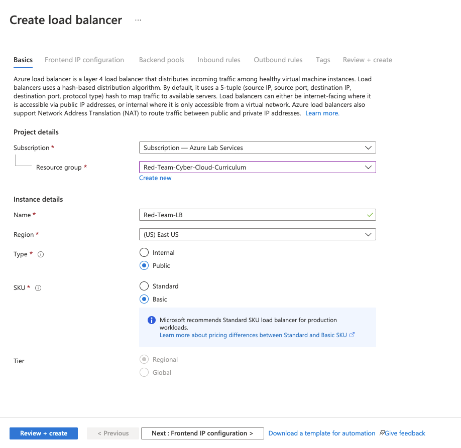

- Select `Next: Frontend IP Configuration` for the Public IP address setting.

- Select `+ Add a frontend IP`.

- Give the public IP a name
	- Note that this name is used to create a URL that maps to the IP address of the load balancer. Because of that, it _must_ be a unique name across all of Azure.
	- Look for the green check mark to determine if the name will work.

- Choose `IPv4` for IP version

- Under `Choose public IP address` click on `Create new`.

- Add the same name for the `Name` Field.

- Choose `Static` for the `Assignment` option.

- Click OK

- Click `Add`.

	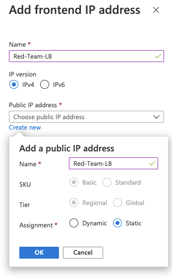

- Click on `Next: Backend pools >`.

- Click on `Add a backend pool`.

- Create a backend pool name like `Red-Team-Backend-Pool`.

- Choose your Red Team VNet.

- Under `Associated to` choose `Virtual machines`.

- Choose `IPv4` for `IP Version`.

- Under `Virtual Machines` Choose `+Add`.

- Add both `Web-1` and `Web-2` machines.

	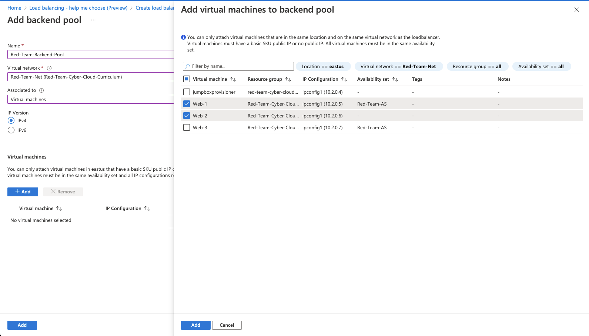

	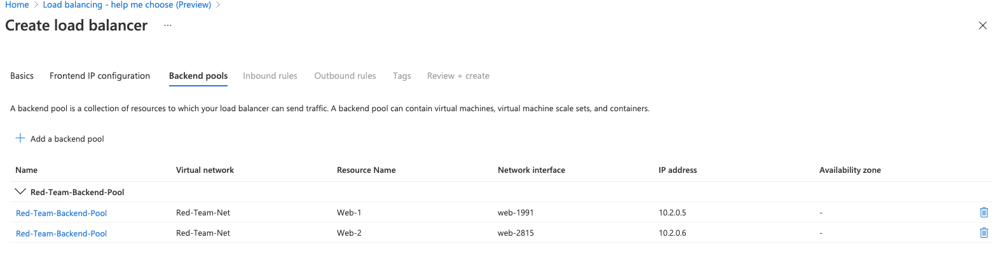

- Emphasize to students that both VMs should be added to the **backend pool**:

- Skip the `Inbound rules` and `Outbound rules` sections.

- Click **Review + create** and confirm.

Students should follow the activity instructions to complete the setup.

### 06. Student Do: Load Balancing (0:20)


Explain the following to students:

- Previously, you created a jump box on a secure VNet that you can use to run Ansible and configure other machines. You also used this jump box to configure another machine and set up DVWA for the Red Team to use.

- In this activity, you will continue with this setup of DVWA. It needs to be accessible from the internet, and we want to make sure it has high availability and some redundancy. 

- At this time, if the VM receives too much traffic from the Red Team, the server may stop responding (Denial of Service).

- You must install a load balancer in front of the VM to distribute the traffic across more than one VM.

:globe_with_meridians: Students should stay in the same **breakout room** groups as the previous activity.


Send students the following file:

- [Activity File: Load Balancing](Activities/06_Load_Balancing/Unsolved/README.md)

### 07. Instructor Review: Load Balancing Activity (0:15)

:bar_chart: Run a comprehension check poll before reviewing the activity. 

Point out that in this activity, we want to setup a load balancer with a public IP address to receive web traffic.

- The task is to install a load balancer in front of the VM to eventually distribute web traffic among more than one VM.

Send students the following file:

- [Solution Guide: Load Balancing](Activities/06_Load_Balancing/Solved/README.md)

Open your Azure portal. From the homepage, search for "load balancer."

  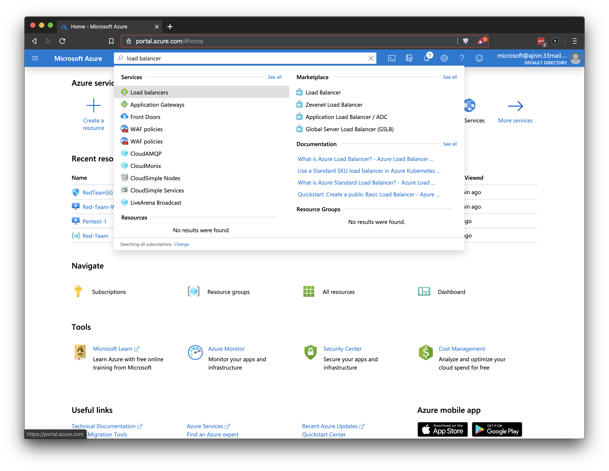

- Click **+ Create** to create a new load balancer.
    - It should have a static public IP address. 
    - Click **Create** to create the load balancer.

  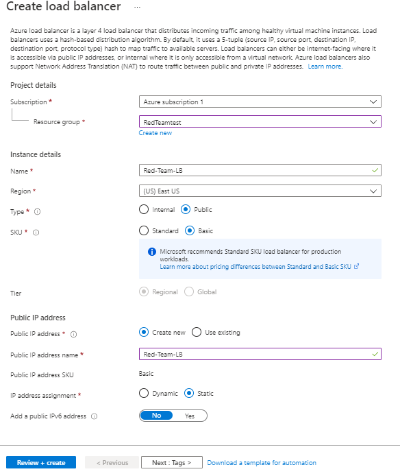
  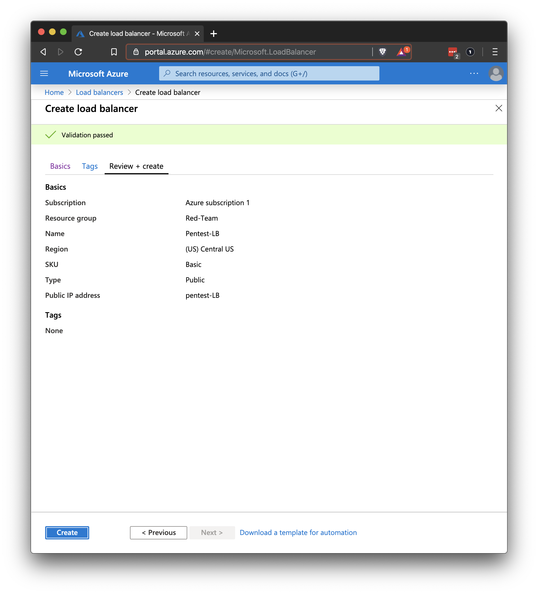


- Add a health probe to regularly check all the VMs and make sure they are able to receive traffic.

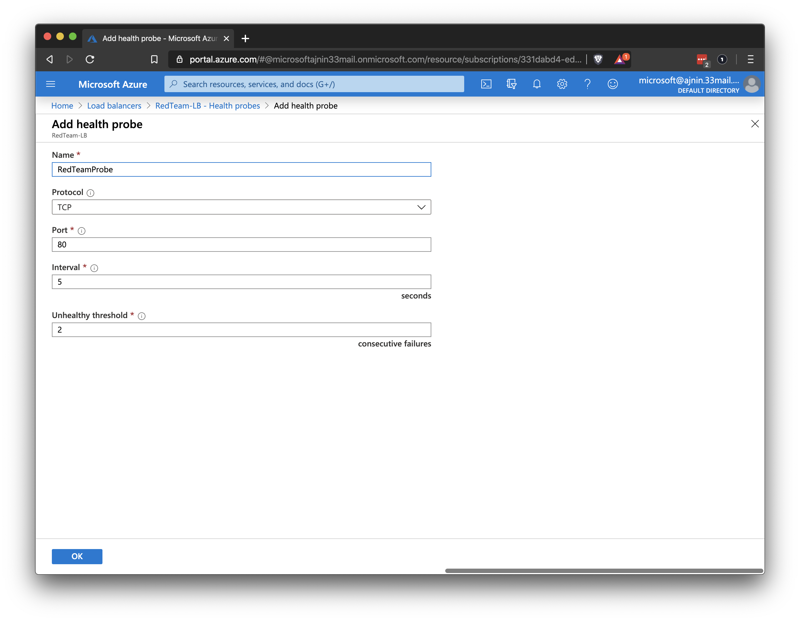


Explain that you will create a backend pool and add your VM to it.
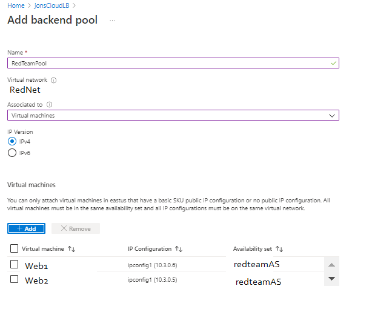


Students should now have a load balancer set up with a public IP and both VMs in the backend pool.


### 08. Break (0:15)

### 09. Instructor Do: Firewall Configuration (0:15)

Explain that now that we have a load balancer running, we want to make sure it is configured properly to allow traffic to the VM backend pool.

- The security group will need to be configured to allow web traffic into the VNet from the load balancer.

- Students already know how to create a security group rule, so you won't go over that again.

By the end of the next activity, students should finally be able to reach the DVWA website from the internet.

- Open your Azure portal and explain that you will demonstrate how to create a load balancing rule.

- Open your load balancer details page and click on **Load balancing rules** on the left side.

:warning: **Heads Up**: If you get an error saying a backend pool must exist first, wait a minute and try again.

Point out that students will see the same **+ Add** button that they have used for all other resources.

- Click the **+ Add** button.

- Load balances work by forwarding traffic from specific ports to the backend pool of machines on specific ports. This rule will specify which ports can receive traffic.

Point out that students should choose the backend pool and health probe that they created in the previous activity.

Explain that if a student is unsure if they need a specific option, they can hover their mouse over the small **i in a circle** next to the title of the option to learn more about that option.

- Hover your mouse over the **i** next to **Session persistence** to show the text that pops up.

   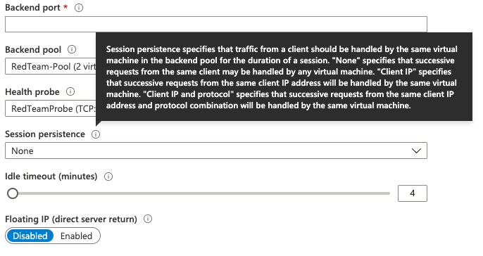

Explain that every time students create a rule, they should evaluate each option to determine if they need it.

:warning: **Heads Up**: A common mistake is to create VM's that are not in the same availability set. If the VM's are not in the same availability set, they cannot be added to the same backend pool. The VM's will need to be deleted and created again in the correct availability set following the Solutions from Day 1 [HERE](../1/Activities/12_Virtual_Computing/Solved/README.md).

### 10. Student Do: Security Configuration (0:20)

Explain the following to students:

- Previously, you configured a DVWA VM from your jump box VM and placed it behind a load balancer. At this time, you still cannot access the DVWA site.

- In this activity, you will continue with the setup of this training environment and allow DVWA to be reached from your home IP Address.

- Your task is to configure the load balancer and security group to work together to expose port `80` of the VM your Home IP address.

Send students the following file:

- [Activity File: Security Configuration](Activities/09_Security_Configuration/Unsolved/README.md)

### 11. Instructor Review: Security Configuration  (0:15)

:bar_chart: Run a comprehension check poll before reviewing the activity. 

Explain that the goal of this activity was to expose port `80` so we can load the DVWA site over the internet.

Send students the following file:

- [Solution Guide: Security Configuration](Activities/09_Security_Configuration/Solved/README.md)

Remind the students that the task is to configure the load balancer and security group to work together to expose port `80` of the VM to the internet.

- Open your Azure portal and go to your load balancer details page.

- Create a load balancing rule that forwards traffic on port `80` to your Red Team subnet.

Make sure your rule resembles the following:

- Name: Give the rule an appropriate name that you will recognize later.

  - IP Version: This should stay on **IPv4**.

  - Frontend IP address: There should only be one option here.

  - Protocol: Protocol is **TCP** for standard website traffic.

  - Port: Port is `80`.

  - Backend port: Backend port is also `80`.

  - Backend pool and Health probe: Select your backend pool and your health probe.

  - Session persistence: This should be changed to **Client IP and protocol**. 
    - Remember, these servers will be used by the Red Team to practice attacking machines. If the session changes to another server in the middle of their attack, it could stop them from successfully completing their training.

  - Idle timeout: This can remain the default (**4 minutes**).

  - Floating IP: This can remain the default (**Disabled**).

  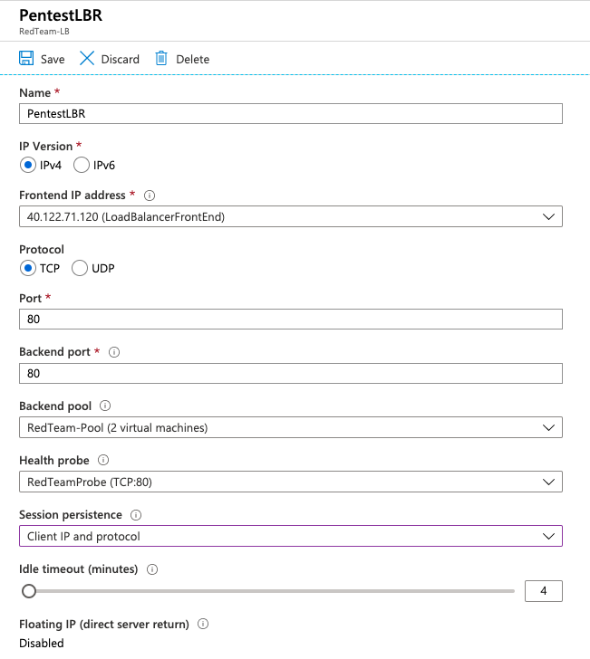


Now move to your security group.

- Create a new security group rule to allow port `80` traffic from the internet to your internal VNet.

Your rule should resemble the following:

- Source: Set this to your external IP address.

- Source port ranges: We want to allow **Any** source port, because they are chosen at random by the source computer.

- Destination: We want the traffic to reach our **VirtualNetwork**.

- Service: We want to select **HTTP**

- Destination port ranges: This should default to port `80`.

- Protocol: This should default to **TCP** 

- Action: Set to **Allow** traffic.

- Name: Choose an appropriate name that you can recognize later.

- Remove the security group rule that blocks _all_ traffic on your vnet to allow traffic from your load balancer through. 

    - Remember that when we created this rule we were blocking traffic from the allow rules that were already in place. One of those rules allows traffic from load balancers. 
    
    - Removing your default deny all rule will allow traffic through.

We should now be able to access the DVWA site from the internet. 

Verify that you can reach the DVWA app from your browser over the internet.

  - Open a web browser and enter the front-end IP address for your load balancer with `/setup.php` added to the IP address.
    - For example: `http://40.122.71.120/setup.php`

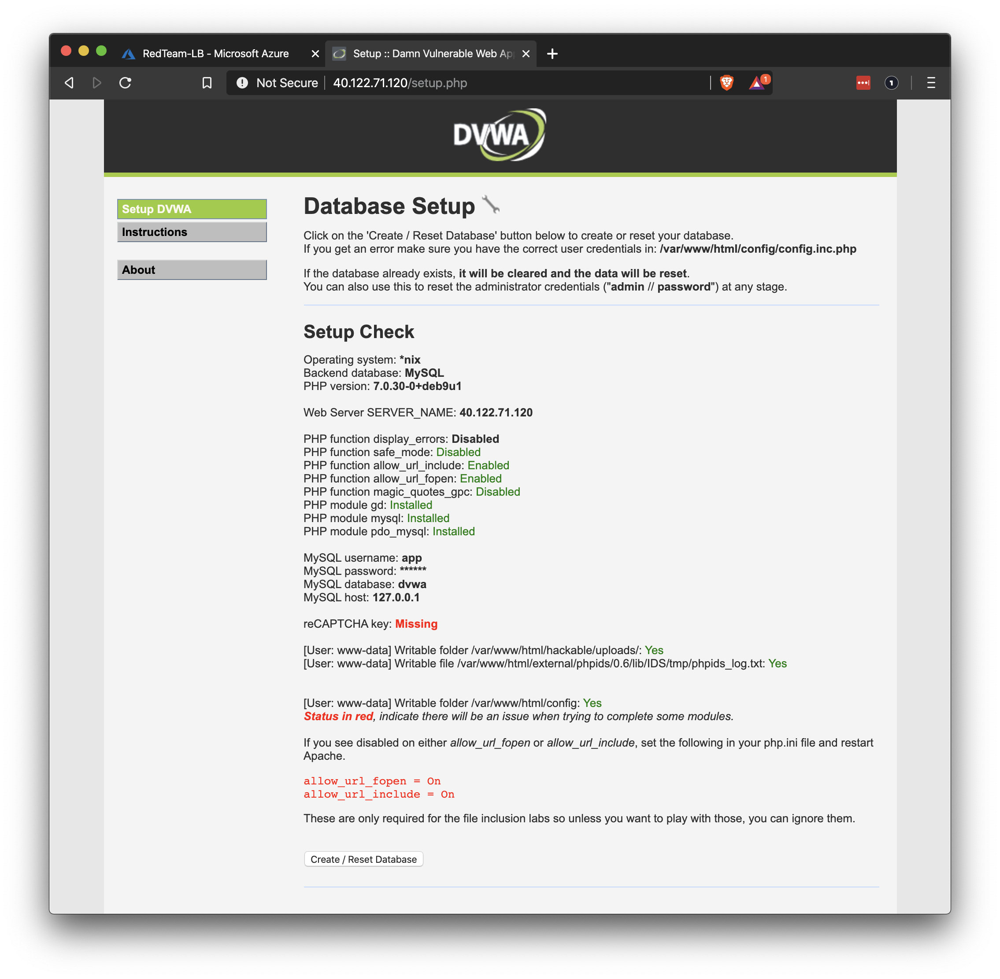

The students should now be able to access the DVWA site through the load balancer from the internet.

:warning: **Heads Up**: If the DVWA site is not coming up, troubleshoot the following:

- The most common mistake is incorrect security group rules. Double check the rules carefully. Try allowing all traffic through to get the connection and then start locking things down.

- Remember to remove the security group rule that blocks all traffic on your vnet to allow traffic from your load balancer through.

  - Use `nmap <ip.of.load.balancer> -Pn -p 80` to see if traffic is allowed or filtered.

- Make sure that the DVWA containers are actually running by manually connecting to the VMs and checking that the docker container is running and you can get HTML from localhost.


---

|:warning: **CHECKPOINT** :warning:|
|:-:|
| At this time, students should have completed the following critical items.|

- [ ] A load balancer has been created and both Web VMs have been placed behind it.
- [ ] The Deny All rule has been removed from the Security Group, to allow traffic from the load balancer.
- [ ] The DVWA site is able to be accessed through the load balancer from the internet.

---

:warning: **Heads Up**: All of a student's VMs should be using the same network security group. If, by accident, some VMs have their own network security group, students will need to add rules for each one to allow traffic on port 80.


|:warning: **CHECKPOINT** :warning:|
|:-:|
| Use the [Daily Checklist](../Resources/Checklist.md) to verify that students are ready for the next class session. |

At the end of Day 3, students should have completed the following critical items.

- [ ] An Ansible playbook has been created that configures Docker and downloads a container.
- [ ] The Ansible playbook is able to be run on the Web VMs.
- [ ] The Web VMs are running a DVWA Docker container.
- [ ] A load balancer has been created and at least two Web VMs placed behind it.
- [ ] The DVWA site is able to be accessed through the load balancer from the internet.

Failure to complete these steps will hinder the activities in the next class.


---

© 2020 Trilogy Education Services, a 2U, Inc. brand. All Rights Reserved. 
