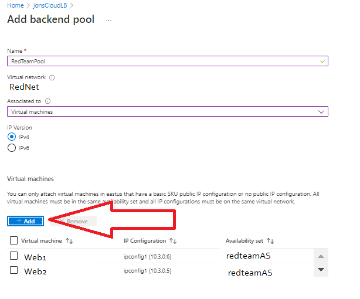
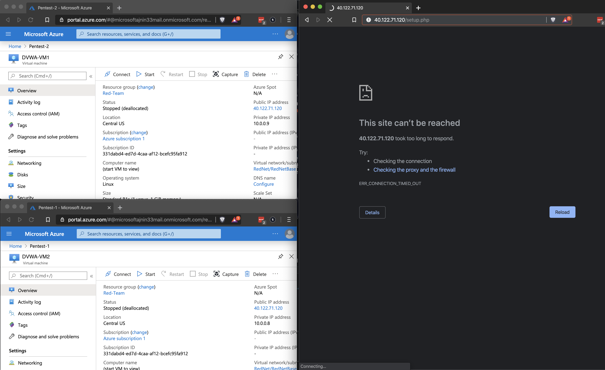
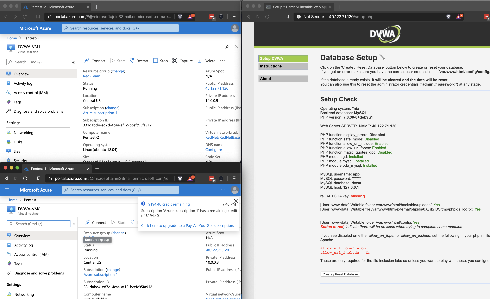

## 12.4 Lesson Plan: Testing Redundant Systems


### Class Overview

If there are cloud security topics that you didn't have time to cover in previous days, you can use time today to catch up.

In today's class, we'll complete the unit by implementing redundant systems.


### Class Objectives

By the end of today's class, students should be able to:

- Verify redundancy by turning off one or more virtual machines used in the infrastructure.


### Instructor Notes

- Use today as a catch-up and review day for students. The majority of programs that have run this unit have reported needing four days to get through the activities for this week.

- All activities after the break are optional. We recommend assigning them to advanced students while ensuring that other students completed all activities up through today's `03. Student Do: Redundancy Testing`

- Please announce and explain the homework before dismissing class.

- Please make sure that you are using your personal Azure account for the lab demonstrations and activities.

- Remind students that they need to shut off their labs.

### Lab Environment 

<details><summary>Lab Details</summary>
<br>

For demonstrations, activities and reviews, you will use your free Azure account.

- [Azure Setup Guide](https://docs.google.com/document/d/1gs_09b7eotl7hzTL82xlqPt-OwOd0aWA78qcQxtMr6Y/edit)

- [Azure Free Tier FAQs](https://azure.microsoft.com/en-us/free/free-account-faq/)

### Lab References

- [Ansible](https://ansible.com)
- [Docker](https://docker.com)
- [YAML](https://yaml.org/spec/1.2/spec.html#Introduction)

</details>


### Slideshow

The slides for today can be viewed on Google Drive here: [12.4 Slides](https://docs.google.com/presentation/d/1D-f1PfunauPoV8KQOX7-481OSOwQ4j1OPh1bBnUL66Q/edit#slide=id.g4789b2c72f_0_6).

- To add slides to the student-facing repository, download the slides as a PDF by navigating to File > "Download as" and choose "PDF document." Then, add the PDF file to your class repository along with other necessary files.

- **Note:** Editing access is not available for these documents. If you or your students wish to modify the slides, please create a copy by navigating to File > "Make a copy...".

### Time Tracker

The time tracker for today's lesson can be viewed on Google Drive here: [12.4 Time Tracker](https://docs.google.com/spreadsheets/d/1D-rEaPZXDy-9Ly9LHGakfGXP0gJdBRHAiSXFw8u7Udo/edit#gid=742113232).


### Student Guide

Distribute the student-facing version of the lesson plan: [12.4 Student Guide](StudentGuide.md)


---


### 01. Instructor Do: Welcome and Overview (0:05)

Welcome students to the last day of the cloud security unit.

Note what they have accomplished so far:

- Created a virtual network.
- Protected the network with a firewall and completed several firewall rules.
- Deployed a jump box to the network.
- Deployed two identical VMs to the network.
- Used Docker containers to run a website and Ansible.
- Used Ansible to configure their VMs with code (infrastructure as code).
- Configured a load balancer to distribute traffic among the VMs.


---
|:warning: **CHECKPOINT** :warning:|
|:-:|
| Using the [Daily Checklist](../Resources/Checklist.md),  verify that students have completed all Day 3 critical tasks and are ready to continue to today's activities. |

---

### 02. Instructor Do: Redundancy Testing (0:10)

In this section, you will briefly show students how to test a redundant system.

- Begin by opening your Azure portal and navigating to virtual machines.

- Click on a virtual machine to see its details. Point out the **Stop** button.

    

- Explain that with your current setup, you can simulate one of the VMs going offline by stopping it.

In the next activity, students will stop one VM and check whether or not they still have access to the site.

**NOTE:** Depending on whether or not the optional day 3 activity was completed, Students may have either 2 or 3 web VM's at this point. The goal of the following activity is to make sure that all of the web VM's are behind a load balancer, and then make sure that the load balancer is working.

Ask if there are any questions about stopping the machines.

### 03. Student Do: Redundancy Testing (0:25)


Explain the following to students:

- Over the last few days, you configured a vulnerable web application server for XCorp's Red Team to train new hires and use for general testing.

- In this activity, you will finalize this setup by putting a third VM behind your load balancer and testing for redundancy.

- You are tasked with adding your latest VM to the backend pool for your load balancer and testing whether the website continues working if one of your VMs has a problem.

:globe_with_meridians: This activity will use **breakout rooms**. Assign students into groups of 3-5 and move them into breakout rooms.


Send students the following file:

- [Activity File: Redundancy Testing](Activities/03_Redundancy_Testing/Unsolved/README.md)


### 04. Instructor Review: Redundancy Testing Activity (0:15)

:bar_chart: Run a comprehension check poll before reviewing the activity. 

Point out that the goal of this activity was to verify that students' VMs have a working, high availability setup. If one VM has an issue, the site stays active.

Send students the following solution file:

- [Solution Guide: Redundancy Testing](Activities/03_Redundancy_Testing/Solved/README.md)

#### Walkthrough

From your Azure portal, navigate to the details page of your load balancer.

- Add the new VM to the backend pool for your load balancer.

    

- Open a browser and navigate to http://IP.of.load.balancer/setup.php to verify that the DVWA site is up and accessible from the web.

- Position three windows on your screen so you can see the website and the details page of both VMs in your backend pool:

    


Turn off one of your VMs from the Azure portal.

- You should still be able to access the site when one of the VMs is off.

    

- Turn off the other VM and verify that the DVWA site stops working.

- With both VMs stopped, the site should go down.

    

Boot up the VM that you first shutdown, so it is running by itself. Confirm that you can access the DVWA site.

- This should verify that both VMs are running the site.

    

- Boot up the second VM.

    

Students should now have a highly available DVWA site setup using two VMs running Docker containers behind a load balancer. More VMs can easily be added and configured using an Ansible playbook.

---

### 05. Break (0:15)

---

### 06. Instructor Do: Alternate Hostname Activity Demonstration (**OPTIONAL**)

**NOTE**: This Activity can be skipped if you run out of time. It can also be given to the more advanced students if they would like to go further.

Explain that DVWA has a vulnerability that will allow us to see the 'hostname' of the machine. For Docker, the hostname will be the docker container identifier.

Using this vulnerability, we can see what machine we are connected to, and when one machine goes offline, we should be able to see the hostname change.

Point out that you will walk them through setting up DVWA and using this exploit.

Navigate to your DVWA setup with `http://[load-balancer-ip]/setup.php


Scroll to the bottom of the page and click on `Create/Reset Database`

You should see the following information:


Click on `Login` to get the login screen.

Login with the credentials: `admin:password`


Once logged in, click on `Command Injection`.

Explain that command injection is a vulnerability where we have an opportunity to send command line commands directly to the server and have their output be displayed on the screen.

Explain that we will go over Command Injection again later in the course, but here we will have a quick introduction.

Point out the box that says 'Ping an IP address' and explain that this function is essentially taking your input and running it with the `ping` command on the command line, and then returning the output.

Enter: `8.8.8.8` in the box and point out that this is a well known google DNS server.

Remind the students that our security group is blocking traffic, so we should get an error here:


Explain using the ping function is not what we want to do. Instead, ask the students if they remember how to chain commands together from the Linux weeks?

Take a few answers.

Point out that _if_ we use one of our command chaining techniques, we should be able to get a _second_ command to run _after_ the ping command runs.

Quickly remind students of the following:

- `;` runs a command after the first command, regardless if the first command is successful.
- `&&` runs a command _only_ if the first command is successful.
- `||` runs a command _only_ if the first command fails.

We can use any of these to _inject_ a second command to run, after the ping command runs.

Enter: 8.8.8.8 ; whoami

Break down the syntax:
- `8.8.8.8` goes to the ping command to complete `ping 8.8.8.8` in the background.
- `;` says, run another command.
- `whoami` is the second _injected_ command.


Point out that we can see our second command output: `www-data` at the bottom.

Point out further that we can use the `||` command to clean up the output.

Enter `|| whoami`

Break down the syntax:
- `||` says, if the first command fails, run the next command. Point out that we are not giving the `ping` command _any_ ip address to ping, so it _will_ fail. This way,we will only see the second command's output.
- `whoami` is our second _injected_ command.


Explain that in the next activity, students will use this exploit to see the hostname of the machine they are connected to. This will further illustrate what happens when one host goes down because they can clearly see what host they are connected to.

### 07. Student Do: Alternate Hostname Testing Activity


Explain the following to the students:

- The XCorp Red Team has been using the new DVWA setup to train new hires and use for general testing.

- You have been asked to test the load balancer once more to make sure traffic is being distributed among all 3 of your VMs.

- In this activity, you will exploit a vulnerability in DVWA to determine what machine you are connected to.

- You are tasked with collecting the hostnames for each DVWA container and then verifying that the load balancer is sending traffic to different containers as needed.

:globe_with_meridians: Students should stay in the same **breakout room** groups as the previous activity.


Send students the following file:

- [Activity File: Hostname Exploit Testing](Activities/08_Hostname_Vuln/Unsolved/README.md)


### 08. Instructor Review: Alternate Hostname Testing Activity Walkthrough

:bar_chart: Run a comprehension check poll before reviewing the activity. 

Point out that the goal of this activity was to get further insight into which machine they are connected to using a vulnerability in DVWA.

Send students the following solution file:

- [Solution Guide: Hostname Exploit Testing Solutions](Activities/08_Hostname_Vuln/Solved/README.md)

### Walkthrough

Start by gathering the hostname of each of the DVWA containers that your WebVMs are running.

- SSH from your jump-box to a Web VM
- Connect to the DVWA container

Remind students that they have to restart your exact same Ansible container using `sudo docker start [container-name]` and not create a new Ansible container.

Run: `sudo docker container list -a` to get the name of your container.
```bash
$ sudo docker container list -a
CONTAINER ID        IMAGE                          COMMAND             CREATED             STATUS                       PORTS               NAMES
eba1c84c981f        cyberxsecurity/ansible         "bash"              4 minutes ago       Exited (0) 4 minutes ago                         adoring_swirles
```

Run `sudo docker start [container-name]`

```bash
$ sudo docker attach romantic_noyce
romantic_noyce
```

Run `sudo docker attach [container-name]`

```bash
$ sudo docker attach romantic_noyce
root@6160a9be360e:~#
```

Notice that the `hostname` is embedded in the command prompt: `6160a9be360e`

Run `hostname` to verify:

```bash
root@6160a9be360e:~# hostname
6160a9be360e
```

Make a list of info for this VM:

- Azure Name: `Web-1`
- Internal IP: `10.0.0.5`
- Hostname: `6831a670b43e`

Explain that in the activity students needed to repeat this process for each VM.

Point out that you also already setup DVWA so you won't repeat that process here.

Exploit DVWA to determine what host you are connected to:

Navigate to the Command Injection screen and inject a command that gives you the hostname of the container you are currently connected to.

Enter: `|| hostname` into the text field.


Confirm that it matches one of your Web-VMs.
- In this example it matches the VM above: `Web-1`

- Go to Azure and stop that VM.


- Run the same command again to get the hostname of the container you are now connected to.


- Make a note of what container you now connected to.

In this example, the traffic has switched to `Web-2`.

### 09. Instructor Do: Announce Cloud Security Homework (0:10)

Explain to class that we have concluded the cloud security class material. In the next unit, our first project, we will add monitoring to our virtual machine setup.

Introduce the assignment by explaining the following:

- During the last week, you created a highly available web server for XCorp's Red Team to use for testing and training.

- Your lead cloud administrator has asked for a diagram of the Network you created to keep for documentation and company records.

- Your task: Use [app.diagrams.net](https://app.diagrams.net/) to create a detailed diagram of your cloud infrastructure.


---

© 2020 Trilogy Education Services, a 2U, Inc. brand. All Rights Reserved.
