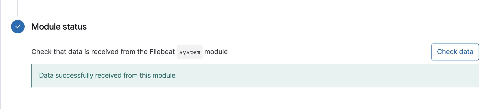

## Day 2 Solution Guide: Filebeat Installation 

On Day 2, you had to install the Filebeat service on your existing ELK server.

Below are the solution configuration files for setting up your Filebeat configuration and playbook:
- [Filebeat Configuration](config_files/filebeat-configuration.yml)
- [Filebeat Playbook](config_files/filebeat-playbook.yml)

Feel free to complete this project again using these configuration files for additional practice. If you are working from home after working in the classroom, you will need to update the IP addresses to your IP addresses. 

Let's take a closer look at the steps you needed to complete:

### 1. Installing Filebeat on the DVWA Container

First, make sure that our ELK server container is up and running.
- Navigate to http://[your.VM.IP]:5601/app/kibana. Use the public IP address of the ELK server that you created.

- If you do not see the ELK server landing page, open a terminal on your computer and SSH into the ELK server.

  - Run `docker container list -a` to verify that the container is on.

  - If it isn't, run `docker start elk`.

Install Filebeat on your DVWA VM:
- Open your ELK server homepage.
    - Click on **Add Log Data**.
    - Choose **System Logs**.
    - Click on the **DEB** tab under **Getting Started** to view the correct Linux Filebeat installation instructions.

### 2. Creating the Filebeat Configuration File

Next, create a Filebeat configuration file and edit this file so that it has the correct settings to work with your ELK server.

Open a terminal and SSH into your jump box:
- Start the Ansible container.
- SSH into the Ansible container.

Copy the provided configuration file for Filebeat to your Ansible container: [Filebeat Configuration File Template](config_files/filebeat-config.yml).

 - Note that when text is copy and pasted from the web into your terminal, formatting differences are likely to occur that will corrupt this configuration file.

 - Using `curl` is a better way to avoid errors and we have the file hosted for public download [HERE](https://gist.githubusercontent.com/slape/5cc350109583af6cbe577bbcc0710c93/raw/eca603b72586fbe148c11f9c87bf96a63cb25760/Filebeat)

 - Run: `curl https://gist.githubusercontent.com/slape/5cc350109583af6cbe577bbcc0710c93/raw/eca603b72586fbe148c11f9c87bf96a63cb25760/Filebeat >> /etc/ansible/filebeat-config.yml`

 ```bash
root@6160a9be360e:/etc/ansible# curl https://gist.githubusercontent.com/slape/5cc350109583af6cbe577bbcc0710c93/raw/eca603b72586fbe148c11f9c87bf96a63cb25760/Filebeat > filebeat-config.yml
  % Total    % Received % Xferd  Average Speed   Time    Time     Time  Current
                                 Dload  Upload   Total   Spent    Left  Speed
100 73112  100 73112    0     0   964k      0 --:--:-- --:--:-- --:--:--  964k
 ```

Once you have this file on your Ansible container, edit this file as specified in the Filebeat instructions (the specific steps are also detailed below). 

Edit the configuration in this file to match the settings described in the installation instructions for your server.

- **Hint:** Instead of using Ansible to edit individual lines in the `/etc/filebeat/filebeat-config.yml` configuration file, it is easier to keep a copy of the entire configuration file (preconfigured) with your Ansible playbook and use the Ansible `copy` module to copy the preconfigured file into place.

- Because we are connecting your webVM's to the ELK server, we need to edit the file to include your ELK server's IP address. 

  - Note that the default credentials are `elastic:changeme` and should not be changed at this step.

Scroll to line #1106 and replace the IP address with the IP address of your ELK machine.

```bash
output.elasticsearch:
hosts: ["10.1.0.4:9200"]
username: "elastic"
password: "changeme"
```

Scroll to line #1806 and replace the IP address with the IP address of your ELK machine.

```
setup.kibana:
host: "10.1.0.4:5601"
```
Save this file in  `/etc/ansible/files/filebeat-config.yml`.

After you have edited the file, your settings should resemble the below. Your IP address may be different, but all other settings should be the same, including ports.

  ```
  output.elasticsearch:
  hosts: ["10.1.0.4:9200"]
  username: "elastic"
  password: "changeme"

  ...

  setup.kibana:
  host: "10.1.0.4:5601"
  ```

### 3. Creating the Filebeat Installation Play
Create another Ansible playbook that accomplishes the Linux Filebeat installation instructions.

- The playbook should:
  - Download the `.deb` file from [artifacts.elastic.co](https://artifacts.elastic.co/downloads/beats/filebeat/filebeat-7.4.0-amd64.deb).
  - Install the `.deb` file using the `dpkg` command shown below:
    - `dpkg -i filebeat-7.4.0-amd64.deb`
  - Copy the Filebeat configuration file from your Ansible container to your WebVM's where you just installed Filebeat.
    - You can use the Ansible module `copy` to copy the entire configuration file into the correct place.
    - You will need to place the configuration file in a directory called `files` in your Ansible directory.
  - Run the `filebeat modules enable system` command.
  - Run the `filebeat setup` command.
  - Run the `service filebeat start` command.
  - Enable the Filebeat service on boot.

Solution:

  - [Filebeat Installation Play](config_files/filebeat-playbook.yml)

  - After entering your information into the Filebeat configuration file and Ansible playbook, you should have run: `ansible-playbook filebeat-playbook.yml`.


```bash
root@1f08425a2967:/etc/ansible# ansible-playbook filebeat-playbook.yml

PLAY [installing and launching filebeat] *******************************************************

TASK [Gathering Facts] *************************************************************************
ok: [10.0.0.4]
ok: [10.0.0.5]
ok: [10.0.0.6]


TASK [download filebeat deb] *******************************************************************
[WARNING]: Consider using the get_url or uri module rather than running 'curl'.  If you need to
use command because get_url or uri is insufficient you can add 'warn: false' to this command
task or set 'command_warnings=False' in ansible.cfg to get rid of this message.

changed: [10.0.0.4]
changed: [10.0.0.5]
changed: [10.0.0.6]

TASK [install filebeat deb] ********************************************************************
changed: [10.0.0.4]
changed: [10.0.0.5]
changed: [10.0.0.6]

TASK [drop in filebeat.yml] ********************************************************************
ok: [10.0.0.4]
ok: [10.0.0.5]
ok: [10.0.0.6]

TASK [enable and configure system module] ******************************************************
changed: [10.0.0.4]
changed: [10.0.0.5]
changed: [10.0.0.6]

TASK [setup filebeat] **************************************************************************
changed: [10.0.0.4]
changed: [10.0.0.5]
changed: [10.0.0.6]

TASK [start filebeat service] ******************************************************************
[WARNING]: Consider using the service module rather than running 'service'.  If you need to use
command because service is insufficient you can add 'warn: false' to this command task or set
'command_warnings=False' in ansible.cfg to get rid of this message.

changed: [10.0.0.4]
changed: [10.0.0.5]
changed: [10.0.0.6]

TASK [enable service filebeat on boot] **************************************************************************
changed: [10.0.0.4]
changed: [10.0.0.5]
changed: [10.0.0.6]

PLAY RECAP *************************************************************************************
10.0.0.4                  : ok=7    changed=6    unreachable=0    failed=0    skipped=0    rescued=0    ignored=0
10.0.0.5                  : ok=7    changed=6    unreachable=0    failed=0    skipped=0    rescued=0    ignored=0
10.0.0.6                   : ok=7    changed=6    unreachable=0    failed=0    skipped=0    rescued=0    ignored=0
```
### 4. Verifying Installation and Playbook 

Next, you needed to confirm that the ELK stack was receiving logs. Navigate back to the Filebeat installation page on the ELK server GUI.
- Verify that your playbook is completing Steps 1-4.
- On the same page, scroll to **Step 5: Module Status** and click **Check Data**.
- Scroll to the bottom and click on **Verify Incoming Data**.

Solution:

- If the ELK stack was successfully receiving logs, you would have seen: 



### Creating a Play to Install Metricbeat

To update your Ansible playbook to install Metricbeat:

From the homepage of your ELK site:
- Click **Add Metric Data**.
- Click **Docker Metrics**.
- Click the **DEB** tab under **Getting Started** for the correct Linux instructions.

- Download the [Metricbeat `.deb` file](https://artifacts.elastic.co/downloads/beats/metricbeat/metricbeat-7.4.0-amd64.deb).

- Use `dpkg` to install the `.deb` file.
- Update and copy the provided [Metricbeat config file](https://gist.githubusercontent.com/slape/58541585cc1886d2e26cd8be557ce04c/raw/0ce2c7e744c54513616966affb5e9d96f5e12f73/metricbeat).
- Run the `metricbeat modules enable docker` command.
- Run the `metricbeat setup` command.
- Run the `metricbeat -e` command.
- Enable the Metricbeat service on boot.

To verify that your play works as expected, on the Metricbeat installation page in the ELK server GUI, scroll to **Step 5: Module Status** and click **Check Data**.

---

© 2020 Trilogy Education Services, a 2U, Inc. brand. All Rights Reserved.  

