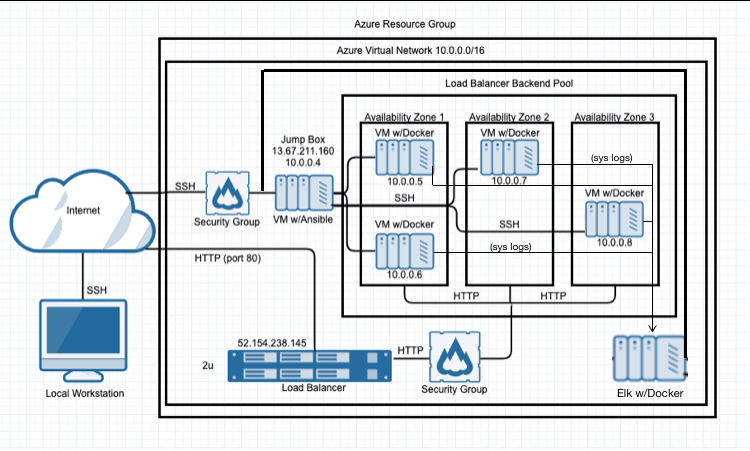

# Automated ELK Stack Deployment

This document contains the following details:
- Description of the Topology
- ELK Configuration
  - Beats in Use
  - Machines Being Monitored
- How to Use the Ansible Build
- Access Policies

### Description of the Topology
This repository includes code defining the infrastructure below. 



The main purpose of this network is to expose a load-balanced and monitored instance of DVWA, the "D*mn Vulnerable Web Application"

Load balancing ensures that the application will be highly **available**, in addition to restricting **inbound access** to the network. The load balancer ensures that work to process incoming traffic will be shared by both vulnerable web servers. Access controls will ensure that only authorized users — namely, ourselves — will be able to connect in the first place.

Integrating an ELK server allows users to easily monitor the vulnerable VMs for changes to the **file systems of the VMs on the network**, as well as watch **system metrics**, such as CPU usage; attempted SSH logins; `sudo` escalation failures; etc.

The configuration details of each machine may be found below.

| Name     |   Function  | IP Address | Operating System |
|----------|-------------|------------|------------------|
| Jump Box | Gateway     | 10.0.0.4   | Linux            |
| DVWA 1   | Web Server  | 10.0.0.5   | Linux            |
| DVWA 2   | Web Server  | 10.0.0.6   | Linux            |
| ELK      | Monitoring  | 10.0.0.8   | Linux            |

In addition to the above, Azure has provisioned a **load balancer** in front of all machines except for the jump box. The load balancer's targets are organized into the following availability zones:
- **Availability Zone 1**: DVWA 1 + DVWA 2
- **Availability Zone 2**: ELK

## ELK Server Configuration
The ELK VM exposes an Elastic Stack instance. **Docker** is used to download and manage an ELK container.

Rather than configure ELK manually, we opted to develop a reusable Ansible Playbook to accomplish the task. This playbook is duplicated below.


To use this playbook, one must log into the Jump Box, then issue: `ansible-playbook install_elk.yml elk`. This runs the `install_elk.yml` playbook on the `elk` host.

### Access Policies
The machines on the internal network are _not_ exposed to the public Internet. 

Only the **jump box** machine can accept connections from the Internet. Access to this machine is only allowed from the IP address `64.72.118.76`
- **Note**: _Your answer will be different!_

Machines _within_ the network can only be accessed by **each other**. The DVWA 1 and DVWA 2 VMs send traffic to the ELK server.

A summary of the access policies in place can be found in the table below.

| Name     | Publicly Accessible | Allowed IP Addresses |
|----------|---------------------|----------------------|
| Jump Box | Yes                 | 64.72.118.76         |
| ELK      | No                  | 10.0.0.1-254         |
| DVWA 1   | No                  | 10.0.0.1-254         |
| DVWA 2   | No                  | 10.0.0.1-254         |

### Elk Configuration

Ansible was used to automate configuration of the ELK machine. No configuration was performed manually, which is advantageous because...

- _TODO: What is the main advantage of automating configuration with Ansible?_

The playbook implements the following tasks:
- _TODO: In 3-5 bullets, explain the steps of the ELK installation play. E.g., install Docker; download image; etc._
- ...
- ...


The following screenshot displays the result of running `docker ps` after successfully configuring the ELK instance.

- _TODO_: Update the image file path with the name of your screenshot of docker ps output:

  


The playbook is duplicated below.

```yaml
---
# install_elk.yml
- name: Configure Elk VM with Docker
  hosts: elkservers
  remote_user: elk
  become: true
  tasks:
    # Use apt module
    - name: Install docker.io
      apt:
        update_cache: yes
        name: docker.io
        state: present

      # Use apt module
    - name: Install pip3
      apt:
        force_apt_get: yes
        name: python3-pip
        state: present

      # Use pip module
    - name: Install Docker python module
      pip:
        name: docker
        state: present

      # Use command module
    - name: Increase virtual memory
      command: sysctl -w vm.max_map_count=262144

      # Use sysctl module
    - name: Use more memory
      sysctl:
        name: vm.max_map_count
        value: "262144"
        state: present
        reload: yes

      # Use docker_container module
    - name: download and launch a docker elk container
      docker_container:
        name: elk
        image: sebp/elk:761
        state: started
        restart_policy: always
        published_ports:
          - 5601:5601
          - 9200:9200
          - 5044:5044
```

### Target Machines & Beats
This ELK server is configured to monitor the DVWA 1 and DVWA 2 VMs, at `10.0.0.5` and `10.0.0.6`, respectively.

We have installed the following Beats on these machines:
- Filebeat
- Metricbeat
- Packetbeat

These Beats allow us to collect the following information from each machine:
- **Filebeat**: Filebeat detects changes to the filesystem. Specifically, we use it to collect Apache logs.
- **Metricbeat**: Metricbeat detects changes in system metrics, such as CPU usage. We use it to detect SSH login attempts, failed `sudo` escalations, and CPU/RAM statistics.
- **Packetbeat**: Packetbeat collects packets that pass through the NIC, similar to Wireshark. We use it to generate a trace of all activity that takes place on the network, in case later forensic analysis should be warranted.

The playbook below installs Metricbeat on the target hosts. The playbook for installing Filebeat is not included, but looks essentially identical — simply replace `metricbeat` with `filebeat`, and it will work as expected.

```yaml
---
- name: Install metric beat
  hosts: webservers
  become: true
  tasks:
    # Use command module
  - name: Download metricbeat
    command: curl -L -O https://artifacts.elastic.co/downloads/beats/metricbeat/metricbeat-7.4.0-amd64.deb

    # Use command module
  - name: install metricbeat
    command: dpkg -i metricbeat-7.4.0-amd64.deb

    # Use copy module
  - name: drop in metricbeat config
    copy:
      src: /etc/ansible/files/metricbeat-config.yml
      dest: /etc/metricbeat/metricbeat.yml

    # Use command module
  - name: enable and configure docker module for metric beat
    command: metricbeat modules enable docker

    # Use command module
  - name: setup metric beat
    command: metricbeat setup

    # Use command module
  - name: start metric beat
    command: service metricbeat start
```

### Using the Playbooks
In order to use the playbooks, you will need to have an Ansible control node already configured. We use the **jump box** for this purpose.

To use the playbooks, we must perform the following steps:
- Copy the playbooks to the Ansible Control Node
- Run each playbook on the appropriate targets

The easiest way to copy the playbooks is to use Git:

```bash
$ cd /etc/ansible
$ mkdir files
# Clone Repository + IaC Files
$ git clone https://github.com/yourusername/project-1.git
# Move Playbooks and hosts file Into `/etc/ansible`
$ cp project-1/playbooks/* .
$ cp project-1/files/* ./files
```

This copies the playbook files to the correct place.

Next, you must create a `hosts` file to specify which VMs to run each playbook on. Run the commands below:

```bash
$ cd /etc/ansible
$ cat > hosts <<EOF
[webservers]
10.0.0.5
10.0.0.6

[elk]
10.0.0.8
EOF
```

After this, the commands below run the playbook:

 ```bash
 $ cd /etc/ansible
 $ ansible-playbook install_elk.yml elk
 $ ansible-playbook install_filebeat.yml webservers
 $ ansible-playbook install_metricbeat.yml webservers
 ```

To verify success, wait five minutes to give ELK time to start up. 

Then, run: `curl http://10.0.0.8:5601`. This is the address of Kibana. If the installation succeeded, this command should print HTML to the console.


---

© 2020 Trilogy Education Services, a 2U, Inc. brand. All Rights Reserved.  
