## Solution Guide: Exploring Kibana

1. Start by adding the sample web log data to Kibana.

    - You can import it by clicking **Try our sample data**.

        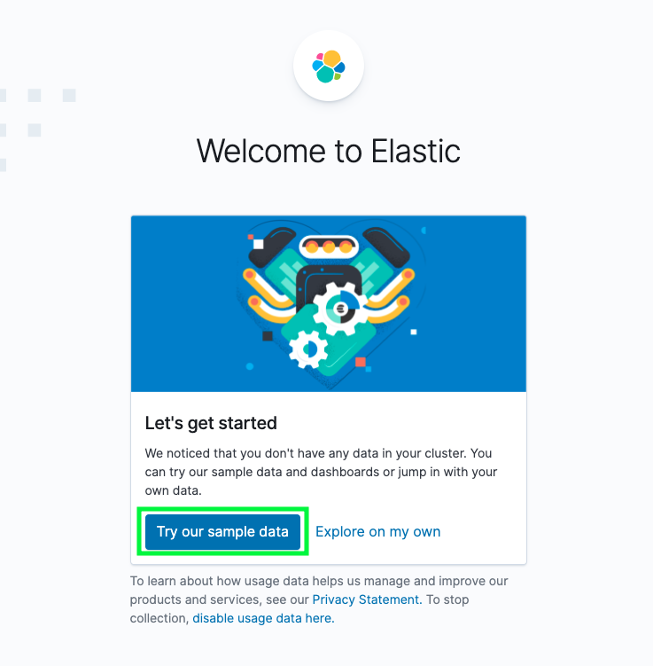

    - Or you can import it from the homepage by clicking on **Load a data set and a Kibana dashboard** under **Add sample data**.

        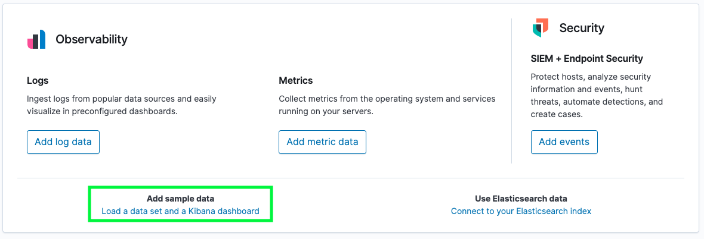

    - Click **Add Data** under the **Sample Web Logs** data pane.

        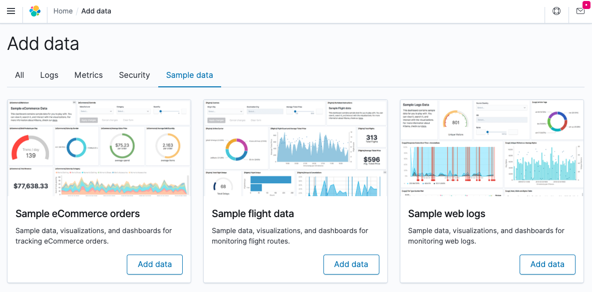

    - Click **View Data** to pull up the dashboard.

        

2. Answer the following questions:

    - In the last 7 days, how many unique visitors were located in India?

       - **Example Answer:** 253

        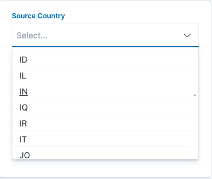

        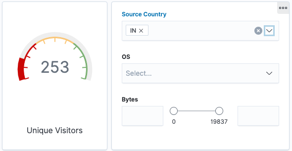

    - In the last 24 hours, of the visitors from China, how many were using Mac OSX?

       - **Example Answer:** 7

        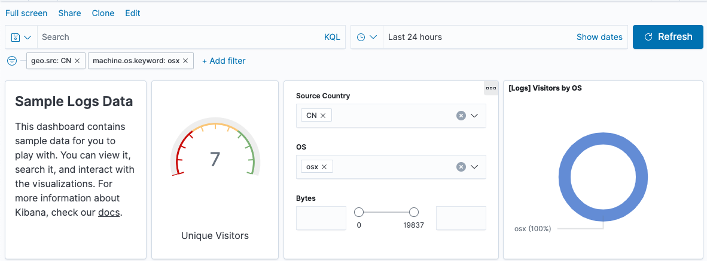

    - In the last 2 days, what percentage of visitors received 404 errors? How about 503 errors?

        - **Example Answer:** 404: 6.667% and 503: 13.333%

         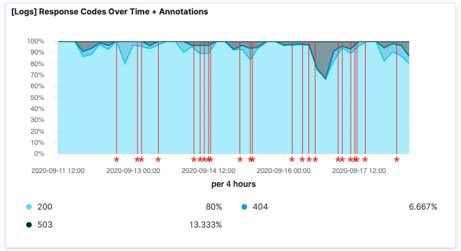

    - In the last 7 days, what country produced the majority of the traffic on the website?

        - **Example Answer:** China

          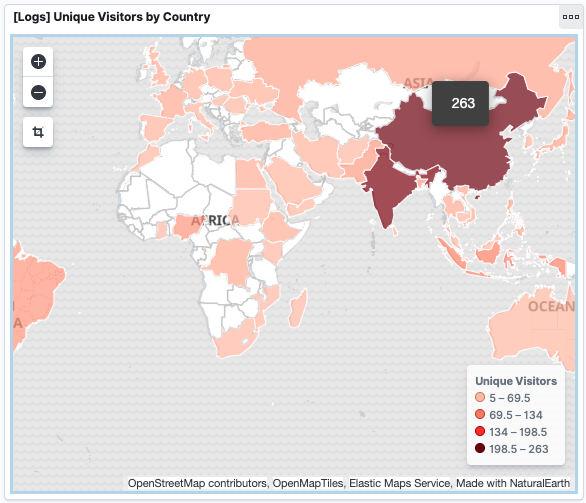

          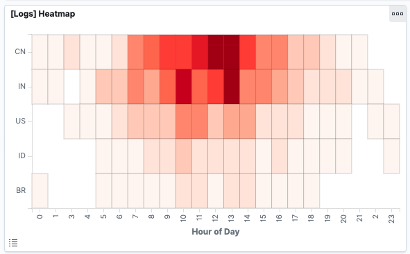

    - Of the traffic that's coming from that country, what time of day had the highest amount of activity?

        - **Example Answer:** 12 p.m. and 1 p.m. (hours 12 and 13)

         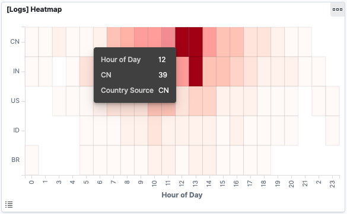

    - List all the types of downloaded files that have been identified for the last 7 days, along with a short description of each file type (use Google if you aren't sure about a particular file type).

        - **Example Answer:**

            - **gz:** `.gz` files are compressed files created using the gzip compression utility.

            - **css:** `.css` files can help define font, size, color, spacing, border and location of HTML information on a webpage. They are downloaded with their `.html` counterparts and rendered by the browser.

            - **zip:** A lossless compression format. A `.zip` file may contain one or more files or directories that have been compressed.

            - **deb:** A file with the `.deb` file extension is a Debian (Linux) Software Package file. These files are installed when using the `apt` package manager.

            - **rpm:** `.rpm` file formats are a Red Hat Software Package file. RPM stands for Red Hat Package Manager.

         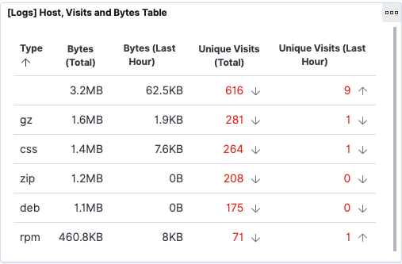

3. Look at the chart that shows Unique Visitors Vs. Average Bytes.

    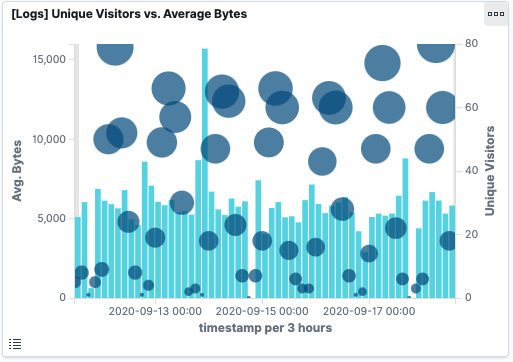

    - Locate the time frame in the last 7 days with the most amount of bytes (activity).

    - In your own words, is there anything that seems potentially strange about this activity?

        **Example Answer:** (Your results may be different.) In our example, it seems strange that _one_ visitor is using a number of bytes that is considerably higher than all other usage.

         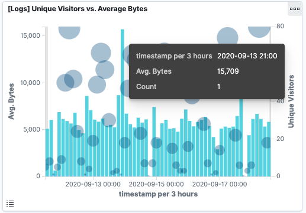

4. Filter the data by this event.

     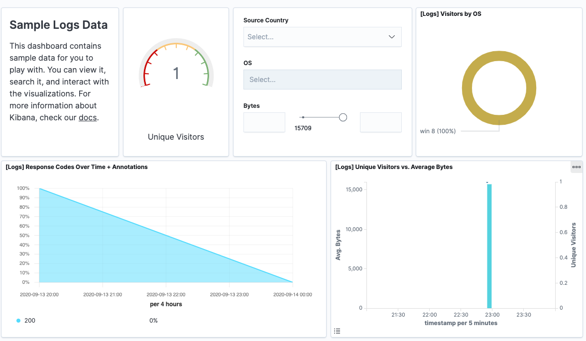

    - What is the timestamp for this event?
      
        - **Example Answer:** The time filter shows Sep 13, 2020 @ 21:00 -> Sep 14, 2020 @ 00:00. The time stamp is 22:55.

     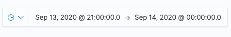

     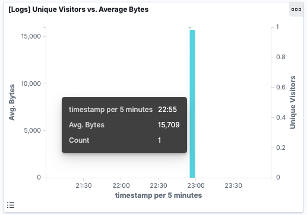

    - What kind of file was downloaded?

       - **Example Answer:** An RPM file

     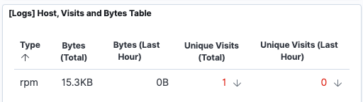
        
    - From what country did this activity originate?

        - **Example Answer:** India

         
        
    - What HTTP response codes were encountered by this visitor?

        - **Example Answer:** 200 OK

     

5. Switch over to the Kibana Discover page to see more details about this activity.

    

    - What is the source IP address of this activity?

        - **Example Answer:** `35.143.166.159`
    
    - What are the geo coordinates of this activity?

        - **Example Answer:** `{ "lat": 43.34121, "lon": -73.6103075 }`

     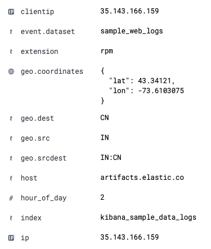    
    
    - What OS was the source machine running?

        - **Example Answer:** Windows 8
    
    - What is the full URL that was accessed?

        - **Example Answer:** https://artifacts.elastic.co/downloads/beats/metricbeat/metricbeat-6.3.2-i686.rpm
    
    - From what website did the visitor's traffic originate?

        - **Example Answer:** Facebook

       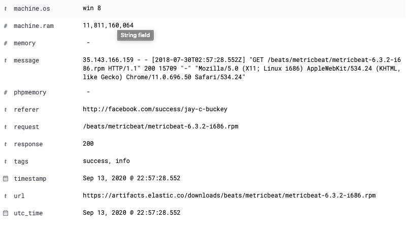

6. Finish your investigation with a short overview of your insights.

    - What do you think the user was doing?

        - **Example Answer:** This event appears to be a user downloading a Linux package from the website being monitored. 

    - Was the file they downloaded malicious? If not, what is the file used for?

        - Linux packages aren't typically malicious, but they could be. Depending on the website, this could be harmless traffic from a sysadmin performing an update.

    - Was there anything that seems suspicious about this activity? 
    - Is any of the traffic you inspected potentially outside of compliance guidelines?

        - **Example Answer:** The main concern is the referral link from Facebook, as it's probably not within compliance to post package update links on Facebook.

        - This user could be further investigated and monitored for suspicious activity.

---
© 2020 Trilogy Education Services, a 2U, Inc. brand. All Rights Reserved.  