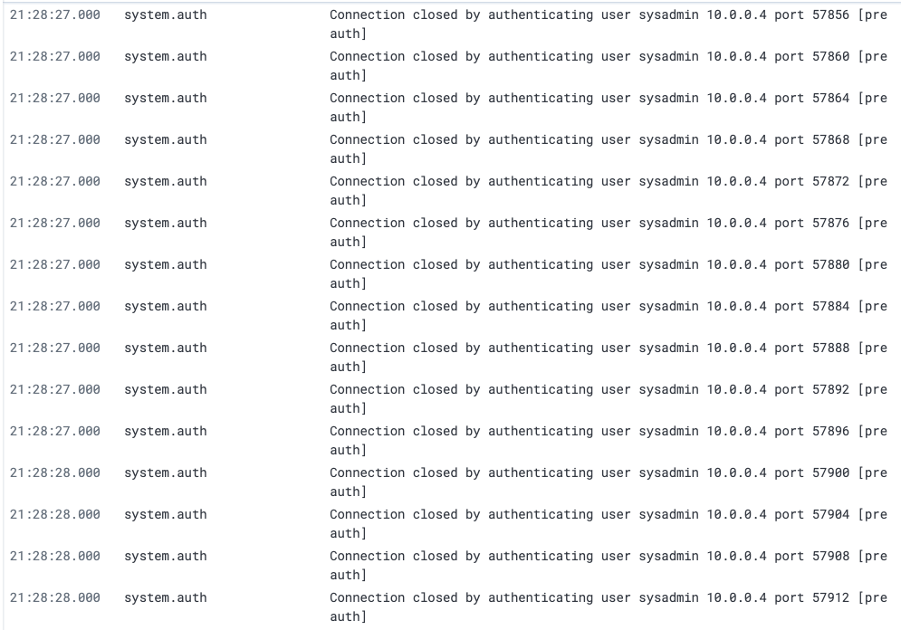
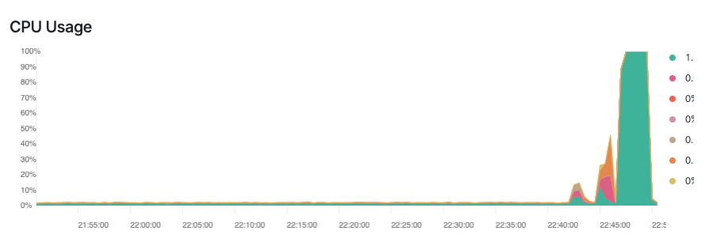
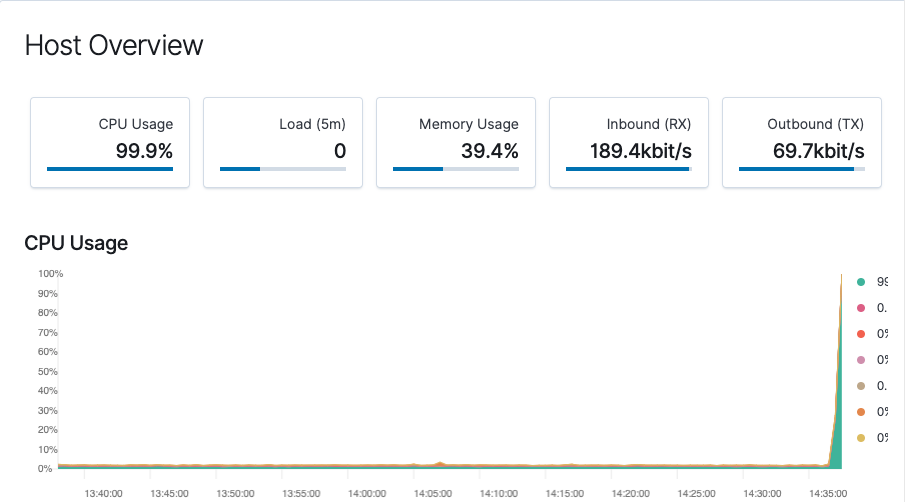
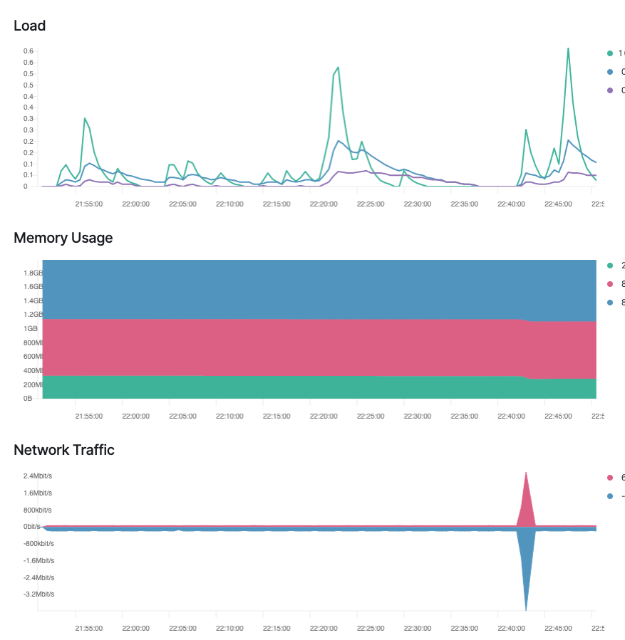

### Solution Guide: Kibana Continued

### Scenario 

In this activity, you played the role of a cloud architect and were tasked with setting up an ELK server to gather logs for the Incident Response team.

Before you hand over the server to the IR team, your senior architect has asked that you verify the ELK server is working as expected and pulling both logs and metrics from the pen-testing web servers.

You had three tasks: 

1. Generate a high amount of failed SSH login attempts and verify that Kibana is picking up this activity.

2. Generate a high amount of CPU usage on the pen-testing machines and verify that Kibana picks up this data.

3. Generate a high amount of web requests to your pen-testing servers and make sure that Kibana is picking them up.

### SSH Barrage

Task: Generate a high amount of failed SSH login attempts and verify that Kibana is picking up this activity.

<details>
<summary> Solution Guide: SSH Barrage </summary>

<br>

### SSH Barrage Solutions

1. Start by logging into your jump-box. 

	- Run: `ssh username@ip.of.web.vm`

	- You should receive an error:

		```bash
		sysadmin@Jump-Box-Provisioner:~$ ssh sysadmin@10.0.0.5
		sysadmin@10.0.0.5: Permission denied (publickey).
		```

	- This error was also logged and sent to Kibana. 

2.  Run the failed SSH command in a loop to generate failed login log entries.

    ```bash
    # Creates 1000 login attempts on the 10.0.0.5 server.
    sysadmin@Jump-Box-Provisioner:~$ for i in {1..1000}; do ssh sysadmin@10.0.0.5; done
    ```

    - Syntax Breakdown:
        - `for` begins the for loop.
        - `i in` creates a variable named `i` that will hold each number `in` our list.
        - `{1..1000}` creates a list of 1000 numbers, each of which will be given to our `i` variable.
        - `;` separates the portions of our `for` loop when written on one line.
        - `do` indicates the action taken each loop.
        - `ssh sysadmin@10.0.0.5` is the command run by `do`.
        - `;` separates the portions of our for loop when it's written on one line.
        - `done` closes the `for` loop.


3. Search through the logs in Kibana to locate your generated failed login attempts.

    ```bash
    # IMPORTANT: This loop will continue to run until you stop it using `CTRL + C` 
    # It will create thousands of login attempts on the 10.0.0.5 server.
    sysadmin@Jump-Box-Provisioner:~$ while true; do ssh sysadmin@10.0.0.5; done
    ```

    - Syntax Breakdown:
        - `while` begins the while loop.
        - `true` will always be equal to `true` so this loop will never stop, unless you force quit it.
        - `;` separates the portions of our `while` loop when it's written on one line.
        - `do` indicates the action taken each loop.
        - `ssh sysadmin@10.0.0.5` is the command run by `do`.
        - `;` separates the portions of our `for` loop when it's written on one line.
        - `done` closes the `for` loop.

    - Search through the logs in Kibana to locate your generated failed login attempts.

    - You should find a section of logs that look like this:

        

4. **Bonus**: Create a nested loop that generates SSH login attempts across all 3 of your VM's.


    ```bash
    sysadmin@Jump-Box-Provisioner:~$ while true; do for i in {5..7}; do ssh sysadmin@10.0.0.$i; done; done
    ```
     - **Important:** This loop will continue to run until you stop it using `CTRL + C` and will create thousands of login attempts.

     - Syntax Breakdown:
        - `i in` creates a variable named `i` that will hold each number `in` our list.
        - `{5..7}` creates a list of numbers (5, 6 and 7), each of which will be given to our `i` variable.
        - `do` indicates the action taken each loop.
        - `ssh sysadmin@10.0.0.$i` is the command run by `do`. It is passing in the `$i` variable so the `wget` command will be run on each server.


     - Note that the brace expansion (`{5..7}`) will only work if the IP addresses of your servers end in `5`, `6`, or `7`. If their IP numbers are not in sequence, we can list them explicitly:

	```bash
	# Note `for i in 5 8 12`
	sysadmin@Jump-Box-Provisioner:~$ while true; do for i in 5 8 12; do ssh sysadmin@10.0.0.$i; done; done
	```

    - **Note**: This loop will continue to run until you stop it using `CTRL + C` and will create thousands of login attempts.


</details>

### Linux Stress

Task: Generate a high amount of CPU usage on the pen-testing machines and verify that Kibana picks up this data.

<details>

<summary> Solution Guide: Linux Stress </summary>

<br>

### Solutions

1. From your Jump-Box, start up your `Ansible` container and attach to it.

        ```bash
        $ sudo docker container list a #to obtain the container name

        $ sudo docker start container_name

        $ sudo docker attach container_name
        ```

2. SSH from your Ansible container to one of your WebVM's.

        ```bash
        $ ssh username@ip.of.web.vm
        ```

3. Run `sudo apt install stress` to install the stress program.

4. Run `sudo stress --cpu 1` and allow stress to run for a few minutes. 

5. View the Metrics page for that VM in Kibana. 

    - Are you able to see the CPU usage increase?

    - **Answer:** Yes. Leave the stress test running and continue to refresh the Kibana metrics page for that VM. You should see a jump in CPU usage similar to the below image:

        


6. Run the `stress` program on all three of your VMs and take screen shots of the data generated on the metrics page of Kibana.

    - **Solution:** You should be able to create screen shots similar to the below:

        

        


</details>


### wget-DoS

Task: Generate a high amount of web requests to your pen-testing servers and make sure that Kibana is picking them up.

<details>

<summary> Solution Guide: wget-DoS </summary>


1. Login to your Jump-Box

2. Run `wget ip.of.web.vm`

	```bash
	sysadmin@Jump-Box-Provisioner:~$ wget 10.0.0.5
	--2020-05-08 15:44:00--  http://10.0.0.5/
	Connecting to 10.0.0.5:80... connected.
	HTTP request sent, awaiting response... 302 Found
	Location: login.php [following]
	--2020-05-08 15:44:00--  http://10.0.0.5/login.php
	Reusing existing connection to 10.0.0.5:80.
	HTTP request sent, awaiting response... 200 OK
	Length: 1523 (1.5K) [text/html]
	Saving to: ‘index.html’

	index.html            100%[=======================>]   1.49K  --.-KB/s    in 0s      

	2020-05-08 15:44:00 (179 MB/s) - ‘index.html’ saved [1523/1523]
	```

3. Run `ls` to view the file you downloaded from your web vm to your jump-box:

	```bash
	sysadmin@Jump-Box-Provisioner:~$ ls
	index.html
	```

4. Run the `wget` command in a loop to generate a ton of web requests.
	
	- You can use a bash `for` or `while` loop, directly on the command line, just as you did with the `SSH` command.

	- **for loop:**

		```bash
		sysadmin@Jump-Box-Provisioner:~$ for i in {1..1000}; do wget 10.0.0.5; done
		```
		**Important:** This loop will create 1000 web requests on the 10.0.0.5 server and 1000 downloaded files on your jump-box.

		Syntax Breakdown:
		- `{1..1000}` creates a list of 1000 numbers, each of which will be given to our `i` variable.
		- `;` separates the portions of our `for` loop when it's written on one line.
		- `do` is what each iteration of the loop will do.
		- `do wget 10.0.0.5` is the command run by with each loop.


	- **while loop:**

		```bash
		sysadmin@Jump-Box-Provisioner:~$ while true; do wget 10.0.0.5; done
		```

		**Important:** This loop will continue to run until you stop it using `CTRL + C` and will create thousands of web requests on the 10.0.0.5 server as well as files on your jump-box.


5. Open the `Metrics` page for the web machine you attacked and answer the following questions:
	
	- Which of the VM Metrics was affected the most from this traffic?

	- **Answer:** The Load and Networking Metrics were hit:

	  

6. **Bonus**: Notice that your `wget` loop creates a lot of duplicate files on your jump-box.

	-  Write a command to delete _all_ of these files at once.

		```bash
		sysadmin@Jump-Box-Provisioner:~$ rm *
		```

	-  Find a way to run the `wget` command without generating these extra files.
		- Look up the flag options for `wget` and find the flag that lets you choose a location to save the file it downloads. 

		**Answer:** From the man pages:

		```bash
			-O file
			--output-document=file
					The documents will not be written to the appropriate files, but all will
					be concatenated together and written to file.  If - is used as file,
					documents will be printed to standard output, disabling link conversion.
					(Use ./- to print to a file literally named -.)
		```

	- Save that file to the linux directory known as the 'void' or the directory that doesn't save anything.

		- **Answer:** The directory known as the 'void' that doesn't save anything is `/dev/null`

		- Full command: `while true; do wget 10.0.0.5 -O /dev/null; done`


7. **Bonus**:  Write a nested loop that sends your `wget` command to all 3 of your web VM's over and over.

	```bash
	sysadmin@Jump-Box-Provisioner:~$ while true; do for i in {5..7}; do wget -O /dev/null 10.0.0.$i; done; done
	```

	- **Important:** This loop will continue to run until you stop it using `CTRL + C` and will create thousands of web requests.

	- Syntax Breakdown:
		- `i in` create a variable named `i` that will hold each number `in` our list.
		- `{5..7}` creates a list of numbers, (5, 6 and 7) each of which will be given to our `i` variable.
		- `;` separates the portions of our `for` loop when it's written on one line.
		- `do wget 10.0.0.$i` is the command run by `do`. Notice that here we are passing in our `$i` variable so the `wget` command will be run on each server.
	

	- Or:

		```bash
		sysadmin@Jump-Box-Provisioner:~$ while true; do for i in 5 8 12; do wget -O /dev/null 10.0.0.$i; done; done
		```

	- **Important:** This loop will continue to run until you stop it using `CTRL + C` and will create thousands of web requests.

</details>


---

© 2020 Trilogy Education Services, a 2U, Inc. brand. All Rights Reserved.  
