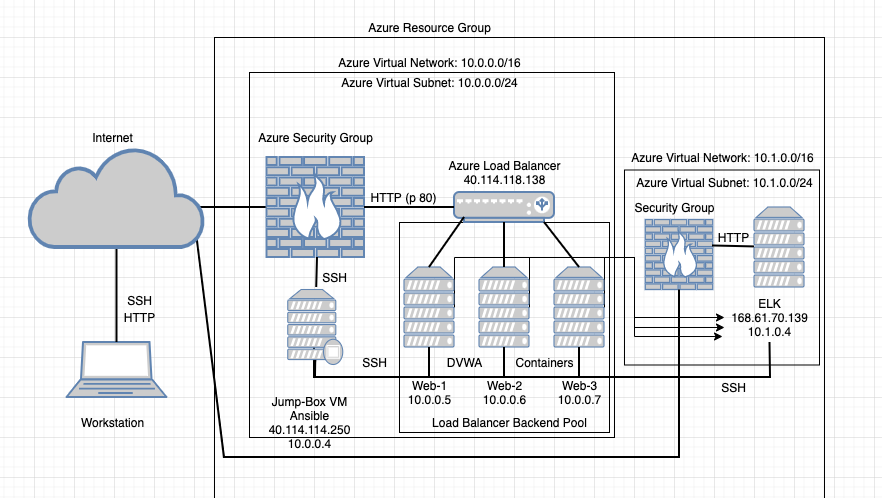
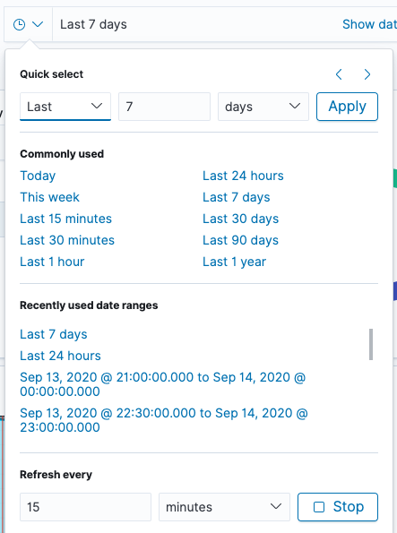

## 13.1-13.3 Lesson Plan: ELK Stack Project Week

### Overview

This week, students will set up a cloud monitoring system by configuring an ELK stack server. Students will be introduced to the project and then begin working on it.

### Week Objectives

Students will use the following skills and knowledge to complete the project:

- Deploying containers using Ansible and Docker.
- Deploying Filebeat and Metricbeat using Ansible.
- Deploying the ELK stack on a server.
- Diagramming networks and creating a README.

### Instructor Notes

This is the last week of class before students begin to study security-specific material. Students have come a long way in the course, so be sure to acknowledge their hard work and the skills they've learned.

Instead of three separate lesson plans, this single lesson plan gives guidance for the entire week. It does not include specific times for individual lectures and activities, but you should follow the day-by-day breakdown. If advanced students complete the work allotted for one day, they can move on to the next day's work.

While each student is expected to complete and submit projects individually, you can encourage students to work through problems together.

:warning: **Important:** On Day 1, Azure may run out of available VMs for the students to create a particular region. If this happens, students will need to do one of two things:

  -  Open a support ticket with Azure support using [these instructions](https://docs.microsoft.com/en-us/azure/azure-portal/supportability/how-to-create-azure-support-request). Azure support is generally very quick to resolve issues.

  -  Create another VNet in another region and attempt to create the ELK sever in that region.

The **grading rubric** for this project and the homework is located in the Resources folder:

- [Unit 13 Grading Rubric](Resources/Grading-Rubric.pdf)

### Lab Environment

Students will continue using their personal Azure accounts and build upon their existing Azure VMs. They will **not** be using their cyberxsecurity accounts.

### Additional Resources

- [Ansible Documentation](https://docs.ansible.com/ansible/latest/modules/modules_by_category.html)
- [`elk-docker` Documentation](https://elk-docker.readthedocs.io/#Elasticsearch-logstash-kibana-elk-docker-image-documentation)
- [Virtual Memory Documentation](https://www.elastic.co/guide/en/elasticsearch/reference/current/vm-max-map-count.html)
- [ELK Server URL](http://your-IP:5601/app/kibana#/home?_g=())
- [Docker Commands Cheatsheet](https://phoenixnap.com/kb/list-of-docker-commands-cheat-sheet)

### Slideshow

The slideshow to this week is located on Google Drive here: [ELK Stack Project Week Slides](https://docs.google.com/presentation/d/1b0jbp5L_ws2iCFuOSnU7BfoXb6oSiWccqmwXKk8yJ0w/edit#slide=id.g4789b2c72f_0_6)

---

## Day 1: Configuring an ELK Server

#### 13.1 Instructor Do's

On the first day of the project week, you will:

  - Give an overview of the ELK stack and how it performs network security monitoring. This overview will also give students valuable context for why they’re configuring and deploying these tools during the week.

  - Provide the project overview as well as suggested milestones for each day. 

  - Explain that due to Azure Free account limitations, students can only utilize 4vCPUs per region in Azure. Therefore, we will need to create a new VNet in another region for our ELK server.

  - By the end of the project, we will have an ELK server deployed and receiving logs from all three web VMs created in the previous cloud weeks.

#### 13.1 Student Do's

On the first day of the project week, students will: 

  - Create a new VNet in Azure in a different region, within the same resource group.
  - Create a peer-to-peer network connection between their VNets.
  - Create a new VM in the new VNet that has 2vCPUs and a minimum of 4GiB of memory.
  - Add the new VM to Ansible’s `hosts` file in their provisioner VM.
  - Create an Ansible playbook that installs Docker and configures an ELK container.
  - Run the playbook to launch the container.
  - Restrict access to the ELK VM.

 
 <b> Click here to view the 13.1 Lesson Plan. </b> 

---

### Day 1 Checkpoint

|:warning: **Checkpoint** :warning:|
|:-:|
| Students will be using the cloud environments created in the previous unit. Use the the checklist located [here](../12-Cloud-Security/Resources/Checklist.md) to verify that students have everything they need ready for the project week. |

### 01. Instructor Do: Project Overview  

Welcome students to class and explain that today is the first day of project week.

- The purpose of project week is to provide an opportunity to combine everything they've learned in order to create and deploy a live security solution.

- This boot camp includes three projects in total. In the next two, students will expand on the work they started this week, developing a portfolio reflective of their increasingly sophisticated skill-set.

This week, students will deploy an ELK monitoring stack within their virtual networks. This will allow them to monitor the performance of their web server that is running DVWA.

- In particular, the ELK stack allows analysts to:

  - Easily collect logs from multiple machines into a single database.

  - Quickly execute complex searches, such as: _Find the 12 internal IP addresses that sent the most HTTP traffic to my gateway between 4 a.m. and 8 a.m. in April 2019._

  - Build graphs, charts, and other visualizations from network data.

At the end of the week, students will have a fully functional monitoring solution, live on the cloud. Emphasize that this will be a major achievement for a few reasons:

- Deploying, configuring, and using an ELK stack is a common task for network engineers, SOC analysts, and other security professionals. Completing this project will be proof of students' skills, which they can present to hiring managers.

- The ELK stack is very commonly used in production. Students will likely work for organizations that use either ELK or Splunk, which is covered later in the course. Experience with both is a great addition to a job application.

- Students can expand this network with additional machines on their own time to generate a lot of interesting log information. This sort of independent research is useful for learning, and hiring managers love to see it.

Finally, emphasize that the amount that students have learned in order to complete this project, including systems administration, configuration as code, virtualization, and cloud deployment, is substantial. Congratulate them on having made it this far.

#### Project Deliverables

Let students know that as they work through the project, they will develop the following "deliverables" that they can take with them and discuss at job interviews:

- **Network diagram**: This document is an architecture diagram describing the topology of their network.

- **Technical brief**: Answers to a series of questions explaining the important features of the suite, completed after deploying the stack.

- **GitHub repository**: Instructions are provided in this week's homework as to how to set up a Github account. After completing the project, students will save their work to a database, called a Git repository, along with an in-depth description of the project. This will make it easy for them to redeploy their work in the future, as well as share it with others.

Students will also be prompted to talk about their projects as they pertain to specific cybersecurity domains. 

#### Today's Class

Let students know that the rest of today's class will proceed as follows:

- Introduction to ELK: An overview of the technologies that make up the ELK stack and its capabilities.

- Project Work: Working hands-on through the project steps to develop their networks.

Remind students that they can complete this project even if they don't have all four VMs set up. Missing VMs can be added after the project tasks are completed. 

Take a moment to address questions before proceeding.

### 02. Instructor Do: Introduction to ELK

Before students deploy an ELK Stack, let's cover what the stack can do and how it work. Students should be familiar with ELK from previous units. Review the following:

- ELK is an acronym. Each letter stands for the name of a different open-source technology:

  - **Elasticsearch**: Search and analytics engine.

  - **Logstash**: Server‑side data processing pipeline that sends data to Elasticsearch.

  - **Kibana**: Tool for visualizing Elasticsearch data with charts and graphs.

- ELK started with Elasticsearch. Elasticsearch is a powerful tool for security teams because it was initially designed to handle any kind of information. This means that logs and arbitrary file formats, such as PCAPs, can be easily stored and saved.

- After Elasticsearch became popular for logging, Logstash was added to make it easier to save logs from different machines into the Elasticsearch database. It also processes logs before saving them, to ensure that data from multiple sources has the same format before it is added to the database.

- Since Elasticsearch can store so much data, analysts often use visualizations to better understand the data at a glance. Kibana is designed easily visualize massive amounts of data in Elasticsearch. It is also well known for its complex dashboards.

Summarize by reiterating that:

- Elasticsearch is a special database for storing log data.

- Logstash is a tool that makes it easy to collect logs from any machine.

- Kibana allows analysts to easily visualize their data in complex ways.

Together, these three tools provide security specialists with everything they need to monitor traffic in any network.

#### The Beats Family

Reiterate that the ELK stack works by storing log data in Elasticsearch with the help of Logstash.

Traditionally, administrators would configure servers to collect logs using a built-in tool, like `auditd` or `syslog`. They would then configure Logstash to send these logs to Elasticsearch.

- While functional, this approach is not ideal because it requires administrators to collect all of the data reported by tools like `syslog`, even if they only need a small portion of it.

- For example, administrators often need to monitor changes to specific files, such as `/etc/passwd`, or track specific information, such as a machine's uptime. In cases like this, it is wasteful to collect all of the machine's log data in order to only inspect a fraction of it.

ELK addressed this issue by adding an additional tool to its data collection suite called **Beats**.

- Beats are special-purpose data collection modules. Rather than collecting all of a machine's log data, Beats allow you to collect only the very specific pieces you are interested in.

ELK officially supports eight Beats. Students will use two of them in this project:

- **Filebeat** collects data about the file system.

- **Metricbeat** collects machine metrics, such as uptime.

  - Explain that a **metric** is simply a measurement about an aspect of a system that tells analysts how "healthy" it is. 
  
  - Common metrics include:
    
    - **CPU usage**: The heavier the load on a machine's CPU, the more likely it is to fail. Analysts often receive alerts when CPU usage gets too high.

    - **Uptime**: Uptime is a measure of how long a machine has been on. Servers are generally expected to be available for a certain percentage of the time, so analysts typically track uptime to ensure their deployments meet service-level agreements (SLAs).

- In other words, Metricbeat makes it easy to collect specific information about the machines in the network. Filebeat enables analysts to monitor files for suspicious changes.

Let students know that they can find documentation about the other Beats at the official Elastic.co site: [Getting Started with Beats](https://www.elastic.co/guide/en/beats/libbeat/current/getting-started.html).

### 03. Instructor Do: Project Overview

Now that students understand ELK, it's time to begin deploying it. In this section, you will:

- Explain specifically what students will be building.

- Explain the milestones students should complete each day.

After that, students will spend the rest of the class configuring and deploying their ELK stack.

#### Project Setup

Explain that the goal of this project is to add an instance of the ELK stack to a new virtual network in another region in Azure and configure their 3 Web VM's to send logs to it.

Make sure that all students are logged into their personal Azure accounts and not cyberxsecurity. They will be using the VMs they created during the week on cloud security.

Since they will be building off of that week, take a moment to review the network architecture built in that unit.

Point out that this network contains:

  

- A gateway. This is the jump box configured during the cloud security week.

- Three additional virtual machines, one of which is used to configure the others, and two of which function as load-balanced web servers.

  - **Note:** Some students may have only created 2 webVM's during cloud week. This is OK.

Explain that due to Azure Free account limitations, students can only utilize 4vCPUs per region in Azure. Therefore, we will need to create a new VNet in another region in Azure for our ELK server.

- By the end of the project, we will have an ELK server deployed and receiving logs from web machines in the first VNet.

:warning: **Important:** Azure may run out of available VMs for the students to create a particular region. If this happens, students will need to do one of two things:

1. Students can open a support ticket with Azure support using [these instructions](https://docs.microsoft.com/en-us/azure/azure-portal/supportability/how-to-create-azure-support-request). Azure support is generally very quick to resolve issues.

2. Students can create another VNet in another region and attempt to create the ELK sever in that region.

    - In order to set this up, students will perform the following steps:

      1. Create a new VNet in a new region (but same resource group).
      2. Create a peer-to-peer network connection between their two VNets.
      3. Create a new VM within the new network that has a minimum of 4GiB of memory, 8GiB is preferred.
      4. Download and configure an ELK stack Docker container on the new VM.
      5. Install Metricbeat and Filebeat on the web-DVWA-VMs in their first VNet.

Emphasize that students will use Ansible to automate each configuration step.

At the end of the project, students will be able to use Kibana to view dashboards visualizing the activity of their first VNet.

Call attention to the fact that students will install an ELK container on the new VM, rather than setting up each individual application separately.

:warning: **Important:** The VM for the ELK server **must** have at least 4GiB of memory for the ELK container to run properly. Azure has VM options that have `3.5 GiB` of memory, but **do not use them**. They will not properly run the ELK container because they do not have enough memory.

- If a VM that has 4GiB of memory is not available, the ELK VM will need to be deployed in a different region that has a VM with 4GiB available.

- Emphasize that, before containers, we would not have been able to do this. We would have had to separately configure an Elasticsearch database, a Logstash server, and a Kibana server, wire them together, and then integrate them into the existing network. This would require at least three VMs, and definitely many more in a production deployment.

- Instead, now students can leverage Docker to install and configure everything all at once.

Remind students that they took a similar approach when creating an Ansible control node within the network. They installed an Ansible container rather than installing Ansible directly. This project uses the same simplifying principle, but to even greater effect.

#### Project Milestones

Let students know that they will be working independently this week. They should aim to have certain amounts of work done each day. Specifically, the suggested milestones are:

- **Day 1** (Today): Configure the ELK server.

- **Day 2**: Complete installation of Filebeat and Metricbeat.

- **Day 3**: Finish any outstanding tasks from Day 2 and spend the majority of class finishing their network diagrams and answering questions in the brief.

For the remainder of the day, students will work on configuring an ELK server within their virtual network.

Emphasize that, while students must complete their projects individually, they can work through problems together, and should ask instructional staff for help if they get stuck.

#### Troubleshooting Theory

Time permitting, you can review the following troubleshooting best practices with students. Note: Troubleshooting tips will also be offered in the activity file. 

Before students dive into the work today, let's briefly enforce the importance of independent troubleshooting as a means to not only solve the problem at hand, but also learn more about the technology that they are working with.  

Specifically, we will review the [Split-Half Search](https://www.peachpit.com/articles/article.aspx?p=420908&seqNum=3), an effective troubleshooting methodology that can be applied to _any_ technical issue to find a solution quickly.

The general procedure states that you should remove half of the variables that could be causing a problem and then re-test. 

  - If the issue is resolved, you know that your problem resides in the variables that you removed. 
  
  - If the problem is still present you know your problem resides in the variables that you did not remove. 
  
  - Next, take the set of variables where you know the problem resides. Remove half of them again and retest. Repeat this process until you find the problem.

Explain that in the context of this project, removing half of your variables could mean:

- Logging into the ELK server and running the commands from your Ansible script manually.

	- This removes your Ansible script from the equation and you can determine if the problem is with your Ansible Script, or the problem is on the ELK Server.

	- You can manually launch the ELK container with: `sudo docker start elk` or (if the container doesn't exist yet); `sudo docker run -p 5601:5601 -p 9200:9200 -p 5044:5044 -it --name elk sebp/elk:761`

- Downloading and running a different container on the ELK server.

	- This removes the ELK container from the equation and you can determine if the issue may be with Docker or it may be with the ELK container.

- Removing half of the commands of your Ansible script (or just comment them out).

	- This removes half of the commands you are trying to run and you can see which part of the script is failing.

Point out that another effective strategy is to change only one thing before your retest. This is especially helpful when troubleshooting code. If you change several things before you re-test, you will not know if any one of those things has helped the situation or made it worse.

Provide any troubleshooting pointers from your professional experience that you think may be helpful.

#### Day 1 References

Provide the following resources and references:

- For more information about ELK, visit [Elastic: The Elastic Stack](https://www.elastic.co/elastic-stack).

- For more information about Filebeat, visit [Elastic: Filebeat](https://www.elastic.co/beats/filebeat).

- To set up the ELK stack, we will be using a Docker container. Documentation can be found at [elk-docker.io](https://elk-docker.readthedocs.io/).

- For more information about peer networking in Azure, visit [Global VNet Peering](https://azure.microsoft.com/en-ca/blog/global-vnet-peering-now-generally-available/)

- If Microsoft Support is needed, visist [How to open a support ticket](https://docs.microsoft.com/en-us/azure/azure-portal/supportability/how-to-create-azure-support-request)

- [Split-Half Search](https://www.peachpit.com/articles/article.aspx?p=420908&seqNum=3)

### 04. Student Do: ELK Installation

Send students the following activity and resource files, and review the high-level activity steps:

- [Day 1 Activity File: ELK Installation](Activities/Stu_Day_1/Unsolved/ReadMe.md) 

- [Day 1 Resources](Activities/Stu_Day_1/Unsolved/Resources/)

Use the solution guide as reference if you need to assist students or review:

- [Day 1 Solution Guide: ELK Installation](Activities/Stu_Day_1/Solved/ReadMe.md)

---

### End of Day 1 Milestone

In today's class, you:

- Deployed a new VM on your virtual network.
- Created an Ansible play to install and configure an ELK instance.
- Restricted access to the new server.

Completing these steps required you to leverage your systems administration, virtualization, cloud, and automation skills. This is an impressive set of tools to have in your toolkit!

---

## Day 2: Filebeat

####  13.2 Instructor Do's

On the second day of project week, you will:

   - Provide a brief overview of Filebeat.

#### 13.2 Student Do's

On the second day of project week, students will:

   - Navigate to the ELK server’s GUI to view Filebeat installation instructions.
   - Create a Filebeat configuration file.
   - Create an Ansible playbook that copies this configuration file to the DVWA VMs and then installs Filebeat.
   - Run the playbook to install Filebeat.
   - Confirm that the ELK Stack is receiving logs.
   - Repeat the above steps to Install Metricbeat.

 <b> Click here to view the 13.2 Lesson Plan. </b> 

---

### Day 2 Checkpoint

|:warning: **Checkpoint** :warning:|
|:-:|
|  Make sure students have completed the following critical tasks before continuing onto Day 2 activities. |

- [ ] A new VNet has been created in your resource group in a new region.
- [ ] The new VNet is located in a region other than the region you have used for all your other resources.
- [ ] A peer connection has been created between VNets, allowing traffic to pass between them.
- [ ] A New VM has been created with a minimum of 4GB of memory. (8GB is preferred.)
- [ ] The new VM is configured to use the same SSH key that your Web VMs use from the Ansible container.
- [ ] Ansible is able to connect to the new VM.
- [ ] An Ansible playbook has been created that installs and configures an ELK container.
- [ ] The Ansible playbook can be run on the new VM.
- [ ] The new VM is running the ELK container.
- [ ] The ELK website is only accessible from your public IP address.

### 01. Instructor Do: Filebeat Overview

In the previous class, students installed the ELK server. Now it's time to install data collection tools called **Beats**. 

Before students being working on the activity, review the following about Filebeat: 

- Filebeat helps generate and organize log files to send to Logstash and Elasticsearch. Specifically, it logs information about the file system, including which files have changed and when. 

- Filebeat is often used to collect log files from very specific files, such as those generated by Apache, Microsoft Azure tools, the Nginx web server, and MySQL databases.

- Since Filebeat is built to collect data about specific files on remote machines, it must be installed on the VMs you want to monitor.

If students have not completed all Day 1 activities, they should finish them before continuing onto the Filebeat installation. 

### 02. Student Do: Day 2 Filebeat and Metricbeat Installation

Explain the following to students:

- Today, you will install Filebeat on the DVWA container you created during the cloud week. 

- This will provide a rich source of logs when you complete you deployment.

- After you install Filebeat, you will need to install Metricbeat as well. 

Send students the following Day 2 activity and resource files, and review the high-level activity steps:

- [Day 2 Activity File: Filebeat Installation](Activities/Stu_Day_2/Unsolved/ReadMe.md) 

- [Day 2 Resources](Activities/Stu_Day_2/Unsolved/Resources/)

 **Instructor Note:** The Resources folder includes an `ansible.cfg` file. Students will not need to do anything with this file. It's included in case a student accidentally edits or deletes their configuration file.

Use the solution guide as a reference if you need to assist students or review:

- [Day 2 Solution Guide: Filebeat Installation](Activities/Stu_Day_2/Solved/ReadMe.md)

### End of Day 2 Milestone

If your ELK server is receiving logs, congratulations! You've successfully deployed a live, functional ELK stack and now have plays that can:

- Install and launch Docker containers on a host machine.
- Configure and deploy an ELK server.
- Install Filebeat and Metricbeat on any Debian-flavored Linux server.

Even more significant is that you've done all of this through automation with Ansible. Now you can recreate exactly the same setup in minutes.

---

## Day 3: Exploration, Diagramming and Documentation

#### 13.3 Instructor Do's

On the final day of project week, you will:

  - Explore Kibana's features and demonstrate how to navigate datasets.
  - Introduce a supplemental assignment in which students answer interview-style questions about their project. 

#### 13.3 Student Do's

On the final day of project week, students will: 

  - Finalize the network diagram you began during the cloud security week.
  - Draft a README explaining what you've built.
  - Craft interview response questions.
  - Continue exploring Kibana with advanced scenarios. 

 <b> Click here to view the 13.3 Lesson Plan. </b> 

---

### 01. Instructor Do: Day 3 Overview

Explain that today's class will proceed as follows:

- An instructor demo on navigating logs using Kibana, followed by a Kibana activity and review.

- A brief overview of the supplemental interview questions that students can answer. 

- Students can use the rest of the day to complete their project.

  - Students who need more time installing Filebeat and Metricbeat on their DVWA machines can continue this work.

  - Students who have finished the Filebeat and Metricbeat installation can create their network diagrams and project READMEs.

  - Students will also have the opportunity to answer questions about the project as it relates to different cybersecurity domains.

Students will receive a file for each of the above activities. 

### 02. Instructor Do: Exploring Kibana

Explain that because we now have a working instance of Kibana, we will discuss how to use it.

- Point out that companies use tools like Kibana to research events that have happened on their network.

- Any attack leaves a trace that can be followed and investigated using logs. Additionally, sometimes registrars don't take down clever malicious domains, leaving businesses to index and defend against them themselves.

Reiterate that Kibana is an interface for viewing such data. It allows cyber professionals to gain insight from lots of data that would otherwise be unmanageable.

Explain that you will give the students a quick overview of Kibana before they begin the next activity.

#### Kibana Walkthrough

1. Start by importing Kibana's Sample Web Logs data.

    - You can import it by clicking **Try our sample data**.

     

    - You can also import it from the homepage by clicking on **Load a data set and a Kibana dashboard** under **Add sample data**.

     

    - Click **Add Data** under the **Sample Web Logs** data pane.

      

   -  Click **View Data** to pull up the dashboard.

2. Give a quick overview of the interface, starting with the time dropdown in the top-right of the screen.

   - Explain that Kibana categorizes everything based on timestamps.

    - Click the dropdown and show that there are several predefined options to choose from: Today, Last 7 days, Last 24 hours, etc.
    
      
    
    - Choose a few options to show how the data changes, and return to the Last 7 Days setting.

  - Next, point out the following data panes and give a quick overview of each:

    - **Unique Visitors**: Unique visitors to the website for the time frame specified.
    - **Source Country**: Web traffic by country.
    - **Visitors by OS**: The kind of OS visitors are using. 
    - **Response Codes Over Time**: HTTP response codes 200, 404 and 503.
    - **Unique Visitors vs. Average Bytes**: The number of visitors and the amount of data they use.
    - **File Type Scatter Plot**: A graph showing the types of files that were accessed.
    - **Host, Visits and Bytes Table**: A table showing the kinds of files that were accessed.
    - **Heatmap**: Hours of the day that are most active by country.
    - **Source and Destination Sankey Chart**: Connections that have been made by country. The thicker the line, the more data was transferred between machines.
    - **Unique Visitors by Country**: Countries the traffic is originating from.

  - Explain that these panes are interactive and can help filter data.

  -  Click on the United States inside Unique Visitors by Country to demonstrate how the panes change to reflect only the data that originated from the United States.

  

3. Explain that we can dive further into this data using Kibana's Discover page.

    - Locate the hamburger dropdown menu at the top-left of the page and choose the **Discover** option under the **Kibana** heading.

      

    - Point out that we can now look at interactions between clients and the server in more detail.

    - Explain that each item listed is not a single packet, but represents the entire interaction between a specific client and the server (i.e. it represents _many_ network packets that were exchanged).

    - Click the expansion arrow next to the first interaction and show the resulting table of information.

      

    - Point out that we can see things like source and destination IPs, the amount of bytes exchanged, the geo coordinates of the source traffic, and much more.

      

   - Remind students that this data is still filtered by traffic originating from the United States.

4. Click the hamburger dropdown menu again and return to the **Dashboard** option listed under **Kibana**.

    

   - Demonstrate how to remove the `geo.src: US` filter that is applied to the data by clicking on the small **x** near the filter tab.

     

   - Explain that in the next activity, students will have the opportunity to explore these logs further and learn more from the traffic.

Pause and ask if there are any questions.

### 03. Student Do: Exploring Kibana (0:25)

Explain the following to class:

- You are a DevOps professional and have set up monitoring for one of your web servers. You are collecting all sorts of web log data and it is your job to review the data regularly to make sure everything is running smoothly.

- Today, you notice something strange in the logs and you want to take a closer look.

- Your are tasked with exploring the web server logs to see if there's anything unusual.

Send students the following activity file: 

  - [Activity File: Exploring Kibana](Activities/Stu_Day_3/Exploring-Kibana/Unsolved.md)

### 04. Instructor Review: Exploring Kibana (0:10)

This activity had students think about network architecture from a combined administration, security, and budgetary point of view.

Use the following guide to review the activity:

- [Solution Guide: Exploring Kibana](Activities/Stu_Day_3/Exploring-Kibana/Solved.md)

Explain that students will be able to further explore Kibana's capabilities in another optional activity later today. 

### 05. Instructor Do: Project Communication - Documenting, Diagramming, and Discussing

Emphasize that students have produced an impressive deliverable that they can display to potential employers and their professional network. Explain that later today, they will be able to develop network diagrams and README documentation. They will also add their project to a GitHub repository for homework. 

Explain that another important piece of presenting this project in a professional manner is verbally communicating all the skills and knowledge they've gained so far.  

This section introduces an optional part of the project in which students answer mock interview responses. Responses should demonstrate a robust understanding of their work and the ability to relate it to various security domains. 

#### Mock Interview Questions Overview

Explain the following: 

- This first project covers a wide range of topics including cloud, network security, and logging and monitoring.

- When networking and talking to potential employers, you should be able to reference the work done on this project to answer specific interview questions or demonstrate your skills within a specific domain. This section will teach you how to do this.

- First we'll explain a general structure for answering common technical interview questions. We will then show you examples that use this structure, and also use specific examples from Project 1.

- Then it's your turn. First you will choose a domain that you're interested in pursuing as a career. For this project, you will choose from the following domains:

  - Network security
  - Cloud security
  - Logging and monitoring

- Within each domain, we have provided a set of interview questions.  For each question, you will think about specific tasks completed in Project 1 that you can use to answer the question.

For this section, students will:

- Select a question.

- Write a one-page response that answers the question using specific examples from Project 1. Your response should flow and read like a presentation while keeping the general structure of the technical question response guidelines. 

Emphasize that it's okay if students are unsure which domain they want to focus on. They can either choose the one they're most comfortable discussing, or complete the tasks in two or all three domains.

- In Projects 2 and 3, students will complete similar extension activities. Offensive and defensive security will be included as additional domains in these later projects.

- Additionally, during Career Prep week, we will discuss how you can adapt your interview responses for Demo Day networking.

#### Responding to Technical Questions

In this section, we will walk through the process of answering technical interview questions.  

Explain that interviewers frequently ask open-ended questions like: "How would you secure access to a cloud network?"

- Answering such questions can feel difficult at first. The question is indirect, with multiple possible answers. 

- But you have valuable experience that you can draw on to provide a compelling response.

We'll begin by walking through the structure of a good response. Then we will look at some example answers that incorporate specific details from Project 1.

#### Structure of Good Responses

Explain the following:

- Interviewers do not want you to immediately supply a direct answer, even if it's the right one. 

- The point of open-ended questions is to see if you can explain your thought process and rationale.

- Good responses do more than just provide an answer. They also demonstrate that you truly understand the question and solution.

Regardless of the specific question, good responses all do the following:

- Restate the problem.
- Provide a concrete example scenario.
- Explain the solution requirements.
- Explain the solution details.
- Identify advantages and disadvantages of the solution. 

Ensuring all of your responses to open-ended technical questions include these components will help you prove to interviewers your competency and expertise. Next, we will look at a specific interview question and apply this framework using examples from Project 1.

#### Sample Question #1

Present the following sample question from the cloud security domain:

**Question**: How would you control access to a cloud network?

Let’s walk through the steps to answer this question:

1. **Restate the Problem**
- When restating the question in your own words, add additional details to demonstrate you understand what is being asked and why.
   
 - Example: "It's important that organizations control access to a cloud network, especially since it has resources that only the engineering team should be able to access. Following the principle of least privilege, you want to make sure engineers can access it easily, but no one else can." 

2. **Provide a Concrete Example Scenario**

    - Use the parameters of the question to create an example scenario of the problem you just restated. This makes the problem easier to talk through and further demonstrates your experience with the topic. 

    -  Use your class experience to form scenarios. All your assignments are legitimate evidence of your technical background and experience, and can be referenced in your answers to open-ended questions.

    - Example: "In Project 1 of my cybersecurity bootcamp, we solved an almost identical problem. In that project, we deployed a virtual network containing several VMs to Azure, which only we and our instructional team were supposed to be able to access. Just as an organization would limit cloud network access to only engineers, we had to implement remote access controls limiting access to only a handful of authorized individuals."

3. **Explain the Solution Requirements**

    - Before explaining the details of your solution, explain the high-level actions you took at each step and what they accomplished.

    - Example: "After deploying the network, I first had to configure a network security group around the whole subnet. This blocked traffic from all IP addresses, except for mine, my partners', and my instructors'. This NSG allowed inbound access to only one machine on the internal network, the jump box.
    
       Then, I configured additional NSGs on the VMs within the subnet. This allowed connections only between the jump box and other local IP addresses.

       Finally, I forced the use of SSH keys to eliminate vulnerability to password-based brute-force."

    - Note: This example lists three high-level steps, including tools used and what each step accomplished. It does not explain exactly how you implemented each step.

4. **Identify Advantages and Disadvantages** 
- Point out why your solution works in general. Then acknowledge any potential shortcomings and how you would address them.

    - Example:  "This solution worked well for my project because it ensured only the selected users had access. However, it is difficult to maintain and scale because it requires updating the NSG every time a new user requires access to the network. In addition, securely using SSH keys can be tricky in the long run. An alternative solution addressing these shortcomings would be implementing a VPN gateway to the private network. This would allow us to manage and monitor users more safely and scalably."

    - Note: This reflection further demonstrates to the interviewer that you understand not only the problem and solution, but also the tradeoffs of your solution.

5. **Explain the Solution Details**

    - Now that you explained the high-level steps and reflected on the pros and cons, explain the specifics of how you would implement the solution. The examples below are shortened for brevity, but real answers would typically include considerably more detail.

    - Example: "To configure access controls around the entire subnet, I created an NSG with the following ruleset: […] These rules allow access to the jump box from only the specified IP addresses specified.

       Then, to configure access controls within the subnet, I created NSGs with the following ruleset: […] These rules allow the VMs within the network to communicate only with each other and with the jump box.

       To force the use of SSH keys, I modified the following configurations in the VMs on the network: [...] This ensures that password brute-force attacks will always fail."

 (Optional) Answering Sample Question #2 

 

If you have time, walk through another example with students. Note that specific sample answers are not provided. Instead, use the prompts provided to elicit responses from students.

**Question**: What is the most difficult networking bug you've ever faced, and how did you resolve it?

  - Note: This question is a bit different from the one before. For instance, there is no explicit problem to restate. Fortunately, the same response structure will still work, with a few small tweaks.

1. **Restate the Problem** 

    - This question does not pose a specific problem for you to explore. Instead, it requires that you select and explore one of your own debugging experiences. 

2. **Provide a Concrete Example Scenario**

    Select a debugging experience and explain the problem that you had to debug. Do this by answering the following questions:

    - In which part of the project did you encounter the most annoying bug? Consider the following high-level tasks:

      - Creating Azure VM deployments.
      - Configuring VMs with Ansible.
      - Installing and Running ELK with Docker.
      - Implementing access controls.

    - What were you trying to implement when you encountered this bug? If applicable, what error message did you get? For example: installing Docker, deploying infrastructure.
    
    - What did you expect to happen? What would have happened if everything went well?
    
    - What actually happened? What went wrong that you didn't expect?

    - Based on the above error output, how did you determine your first debugging steps?
    
    - What did you discover as you performed your debugging steps?
    
    - Which technique was successful?

3. **Solution Requirements and Details**

   - In addition to explaining which debugging step was successful, elaborate on the following:
   
     - How did you ultimately implement the solution so that you could move on?
   
     - How did you verify that your solution worked?
   
     - Based on your solution, what was broken in the first place?
   
     - Why did your solution work?

4. **Explain Advantages and Disadvantages**

   - Finally, consider the following:

     - Why was this a good solution for the circumstances?

     - Does the same solution work for larger projects? Why or why not?

     - If a different solution is necessary, what would you use instead?

### 06. Student Do: Project Communication and Further Exploration

Once students have finished installing Filebeat and Metricbeat, explain the following:. 

* If you've finished installing Filebeat and Metricbeat, congratulations! You can spend the rest of class time completing any of the following activities: 
  1. Finalize the network diagram you began during the Cloud Security week.
  2. Draft a README explaining what you've built.
  3. Answer an interview question.
  4. Continue exploring Kibana.

Send students the following files for each step:  

- [Activity File: Diagramming the Network](Activities/Stu_Day_3/Diagram/Unsolved.md)
- [Activity File: Completing the README](Activities/Stu_Day_3/Create-Readme/Unsolved.md)
- [Activity File: Interview Questions](Activities/Stu_Day_3/Interview/Unsolved.md)
- [Activity File: Kibana Continued](Activities/Stu_Day_3/Kibana-Continued/Unsolved.md)

### 07. (Optional) Class Do: Present Interview Responses

Time-permitting, ask class if anyone would like to share their interview responses. 

### 08. Class Do: Turn Off Machine and Wrap-Up

After students complete their diagrams, finish their README, and/or present their work, make sure students **turn off** their virtual machines.

- Navigate to `portal.azure.com`.
- Search for and select **Virtual machines**.
- Select every VM in the list.
- Click **Stop**. This will ensure you're never charged for any of the machines you used in the project.

#### Wrap-Up

At the end of this unit, congratulate the students for their hard work on the projects, and all the work they've done in the course so far.

Emphasize that students should make sure their projects are complete, professionally presentable, and free of errors. Remind them that they can use these resources as proof of knowledge and experience in the hiring process.

---

© 2020 Trilogy Education Services, a 2U, Inc. brand. All Rights Reserved.  
