## 16.1 Lesson Plan: Introduction to Pen Testing and Open Source Intelligence

### Overview

In today's class, students will be introduced to pen testing, why it's valuable to an organization's security, and discuss pen testing career pathways. We'll then move on to the first phase of pen testing using open source intelligence (OSINT) tools.

### Class Objectives

By the end of class, students will be able to:

- Understand the role of a pentester in assessing a business's security. 
- Do reconnaissance on a target network by performing basic DNS enumeration by viewing WHOIS record information.
- Gather domain information using OSINT techniques and tools like Google dorking, Shodan, and certificate transparency.
- Use Shodan and Recon-ng to discover domain server information. 

### Lab Environment

Lab Details

 

In this unit, you will be using a new Pentesting lab environment located in Windows Azure Lab Services. RDP into the **Windows RDP host machine** using the following credentials:

  - Username: `azadmin`
  - Password: `p4ssw0rd*`

Open up Hyper-V Manager to access the nested machines:

**Kali machine:**
  - Username: `root`
  - Password: `toor`

**Metasploitable machine:**
  - Username: `msfadmin`
  - Password: `msfadmin`

**ShellShock credentials:**
  - Username: `vagrant`
  - Password: `vagrant`

**Heartbleed credentials**:
  - Username: `vagrant`
  - Password: `vagrant`

**DVWA10 credentials**:
  - Username: `IEuser`
  - Password: `Passw0rd!`

In today's class, we will use the Kali machine

**Note:** Since the IP addresses are dynamic, the IP addresses used in the demos and activities should be treated as examples. The actual IP addresses will need to be determined before starting the exercises.

  

### Instructor Notes

- In this unit, you will be using a new Pentesting lab environment located in Windows Azure. You and students will need a class-specific registration link. If you are unsure about where to find this unique registration link, please do the following:

  * Please refer to this [spreadsheet](https://docs.google.com/spreadsheets/d/1uHVzvVQftHL4CkUOB03lNelf-kLToZys6ugsIoVOpE0/edit#gid=0) to find your university specific spreadsheet.
  * Open up your university-specific spreadsheet and navigate to your specific cohort’s tab
  * Please find the registration link for the appropriate lab environment 
  * Please note that these links will be added 1-2 classes prior to when students will be using the lab environment for the first time. If you would like access to a lab environment earlier for preparation, please reach out to the curriculum team 

- This week, students will learn about pen testing and the steps to becoming a pentester, and then perform some basic reconnaissance using OSINT tools.

- Provide enough time for students who have some difficulty understanding the syntax of a tool or how it works.

- Today will start off with mostly lectures introducing the theory of pen testing, but there are many opportunities for questions along the way.

- Before the start of class today, go to https://shodan.io and register for a free account. Once registered, click on **My Account**. You will need to log into this website for one of the demonstrations later today. 

   

### Slideshow and Timetracker

The class slides are available on Google Drive here: [16.1 Slides](https://docs.google.com/presentation/d/1VvCeDrtMkaqzrUtbikL6IV_PTToTiHf7zSq4F_PWZC8)

- To add slides to the student-facing repository, download the slides as a PDF by navigating to File > "Download as" and choose "PDF document." Then, add the PDF file to your class repository along with other necessary files.

- Note: Editing access is not available for this document. If you or your students wish to modify the slides, please create a copy by navigating to File > "Make a copy...".

The time tracker is available on Google Drive here: [16.1 Time Tracker](https://docs.google.com/spreadsheets/d/1Msba7abrH4tQggI9aK6I_VEDVEgtDntpEQHNbUsceNc/edit#gid=0)

### Student Guide: 

Be sure to send out the student-facing version of the lesson plan after class: [16.1 Student Guide](studentguide.md).

____

### 01. Instructor Do: Introduction to Penetration Testing (0:15)

Welcome students to class and explain that today we will begin learning about penetration testing. 

- Explain that we have covered a wide range of cyberattacks and vulnerabilities throughout the class so far. 

- Now we will look at a specific professional role that partners with organizations to assess their security postures, vulnerabilities, and susceptibility to attacks. 

Today we will cover: 

- An introduction to pen testing and its business goals.
- A high-level overview of the various stages of a pentest engagement.
- A deeper dive into the first step of a penetration test: Planning and Reconnaissance.

Before we begin, emphasize that that the techniques we will learn throughout this unit can be used to break into networks and do serious damage to an organization's infrastructure. This is illegal when done without permission. As such, students should understand that the tools and techniques discussed today are serious. Caution students against practicing against computers they do not own or do not have clear written permission to be interacting with.

#### What is Pen Testing?

Explain that penetration testing, often referred to **pen testing** or **ethical hacking**, is the offensive security practice of attacking a network using the same techniques that a hacker would use, in an effort to identify security holes and raise awareness in an organization. 

- While network administrators and security personnel do their best to harden their networks, it often takes an external entity to identify misconfigurations and subtle security holes.

- Organizations hire pentesters to assess their security controls. Pentesters find flaws in those controls, help the organization understand their flaws, and provide recommendations about which vulnerabilities to prioritize and how to fix them.

- Pentests are often administered by consultancies, which can take an "outside" view of a client's networks.

- A penetration test is often referred to as an **engagement** by practitioners.

- Penetration tests often have a strictly defined scope of what is and is not off limits. Some production systems may be off limits due to a fear of downtime if the system becomes compromised. Unlike an actual hacker, pentesters often have rules they have to follow.

- Penetration tests also typically have a defined time limit in which to conduct the testing. Somewhere from a few days to a few weeks is common, and even particular times of day may be specified.

- Many times, only a few executives or security personnel will know about an ongoing engagement. Because of this, pentesters often carry "get out of jail" card or document with them in the case they are identified as an attacker. They can show the document to prove that they were hired by a staff member.

In the simplest terms, pentesters aim to break into a client's machine, infrastructure, or even physical premises in order to help the client improve their security.

Emphasize that pentesters, unlike hackers, do this only after receiving permission from the security owner to begin an engagement.  

An engagement consists of five stages, similar to the stages of other offensive security practices we've looked at in past units: 

1. Planning and Reconnaissance
2. Scanning
3. Exploitation
4. Post Exploitation
5. Reporting

Explain that the next three class days will cover the first three stages of engagement:

- Day 1, Planning and Reconnaissance: The Planning and Reconnaissance process consists of defining the purpose and scope of the test, and conducting passive and active reconnaissance. It can also include social engineering campaigns with the goal of gathering as much information about a target as possible along with gaining elevated privileges in an organization.

- Day 2, Scanning: Once we have access to the organization's infrastructure, we can perform scanning and enumeration techniques. Many of these require `sudo` privileges. This is an active process of engaging with a target to gather even more information. Here we will determine which computers are active on a network, and which of those machines might be good targets to carry out an attack.

- Day 3, Exploitation: After scanning an organization's network for vulnerabilities and mapping out our targets, we can execute the exploits that we know an organization is vulnerable to. This can include carrying out any number of attacks on various systems, including escalating privileges, cracking passwords, installing custom scripts and malware, etc.

This methodology is designed to mimic that of an actual attack. This helps network defenders understand how effective their organization's defenses are.

Explain that penetration testers use a combination of automated tools (such as vulnerability scanners) and manual tools to research vulnerabilities, craft phishing emails, manually exploit hosts, and write shell code.

- Pentesters use these tools creatively, just as hackers do.

#### Types of Penetration Testing

There are three primary types of penetration tests: **no view**, **full view** and **partial view**. 

- **No view** testing, also known as black box, simulates a hacker who has no prior knowledge of the target system and network. They are paid to learn and exploit as much as they can about the network using only the tools available to an attacker on the public internet.

   - For example, they may only know the company name and be forced to find various key resources, like  IP ranges and access credentials. 

- **Full view** testing, also known as white box, is given full knowledge of the system or network. This knowledge allows them to tear apart subtle security issues on behalf of their clients. Full view pen testing is most appropriate when the client wants a detailed analysis of all potential security flaws, rather than all exposed and visible vulnerabilities.

   - Full view testers are given network diagrams, access credentials to the networks, system names, usernames, emails, and phone numbers.

- **Partial view** testing, also known as grey box, is performed by the in-house system or network administrator.

Regardless of the scenario, the main deliverable for pentesters is a report that summarizes their findings and recommendations for improvements.

While every pentest can be categorized as either full view, no view, or partial view, there are subtle differences between each engagement. For example: the extent to which the organization's employees know the engagement is happening and how much the pentester knows about the company. 

#### Understanding the Scope and Purpose of a Test

Explain that the scope and purpose of an engagement is discussed before the penetration test occurs in a Planning and Reconnaissance interaction between the organization and the pen testing team. 

- This interaction takes place so the pentesters thoroughly understand the client's needs before beginning the test.

- Businesses are not primarily interested in how attackers might gain access to their networks. Instead, they are more concerned with how an exploited vulnerability might have major consequences on their reputation, operations, or bottom line.

Explain that the first form of contact is usually a kickoff call or meeting during which clients work with pentesters to determine the purpose and scope. During this stage, clients will:

- Clarify their needs and concerns and communicate which assets the business is most interested in protecting. This defines the purpose.

- Inform pentesters which machines and networks are off-limits and should not be targeted for attack. This defines the scope.

The pen testing team will scope their test accordingly, seeking to:

- Demonstrate potential business impact due to vulnerabilities in the network.

- Provide recommendations for mitigating those vulnerabilities in the future.

Conclude by explaining that the primary deliverable from this stage is a document summarizing the engagement's purpose and scope, as well as associated details such as time frame, emergency contacts, etc.

#### Professional Insight: Penetration Testing 

Explain that pen testing is a competitive and challenging field to enter.

- There are several paths to becoming a pentester. The most common path is to start as an SOC analyst, move up to security analyst, and then become a pentester.
  

Emphasize that pen testing requires ongoing skill development. Therefore it is highly recommended to establish and maintain a personal lab environment to practice in.

Point out that students may find that some employers will accept certifications in place of experience, but that this will not always be the case.

Explain that next we'll explore the career outlook for penetration testers.

____

### 02. Student Do: Certification Research (0:15)

Explain that it's important for those training to become penetration testers to understand their career outlook.

In this activity, students will: 

- Research five pen testing certifications and:

  - Explain the purpose of the certification.

  - Name the certifying entity.

  - Identify the topics and skills covered by the certification.

Send students the following files:

- [Activity File: Certification Research](activities/02_Cert_Research/Unsolved/README.md)

____

### 03. Instructor Review: Certification Research Activity (0:10)

Explain that the purpose of the this activity was to get familiar with the different types of penetration testing certifications.

- Point out that it is important to have a clear understanding of the professional expectations when entering the pen testing field.

Have students share their findings. 

Send students the following solution guide and use it to review the activity:

- [Solution Guide: Certification Research](activities/02_Cert_Research/Solved/README.md)

____

### 04. Instructor Do: DNS and Domain Discovery (0:15)

By now, students should know that the first step to executing any attack is performing reconnaissance.

- There are two types of reconnaissance: passive and active.
   - **Active reconnaissance** is when you directly engage with a target system. For example, running a port scan directly on a server.
   - **Passive reconnaissance** is trying to gain information about a target's system and network without directly engaging with the systems.
      - To conduct passive reconnaissance, pentesters can use the massive amounts of both useful and superfluous information that already exist on the web. For instance, there are many third-party tools that may have already scanned a system. A pentester can use these third-party tools to get information without engaging directly with a system.

- Massive amounts of both useful and superfluous information exist on the web. The challenge is knowing what is important and how to extract it.

- Remember: offense informs defense. Adversaries have become experts at extracting information from the internet. We need to become experts too, so we can defend against it.
  

Today's reconnaissance will focus on external reconnaissance, also referred to as **open source intelligence (OSINT)**.

#### Introduction to OSINT

Explain that OSINT aims to gather publicly available information about a target. 

Since no-view pentesters begin their engagement with very limited knowledge, they must use OSINT to gain as much information about a target as possible. 

- The information gathered in this stage plays a critical role in completing other phases of the engagement. 

- For example: OSINT intelligence such as IP address blocks can be used to perform network scans to determine if a target is behind a firewall.

- Other useful OSINT intelligence includes:

   - Usernames
   - Email addresses
   - Phone numbers
   - Domain names

Explain that we'll use a WHOIS database to acquire OSINT intelligence for a DNS registrar and try to enumerate IP addresses of a target.

- Explain that we'll use osintframework.com, a website that collects OSINT tools. These tools are freely available and can be used for information gathering across the web. 

- While other websites may require paid registration to access their resources, you should be able to complete the initial information gathering stage without any expenses.

   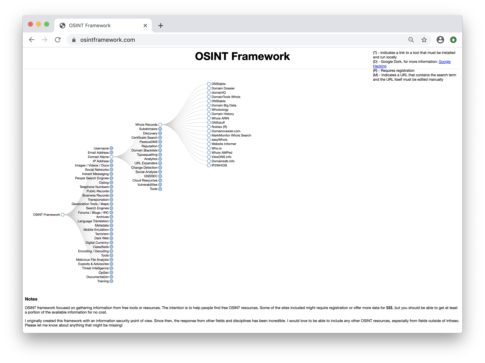

#### Legal Disclaimer

Explain that gathering information about a person or organization using the public domain is legal.

  - Since OSINT involves gathering publicly available information, it is entirely legal.

  - Emphasize that attempting to gain access to systems that do not belong to you or you do not have permission to access is *illegal*, and a potential felony.

   - For example, performing any of the following acts without the specific, written permission of the system's owner would be considered a felony:
      - Port scans
      - Brute force attacks
      - Social engineering

#### OSINT Demo 

NOTE: For this demo, please use your local personal machines and not the Azure lab environment. Minimize any RDP sessions if you have them up.

Explain to students that we will be using our local machines for this demo due to certain domain limitations of one of the tools that we'll look, Domain Dossier.

For this demonstration, we will use the fictional company MegaCorp One. 

- MegaCorp One is a fictional company created by Offensive Security. It was designed as a training tool to be used in the [Penetration Testing with Kali Linux (PTK)](https://www.offensive-security.com/pwk-oscp/) training.

- Send students the following link: osintframework.com.

Begin by launching the webpage osintframework.com. We'll use this for part of our demo.

1. Demonstrate the website's interface by clicking on several circles, revealing the multifaceted branches of open source intelligence. 

2. After exploring the website, navigate to Domain Name > Whois Records > Domain Dossier.

   - Click on **Domain Dossier**. This will bring you to an external site called centralops.net.

4. Enter megacorpone.com in the search box, check every box under the search bar **except** for **Service Scan**, and click **Go**.
   - Explain to students that without written consent, performing service scans is inadvisable for legal reasons. 

   - Look through the various records and note how they may be useful to attackers:

     - For example, employee names, number, email, and phone information could be used in a social engineering attack.

   - Scroll down to the DNS records. Review the different subdomains that belong to MegaCorp One. 

     - Explain that this shows us different targets we could try to attack. For example, maybe their webserver is fully patched, but maybe their mail server contains vulnerabilities. 

5. Explain that at this point, an attacker could perform a guessing attack or potentially use social engineering to persuade an employee to reveal their login credentials.

   - Point out that, if we look at the bottom of the webpage, we see the web app name and year.

   - Explain that this provides attackers with hints about which vulnerabilities can possibly be exploited.

6. Explain that we can also use Google for OSINT. 

   - Using Google for OSINT purposes is called **Google hacking** and **Google dorking**.

   Send students the following [Google Cheat Sheet](https://www.sans.org/security-resources/GoogleCheatSheet.pdf).

   - Explain that this sheet shows various operators that can narrow the parameters of a Google search. They will use these in the next activity.

Explain that students will have a chance to perform basic OSINT recon in their next activity. 

----

### 05. Student Do: DNS and Domain Discovery (0:15)

Explain the following to students: 

- In this activity, you will play the role of a junior penetration tester interviewing at SecureWay, a prominent security testing organization. 

- Before you are hired, you need to demonstrate that you can perform basic reconnaissance tasks. 

- You are tasked with  performing a basic DNS enumeration by viewing WHOIS record information.

- You are allowed to search any website of your choice. 

Send students the following files:

- [Activity File: DNS and Domain Discovery](activities/05_DNS_Domain_Discovery/Unsolved/README.md)

Monitor students' progress and answer any questions they may have. 

### 06. Instructor Review: DNS and Domain Discovery Activity (0:10)

Explain the following:

- Remind students that the goal of this activity was to use OSINT tools as a resource for information gathering.

Completing this activity required the following steps: 

- Use centralops.net and the Domain Dossier to view the DNS records of an organization's website.
- Observe the network WHOIS record information of the organization.
- Check the NetRange and CIDR records and explain their value for pentesters and attackers. 
- Check the DNS records and explain their value for pentesters and attackers. 

Send students the following solution guide and use it to review the activity:

- [Solution Guide: DNS and Domain Discovery](activities/05_DNS_Domain_Discovery/Solved/README.md)

Ask if students have any questions before continuing. 

### 07. Break (0:10)

### 08. Instructor Do: Google Dorking, Shodan, and Certificate Transparency (0:15)

Explain that we've learned the role of DNS domain discovery in helping adversaries plan their attacks.

  - Point out that now we'll explore some other TTPs used by attackers that will help us make informed decisions when safeguarding networks.

Explain that Google hacking, also known as Google dorking, is a technique that uses Google for OSINT and to discover security holes in a website's code.

Provide the following resources to the students:
- [Cybrary: Google Dorking Commands](https://www.cybrary.it/blog/0p3n/advanced-google-dorking-commands/) 
- [SANS.org: Google Cheat Sheet](https://www.sans.org/security-resources/GoogleCheatSheet.pdf)
- [My Hacking World: Google Dorking Tutorial](https://myhackingworld.com/google-hacking-and-google-dorking-basics/)

In this demonstration, we'll use Google to find information on MegaCorp One that could be useful to an attacker.

### Google Dorking Demonstration

Explain that we'll use a combination of Google search techniques to target MegaCorp One and gather information such as: 

- Employee email addresses
- Employees' first and last names
- Domain information
  

The goal is to find data that can be used to attack MegaCorp One.

**Important:** Explain to the class that Google Dorking can enable a user to find webpages that are supposed to be hidden and unavailable. Accessing sensitive information in this manner can be illegal.

#### Google Dorking Demonstration

1. Explain that we'll continue to use the fictional website megacorpone.com.

2. In a browser, navigate to Google.com.

2. Search: **site:megacorpone.com**

   - Explain that this is a very basic subdomain enumeration task that yields a variety of MegaCorp One's subdomains.

   - Point out that that the file system shows up in the search results and we can see all the assets of the site.

      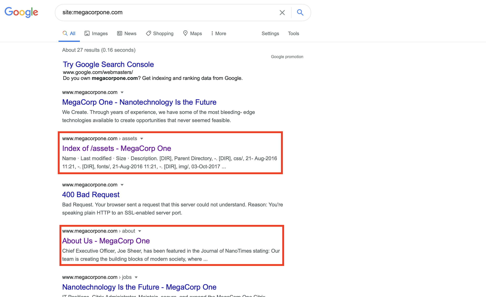

   -  Point out that this gives an attacker a deeper understanding of the site's file structure.

### Shodan

Another useful OSINT tool is **Shodan**, a search engine that searches specifically for computers and machines connected to the internet. It scans the entire web and reports back all of its findings in the browser window. 

#### Shodan Demo 

In the following demonstration, we'll use Shodan to acquire IP addresses. 

1. Go to to osintframework.com. 

   - Navigate to Domain Name > Whois Records > Domain Dossier

2.  Enter the domain example.com, and check all the search boxes. Click **Go**.

    - The search returns the IP address `93.184.216.34`.

       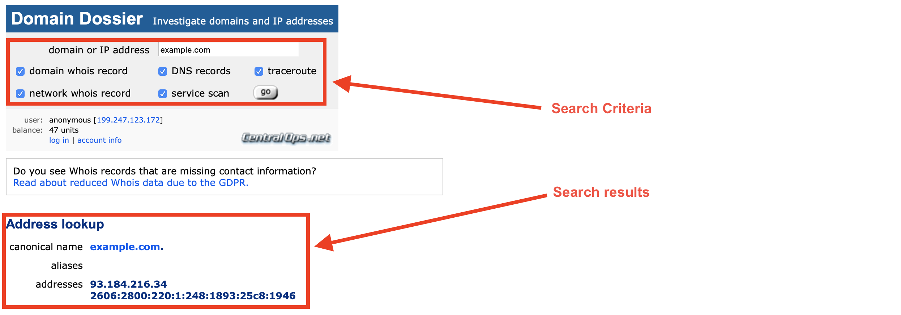

  - We also receive domain information that can be used by an attacker to perform attacks like DNS cache poisoning and DNS redirect attacks.

     - In this example, the organization is using the **DNSSEC**, a set of protocols that use public keys and digital signatures to verify data throughout the DNS lookup and exchange process. 

     - It adds an extra layer of security during DNS transport. 

     - Students can learn more at [ICANN: DNSSEC – What Is It and Why Is It Important?](https://www.icann.org/resources/pages/dnssec-what-is-it-why-important-2019-03-05-en) 

     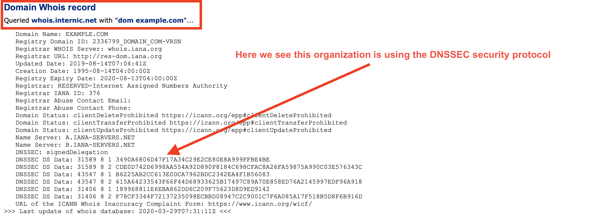

  - Underneath the Network Whois record, we are presented with such information as:

      - Contact name: Derek Sawyer
      - Mailing address: 13031 W Jefferson Blvd #900, Los Angeles, CA 90094
      - Phone number: +18773343236
      
      This information can be used in a social engineering campaign.

    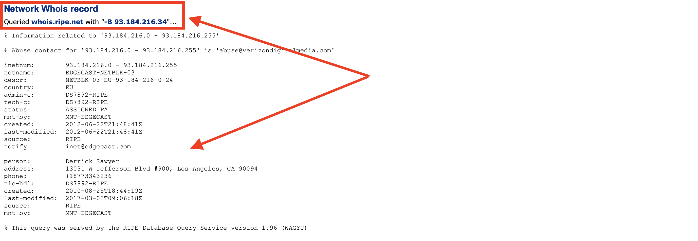

   - Access to DNS record information provides adversaries with alternative methods of attack, such as:

      - **Domain hijacking**: Alters registrar information in order to redirect traffic away from your DNS server and domain towards another destination.
    
      - **DNS flooding**: Overwhelms a server with malicious requests so that it cannot continue servicing legitimate DNS requests.
    
      - **Distributed reflection denial of service (DRDoS)**: Sends requests from its own servers with a spoofed source address of the targeted victim, causing all replies to flood the target.
    
     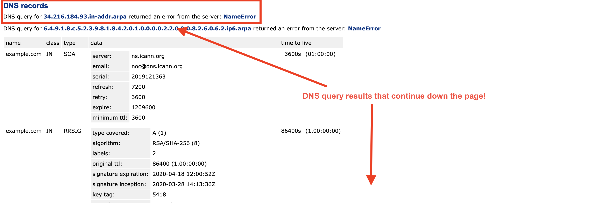

3. Now we'll use Shodan to see if there is any useful attack information for the acquired IP address.

   - Open a web browser and navigate to shodan.io.

   - Enter the IP `93.184.216.34` into the search box.

   - Shodan returns some critical information, such as port information, services running, and web technologies that can be used to attack the organization. 

   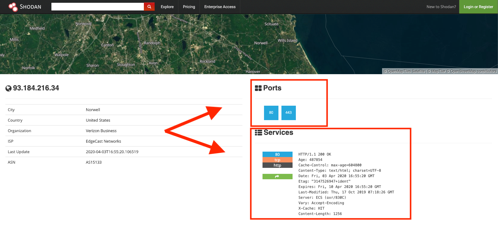

Emphasize the effectiveness of combining OSINT tools such as osintframework.com and Shodan to get more robust results. 

#### Certificate Transparency 

Explain that certificate issuers publish logs of the SSL/TLS certificates that they issue to organizations.

- This **certificate transparency** can be exploited by attackers and used to search for subdomains. 

Open a web browser and navigate to the certificate searching tool at https://crt.sh. 

- Enter example.com into the search box.

- Contained within our search results are all the certificates associated with every variation of the example.com domain.

  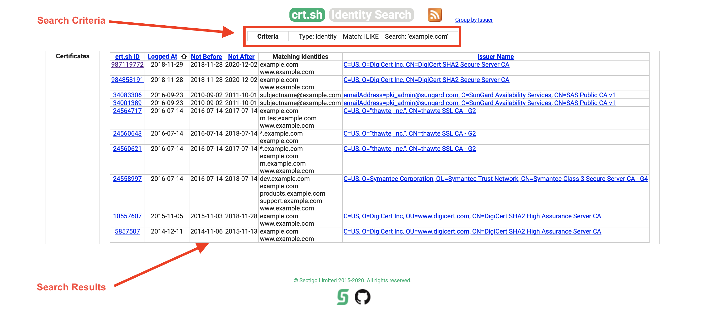

- If we click on the first certificate result, it reveals highly detailed information regarding the digital certificate (as seen below).

  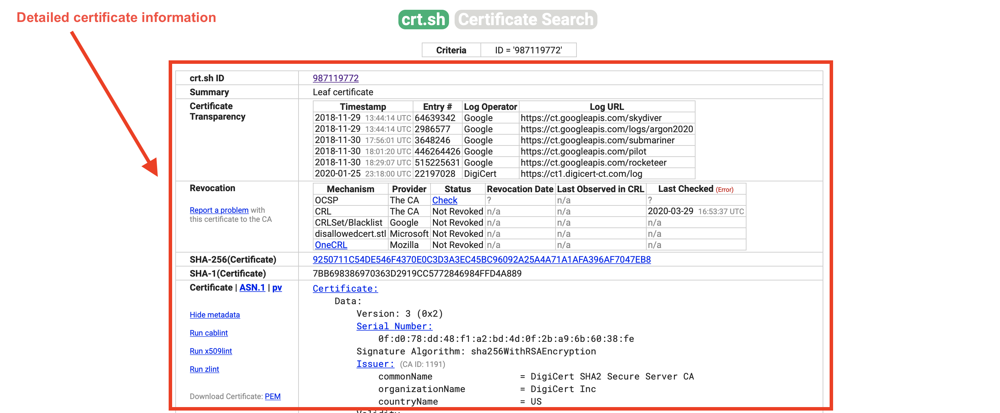

An attacker can use this information to perform domain hijacking, DNS flooding, and DRDoS.
     
Pause to answer any questions before proceeding.

____

### 09. Student Do: OSINT Recon (0:25)

Explain the following to students: 

- After your impressive interview with SecureWay, you were hired as a junior pentester!

- SecureWay was hired by MegaCorp One to evaluate the security of their business.

- As a junior pentester, you will perform initial information gathering recon of their network using Google dorking, Shodan, and certificate transparency techniques. 

Send students the following files:

- [Activity File: OSINT Recon](activities/09_OSINT/Unsolved/README.md)

**Reminder:** OSINT is legal, but brute forcing and performing active scans is not. Do not attempt to log into or scan any websites during OSINT activities.

____

### 10. Instructor Review: OSINT Recon (0:10)

Remind students that the goal of this activity was to learn and understand how OSINT tools can be used against an organization in an attack.

Completing this activity required the following steps: 

- Using Google dorking to find information regarding employees, email addresses, other associated domains.

- Using Shodan to gather OSINT intelligence regarding a target's domains.

- Using certificate transparency to expose an organization's domain information.

Send students the following solution guide and use it to review the activity:

- [Solution Guide: OSINT Recon](activities/09_OSINT/Solved/README.md)

____

### 11.Instructor Do: Recon-ng (0:15)

Explain that we'll continue our Reconnaissance efforts with a tool called **Recon-ng**. 

- Recon-ng is a web reconnaissance framework written in Python.

- Recon-ng provides a powerful, open source, web-based reconnaissance framework that can be conducted thoroughly and quickly. It includes the following features:

  - Independent modules
  - Database interaction
  - Built-in convenience functions
  - Interactive help
  - Command completion 

Explain that there are many scripts and programs that can assist with integrating OSINT tools into Recon-ng.

  - Recon-ng is a framework that ingests a lot of popular OSINT modules, allowing the results of multiple tools to be combined into a single report.

  - Recon-ng also went through a major update recently. The following link details changes from version 4.x to 5.x and a set of new, handy commands that comes with the newer 5.x version. [Read about the changes.](https://www.blackhillsinfosec.com/wp-content/uploads/2019/11/recon-ng-5.x-cheat-sheet-Sheet1-1.pdf). 

#### Recon-ng Demonstration 

1. In Kali, start Recon-ng:

   - Run `recon-ng`

      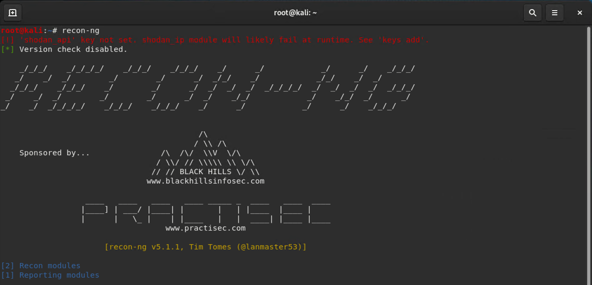

   - Recon-ng doesn’t come preinstalled with modules, so you must download them as needed.
   
      -  All the necessary modules are already installed in our VMs.
   
   - Point out we are getting the error `shodan_api key not set. shodan_ip module will likely fail at runtime. See keys add.` That's OK, we'll be adding this key during this activity. 
   
2. We need to set an API key for modules that require it before they can be used.

     We'll set an API key for Shodan inside Recon-ng. This allows Recon-ng to ingest Shodan results.

   - Log into Shodan, click on **My Account** in the top-right corner and copy the API key to your clipboard.

   - **Note:** If you skipped this step from the Instructor Notes, register for a free account now at  shodan.io. Once registered, click on **My Account** in the top-right corner and copy the API key to your clipboard.

      
   
   - Copy your API key.
   
      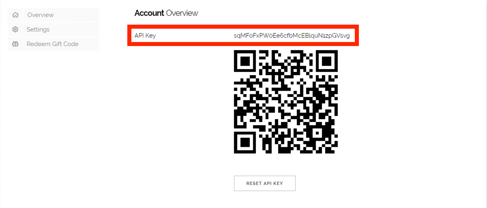
   
3. In Recon-ng, type `modules search` to view all of the currently installed modules.

   - For this activity, we'll use the following two modules:

     - `recon/domains-hosts/hackertarget`
     - `recon/hosts-ports/shodan_ip`

      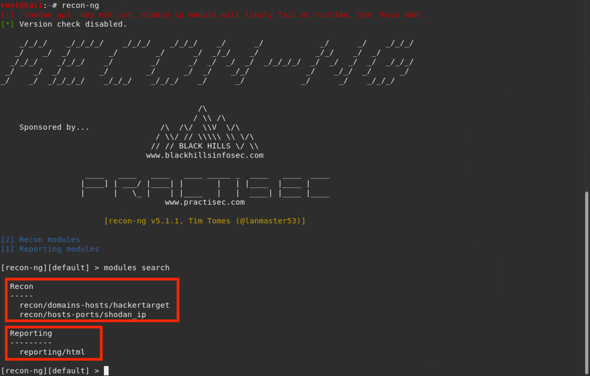

4. Type `modules load recon/hosts-ports/shodan_ip` to load the `shodan_ip` scanner module.

   - Emphasize that modules need to be loaded prior to modification and use.

   - Now that the module has been loaded, we can add the API key by typing:
   
      - `keys add shodan_api [key]`
      
         - Replace `[key]` with the one you copied to your clipboard earlier.

   - Explain that this API key allows information sharing between Shodan and Recon-ng. 

5. Type `keys list` to verify that it is imported.

6. Type `info` to get information regarding the Shodan module.

   - The `SOURCE` option is required. This option specifies which target Recon-ng will scan. This can be:

      - A list of IP addresses in a text file
      - Individual IPs
      - A domain name
   
   - For this example, we'll set the domain name `sans.org` as our `SOURCE` option.

      

   - Set the `SOURCE` to sans.org by typing `options set SOURCE sans.org`.

      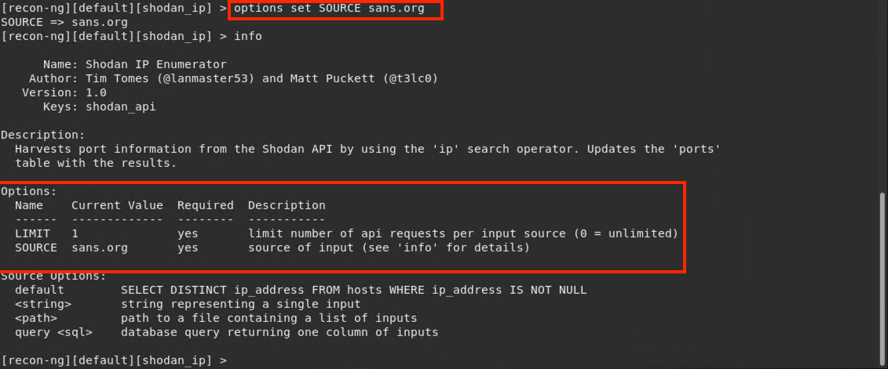
   
   - Explain that using Shodan with a pro account allows you to query open ports on your discovered hosts without having to send packets to target systems.

7. Explain that we're now going to use an additional module called **HackerTarget**. 

   - HackerTarget will use Shodan to query all of the hosts that belong to sans.org. 

      - **Note:** Although HackerTarget can find hosts by itself, combining modules produces better scan results by discovering additional hosts that would otherwise be missed.

   Next, we'll load the `recon/domains-hosts/hackertarget` module and change its `SOURCE` to that of the target.

   - Type `modules load recon/domains-hosts/hackertarget`.

   - This will load the `recon/domains-hosts/hackertarget` scanner module.
     
   - Now that the module is loaded, type `info` to check the `SOURCE` setting.
   
      
   
   - Set the `SOURCE` to sans.org by typing `options set SOURCE sans.org`.
   
   - The HackerTarget and Shodan modules serve two distinct purposes:

      - The HackerTarget module uses the `SOURCE` option to display scan results verbosely.

      - The Shodan module uses the `SOURCE` option to specify which target Recon-ng will scan. 
      
      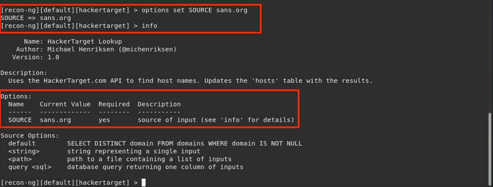

8. From within the `hackertarget` module, type `run`.

   Recon-ng will query Shodan for sans.org.

   - The results will automatically display verbosely in the terminal window.

      

9. Explain that we have the results, but we would like a file to include into our report. Let's go ahead and install a new module. 

Explain that we're going to search for the `reporting/html` module in the Recon-ng marketplace.

   - Run `back` then `marketplace search reporting/html`

     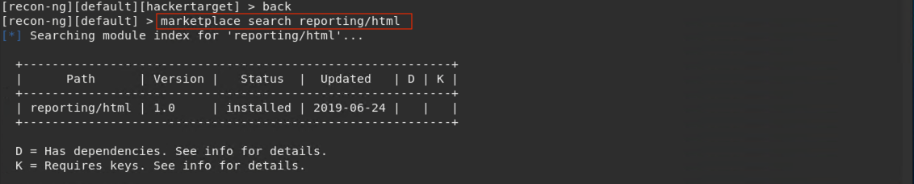

To install the `reporting/html` module, we'll use the command `marketplace install reporting/html`.

   - Run `marketplace install reporting/html`

     

10. Next, we'll load the `reporting/html` module, which allows the generation and output of reports.

   - Run `modules load reporting/html`

      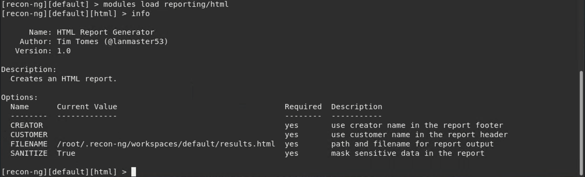

11. Type `info` to see what parameters need to be set.

    The `CREATOR` and `CUSTOMER` parameters need to be set.

     - Set the `CREATOR` and `CUSTOMER` parameters using the `options set` command:

         - `options set CREATOR attacker`
         - `options set CUSTOMER Darkweb` 

    - Type `info` again after setting the options to verify the configuration worked.
    
      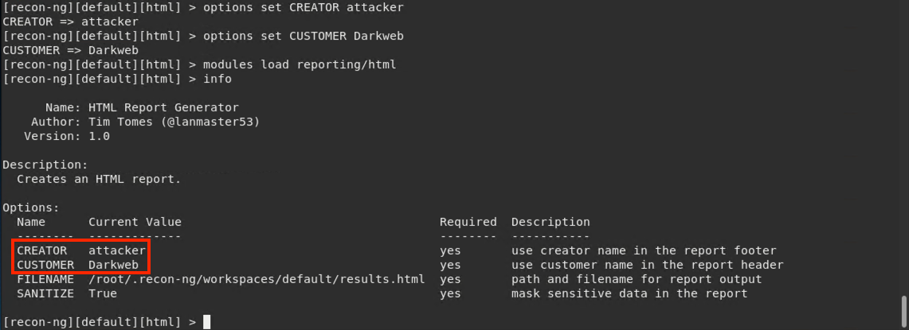

    - Type `run` and the results will be saved to `/root/.recon-ng/workspaces/default/results.html`.
    
      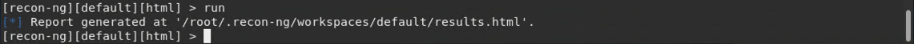

12. View the report. 

    Explain that there are a few ways to view the report, but the easiest is to run: `xdg-open /root/.recon-ng/workspaces/default/results.html`.
   
    - Explain that `xdg` is a tool used to open files in text editors or, in this case, a browser. 

     In the **Summary** window, we can see that Recon-ng returned a result with 91 hosts.
    
    - Expand the **Hosts** window down by clicking the **+** sign to see all host information.

      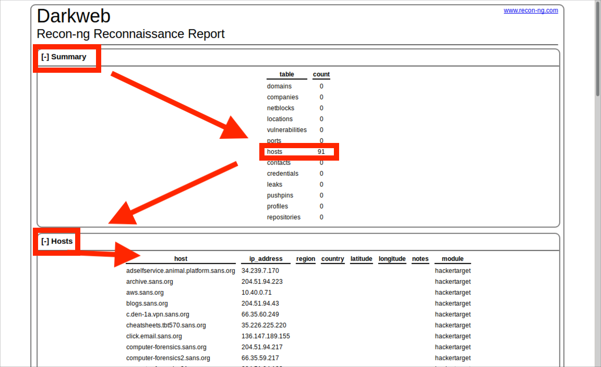
    
    - At the bottom of the results page, we see the `CREATOR` option shown with the date and time.

      

Summarize this lesson with the following key takeaways:

- Recon-ng is a tool written in Python used primarily for information gathering by ethical hackers, such as penetration testers.

- Recon-ng comes preloaded with numerous modules that use online search engines, plugins, and APIs, which work together to gather information against a target.

- Network defenders use information obtained from Recon-ng to formulate mitigation strategies that help defend their networks.

Pause to answer any questions before proceeding.

### 12. Student Do: Recon-ng (0:20)

Explain the following:

- In this activity, you will continue your work for SecureWay.

- You've been tasked with working with a client, rapid7.com, to discover if their domain server info is accessible with OSINT tools.

- You will use the Shodan API and Recon-ng to perform your tests, and then place all of your findings in a report.

Send students the following file:

- [Activity File: Recon-ng](activities/12_ReconNG/Unsolved/README.md)

____

### 13. Instructor Review: Recon-ng (0:10)

Remind students that the goal of this activity was to learn how to integrate OSINT technologies by importing the Shodan API into Recon-ng.

Completing this activity required the following:

- Import the Shodan API key into Recon-ng.
- Use `marketplace install` to install additional modules.
- Use `modules search` to search for installed modules.
- Use `modules load` to load and select user modules.
- Use the `keys list` command to verify if a module was loaded successfully.
- Use the `info` command to get more information regarding a specific module that's been loaded.
- Use the `options set` command to set the module's parameters.
- Use the `run` command to run a query.
- Create and generate a report of the findings.

Send students the following solution guide and use it to review the activity:

- [Solution Guide: Recon-ng](activities/12_ReconNG/Solved/README.md)

### 14. Instructor Do: Wrap-up (0:02)

Acknowledge that students may feel overwhelmed by the amount of information covered.

- Assure students that they will become familiar with these concepts throughout the rest of the course.

- Explain that these are the basics of penetration testing, which can be a difficult area of security to learn.

- Emphasize that, as with anything else, competence will come with practice and patience.

Lastly, encourage students to get into the habit of practicing these activities. This will help strengthen their abilities as network defenders, and make them valuable assets to any organization.

Take a moment to address any remaining questions before dismissal.
____

&copy; 2020 Trilogy Education Services, a 2U Inc Brand.   All Rights Reserved.

