## 16.2 Lesson Plan: Network Discovery and Vulnerability Scanning

### Overview

In today's class, students will learn how to perform network scans using various tools and techniques. They will also learn how to perform and interpret a vulnerability scan and report.

### Class Objectives

By the end of class, students will be able to:

- Perform network enumeration using Nmap.
- Properly use Nmap options. 
- Explain what the Nmap Scripting Engine (NSE) is and how it's used.

### Lab Environment

Lab Details

 

In this unit, you will be using the Pentesting lab environment located in Windows Azure Lab Services. RDP into the **Windows RDP host machine** using the following credentials:

  - Username: `azadmin`
  - Password: `p4ssw0rd*`

Open Hyper-V Manager to access the nested machines:

**Kali machine:**
  - Username: `root`
  - Password: `toor`

**Metasploitable machine:**
  - Username: `msfadmin`
  - Password: `msfadmin`

**ShellShock credentials:**
  - Username: `vagrant`
  - Password: `vagrant`

**Heartbleed credentials**:
  - Username: `vagrant`
  - Password: `vagrant`

**DVWA10 credentials**:
  - Username: `IEuser`
  - Password: `Passw0rd!`

In today's class, we will use the Kali machine and the Metasploitable machine

**Note:** Since the IP addresses are dynamic, the IP addresses used in the demos and activities should be treated as examples. The actual IP addresses will need to be determined before starting the exercises.

  

### Instructor Notes

- Today, students will be introduced to Nmap, various scans, how to use basic NSE scripts, and how to perform vulnerability scans using Nessus.

- Before we explore automated frameworks such as Metasploit in depth, it's important for students to understand how to perform their functions manually.

- Although port and vulnerability scanning is relatively straightforward, some students may have difficulty understanding how to use SearchSploit and scripts when exploiting a target.

### Slideshow and Timetracker

The lesson slides are available on Google Drive here: [16.2 Slides](https://docs.google.com/presentation/d/1NxJmYzXTOXFWvSZ3yXwhsq-X49zYBQj3qWotXAotz9I)

- To add slides to the student-facing repository, download the slides as a PDF by navigating to File > "Download as" and choose "PDF document." Then, add the PDF file to your class repository along with other necessary files.

- Note: Editing access is not available for this document. If you or your students wish to modify the slides, please create a copy by navigating to File > "Make a copy...".

The time tracker is available on Google Drive here: [16.2 Time Tracker](https://docs.google.com/spreadsheets/d/1Msba7abrH4tQggI9aK6I_VEDVEgtDntpEQHNbUsceNc/edit#gid=1145703143)

### Student Guide

Be sure to send class the student facing version of the lesson plan: [Student Guide](studentguide.md)

---

### 01. Instructor Do: Introduction to Port Scanning (0:15)

Welcome students back to class and explain that today we will continue learning about penetration testing. 

- Remind students of the five phases of engagement: 

1. Planning and Reconnaissance
2. Scanning
3. Exploitation
4. Post Exploitation
5. Reporting

Remind students that in the last class we covered various Planning and Reconnaissance techniques. 

Point out that in today's class we will work on the Scanning portion of a pentest. We will use manual tools to scan networks and enumerate valuable information.

Network discovery and vulnerability scanning are essential in the early stages of an engagement. With the proper tools, we can complete the following tasks:

- **Network mapping:** Using host discovery, we can identify network devices like servers, switches, and routers, and how how they're physically interconnected.

- **Service discovery:** Allows us to identify which services are running on which hosts, such as DNS, mail, or web servers.

- **OS detection:** Also known as OS fingerprinting, lets us detect which operating system is running on a networked device, such as OS name, vendor, software versions, and estimated device uptime.

- **Security auditing:** The discovery process of finding OS versions and apps running on hosts to determine the depth of vulnerabilities. 

   - Depending on the results of an audit, security admins can take the necessary steps to apply software patches and update relevant hosts. These tasks can also be automated using scripts.

Ask the class: How might an attacker benefit from knowing what version of service is running on a host?

- An attacker can research all documented vulnerabilities for the specific application services and versions running on a host or server.   

Today we'll be looking at Nmap, a very useful tool that lets us complete all of the tasks mentioned above. 

#### What is Nmap?

Explain that **Nmap**, short for Network Mapper, is a free, open-source tool used for network discovery and vulnerability scanning. 

- Nmap is useful for identifying devices running on a network, discovering hosts, services, open ports, and IP addresses, and detecting security risks.

Explain that the most common Nmap functions include:

   - Ping scans
   - Port scans
   - Host scans
   - OS fingerprinting
   - Top port scans
   - Outputting scan results to files

In later lessons, we'll learn how Nmap is used with the Metasploit framework, allowing users to probe and repair network vulnerabilities. 

#### Network Discovery and Port Scanning for Vulnerabilities

Explain that Nmap transmits data through scans and listens to responses that return information about the network profile and topology. 

- For example, Nmap can scan a port to determine if it is open, closed, or filtered. 

- Security professionals often refer to port scanning as port discovery or port enumeration.

Point out that Nmap’s protocols use various types of packet structures such as, TCP, UDP, and ICMP, which all work together to enumerate networks.

Explain that Nmap has many scan types and options. Some optimize performance, some optimize stealth, and others optimize accuracy.

- We'll explore these differences in the next demo.

#### Is Nmap Legal?

Emphasize that "Is Nmap legal?" is a legitimate and very important question to ask yourself before you use it to scan a network.

- Nmap's legality depends on how it's used. 

   - Nmap is designed to help network defenders protect their networks from criminal hackers by identifying security vulnerabilities in the system. 

   - But malicious hackers can use Nmap for the same aim as security analysts: to probe networks for vulnerabilities.

While legislation is complicated and varies by region, using Nmap to scan external networks without permission can lead to being banned by your ISP and felony charges.

Emphasize that you should always get written permission from the system owner before engaging in any form of network scan. 

#### Nmap

In this demonstration, we'll cover some of the most popular and useful scan types offered by Nmap.

The lab environment will consist of two VMs: 

- Kali Linux VM
- Metasploitable 2 VM

**Note:** The IPs used throughout the lesson plan are examples. We will discover the actual IP addresses before beginning the exercises.

Start by generating a list of Nmap's most commonly used commands and options:

  - Run `nmap`

Of this list of commonly used command options, we will cover OS detection, TCP full-connect scan, TCP SYN half-connect scan, and service and version detection scan.

   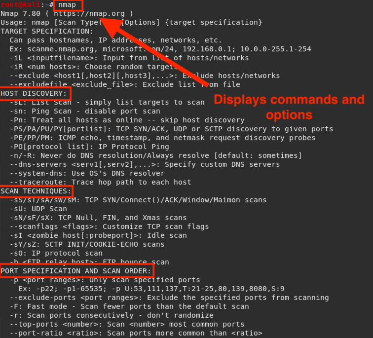

#### OS Detection

The first scan we'll cover is OS detection.

- During the reconnaissance phase of a penetration test, we won't know what machines are available on the network. Therefore, we'll need to identify the machines on the network and then choose a target. 

Explain that first we need to discover our IP address and subnet.
   - Run `ifconfig`

Once your know the IP, run the following command to perform an OS detection scan:  

   - `nmap -v -Pn -O 192.168.0.0/24`
  
      - `-v`: Increases verbosity level (use `-vv` or more for greater effect).
      - `-Pn`: (no ping) Skips the Nmap discovery phase, allowing for a faster scan.
      - `-O`: Enables OS detection.
      - `192.168.0.0/24`: The range of IPs on the network we will scan.

This scan performs remote OS detection using TCP/IP stack fingerprinting.

   - Nmap sends a series of TCP and UDP packets to the remote host, then examines almost every bit of data in the responses.

   - It then compares the results to its database of over 2,600 known OS fingerprints. If there is a match, it prints the details of the OS.

#### TCP Full-Connect Scan

Next, we'll perform a TCP full-connect scan.  

- This scan type uses the three-way handshake to perform port enumeration (this is why it's called "full-connect").

Perform the scan by running the following command: 

- `nmap -sT 192.168.0.10`
  
   - `-sT`: Specifies to perform a TCP full-connect scan.

   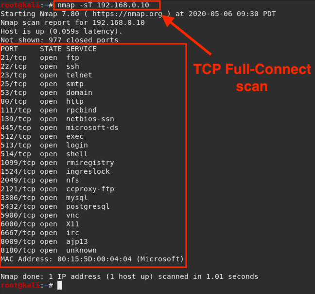

Explain that TCP full-connect scans are aggressive and noisy and will, in most cases, generate alarms on the targeted network that alert the target to your presence.

- Therefore, most malicious actors will not choose this type of scan.
  
- Attackers prefer to use the SYN half-connect scan, which we'll cover next. 

- Full-connect scans can take longer than a SYN scan but return more reliable information.

#### TCP SYN Half-Connect Scan

Unlike TCP full-connect scans, TCP SYN half-connect scans do not complete the three-way handshake.

- This scan sends a SYN packet to a server, waits for a response, but never responds back to the server and does not fully complete the connection (this is why it's called "half-connect").

- SYN scans are relatively unobtrusive and stealthy since they never complete TCP connections. Therefore, they are the preferred scan method of attackers.

   - A fast network can scan thousands of ports per second and is not slowed by intrusive firewalls. 

Run a TCP SYN scan by running the following command, and emphasizing that it needs `sudo` privileges. 

- `sudo nmap -sS 192.168.0.10`
  
   - `-sS`: Specifies to perform a TCP half-connect scan.
   
#### Service and Version Detection Scan

Service and version detection scans enable version detection and are commonly used to discover outdated or unauthorized applications and services.

Perform the scan by running the following: 

 - `nmap -sV 192.168.0.10`

   - `-sV`: Probes open ports to determine service and version info.

   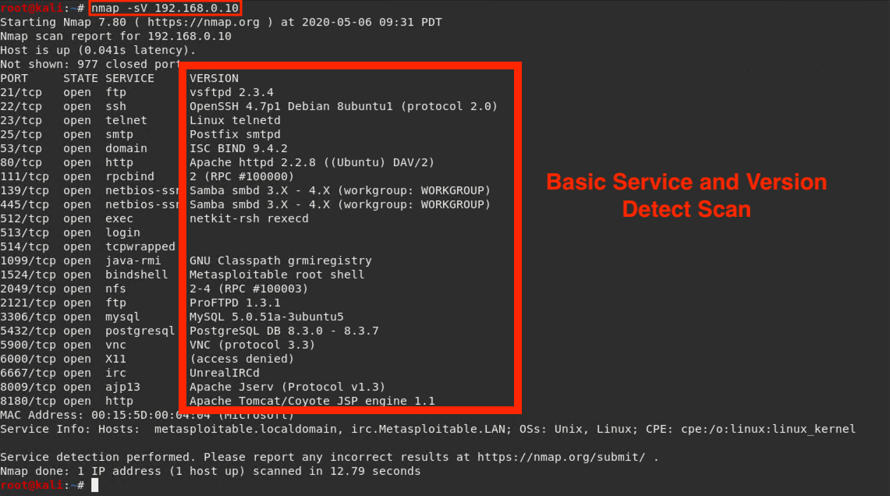
   
      - Point out that port `5900` (VNC service) is a remote desktop connection protocol that, if exploited by an attacker, would provide them remote control of a host.

   We  can add the `-sC` and `-p` options to generate specific port enumeration information.

For example, run the following command to scan port `3306` for the MySQL service:

- `nmap -sV -sC -p 3306 192.168.0.10`

   - `-sC`: Runs default scripted scan (returns more results).
   - `-p`: Specifies which port or ports to scan.

   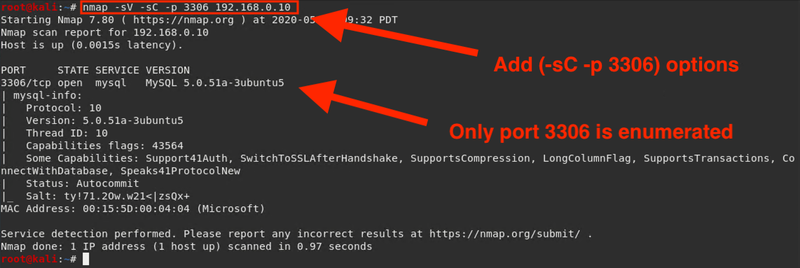 

Let's scan port `6667` for the IRC service.

- Point out that IRC (Internet Relay Chat), a favorite among criminal hackers, is used as a backdoor communication channel for botnets and Trojan downloaders.

   - Run `nmap -sV -sC -p 6667 192.168.0.10`

   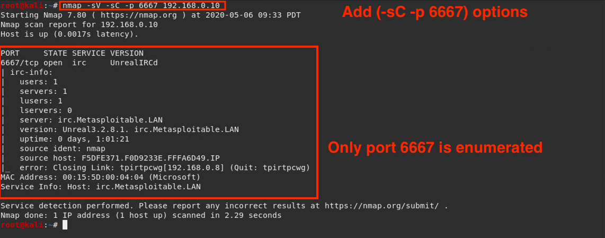

#### Output to a File

Pentesters typically save their scan results and include them in their deliverables as part of a security assessment or penetration test.

We'll save our scan results to a file using the `-oN` option.

Run the following command: 

- `nmap -sV -sC -oN version.txt 192.168.0.10`

   - `-oN`: Outputs the results to a text file.
   - `version.txt`: File name (of your choice) and directory (if specified) where you want to save the file.

   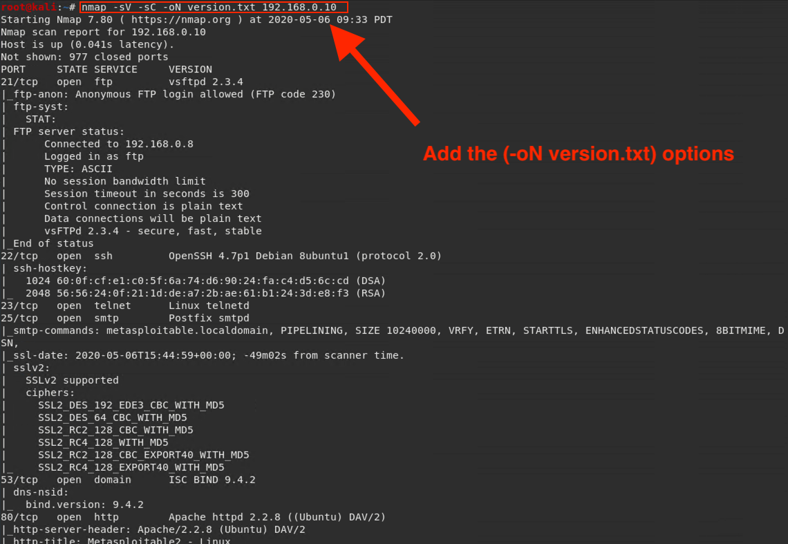

   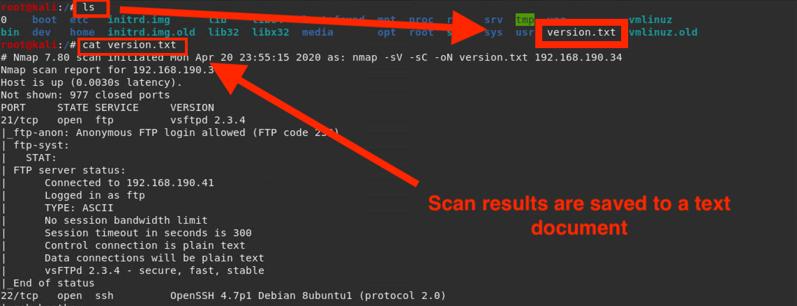

Pause to ask any questions before proceeding.

____

### 02. Student Do: Port Scanning with Nmap (0:20)

Explain the following:

- In this activity, you will play the role of an independent penetration tester hired to use Nmap to simulate malicious port scans of a host.

- Nmap offers many different scanning options. Experiment with them and think about how each one applies to your pentest and the client.

- Keep in mind that each scan type has a unique purpose. Choosing the right one can save a lot of time and effort.

Send students the following files:

- [Activity File: Port Scanning with Nmap](activities/01_Nmap/Unsolved/README.md)

### 03. Instructor Review: Port Scanning with Nmap Activity (0:15)

In this activity, students used Nmap in an investigative capacity. 

- Point out that Nmap comes with a number of features designed for probing computer networks, including host discovery, and service, version, and operating system detection.

- Explain that these features can be expanded by scripts that provide more advanced vulnerability detection and service detection.

- Explain that Nmap is adaptable to various network conditions, including latency and congestion during a scan.

Point out that the main tasks we needed to complete were:

- Use `nmap -sT` to perform a TCP full-connect scan.
- Use `nmap -sV` to perform a service and version detection scan.
- Investigate VSFTPD v2.3.4 for potential vulnerabilities.

Send students the following solution guide and use it to review the activity:

- [Solution Guide: Port Scanning with Nmap](activities/01_Nmap/Solved/README.md)

### 04. Instructor Do: NSE Scripting (0:25)

Explain that the Nmap Scripting Engine (NSE) allows users to write and share scripts that automate a variety of networking tasks.

- Nmap comes with a preinstalled collection of NSE scripts that allow users to modify and create custom scripts to meet their individual needs.

- There are over 600 scripts available in NSE. With these, you can perform almost any infosec research task.

For example, we can use NSE scripting for any of the following tasks:
   - DNS enumeration
   - Brute force attack
   - OS fingerprinting
   - Banner grabbing
   - Vulnerability detection
   - Vulnerability exploitation
   - Backdoor identification
   - Malware discovery

#### NSE in Action

While NSE scripts can serve multiple functions, most exist to gather information on a target. 
- An effective way to gather this information is to perform vulnerability scans. 

- Vulnerability scanners compare scanned versions of software with known vulnerabilities using Common Vulnerabilities and Exposure numbers (CVEs).

- There are a variety of vulnerability scanners available. We'll focus on one of the more popular ones, Nessus, in a later activity.

Explain that `.nse` scripts are stored in the `/usr/share/nmap/scripts` directory.

Display all of the currently installed NSE scripts by running the following command:

   - `ls /usr/share/nmap/scripts`

   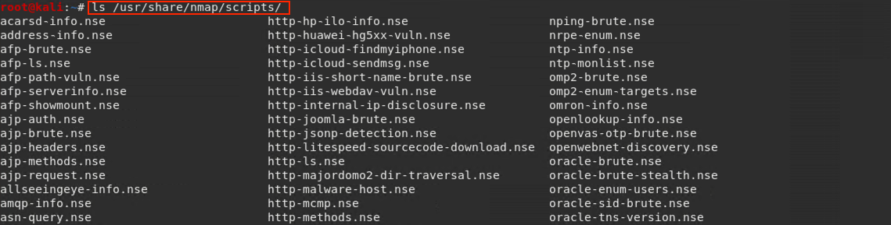

Explain that while we can run scans directly on the command line, we can use Nmap with a free open-source GUI option called **Zenmap**.

- Zenmap works with Nmap to make it more user-friendly.

For example, Zenmap displays Nmap output in a convenient GUI display. It can also:
- Customize display options.
- Provide summaries about a single host or a network scan.
- Generate topology maps of discovered networks.

Zenmap's benefits also include the following:  

- Comparison: Zenmap can compare changes between system scans run at different times and differences between hosts.  

   - It can also compare different scans of the same host using different options.

   - Comparison allows security administrators to easily track when a new host or a new service appears on the network, or when an existing host goes down.

- Convenience and discoverability: While Nmap's hundreds of options can be overwhelming for beginners, Zenmap's simple interface helps beginners learn and understand how to perform Nmap scans.
  
- Repeatability: Zenmap has command profiles that make it easy to run scans more than once. You can also use preinstalled shell scripts to perform common tasks.

#### Zenmap Demo

In this demo we will find a specific NSE script on Zenmap. We will then scan our Metasploitable VM to see if it is vulnerable to the specific vulnerability in the script.

- Enable Zenmap by running the following: 

   - `sudo zenmap`

- In the profile dropdown box, select **Regular Scan**.

   - Navigate to **Profile** > **Edit Selected Profile**.

   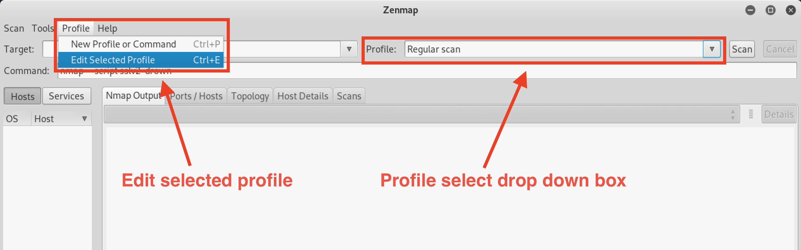  

- The **Edit Profile** window will open.

   - Scroll down the list of NSE scripts and check the box next to **ftp-vsftpd-backdoor**.

   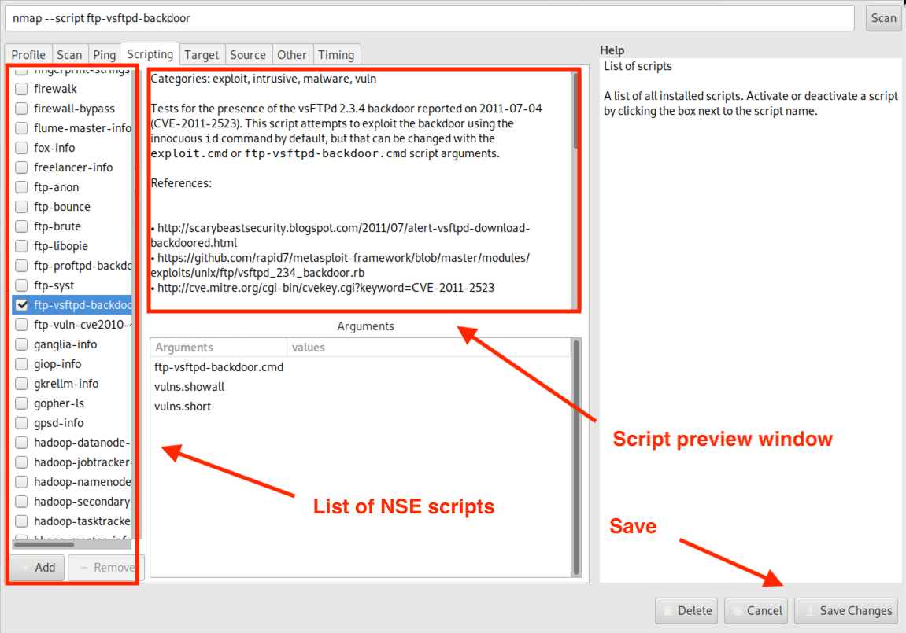

  - Click **Save Changes**.

- In the target box, enter the IP address of the Metasploitable VM and click **Scan**.

   - Once the scan is complete, the results will display in the window as shown below.

   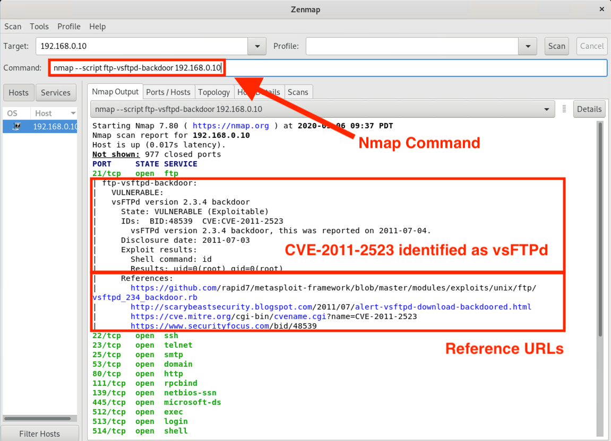

Pause to answer questions before proceeding.

____

### 05. Student Do: NSE Scripting (0:20)

Explain the following to students:

- In this activity, you will continue your role as an independent penetration tester. 

- You will use the Nmap Scripting Engine and Zenmap to acquire intelligence about a target. 

- Keep in mind that the tactics you choose to use for vulnerability scanning may be observed by a client or team member on the job, or during an examination. 

- Therefore, it's important to be able to explain what is taking place in simple terms, as well as the expected outcomes for the specific tests you choose.

Send students the following file:

- [Activity File: NSE Scripting](activities/02_NSE_Scripts/Unsolved/README.md)

### 06. Break (0:15)

### 07. Instructor Review: NSE Scripting Activity (0:15)

This activity had students practice network scanning using Nmap Scripting Engine and its associated tools.

- Recap that NSE (Nmap Scripting Engine), is a digital library of Nmap scripts that enhances Nmap's reporting features and displays the results in a traditional Nmap output.

- Explain that NSE's versatility allows experienced penetration testers to write and share custom scripts that automate a variety of networking tasks.

Completing this activity required the following steps:

- Use the `zenmap` command to launch the Zenmap GUI user interface.

- Edit the Quick Scan profile and load the  `ftp-vsftpd-backdoor` script for use.

- Analyze and interpret scan results from the `ftp-vsftpd-backdoor` script.

- Experiment with various other scan options.

Send students the following solution guide and use it to guide your review:

- [Solution Guide: NSE Scripting](activities/02_NSE_Scripts/Solved/README.md)

### 08. Instructor Do: Vulnerability Scanning (0:20)

Remind students that NSE allows users to modify and create custom Nmap scripts for their individual needs.

- With NSE, we can perform DNS enumeration, OS fingerprinting, vulnerability detection, malware discovery and many other tasks. 

Emphasize that although NSE has its advantages, it also has disadvantages when compared to vulnerability scanners:

   - NSE is not fully comprehensive, meaning many vulnerabilities are not covered.
   - NSE cannot perform a large number of scans simultaneously.
   - NSE is most efficient when performing single host scans.
   - NSE is most useful when doing basic information gathering or enumeration activities.

Point out that vulnerability scanners can help make up for many of the limitations of NSE.

Explain that vulnerability testing often gets confused with penetration testing. While similar, they have distinct differences:

- Vulnerability scanning identifies systems that have known vulnerabilities.

   - Scans use a database of known vulnerabilities.
   - Vulnerabilities are rated based on the severity level.
   - Vulnerabilities are given a Common Vulnerability Scoring System (CVSS) score.  
   
- Penetration testing attempts to identify weaknesses that can be exploited, such as:

   - Specific system configurations
   - Organizational processes and practices

#### Vulnerability Scanning and Nessus

Explain that a vulnerability scanner, such as Nessus, is an application that identifies vulnerabilities and creates inventory of all interconnected systems. These include the following:

   - Servers
   - Desktops
   - Laptops
   - Virtual machines
   - Containers
   - Firewalls
   - Switches
   - Printers

Explain that most vulnerability scanners attempt to log into systems using default passwords or other credentials in order to establish a more detailed picture of the network infrastructure.

Explain that after establishing an inventory list, the vulnerability scanner checks each item in its inventory against one or more databases of known vulnerabilities to see which items are associated with specific threats.

#### Nessus Vulnerability Scanning Demonstration

Explain that **Nessus** is one of many vulnerability scanners available today. It is used to perform  vulnerability assessments and penetration tests, in addition to malicious attacks.

- Other popular vulnerability scanners are:

   - **OpenVAS**: A fully featured, freely available open source vulnerability scanner sharing many of the same capabilities as Nessus. It comes preinstalled with Kali Linux.
   
   - **Nexpose**: A vulnerability scanner developed by Rapid7 that comes fully integrated with Metasploit. It's sold as a stand-alone software package that can also be used as a managed service or private cloud deployment.

The **National Vulnerability Database** (NVD) is a source of exploit information that grades each vulnerability based on its severity level.

- For example, if you google NIST CVE-2016-0800, you will find the nvd.nist.gov webpage, which provides details, references, and a score of 5.9.

- Severity levels are scored using the Common Vulnerability Scoring System (CVSS v3.0).

Numerical scores are translated into qualitative categories (low, medium, high, and critical), to help security administrators properly assess and prioritize vulnerabilities.      

Explain that this lesson will use Nessus to demonstrate how to perform scans and interpret the results.

**Note:** Encourage everyone to follow along as you perform each step of this demonstration.

1. First, we'll start Nessus via the command line:
  
   - Run `/etc/init.d/nessusd start`

2. Launch the Firefox browser and navigate to https://kali:8834.

   - Since this is not a real website, Firefox will inform us that our connection is insecure. 
     - Click **Advanced**.
     - Click **Add Exception**.
     - Click **Confirm Security Exception**.

   - Log in with the following credentials: `root:toor`.

      

**Instructors note:** When logging in for the first time, it can take up to two minutes while the Nessus Scanner is compiling plugins. 

3. After the program launches, we're presented with the Scan page.

   Explain that the Nessus user interface is made up of two main parts:

      - The Scan page, where we can set up scans.

      - The Settings page, where we can manage application configuration settings.
   
      While on the Scan page, click **New Scan**. 

      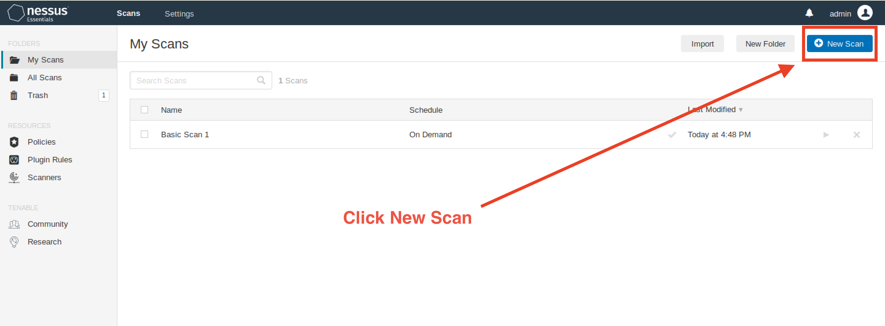

4. Next, we're presented with the **Scan Templates** window featuring a variety of preconfigured scan templates, some of which require payment to access.

   - For our purposes, we'll select **Basic Network Scan**, which performs a full-system scan of specified hosts or range of hosts, with a limit of 16 IPs.
   
   - Click **Basic Network Scan**.

      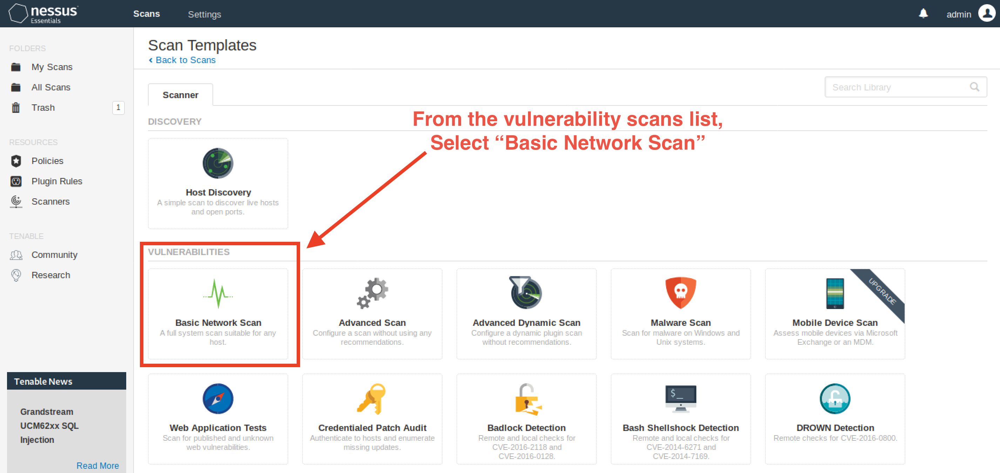

5. In the Basic Network Scan window, enter the following information:

   - Name: Host Scan #1
   - Targets: IP of Metasploitable VM

   - Click **Save**.

      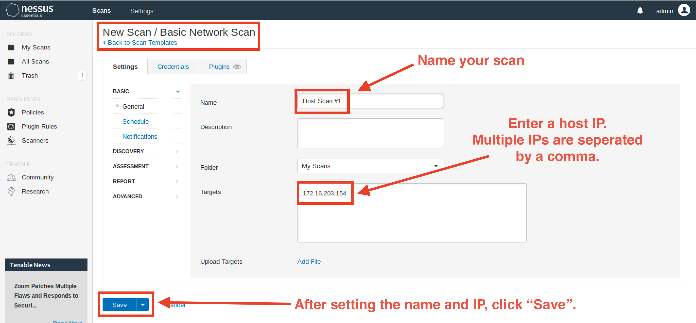

6. You'll be redirected back to the Scan page. Explain that for the sake of time, we will not be running the scan today, but we do have two reports for us to look at. 
   
   - In the **My Scans** window, click the **Play** button to start the scan.
   
      - Point out that the list of scans can grow over time.
      - Ensure that you select the appropriate scan for your purposes.

     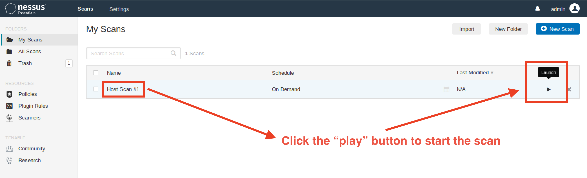
    
   - There are two scan types:

      - **Credentialed** scans use appropriate privileges and provide a more accurate view of risks. Downsides include a high number of false positives and high bandwidth usage.         
      
         - Explain that the reason for the high false positives count is that there are a lot of different versions and packaging for any number of services you may download. Because of this, Nessus will flag a service that it is unsure about to avoid false negatives. 
      
         - Credentialed scans often finish more quickly than uncredentialed scans due to reduced back-and-forth communication checks between the scanner and its target.

      - **Uncredentialed** scans enumerate system service and version numbers on open listening ports, then perform a vulnerability check against a known list of associated exploits.

7. Double-click on the scan to open the scan overview. 

**Note:** If you see the following error, explain to students that we are not using APIs with our scanner, but we can troubleshoot this easily. 

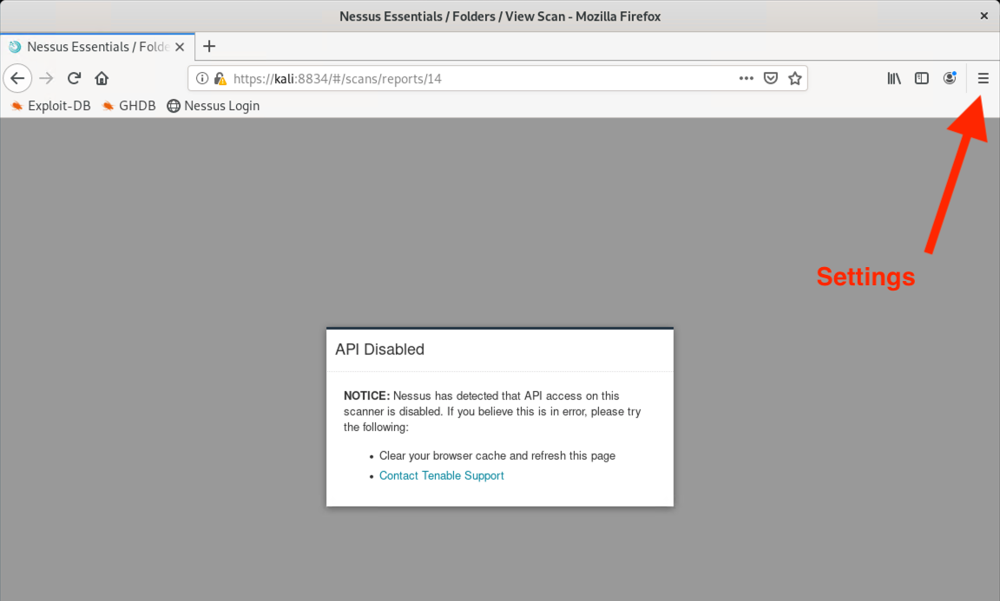
     
Open a new browser window and navigate to Firefox's settings. In the upper-right-hand corner search bar, search for "cache." Click on **Clear Data** and return to the Scans page in Nessus. Refresh the page and continue.

   - Returning to the Scans page in Nessus, point out that we can see several useful pieces of information:

      - Scan progress, which in this case is "Completed."

      - A bar graph displaying the number of vulnerabilities at each severity level.

      - A pie chart showing severity levels.  

      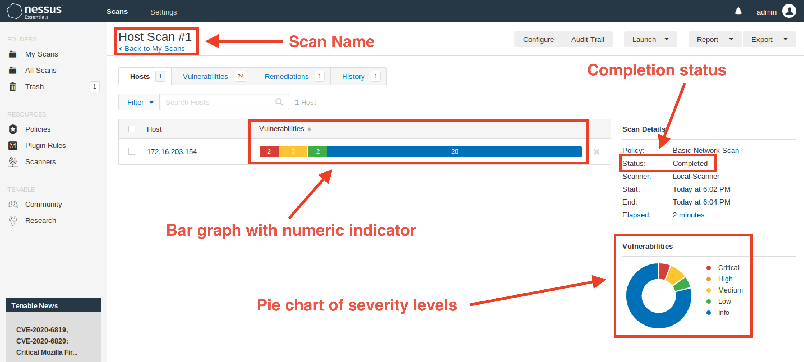

8. Click on the **Vulnerabilities** tab.

   - Explain that Nessus assigns all vulnerabilities to a specific severity level based on the National Vulnerabilty Database or NVD CVSSv3 score as follows: 

      - Critical: 9.0 - 10.0
      - High: 7.0 - 8.9
      - Medium: 4.0 - 6.9
      - Low: 0.1 - 3.9
      - None: 0

       **Note:** Vulnerabilities classified as "None" aren't necessarily actual vulnerabilities. These can just be additional information that may be useful to an attacker.

     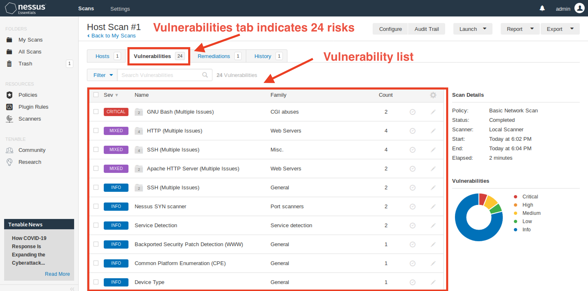

9. Clicking on individual vulnerabilities will display specific details about that vulnerability.

   - Click on the critical vulnerability listed at the top of the list: GNU Bash Environment Variable Handling Code Injection (Shellshock).

   - Nessus detected a Shellshock vulnerability by performing an Nmap, SearchSploit, and CVE lookup in the background.

   - Nessus combines multiple functions into one, which is one of the advantages of using Nessus instead of NSE.

     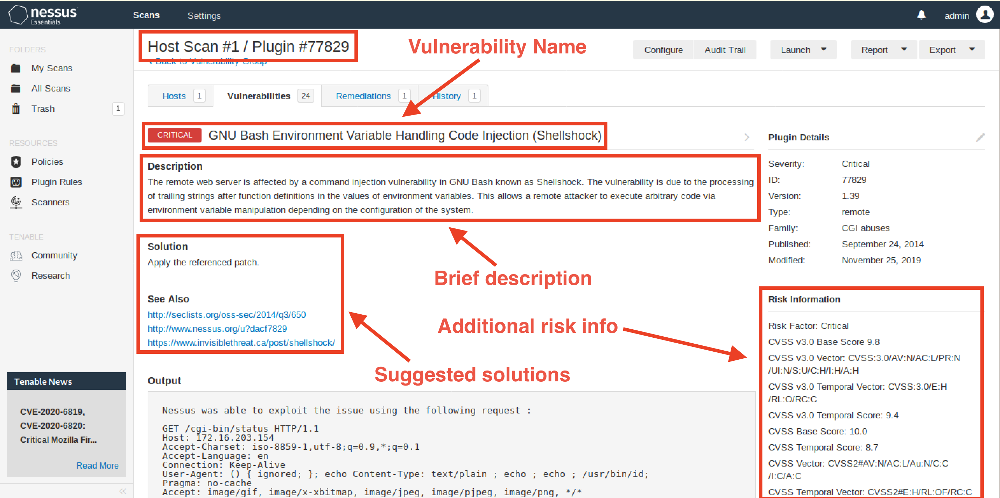

10.  Penetration testers typically include vulnerability scan reports in their assessments. Nessus also has the report generating capabilities.

      - Click on **Report** in the top right corner.
      
      - In the dropdown, select **PDF**.

      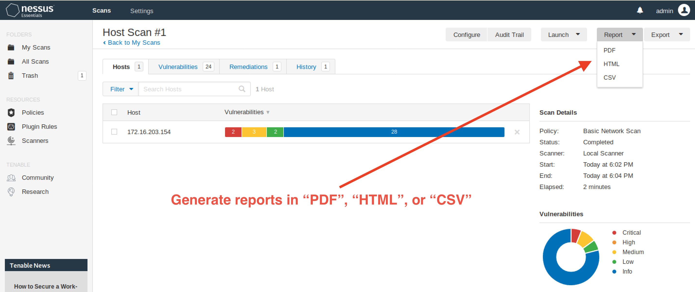

      - In the pop-up, select **Executive Summary** and click **Generate Report**.

      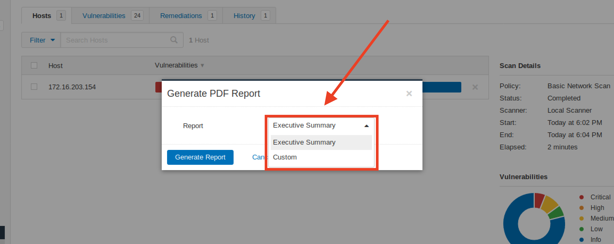

      - Explain that this will create a PDF version of the scan results that includes a customizable executive summary.

      - This document will be included in the assessment as a deliverable to the client.

      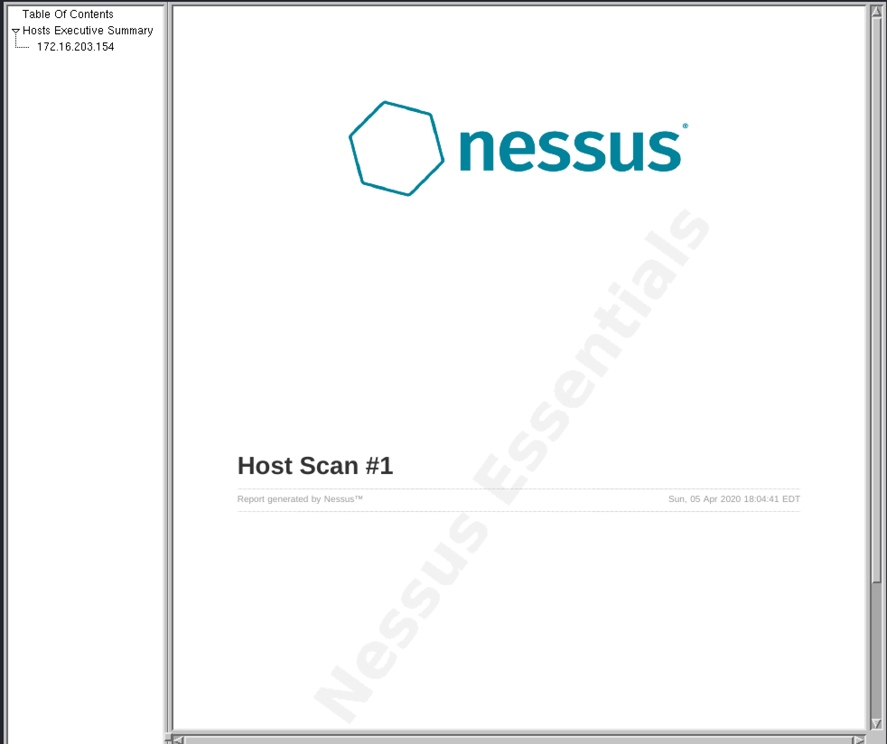

      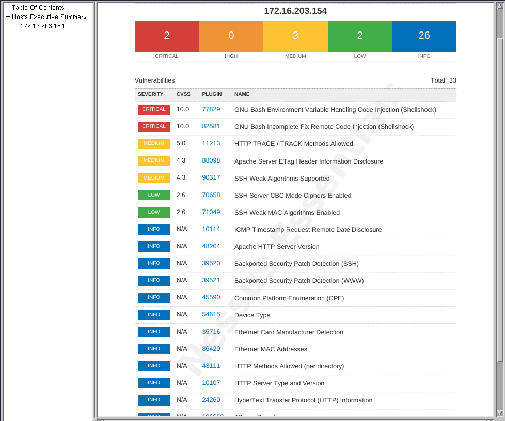

Encourage students to experiment with Nessus and explore the various scan types.

Summarize this lesson with the following key takeaways:

- Nessus is a free open-source network vulnerability scanner that uses the Common Vulnerabilities and Exposures database to correlate security compliance with specific security threats.

- Nessus discovers vulnerabilities that malicious hackers can exploit to breach a network, and generates reports.

- Vulnerability scans search for known vulnerabilities in a system and report potential exposures. 

- Penetration tests exploit weaknesses in network infrastructure to determine the level at which a malicious actor can gain unauthorized access. 

   - Vulnerability scans are typically automated.
   - Penetration tests are manual tests performed by a security professional.

Pause to answer questions before proceeding.

### 09. Student Do: Metasploitable Report (0:20)

Explain the following to students:

- Nessus provides many scan options. In this activity, you will use Nessus to perform a Metasploitable scan.

- You will be playing the role of an SOC analyst. You have to present the results of a vulnerability scan to your client. 

- Answer the questions and be ready to provide a summary of remediation tactics for your client. 

Send students the following file:

- [Activity File: Metasploitable Report](activities/02_Report_Review/Unsolved/README.md)

### 10. Instructor Review: Metasploitable Report Activity (0:10)

Lead a discussion using the solution guide below. Introduce each question and give several students an opportunity to answer before providing the solutions. 

Use the following file to guide your review: 
- [Solution Guide: Metasploitable Report](activities/02_Report_Review/Solved/README.md)

### 11. Instructor Do: Wrap-Up and Looking Ahead (0:05)

Remind students of the five steps of penetration engagement: 

1. Planning and Reconnaissance
2. Scanning
3. Exploitation
4. Post Exploitation
5. Reporting

So far, we've completed the first two phases of a penetration test. Tomorrow we will explore some Exploitation techniques.

Answer any questions before dismissing class for the day. 

____

&copy; 2020 Trilogy Education Services, a 2U Inc Brand.  All Rights Reserved.
