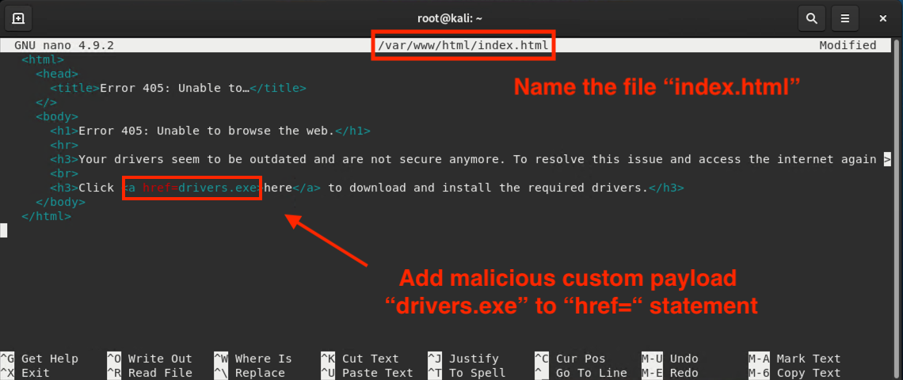
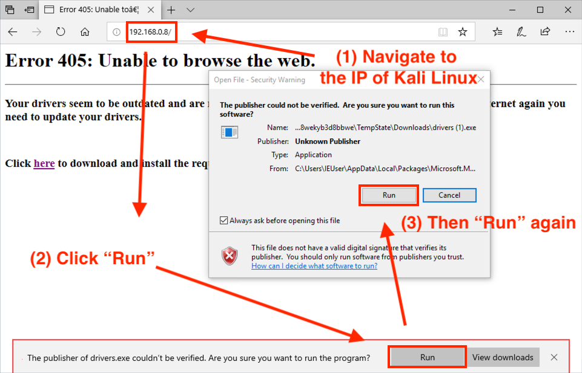

## Activity File: Creating Custom Payloads

In this activity, you will play an independent penetration tester hired by the law firm Jacoby and Dreyer LLP.

- The firm wants you to test the effectiveness of their security awareness program. They suspect that one of their employees is being careless with their internet use and not adhering to company security policies.

- You've decided to use a social engineering tactic to convince the employee to click on a link in their web browser. The firm has provided you with the employee's IP address.

- Specifically, you will use `msfvenom`'s custom payload options to build a malicious file that will link to a webpage for the targeted employee to click on.

Use the following machines: 

- Attacking machine: Kali Linux 
   - Username: `root`
   - Password: `toor`

- Employee workstation: DVW10 
   - Username: `IEuser`
   - Password: `Passw0rd!`

### Instructions

#### In the Kali Machine

1. For this attack, you will craft a custom malicious payload.

   Using `msfvenom`, craft a malicious executable with the following criteria:

      - Creates a `reverse_tcp` session using Meterpreter.
     
      - Payload is designed to exploit any Windows platform.

      - The file type is EXE.

      - Saves the output file to the `/var/www/html/` directory.

      - The local host is the attacking machine's IP address (Kali Linux).

      - The local port is `4444`.

      - Has the name `drivers.exe`.

   After you craft the payload, run the command to create it.  

2. To begin, create a backup of the index.html file that is located in the `/var/www/html/` directory without overwriting its current contents:

   -   Run the following commands:
   ​
      - `cp /var/www/html/index.html /var/www/html/index.html.bak`

         - This command backs up the original `index.html` without overwriting it.
   ​
      - `ls /var/www/html/`
         - This lists the contents of the `/var/www/html/` directory to verify that you have both the `index.html` and `index.html.bak` files. 

3. Build the malicious code into the webpage. The HTML code is provided below. You will need to edit the `/var/www/html/index.html` file with the name of your executable `drivers.exe`.

   - Use Nano to edit the `index.html` file:

      - Run `nano /var/www/html/index.html`

  - Edit the following code into the file and change the name of your executable in the HTML code from `sample.exe` to `drivers.exe`:
​ 
   ```html
   <html>
   <head>
      <title>Error 405: Unable to…</title>
   </>
   <body>
      <h1>Error 405: Unable to browse the web.</h1>
      <hr>
      <h3>Your drivers seem to be outdated and are not secure anymore. To resolve this issue and access the internet again you need to update your drivers.</h3>
      <br>
      <h3>Click <a href=sample.exe>here</a> to download and install the required drivers.</h3>
   </body>
   </html>
   ```
      
   

View the `index.html` file to verify it contains `drivers.exe`. 
- Run: `cat /var/www/html/index.html`


4. Launch the Metasploit framework. 
     
​
5. Test the malicious website to ensure it's working properly. Launch a web browser and navigate to the localhost:
​
   - Type the following into the URL: `127.0.0.1`
​
   - The webpage should launch with the headline: **Error 405: Unable to browse the web.**
​
   - This indicates our website is online and ready for action.

   - Note that while the website shows an error, the page contains the malicious link that unsuspecting visitors are encouraged to click.
​
    

​
6. Now we will configure the setting for the listener. Return to the terminal. Run the series of commands that will accomplish the following tasks and then run the exploit:
​
   - Uses the `exploit/multi/handler` module.

   - Sets the payload to `windows/meterpreter/reverse_tcp`.
​
   - Sets the local host to the IP of Kali Linux.
​
   - Sets the local port to `4444`.
​
   - Verifies that the settings took effect.
​
   Run the exploit and wait for the Windows host to connect. This will be simulated in the next step. 

#### In the DVW10 Windows Machine

7. Launch the DVW10 VM and open the web browser.

   Hackers will purchase domains and use them to encourage visitors to download malicious software. Instead of purchasing and setting up a real domain, we'll simulate the domain by entering the URL of the Kali machine in the web browser to access Kali's `index.html`: 

   - Type the IP address of the Kali Linux machine in the URL.
​
   - You will get a series of error messages. For both prompts, select **Run**. 

​
    

#### In the Kali Machine
​
8. Return to the Kali machine and perform some post-exploitation commands:
​
   - You should now have a Meterpreter session established. Run commands that do the following:
      - Generate a Windows command prompt.
      
      - Return network shares.   ​
     
      - Return all users on the DVW10 system.

---

&copy; 2020 Trilogy Education Services, a 2U Inc Brand.   All Rights Reserved.
