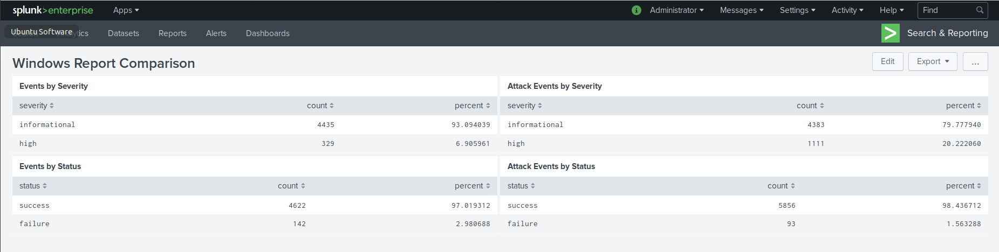
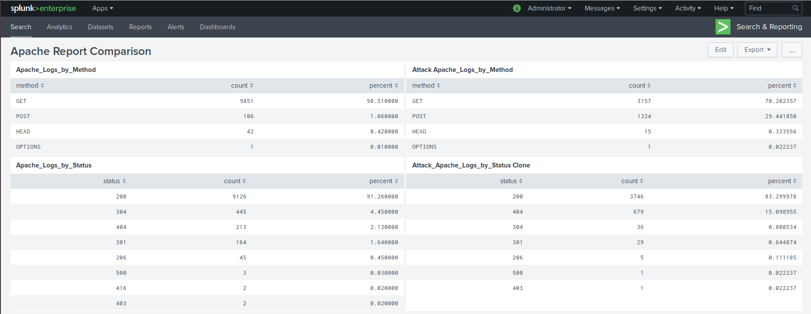

## Solution Guide: Part 2 - Defend Your Org

### Windows Server Logs

#### Report Analysis for Severity

Did you detect any suspicious changes in severity?

- Yes. The percentages changed from:

 ```text
 informational: 93%
 high: 7%
 ```

 to:

 ```text
 informational: 80%
 high: 20%
 ```

- This indicates an increase in the high severity cases by percentage (and an overall increase in high severity cases is borne out by the counts).

#### Report Analysis for Failed Activities

Did you detect any suspicious changes in failed activities?

- Yes. The percentages changed from:

 ```text
 success: 97%
 failure: 3%
 ```

  to:

 ```text
 success: 98.5%
 failure: 1.5%
 ```

- This indicates that there is not a major change in the cumulative failure of events.

---

#### Alert Analysis for Failed Windows Activity

- Several of the answers are dependent on what the groups select for their baselines and thresholds.
- There is some potential suspicious activity for failed activity at 8 a.m. on Weds, March 25th.
- The count of activity is 35 events during this hour.

#### Alert Analysis for Successful Logons

- Several of the answers are dependent on what the groups select for their baselines and thresholds.
- There is some potential suspicious activity at 11 a.m and 12 p.m. on Weds, March 25th.
- The count of activity is 196 at 11 a.m. and 77 at 12 p.m.
- The primary user logging in is `user j`.

#### Alert Analysis for Deleted Accounts

Did you detect a suspicious volume of deleted accounts?  

- There was no suspicious activity of deleted accounts.

---

#### Dashboard Analysis for Time Chart of Signatures

- Does anything stand out as suspicious? What signatures stand out?
  - Yes, the signatures that have suspicious activity are:
    - A user account was locked out
    - An attempt was made to reset an accounts password, and
    - An account was successfully logged on.

- What time did it start and stop for each signature? What is the peak count of the different signatures?

  - User account was locked out: Started after 12 AM and ended by 3 AM on March 25th. The peak count was 896.
  - An attempt was made to reset a users password: Started after 8 AM and ended by 11 AM on March 25th. The peak count was 1,258.
  - The account was successfully logged on: Started after 11 AM and ended by 1 PM on March 25th. The peak count was 196.

#### Dashboard Analysis for Users

- Does anything stand out as suspicious? Which users stand out?
  - Yes, the users that have suspicious activity are users `A`, `K`, and `J`.

- What time did it begin and stop for each user? What is the peak count of the different user?

  - `User A`: Started after 12 AM and ended by 3 AM on March 25th. Peak count was 984.
  - `User K`: Started after 8 AM and ended by 11 AM on March 25th.  Peak count was 1,256.
  - `User J`: Started after 10 AM and ended by 1 PM on March 25th. Peak count was 196.

#### Dashboard Analysis for Signatures with Bar, Graph, Pie Charts

- The suspicious findings should be similar to the time chart.

#### Dashboard Analysis for Users with Bar, Graph, Pie Charts

- The suspicious findings should be similar to the time chart.

#### **Dashboard Analysis for Users with Statistical Chart**

- What would be the advantage/disadvantage of using this report, compared to the other user panels you created?
  - The answers can vary between groups, but one disadvantage of the stats chart compared to a time chart is that it shows a cumulative perspective, while a time chart shows suspicious activity over a more specific, shorter time frame.

---

### Apache WebServer Logs

#### Report Analysis for Methods

- Did you detect any suspicious changes in HTTP methods? If so, which one?
  - Yes, there was a suspicious change in the HTTP POST method, which increase from 1% to 29%. (There was also a spike in GET requests from a baseline of ~120/hr to 729 at 6 PM on Wed Mar 25)
- What is that method used for?
  - POST is used to submit or update information to a web server.

#### Report Analysis for Referrer Domains

- Did you detect any suspicious changes in referrer domains?
  - There were no suspicious referrers during the attack.

#### Report Analysis for HTTP Response Codes

- Did you detect any suspicious changes in HTTP response codes?
  - There are several small changes, but the most prominent is the 404 response code, which increased from 2% to 15%.

---

#### Alert Analysis for International Activity

- Did you detect any suspicious volume of international activity? If so what was the count of the hour it occurred in?
  - There was activity from Ukraine at 8 p.m. on Weds, March 25th, with a count of 935 events.
- The other answers are dependent on each group's baselines and thresholds.

#### Alert Analysis for HTTP POST Activity

- Did you detect any suspicious volume of HTTP POST activity? If so, what was the count of the hour it occurred in and when did it occur?
  - There was a spike in POST method activity at 8 p.m. on Weds, March 25th, with a count of 1,296 events.
- The other answers are dependent on each group's baselines and thresholds.

---

#### Dashboard Analysis for Time Chart of HTTP Methods
  
- Does anything stand out as suspicious?
  - Yes, there were spikes in the POST and GET methods.
- What was the method that seems to be used in the attack? What time did it begin and end, and what was the peak count?
  - The POST method was used, starting after 7 PM and ending by 9 PM. The peak count was 1,296.
  - THE GET method was used, starting after 5 PM and ending by 7 PM. The peak count was 729.

#### Dashboard Analysis for Cluster Map
  
- Does anything stand out as suspicious? What new country, city on the map has a high volume of activity?
  - Yes, there is suspicious activity from Ukraine.

- What is the count of that country, city?
  - When zoomed in, we can see the cities in Ukraine are:
    - Kyiv(formerly Kiev): Count of 439
    - Kharkiv: Count of 433

#### Dashboard Analysis for URI Data

- Does anything stand out as suspicious? What URI is being hit the most?
  - Yes, there is suspicious activity against the main VSI logon page: `/VSI_Account_logon.php`.
- Based on the URI being accessed, what could the attacker potentially be doing?
  - The attacker may be trying to brute force the VSI logon page.

#### Bonus: Comparing Reports

In the same way as cloning dashboards and then altering the clone makes dashboard comparisons easier, cloning reports and altering the clone and then creating a dashboard with the original report and the altered clone in side-by-side panels makes report comparison easier.

- Here is an example of comparing Windows Reports side-by-side:
  
- Here is an example of comparing Apache Reports side-by-side:
  

---

© 2020 Trilogy Education Services, a 2U, Inc. brand. All Rights Reserved.
