## Solution Guide: Incident Analysis with Kibana

### Instructions: Investigating the Incident

Even though you already know what you did to exploit the target, analyzing the logs is still valuable. It will teach you:
- What your attack looks like from a defender's perspective.

- How stealthy or detectable your tactics are.

- Which kinds of alarms and alerts SOC and IR professionals can set to spot attacks like yours while they occur, rather than after.

- While going through the solution file, please note that the IP addresses here need to be replaced your machine's IP addresses. 

Double-click the Google Chrome icon on the Windows host's desktop to launch Kibana. If it doesn't load as the default page, navigate to http://192.168.1.105:5601.

Start by creating a Kibana dashboard using the pre-built visualizations. Navigate to your home page, then scroll down to **Visualize and Explore Data** then **Dashboard**.

Click on **Create dashboard** in the upper left hand side. On the new page click on **Add an existing** to add the following existing reports:
- `HTTP status codes for the top queries [Packetbeat] ECS`
- `Top 10 HTTP requests [Packetbeat] ECS`
- `Network Traffic Between Hosts [Packetbeat Flows] ECS`
- `Top Hosts Creating Traffic [Packetbeat Flows] ECS`
- `Connections over time [Packetbeat Flows] ECS`
- `HTTP error codes [Packetbeat] ECS`
- `Errors vs successful transactions [Packetbeat] ECS`
- `HTTP Transactions [Packetbeat] ECS`

Your final dashboard should look similar to:

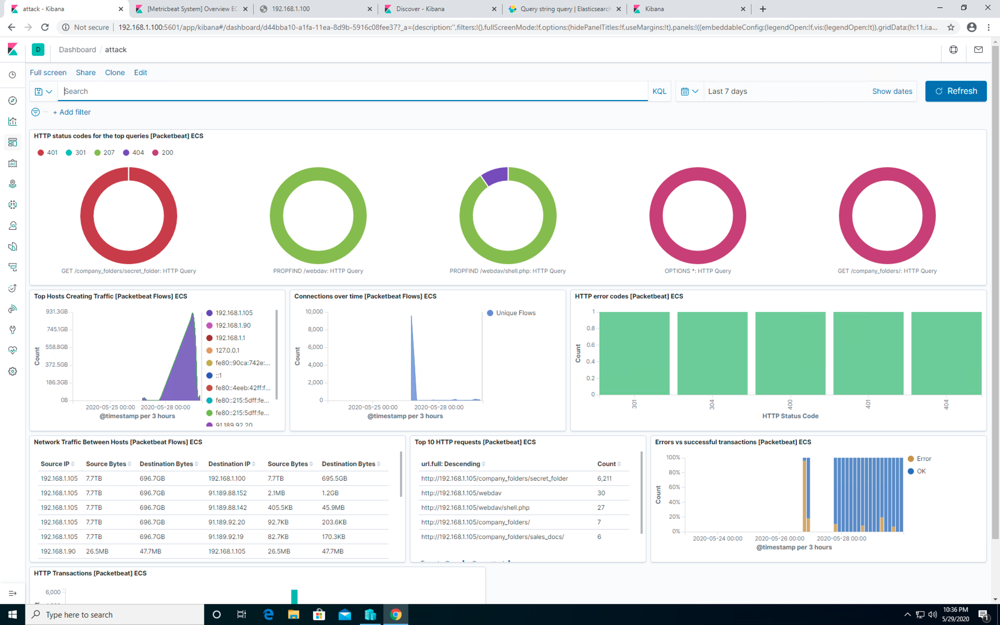

Next, get familiar with running search queries in the `Discover` screen with Packetbeat.
- On the Discover page, locate the search field.
- Start typing `source` and notice the suggestions that come up.
- Search for the `source.ip` of your attacking machine.
- Use `AND` and `NOT` to further filter you search and look for communications between your attacking machine and the victim machine.
- Other things to look for: 
	- `url`
	- `status_code`
	- `error_code`

Some helpful searches include

- `http.response.status_code : 200`
- `url.path: /company_folders/secret_folder/`
- `source.port: 4444`
- `destination.port: 4444`
- `NOT source.port: 80 and NOT source.port: 443`

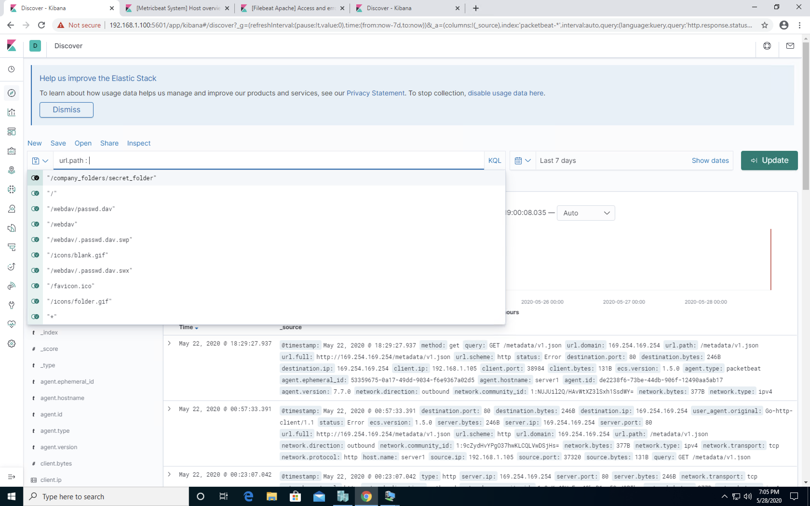

After you create your dashboard and become familiar with the search syntax, use these tools to answer the questions below:

#### 1. Identify the Offensive Traffic

Identify the traffic between your machine and the web machine:

- Staring with a few searches in the 'Discover' area, we can find some interesting interactions.

- Run `source.ip: 192.168.1.90 and destination.ip: 192.168.1.105` in which the source IP is your Kali machine and your destination machine is your web server.

- Run `url.path: /company_folders/secret_folder/`.

When did the interaction occur?

- You know when the interaction happened so we will need to change the timeline that Kibana is searching to see that time period:

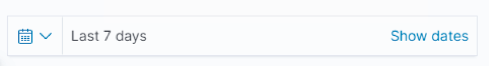

In your dashboard, look through the different panels and use this data to look through the results and notice the following interactions:

What responses did the victim send back?

- On our dashboard, we can see the top responses in the `HTTP status codes for the top queries [Packetbeat] ECS`

	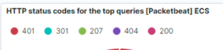

- We can see `401`, `301`, `207`, `404` and `200` as the top responses.

- We can also see with the `HTTP Error Codes [Packetbeat] ECS` panel:

	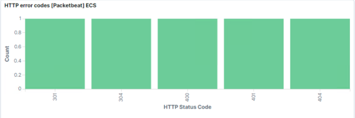

What data is concerning from the Blue Team perspective?

- We can see a connection spike in the `Connections over time [Packetbeat Flows] ECS`

  

- We can also see a spike in errors in the `Errors vs successful transactions [Packetbet] ECS`

  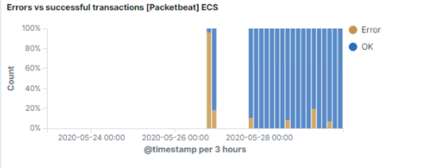

#### 2. Find the Request for the Hidden Directory

In your attack, you found a secret folder. Let's look at that interaction between these two machines.

How many requests were made to this directory? At what time and from which IP address(es)?

- On the dashboard you built, a look at your `Top 10 HTTP requests [Packetbeat] ECS` panel:

   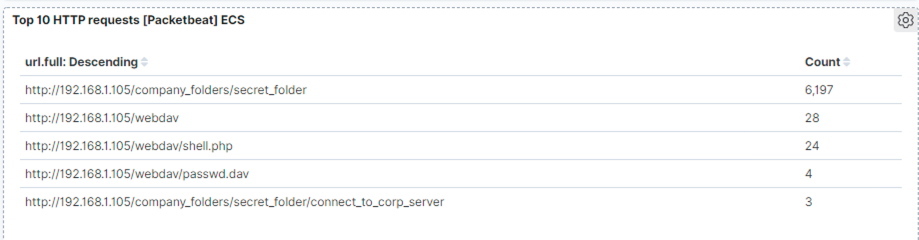

- In this example we can see that this folder was requested `6,197` times.

Which files were requested? What information did they contain?

- We can see in the same panel that the file `connect_to_corp_server` was requested `3` times.

What kind of alarm would you set to detect this behavior in the future?

- We could set an alert that goes off for any machine that attempts to access this directory or file.

Identify at least one way to harden the vulnerable machine that would mitigate this attack.

- This directory and file should be removed from the server all together.

#### 3. Identify the Brute Force Attack

After identifying the hidden directory, you used Hydra to brute-force the target server. Answer the following questions:

Can you identify packets specifically from Hydra?

- Yes, if you are using the search function `url.path: /company_folders/secret_folder/` will show you a few conversations involving this folder.

- In the `Discovery` page, search for: `url.path: /company_folders/secret_folder/`.

Look through the results and notice that `Hydra` is identified under the `user_agent.original` section:

  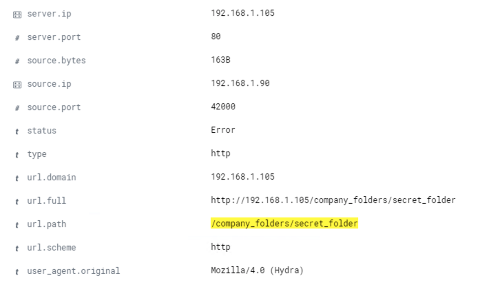

How many requests were made in the brute-force attack? How many requests had the attacker made before discovering the correct password in this one? 

-   In the `Top 10 HTTP requests [Packetbeat] ECS` panel, we can see that the password protected `secret_folder` was _requested_ `6209` times, but the file inside that directory was only requested `3` times. So, out of `6209` requests, only `3` were successful. 

   **Note:** Your results will differ.

   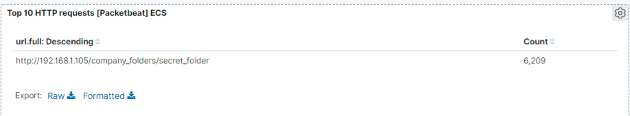

Take a look at the `HTTP status codes for the top queries [Packetbeat] ECS` panel:

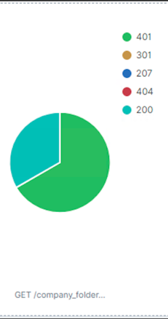

- You can see on this panel the breakdown of `401 Unauthorized` status codes as opposed to `200 OK` status codes.

- We can also see the spike in both traffic to the server and error codes.

- We can see a connection spike in the `Connections over time [Packetbeat Flows] ECS`

	

- We can also see a spike in errors in the `Errors vs successful transactions [Packetbet] ECS`

	

These are all results generated by the brute force attack with Hydra.

What kind of alarm would you set to detect this behavior in the future and at what threshold(s)?

- We could set an alert if `401 Unauthorized` is returned from any server over a certain threshold that would weed out forgotten passwords. Start with `10` in one hour and refine from there.

- We could also create an alert if the `user_agent.original` value includes `Hydra` in the name.

Identify at least one way to harden the vulnerable machine that would mitigate this attack.

- After the limit of 10 `401 Unauthorized` codes have been returned from a server, that server can automatically drop traffic from the offending IP address for a period of 1 hour. We could also display a lockout message and lock the page from login for a temporary period of time from that user.

#### 4. Find the WebDav Connection

Use your dashboard to answer the following questions:

How many requests were made to this directory? 

- We can again see in the `Top 10 HTTP requests [Packetbeat] ECS` panel that the webdav folder was directly connected and files inside were accessed.

  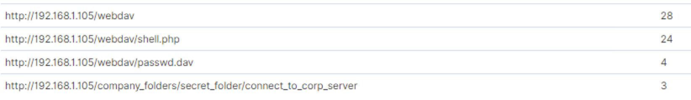

- We can also see it in the pie charts:

  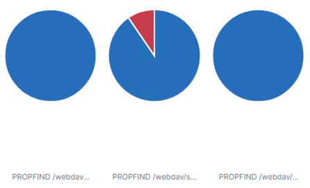

Which file(s) were requested?

- We can see the passwd.dav file was requested as well as a file named `shell.php`

What kind of alarm would you set to detect such access in the future?

- We can create an alert anytime this directory is accessed by a machine _other_ than the machine that should have access.

Identify at least one way to harden the vulnerable machine that would mitigate this attack.

- Connections to this shared folder should not be accessible from the web interface. 

- Connections to this shared folder could be restricted by machine with a firewall rule.

#### 5. Identify the Reverse Shell and meterpreter Traffic

To finish off the attack, you uploaded a PHP reverse shell and started a meterpreter shell session. Answer the following questions:
Can you identify traffic from the meterpreter session?

-  First, we can see the `shell.php` file in the `webdav` directory on the `Top 10 HTTP requests [Packetbeat] ECS` panel.

   

- Remember that your meterpreter session ran over port `4444`. Port `4444` is the _default_ port used for meterpreter and the port used in all of their documentation. Because of this, many attackers forget to change this port when conducting an attack. You can construct a search query to find these packets.

- `source.ip: 192.168.1.105 and destination.port: 4444`

What kinds of alarms would you set to detect this behavior in the future?

- We can set an alert for any traffic moving over port `4444.`

- We can set an alert for any `.php` file that is uploaded to a server.

Identify at least one way to harden the vulnerable machine that would mitigate this attack.

- Removing the ability to upload files to this directory over the web interface would take care of this issue.

| :warning: **Important Checkpoint** :warning:                     |
|------------------------------------------------------------------|
| **At this time, you should have completed the following steps:** |
| Step 1: Identify the Offensive Traffic.                          |
| Step 2: Find the Request for the Hidden Directory.               |
| Step 3: Identify the Brute Force Attack.		           |
| Step 4: Find the WebDav Connection.                              |
| Step 5: Identify the Reverse Shell and meterpreter Traffic.      |

To complete the next part of the project, you should take screen shots that represent each of the issues listed in preparation of compiling them into a report.

---
© 2020 Trilogy Education Services, a 2U, Inc. brand. All Rights Reserved.  
