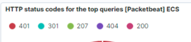
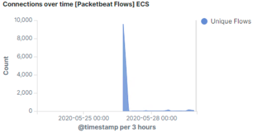
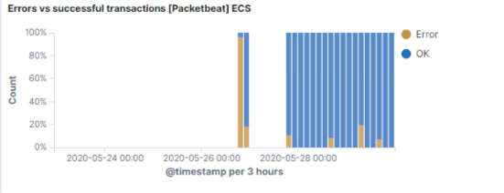
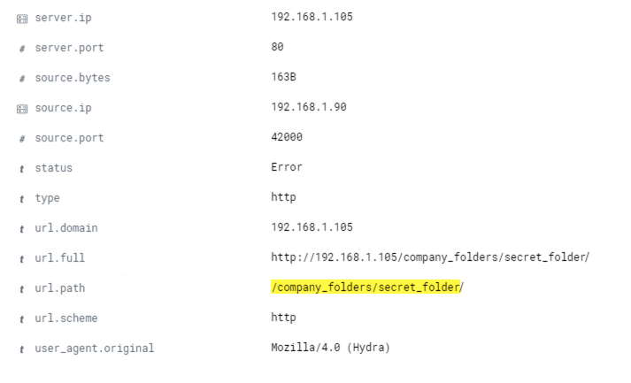
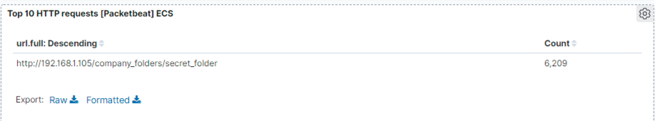
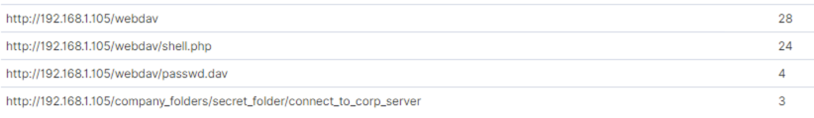
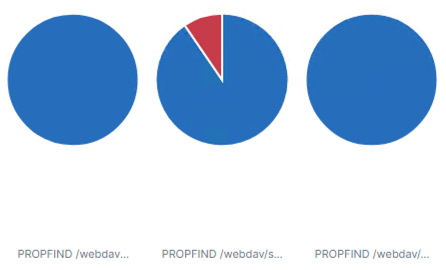

## Day 3 Activity File: Reporting

Congratulations! This week, you've worn two hats, playing the roles of attacker and defender. Don't underestimate the magnitude of this achievement: learning enough to infiltrate a machine and analyze data collected during an attack is a milestone that takes many professionals a long time to achieve.

Today, you'll take a break from flexing your technical skills and focus on communicating what you've learned during this project. In a real engagement, your client pays you not to break into their network, but to teach them how to protect it. This is why communication skills are vital in the cybersecurity field.

Therefore, you will summarize your work in a presentation containing the following sections:

- **Network Topology**: What are the addresses and relationships of the machines involved?  

  - **Solution**: The following machines live on the network:
    - **Kali**: `192.168.1.90`
    - **ELK**: `192.168.1.100`
    - **Target**: `192.168.1.105`

- **Red Team**: What were the three most critical vulnerabilities you discovered? Choose the three vulnerabilities that _you_ consider to be most critical.

  - **Solution**:  While the web server suffers from several vulnerabilities, the three below are the most critical:
      - **Cryptographic Failures**: Exposure of the `secret_folder` directory and the `connect_to_corp_server` file compromised the credentials of the Web DAV folder. Cryptographic Failures is an OWASP Top 10 vulnerability.
      - **Unauthorized File Upload**: The web server allows users to upload arbitrary files — specifically, PHP scripts. This exposes the machine to the wide array of attacks enabled by malicious files.
      - **Remote Code Execution**: As a consequence of the unauthorized file upload vulnerability, attackers can upload web shells and achieve arbitrary remote code execution on the web server.
    - Additional severe vulnerabilities include:
      - Lack of mitigation against brute force attacks
      - No authentication for sensitive data, e.g., `secret_folder`
      - Plaintext protocols (HTTP and WebDAV)

- **Blue Team**: What evidence did you find in the logs of the attack? What data should you be monitoring to detect these attacks in the future?
  
  - **Solution**: A considerable amount of data is available in the logs. Specifically, evidence of the following was obtained upon inspection:
    - Traffic from attack VM to target, including unusually high volume of requests
    - Access to sensitive data in the `secret_folder` directory
    - Brute-force attack against the HTTP server
    - POST request corresponding to upload of `shell.php`

  - **Unusual Request Volume**: Logs indicate an unusual number of requests and failed responses between the Kali VM and the target. Note that `401`, `301`, `207`, `404` and `200` are the top responses.

    

    - In addition, note the connection spike in the `Connections over time [Packetbeat Flows] ECS`, as well as the spike in errors in the `Errors vs successful transactions [Packetbet] ECS`

    

    

  - **Access to Sensitive Data in `secret_folder`**: On the dashboard you built, a look at your `Top 10 HTTP requests [Packetbeat] ECS` panel. In this example, this folder was requested `6,197` times. The file `connect_to_corp_server` was requested `3` times.

    

  - **HTTP Brute Force Attack**: Searching for `url.path: /company_folders/secret_folder/` shows conversations involving the sensitive data. Specifically, the results contain requests from the brute-forcing tool`Hydra`, identified under the `user_agent.original` section:

      

    - In addition, the logs contain evidence of a large number of requests for the sensitive data, of which only `3` were successful. This is a telltale signature of a brute-force attack. Specifically, the password protected `secret_folder` was requested `6209` times. However, the file inside that directory was only requested `3` times. So, out of `6209` requests, only `3` were successful. 

       

  - **WebDAV Connection & Upload of `shell.php`**: The logs also indicate that an unauthorized actor was able to access protected data in the `webdav` directory. The `passwd.dav` file was requested via `GET`, and `shell.php` uploaded via `POST`.

      

      

- **Mitigation**: What alarms should you set to detect this behavior next time? What controls should you put in place on the target to prevent the attack from happening?

  - **Solution**: Mitigation steps for each vulnerability above are provided below.
    - **High Volume of Traffic from Single Endpoint**
      - Rate-limiting traffic from a specific IP address would reduce the web server's susceptibility to DoS conditions, as well as provide a hook against which to trigger alerts against suspiciously suspiciously fast series of requests that may be indicative of scanning.
    - **Access to sensitive data in the `secret_folder` directory**
      - First, the `secret_folder` directory should be protected with stronger authentication. E.g., it could be moved to a server to which only key-based SSH access from whitelisted IPs is enabled.
      - Second, the data inside of `secret_folder` should be encrypted at rest.
      - Third, Filebeat should be configured to monitor access to the `secret_folder` directory and its contents.
      - Fourth, access to `secret_folder` should be whitelisted, and access from IPs not on this whitelist, logged.
    - **Brute-force attack against the HTTP server**
      - The `fail2ban` utility can be enabled to protect against brute force attacks.
    - **POST request corresponding to upload of `shell.php`**
      - File uploads should require authentication.
      - In addition, the server should implement an upload filter and forbid users from uploading files that may contain executable code.

### Presentation Deliverables

A sample slideshow is attached:
- [Report: Red vs. Blue Project] https://docs.google.com/presentation/d/1d07OCqkbAXL5kwCwVJrqLPtIgOWXA5t3EZfwI98rdDE/edit#slide=id.g8798eb4c44_0_0)

---
© 2021 Trilogy Education Services, a 2U, Inc. brand. All Rights Reserved.  
