## 20.1-20.3 Lesson Plan: Red vs. Blue Project Week

### Overview

This week, students will begin their second project: a Red Team vs. Blue Team scenario in which they will play the role of both penetration tester and SOC analyst.

The week will proceed as follows: 

- **Day 1 - Red Team**: Students attack a vulnerable VM within their environment, ultimately gaining `root` access to the machine.

  - :warning: **Heads Up**: Day 1 can be completed as a competition between the students. If you wish to do so, split the students into teams and have them compete to win a prize! The first team to complete _all_ the steps wins.

- **Day 2 - Blue Team**: Students use Kibana to review logs taken during their Day 1 engagement. They use the logs to extract hard data and visualizations for their report.

- **Day 3 - Reporting and Presentation**: Students interpret their log data to suggest mitigation measures for each exploit they successfully performed.

  - Students will produce their report and suggestions for Day 3 using Google Slides. They will be able to use this deliverable in job interviews and share it on platforms such as LinkedIn, displaying their familiarity with pen testing and log analysis.

### Week Objectives

This week's project will test students' knowledge of the following skills and tools:
- Penetration testing with Kali Linux.
- Log and incident analysis with Kibana.
- System hardening and configuration.
- Reporting, documentation, and communication.

Emphasize to the class that security practitioners consider the soft skills of reporting, documenting, and communicating findings to be just as important as technical proficiency.

### Lab Environment

Lab Details

 

In this unit, you will be using a new Red vs Blue lab environment located in Windows Azure Lab Services. RDP into the **Windows RDP host machine** using the following credentials:

  - Username: `azadmin`
  - Password: `p4ssw0rd*`

Open the Hyper-V Manager to access the nested machines:

**Kali:** A standard Kali Linux machine for use in the penetration test on Day 1. 
- Username: `root`
- Password: `toor`

**ELK machine:**
- Username: `vagrant`
- Password: `vagrant`

**Capstone machine:** We will need to use these credentials to set up Filebeat and Metricbeat, which will forward logs to the ELK machine.  However, students should not use these credentials when attacking the machine later in the activity.

- Username: `vagrant`
- Password: `tnargav`

In today’s class, we will use both the Capstone machine and Kali machine.

**Note:** Since the IP addresses are dynamic, the IP addresses used in the demos and activities should be treated as examples. The actual IP addresses will need to be determined before starting the exercises.

  

### Instructor Notes

- You will be using a new Project 2 lab environment located in Windows Azure. You and students will need a class-specific registration link. If you are unsure about where to find this unique registration link, please do the following:

  - Please refer to this [spreadsheet](https://docs.google.com/spreadsheets/d/1uHVzvVQftHL4CkUOB03lNelf-kLToZys6ugsIoVOpE0/edit#gid=0) to find your university specific spreadsheet.
  - Open up your university-specific spreadsheet and navigate to your specific cohort’s tab
  - Please find the registration link for the appropriate lab environment 
  - Please note that these links will be added 1-2 classes prior to when students will be using the lab environment for the first time. If you would like access to a lab environment earlier for preparation, please reach out to the curriculum team 

- :warning: **Heads Up**: It is common for students to experience the following issue:

   

  - If students encounter this error, explain that Kibana needs time to finish setting up. They should wait five to ten minutes and then try again. 

  - If the issue is still not resolved, ask to students to log into the ELK machine using the machines credentials and run the following commands:

    - `sudo su` which will allow the student to become the root user. 
    - `docker container ls` to find the name of the running docker container. 
    - `docker container stop <container-name>` which will stop the docker container.
    - `docker container start <container-name>` which will start the docker container back up. 

- :warning: **Heads Up**: If a student encounters an "Error connecting to Elasticsearch..." error on the Capstone machine: 

    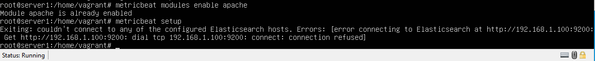

   - Complete the following troubleshooting steps: 
      - Log into the ELK server with `vagrant`:`vagrant`
      - Escalate to root: `sudo -s`
      - Destroy all containers: `docker rm -vf $(docker ps -aq)`
      - Start ELK: `systemctl start elk`
        - Give ELK about five minutes to re-configure itself.
      - After five minutes, open Chrome on the Windows Host and navigate to http://192.168.0.100:5601. The student should see the dashboard.
      - Next, log into Capstone with `vagrant`:`tnagrav`
      - Escalate to root: `sudo -s`
      - Run the setup script: `/opt/setup`

- :warning: **Heads Up**: If you are unable to connect to the ELK Machine, complete the following troubleshooting steps. 

    - Log onto the ELK machine.
    - Run `sudo su`
    - Run `systemctl stop elk`
    - Run `docker ps -a` to check if the container is stopped.
    - Run `find /var/lib/docker/volumes -type f -mtime +10 -delete`
    - Run `systemctl start elk`
    - Wait 2-4 minutes and then run: `curl localhost:9200`

- Since completion of the ELK stack in the first project week, students have been exposed to many of the "core disciplines" of security, namely: penetration testing, SIEM and incident response technologies, and log analysis.

    - Be sure to emphasize the magnitude of this achievement: these topics are the foundation of modern cybersecurity and students now have experience with all of them!

- Instead of three separate lesson plans, this single lesson plan gives guidance for the whole week. Each day is dedicated to a different aspect of the project, as described below.

  - Advanced students who finish a day's work may move on to the next day's work ahead of schedule.

  - Solutions have been provided to make it easier for staff to help students who are behind.

  - Each student is expected to work in their own environment and complete each challenge. However, if they desire, students can collaborate in groups of 3-4 to solve problems more quickly.

- Be sure to slack out the registration link to the Project 2 environment **at the beginning of class**. Make sure everyone has access before introducing the project.

- :warning: **Important note about next week**: Tell students that in two weeks they will switch gears to focus on certifications.
  
  - Students will be using CertMaster Practice during the first day of certification week. They should verify that they can access this tool prior to certification week, and they should be prepared to use it in class.

- The **grading rubric** for this project and the homework is located in the Resources folder:

    - [Unit 13 Grading Rubric](Resources/Grading-Rubric.pdf)

### Monitoring Setup Instructions

As the students attack a web server, it will send all of the attack info to an ELK server.

- The following setup commands need to be run on the **Capstone** machine before the attack takes place in order to make sure the server is collecting logs.

- Be sure to have the students complete these steps before starting their attack.

 <b> Click here to view to Monitoring Set Up Instructions </b> 

#### Instructions

- Double click on the `HyperV Manager` icon on the Desktop to open the HyperV Manager.

- Choose the `Capstone` machine from the list of Virtual Machines and double-click it to get a terminal window.

- Login to the machine using the credentials: `vagrant:tnargav`

- Switch to the root user with `sudo su`

#### Setup Filebeat

- Run the following commands:
  - `filebeat modules enable apache`
  - `filebeat setup`

- The output should look like this:

  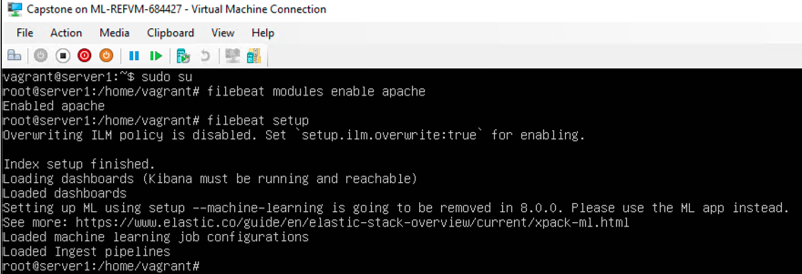

#### Setup Metricbeat

- Run the following commands:
  - `metricbeat modules enable apache`
  - `metricbeat setup`

- The output should look like this:

  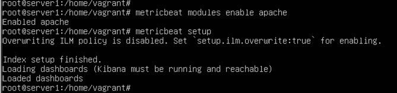

#### Setup Packetbeat

- Run the following command:
  - `packetbeat setup`

- The output should look like this:

  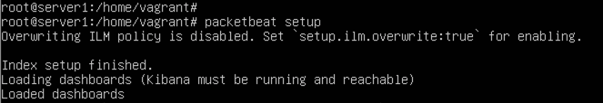

#### Restart all three services,

- Run the following commands:

  - `systemctl restart filebeat`
  - `systemctl restart metricbeat`
  - `systemctl restart packetbeat`

- These restart commands should not give any output:

  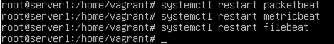

Once all three of these have been enabled, close the terminal window for this machine and proceed with your attack.

#### Next Week's Lab Environment

Refer to the instructions at the end of this lesson plan to set students up with the Week 21 Forensics Azure Lab environment.

### Slideshow

- The slideshow for this week is located on Google Drive: [Unit 20: Red Team vs. Blue Team Slides](https://docs.google.com/presentation/d/1NpqxpVtpPjXTx_6MZPfCLAoWja0EWYVZG9dn2kpy16o/edit#slide=id.g808d6bca43_0_0)

---

## Day 1: Red Team

#### 20.1 Instructor Do's

On the first day of the instructor will:

- Provide an overview of the project and suggested milestones for each day. Note that these milestones are only suggestions. Some students will move slightly faster, and others slightly slower.

- Describe the project network topology in detail and give an orientation demo of the environment. This will ensure students know where to find everything they need for each day of the project.

#### 20.1 Student Do's

On the first day of the project, students will:

- Log into the Kali machine and set up a workspace.
- Identify the vulnerable target.
- Enumerate the target VM.
- Gain user access to the target.
- Escalate to `root`.

 **Note:** If a competition, this activity can be completed in groups. Otherwise, it can be completed individually.

 <b> Click here to view the 20.1 Lesson Plan </b> 

### 01. Instructor Do: Project Overview and Orientation

Welcome students to class and explain that today marks the start of the second project.

Remind students of everything they've studied since Project 1:
- Web architecture and vulnerabilities
- Penetration testing
- SIEM

Emphasize that, in just six weeks, students have learned many of the foundational skills they'll need to pursue a career in either defensive or offensive security.

Explain that this week's project will give students an opportunity to exercise their skills in both domains by placing them in a Red Team vs. Blue Team scenario. Over the course of the week, students will:

- Attack a vulnerable VM from Kali Linux.
- Analyze logs taken during the attack.
- Report on findings and suggest hardening strategies.

Explain the following about each day:
- On Day 1, students will act as a red team, applying everything they learned in pen testing to gain access to a vulnerable target. The target will be capturing logs of the students' activity as they attack it.

- On Day 2, students will act as a blue team, using the same ELK setup they created in Project 1 to analyze the logs captured during Day 1.

- On Day 3, students will create a presentation summarizing their recommendations and suggestions for hardening the system.

   - The report and suggestions for Day 3 will be a valuable deliverable to share in job interviews and on platforms such as LinkedIn. It is a resource that will display their familiarity with pen testing and log analysis.

Point out that this project requires knowledge of pen testing, SIEMs, and systems adminstration. Emphasize that achieving such broad familiarity with these cybersecurity skills is a significant achievement. Students should be proud of how much they've learned.

Let students know that you'll proceed by providing an overview of the lab environment and tasks for Day 1. If you haven't already, slack out the registration link for the lab before moving on.

#### Lab Environment

Explain that the Red Team vs. Blue Team lab environment contains an attack VM, a target VM, and an ELK server.

**Important:** Do not give out the IP addresses listed below as the students are meant to find these on their own.

- **Kali** (`192.168.1.90`): A standard Kali Linux machine for use in the penetration test on Day 1.  

- **Capstone** (`192.168.1.105`): The vulnerable target VM that students will attack. It has Filebeat and Metricbeat installed and forwards logs to the ELK machine.

- **ELK** (`192.168.1.100`): The same ELK setup that students created in Project 1. It exposes the Kibana dashboards that students will use in Day 2.

**Instructor Note**: Unlike Project 1, this week does not involve deploying VMs to Azure. This is because resource availability and pricing are unpredictable due to COVID-19.

Today, students will log into the Kali VM with the following credentials:

  - Username: `root`
  - Password: `toor`

They will then attack the Capstone VM. Instructions on how to approach the penetration test will be provided.   

Explain that the Capstone VM is configured to capture logs as students attack it. It forwards these logs to the ELK server for visualization with Kibana.

#### ELK Stack Refresher

Remind students about the basic architecture of the ELK stack:

- Logs are collected on deployed machines.
- Logs are forwarded to the Elasticsearch database.
- Kibana is used to visualize data.

Remind students that **beats** are small programs that run on the machines being monitored and forward logs to the database.

Explain that beats will be used to send logs from the Capstone VM to the ELK server. The following beats are enabled:

- **Filebeat** collects file system data, such as files changed, requested, and uploaded.

- **Metricbeat** collects  system data, such as uptime and SSH logins.

- **Packetbeat** collects network data, such as incoming and outgoing packets.

Remind students that they installed Filebeat and Metricbeat in Project 1. We have added Packetbeat to facilitate the Blue Team challenge, but the monitoring setup is otherwise identical to what students previously created.

Let students know that they will have all of today's class to attack the target VM, which will give them many logs to analyze on Day 2.

#### Project Milestones

Remind students that they will be working independently and are responsible for pacing themselves. To stay on track, they should aim to achieve certain milestones each day:

- **Day 1**: Find the flag on the Capstone VM.

- **Day 2**: Answer all provided questions about the logs captured in Kibana.

- **Day 3**: Produce a presentation summarizing your findings.

Explain that it's okay if students don't follow this exact schedule, but they should aim to keep up with these targets.

Emphasize that, while students must complete their projects individually, they are encouraged to work through problems together.

#### Day 1 Activity Objectives: Red Team

Introduce the Red Team assignment by explaining that it requires the following high-level steps:

1. Identify the IP address and exposed services of the target VM.
2. Find hidden files on the target.
3. Brute-force and crack passwords to gain entry.
4. Upload a PHP reverse shell to an insecure web server.
5. Explore the target system and find the flag.

Emphasize that students are responsible for determining the details for each step, but that they learned all of the necessary techniques in the offensive security units.

Finally, as a hint, let students know that they'll need to use the following tools (in no particular order):
- Firefox
- Hydra
- Nmap
- John the Ripper
- Metasploit
- curl
- Netdiscover

Take a moment to address remaining questions before wishing students luck.

### 02. Student Do: Attack!

Send students the following activity and resource files.

- [Day 1 Activity File: Red Team](Activities/Day_1/Unsolved/ReadMe.md)

Use the solution guide for your own guidance and review. **Do not** share this with students until after the project.

- [Day 1 Solution Guide: Red Team](Activities/Day_1/Solved/ReadMe.md)

If someone gets stuck on a particular step, feel free to explain the solution to keep them moving. Only do so if they have made an honest effort to solve the problem themselves.

### 03. Instructor Do: Day 1 Wrap-Up

Explain that in today's class, students enumerated, exploited, and escalated privileges on a vulnerable target VM.

| :warning: **Important Checkpoint** :warning:                     |
|------------------------------------------------------------------|
| **At this time, you should have completed the following steps:** |
| Step 1: Discover the IP address of the Linux server.             |
| Step 2: Locate the hidden directory on the server.               |
| Step 3: Brute force the password for the hidden directory.       |
| Step 4: Crack the password hash.                                 |
| Step 5: Connect to the server via WebDAV.                        |
| Step 6: Upload a PHP reverse shell payload.                      |
| Step 7: Find and capture the flag.                               |

To complete the next part of the project, students must complete steps 1-6 at a minimum.

While they worked, the ELK server was recording their actions.

Next class, students will analyze these logs to determine how their Day 1 actions could have been detected and stopped.

Please tell students that they will be using CertMaster Practice during the first day of the Certification Prep unit, which will be coming up in two weeks.

---

## Day 2: Blue Team

#### 20.2 Instructor Do's

On the second day of the project week, you will: 

- Remind students that the target VM was capturing logs of the students' every action as they performed their security assessment. Explain that they will now use Kibana to inspect those logs to identify traces of each step of the attack.

- Demonstrate how to open Kibana in the lab environment and explain how to access the available logs. Don't spend too much time explaining how Kibana works, as students will be responsible for working through this on their own.

#### 20.2 Student Do's

On the second day of the project week, students will

- Use Kibana to inspect logs captured during Day 1.
- Identify records of each phase of the attack.
- Create visualizations of suspicious activity.

> Note: :warning: Throughout 20.2, it is important that the students take screen shots of each step they complete. These screen shots will be used in their Day 3 Report. 

 <b> Click here to view the 20.2 Lesson Plan </b> 

### 01. Instructor Do: Blue Team Overview

Welcome students back to class and explain that today they will start the Blue Team portion of the project.

Remind students that the VM they attacked on Day 1 had logging enabled via Filebeat, Metricbeat, and Packetbeat. This means that, while students were attacking it, it was sending evidence of their actions to the ELK server.

:warning: **Heads Up**: Let students know that to complete today's part of the project, they must complete steps 1-6 from the last class. Finding the flag isn't critical, but they need to progress past the point of uploading the reverse shell script.

Today, students will analyze the captured logs of the attack. They will:
  - Explore and visualize the logs using Kibana.
  - Characterize the attack by extracting specific data.
  - Design alarms for identifying similar suspicious activity in the future.

Let students know that you will next review how to access Kibana and provide the objectives for today's challenge.

#### Accessing Kibana

Explain that the ELK server is already configured and ready to use. Students only need to launch Google Chrome on the Windows host to access it.

Explain that Chrome is configured to load the following pages by default:

- Kibana homepage
- Filebeat system metrics
- Filebeat Apache metrics
- Packetbeat metrics

Demonstrate launching Kibana:
- Connect to your Classroom Lab instance via RDP.
- Double-click Google Chrome on the desktop.

This should load the dashboard and tabs pictured below.

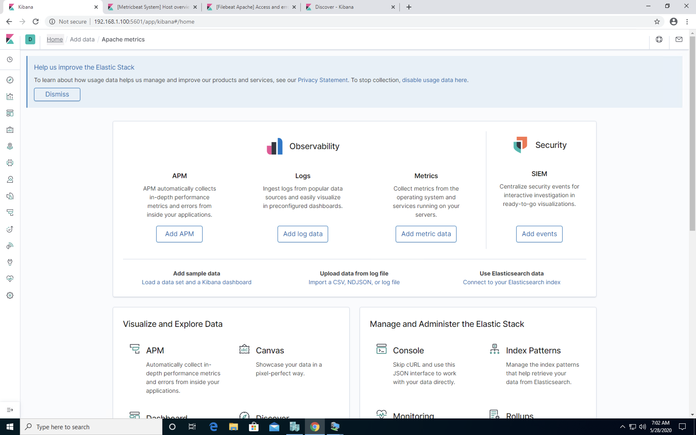

To navigate to Kibana directly, enter the following URL in the browser: http://192.168.1.105:5601.

- You may see the message "Kibana not yet ready." Kibana is a heavy process and it can take a few minutes to start up. If you receive this error, wait 3-5 minutes and then try again.

Now that students understand how to start up Kibana, we can review the Blue Team activity objectives and students can get started.

#### Day 2 Activity Objectives: Blue Team

Explain that students will work as a defensive blue team to assess Kibana data that was recorded during the red team attack.

Explain that their challenge for today is to answer a series of questions about the attack using the data in Kibana.

Remind students that the pentest they carried out on Day 1 involved several steps:

- Identifying the IP address and exposed services of the target VM.
- Finding hidden files on the target.
- Brute-forcing and cracking passwords to gain entry.
- Uploading a PHP reverse shell to an insecure web server.
- Exploring the target system and finding the flag.

Explain that today's project will require students to find evidence of each of these steps. Specifically, students will:
1. Find data depicting each step of the attack.
2. Use this data to propose possible alarm metrics and thresholds.
3. Use this data to propose hardening and mitigation techniques.

Remind students that they have the following data available in Kibana:
- System and Apache logs from Filebeat
- System logs from Metricbeat
- Network logs from Packetbeat

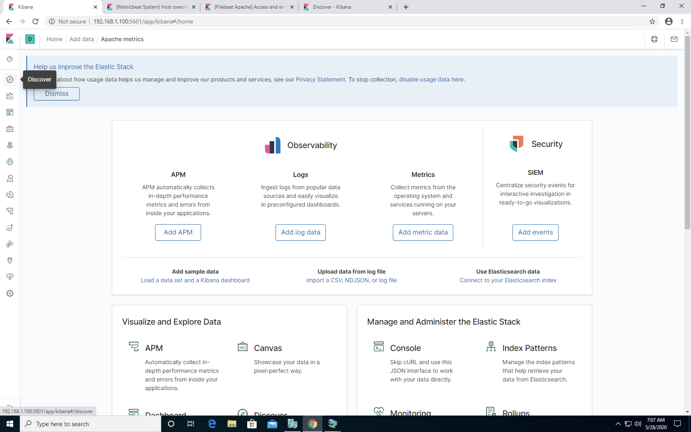

  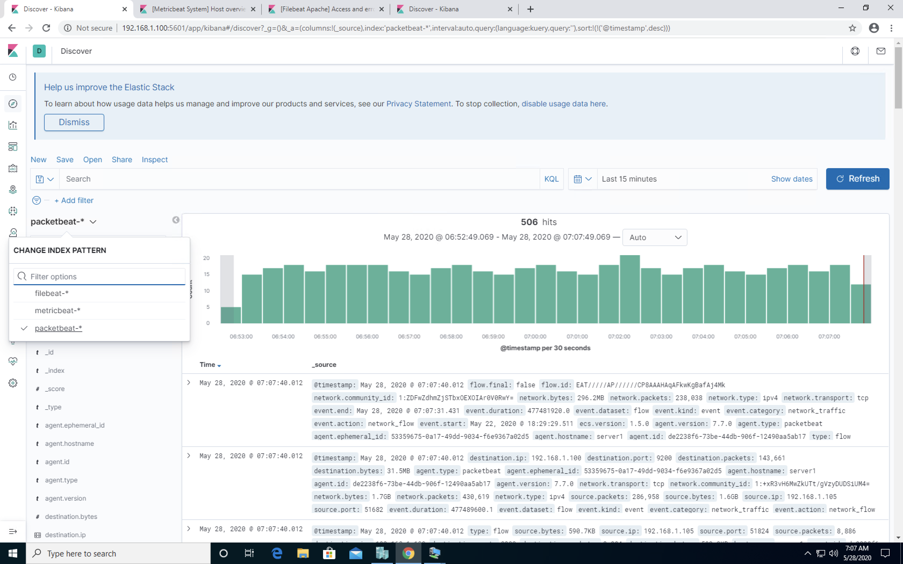

Let students know that you will proceed by providing a quick overview of querying data in Kibana. Encourage them to open Kibana in their own lab instances to follow along.

#### Searching Logs in Kibana

Explain that while Elasticsearch and Kibana provide many ways to explore data, students will only need to use the following:
- Kibana visualizations and dashboards
- Kibana Query Language (KQL)

Within the lab environment, start Kibana by double-clicking Google Chrome. By default, this should load four tabs:
- Kibana homepage
- Filebeat Apache logs
- Metricbeat system logs
- Packetbeat logs

Review the purpose of each beat installed on the target VM:

- Filebeat monitors files on disk for changes and watches system events, such as user logins.

- Metricbeat monitors system health metrics, such as uptime. It also generates metrics based on Apache access logs.

- Packetbeat captures network data, allowing users to explore packets as they come in. Packetbeat is similar to Wireshark for ELK.

Let students know that you will start with Packetbeat, as they will use it the most.

- Click the **Discover** icon in the left-hand navigation bar. It resembles a compass and is the second icon below the Kibana logo in the top-left.

- Select **Packetbeat** in the filters drop-down. Explain that this allows you to focus only on the network data and enables special search filters for packet inspection.

Explain that Kibana allows you to filter for the following properties, among other things:
- Timestamp. This can be used, for example, to limit data to just packets collected during the Red Team challenge.

- Source/Destination IP/Port. This can be used, for example, to search for traffic to and from port `443` on `192.168.1.90`.

- Protocol. This can be used, for example, to search for only HTTP responses with status code `200`.

- URL. This can be used, for example, to search for requests to the URL `/example_folder` on `192.168.1.90`.

There are other filters, but you will only demonstrate these four. Students will be responsible for researching and exploring the other necessary filters.

Demonstrate how to adjust the timestamp range:

- Click the calendar icon to the right of the search bar.

- Configure the search to return results from the last three days. This will filter for traffic captured during and after the red team's exploit.

  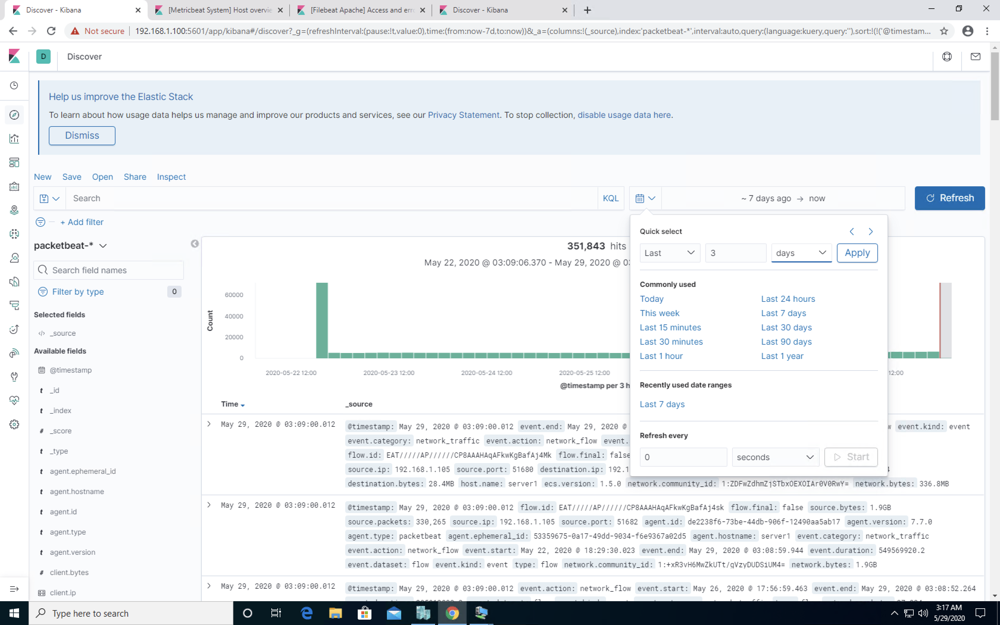

Demonstrate the other search filters by clicking on the search bar and typing `source.ip : 192.168.1.90`.

- This is an example of a Kibana Query Language (KQL) Query. KQL is similar to the Splunk Query Language or Wireshark filters.

- This query searches for all packets sent from the IP address that is equal (`:`) to `192.168.1.90`, which includes all traffic from the Kali VM.

   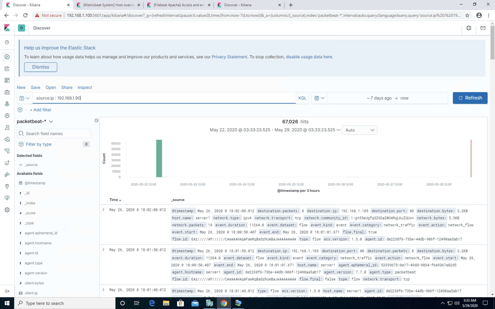

Point out that as you typed `source.ip : 192.168.1.90`, other filters appeared in the autocomplete dropdown, such as:
- `source.domain`
- `source.bytes`
- `source.nat.ip`

Emphasize that students should use the autocomplete feature to explore Kibana's search capabilities.

Explain that filters on other properties use the same syntax.

- In the search bar, type: `NOT http.response.status_code : 500` .

   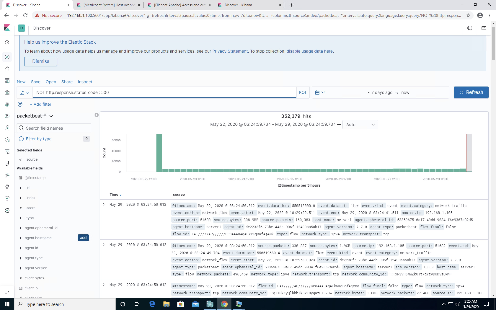

- This returns all HTTP responses with a status code not equal to `500` (Internal Server Error).

In the search bar, type `http.` Call attention to all the filters available in the dropdown. For example:
- `http.request`: Use to search many HTTP request parameters.
- `http.request.body`: Use to retrieve the content of HTTP requests sent from the client.

In addition to these, students should be aware of the following filter groups:
- `url`
- `client`
- `server`

Explain that the full list of filter fields is available in the left menu of the UI, under the **packetbeat** filter dropdown below the search bar.

Let students know that they should use the rest of class to find solutions for today's challenge, and take a moment to address remaining questions.

### 02. Student Do: Incident Analysis with Kibana

Send students the following activity files and resource links:

- [Day 2 Activity File: Incident Analysis with Kibana](Activities/Day_2/Unsolved/ReadMe.md)

#### Resources
- [Kibana: Discover Documentation](https://www.elastic.co/guide/en/kibana/7.7/discover.html)
- [Kibana: Visualize Documentation](https://www.elastic.co/guide/en/kibana/7.7/visualize.html)
- [Elasticsearch Reference Documentation](https://www.elastic.co/guide/en/elasticsearch/reference/current/index.html)

---

### 03. Instructor Do: Day 2 Wrap-Up

In today's class, you used Kibana to analyze the logs that were captured while you performed your penetration test. Now that you know how defenders can see your actions, you should have even clearer insight into how and why attackers and defenders use certain tactics.

| :warning: **Important Checkpoint** :warning:                     |
|------------------------------------------------------------------|
| **At this time, you should have completed the following steps:** |
| Step 1: Identify the Offensive Traffic.                          |
| Step 2: Find the Request for the Hidden Directory.               |
| Step 3: Identify the Brute Force Attack.		           |
| Step 4: Find the WebDav Connection.                              |
| Step 5: Identify the Reverse Shell and meterpreter Traffic.      |

To complete the next part of the project, students should take screen shots that represent each of the issues listed.

In addition to analyzing the logs, you used the data to develop ideas for new alarms and ways to harden the vulnerable VM. These could be implemented to improve the monitoring setup and configuration security of the target machine.

The next step will be to summarize your findings in a Google Slides presentation that you can use in future interviews and feature on sites like LinkedIn.

---

## Day 3: Reporting

#### 20.3 Instructor Do's

On the final day of the project week, you will:

- Introduce the reporting segment of the project. You will provide a Google Slides template, which students will fill out according to the findings from Days 1 and 2.

#### 20.3 Student Do's

On the final day of the project week, students will:

- Finish any remaining work and then develop a report on their findings. 

- Answer optional domain-specific interview questions about their projects. 

 <b> Click here to view the 20.3 Lesson Plan </b> 

### 01. Instructor Do: Overview

Welcome students back to class explain that today, they will summarize their findings from Days 1 and 2 in a professional presentation.

Emphasize that while today's tasks are non-technical, they are equally important to the tasks completed in the previous two days. Employers strongly prefer candidates who can both perform technical assessments, and summarize, interpret, and present their findings to non-technical stakeholders.

Today, students will fill out a Google Slides template with information from their assessment and log analysis. The presentation has three main parts:

1. **Red Team**: Assessment of critical vulnerabilities uncovered by the engagement.

2. **Blue Team**: Evidence discovered during post-incident analysis.

3. **Mitigation**: Suggestions and techniques to harden the system against future attacks.

Remind students that they were asked to collect scan outputs and screenshots during their assessment and analysis. They will use them now. The template slides prompt students to include screenshots and other evidence.

Send students the following link to the Google Slides template:

- [Project 2 Report Template](https://docs.google.com/presentation/d/1MQjuBqZn7FMg28vGiNeyTH2mpzt8SzUgLGHvCjVJYpM/edit#slide=id.g8798eb4c44_0_0)

Open the template and briefly review the slides to show students what they will be filling out. The full table of contents is as follows:

- **Network Topology**
    - Diagram of the network

- **Red Team**
  - Engagement overview and outcome
  - Critical vulnerabilities

- **Blue Team**
  - Summary of attack
  - For each phase of the exploitation, document:
    - Log evidence of attack
    - Key findings from evidence

- **Hardening**
  - For each critical vulnerability, document:
    - Mitigation technique
    - Suggested alarms and thresholds

Finally, emphasize that students will not have access to this template file. They will need to  click **File** and then **Make a Copy** in order to work on their own version of the template.

Let students know that they will have the remainder of class to finish work from Day 2 and work on the report. Emphasize that, while students will not present their slides in-class, they _must_ submit completed slides to receive credit for the project. The finished slides will be due as a homework assignment next week.

Take a moment to address remaining questions before allowing students to begin work.

### 02. Student Do:  Reporting

Send students the following activity file:

- [Day 3 Activity File: Reporting](Activities/Day_3/Unsolved/README.md)

To that end, you will summarize your work in a presentation containing the following sections:
- **Red Team**
  - What were the three most critical vulnerabilities you discovered?
- **Blue Team**
  - What evidence did you find in the logs of the attack?
  - What data should you be monitoring to detect these attacks next time?
- **Mitigation**
  - What alarms do we set to detect this behavior next time?
  - What controls do we put in place on the target to prevent it in the first place?

Note that you are free to choose the three vulnerabilities that _you_ consider most critical.

Open the template on Google Slides: [Slide Template](https://docs.google.com/presentation/d/1MQjuBqZn7FMg28vGiNeyTH2mpzt8SzUgLGHvCjVJYpM/edit#slide=id.g8798eb4c44_0_0). Click **File** -> **Make a Copy**, then fill out the prompts as indicated.

- Some examples of vulnerabilities to look for are:
  - Sensitive Data Exposure 
  - Unauthorized File Upload
  - Remote Code Execution
  - Brute Force Vulnerability
  - Local File Inclusion
  - Cross Site Scripting
  - Code Injection
  - SQL Injection
  - Security Misconfiguration

Remember that this presentation **will be due as homework** — you _must_ complete and submit it. And be encouraged to make it good: This will serve as valuable proof of skill in future job interviews.

**Good luck!**

### 03. (Optional) Student Do: Domain-Specific Interview Questions

As emphasized in the previous project, the ability to communicate the achievements of this project and relate them to different domains is a valuable skill for students to have when networking and interviewing. 

Students will once again have the option to respond to interview questions and relate the specific work they did to areas and domains of interest. 

Explain the following: 

- In this optional activity, you will choose a domain that you are interested in pursuing as a career. For this project, you will choose from the following domains:

  - Network Security
  - Logging & Monitoring
  - Offensive Security
  - Defensive Security: Incident Response Phases I & II

- If you are unsure of which domain you would like to focus on, that's ok! You can either choose the one that you are the most comfortable discussing, or you can also complete the tasks in two or three domains.
 
- For each domain, you will be provided a set of interview questions.  For each question, you will be prompted to think about specific aspects or tasks you completed in Project 2 that you can use to answer the question.
​
Send students the following activity file: 

- [Activity File: Project 2 Extension Questions](Activities/Day_3/Interview-Questions/README.md)

### 04. Instructor Do: Day 3 Wrap-Up
Congratulate students for their hard work, both on this project and for the last 20 weeks.

Emphasize that students should make sure their projects are complete, presentable, and free of errors.

Remind them that they can use their report as proof of knowledge and experience in the hiring process. A professional presentation detailing a security assessment. log analysis, and summary brief will be sure to get a hiring manager's attention.

If you haven't announced it yet, please tell students that they will be using CertMaster Practice during the first day of the Certification Prep unit, which will be coming up in less than two weeks.

 <b3> Next Week's Lab Environment </b3>

Next week, we will be using a new Forensics lab environment located in Windows Azure. You and students will need a class-specific registration link. 

- If you are unsure about where to find this unique registration link, please do the following:

  * Refer to this [spreadsheet](https://docs.google.com/spreadsheets/d/1uHVzvVQftHL4CkUOB03lNelf-kLToZys6ugsIoVOpE0/edit#gid=0) to find your university specific spreadsheet.
  * Open up your university-specific spreadsheet and navigate to your specific cohort’s tab.
  * Find the registration link for the appropriate lab environment 
  * Note that these links will be added 1-2 classes prior to when students will be using the lab environment for the first time. If you would like access to a lab environment earlier for preparation, please reach out to the curriculum team.

Tell students to switch to their local computer environment. Send students the registration link for the Forensics environment. Once they click on it, the Forensics environment card will be added to their Azure dashboard.

- RDP into the **Windows RDP host machine** using the following credentials:

  - Username: `azadmin`
  - Password: `p4ssw0rd*`

Make sure all students are set up and can access this environment. Address any troubleshooting issues prior to the next class.

Remind students to turn off any nested VMs running and their Forensics lab environment before ending class.

---
© 2020 Trilogy Education Services, a 2U, Inc. brand. All Rights Reserved.  
