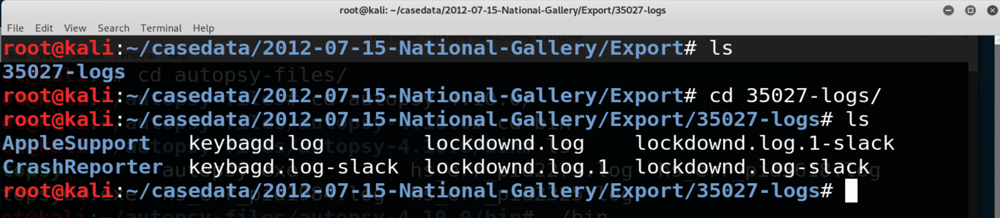
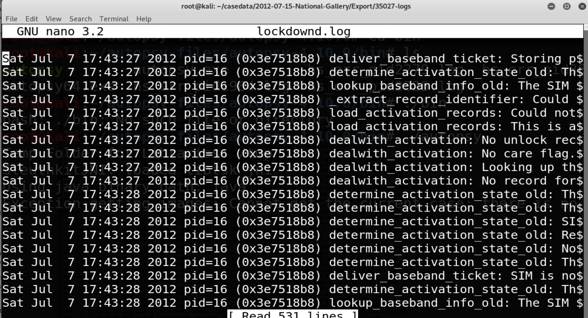

## 21.2 Lesson Plan: Autopsy and iPhone Forensics
 
### Overview
 
In the second day of our introduction to digital forensics, students will use Autopsy to analyze an iPhone image. 

### Class Objectives
 
By the end of the lesson, students will be able to:
 
- Identify the methods used in smartphone forensics investigations.
- Navigate the database and file structure of the iPhone's flash drive.
- Locate identifiable evidence on the iPhone in order to establish ownership.
- Use Autopsy to view and tag evidence in an iPhone image.
- Extract image content for offline viewing in other applications (logs, text, pictures, video, audio).

### Instructor Notes
 
Today's class is segmented into three parts:

- Review of creating an Autopsy case and the Autopsy user interface.
- A look at mobile forensics and the structure of the iPhone.
- An investigation activity that analyzes the iPhone image for device information and examines email correspondence.
 

### Lab Environment

Lab Details

 

In this unit, you will be using the Forensics lab environment located in Windows Azure Lab Services. RDP into the **Windows RDP host machine** using the following credentials:

  - Username: `azadmin`
  - Password: `p4ssw0rd*`

Open Hyper-V Manager to access the nested machine:

**Kali Forensics machine:**
  - Username: `root`
  - Password: `toor`

**Today’s class**

You will use the following machine:
- Kali Forensics machine

  

### Slideshow
 
- Slides for today's lesson can be found on Google Drive here: [21.2 Slides](https://docs.google.com/presentation/d/1UGL2eJeteWLQDshXw7CVS0NA1qR6KgptwwElUqL3L2M/edit#slide=id.g480f0dd0a7_0_1803).
 
- To add slides to the student-facing repository, download the slides as a PDF by navigating to File > "Download as" and choose "PDF document." Then, add the PDF file to your class repository along with other necessary files.
 
- **Note:** Editing access is not available for this document. If you or your students wish to modify the slides, please create a copy by navigating to File > "Make a copy...".
 

### Time Tracker 
Time tracker for today's class is located here: [21.2 Time Tracker](https://docs.google.com/spreadsheets/d/1NR6AuKo_0tVbGQyL-MXRWdGfpDwwV2m1BJ9IByCRiac/edit#gid=1145703143)

- **Note:** Editing access is not available for this document. If you or your students wish to modify the slides, please create a copy by navigating to File > "Make a copy...".

### Student Guide
- Send class a student-facing version of the lesson plan: [21.2 Student Guide](StudentGuide.md)

---
 
### 01. Instructor Do: Welcome and Overview (0:05)
 
Welcome students to the second day of the digital forensics unit.
 
Explain that in the last session, we covered:
 
- Basic principles of digital forensic methodologies.
- Various skill sets required for a career in digital forensics.
- The proper approach to collecting, preserving, analyzing, and reporting forensic evidence.
- How to conduct a preliminary review for a forensic case.
- How to preserve and document evidence using Autopsy.

Explain that today we will focus smartphone forensics and continue the National Gallery case by using Autopsy to view and tag evidence on an iPhone image. 
   
- Point out that students will also learn how to perform image searches without using the directory tree. Instead, they will use the following:

  - File Search by Attributes and Keyword Search.

  - Displaying text and file metadata. 

#### Where's the Data? File System and Data Storage
 
Explain that in this section, you will provide a high-level overview of the file structure and major directories of an iPhone.
  
Explain that an important aspect of mobile forensics is understanding where data is stored, how to access the data, and what data can be recovered.
 
- An iPhone does not have external storage. All data is stored in **flash memory** on the device.
 
  - Remember: Flash memory retains data without any external power and is used in SSDs and smartphones.

  - Flash memory on an iPhone exists until it is overwritten.

  - An iPhone's flash memory drive contains two disk partitions:
 
    - The **root** partition is used for the operating system and applications.

    - The **var** partition is used for user data.
 
- Explain that data is first imaged using a **bit-level copy**. 

  - In an iPhone, this will recover deleted messages as well as GPS coordinates and cell tower locations.
 
- iPhones allow users to back up their data to the cloud, which can be another source of data in an investigation, especially when the device is not available.
 
  - Poll the class: What challenges does iCloud data present to a forensic investigator?
 
    - Answer: Isolating and securing the evidence is challenging when data is in multiple locations. Also, SLAs must be recognized when dealing with other companies, in addition to other legal issues.
 
#### Important Directories / Databases and Files
 
Now we'll look at directories, databases, and files in the iPhone image that students will investigate for evidence using Autopsy for the National Gallery case.
 
- The following directories contain evidence applicable to the Tracy iPhone investigation.
  
  - `/mobile`
  - `/Applications`
  - `/Library`
  - `/root`
  - `/Logs`
  - `/logs`
 

Since iPhone's iOS is based on Unix, the directory structure should be familiar. 
 
- Most information is in human-readable format within the Autopsy application.
 
- The iPhone stores user data in **SQL databases** and other files.

  - SQL stands for Structured Query Language, and is a language used to create, read, update, and delete ( commonly abbreviated CRUD ) database files.
  
- Explain that these are the main databases that applications such as mail, SMS, calendar, and the address book use:
 
  - `AddressBook.sqlitedb` contains contact information and personal data like name, email address, etc.

  - `AddressBookImages.sqlitedb` contains images associated with saved contacts.

  - `Calendar.sqlitedb` contains calendar details and events information.

  - `CallHistory.db` contains incoming and outgoing call logs including phone numbers and time stamps.

  - `sms.db` contains text and multimedia messages along with their time stamps.

  - `voicemail.db` contains voicemail messages.

  - `Safari/Bookmarks.db` contains saved URL addresses.

  - `Envelope Index` contains email addresses.

  - `consolidated.db` contains GPS tracking data.

  - `locationd` contains the Google coordinates of places.
 
 iPhones also have data stored in `plists`, or `property lists`. A `plist` stores configuration information, call history, and cache information (i.e., websites visited).
 
  - `Maps/History.plist` keeps track of location searches.

  - `Maps/Bookmarks.plist` contains bookmarks.

  - `Safari/History.plist` contains internet browsing history.
    - `/logs` and `/Logs` contain device information.
 
#### Demonstration: Evidence Analysis with Autopsy

Explain that this demo will walk through various methods for obtaining digital evidence related to the National Gallery case:
 
1. Start the Kali VM.
 
2. Open a terminal and navigate to: `/root/autopsy-files/autopsy-4.10.0/bin`
 
3. Launch Autopsy: 

   - Run `./autopsy` 
 
4. Open the case created in the last class: 
 
   - Case name: `2012-07-15-National-Gallery`
   - Case number: `1EZ215-P`
 
     

   - Point out the Autopsy files end with the .aut file extension.
 
     
 
5. In the tree, you will see `tracy-phone-2012-07-15-final.EO1`, which is the iPhone image file.
  
   -  We'll spend most of our time exploring evidence in this directory tree.
 
6. After the file loads, click the **Encryption Detection** folder in the **Directory Tree** (left window pane).
 
7. Click on the `documents.zip` file in the **Data Source** window pane.
 
8. The `documents.zip` will expand its directory tree inside the left window pane.

#### Examine Browsing History
 
This example shows how to navigate an evidence file without using the directory tree. 

Clicking through directory trees is a long and cumbersome process. Instead, Autopsy has a built-in feature that allows for quicker and more thorough searches.

Point out that you will need the file name or file extension to perform a search.
 
  1. From the **Tools** menu, select **File Search by Attribute**.
  
  2. Click the box next to **Name** and type `History.plist`.
  
  3. Click the **Search** button.
 
  4. Select `History.plist` at the top of the **File Search Results 1** window.
 
      - The `History.plist` stores iPhone browsing history from the Safari web browser.
 
  
 
5. Select the **Indexed Text** tab in the **Data Content** pane.
 
   - Here you will see a list of searches that the owner of the iPhone performed.
 
    
 
Review how to view the text using the iPhone image file.
 
#### Autopsy Main Panes
 
* Review the main panes in the user interface: **Directory Tree**, **Listing**, and **Data Content**.
 
 
 
#### File Metadata 
 
Next, we'll look at the file metadata. We need this information for our evidence reporting.
 
- Select the **File Metadata** tab in the **Data Content** pane.
 
- Point out the importance of capturing file metadata using the **File Metadata** tab in the **Data Content** pane. Here we can find lots of information relevant to our investigation.
  
  -  This data may include:
    - Image name
    - MIME type
    - File size
    - Creation date
    - Hash
 
  
 
#### Displaying Text
 
Explain that the **Indexed Text** tab is used to display human-readable text.
 
- This example displays the contents of one of Tracy's emails.
- The path to the file is displayed in the **Listing** pane.
 
   
 
#### File Search
 
 
- If you know the file name you're looking for, performing searches using the **File Search by Attributes** method is much faster than using the directory tree.
 
  - To get there, click **Tools** in the top menu bar and select **File Search by Attributes**.
 
  - Next to the **Keyword Search**, the **File Search by Attributes** is a highly efficient method for searching through file images.
 
    
 
Pause to answer questions before students proceed to their first activity.
 

 ### 02. Student Do: Mobile Evidence Analysis  (0:50)
 
Explain the following:
 
- In this activity, you will play the role of a digital forensic investigator.
 
- You are tasked with analyzing evidence and creating a spreadsheet that profiles the details of Tracy's iPhone.
 
- This will serve as your preliminary documentation for the remaining activities.
 
- For this activity, you will practice your research skills using Autopsy's File Search by Attributes and Keyword Search functions.
 
- Refer to the following file for information on the main databases and files covered in the demonstration:
  - [iPhone Forensic Image: Important Databases and Files](https://docs.google.com/document/d/10CWGqTvu09mrSn7Tg7xoKNWBrjeW1wCmXoqB58xYr0k/edit#heading=h.h1fyk9xj3env)
 
- Fill out your findings in the following worksheet: 
  - [iPhone Details Worksheet](https://docs.google.com/document/d/1LmqJeEarZkcYh67TPFUgDvk0p5wy7Ck-FcFSZ2GcFGc/edit#heading=h.irtu7ebfsqdh)
  - You will need to make your a copy in order to edit it.  
 
If you wish, you may work in small groups of two or three.  

Send students the following activity file: 

- [Activity File: Mobile Evidence Analysis](Activities/02_Mobile_Evidence/Unsolved/README.md)

 
### 03. Instructor Review: Mobile Evidence Analysis Activity (0:10)
 
This activity had students practice how to procure relevant case file data and establish ownership of a device. 
 
- An important aspect of mobile forensics is understanding where data is stored, how to access it, and what data can be recovered.
 
Point out that knowing how to perform image searches without using the directory tree helps to both speed up the investigation and reveal more details than would have been uncovered otherwise.
 
Point out that the main tasks needed to complete this activity were to use Autopsy's File Search by Attributes and Keyword Search functions to:

  - Locate device information located across several image directories.

  - Document your findings on an evidence worksheet for records purposes.
 
Remind students that text is viewed using the Indexed Text tab in the Data Content pane.
 
Send students the following solution file and use it to guide your review:
 
- [Solution Guide: Mobile Evidence Analysis](Activities/02_Mobile_Evidence/Solved/README.md)
 
Pause to answer any questions before proceeding.

### 04. Break (0:10)
 
### 05. Instructor Do: Tagging Evidence (0:10)
 
We'll continue our investigation by using Autopsy to tag evidence.

- **Evidence tagging** is the process of bookmarking evidence to keep critical details organized and easily accessible.

- We'll be tagging evidence throughout our investigation to help categorize and organize all digital evidence pertinent to the National Gallery case.
 
Explain that Autopsy includes a built-in feature to tag evidence, which allows investigators to easily locate evidence contained within Autopsy.
 
- Autopsy contains a set of pre-defined tags that include:
 
  - Follow Up
  - Notable Item
  - Child Exploitation
  - Uncategorized
  - Non-Pertinent
 
- Custom tags can be created and added to the tag database.
 
  - Having the ability to create custom tags provides forensic investigators with the capability to categorize and organize their evidence image file database according to specific case criteria. 
  
  - This process makes it easy for team members to continue working on a file that was previously worked by another investigator.
 
#### Demonstration: Evidence Tagging
 
Now we'll walk through how to tag and bookmark the SMS database. The SMS database contains sent and received iPhone messages.
  
First, we need to locate the `sms.db` file in the iPhone image using Files Search by Attributes.
 
  - Click on **Tools** on the top menu bar.
  - Select **Files Search by Attributes**.
 
   
 
  - Check the **Name** box and enter `sms.db`, then press Enter or click **Search**.
 
    
 
   - Click the `sms.db` entry in the **Listings** pane to highlight it.
 
   - Right-click and select **Add Tag** > **Bookmark**. The line containing the `sms.db` entry will turn yellow in the Listing pane.
 
      
  
      
  
Point out that the bookmark entry can be found in the **Directory Tree** under **Tags** > **Bookmark** > **File Tags**.
 
#### Creating Custom Tags
 
Explain that organizations use various tagging schemes depending on the case they are investigating. Therefore, having the ability to create custom tags allows forensic investigators to categorize evidence according to specific criteria.
 
- Next, we'll preview how to create a new tag in the database.
 
   - Right-click on `sms.db` and select **Add File Tag** > **New Tag**.

     
 
   - The **Create Tag** window is displayed.
   - Enter the name of the new tag and provide a description. Click **OK**.   
 
     
  
- After you add your custom tag to the `sms.db` file you will see the new tag entry in the directory tree under **Tags**.
 
 - The next time you go to select a tag, you will see your custom tag listed as a selection.
 
   
 
Pause to answer questions before proceeding.

 
### 06. Student Do: Tagging Evidence (0:15)
 
Explain the following to students:
 
- In this activity, you will tag the major databases and files in the iPhone image file.
 
- Tagging allows you to quickly find data in the Autopsy iPhone image and document the evidence.
 
- You will create new tags for evidence that's relevant to the case, such as mail, address book, and SMS.
 
- Be sure to tag as much relevant information as possible. It will be used in later activities as you build your case.
 
Send students the following files:

- [Activity File: Tagging Evidence](Activities/06_Tag_Evidence/README.md)
- [iPhone Forensic Image: Important Databases and Files](https://docs.google.com/document/d/10CWGqTvu09mrSn7Tg7xoKNWBrjeW1wCmXoqB58xYr0k/edit#heading=h.h1fyk9xj3env) 
    - Use this file to select the content to tag. You can also bookmark and tag other files of interest.
 
 
### 07. Instructor Review: Tagging Evidence Activity (0:10)
 
The goal of this activity was to tag evidence relevant to the case. Students will use evidence that they've tagged in future activities so it's important that they tag as much relevant data as possible.
  
Completing this activity required the following steps :
 
- Using Files Search by Attributes to locate files.
 
- Tagging evidence files using Add Tag > Bookmark.
 
- Creating new tags using Add File Tag > New Tag.
 
There is no solution file. With so many files, students' answers will vary greatly. 

- Instead, ask students to explain which tags they chose and why.
 
- Ask the class if anyone created unique tags for the data and if so, why.
 

### 08. Instructor Do: Extracting Data for Offline Analysis (0:15)
 
Explain that although Autopsy facilitates viewing information in the application, investigators may want to extract individual files or entire directory trees for offline viewing within other applications. This is because:
 
- Not all data types can be rendered in Autopsy.
 
- Other tools can analyze video, photo, and audio files in more depth.
 
   - For example, photos may need to be enlarged, audio may need voice recognition, and video may need to be enhanced for facial recognition.
 
- Database information may easily be transferred to spreadsheets or word documents where it can be manipulated for reports.
 
In this section, we will cover how to extract files and entire directories for offline viewing, where data can be parsed for specific information.
 
- **Offline viewing** refers to the process of viewing files outside of the main program, in this case, Autopsy.
 
- Remind students that the iPhone image contains files and directories that can be viewed or rendered with other applications contained within the Linux OS.
 
- When using the Extract File(s) feature to extract a single file, an entire directory, or the entire image, it will be exported as a Linux directory.
 
#### Demonstration Single File Export
 
Launch Autopsy and load the case file.
 
- Perform a Keyword Search and search for the `AddressBook.sqlitedb` file.
 
- In the **Listing** window, select the `AddressBook.sqlitedb` database, then right-click and select **Extract Files**.
 
   
 
- By default, files are placed in the **Export** directory.
 
- Accept the default settings and click **Save**.
 
   
 
- Explain that the **Export** directory is located in the `/root/casedata/2012-07-15-National-Gallery` directory.
 
- Open a terminal and navigate to the export directory.
   - Run `cd /root/casedata/2012-07-15-National-Gallery/Export/`
 
- The `.db` database files require a database reader program such as SQLite DB Browser (pre-installed in Kali) that can view these files types.
   - Run `sqlitebrowser AddressBook.sqlitedb`

- We can see the database schema of `AddressBook.sqlitedb` using SQLite DB Browser.

   

- We can see the contacts in the ABRecent table by going to **Browse Data** > **ABRecent**.

   

- This provides us with valuable information, such as the contact's name and email. However, fields like **date** and **property** are in formats designed for the iPhone's operating system. 

#### Demonstration: Full Directory Export
 
Next, we'll demonstrate how to export an entire directory for offline viewing.
 
- Select the `vol5/logs` directory in the directory tree.
 
- Right-click, select **Extract Files**, and export the entire directory to the **Export** directory in Kali.
 
   
 
- Open a terminal and navigate to the **Export** directory and run the `ls` command.
 
- Emphasize that the file was successfully exported. Now we'll open it with a text editor.
 
   
 
- You can use any text editor, but we'll view the `lockdownd.log` file in the Nano editor.
 
- After opening the file, explain that we can view the contents of the `lockdownd.log` in plain text.
 
  - Offline data exports are a powerful collaborative tool for extracting specific data from a given file or folder.
 
   
 
Pause to answer questions before proceeding.
 
 
### 09. Student Do: Extracting Data for Offline Analysis (0:20)
 
Explain the following:
 
- In this activity, you continue in your role as digital forensic investigator working on the National Gallery case.
 
- Your task is to create export files for offline examination.
 
- The investigative team will use your file exports to identify and confirm Tracy's phone number.
 
Send students the following:
 
- [Activity File: Extracting Data for Offline Analysis](Activities/09_Extracting_Data/Unsolved/README.md)
 

### 10. Instructor Review: Extracting Data for Offline Analysis Activity (0:10)
 
Remind students that the goal of this activity was to understand the importance of creating file and folder exports for offline examination.
 
- Not all data types, such as video and audio files, can be rendered in Autopsy. Therefore, third-party apps to perform more in-depth analysis may be required.
 
- File exports enable database information to be easily transferable to spreadsheets or word documents where it can be easily manipulated in reports.
 
- The Extract File(s) feature extracts, a single file, an entire directory, or the entire image, are exported as a Linux directory.
 
Completing this activity required the following steps: 

- Using File Search by Attributes to locate the `call_history.db` file.
- Using Extract Files to export files and full directories to the `Export` directory.
- Using `sqlitebrowser` to view offline database files.
- Using `sqlitebrowser -R -t call call_history.db` to launch and open the call table simultaneously.
 
Send students the following and use it to guide your review:
 
- [Solution Guide: Extracting Data for Offline Analysis](Activities/09_Extracting_Data/Solved/README.md)
 

### 11. Instructor Do: Wrap-Up (0:05)
 
Point out the key takeaways from today's class:
 
- As a forensic investigator, you will work as part of a team that consists of a large collaborative effort.
 
- It's critical as forensic investigators to understand how to use tools such as Autopsy and how to export data so other team members can perform offline analysis of evidence.
 
- Tagging evidence helps categorize and label evidence that has already been screened. 

- This eliminates double work and helps other investigative team members continue your work if you become unavailable.
 
Explain that in the next class, we will continue our investigation by analyzing email messages, SMS messages, and web history, in order to tie Tracy to the case.
 

----
 
&copy; 2020 Trilogy Education Services, a 2U Inc Brand.   All Rights Reserved.
