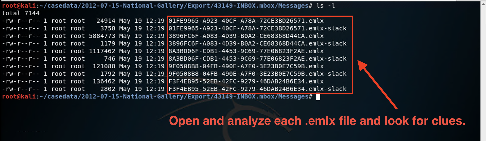
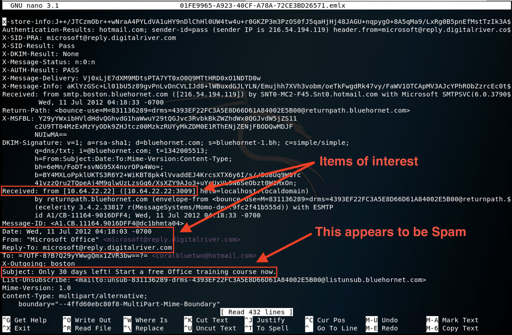
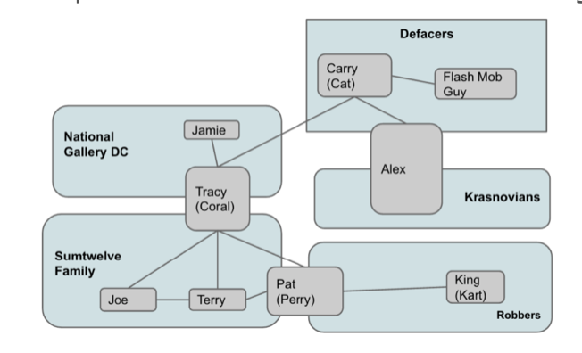
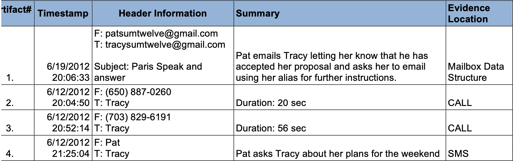
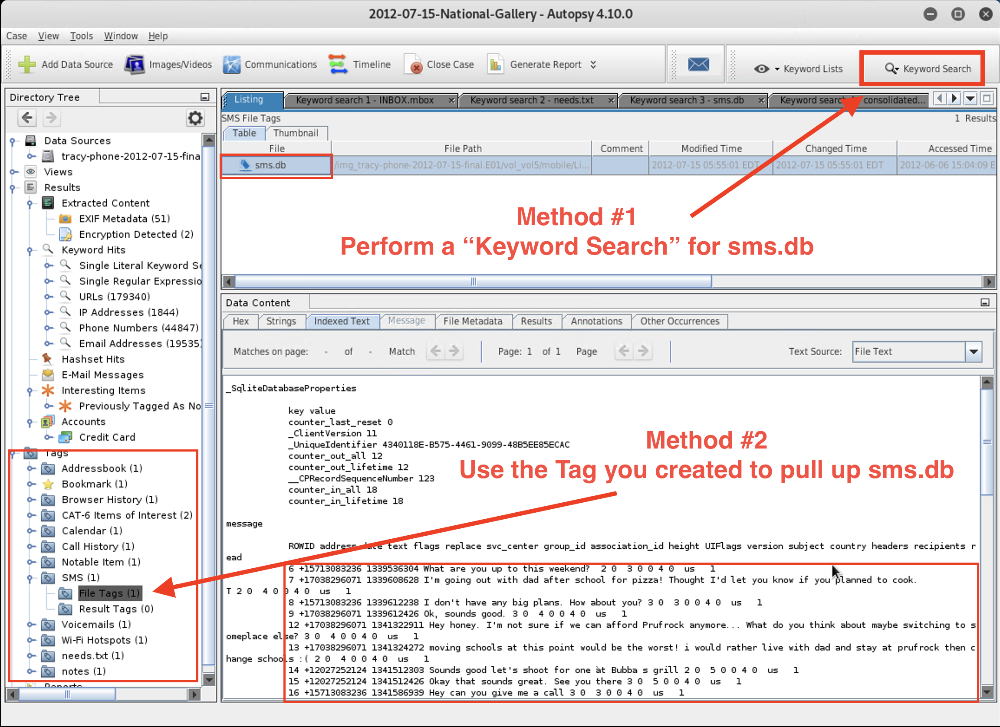
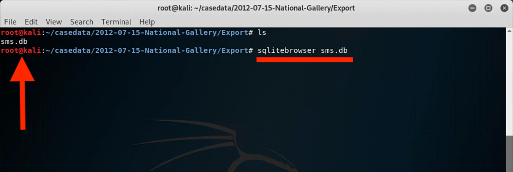
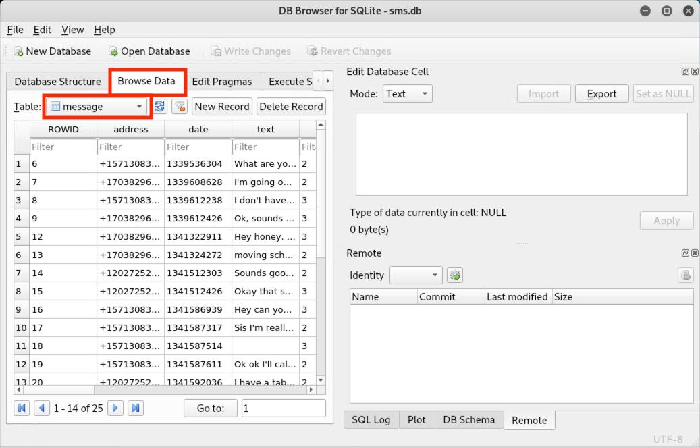
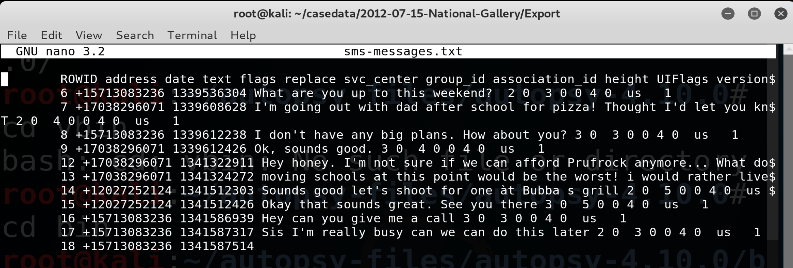

## 21.3 Lesson Plan: Evidence Acquisition and Reports

### Class Overview

Today we will conclude our introduction to digital forensics. Students will continue the investigation of Tracy's iPhone by examining emails, text messages, and web history. They will also produce a preliminary log and report on the evidence found.

### Class Objectives

By the end of class, students will be able to:

- Use Autopsy to view and gather evidence from Tracy's emails.
- Use data exports to analyze email messages offline.
- Use data exports to analyze SMS messages offline.
- Use Autopsy to extract GPS data and identify WiFi locations.
- Prepare a preliminary report using evidence worksheets.

### Instructor Notes

Today's class is segmented into the following parts:

- Review of exporting content from an iPhone image.
- Examining emails and SMS messages offline in Kali Linux.
- Preparing a preliminary report and presenting findings.

This class uses the same tools as the first two days:

- Autopsy 4.6.0
- 2012 National Gallery Case
- EnCase iPhone images

- **Important Note for the Next Class**: Remind students that for Certification Week, Day 1 they will be using CertMaster Practice in class. All students should make sure they have access to the tool and should be ready to use it during this unit.

### Lab Environment

Lab Details

 

In this unit, you will be using the Forensics lab environment located in Windows Azure Lab Services. RDP into the **Windows RDP host machine** using the following credentials:

  - Username: `azadmin`
  - Password: `p4ssw0rd*`

Open Hyper-V Manager to access the nested machine:

**Kali Forensics machine:**
  - Username: `root`
  - Password: `toor`

  

### Slideshow

- Slides for today's lesson can be found on Google Slides: [21.3 Slides](https://docs.google.com/presentation/d/19MCFJcIUPWK_LpHjLWAUvbKRaa9KvaQLblxKiwN7Ho0/edit).

- To add slides to the student-facing repository, download the slides as a PDF by navigating to File > "Download as" and choose "PDF document." Then, add the PDF file to your class repository along with other necessary files.

- **Note:** Editing access is not available for this document. If you or your students wish to modify the slides, please create a copy by navigating to File > "Make a copy...".

### Time Tracker
Time tracker for today's class is located here: [21.3 Time Tracker](https://docs.google.com/spreadsheets/d/1NR6AuKo_0tVbGQyL-MXRWdGfpDwwV2m1BJ9IByCRiac/edit#gid=1047115118)

- **Note:** Editing access is not available for this document. If you or your students wish to modify the slides, please create a copy by navigating to File > "Make a copy...".

### Student Guide

- Send the class a student-facing version of the lesson plan: [21.3 Student Guide](StudentGuide.md)

----

### 01. Instructor Do: Welcome and Overview (0:05)

Welcome students to the third day of the digital forensics units. Review what we covered in the last class:

- Identifying methods used in smartphone forensics.
- Examining databases and file structures of an iPhone directory image.
- Locating and documenting evidence of ownership for an iPhone image.
- Using Autopsy to view and tag evidence of an iPhone image.
- Extracting data for use in other applications (logs, text, pictures, video, audio).

We will begin class with a warm-up activity. Explain the following:

- As a forensic investigator, it's critical that you understand how to use tools such as Autopsy, and how to export data so other team members can perform offline analysis of evidence.

- .emlx is a file extension called Mail Message that’s used to store email messages.

- EMLX files are often referred to as Apple Mail files because they are created with Apple's mail program to store plain text files for a single message.

### 02. Student Do: Email Export (0:15)

Explain the following:

- In this activity, you will continue your role as a digital forensic investigator.

- Your task is to export the email database for offline analysis using examination tools outside of Autopsy.

Send students the following:

- [Activity File: Email Export](Activities/02_Email_Export/Unsolved/README.md)

### 03. Instructor Review: Email Export Activity (0:10)

This activity reinforced students' knowledge of Autopsy's export functions.

Reiterate the following concepts:

- File exports enable database information to be easily transferred to spreadsheets or word documents, where it can be integrated into reports and analyzed by other teams.

Completing this activity required the following steps:

- Use a keyword search to locate Tracy's email files.
- Perform a single file export for Tracy's emails.
- Verify the export to see if the EMLX files were successfully created in the `Export` directory.

Verify that all students successfully exported the emails.

### 04. Instructor Do: Tracy's Email Evidence (0:10)

Explain that we already exported Tracy's emails to the `Export` directory during the warm-up activity.

Now we'll use offline analysis to uncover details about the plot of the crime and possibly identify the co-conspirators and the roles they played.

#### Importance of Emails

Explain that we can extract critical information from emails, such as:

- Sender's email address
- Sender's IP address
- Internet Service Provider
- User client (email app)
- Location information

Point out that all of this information plays an important role in conducting a digital forensics investigation.

#### Examine Emails in Kali Linux

Explain that we will demonstrate how to display email messages in the `INBOX.mbox/Messages` folder.

- These emails were exported to the `INBOX.mbox/Messages` folder in Kali Linux during the warm-up activity.

Open a terminal window and navigate into the directory that contains the `INBOX.mbox` directory.  

- Run `ls -l` to see the full contents of the `Messages` folder.

Explain that within each of these EMLX files is a single email conversation string.

   

#### Search for Contact Information

In the next activity, students will continue their investigation by using Nano to view the contents of each EMLX file, as shown below.

   
  - They will also look at any email attachments and tag items of interest in Autopsy.

The following diagram provides a high-level overview of the threat actor's involvement in the 2012 National Gallery Case.

  - Students should use this as a roadmap to tie Tracy's associates to each incident.

     

 Review the following worksheet with students:

-  The [Correspondence Evidence Worksheet](https://docs.google.com/document/d/1mNnZzKAUVGQxExy8wDBMBWOyaBx7J6t3QLSbv4Eu5tI/edit#heading=h.x6git33zpmpj) is used to document evidence from the communications (i.e., phone calls, emails, text messages) found on Tracy's phone. Students should complete this as a group.

  - Students will fill out the following information:

      - Artifact numbers to help organize records
      - Timestamp (time email was sent or received)  
      - Header information
        - These should include names of the individuals involved, their email addresses, and the email subject line.
      - Key information
        - Summary of the email contents.
      - Evidence location
        - Source of the data (For example, Email, SMS, Phone call, etc. )

    

Pause to answer questions before proceeding.

### 05. Student Do: Tracy's Email Evidence (0:45)

Explain the following:

- In this activity, you will use Autopsy to view Tracy's email correspondence and generate a list of contacts and their email addresses.

- You will be assigned to work in a small group as part of a digital forensic team.

- You will create custom tags for the evidence in Autopsy.

- You will also document your findings using the Correspondence Evidence Worksheet.

- Remind students that these emails were exported to the `INBOX.mbox/Messages` directory during the warm-up activity, and this is where offline analysis can be performed.

- This will be a collaborative group effort. Break the class up into small groups of three or four.

Send students the following files:

- [Activity File: Tracy's Email Evidence](Activities/05_Emails/Unsolved/README.md)
- [Correspondence Evidence Worksheet](https://docs.google.com/document/d/1zS-QDGYhMnbZZrwcapIrwdn73fUoh3MSkaZCcX-7LUM/edit#)

### 06. Break (0:10)

### 07. Instructor Review: Tracy's Email Evidence Activity (0:10)

In the previous activity, students looked for evidence in Tracy's email communication relevant to the case.

- It's important for digital forensic investigators to have a clear understanding of how to perform email forensics.

- By examining Tracy's emails, we were able to uncover evidence that tied Tracy and her co-conspirators to the case.

- Emails provide a wealth of information that can be used to identify people involved in crimes and provide possible motives.

Completing this activity required the following steps:

- Use Nano to view and examine Tracy's emails.
- Use Autopsy's keyword search to locate email attachments.
- Document our findings by updating the Evidence Worksheet.

Send students the following solution file and worksheet answers and use them to guide your review.

- [Solution Guide: Tracy's Email Evidence](Activities/05_Emails/Solved/README.md)
- [Email Correspondence Evidence Worksheet Solution](https://docs.google.com/document/d/1Np5KQ0dcsmpqgcll321yXXdV9nWYWnxCeyIv8JNJjXA/edit#heading=h.x6git33zpmpj)

Pause to answer questions before proceeding.

### 08. Instructor Do: Tracy's SMS Messages (0:10)

Explain that in our last activity, we were able to identify an email attachment called `needs.txt` that contained a list of tools intended to assist with carrying out the crime.

We'll continue to search for more evidence by examining Tracy's SMS messages.

- Explain **SMS** messaging as follows:

   - SMS messages are what you know as text messages. SMS stands for "short message service" and is a person-to-person communication method.

   - SMS messages can be no more than 918 characters.

   - SMS messages can and have been used in DoS attacks.

   - **Smishing** is the term used to refer to a social engineering attack performed using SMS messages.

#### Forensic Analysis of SMS Messages Demonstration

Now, we will perform a short demonstration to view the SMS entries contained in the iPhone image.

There are four methods we can use to view these entries:

**Method 1**

 1. From the **Tools** menu, select **File Search by Attribute**.

 1. Click the box next to **Name** and type `sms.db`.

 1. Click the **Search** button.

 1. Select `sms.db` from the **Listing** pane.

 1. Select the **Indexed Text** tab in the **Data Content** pane to see Tracy's messages.

**Method 2**

Click the custom tag that you created earlier to load the `sms.db` file.

   - We can read this in the **Data Content** pane.

   

**Method 3**

Since this is a database file, we can also use a tool like SQLite Browser to read the messages.

  

 - Navigate to **Browse Data** and then the **message** table.

   

**Method 4**

Alternatively, we can export the file and use the Nano editor to read the messages.  

 

- In a real case, we'd want to hash everything before exporting and making any changes.

- For this investigation, you will need to associate phone numbers contained within the SMS messages to specific contacts.

Pause to answer any questions before proceeding.

### 09. Student Do: Tracy's SMS Messages (0:15)

Explain the following:

- In this activity, you will work with your group to examine Tracy's SMS messages and gather more information about the case.

- Keep your Correspondence Evidence Worksheet updated with your findings.

- You will also export the `sms.db` file so team members in other departments can use third-party software to perform analysis.

Send students the following:

- [Activity File: Tracy's SMS Messages](Activities/09_SMS/Unsolved/ReadMe.md)

### 10. Instructor Review: Tracy's SMS Messages (0:10)

This activity had students produce more evidence by using digital forensics tools to analyze SMS messages.

- The examination of Tracy's SMS messages uncovered additional information relevant to the 2012 National Gallery case.

- By performing SMS message forensics, students were able to produce two phone numbers and determine the  identities of each individual.

Completing this activity required the following steps:
- Using keyword search to locate the `sms.db` file.
- Using tags to locate the `sms.db` file.
- Examining the data content window for evidence.
- Updating the Correspondence Evidence Worksheet.

Send students the following and use it to guide your review:

- [Solution Guide: Tracy's SMS Messages](Activities/09_SMS/Solved/ReadMe.md)
- [Updated Correspondence with SMS](https://docs.google.com/document/d/1AsOqMrKfmU6h3a4Y2OmUuv7SSJo6Ge7_KxKMSQiTkz0/edit#)

Pause to answer any questions before proceeding.

### 11. Student Do: The Final Report (0:25)

In this activity, students will conclude their investigation by working in groups to analyze their findings and prepare a final report.

- Whatever students don't finish in class they can continue working on at home as part of their homework deliverable.

Explain the following:

- So far, you've examined quite a bit of information in the iPhone image and worked through the following steps:

  - Performed mobile forensic analysis and compiled details from Tracy's iPhone.
  - Searched through numerous files and directories on the iPhone image.
  - Tagged and categorized evidence relevant to the case.
  - Created custom tags.
  - Extracted data for offline analysis using the export function.
  - Examined and documented Tracy's emails.
  - Examined and documented Tracy's SMS messages.

Send students the following activity file and PDF document to help guide their work:

- [Activity File: Final Report](Activities/11_Final_Report/README.md)
- [Worksheet: Location Information Worksheet](https://docs.google.com/document/d/19ckQwWc2iPh7qzKVDnBAKoBS-DpVBCb2cFfAbLNrULk/edit#heading=h.x6git33zpmpj)
- [Worksheet: The Final Report](https://docs.google.com/document/d/1H528_nPqhfp_eOCzvyviwx5U3M1NiPTGtIFaoQoANbY/edit#heading=h.w4pkinqwxqi8)
- [ResourceEL iPhone Forensic Image - Important Files and Databases](https://docs.google.com/document/d/10CWGqTvu09mrSn7Tg7xoKNWBrjeW1wCmXoqB58xYr0k/edit#)

### 12. Everybody Do: Final Report (0:15)

Facilitate a group discussion about students' preliminary conclusions.

The following file contains the location data that students should have documented:

- [Location Information Solution Worksheet](https://docs.google.com/document/d/19aUDhf3CiL-cSR3dclBHJFnr7AOYPml-aFQ9C-g8tZs/edit)

**Instructor Note**: Do not send students the following document. Students will continue to work on their reports as homework.

- Refer to the following solution guide **for talking points**:

  - [Tracy's Final Report Solutions](instructor-assets/Tracy-iPhone-Answers.pdf)

- Pose the following questions to class.

  - What was Tracy's involvement in the case?

  - Who are the co-conspirators?

  - What evidence did you use to support your findings?

  - Were you able to establish the personas of other people involved? Sister, ex-husband, daughter, etc.?

  - Were you able to establish any aliases that people used?

  - Did you find any evidence relating to the theft of valuable stamps?

  - Did you find any evidence relating to the defacement of museum art?

Pause to answer questions before proceeding.

### 13. Instructor Do: Class Wrap-Up (0:10)

Explain that for homework, students will continue to work on Tracy's iPhone case and produce a final report as a deliverable.

There is also a bonus assignment case that students can work on as time allows.

Point out the following key takeaways from this lesson:

- Digital forensics is a field dedicated to identifying, extracting, preserving, and reporting against information obtained from computer and network systems.

- Digital forensics relies upon the expertise of examiners to analyze and interpret data retrieved by trusted forensics examination tools.

- Investigative teams may be spread across several times zones, so it's important to follow a baseline timezone as indicated by case file.

- **Important Note for the Next Class**: Remind students that for Certification Week, Day 1 they will be using CertMaster Practice in class. All students should make sure they have access to the tool and should be ready to use it during this unit.

- **Important Note for Career Prep Week**:

  - Let students know that in the unit following Certification Prep, students will take a closer look at the cyber career landscape and will learn practical tips on how to prepare for the job hunt, hone their resume, craft their LinkedIn profile, and ace the behavioral and technical interviews.

  - Students must come to class with a digital copy of their resume which they will be working on and sharing with their fellow peers.

  - Students must also have a LinkedIn profile set up as well. While they should have set up LinkedIn accounts during pre-work, anyone who has not yet done this should do so prior to Career Prep week.

Answer any questions before dismissing class.

----

&copy; 2020 Trilogy Education Services, a 2U Inc Brand. All Rights Reserved.
