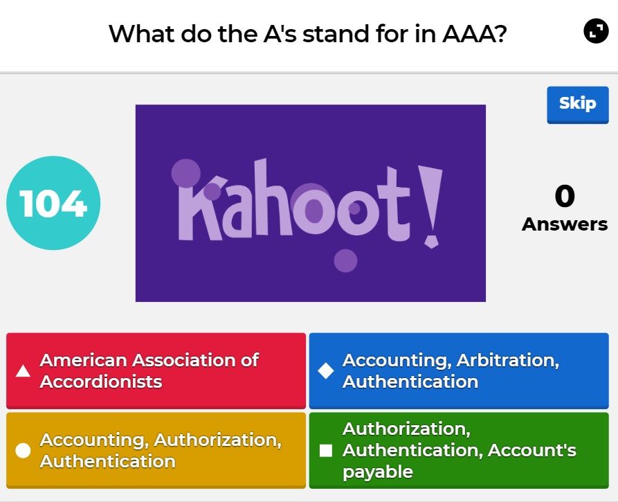
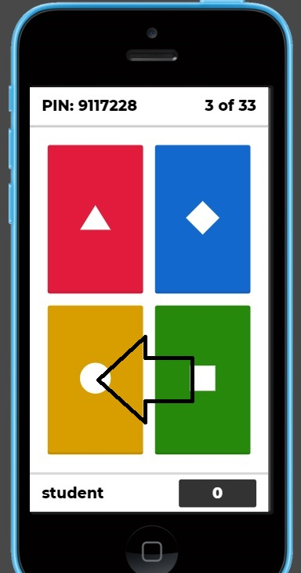

## 22.2 Lesson Plan: Security+

### Overview

In today's class, we will dive deeper into the domains covered by the Security+ exam. 

### Class Objectives

By the end of class, students will be able to:

- Explain how each domain is divided across the Security+ exam.

- Prepare for Security+ questions from domains and topics we have not explored in the curriculum, such as Architecture and Design and Identity and Access Management.

- Correctly answer Security+ practice questions. 

### Instructor Notes

- This day does not include activity files. Student Dos will consist of Google Form quizzes and a Kahoot group quiz activity. 

- Students will take practice quizzes on Google Forms. If you want to see how your class performs, each activity will provide instructor notes explaining how to create a copy of the quiz. Once you create a copy and distribute it to students, you will be able to view the responses. 

- Today's class will also use a group quiz activity hosted on Kahoot. If you are unfamiliar with Kahoot, take a moment to watch [this video](https://www.youtube.com/watch?v=BJ3Er1-tCMc) explaining how to run a Kahoot quiz.

### Slideshow

The lesson slides are available on Google Drive here: [22.2 Slides](https://docs.google.com/presentation/d/1zdBE1qP5k7i9tK3C44jVeoGLqn17OJAtwIU2NFzA-E0/edit)

- To add slides to the student-facing repository, download the slides as a PDF by navigating to File > "Download as" and choose "PDF document." Then, add the PDF file to your class repository along with any other necessary files.

- **Note:** Editing access is not available for this document. If you or your students wish to modify the slides, please create a copy by navigating to File > "Make a copy...".

### Time Tracker

The time tracker is available on Google Drive here: [22.2 Time Tracker](https://docs.google.com/spreadsheets/d/1cBB5ooOoYBoyeH-pIkCgDdKcDGy2J6OAegK1zOAzTis/edit#gid=1145703143)

- **Note:** Editing access is not available for this document. If you or your students wish to modify the slides, please create a copy by navigating to File > "Make a copy...".

### Student Guide
Send the class a student-facing version of the lesson plan: [22.2 Student Guide](StudentGuide.md) 

-------

### 01. Instructor Do: Welcome and Overview (0:05)

Begin class by welcoming students back and informing them that today we will continue to prepare for the Security+ exam.

First, review the topics taught in the last class:

- There are over 300 information security certifications from over 40 issuing organizations.

- These certifications are broken into three types: beginner certifications, advanced certifications, and specialized certifications.

- Information security professionals take different certification paths depending on what they are interested in.  
- One of the most popular beginner certifications is Security+.

  - One of the best methods to prepare for the Security+ exam is the CertMaster Practice tool, which students will have access to.

Explain that the first half of today's class will focus on several domains on the exam and the types of questions they contain. The second half of the class will be a fun quiz competition using a program called Kahoot.

Ask the class if they have any questions before continuing to the next lesson.

### 02. Instructor Do: Security+ Identity and Access Management (0:10)

Begin by reminding the class that the Security+ exam consists of the following five domains:
- 1.0 Attacks, Threats, and Vulnerabilities
- 2.0 Architecture and Design 
- 3.0 Implementation
- 4.0 Operations and Incident Response
- 5.0 Governance, Risk, and Compliance 
  
Show students the following slide with a breakdown of the domains. 

- 1.0 Attacks, Threats, and Vulnerabilities -  24%
- 2.0 Architecture and Design -  21%
- 3.0 Implementation -  25%
- 4.0 Operations and Incident Response  - 16%
- 5.0 Governance, Risk, and Compliance  - 14%


Explain that while there were many topics that were covered across these domains, there are several subdomains on the exam were outside the scope of this boot camp. 

- Therefore, we will review some of the types of questions you may see on the Security+ exam from these subdomains.


#### Identity and Access Management

We will first cover types of questions you may see covering the topic of Identity and Access Management.

**Note**: Identity and Access Management (IAM) was a dedicated domain in previous versions of the Security+ Exam. While it is no longer a domain, it is still a relevant topic that appears in multiple domains on the latest exam. In this section, we will look at IAM questions as they appear across various domains. 

Explain that Identity and Access Management covers the security policies that ensure that an organization's resources are only accessible by the right people, for the right reasons, at the right times.
  
- There are significant risks to incorrectly assigning access to resources.

 - For example, if an organization gives all staff access to payroll databases, they would be able to view PII and other private data of the organization and its employees. 

Across the different domains, there are several subdomains that contain questions covering IAM.

1. **2.4 - Summarize authentication and authorization design concepts.**

    - This subdomain focuses on the basic terms and concepts associated with IAM such as:
      - **Authentication, Authorization, and Accounting (AAA)**: The framework to best control access to an organization's resources.
      
        - Types of authentication factors:

          - Something you are: This includes biometrics, such as retina scanning or facial recognition.

          - Something you have: Such as tokens or key cards.
          
          - Something you know: Such as PINs and passwords.
      
   
        Pose the following question to the class and ask a volunteer to answer:
        ``` 
        Of the following authentication factors, which one is a different factor than a retina scan?
          (A) Hand geometry recognition
          (B) Voice recognition
          (C) Fingerprint recognition
          (D) Proximity cards 
          ```
  
        - The correct answer is D.
          - Proximity cards are "something you have" while the other options are all biometric factors ( "something you are").
  
2. **3.8 - Given a scenario, implement authentication and authorization solutions.**

    - This subdomain focuses on the the application of the concepts associated with IAM, such as authentication protocols like Kerberos, CHAP, and PAP.
        - **Kerberos** is an authentication protocol developed at MIT that uses tickets.

        - **Password Authentication Protocol (PAP)** uses a standard username and password to authenticate to a remote system. It is considered insecure. 

        - **Challenge-Handshake Authentication Protocol (CHAP)** uses a three-way handshake, making it more secure than PAP.

    
        Pose the following sample question to class:     
        ```
        Which of the following authentication protocols is considered insecure due to its lack of encryption?
          (A) EAP
          (B) SAP
          (C) PAP
          (D) CHAP
        ```
    
        - The correct answer is C. PAP is insecure and unencrypted. 


   - This subdomain also focuses on the management decisions to make sure the right people have access to the right resources for the right reasons. 
    - Various types of access controls include:
      - **Mandatory Access Control (MAC)**
      - **Discretionary Access Control (DAC)**
      - **Role Based Access Control (RBAC)**

   - This topic also focuses on selecting the most optimal access controls based on your organization's environment.

      - For example, voice recognition is an appropriate biometric control if your office environment is relatively quiet.
    
      Pose the following sample question to class: 

        ```
        For the following biometric controls, which would you select if you have a noisy office with good lighting and need a cost-efficient solution?
          (A) Voice recognition
          (B) DNA analysis
          (C) Fingerprint recognition
          (D) Speech recognition
        ```
  
      - The correct answer is C. A and D would not be optimal in a noisy office and B would likely be an expensive biometric solution.

        - If students ask about the difference between voice and speech recognition, explain that voice recognition detects speakers based on the characteristics specific to the person, while speech recognition detects the words, absent of any unique accents, inflections, or characteristics of the speaker. 

        - Speech recognition is "what was said" and voice recognition is "who said it." 


   - This subdomain also focuses on how user accounts are managed, such as the concept of least privilege, which students should be familiar with. 
      - This is the principle that an individual or system should be given the minimum access rights needed to complete their tasks.

    - Account types:
      - User accounts: The basic, standard account type of users at your organization. These accounts are usually limited in privileges.

      - Guest accounts: Allow non-employees to have limited access to your organizations resources.

      - Privileged accounts: Have greater access than user accounts and are provided to managers and system administrators.
    
      Pose the following sample question to class: 
      
        ```
        You have an an external auditor that needs limited access to your organization. What type of account should you provide them?
            (A) Guest Account
            (B) User Account
            (C) Sudo Account
            (D) Service Account
        ```  
        
       - The correct answer is A. You would provide a guest account to a non-employee who needed limited access.
     
 Explain that in the next activity students will get an opportunity to take a mini quiz on several multiple-choice and PBQ questions from these topics.
 

### 03. Student Do: Security+ Identity and Access Management (0:15)

Explain the following to students:

- You will be provided a quiz of PBQ and multiple-choice questions covering Identity and Access Management.

- You are tasked with completing all of the questions in the provided time.

Send students the following:

- [Google Form: Identity and Access Management Quiz](https://forms.gle/wxtZpELtv33i5StV8)
  
**Instructor Note:** If you would like to see the scores of your students, make a copy of [this version of the quiz](https://docs.google.com/forms/d/15acK0ltBnyE1UkJybUn1k9LhK1_SigBouqqlwjyLQo0/edit?usp=sharing):

  - After opening up the copy-able quiz, click the three-dot icon to the right of the **Send** button. 
  - Select **Make a copy**.
  - Send out your new copy.
  - To view the student scores, select **Responses** on the top-middle of your copy of the quiz.


### 04. Instructor Review: Security+ Identity and Access Management Activity (0:10)

Remind students that the goal of this activity was to practice Security+ questions covering Identity and Access Management, which were not covered in detail during our course.  Students were tasked with completing an online quiz which contained PBQ and multiple choice questions.

Students should be able to see their scores after submitting their answers and clicking **View Scores**. 

You can also send students the following pre-filled solution form: 
- [Solution Guide: Identity and Access Management Quiz](https://docs.google.com/forms/d/e/1FAIpQLSd6_wq4RgCBffUs8FQp1Knp_W_MeWi8wM6eGPMqkmBO9Ql9Ig/viewscore?viewscore=AE0zAgA3OlnOmtOjFrNlAbvN-tCOgMwrB2_CsM2R3HNQiEjSY9jBDH9FqhRZDkiVeHt9Qu8)


Answer any questions that remain before proceeding to the next lesson.

  
### 05. Instructor Do:  Security+ Architecture and Design Domain  (0:10)


In this section we will look at the Security+ Architecture and Design domain, as there were several subdomains not covered in our class

#### Security+ Architecture and Design

Explain that Architecture and Design covers the processes and controls used to protect the confidentiality, integrity, and availability of an organization's data.

Explain that within the Architecture and Design domain are eight subdomains: 

1. Explain the importance of security concepts in an enterprise environment.
2. Summarize virtualization and cloud computing concepts.
3. Summarize secure application development, deployment, and automation concepts. 
4. Summarize authentication and authorization design concepts.
5. Given a scenario, implement cybersecurity resilience.
6. Explain the security implications of embedded and specialized systems. 
7. Explain the importance of physical security controls. 
8. Summarize the basics of cryptographic concepts.


Note that while it is important for students to be familiar with all eight subdomains, this section will focus on three subdomains that have not been covered in our course: #3, #6, #7

#### Subdomain 3: Summarize secure application development, deployment, and automation concepts.

  - This subdomain focuses on the concepts and processes relevant to developing secure applications for organizations and their users.
  - Some terms that students should be familiar with include:
    - **Input Validation**: Restricts what data can be input to application fields, such as limiting non-ASCII characters.

    - Software development methodologies:
      - **Agile**: A flexible development method that allows changes to the development requirements.

      - **Waterfall**: A structured and rigid development method where each step of development cycle is dependent on the previous steps.
    
    Pose this question to the class:
  
    ```  
    What is the biggest risk of outputting detailed application errors with coding details?
      
      (A) There is no risk, and it is recommended.
      (B) Coding details could provide the developer's name.
      (C) Coding details could illustrate vulnerabilities in the application code, which a hacker can then exploit.
      (D) Coding details could show when the code was written.
    ```
  
    - The correct answer is C. Displaying the code details, such as the coding language, version, and structure, could provide vulnerability information for hackers to exploit.


#### Subdomain 6:  Explain the security implications of embedded and specialized systems.

  - This subdomain focuses on the security of systems that have hardware with software embedded within them.

    - A smart refrigerator is an example of an embedded system. A smart refrigerator has hardware and software embedded within it to complete specific tasks, such as monitoring temperature and determining if a filter needs replacing.


  - Students should become familiar with the following terms:
    -  **Supervisory Control and Data Acquisition (SCADA)**: A system used to control technical equipment in industries such as energy, oil, and water management.

    - **Internet of Things (IoT)**: The network of devices that are connected to the internet, which are considered an extension of the internet itself. These devices include smart light bulbs, smart refrigerators, printers, and door locks.
      - IoT is an expansive term relevant to many areas, such as smart houses, research and monitoring in the healthcare industry, wearable devices such as step counters, data collection in agriculture, manufacturing, and city management, and many, many more. 
    
      Pose the following sample question to class: 
      
        ``` 
        To protect their data, which type of systems are usually not connected to the internet?
          (A) Linux servers
          (B) Apache web servers
          (C) SCADA systems
          (D) Home office networks
        ```
  
       - The correct answer is C. While there are some SCADA systems that have limited connection to the internet, because they run high impact systems they usually are not connected.
  


#### Subdomain 7: Explain the importance of physical security controls. 

  - This subdomain focuses on concepts associated with physical security processes and controls.

  - Terms students should become familiar with include:
    - **Environmental controls**: For example, HVAC systems and fire suppression systems.
    
    - **Physical access controls**: For example, man traps and security guards.
    
    - **Physical control types**: For example:
      - **Deterrents**, such as alarms.
      - **Preventions**, such as locks or gates.
    
    Pose this question to the class: 
  
    ```
    What type of risk can a bollard protect against?

      (A) Fire
      (B) Flooding
      (C) Vehicle access
      (D) Script kiddies
     ```
  
    - The answer is C. A bollard is a short post built into the ground to protect areas from vehicle access.
     
In the next activity, students will take a mini quiz with several multiple choice and PBQ questions from the Architecture and Design domain.
 

### 06. Student Do: Security+ Architecture and Design Quiz (0:15)

Explain the following to students:

- You will be provided a quiz of PBQ and multiple choice questions from the Architecture and Design domain. 

- You are tasked with completing all of the questions in the provided time.

Send students the following:

- [Google Form: Architecture and Design Quiz](https://forms.gle/1AT2r9qY2xsyAcJj7)


**Instructor Note:** If you would like to see the scores of your students, make a copy of [this version of the quiz](https://docs.google.com/forms/d/1xA5U7mlsigpjrYxvWJl48kNb8p4kmZaPUB9Rb8vyLOs/edit?usp=sharing).
  - After opening up the copy-able quiz, click the three-dots icon to the right of the **Send** button. 
  - Select **Make a copy**.
  - Send out the copy.
  - To view the student scores, select **Responses** on the top-middle of your copy of the quiz.

### 07. Instructor Review: Security+ Architecture and Design Activity Quiz (0:10)


In this activity, students answered Security+ questions from the Architecture and Design domain. Students were tasked with completing an online quiz which contained PBQ and multiple choice questions.

Students should be able to evaluate their performance by clicking **View Scores** after submitting their answers. 

You can also send students the following pre-filled solution form: 
- [Solution Guide: Architecture and Design Quiz](https://docs.google.com/forms/d/e/1FAIpQLScL0jWlQxPsspGh-GZc2N6RojNi2lVyTn4NpNJ8Mk_tID_m2Q/viewscore?viewscore=AE0zAgCv-C-rr7shzIGnfWGg0iFonZ1zTIa99MwBq1ma1YPM16lGg5WJIqp6Ndyc8bYwYHY)


Answer any questions that remain before the class break. 

  
### 08. Break (0:15)


### 09. Instructor Do: Security+ Kahoot Competition (0:10)

Welcome students back from break and explain that the remaining part of today's class will be a fun and challenging quiz competition using Security+ questions.

Explain that we will be running this competition with an online learning tool called Kahoot.

#### What is Kahoot?

Explain that Kahoot is an web-based online tool offering the following features:
  - Displays questions and answers for students to select from in real-time.
  - Keeps track of individual and team scores.
  - Keeps track of remaining time for each question.
  
As an instructor, you can view the questions and answer choices on your projected or shared screen.

  - Display the following example:
  
     
  
Students can select an answer either from their computer or a mobile device.
  
- Display the following image as an example:

  

- Each answer has an associated shape or color.

For example, in the above question, the answer is Accounting, Authorization, Authentication.
- Therefore, students should select the gold circle icon.
- Students should be intentional about their choice. Once the answer is selected, it can not be changed.
   
   
  
Explain that once all the students answer the question, the correct answer will be displayed.

- Students' points will be calculated and their standings will be displayed before proceeding to the next question.
  
#### Kahoot Rules and Guidelines

Before beginning, review the rules and guidelines:

- There are a total of 30 Security+ questions.

- You will have two minutes to answer each question. 

- Points are awarded for correct answers. Additional points are awarded for how quickly you answer the questions compared to your classmates.

- Points are not deducted for incorrect answers.

- If you are competing as a team, one team captain should to be selected to answer the questions. 

  - **Note:** if your class is currently online, it will be easier if each student competes individually. 

- The questions will come from any of the six Security+ domains.

- You can use any available resource, e.g. books, the internet, or class notes.

- Any issues will be decided by the judges (the TAs and/or instructor). Issues may include:
  - Answer disputes
  - Frozen or lagging computers
  - Kahoot issues

- The team or individual with the most points at the end of 30 questions will be declared the winner. 
  
Ask the class if they have any questions about the Kahoot game or rules before proceeding to the competition.
 
### 10. Student Do: Security+ Kahoot Challenge  (1:00)
  
#### Kahoot Setup  
  
 Break the students into groups of 3-4 and select one team captain that will be responsible for submitting the answers. 

   - **Instructor Note:** If you are currently conducting the class online, it will be easier to have the students compete individually.
   
Start the Kahoot Security+ Challenge by accessing the following link:
 - [Kahoot Security+ Challenge](https://create.kahoot.it/share/security-battle-part-1/6c400f82-d6ba-4028-95c6-6a63fa31fbf9)
   
Complete the following steps:   

   - Select **Play**  if you are logged in. Select **Play as Guest** if you do not have a Kahoot account.

   - Select **Classic** if students are competing individually, and **Team Mode** if they are competing in groups.

     - Leave all the other options as default.

The next page will provide a unique code for the students to start the Kahoot challenge. (If using teams, only the team captain should complete the following.)

  - Follow the instructions on the screen by going to www.kahoot.it.

  - Enter the unique Kahoot code.
   
Select **Start** to begin. 

#### Kahoot Challenge Instructor Notes

After each question is answered by the students/groups, be sure to:
  - Point out how the students did and congratulate the students who answered correctly.

  - Explain the answer and ask the students if they have any questions.

  - Occasionally point out the leader board to encourage the competition. 

  - Check to make sure students are ready before proceeding to the next question.
    
  If a student group loses connectivity, have them refresh the page. They may still be connected to the game. 

  - If they are not, take a note of their score at that time and have them log back in again as a new player. Then, combine those scores at the end of the competition.
  
  - If there is a technical issue or problem with a question, ask the judges (your TAs) to make decisions on how to assign points.

### 11. Instructor Review: Security+ Kahoot Challenge  (0:10)

Once the competition is complete,  congratulate the winning individual or team.

Remind students that the goal of this Kahoot quiz was to provide examples of the types of multiple choice questions that they may see on the Security+ exam. 

  - Ask the class if they have additional questions on any of the questions from the Kahoot quiz.

  - If there are additional questions:

    - Access the [quiz link](https://create.kahoot.it/share/security-battle-part-1/6c400f82-d6ba-4028-95c6-6a63fa31fbf9) again. 
    - Select **Show answers** on the top-right to view all the questions and answers.

  - Additionally, send the same link to the students so they can practice this quiz again on their own time.  

Let the class know that in the next class, we will introduce the CEH and CISSP certifications.

Ask the class if they have any questions before wrapping up. 

-------
© 2020 Trilogy Education Services, a 2U, Inc. brand. All Rights Reserved.  

