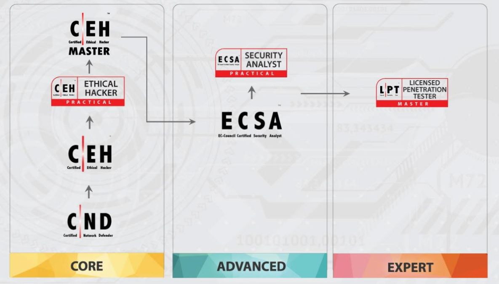

## 22.3 Lesson Plan: CEH and CISSP Certifications

### Overview

In today's class, we will introduce the CEH and CISSP certification exams. 

### Class Objectives

By the end of class, students will be able to:

- Understand the requirements for the CEH exam. 

- Understand the requirements for the CISSP exam. 

- Correctly answer practice questions. 


### Instructor Notes

- Today does not include activity files. Student Dos will consist of Google Form quizzes and a Kahoot group quiz activity. 

- Students will take practice quizzes on Google Forms. If you want to see how your class performs, each activity will provide instructor notes explaining how to create a copy of the quiz. Once you create a copy and distribute it to students, you will be able to view the responses. 

- Today's class will also use a group quiz activity using Kahoot. 


### Slideshow

The lesson slides are available on Google Drive here: [22.3 Slides](https://docs.google.com/presentation/d/1-RbDJa9ehbynfrGbTSr5-UQAETI0kk6oo-1M6jsAwI4/edit)

- To add slides to the student-facing repository, download the slides as a PDF by navigating to File > "Download as" and choose "PDF document." Then, add the PDF file to your class repository along with any other necessary files.

- **Note:** Editing access is not available for this document. If you or your students wish to modify the slides, please create a copy by navigating to File > "Make a copy...".

### Time Tracker

The time tracker is available on Google Drive here: [22.3 Time Tracker](https://docs.google.com/spreadsheets/d/1cBB5ooOoYBoyeH-pIkCgDdKcDGy2J6OAegK1zOAzTis/edit#gid=1047115118)

- **Note:** Editing access is not available for this document. If you or your students wish to modify the slides, please create a copy by navigating to File > "Make a copy...".

### Student Guide

- Share the solution guide with the class: [22.3 Student Guide](StudentGuide.md)

-------

### 01. Instructor Do: Introduction to Day 3 of Certification Test Prep Week (0:05)

Welcome students back to class and explain that today we will be covering the CEH and CISSP certifications.

Before we dive into these certifications, let's review the topics taught in the last class:

- The Security+ exam is broken up into five primary domains:
  - 1.0 Attacks, Threats, and Vulnerabilities
  - 2.0 Architecture and Design 
  - 3.0 Implementation
  - 4.0 Operations and Incident Response
  - 5.0 Governance, Risk, and Compliance 

- There are two topics on the exam which contain questions within several subdomains that were not covered in detail in our course:

  - Architecture and Design
  - Identity and Access Management

Emphasize to the class that they should plan to start studying for the Security+ exam shortly after this course ends.
 
  - The sooner they take the exam, the more they will be able to retain from the course and the more likely they will be to succeed.

Once students complete Security+, they may wonder which certifications they should pursue next. 
       
- The answer varies for each student, depending on their desired area of focus and how many years of experience they have in the field. 
 

 - Two of the most popular information security certifications that cyber professionals take after the Security+ exam are CEH and CISSP.
   
Explain that during the first half of the class we will introduce these two certifications, their requirements and prerequisites, details of the exam, topics covered, as well as several sample questions.   

In the second half of the class, we will return to the Kahoot quiz format to review sample questions from these exams.

Ask the class if they have any questions before continuing to the next section.

### 02. Instructor Do: Intro to Certified Ethical Hacker (CEH) (0:10)

Explain that CEH certifications are issued by EC-Council.

According to EC-Council: 
  - "The Certified Ethical Hacker (CEH) program is the most comprehensive ethical hacking course on the globe to help information security professionals grasp the fundamentals of ethical hacking. The course outcome helps you become a professional who systematically attempts to inspect network infrastructures with the consent of its owner to find security vulnerabilities which a malicious hacker could potentially exploit. The course helps you assess the security posture of an organization by identifying vulnerabilities in the network and system infrastructure to determine if unauthorized access is possible."


As of early 2020, there were almost 12,000 infosec job openings desiring a CEH certification. 


Jobs requiring CEH certifications include: 
- Security analysts
- Security engineers
- Security consultants
- Penetration testers

   
According to EC-Council: 
- "Certified Ethical Hacker program is a recognized certification for the Department of Defense's computer network defense Service Providers (CND-SP’s), a specialized personnel classification within the United States DoD's information assurance workforce."

#### Certification Domains
  
- Domain 1: Background (21.79%)
  - Includes the following subtopics:
    - Communication protocols (HTTP, FTP)
    - Telecommunication technologies
    - Backups and archiving

- Domain 2: Analysis/Assessment (12.73%)
  - Includes the following subtopics:
    - Data analysis
    - Risk assessments

- Domain 3: Security (23.73%)
  - Includes the following subtopics:
    - Firewalls
    - Cryptography
    - Vulnerabilities
    - Systems security controls

- Domain 4: Tools/Systems/Programs (28.91%)
  - Includes the following subtopics:
    - Port scanning (Nmap)
    - Vulnerability scanning (Nessus)
    - Network sniffers (Wireshark)

- Domain 5: Procedures/Methodology (8.77%)
  - Includes the following subtopics:
    - Security testing methodologies
    - Network routing
    - Security architecture

- Domain 6: Regulation/Policy (1.90%)
  - Includes questions on behavioral requirements for ethical hackers in accordance with laws and policies.

- Domain 7: Ethics (2.17%)
  - Includes questions on behaving ethically as an ethical hacker.

#### Exam Details

Cover the following details about the exam:

  - While considered an introductory exam, CEH is primarily focused on offensive security.

  - The exam is made up of 125 multiple-choice questions. 
  
  - Test takers have four hours to complete the exam.

  - To ensure integrity, EC-Council uses different exam forms for various questions.
  
  - The passing score can vary depending on the difficulty of the exam form. Passing scores range from 60-85%. 
 
  - The cost of the exam is $1,200, with an extra eligibility application fee of $100 if you are approved to take the exam without formal training.
  

#### Exam Requirements and Prerequisites  

If you currently have at least two years of information security experience, you can self-study for the exam without any formal training.
  - Your eligibility must be approved by EC-Council by submitting the [Exam Eligibility Form](https://cert.eccouncil.org/Exam-Eligibility-Form.html).
  
If you do not have the two years of information security experience, you will be required to take official EC-Council training for $850. 

  - Note that online and in-person courses are available.
  
#### Preparation Tips

Cover the following tips for successfully preparing for the exam:

- While there are many resources available to help prepare (books, online resources, study guides, apps), you should primarily focus on resources from the issuing organization to ensure you are studying the most current and relevant material.

- Take practice exams to get comfortable with the testing format.    

- Try to determine early on which domains are the most challenging, and focus your studies on those.

- Find and meet with study groups to get and provide encouragement during test preparation. 

- Create study guides and flashcards for common terms.

- Find video content for confusing subjects.

  - For example, if you do not understand a term or a concept, search YouTube for a visual explanation of that topic.

- Find an online community. There are many online blogs, forums (such as Reddit), and wiki pages dedicated to individuals preparing for the exam.
    
#### CEH-Specific Tips

- Memorize the most common ports and protocols.
- EC-Council provides free resources:
  - [CEH Exam Blueprint](https://www.eccouncil.org/wp-content/uploads/2016/02/CEH-Exam-Blueprint-v2.0.pdf)
  - [CEH Handbook](https://cert.eccouncil.org/images/doc/CEH-Handbook-v4.0.pdf) 

- Consider taking the EC-Council one-week boot camp course to prepare for the exam.   

- The exam is multiple choice, but practicing with hacking tools in virtual environments will help you understand each tool's purpose.

  
#### General Exam Tips

As with Security+ and other exams, test takers should adhere to general test taking tips:

- Take care of yourself.

  - Arrive early, well-rested, fed, hydrated, and relaxed.
- Pay attention.

  - Read each question and answer twice before deciding your answer.

  - Look for keywords in the questions, such as: "best," "most," or "least."

  - Always stay aware of how much time remains.

- If you're unsure of an answer, guess.
  - Eliminate the answers you know are not correct, and select from the remaining answers. You'll receive the same penalty for an incorrect answer as for an unanswered question, so always make a best guess.

#### EC-Council's Other Offerings 

After taking the CEH exam, you can pursue the following EC-Council certifications: 

  - The EC-Council offers a more advanced, hands-on ethical hacker certification, called CEH Practical.
    - The CEH Practical contains 20 questions. These challenge test takers to apply ethical hacking skills to real-world scenarios.

    - Provide the following URL in case students are interested in learning more about this certification: https://www.eccouncil.org/programs/certified-ethical-hacker-ceh-practical/

 - Additionally EC-Council offers these other advanced infosec certifications:
   - CEH Master
   - EC Council Certified Security Analyst (ECSA)
   - Licensed Penetration Testers LPT

    Present a visualization of the certification path.

    

Pose this example question to the class:

```
A denial of service or DOS attack is a type of cyberattack where a malicious individual makes system resources unavailable. This is often accomplished by flooding the system with erroneous requests.

Acme Corp just experienced a DOS attack. which of the following could be a symptom of this attack?

A. Acme Corp's database that contains salary information was modified to provide certain individuals higher salaries.
B. Acme Corp's customers are now reporting an error message when trying to access the Acme Corp homepage.
C. A hacker accessed a copy of Acme Corp's employee list and SSNs.
D. A hacker was able to successfully launch a SQL injection attack.
```   

  - The answer is B. The  goal of a DOS attack is to make system resources unavailable, such as websites. 

    
In the next activity, students will be provided a mini quiz on topics covered in the CEH exam.

  - The purpose of this quiz is to demonstrate the types of topics and questions they may encounter on the CEH exam.

Ask the class if they have any questions before proceeding to the activity.


### 03. Student Do: CEH Practice Quiz (0:15)

Explain the following to students:

In this activity, you will complete sample CEH exam questions.

Send students the following:

- [Google Forms: CEH Quiz](https://forms.gle/QkYh4vf6KxCAK3vH7)


**Instructor Note:** You can keep track of your students' scores by creating and sharing a copy of [this version of the quiz](https://docs.google.com/forms/d/1bBa0Ybd6e7lG8z_alG5mYUWeCyqQCD6zHmr7NRn8yrc/edit).
- Open the quiz, click the three-dot icon and select **Make a copy**.
- Send out the new copy.
- To view the student scores, select **Responses** on the top-middle of your copy of the quiz.

### 04. Instructor Review: CEH Practice Quiz (0:05)

In this activity, students answered questions from the CEH exam. Students were tasked with completing an online quiz containing multiple choice questions.

Students should be able to evaluate their performance by clicking **View Scores** after submitting their answers. 

You can also send students the following pre-filled solution form: 
- [Solution Guide: CEH Practice Quiz](https://docs.google.com/forms/d/e/1FAIpQLSfPBdxn0EDevbujF3abBseCEkyl2Od3xHVvREOlCWyBEiSzPQ/viewscore?viewscore=AE0zAgCB8zdd_3u2aQfUk8QdLwMxefotARYnKLp17NxVdpkhJl1CiOaoJjksD5MO7RO4NZw)


Let the class know that if they are interested in an official CEH practice exam, they should visit the following link: https://www.eccouncil.org/programs/certified-ethical-hacker-ceh/ceh-assessment/.


Answer any questions that remain before proceeding to the next section. 
  
### 05. Instructor Do:  Intro to CISSP  (0:15)

Explain that the Certified Information Systems Security Professional (CISSP) certification is one of the most popular advanced certifications in the infosec industry. 

- As an advanced certification, many professionals do not attempt the exam until they have worked in information security for several years.


Explain that the CISSP is often considered the "gold standard" of information security certifications for the following reasons:

- As of early 2020, CISSP was the most desired certification, [with around 54,500 open positions](https://www.businessnewsdaily.com/10708-information-security-certifications.html) listing it as desired or required.
 - Per (ISC)², the average salary for CISSP jobs is $131,030.
 - More than 129,000 professionals hold the CISSP certification.

#### CISSP Overview

CISSP is issued by (ISC)². According to (ISC)²: 
  - "The CISSP is ideal for information security professionals seeking to prove their understanding of cybersecurity strategy and hands-on implementation. It shows you have the advanced knowledge and technical skills to design, develop and manage an organization’s overall security posture."

Jobs requiring CISSP certification may include:

- Chief information officer
- Chief information security officer
- Director of information security
- Security consultants
- Security analysts
- Security engineers
   
CISSP is also approved for Department of Defense positions.

#### Exam Domains
  
- Domain 1: Security and Risk Management (15%)
  - Includes the following subtopics:
    - Confidentiality, integrity, and availability
    - Business continuity

- Domain 2: Asset Security  (10%)
  - Includes the following subtopics:
    - Data security controls
    - Identifying and classifying information and assets

- Domain 3: Security Architecture and Engineering (13%)
  - Includes the following subtopics:
    - Vulnerabilities in web-based, mobile, and embedded systems
    - Secure design principles

- Domain 4: Communication and Network Security (14%)
  - Includes the following subtopics:
    - Secure network components
    - Secure network architecture

- Domain 5: Identity and Access Management (IAM) (13%)
  - Includes the following subtopics:
    - Physical and logical access security
    - Identification and authentication of services and devices

- Domain 6: Security Assessment and Testing (12%)
  - Includes the following subtopics:
    - Security control testing
    - Security audits

- Domain 7: Security Operations (13%)
  - Includes the following subtopics:
    - Incident management
    - Disaster recovery plans

- Domain 8: Software Development Security (10%)
  - Includes the following subtopics:
    - Security in the software development lifecycle
    - Security of acquired software


#### Exam Details

Cover the following details about the exam:

- The cost of the exam is $699.
- The exam is in the Computer Adaptive Testing (CAT) format.
  - A CAT exam adjusts the questions based on how the test taker performs during the exam.

  - If possible, play or share this brief video explaining the CAT testing format:  
    - [YouTube: What Does CISSP CAT Mean for You?](https://youtu.be/sw7Sko24epY)

- The test is three hours long and consists of 100-150 questions.   
  - Once you complete a question, you cannot adjust the answer.

  - Question types are multiple choice and drag-and-drop, referred to as advanced innovative questions.

- If you pass, you will not receive your exact score, only a notification that you passed.
  - If you do not pass the exam, you will receive your score.

  
#### CISSP Prerequisites

- Option 1 - CISSP Credentials: If you currently have five years of information security experience in two of the eight domains listed, you can register to take the exam. Note that one year can be replaced with relevant completed education.  

  - After passing the exam, you have nine months to complete your endorsement, in which an (ISC)² certified professional attests to your professional experience.

  - Once the endorsement is approved by (ISC)², you are granted your CISSP credentials.
  
- Option 2 - Associate CISSP Credentials: If you currently do not have the five years of information security experience in two of the eight domains listed, you can still take the exam.

  - After passing the exam, you will be granted an Associate CISSP certification.

  - Once you have met the professional requirements of five years in two of the eight domains, you can begin the endorsement process.


#### CISSP-Specific Tips

- Begin preparing at least three months before the exam. 

- Use mnemonics to help study. For example, for the OSI layers: **P**lease **D**o **N**ot **T**ouch **S**teve's **P**et **A**lligator 

- Consider taking the (ISC)² one-week boot camp course to prepare for the exam.
  
- Answer questions as if you were the CISO of an organization.

Pose this example question to the class:

```
An organization with 130 employees using symmetric encryption is considering moving to asymmetric encryption. How would this affect their number of keys?

A. 260 more keys
B. 8,000 fewer keys
C. 5,605 more keys
D. 8,125 fewer keys

```

The answer is D. The organization would have 8,125 fewer keys:

- Symmetric Formula = n(n - 1)/2 
  
    130 * 129 / 2 = 8,385
    
- Asymmetric Formula = n * 2
  
  130 * 2 = 260 

- Difference: 
  
  8,385 - 260 = (D) 8,125 fewer keys


In the next activity, you students will complete a mini quiz on topics covered in the CISSP exam.

  - The purpose of this quiz is to demonstrate the types of topics and questions they may encounter on the CISSP exam.

Ask the class if they have any questions before proceeding to the activity.


### 06. Student Do: CISSP Practice Quiz  (0:15)


Explain the following to students:

In this activity, you will complete sample CISSP exam questions.

Send students the following:

- [Google Forms: CISSP Quiz](https://forms.gle/5pchS86y55c1yP8Q6)

**Instructor Note:** You can keep track of your students' scores by creating and sharing a copy of [this version of the quiz](https://docs.google.com/forms/d/1Qo1WEyMEHk-YM2zt66ODQtjF3r5Tec6PJ3_R4rcBAJE/edit). 
- Open the quiz, click the three-dot icon and select **Make a copy**.
- Send out the new copy.
- To view the student scores, select **Responses** on the top-middle of your copy of the quiz.

### 07. Instructor Review: CISSP Practice Quiz  (0:07)


In this activity, students answered questions from the CISSP exam. Students were tasked with completing an online quiz containing multiple choice questions.

Students should be able to evaluate their performance by clicking **View Scores** after submitting their answers. 

You can also send students the following pre-filled solution form: 
- [Solution Guide: CISSP Practice Quiz](https://docs.google.com/forms/d/e/1FAIpQLSf6zWzqe9YhQcChfeqiHP5eFajY6tnsl-BczFuG408pqpTUXg/viewscore?viewscore=AE0zAgCkukjGaq6ZxdEuk8oRREsN4z6UXIbB2JsPHmmwyt4xvcqFwUEOx4gwaWA4Od-L_NE) 

  
### 08. Break (0:15)


### 09. Instructor Do: CEH and CISSP Kahoot Challenge (1:00)

Welcome the students back from break and explain that we will now use Kahoot once again to compete in a CEH and CISSP quiz. 

- The rules and guidelines remain the same as last class. 

Before each question, identify if the question comes from the CEH or CISSP exam.
      
**Kahoot Rules**  

Display and review the Kahoot rules as a refresher:

- There are a total of 30 questions: 15 CEH questions and 15 CISSP questions. 

- You have two minutes to answer each question. 

- Points are awarded for correct answers. Additional points are awarded for how quickly you answer the questions compared to your classmates.

- Points are not deducted for incorrect answers.

- If you are competing as a team, one team captain will be selected to answer the questions. 

  - **Note:** if your class is currently online, it will be easier if each student competes individually. 

- You can use any resource for guidance, e.g., books, the internet, class notes, etc.

- Any issues will be decided by the judges (the TAs and/or instructor). Issues may include:
  - Answer disputes
  - Frozen or lagging computers
  - Kahoot issues

- The team or individual with the most points at the end of 30 questions will be declared the winner.
  
Ask the class if they have any questions on the Kahoot game or rules before proceeding to the competition.
 

  
#### Kahoot Setup  

 Break the students into their groups and select one team captain for each who will be responsible for submitting the answers.

   - **Instructor Note**: If you are currently conducting the class online, it will be easier to have students compete individually.
   
Start the Kahoot Challenge by accessing the following link:

- [CEH and CISSP Kahoot Challenge](https://create.kahoot.it/share/ceh-and-cissp-battle/ba35a5ca-1422-4392-8901-d793890c5761)

Select **Play**  if you are logged in. Select **Play as Guest** if you do not have a Kahoot account.
   - Select **Classic** if students are competing individually and **Team Mode** if they are competing in groups.
    - Leave all the other options as default.

The next page will provide a unique code for the students to start the Kahoot challenge. (If using teams, only the team captain should complete the following.)

  - Follow the instructions on the screen by going to www.kahoot.it.
  - Enter in the unique Kahoot code.

Select **Start** to begin. 

### 11. Instructor Review: CEH and CISSP Kahoot Challenge  (0:05)


Once the competition is complete,  congratulate the winning individual or team.

Remind students that the goal of this Kahoot quiz was to provide examples of the types of multiple choice questions that they may see on the CEH and CISSP exams. 

- Point out that the CISSP exam questions will likely be much harder and often have scenarios in their questions.

- Ask the class if they have any additional questions on any of the questions from the Kahoot quiz.

- If there are additional questions:
  - Access the [quiz link](https://create.kahoot.it/share/ceh-and-cissp-battle/ba35a5ca-1422-4392-8901-d793890c5761) again. 

  - Select **Show answers** on the top-right to view all the questions and answers.

- Additionally, send this link to the students so they can practice the quiz again on their own time.  

-------

© 2020 Trilogy Education Services, a 2U, Inc. brand. All Rights Reserved.  
