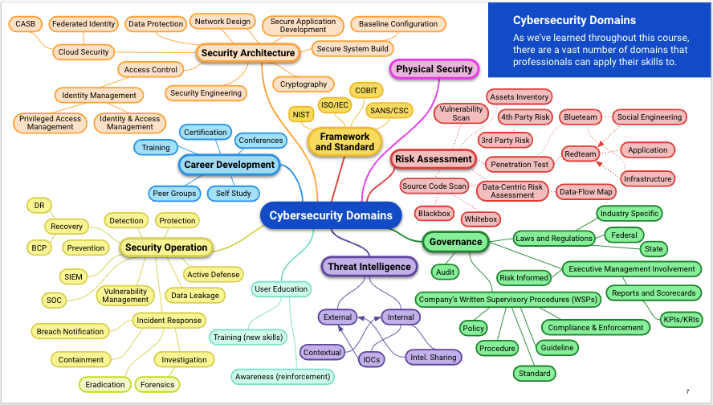
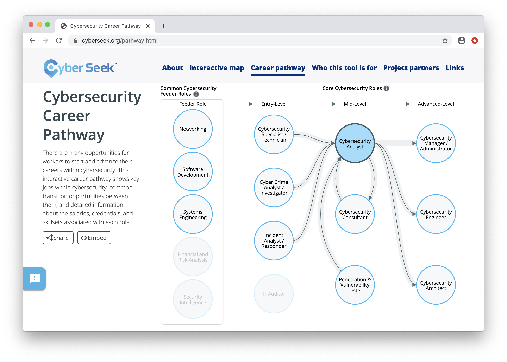
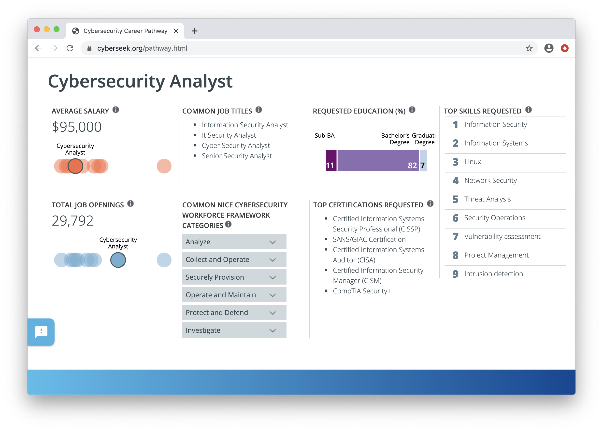
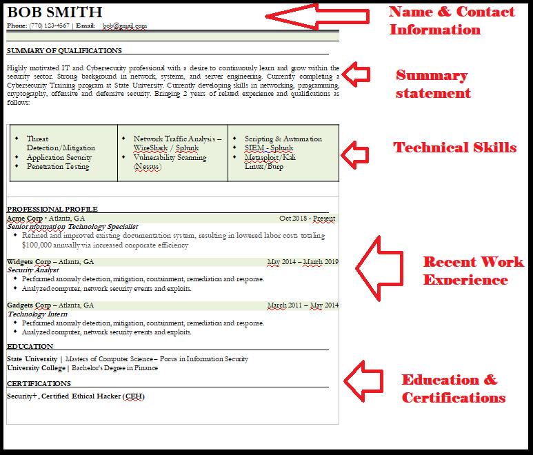

## 23.1 Lesson Plan: Intro to Career Prep

### Overview

In today's class, students will learn how to optimize their cybersecurity job searches. They will use online resources to map out their desired path and build their professional network. They will also update their resumes and LinkedIn profiles to be better suited for the job hunt. 

### Class Objectives

By the end of class, students will be able to:

- Identify a cyber career field they are interested in and map out a career path towards a desired role. 

- Begin developing their professional network. 

- Update their resumes and LinkedIn profile for the cybersecurity job application process. 

### Instructor Notes

### Slideshow

The lesson slides are available on Google Drive here: [23.1 Slides](https://docs.google.com/presentation/d/17DcYPYUTU832CiVubeKIMjOMG_ETGGtQA31OC4nJyHk/edit#slide=id.g480f0dd0a7_0_1803)

- To add slides to the student-facing repository, download the slides as a PDF by navigating to File > "Download as" and choose "PDF document." Then, add the PDF file to your class repository along with any other necessary files.

- **Note:** Editing access is not available for this document. If you or your students wish to modify the slides, please create a copy by navigating to File > "Make a copy...".

### Time Tracker

The time tracker is available on Google Drive here: [23.1 Time Tracker](https://docs.google.com/spreadsheets/d/1i3AYPS29ZSpb05xd0DiEi9sb-2easnYVh5vkMgrE_G8/edit#gid=0)

- **Note:** Editing access is not available for this document. If you or your students wish to modify the slides, please create a copy by navigating to File > "Make a copy...".

### Student Guide

- [23.1 Student Guide](StudentGuide.md)

-------

### 01. Instructor Do: Welcome to Career Week (0:05)

Welcome students to class and explain that as students approach the conclusion of this boot camp, they should begin preparing for their job search. 

- The skills and tools learned throughout the past 22 weeks have undoubtedly prepared students to begin their cybersecurity career. 

- Explain that, while it would be nice if organizations were now lined up at the door handing out job offers, a competitive job market requires an additional set of skills. 

- In the coming weeks, students will need to apply job hunting skills that position them to get interviews and, subsequently, job offers.

Over the next two classes, we will cover cybersecurity career prep skills that will help students get interviews and land jobs. Topics include:

- Finding your cybersecurity career path.
- Building your cybersecurity network.
- Non-traditional job searching.
- Building a powerful resume and LinkedIn profile.
- Behavioral and technical interview tips.

Explain that in the next class, we will conduct mock interviews in which students will play the roles of both interviewee and interviewer.

- Ask the class if they have any questions before proceeding to the next section.

### 02. Instructor Do: Introduction to Cyber Career Paths (0:10)

Remind students that in the very first week of class, we introduced the vast amount of domains and specialties that exist in the cybersecurity industry.

Display that following image as a refresher:

  

As we moved throughout the course, we highlighted roles relevant to different skills and domains. 

- Hopefully, students have started thinking about which cyber domains and positions they are interested in.
 
Understanding and mapping out career paths is an important way for students to begin their job search.  
 
If you ask a cyber professional how they found their way into the industry, many will share one of following responses:
- They started in careers outside of IT. 
- Before entering a cyber-specific role, they had to work in one or many IT roles. 
  
#### Finding Career Paths

Provide the following resources to assist with exploration of common career paths:

- [Cyberseek](https://www.cyberseek.org/pathway.html) provides information about supply and demand in the cybersecurity job market. 

  - Clicking on any of the featured roles will display helpful information, such as number of job openings, average salaries, and desired skills and certifications.    
   
 
  
 
 

- [LinkedIn](https://www.linkedin.com/) shows real professionals' career pathways and development. 

  - In the next activity, students will use LinkedIn to research several cybersecurity professionals career paths.
 
### 03. Student Do: Career Paths (0:15)

Explain the following to students:

- In this activity, you will use LinkedIn to research career paths of several cybersecurity professionals.

- Focusing on a role your are interested in, you will find five infosec professionals who are currently working in that role, and document their career path. 

Send students the following:

- [Activity File: Career Paths](Activities/03_Career_Paths/unsolved/readme.md)

### 04. Instructor Review: Career Paths Activity (0:05)

This activity illustrated the various career paths that cybersecurity professionals take to reach different positions. Students were tasked with identifying a cyber career field they are interested in, finding five professionals working in that field, and documenting their career paths.

Note that there is no formal solution file. Each student will likely have different findings depending on the career field and cyber professionals they selected.

- Ask several students to share their findings with the class.

Answer any questions that remain before proceeding to the next section. 

### 05. Instructor Do: Cyber Networking (0:10)

Explain to the class that one of the best methods for landing a cybersecurity job is to build and connect with their **cyber network**.

  - Explain that the cybersecurity industry, while growing each year, is considered a tight-knit, highly connected group of professionals.
  
Explain that establishing connections and building your network can help with the following:
- Through connections, you can meet other industry professionals, many of whom are actively hiring.
  - Hiring managers often circumvent the traditional job posting process and hire from personal recommendations.

- Networking can provide resources for specific cyber domains.
  - For example, if you need to find a mobile forensic specialist and have a large network, it's likely that your network contains the specialist you need. 

- Connecting with professionals who are associated with trusted third-party companies and vendors can give you access to better pricing and personalized service. 
  - For example, a contact who works for a SIEM vendor could come in handy if you are looking for SIEM products for your organization. 
  
Explain that it may feel challenging to break into a cyber network or connect with cyber professionals. 

- Point out that just from joining this class, they already have a cyber network consisting of the students and TAs in the class.

- Recommend that students connect to each other through LinkedIn if they haven't already.
  
Explain that the best way to build their network is to join local cyber groups, chapters, and professional associations. 

  - Many of these have members who are also very new to the industry.
  
The benefits of joining these local cyber groups include:
- Regional specificity
- Welcoming attitude towards new professionals
- Monthly meetings, trainings, and social events
- Inexpensive or free membership and event cost

While many groups are offered for general cyber networking, there are also groups with specialized focuses, such as:

- Groups that emphasize certain technologies, such as cloud security groups like Cloud Security Alliance (CSA).

- Groups that focus on specific industries, such as banking and finance security groups like Financial Services Information Sharing and Analysis Center (FSISAC).

- Groups that connect people from specific demographics, such as the Women in CyberSecurity (WiCS).

Explain that in the next activity, the students will be tasked with researching (and hopefully joining) their local cyber groups, chapters, and associations.

### 06. Student Do:  Building Your Cyber Network  (0:15)

Explain the following to students:

- In this activity, you will build your cyber network by finding information security groups/chapters local to your area.

- You must first research what local chapters exist in your area.

- You will select one or two that you are interested in joining, and answer several questions about your findings.

Send students the following:

- [Activity File: Building Your Cyber Network](Activities/06_Cyber_Network/unsolved/readme.md)

### 07. Instructor Review: Building Your Cyber Network Activity (0:05)

Hopefully students were able to find and join cyber groups, networks, and chapters in their local areas.

There is no formal solution file as each student will likely have different findings depending on the chapters or groups they are interested in. Ask several students to share their findings with the class.

Answer any questions that remain before proceeding to the next lesson.

### 08. Instructor Do: Non-Traditional Job Searching (0:15)

While networking is an excellent way to increase your chances of landing an interview, it must be combined with additional job searching approaches. 

Explain that job searching requires casting a large net. The wider and more diverse your search, the more likely it is you'll find something. 

Now we'll discuss some traditional and non-traditional job searching methods.

#### Traditional Job Search Methods

Traditional job search methods include: 
- Searching websites like Indeed, Dice, and Monster.com.
- Searching for open positions on LinkedIn.
- Working with a recruiter. 

These methods are popular because of their comparatively easy application processes and the clarity of details in job postings.  

- However, this simplicity means you are often one of thousands of applicants. 

- The person reviewing the job applications will only know you by the information on your resume or job profile. 
  

Due to these limitations, many cybersecurity professionals often use non-traditional approaches for finding open positions.    

#### Non-Traditional Job Search Methods

Cybersecurity professionals often use their creative thinking skills to "hack" the traditional approaches to job searching. These hacks include:

- Proposing that an employer create a position for your skills. 
    - You can mention what you observe to be the organization's challenges or areas of need, and how your skills can address them.

    - This is most successful with organizations where you have a personal connection.
    
- Sharing your skills on platforms other than LinkedIn and your resume.
    - Create blogs, custom websites, and videos to advertise your skills and find potential employers.

- Attending cyber events in which the primary purpose of the event is not job searching.

    - Increase your odds by attending cyber trade shows and conferences where you are one of fewer individuals looking for open positions.

- Reach out directly to the real decision maker at an organization. We'll discuss this more in a moment. 

Ask the class if they have used or can think of any other non-traditional methods.

#### Contacting the Decision Maker Demonstration

Recruiters and talent acquisition staff often manage an organization's hiring process. But they are the gatekeepers, not the ones who make the final hiring decision.

- The final hiring decisions are typically made by the managers and cybersecurity department leaders.

A quick LinkedIn search can be the first step to finding the decision maker.

  - Go to LinkedIn and run a search with the following format:
    - Cyber Manager [Company] [City]  or Security Director [Company] [City]

    - For example:  Cyber Manager Microsoft Chicago

- Look through the results and try to find someone who looks like they're responsible for hiring, building, and managing the cybersecurity team. 

Once we find this person, we can introduce ourselves with a message similar to the one below. 

  - Note that this is a soft first introduction. There is no specific mention of open positions. That can be discussed in future meetings.

    Hi [First Name]!

      I’m [Your Name], an aspiring cybersecurity professional transitioning from a career in [previous career]. As I make this transition, I am mapping out my job aspirations and pathways—I came across your profile and thought you would be a great person to reach out to for some advice. 

      I recently graduated [or am about to graduate] from the cybersecurity boot camp at [your university], where I studied offensive and defensive security, web application security, and governance and compliance.  I am also currently working [or worked] on some exciting new projects, including [one-line project description].

      I would love to link up and pick your brain about how you got started, what you do at [company they work at], and how you maintain your expertise. Let me know if you’re available to grab some coffee or set up a quick phone or Zoom call sometime.

      Looking forward to hearing from you soon!

      Thanks in advance,

      [Your Name]

      
Explain that in the next activity, students will get to apply this non-traditional job search method by finding decision makers at organizations in their local area. 
      
### 09. Student Do: Hacking Your Job Search (0:15)

Explain the following to students:

- In this activity, you will "hack" your job search by applying non-traditional job searching methods.

- By finding the decision makers in an organization, you can unlock a more direct and effective application pipeline.   

- Once you find the person in charge, create (but don't send) an email introducing yourself. 

- Exchange the composed emails with a partner, who will proofread and provide feedback. 

- At a later time, when your resume and LinkedIn profile are ready, you can send the email. 

Send students the following:

- [Activity File: Hacking Your Job Search](Activities/09_Hacking_Your_Search/unsolved/readme.md)

### 10. Instructor Review: Hacking Your Job Search Activity  (0:05)

Emphasize that once students' other job search materials are ready, they will be able to send those emails and hopefully establish a new contact in their cyber network. 

There is no formal solution file, but encourage students to continue drafting these emails as they prepare to search for jobs. 

### 11. Break (0:15)

### 12. Instructor Do: Intro to Resumes and LinkedIn (0:05)

Welcome the students back from break and explain that the second half of today's class will be dedicated to crafting a powerful resume and LinkedIn profile.

  - Explain that in today's cybersecurity job market, it is typically a requirement for all candidates to have a resume and a LinkedIn profile.
  
 - A resume and LinkedIn profile is essential during a job search, and a poor resume and profile can potentially eliminate you from consideration for a position.
 
In the next two sections, we will cover: 
  - How employers use resumes and LinkedIn to find the best candidate.

  - Tips on how to design powerful resumes and LinkedIn profiles to increase your chances of landing an interview.

  - Common resume and LinkedIn profile mistakes to avoid.
   
After we review these best practices, you will use them to create or redesign your resume.
  
Ask the class if they have any questions before proceeding to the next section.  

### 13. Instructor Do: Resumes (0:15)

Explain that while employers may like to meet and speak with every potential candidate, it is not an efficient use of their time. Therefore, resumes provide a snapshot of a candidate to help employers decide if they should be pursued.

- A resume is a company's first impression of you.

- You should think of a resume as an opportunity to professionally show off your work experience, education, technical skills, and career accomplishments.

- While having a superior resume can increase your odds of landing an interview, having an inferior resume can quickly eliminate you from consideration, even if you are qualified for a position.

Emphasize that resumes may seem like a simple concept, especially compared to all the technical skills they've been learning throughout this course. But to be as appealing as possible to job recruiters, students must be thoughtful and precise regarding what they include in their resume. 

#### The Basics of a Resume

Resumes should be: 

- One page in length.
    - Keep resumes concise by including only relevant information.
    - If you have more than 10 years of work experience, only include the most recent 10 years.

- Professional in tone.
    - Resumes are made professional by maintaining grammatical accuracy, making sure all information provided is correct, and using appropriate word choice.

- Aesthetically pleasing.
    - Make sure bullet points align, font types, colors, and sizes are consistent, and the content is easily digestible.

Resumes should follow this structure: 
  - Name and contact information
  - Summary statement
  - Technical skills
  - Recent work experience
  - Educational background
  
 

 
Let's take a closer look at each section.
 
 
#### Name and Contact Information
  
Explain that while this section is usually straightforward, consider the following: 

- Use the same name that appears on your LinkedIn. Do not use a nickname.

- Do not list a home address.

- Add your phone number and email.  

- Consider using a professional, security-based email provider such as ProtonMail.

- Make sure your email name is also professional and easily identifiable. 
    - For example, xavier.wallace@protonmail.com is professional, while letsgomets1986@protonmail.com is not. 
  
#### Summary Statement

Summary statements are placed at the top of a resume to give the employer a preview of the candidate's expertise and personal motivations.

- The summary statement should show your passion, professional interest, value, and accomplishments. 

- The summary statement should be a short paragraph. Do not include more than four or five sentences.

- When faced with thousands of resumes, sometimes recruiters will only read the personal statements before deciding to continue reading or move on to the next candidate. Be sure to make an impact by speaking directly and personally. 
  
#### Technical Skills
  
For cybersecurity job seekers, the technical skills section can be considered the most important part of a resume.
 
- Companies use algorithms to search through resumes for matching keywords. 

- Having the correct skills to match these keyword searches can greatly impact the success of your resume. 

This process is known as "optimizing your resume."

- From this course alone, students have a lot more skills then they may realize.

Prompt the students to share skills they've learned. 

- Emphasize that they should write down all the topics, tools, and skills they've learned while still fresh in their memory, if they haven't already. 

- Include valuable non-technical skills as well. 

  - For example, communication and presentation skills are highly valuable to employers. Think about projects that you’ve had in class that showcase these skills. 

  
#### Recent Work Experience
  
Explain that this section is comprised of the students' most recent and relevant work experience. Each role's description should include:

- Job title, employer, start and end date, and location (optional).

  - If you're still employed, write "Present" instead of an end date.

- Job responsibilities should be described using bullet points that emphasize hard skills, responsibilities, and quantifiable achievements during employment.

Point out that work experience should start with your most recent employer and continue in reverse chronological order.

Some important notes: 

- Each responsibility or description should begin with an action word.

  - For your current job, these action words should be in simple present tense, e.g., manage, organize, operate.

  - For past jobs, these action words should be in simple past tense, e.g., managed, organized, operated.

- Unless your experience is limited, do not include work experience unrelated to the position you are applying to.  

Remind students that even if they have a lot of experience, they should still emphasize the specific aspects of each past role that will be most relevant to their desirable field. 

- Craft bullet points with the following in mind:
  - Think about the specific results of the work you did.
  - If you have quantitative information to support your results, be sure to include that. 
  - Be as specific as possible, especially with numerical data.

- Consider the following questions when writing about your past experience: 
  - Have you improved or created a process or product that led to increased productivity or the success of a project?

  - Have you achieved something tangible with limited resources or time? 

  - Have you managed or led a team, or brought a diverse group of people together to achieve a goal? 
  
  - Have you presented complex information clearly to relevant stakeholders?

  - Have you received awards, a promotion, or positive reviews because of your work?

Consider the following bullet points that insufficiently describe a task or role: 
  - Barista: Made drinks for Starbucks customers during rush hours.

  
  - Special education teacher: Made lesson plans.
  
  - Graphic designer: Created award-winning logo.

Now consider the following improved descriptions that articulate specific accomplishments, awards, and quantitative results: 

- Increased Starbucks’ rush hour sales by 14% over six months using suggestive up-selling strategies.

- Designed and taught year-long curriculum for English Language Arts for students in grades 7-12.

- Won an American Graphic Design Award from Graphic Design USA for Mudd Valley logo that was featured in Graphic Design USA December 2015 issue, seen by over 100,000 working design professionals.
    
#### Educational Background

The educational background section should include the following:
 - This cybersecurity program and the city and state.
    - This is especially important if you do not have a college degree.
    - Include relevant coursework, tools, and projects.

- College or university and the city and state.
    - Any completed degrees.
    - If you completed some coursework but didn't finish the degree, write: "Coursework completed towards a BA in [degree program]." 
    - Include GPA if above 3.3, and graduation year if within the last 10 years.
     

As a final review, check the following: 

- Words that are repeated throughout the document.
- Consistent formatting and tense. All past jobs should be in past tense, and current jobs in present tense. 
- Spelling, grammar, and punctuation. 

Lastly, emphasize the importance of knowing the content of your resume when interviewing. You should be able to confidently talk about your past work experience without consulting your resume. 

In the next activity, students will create or update their resume with the tips learned in this lesson.

### 14. Student Do: Crafting Your Resume  (0:15)

Explain the following to students:

- In this activity, you will update your cybersecurity resume.

- Additionally, you will share your resume with a partner to give and receive feedback.

Send students the following:

- [Activity File: Crafting Your Resume](Activities/14_Crafting_Your_Resume/unsolved/readme.md)

### 15. Instructor Review: Crafting Your Resume Activity (0:05)

By the end of the activity, students' resumes should be updated with relevant skills and clear messaging. Emphasize that this process is iterative. As students learn more or remember additional past experience, they should continue to update their resume and modify it for each job application. 

### 16. Instructor Do: LinkedIn Profiles (0:15)

Like resumes, LinkedIn profiles are very important during the job search and career development process. 

  - Your LinkedIn profile is often the first impression for recruiters or hiring managers searching for potential candidates online.

  - Similar to your resume, you can use your LinkedIn profile to show off your work history, skills, certifications, and recommendations.

  - Having a LinkedIn profile with many connections and recommendations can help you build trust and credibility with employers and recruiters.

  - You can use LinkedIn to research and apply for open positions directly.
  
#### Building your LinkedIn Profile

A LinkedIn profile should include the following sections: 
- Picture
  - If possible, use a professionally shot image. 

  - The photo should have a minimum resolution of 72 DPI, minimum 400x400 pixel size, and be no larger than 8 MB.  
  
  - Do not have anything distracting in the background. 
  
  - Avoid photos where you are doing activities. 

- Headline
    - Your headline is the most visible part of your profile. 

    - It will be displayed when you post on a feed or apply to jobs. 

    - LinkedIn algorithms use the headline to find individuals in searches.

    - Placing specific keywords in the headline can help  optimize your profile.

   - Keep it simple, clear, and concise.

- Summary
    - Similar to your resume statement, your LinkedIn summary should show your passion and key skills that reflect the position you are looking for.

- Work Experience
    - This section can also be pulled from your resume. 

    - Roles included on your resume should be consistent with the roles included on your LinkedIn profile. 

    - Include only the last 10 years of work experience.

    - Use common titles that match the industry you are entering, to help appear in search results. For example:

      - You would change **SEM Ninja** > **Search Engine Marketing (SEM) Analyst**

      - You would change **Support Hero** > **Customer Support Representative**

- Education and Certifications
    - Add all higher education.

    - If you started a degree but no degree was awarded, list relevant courses completed.

    - Add all obtained certifications.

    - Add the Credential ID for your certification where applicable.

- Skills

  - The skills section is also searched by recruiter search tools.
  
  - Add skills mentioned in your resume. 
  
  - Research the exact skills and their phrasing in job descriptions from the organizations you are interested in. 
  
  - Only include skills you can demonstrate in the interview process. 
  
  - Include a combination of high-level topics and specific technical skills. For example:
      - Penetration testing
      - Wireshark
      - Threat and vulnerability management
      - Bash and PowerShell scripting   
  
- Recommendations and Endorsements

  - Ask coworkers and classmates to endorse you and return the favor by endorsing them back.

  - Emphasize that students should also reach out to the career team to have their resumes and LinkedIn profiles reviewed. 

  - The career team can provide more guidance and tips that were not covered in today's lesson to help maximize their chances of landing a cyber position.

In the final activity for today, students will be tasked with updating their LinkedIn profiles with the recommendations provided in today's lesson.

  - Ask the students if they have any questions before proceeding to the final activity.

### 17. Student Do: Crafting Your LinkedIn Profile  (0:15)

Explain the following to students:

- In this activity, you will update your LinkedIn profile.

- You will update your headline and summary and craft a custom URL.

- Additionally, you will share your LinkedIn profile with a partner to give and receive feedback.

Send students the following:

- [Activity File: Crafting Your LinkedIn Profile](Activities/17_Crafting_Your_LinkedIn/unsolved/readme.md)

### 18. Instructor Review: Crafting Your LinkedIn Profile Activity (0:05)

Explain that, like their resume, a student's LinkedIn profile should be constantly updated and revised as they learn more skills and gain more experience. 

Encourage students to contact the career team to further develop the resources worked on today. 

Explain that in the next class we will look closely at the hiring process and practice technical and behavioral cybersecurity interviews. 

Answer any questions that remain before wrapping up the class.

-------

© 2020 Trilogy Education Services, a 2U, Inc. brand. All Rights Reserved.  

