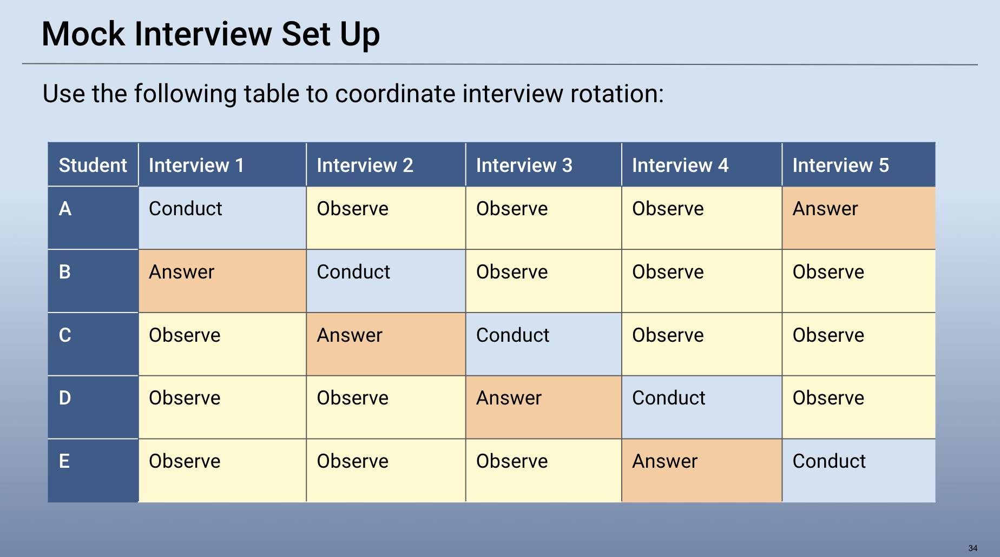

## 23.2 Lesson Plan: Cybersecurity Interviewing

### Overview

In today's class, we will prepare students for the various stages of cybersecurity interviewing. Students will practice common behavioral and technical interview questions and participate in a mock interview group activity. 

### Class Objectives

By the end of class, students will be able to:

- Prepare for an initial phone interview used to screen candidates for IT and cybersecurity positions. 

- Answer technical and behavioral interview questions. 

- Conduct, answer, and provide constructive feedback to mock interview questions and answers. 

### Instructor Notes

In the second half of class, students will work in groups to complete mock interviews. 
- Create these groups before class to prevent any delay or disruption during class. 

Create groups using the following format: 

- Divide your students into groups of four or five (five is preferred).

- Assign each group a number and assign each student within each group a letter between A and E.

- For example:

    - **Group 1**
      - A - Tim
      - B - Sally
      - C - Michael
      - D - Julie
      - E - Billy

    - **Group 2**
      - A - Alex
      - B - Steve
      - C - Sarah
      - D - Bob
      - E - Alice
        

#### Next Week's Lab Environment

In the next project week, we will be using a new Final Project lab environment located in Windows Azure. You and students will need a class-specific registration link. 

- If you are unsure about where to find this unique registration link, please do the following:

  * Refer to this [spreadsheet](https://docs.google.com/spreadsheets/d/1uHVzvVQftHL4CkUOB03lNelf-kLToZys6ugsIoVOpE0/edit#gid=0) to find your university specific spreadsheet.
  * Open up your university-specific spreadsheet and navigate to your specific cohort’s tab.
  * Find the registration link for the appropriate lab environment 
  * Note that these links will be added 1-2 classes prior to when students will be using the lab environment for the first time. If you would like access to a lab environment earlier for preparation, please reach out to the curriculum team.

- At the end of today's class:

  - Tell students to turn off their virtual machines and return to their local computers.
  - Send the Final Project Azure registration link. When students click on this link, it will add the Final Project environment card to their Azure dashboards.
  - Explain that the machines are found in this environment and then share the log-in credentials for each one.
  - Remind students to turn off their machines and environment before ending class.

### Slideshow

The lesson slides are available on Google Drive here: [23.2 Slides](https://docs.google.com/presentation/d/17UtFYYqMBfsHdzNEIk6pNx8aRKK_F-h7Agvvv3LEkjk/edit#slide=id.g480f0dd0a7_0_1803)

- To add slides to the student-facing repository, download the slides as a PDF by navigating to File > "Download as" and choose "PDF document." Then, add the PDF file to your class repository along with any other necessary files.

- **Note:** Editing access is not available for this document. If you or your students wish to modify the slides, please create a copy by navigating to File > "Make a copy...".

### Time Tracker

The time tracker is available on Google Drive here: [23.2 Time Tracker](https://docs.google.com/spreadsheets/d/1i3AYPS29ZSpb05xd0DiEi9sb-2easnYVh5vkMgrE_G8/edit#gid=1145703143)

- **Note:** Editing access is not available for this document. If you or your students wish to modify the slides, please create a copy by navigating to File > "Make a copy...".

### Student Guide

- [23.2 Student Guide](StudentGuide.md)

-------

### 01. Instructor Do: Introduction to Cybersecurity Interviewing (0:05)

Welcome students back to class and explain that we will continue our lesson on career prep by covering cybersecurity interviews. 

At this point, students should have a strong resume and a LinkedIn profile that reflects a growing cyber network. The next step is to apply to jobs, reach out to key decision makers and prepare for interviews. 
  
Explain that today's class will prepare students for interviews by covering the following:

  - The purposes of behavioral and technical interviewing and what kind of questions students can expect.  

  - Mock interviews of behavioral and technical questions. 
    
Explain that before we begin these new topics, we'll review what was covered in the last class:
  - Cybersecurity professionals take a variety of paths to reach different positions.
     - You can use CyberSeek.com and LinkedIn to help determine paths taken by similar cyber professionals.

  - Building a cyber network is one of the best ways to find career opportunities.

  - Non-traditional approaches to job seeking can lead you to less crowded career opportunities.

  - Building a powerful resume and LinkedIn profile can increase your odds of landing an interview and subsequently a cyber job.
  
 Ask the class if they have any questions before continuing to the next section.
  

### 02. Instructor Do: Interviewing Tips (0:10)

As you prepare for a cyber job interview, you should consider the following questions:

- What should I do to prepare for a successful interview?

- What kind of questions can I expect during the behavioral interview?

- What kind of questions can I expect during the technical interview?

- What should I avoid during the interview?

Explain that first we will cover the typical structure of an interview process.

#### Interview Process

Before receiving a job offer, you can expect to participate in at least three interviews:

1. The initial interview (also known as the phone screener or preliminary interview)
2. The behavioral interview
3. The technical interview

#### The Initial Interview

Explain that once your resume has been selected as a potential candidate, an HR staffer will conduct an initial phone screen interview. This interview aims to:

  - Narrow down the list of candidates so the final decision makers have the best candidates to choose from.

  - Provide basic job description, location, and hourly expectations, etc. 

  - Confirm the pay range is agreeable for both you and the employer.

  - Confirm that this is a position you are interested in. 

The staffer may have a few questions to also confirm that you are right for the position before they move you to the next interview.
  
#### The Behavioral Interview
  
 Explain that the behavioral interview is usually next in the interview process.
   
- A behavioral interview is used by many hiring managers to determine a candidate’s future performance by evaluating their communication and soft skills.

- The hiring manager will often use this interview to determine how interested and qualified you are, as well your ability to communicate.

- Behavioral interview questions are often similar across companies.  

Below are several common behavioral interview questions and how to answer them. 

**Question 1:** Tell me a bit about yourself.
  
- This question allows you to:
  - Show your communication skills and accomplishments.
  - Highlight pieces of your personal background, interests, and work experience that show you are right for the job.
  - Briefly explain your work history and how you came to apply to this position.

  - Consider the following tips for answering this question:
    - This question is very common, so be prepared to answer it.

    - Consider using a past, present, future structure in your answer.

    - For example: Your past work history,  why you are currently applying to this position, how you are positioned to be a future contributor in this position.

    - Use it as an opportunity to express your passion for cybersecurity. 
  
  - Be direct and prepared. Do not ramble. Keep your answer to a few minutes.
       
**Question 2:** Why are you interested in this cybersecurity position? Why are you interested in a career in cybersecurity?  
  
  - Discuss what led you to this boot camp and what parts were the most interesting or exciting.

  - If the question is focused on the exact position, demonstrate your knowledge of the job description and be specific. 

    - For example, if the position uses Burp Suite, you might note how you enjoy finding web application vulnerabilities. 
        
 **Question 3**: Why did you leave your last position? Why are you looking for a new position?
 
  - Be careful with how you answer: do not use this question to say negative things about your past employer. 

  - Instead, stay focused on your passion for cybersecurity and how this position aligns with it.  
        
 **Question 4**: Why do you want to work for this organization?

  - Make sure to prepare this answer, as it demonstrates excitement about working at their company specifically. 

  - Be specific. For example, point out that you liked the organization's launch of a new malware identification program that was able to identify patterns in ransomware.
        
  **Question 5:** What questions do you have for us?  

  - This question will usually come at the end of every interview.

  - Not asking any questions can signal to the employer that you lack interest in the job or company.

  - Some questions you might ask include:
    - What does a typical day in this position consist of?
    - What is your favorite part of working here?
    - What challenges does your company/department currently face, and how can this position help overcome those challenges?
        
 Summarize this section by covering the following tips to prepare for a cybersecurity behavioral interview:
   - Be prepared ahead of time to answer the "tell me about yourself" question.
   - Research the organization you are applying to and be able to note specific facts about the organization.
   - Have several questions prepared ahead of time to ask the interviewer.
       
In the next activity, you will have an opportunity to prepare a response for the "tell me about yourself" question.

### 03. Student Do: Behavioral Interviews (0:15)

Explain the following to students:

- In this activity, you and a partner will practice answering the "tell me about yourself" question.

- Be sure to provide constructive feedback on each other's answers.

Send students the following:

- [Activity File: Behavioral Interviews](Activities/03_Behavioral_Interviews/Unsolved/README.md)

### 04. Instructor Review: Behavioral Interviews Activity (0:05)

This activity emphasized the importance of having the "tell me about yourself" question prepared ahead of time. 

If students are comfortable, ask some to share their responses. 

### 05. Instructor Do: Technical Interviews (0:10)

Once a candidate has successfully moved through a screener and a behavioral interview, they will be invited to a technical interview. 

- The technical interview is a common step in the cybersecurity interview process in which candidates demonstrate their technical and problem-solving skills.

- This interview typically contains three types of questions:
    - Basic technical questions
    - Background experience questions
    - Situational technical questions

#### Basic Technical Questions  
Basic technical questions gauge your knowledge of specific concepts and tools. They might include: 

 - What is the difference between TCP and UDP?
 - What is the difference between data in motion and data at rest in terms of security?
 - How many keys does asymmetric encryption use?

When answering these questions:
  - It is acceptable and recommended to recite back the question before answering.
  - Answer the question and provide additional details if you are able.
  - If you do not know the answer, be honest and explain that you do not know.
    - In these cases, you can explain how you you would research the answer. And as a bonus, you can send the interviewer the answer in a follow-up email. 

While it is important to be direct when answering interview questions, you should provide a level of detail that shows comprehensive knowledge. 

For example, consider the following basic and detailed answers.  

 - What is the difference between TCP and UDP?
   - **Basic:** TCP is connection-oriented and UDP is connection-less.

   - **Detailed:** TCP works well for applications that require high reliability. UDP works well for applications that prefer higher speed over reliability, such as video games or video streaming.

 - What is the difference between between data in motion and data at rest in terms of security?

   - **Basic:** Data in motion is data that is transferred on the network between machines, or "live on the wire." Data at rest is data that is being stored on a static file system, such as a hard drive or database.

   - **Detailed:** Encrypting data in motion typically requires faster algorithms than encrypting data at rest.  When data is being transferred between machines, slow algorithms manifest as high latency (i.e., long transfer times). Reducing latency requires using faster algorithms. For this reason, protocols like SSL/TLS use symmetric encryption for the main data transfer and avoid slower asymmetric methods.
 
 - How many keys does asymmetric encryption use?
   - **Basic:** Two.

   - **Detailed:** Asymmetric encryption uses a private key and a public key. Each individual is required to have this two-key pair.

#### Background Technical Questions

Explain that background technical questions are used to gauge a candidate's exposure to and experience with real-world scenarios. 

Consider the following example: 

- Describe a breach or security vulnerability that you contained.

    - Remember, it is acceptable and recommended to recite the question back before answering.

    - If you have experience containing a breach of a security vulnerability, explain your specific process step-by-step. 

    - If you do not have professional experience, pick a breach or vulnerability from the news and discuss how you would contain it.

      - For example, "XYZ organization didn't patch their Apache servers, exposing a Apache Struts vulnerability. I would ensure that our organization had a detailed process to guarantee all systems were patched appropriately and in a timely manner."
 
#### Situational Technical Questions

Situational technical questions gauge your decision making ability when presented with a problem: 

Consider the following question:

- Suppose you've implemented a firewall policy on an HTTP server. How would you test it?

  - First, restate the question: 
    - "So, in this situation, I have a host running an HTTP server and I've set some firewall rules to allow access only to specific ports and block attackers from all others."
 
  - Next, provide elaboration and a conceptual solution: 
    - "Since this is an HTTP server, I guess you only want to allow access to/from port 80 and 443. If the firewall is working properly, I should be able to send an HTTP or HTTPS request to the server from a foreign host, and get a response back. I should not be able to get a response from any other port."

  - Finally, explain the technical steps and tools needed to implement your solution: 
    - "To test that I'm getting HTTP and HTTPS requests/responses, I'd use curl to hit the firewalled server from a foreign host. I'd expect to get a response. To test that all the other ports are closed, I'd use Nmap to run a port scan."

Explain that in the next activity students will get to practice answering a situational technical question.

- Ask the class if they have any questions before proceeding to the activity.

### 06. Student Do: Technical Interviews  (0:15)

Explain the following to students:

- In this activity, you will practice situational interview questions with your partner.

- You will have time to prepare your answers. Then, you will take turns reciting your answers and providing feedback. 

Send students the following:

- [Activity File: Technical Interviews](Activities/06_Technical_Interviews/Unsolved/README.md)

### 07. Instructor Review: Technical Interviews Activity (0:05)

In this activity, students answered a question that might be asked in a technical interview. Emphasize that this is a vital opportunity in the hiring process to prove their knowledge of key skills and tools. 

Even if students are unable to speak first-hand about professional experiences, they can demonstrate a proactive and passionate approach to problems they haven't experienced yet. 

### 08. Break (0:15)

### 09. Instructor Do: Introduction to Mock Interviews (0:10)

Explain that the best way to prepare for these interviews is to practice them. 
- We will spend the rest of class working on mock interviews.

Explain the following to students: 
- Using the provided set of behavioral and technical questions, you will work in groups of four or five to conduct, answer, and observe mock interviews. 

- To simulate a real job interview, you will be asked behavioral and technical questions. You will not know which will be asked. 

-  There will likely be questions you do not know the answer to. How you respond to those questions is very important. 

- Everyone in the group will have an opportunity to be interviewed and to conduct the interview. 

Explain that everyone should have a copy of their resume in front of them as well. In interviews, you will likely be asked questions about your resume. 

#### Mock Interview Setup

Divide students into groups of four or five. 

- Each student within the group will be assigned a letter between A and E. In each group, there will be:
    - Student A
    - Student B
    - Student C
    - Student D
    - Student E
      
Each student is assigned a script of questions based on their letter (Interviewer Script for Student A, Interviewer Script for Student B, etc.). They will pose these to another student. 

  - Students should not share their scripts with anyone else. 

  - While the two students are engaging in the mock interview, three students will observe and provide feedback about responses and communication skills. 

Display the following graphic to show the role that each student will play in each interview.

For example, for Interview 1: 

- Student A is the interviewer. They will ask questions from the Interviewer Script for Student A file.

- Student B is the interviewee who will be interviewed by Student A.
- Student C, D, and E are observers.

  - After completing the first interview, Student C, D, and E will provide feedback to Student B.

  - Provide feedback on interview responses, communication, and body language. 

### 10. Student Do: Mock Interview Activity  (1:15)

Ask class if there are any questions before dividing the students into groups and beginning the interview. 

Send out the following mock interview scripts on Slack: 
   - [Interviewer Script 1 for Student A](https://docs.google.com/document/d/1krWkihmqEdWtiNLaTBy3Y5twoCAnsnPeHF_Zb69V-Lk/edit#)
   - [Interviewer Script 2 for Student B](https://docs.google.com/document/d/1RfWdqv6xelO-AyzuPRRU_tXdNtYS0V_WNf2HWQYvKqE/edit#)
   - [Interviewer Script 3 for Student C](https://docs.google.com/document/d/1nXbk2Zew-Tk87WeoiDzweUm2EmWJYHMAzsCotcHqIXw/edit#)
   - [Interviewer Script 4 for Student D](https://docs.google.com/document/d/1Plx7sJ3Zpr4QwEu0iQfwIXh7VEHExBXaN9K35v701zU/edit#)
   - [Interviewer Script 5 for Student E](https://docs.google.com/document/d/1w35Vm2Q5XZh9cEqpUeMv73x40p-OKXxrzU78vkp5fLM/edit)

Emphasize that students should only select and open the file that corresponds to their letter. 
- They should use this file when conducting their interview.

- As the interviewer, they should feel free to improvise and add follow-up questions where they see fit.

Recommend that students keep all interviews under 15 minutes to give everyone time to participate.

Ask if there are any questions before students join their groups and begin the interviews. 

#### Instructor Notes

  - You and your TAs should circulate throughout the groups to assist with any questions.

  - Feel free to provide feedback to the interviewees after they complete their interviews.

### 11. Instructor Review: Mock Interview Activity (0:05)

Emphasize that practice makes perfect. 

- Students can use note cards to practice every type of interview question and answer. 

- Candidates are usually given a few days to a week to prepare for an interview. Stress that they should take advantage of that time to prepare. Cramming the night before is not the best approach. 

Offer the following resources for cyber interview questions:

  - [Daniel Miessler: 60 Cybersecurity Interview Questions](https://danielmiessler.com/study/infosec_interview_questions/)
  - [Guru99: Top 110 Cyber Security Interview Questions and Answers](https://www.guru99.com/cyber-security-interview-questions.html)
  - [Springboard: 25 Cybersecurity Job Interview Questions](https://www.springboard.com/blog/25-cybersecurity-job-interview-questions-and-answers/)
  - [edureka!: Top 50 Cybersecurity Interview Questions and Answers](https://www.edureka.co/blog/interview-questions/cybersecurity-interview-questions/)
  - [Indeed: Cybersecurity Interview Questions](https://www.indeed.com/career-advice/interviewing/cyber-security-interview-questions)

Encourage students to use these resources to practice their interview skills and technical knowledge.

Ask if students have any questions before dismissing class. 

### 12. Next Week's Azure Lab Environment

Let students know that in the next unit, we will be returning to Azure Lab Services for our final project. We will be using a new lab environment: `Final Project`

Tell students to switch to their local computer environment. Send students the registration link for the Final Project environment. Once they click on it, the Final Project environment card will be added to their Azure dashboard.

- RDP into the **Windows RDP host machine** using the following credentials:

  - Username: `azadmin`
  - Password: `p4ssw0rd*`

Make sure all students are set up and can access this environment. Address any troubleshooting issues prior to the next class.

Remind students to turn off any nested VMs running and their Final Project lab environment before ending class.

-------

© 2020 Trilogy Education Services, a 2U, Inc. brand. All Rights Reserved.  

