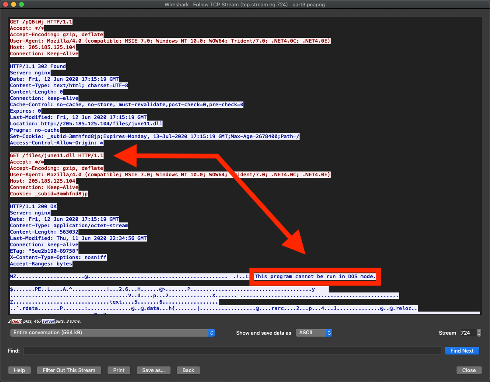
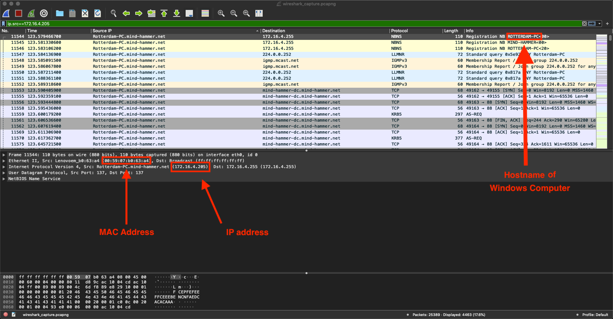

## Solution Guide: Wireshark Strikes Back

In this activity, students used the Kali VM to analyze live traffic on the wire.

---

### Time Thieves

At least two users on the network have been wasting time on YouTube. Usually, IT wouldn't pay much mind to this behavior, but it seems these people have created their own web server on the corporate network. So far, Security knows the following about these time thieves:

- They have set up an Active Directory network.
- They are constantly watching videos on YouTube.
- Their IP addresses are somewhere in the range `10.6.12.0/24`.

You must inspect your traffic capture to answer the following questions:
1. What is the domain name of the users' custom site? 
    - Solution: frank-n-ted.com

2. What is the IP address of the Domain Controller (DC) of the AD network?
    - Solution: `10.6.12.12`

  
3. What is the name of the malware downloaded to the `10.6.12.203` machine?
    - Solution: `june11.dll`

4. Upload the file to [VirusTotal.com](https://www.virustotal.com/gui/). 

5. What kind of malware is this classified as?

    - Trojan

### Vulnerable Windows Machines

The Security team received reports of an infected Windows host on the network. They know the following:
- Machines in the network live in the range `172.16.4.0/24`.
- The domain mind-hammer.net is associated with the infected computer.
- The DC for this network lives at `172.16.4.4` and is named Mind-Hammer-DC.
- The network has standard gateway and broadcast addresses.

Inspect your traffic to answer the following questions:
1. Find the following information about the infected Windows machine:
    - Host name: `ROTTERDAM-PC`
    - IP address: `172.16.4.205`
    - MAC address: `00:59:07:b0:63:a4`

2. What is the username of the Windows user whose computer is infected?
    - Solution: `mattijs.dervies`

3. What is the IP addresses used in the actual infection traffic?
    - Solution: `185.243.115.84` 

4. As a bonus, retrieve the desktop background of the Windows host.

---
© 2020 Trilogy Education Services, a 2U, Inc. brand. All Rights Reserved.  
