# 24.1 - 24.4 Lesson Plan: Final Project Week

## Project Overview

This week, students will work on their final project.

In this project, students will play the role of Security Engineer for X-CORP, supporting the SOC infrastructure. 

- The SOC Analysts have noticed some discrepancies with alerting in the Kibana system and the manager has asked the Security Engineering team to investigate and confirm that newly created alerts are working. 

- If the alerts are working, the engineers need to monitor live traffic on the wire to detect any abnormalities that aren't reflected in the alerting system. 

- Then, they need to report back all their findings to the manager with appropriate analysis.

These tasks are designed to convey understanding of three main cybersecurity areas:
- Offensive Security
- Defensive Security
- Network Forensics

This project requires a lot of work. Students should be encouraged to complete the entire assignment in the alloted time. However, it is acceptable if only more advanced students complete the Wireshark analysis section within the time constraints of class. If students do not complete all of the assignments during class time, they should complete unfinished work for homework. 

Be sure to emphasize the magnitude of students' achievement in getting this far: the topics covered in this assignment are the foundation of modern cybersecurity, and students now have experience with all of them.

## Lab Environment

<details>

<summary>Lab Details</summary>
<br>

In this project, you will be using a new lab environment located in Windows Azure Lab Services. RDP into the **Windows RDP host machine** using the following credentials:

  - Username: `azadmin`
  - Password: `p4ssw0rd*`

This is a diagram of the network and the machines that will be used in this lab:


Open the Hyper-V Manager to access the nested machines:

**ELK machine credentials:** The same ELK setup that you created in Project 1. It holds the Kibana dashboards.
- Username: `vagrant`
- Password: `vagrant`
- IP Address: `192.168.1.100`

**Kali:** A standard Kali Linux machine used for the penetration test on Day 1. 
- Username: `root`
- Password: `toor`
- IP Address: `192.168.1.90`

**Capstone:** Filebeat and Metricbeat are installed and will forward logs to the ELK machine. 
- IP Address: `192.168.1.105`
   - Please note that this VM is in the network solely for the purpose of testing alerts.

**Target 1:** Exposes a vulnerable WordPress server.
- IP Address: `192.168.1.110`

**Target 2:** Students should ignore Target 2 until they have completed all other parts of the project.


</details>  

## Instructor Notes

Instead of three separate lesson plans, this single lesson plan will guide the entire week. Each day is dedicated to a different aspect of the project.

- Advanced students who finish a day's work may move on to the next day's assignment ahead of schedule.

- Instructional staff can use solution files to help guide struggling students. These solution files should not be shared with the students. 

  - [Target 1 Solution Guide](Activities/Day-1-and-2/Solved/ReadMe.md)
  - [Target 2 Solution Guide](Activities/Target-2(optional)/Solved/ReadMe.md)

- **Note on Public Availability of Target 1 and Target 2**

   - **Please note**: `Target 1` and `Target 2` are publicly available vulnerable machines. Specifically, they can be found on VulnHub here: [Raven 1](https://www.vulnhub.com/entry/raven-1,256/) and [Raven 2](https://www.vulnhub.com/entry/raven-2,269/).

   - We are using these public VMs for the following reasons:

      - They were configured with a now-obsolete, more easily exploitable version of WordPress.
      - Exploiting `Target 1` equips students with the fundamentals of assessing WordPress sites.
      - Students who attack the optional `Target 2` will learn more advanced techniques for attacking content management systems.
        - **Note:** Instructions for attacking Target 2 should be given to students only if they have already completed all other parts of the project.

   - Nevertheless, it is likely that at least some students will find existing, publicly-available walkthroughs online. It is worth explaining to the class that these VMs are publicly available, but emphasizing that they _must_ complete each step of the assessment on their own. Simply capturing flags on the targets is not sufficient. Students will be expected to submit reports and presentations _explaining_ each step of their work. Resorting to freely available solutions only hinders this objective — not to mention that they often contain incorrect solutions.

### Class-Specific Registration Links

In this unit, you will be using a new lab environment located in Windows Azure. You and students will need a class-specific registration link. If you are unsure about where to find this unique registration link, click here to review the steps. 

* Refer to this [spreadsheet](https://docs.google.com/spreadsheets/d/1uHVzvVQftHL4CkUOB03lNelf-kLToZys6ugsIoVOpE0/edit#gid=0) to find your university specific spreadsheet.

* Open up your university-specific spreadsheet and navigate to your specific cohort’s tab.

* Find the registration link for the appropriate lab environment 

* Note that these links will be added 1-2 classes prior to when students will be using the lab environment for the first time. If you would like access to a lab environment earlier for preparation, please reach out to the curriculum team.

**Important**: Send out the registration link to the Final Project environment at the beginning of class. Make sure everyone has access before introducing the project. Contact the Program Support Manager if you need these links. 


### Troubleshooting Kibana Issue

:warning: It is common for students to experience the following issue: ⚠️

   

* If students encounter this error, explain that Kibana needs time to finish setting up. They should wait five to ten minutes and then try again. 

* If the issue is still not resolved, ask students to log into the ELK machine using the machines credentials and run the following commands:

    - `sudo su` which will allow the student to become the root user. 
    - `docker container ls` to find the name of the running docker container. 
    - `docker container stop <container-name>` to stop the docker container.
    - `docker container start <container-name>` to start the docker container back up. 


### Group Work

This project will incorporate group work. 

* Students will be assigned groups on Day 1. However, each student will work in their own environment and complete each daily challenge individually. If needed, students can consult with their group members for help or collaboration. 

* Each student will be responsible for filling out and submitting **each** of the three reports:

  - [Defensive Report Template](Resources/DefensiveTemplate.md)
  - [Offensive Report Template](Resources/OffensiveTemplate.md)
  - [Network Report Template](Resources/NetworkTemplate.md)

* As groups, students will convene on Day 3 and choose one of the three reports to present. They will use the presentation templates to create slides and present. **Note**: If groups wish, they can convene before Day 3 and start discussing which presentation they would like to complete. 

  - [Offensive Presentation Template](https://docs.google.com/presentation/d/19ouk_AS16V-f1KiJ3FTnNpJ4SJn1QQG3vkKukEN1NvU/edit#slide=id.g630a814dc5_0_53)
  - [Defensive Presentation Template](https://docs.google.com/presentation/d/1LP9TBdUYlWut3Qu4Czf618i-kg_qjjxkbnWLNTSdJBk/edit#slide=id.g630a814dc5_0_53)
  - [Network Presentation Template](https://docs.google.com/presentation/d/1LLh9dyrXNkWLqcsOnu5C_LOFDm_1EuKSf7y-Z7DwXn8/edit#slide=id.g630a814dc5_0_53)

* Note that students must **make a copy** of the report and slide templates to use them. They do _not_ have edit access to the templates.

:warning: **Important**: Instructors should create these groups **by the end of Day 1**. 

### Demo Day Interview Questions

<details><summary>As in previous projects, students will have an opportunity to use this week's experience to prepare responses to a set of domain-specific interview questions. Click here for more details. </summary><br>

- Because students will need the entirety of their class time to complete the project, they should expect to work on these questions outside of class.

- Their responses to these questions will not be graded. Instead, students are expected to use their answers to bolster the presentations that they deliver on Demo Day, following graduation.

The questions are located here: [Activities/Day-3/Interview-Questions/README.md](Activities/Day-3/Interview-Questions/README.md). 

</details>

## Daily Milestones 

### Day 1: Target 1

- Day 1 will begin with a review of the project overview and suggested milestones for each day. You will also demonstrate how to use `wpscan` to assess a WordPress target.

- Students will then:

   1. Configure alerts in Kibana.
   2. Test alerts by repeating attacks against the Capstone VM.
   3. Begin assessment of the first vulnerable VM: Target 1.

- Before the end of Day 1, the instructional staff must:

  - Break students into groups.

  - Emphasize that each group should think about which presentation template to complete.


### Day 2: Target 1, Continued

- On Day 2, students will complete their assessment of Target 1. Students who complete Target 1 should move on to the Day 3 Wireshark Analysis.

- Note that students should _not_ move on to Target 2 immediately after finishing Target 1. It is included for advanced students to assess _only after_ completing the rest of the project.

### Day 3: Analysis

- After assessing the Target 1 VM, students will use the Kali VM to capture and analyze traffic on the virtual network with Wireshark. Their task is to analyze the traffic to explain what users are doing on the network.

- After analyzing Wireshark traffic, students will spend the remainder of class completing summaries of their work. 

- Students will also begin working in groups to prepare their presentation. Each group will write a presentation on _either_ Offensive, Defensive, or Network aspects of this project, depending on which template they choose to fill out.

### Day 4: Presentations

- Students will present their findings to the class in short presentations. 


## Slideshow

- The slideshow for this week is located on Google Drive: [Project 3: Final Project Slides](https://docs.google.com/presentation/d/1fCRKYlM0I88c57MV4wIujSSTAYmYQbRrfBZtqv1MKak/edit)


---

## Day 1: Red Team

### 01. Instructor Do: Project Overview and Orientation

Welcome students to class and explain that today marks the start of their final project.

Point out that the last few weeks of class have focused on preparing students for their job search and certification training. Explain that this week's project marks a return to challenging technical work, providing another opportunity to hone the specialized skills needed to land those jobs. 

Explain that in this week's project, students will play the role of Security Engineer for X-CORP, supporting the SOC infrastructure. The SOC Analysts have noticed some discrepancies with alerting in the Kibana system and the manager has asked the Security Engineering team to investigate and confirm that newly created alerts are working. If the alerts are working, the engineers are to monitor live traffic on the wire to detect any abnormalities that aren't reflected in the alerting system. They need to report back all their findings to the manager with appropriate analysis.

Specifically, students will:

- Implement alerts in Kibana.
- Assess additional vulnerable VMs to test these alerts.
- Analyze live traffic on the network to determine user activity.

Share the Student Guide, which contains an overview of the project: 

- [Student Guide: Final Project Week](StudentGuide.md)

This project requires students to assess a vulnerable VM and analyze data in Kibana. However, the vulnerable machines on this network expose vulnerable web servers rather than vulnerable network services. Students will use Kibana to analyze logs, and to set and test alerts.

Students will exploit a vulnerable WordPress installation. This task will bring them yet another step closer to a real-world penetration testing scenario. They will implement alerts in Kibana before performing their assessments. This implementation will allow students to see dashboard alerts in real-time. After completing the alerting and penetration testing portions of the project, they will use Wireshark to capture and analyze live traffic on the virtual network.

Explain the following about each day:

- On Day 1, students will configure and test alerts in Kibana and begin performing an assessment of the Target 1 VM.

- On Day 2, students will continue their assessment of Target 1 and, if they finish early, move on to the Wireshark exercise.

- On Day 3, students will use Wireshark to analyze live traffic on the wire. They will also begin their individual reports and group presentations.

- On Day 4, students will present their findings in groups. 

Students will work individually to complete three reports corresponding to Days 1-3, and work with a group to prepare a presentation. 

- These materials will be valuable to share in job interviews and on platforms such as LinkedIn, demonstrating their familiarity with pen testing and log analysis. 

If students do not complete everything in class, they should finish and submit the remaining work as homework.

Emphasize that this project requires knowledge of pen testing, SIEM, and systems administration. Achieving broad familiarity with these cybersecurity skills is a significant achievement. Students should be proud of how much they've learned.  

Let students know that you'll proceed by providing an overview of the lab environment and tasks for Day 1. If you haven't already, send out the registration link for the lab before moving on.

#### Lab Environment

Explain that this week's lab environment is an extension of the lab that students worked with in Project 2. It features the following VMs:

- **Kali** (`192.168.1.90`): A standard Kali Linux machine for use in the penetration test on Day 1. 

- **Capstone** (`192.168.1.105`): The vulnerable target VM that students will attack to test alerts. Filebeat and Metricbeat are installed and will forward logs to the ELK machine. 
   - Please note that this VM is in the network solely for the purpose of testing alerts.

- **ELK** (`192.168.1.100`): The same ELK setup that students created in Project 1. It holds the Kibana dashboards that students will use in Day 2.

- **Target 1** (`192.168.1.110`): Exposes a vulnerable WordPress server.

- **Target 2** (`192.168.1.115`): Exposes the same WordPress site as above, but with better security hardening. It must be exploited differently than Target 1. Penetrating this machine is _not_ required.

These VMs will be used in the following ways:
- Students' first task is to configure alerts in Kibana based on their conclusions from Project 2. Students should refer to the documentation they created for Project 2 to recall their recommended alerts. 

- If students would like to test these alerts, they can perform several of the exploits from Project 2 against the Capstone VM. Please note that this is recommended but not required.

- After validating their rules, they will proceed to attack Targets 1 and 2 with Kali. The Kali credentials are:
   - Username: `root`
   - Password: `toor`

- Explain that the Capstone and Target VMs are configured to capture logs as students attack them. These logs will be forwarded to the ELK server for visualization with Kibana.

#### Project Milestones

Remind students that they will be working independently and are responsible for pacing themselves. To stay on track, they should aim to achieve certain milestones each day:

- Day 1: Configure alerts and capture flags on the Target 1 VM.

- Day 2: Continue capturing flags on Target 1, and start Wireshark analysis.

- Day 3: Analyze live traffic with Wireshark and complete all reports.

- Day 4: Complete and deliver presentations. 

Emphasize that while students must complete their work on Days 1-3 individually, they are encouraged to work through problems together if necessary. 

#### ELK Stack Refresher

Similar to Project 2, students will be working with the ELK stack. Review the following about its basic architecture:

- Logs are collected on deployed machines.
- Logs are forwarded to the Elasticsearch database.
- Kibana is used to visualize data.

Remind students that **beats** are small programs that run on the machines being monitored and forward logs to the database. Beats will be used to send logs from the Capstone VM to the ELK server. 

Pose the following questions to students:

- What does Filebeat do?

   - Filebeat collects file system data, such as files changed, requested, and uploaded.

- What does Metricbeat do?

   - Metricbeat collects  system data, such as uptime and SSH logins.

- What does Packetbeat do?

   - Packetbeat collects network data, such as incoming and outgoing packets.

Explain that the Capstone VM and Target 1-2 VMs have each of these beats installed.

Let students know that you will proceed by demonstrating how to create alerts in Kibana and how to use `wpscan` to assess WordPress installations.

#### Configuring Alerts in Kibana

Reiterate that the first task of the project is to create alerts to detect suspicious activity on the network. Review how to create threshold alerts in Kibana by covering the following:

- Kibana, like Splunk, allows you to create alerts that trigger under specific conditions. Examples of alerts include notifying the SOC when:
   - A machine sends a large amount of traffic in a short amount of time.
   - Inbound traffic targets unusual ports, such as `41250` or `654321`.
   - SQL injection payloads are detected in HTTP traffic.

- Alerts that fire when a particular metric passes a certain point are called **threshold alerts**. In the above examples, the first is a threshold alert that monitors the requests per second metric.

- While Kibana can create other kinds of alerts, they are out of scope for this project. Today, students will focus only on threshold alerts.

#### Activating Kibana Premium

Explain that alerts are a feature of Kibana Premium. Therefore, students will need to activate a free trial. This trial also enables the Watcher plugin, which students will use to configure alerts. 

1. Log into your Project 3 VM and double-click Google Chrome to open Kibana.

2. In the left navigation bar, click the bottom-most icon to open the **Management** panel. Then select **License Management** from the left navigation bar.

    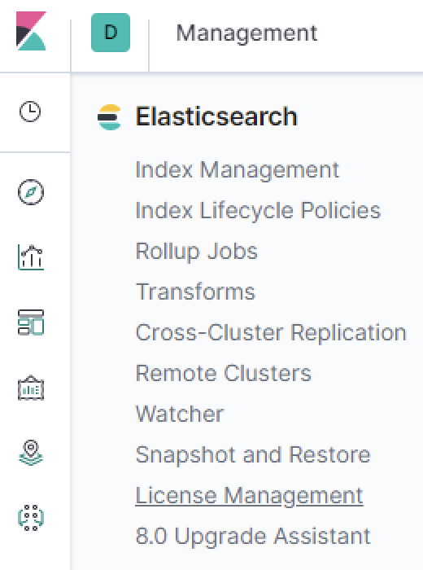

3. Click the button in the panel that says **Activate Free Trial**. Click **Yes** on the prompt that appears.

    - **Note**: In the image below, the free trial has been activated. The text on your screen will look different the first time you do this, but the button will be in the same place.

     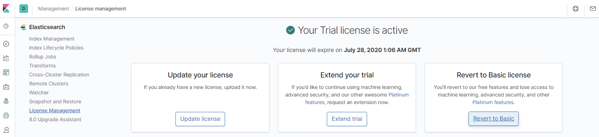


    - This enables the free trial and the alerting plugin. 
   
Let students know that you will now demonstrate how to use the plugin by configuring a threshold alert that fires after a certain number of HTTP requests have been received. We will make the following assumptions about the traffic:

- On average, Kibana should see 10 HTTP requests per second.
- An average, HTTP requests are about 350 bytes in size.

4. Click the **Management** icon and select **Watcher** in the left navigation bar.

      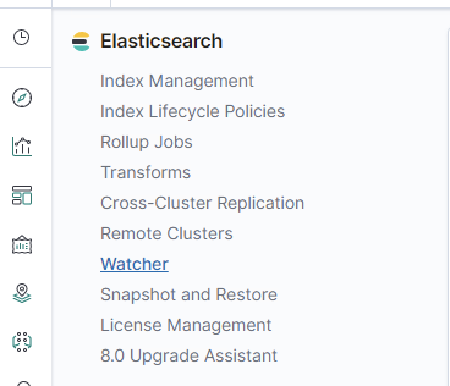

5. Click **Create Alert** and select **Create Threshold Alert**.

      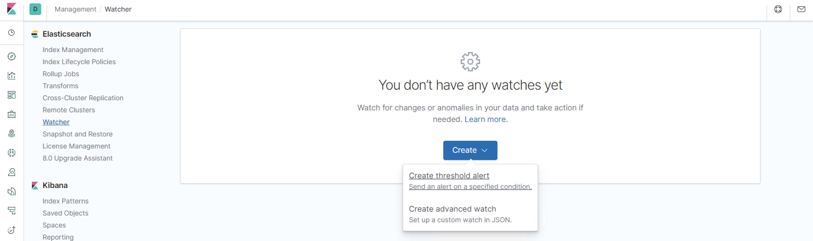

6. Name this alert "HTTP Request Size Monitor." Enter the following in the form at the top:

      - Indices to query: **packetbeat-***
      - Time Field: **@timestamp**
      - Run watch every: **1 minute**

      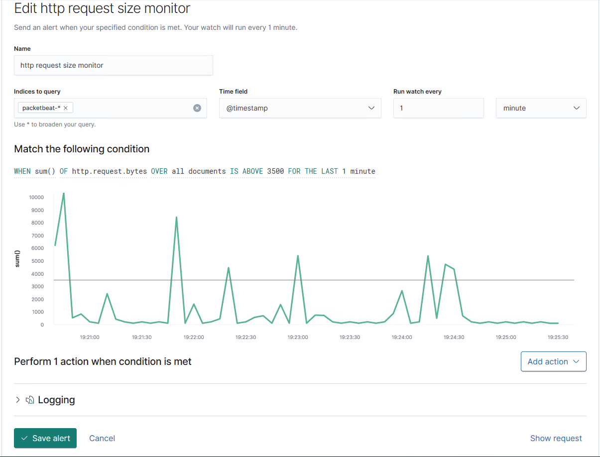

7. This creates a panel called **Match the following condition**. Enter the following query:

    - `WHEN sum() OF http.request.bytes OVER all documents IS ABOVE 3500 FOR THE LAST 60 seconds`

       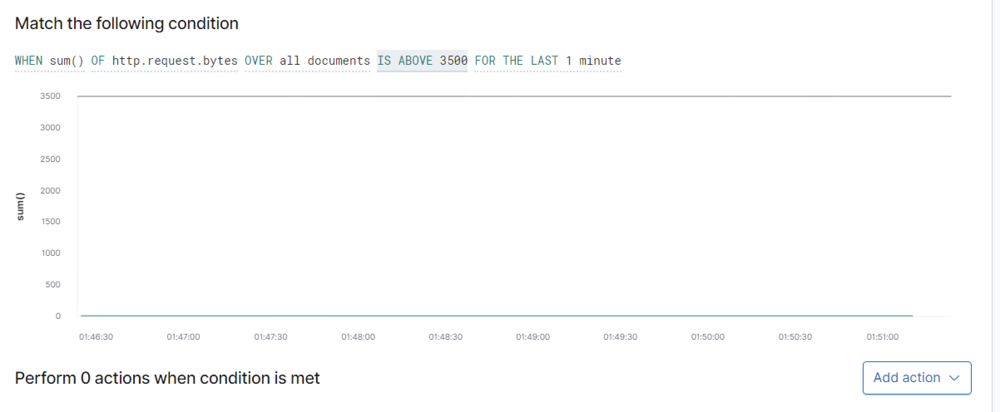

   - Explain that this query averages the size in bytes of all HTTP requests that were received in the past 60 seconds. 

   - Since an average HTTP request is about 350 bytes, if more than 3,500 bytes were received in the past 60 seconds, it means more than 10 requests were received. 

   - This would be an above-average number of requests, so we will use this alert to signal unusual behavior.

   -  **Note**: We must use `sum` because Kibana displays no direct way to alert against the number of incoming HTTP requests.

8. Click **Add Action** and select **Logging**. Enter any description for the log text. See the screenshot for an example.

      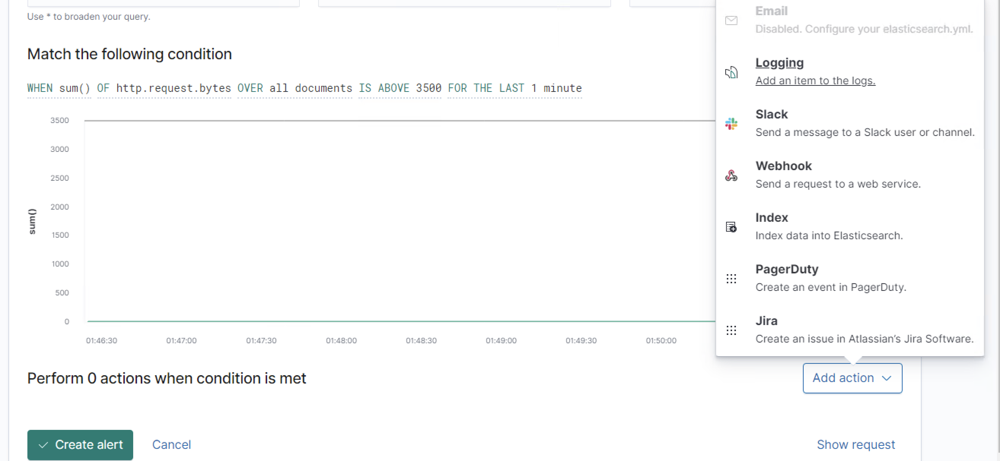

      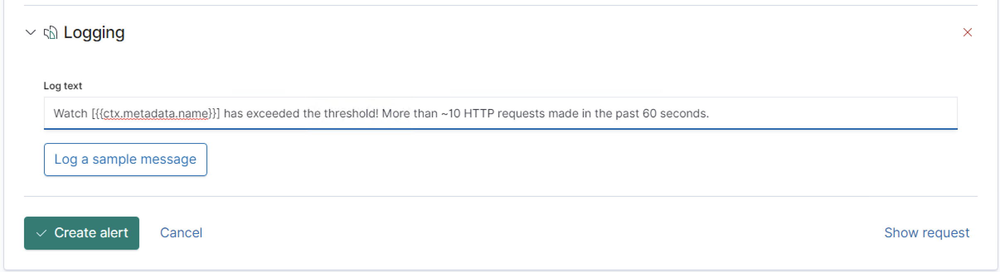

9. Finally, click **Create Alert**. This registers the alert and fires it whenever its condition is met.

    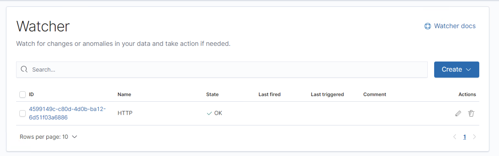

Explain that students will be required to create and test at least three alerts on Day 1.

**Note**: There are few ways to view log messages and the associated data.

First, you can see when alerts are firing directly from the Watcher screen.

- As you attack Target 1, keep the watcher page open to view your alerts fire in real time.

  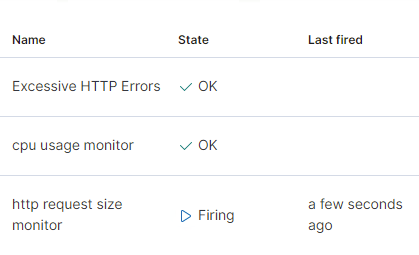

To view network traffic associated with these messages, we need to create a new 'Index Pattern':

- Click on **Management > Index Patterns** and click on the button for **Create Index Pattern**.

  
  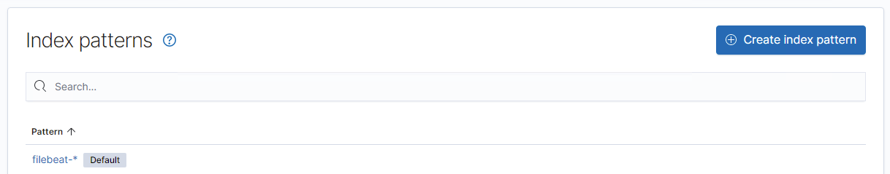

- Make sure to turn on the toggle button labeled 'Include System Indices' on the top right corner.

  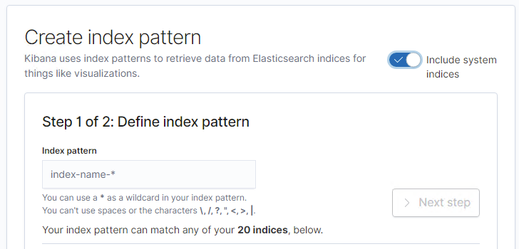

- Create the pattern `.watcher-history-*`

  

- After you have this new index pattern, you can search through it using the 'Discovery' page.

  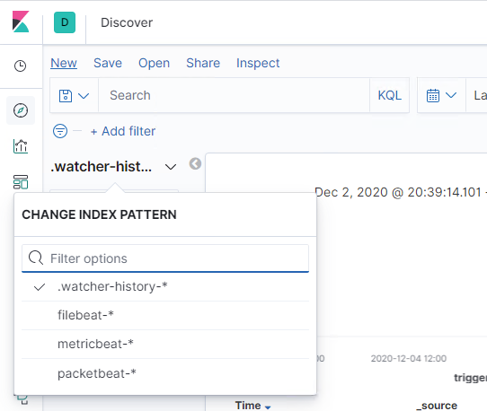

- Enter `result.condition.met` in as search filter and you can see all the traffic from your alerts.

  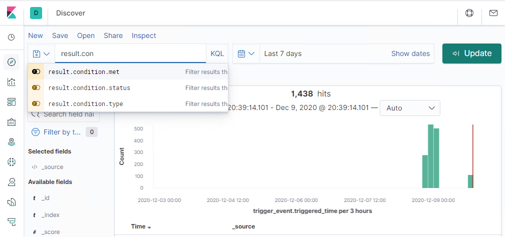
  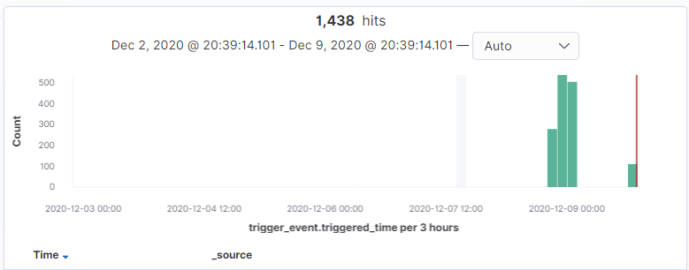

#### Assessing WordPress Targets 

Remind students that after setting up some alerts, they will use Kali to attack a web server that runs a vulnerable version of WordPress. In order to attack it, they will need a new tool called `wpscan`.

Connect to the Kali VM in your Project 3 environment, open a terminal and run: 
- `wpscan --help`

Explain that students will need to use the help output to learn more about `wpscan`. For now, explain that `wpscan` is used to:
- Find WordPress usernames and passwords.
- Enumerate URLs on a WordPress installation.
- Profile targets  by detecting WP version and installing plugins.

Given the popularity of WordPress, `wpscan` is one of the most important tools for a pentester to have in their toolbox.

Explain that students will use `wpscan` to profile the target site and enumerate usernames and passwords. Display the following commands:

```bash
# Detect WP Version and General Scan
$ wpscan --url http://target.com

# Enumerate Vulnerable Plugins
$ wpscan --url http://target.com --enumerate vp

# Enumerate Usernames
$ wpscan --url http://target.com --enumerate u

# Enumerate Usernames and Write Output to File
$ wpscan --url http://target.com --enumerate u --log logfile

# Enumerate Vulnerable Plugins and Usernames, and Save Output to File
$ wpscan --url http://target.com --enumerate vp,u --log logfile
```

Let students know that `wpscan` is similar to Nmap in how it reports results. They will be responsible for learning how to interpret the output.

Take a moment to address any questions before sending out instructions for the Day 1 activity. 

#### Setting Up Target 1

Finally, let students know that they must run a few commands on `Target 1` to ensure it forwards logs to Kibana. Demonstrate the steps below and tell students to follow along:
- Open the Hyper-V Manager.
- Connect to `Target 1`.
- Log in with username `vagrant` and password `vagrant`.
- Escalate to `root` with `sudo -s`.
- Run `/opt/setup`.

This enables Filebeat, Metricbeat, and Packetbeat on the Target VMs if they are not running already.

### 02. Student Do: Alerts and Attacks!

Explain that for the first day of the project, students will:

- Configure alerts in Kibana.
- Test these alerts by performing exploits against the Capstone VM a second time.
- Attack and capture flags on Target 1.

Students will need to use the techniques they learned during the offensive security units to determine how to complete each step. 

There are four flags on Target 1, but students only need to find two. Students who finish early can proceed to the next day's Wireshark exercise. **Note**: Students should not work on attacking Target 2 until they have completed the rest of the project. 

Send students the following activity files. They will use this file for Days 1 and 2:

- [Activity File: Attacking Target 1](Activities/Day-1-and-2/Unsolved/ReadMe.md)
- [Defensive Report Template](Resources/DefensiveTemplate.md)
- [Offensive Report Template](Resources/OffensiveTemplate.md)

  - Remind students that they have 2 days to complete this activity and the reports.

For your own reference, a [solution guide for Target 1 is available](Activities/Day-1-and-2/Solved/ReadMe.md). **Do not send this to students** until after they have completed the project.

### 03. Instructor Do: Day 1 Wrap-Up

Review that today's class consisted of configuring and testing alerts by attacking a new vulnerable VM. We will continue working on this in the next class. 

Ask the class if they have any questions before dismissing. 


---

## Day 2: Alerting and Assessing Target 1, Cont.

### 01. Instructor Do: Alerting and Assessing Target 1, Cont.

Welcome students back to class and explain that today they will complete their assessment of Target 1. Explain that after they capture the flags on Target 1, they should complete both the Offensive and Defensive Reports.

### 02. Student Do: Incident Analysis with Kibana

Students should work with the same activity file from Day 1, continuing to assess the vulnerable Target 1 VM. 

Send students the following activity file:

- [Activity File: Attacking Target 1](Activities/Day-1-and-2/Unsolved/ReadMe.md)

* **Note**: Students should not work on attacking Target 2 until they have completed the rest of the project. 

### 03. Instructor Do: Day 2 Wrap-Up

Today, students continued to assess the vulnerable Target 1 VM, testing their alerts along the way. In the next class, students will finish the assignment by analyzing live malicious traffic with the Kali VM.

---

## Day 3: Analyzing Malicious Traffic

### 01. Instructor Do: Wireshark Strikes Back

Welcome students back to class and explain that today they will use Wireshark to analyze malicious traffic on the network.

In Days 1 and 2, students configured alerts in Kibana and generated traffic of their own by attacking Target 1. Today, they will use Wireshark on the Kali VM to capture traffic from the virtual network. They will complete the assignment by profiling the traffic and answering questions about it.

:warning: **Important**: Emphasize that in this activity, students will be exporting malware from the PCAP file. All work **must** be completed on their Azure lab machines. 

To get started, students need to complete the following steps. These steps are also documented in the activity file. 

- Connect to the Kali VM.

- Open a terminal window and run the command: `systemctl start sniff`. 
  
  - This command uses `tcpreplay` to replay PCAPs in `/opt/pcaps` onto Kali’s `eth0` interface. 

- Launch Wireshark and capture traffic on the `eth0` interface.

- After 15 minutes have passed, run the command `systemctl stop sniff` to stop `tcpreplay`. 

  - Point out that replaying the PCAPs will use up the CPU memory. They will need to stop this service to avoid any performance issues with their virtual machine. 

- Save the capture to file. (**This is an important step**.)

- Profile users' behavior from their packet data. Specific questions are provided in the activity file, but students will be looking for information such as:

    - Protocols in use.
    - Network activity, such as web browsing, downloading files via FTP, torrenting, etc. 
    - Number of machines sending traffic.

Remind students that they will report their findings after completing the analysis. As such, they should add comments to important packets, take screenshots, and save packets as necessary.

Let students know that if they don't have time to complete this activity and the report in class, they must finish the work outside of class time. 

:warning: **Important**: Emphasize that we will be exporting malware from the PCAP file. All work **must** be completed on their Azure lab machines. 

Take a moment to address remaining questions before allowing students to begin.

### 02. Student Do: Wireshark Strikes Back

Send students the following activity files:

- [Activity File: Wireshark Strikes Back](Activities/Day-3-Wireshark/Unsolved/ReadMe.md)

- [Network Report Template](Resources/NetworkTemplate.md)

Students should aim to have all three reports finished by the end of class. Remind them that they will spend most of next class delivering presentations, so they will not have time to work on these reports.

For your own reference, [a solution guide for the Day 3 activity is available](Activities/Day-3-Wireshark/Solved/ReadMe.md). Do not send this file to students until after they have completed the entire project.

**Target 2 (Optional)**

For any students that have finished the project and presentations and wish to work on Target 2, you can provide them with the instructions [HERE](Activities/Target-2(optional)/Unsolved/README.md)

The solutions for Target 2 are [here](Activities/Target-2(optional)/Solved/README.md).


### 03. Instructor Do: Day 3 Wrap-Up and Presentations Overview (20 mins)

When students are finished with the Wireshark activity, instruct them to break into their assigned groups explain that they will spend the rest of the day developing presentations which they will present on Day 4.

Congratulate students for their hard work, both on this project and over the last six months.

In the final part of this project, students will finalize all reports and slide presentations. Emphasize that this project and all the other deliverables created during this six-month course are valuable evidence of their skills and knowledge, which they can present during job searches and networking events. Students should make sure their projects are complete, presentable, and free of errors.

- Explain that each group will present on **one** of the following focuses.
  - Offensive Security Analysis (Red Team)
  - Defensive Security Analysis (Blue Team)
  - Network Security Analysis 

- Group members should take some time to decide amongst themselves which section they will focus on.

- Similar to the reports, slide templates are provided to fill out each template.  Each section of the template requires students to answer specific questions about the project. It also requires them to justify their answers with screenshots and data excerpts. 

- As for division of work amongst groups, an Offensive Cyber Presentation can include: Student A and B working on the **Network Topology and Critical Vulnerabilities** section; Students C and D working on the **Exploits Used** section; and Students E and F working on the **Avoiding Detection and Maintaining Access** sections. 

- Groups are expected to present **together**. One student will introduce the presentation. Then, each student will talk through the portion of the slides they were specifically responsible for.

Details on the specific contents of each section are provided below. (This information is included in the slide templates.)

#### Offensive Security Presentation

The offensive red team presentation must include the following sections:

- **Exploits Used**
  - Choose three important exploits used during the assessment of the VMs. 
  - Explain how each exploit works.
  - Provide the commands used to run them. 
  - Add a screenshot confirming success (For example: a screenshot of a user shell if you ran a bind shell exploit).

- **Avoiding Detection**
  - For each exploit, explain which alerts in Kibana can detect it, if any.
  - Identify which metric the alert is responding to.
  - Suggest a technique for bypassing detection.
  - If possible, demonstrate your stealthier solution in action.

- **Maintaining Access**
  - Find a way to implement a backdoor on each target.
  - Provide an example or screenshot of the commands used. 
  - Options include using Metasploit, dropping SSH keys, adding users, etc. You only need to choose one.

#### Defensive Security Presentation

The defensive blue team presentation includes the following sections:

- **Alerts Implemented**
  - Explain each alert implemented in Kibana and provide the metric it responds to.
  - Note the threshold it fires against.
  - Include a screenshot demonstrating that the alert indeed fired.

- **Hardening**
  - Choose three vulnerabilities or exploits. 
  - For each, explain how it works, how it’s delivered, and how to harden or patch the vulnerable VM against it. 

- **Implementing and Distributing Fixes**
  - Create an Ansible playbook that implements all of the hardening steps specified above. 
    - Include a README explaining what the playbook does and which vulnerabilities or exploits it mitigates.
  - If creating a functional playbook is too difficult or time-consuming, you can create just a README describing what it should do.

#### Network Security Presentation

The network security presentation must include the following sections:

- **Traffic Profile**
  - Fill out a table with information from the analysis, including data about top talkers, amount of traffic, type of traffic (protocols), and purpose of the observed network activity.

- **Normal Activity**
  - In this section, identify users who are participating in non-malicious traffic. 
  - Explain what they’re doing and include a screenshot of packets clarifying their behavior. 
  - Elaborate on the packet, explaining how you know the traffic is not malicious.

- **Malicious Activity**
  - Identify which users are sending suspicious and malicious traffic.
  - For each, explain what kind of traffic they’re sending.
  - Identify the IP addresses involved.
  - Identify and explain any interesting files in the conversation, such as malware, images, etc.

Starter templates for each section are provided below and in the activity file. They include many of the notes above. Students should remove all instructional text and notes from the templates as they edit.  

- [Offensive Presentation](https://docs.google.com/presentation/d/19ouk_AS16V-f1KiJ3FTnNpJ4SJn1QQG3vkKukEN1NvU/edit#slide=id.g630a814dc5_0_53)
- [Defensive Presentation](https://docs.google.com/presentation/d/1LP9TBdUYlWut3Qu4Czf618i-kg_qjjxkbnWLNTSdJBk/edit#slide=id.g630a814dc5_0_53)
- [Network Presentation](https://docs.google.com/presentation/d/1LLh9dyrXNkWLqcsOnu5C_LOFDm_1EuKSf7y-Z7DwXn8/edit#slide=id.g630a814dc5_0_53)

**Note:** Edit access for these files is disabled. Students will need to **make a copy** of the slide templates.

Take a moment to address questions and then let students begin. They will have 45 minutes now and the first 45 minutes of Day 4 to finalize their presentations before delivering them to their classmates.

### 04. Groups Do: Preparation for Final Presentations (0:45)

Groups should work on and finalize their presentations. Each group must submit a single slide deck, on _one_ of the three topics below.

Send students the following guidelines for the presentation:

- [Activity File: Final Group Presentations](Activities/Day-3-Group-Presentations/Group-Presentations.md)

  - [Offensive Presentation Template](https://docs.google.com/presentation/d/19ouk_AS16V-f1KiJ3FTnNpJ4SJn1QQG3vkKukEN1NvU/edit#slide=id.g630a814dc5_0_53)
  - [Defensive Presentation Template](https://docs.google.com/presentation/d/1LP9TBdUYlWut3Qu4Czf618i-kg_qjjxkbnWLNTSdJBk/edit#slide=id.g630a814dc5_0_53)
  - [Network Presentation Template](https://docs.google.com/presentation/d/1LLh9dyrXNkWLqcsOnu5C_LOFDm_1EuKSf7y-Z7DwXn8/edit#slide=id.g630a814dc5_0_53)
---

## Day 4: Final Presentations

### 01. Instructor Do: Overview (0:05)

Welcome students to the last day of class and remind them that they will spend today doing the following: 

- Finalizing group presentations and individual reports for 45 minutes.

- Presenting for the remainder of class.

Explain that each student should submit the following deliverables at the end of this project week: 

1. The Offensive, Defensive, and Network Security Reports

2. One single group presentation slide deck

Please note that, despite the fact that students must submit the above deliverables _individually_, groups are expected to present **together**. One student will introduce the presentation. Then, each student will talk through the portion of the slides they were specifically responsible for.

In addition, please **emphasize** that these reports and the presentation take the place of homework this week. Students only need to complete the presentation and reports — there is no further homework assignment that they must complete.

Take a moment to address questions before allowing students to proceed.

### 02. Groups Do: Finalize Presentations (0:45)

Groups should finalize their presentations. Each group must submit a single slide deck that covers one of the topics below:
- Offensive analysis 
- Defensive analysis 
- Network analysis 

Students should also organize *how* they will present. One student will introduce the presentation. Then, each student will talk through the portion of the slides they were specifically responsible for.

In addition, students must submit their individual reports.

### 03. Groups Do: Presentations (2:10)

For the remainder of class, groups should present their presentations. Choose groups to present in a random order.

Each section should be presented by the one or two group members who worked on it.

### 04. (Optional) Student Do: Domain-Specific Interview Questions

As emphasized in the previous project, the ability to communicate the achievements of this project and relate them to different domains is a valuable skill for students to have when networking and interviewing. 

Students will once again have the option to respond to interview questions and relate the specific work they did to areas and domains of interest. 

**Please note** that, as the entirety of students' time today will be dedicated to presentations, responding to these interview questions should be left for _after_ class. Students' responses will not be graded as homework, but they will use them to bolster their Demo Day presentations after graduation.

Explain the following: 

- In this optional activity, you will choose a domain that you are interested in pursuing as a career. For this project, you will choose from the following domains:

  - Network Security
  - Logging & Monitoring
  - Offensive Security
  - Defensive Security: Incident Response Phases I & II

- If you are unsure of which domain you would like to focus on, that's ok! You can either choose the one that you are the most comfortable discussing, or you can also complete the tasks in two or three domains.
 
- For each domain, you will be provided a set of interview questions.  For each question, you will be prompted to think about specific aspects or tasks you completed in Project 2 that you can use to answer the question.
​
Send students the following activity file: 

- [Activity File: Project 3 Extension Questions](Activities/Interview-Questions/README.md)


---
© 2020 Trilogy Education Services, a 2U, Inc. brand. All Rights Reserved.  
