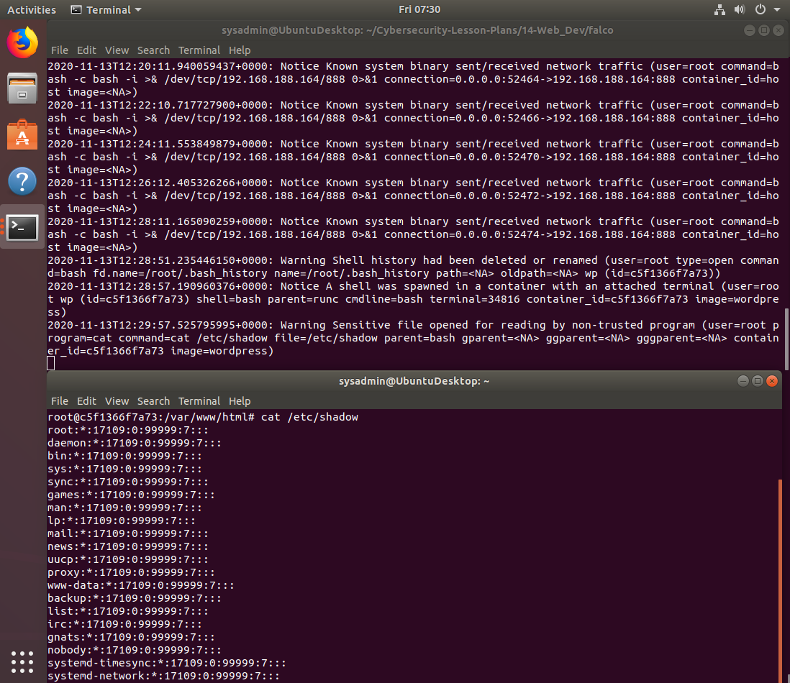
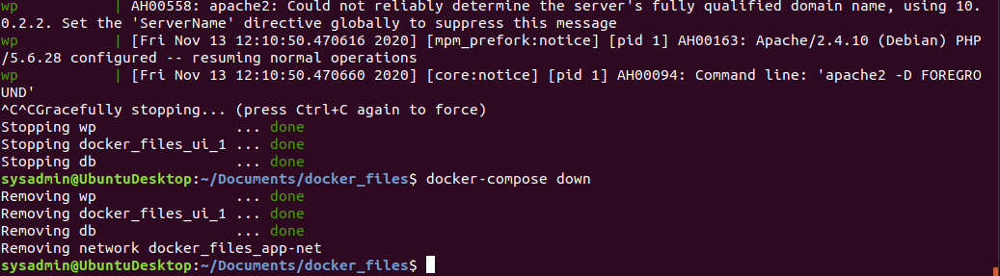

## Supplemental Lesson Plan: Container Security

### Overview

:warning: This is a contingency lesson plan for when there are Azure outages during the Web Vulnerabilities unit. It is intended to be relatively easy to execute without the need of prep time. 

Today's class will build off of previous units and concepts involving containers and focus specifically on the securitization of containers. Students will take a glimpse at using security tools for containers in today's guided walkthroughs.

Today's narrative follows a day in the life of a security engineer that is working with other departments within their organization to complete their security-related tasks. Specifically, the tasks will revolve around executing container vulnerability analyses and monitoring container intrusion detection output.

### Class Objectives

By the end of the lesson, students will be able to:

- Explain the usage of a container vulnerability scanning tool before deploying containers and using container intrusion detection systems to monitor them once running. 
- Use Trivy to scan a container image and retrieve its results from the JSON output.
- Use the bash command-line tool `jq` to parse through JSON.
- Monitor container intrusion detection systems for anomalies.

### Instructor Notes


- Since this LP acts as a contingency in case of lab outages, this LP is intended to be teachable with minimal prep.

- The following is a breakdown of today's lesson plan:

  - A refresher on containers that covers the importance of container security 

  - A walkthrough of a `Trivy` scan on a container image to check it for vulnerabilities. Then, use  `jq` to digest the results.

  - A walkthrough using the container intrusion detection tool, `Falco`, to monitor containers that are running.

### Lab Environment   

- You and students will use your local Vagrant Ubuntu virtual machine for today's activities. As all of today's activities are run as "Everybody Do" guided walkthroughs, we only need to use the `sysadmin` account.

    - Username: `sysadmin`
    - Password: `cybersecurity`

- Make sure that you can bring up the container set by navigating to `/home/sysadmin/Documents/docker_files` and running `docker-compose up`. 

- Note the following about `docker-compose up`:

  - You can run the Docker-Compose container set in the background by using the `-d` (detach) argument with `docker-compose up -d`. This will free up the terminal to be used again after standing up the container set. You won't be able to see container status updates in the terminal if you have only used `docker-compose up`.

  - If you do this, you'll need to explain that you are detaching the container setup output and also that it is running in the background. 
  
  - :warning: **Heads Up**: Do *not* forget to run `docker-compose down` in any directory that you ran `docker-compose up`.

  - Once you are done with Docker-Compose for the day, run [`docker-compose down`](https://docs.docker.com/compose/reference/down/) to end the multi-container session.

#### :books: References 

- [Trend Micro: Container Security](https://www.trendmicro.com/en_us/what-is/container-security.html)
- [Trivy Container Vulnerability Scanner](https://github.com/aquasecurity/trivy)
- [Falco Container Intrusion Detection System](https://github.com/falcosecurity/falco)

#### Slideshow 

The slides for today can be viewed on Google Drive here: [Container Security Slides](https://docs.google.com/presentation/d/1GxwWfbldXhmVBGstNIH8wUuWK7wlCVNpfT88gqbVj54/edit#slide=id.g9acec2d7f9_0_0)

- To add slides to the student-facing repository, download the slides as a PDF by navigating to File > "Download as" and choose "PDF document." Then, add the PDF file to your class repository along with other necessary files.

- **Note:** Editing access is not available for these documents. If you or your students wish to modify the slides, please create a copy by navigating to File > "Make a copy...".

#### Student Guide

- [Student Guide: Container Security](StudentGuide.md)

---

### 01. Instructor Do: Welcome and Overview (0:05)

Welcome students to class and provide a brief overview of the concepts covered today:

- In past lessons, we've seen how containers can allow us to deploy multi-component web applications that separates each of the application's components by its individual concern.

- Explain that in today's activities we will be revisiting containers and looking at some of the daily tasks a security professional does to help an organization secure its containerized infrastructure.

Today's lesson will relate back to the following concepts: 

- Cloud architecture and security: where we deployed cloud infrastructure and learned to use tools such as Docker and Ansible.

- The web client-server model and web application architecture: where we learned more in depth about the HTTP communication protocol, sessions and cookies, and web architecture components.

Review the class objectives and continue onto the next section. 


### 02. Instructor Do: What Goes Into a Container? (0:20)

Explain that Dockerfiles contain all the configurations that go into a container build. However, we also need a way to ensure that the configurations of the container do not come with any security risks.

First, we need to understand some important concepts of building containers.

- Display the following example of a vulnerable Dockerfile and review the following: 

  - A Dockerfile such as the this contains all of the building instructions of everything that goes into a container, before it becomes a container image.

  - Whenever we used the commands `docker pull` or `docker run`, we were working with already defined container images.

 ```Dockerfile
 ##############################################
 ## An Insecure and Outdated Container Build
 ##############################################
 ## Required Base OS
 FROM ubuntu:14.04
 RUN apt-get update -y && apt-get upgrade -y 
 WORKDIR /home/user/Downloads
 ## Install wget from the Debian repo
 RUN curl http://archive.ubuntu.com/ubuntu/pool/main/w/wget/wget_1.15-1ubuntu1.14.04.5_amd64.deb -O && \
     dpkg -i wget_1.15-1ubuntu1.14.04.5_amd64.deb
 ## Install bash 4.3
 RUN curl https://ftp.heanet.ie/mirrors/gnu/bash/bash-4.3.tar.gz -O && \
     tar zxf bash-4.3.tar.gz && \
     mkdir /opt/bash && cd bash-4.3 && \
     ./configure --prefix=/opt/bash && \
     make && make install
 ## Copy application files
 COPY . /app
 ## Change working directory
 WORKDIR /app
 ## Launch application from /app
 RUN deploy.sh
 ```

- Break down the following lines of the above Dockerfile:

  - The `FROM ubuntu:14.014` line indicates that Ubuntu 14.04 is the base operating system of the application. This means that all security issues that are present in Ubuntu version 14.04 also exist in this container.

  - In the following `RUN` lines, we can see various packages being installed and a script being executed. 

    - Two (vulnerable) packages, `wget 1.15` and `bash 4.3`, get installed in this example Docker container. 

    - Both of these packages have critical vulnerabilities, but we obviously cannot tell that just by seeing their versions numbers.

  - Lastly, a script, `deploy.sh`, is run that starts up this container's application.

    - This part of the Dockerfile usually starts up the application or main runtime that the container will run, until it is done running or shut down. This isn't vital for today's lesson, but it's useful to know.

Let students know that while they don't need to understand how to construct a Dockerfile in granular detail, they should know that this is where the container's base operating system (`FROM`) and underlying packages are defined.

#### Vulnerable Containers

Explain that the example Dockerfile we just looked at actually had vulnerable versions of wget and bash. 

- While we couldn't see it from the version numbers alone, the wget version was vulnerable to reverse directory traversals and code execution and the bash version was vulnerable to Shellshock.

As security engineers, we need to be able to inspect a container's operating system and its installed software packages for vulnerabilities.

Explain that inspecting container images and Dockerfiles before they are deployed for vulnerabilities is called **vulnerability scanning**.

- Vulnerability scanning is one of the earliest stages where a security engineer becomes involved with an application's development and operations (DevOps) cycle.

There are many open source vulnerability scanners for managing container vulnerabilities. Today we will use **Trivy**, for its ease of use. 

- Others include Claire, Anchore, and Snyk.

#### Potential Vulnerabilities in Containers

Emphasize that outdated software packages can lead to an application being vulnerable to the following vulnerabilities:

- **Man-in-the-middle (MITM)**: An attacker secretly intercepts and relays requests between a victim and their intended target, such as a website.

- **Buffer overflow**: A software anomaly in which the memory of an application can be corrupted and have foreign code executed as a part of memory.

- **Denial of service (DoS)**: Takes down a service and makes it unavailable.
- **Privilege escalation**: Enables an attacker to escape the regular user space of an operating system to run commands with elevated privileges.

This isn't an exhaustive list, but just a few examples of the vulnerabilities that can be found by running overlooked versions of software.

### 03. Everybody Do: Trivy Scenario & Guided Walkthrough (0:40)

Explain that in the following activity, we will use the vulnerability scanning tool Trivy to scan through an intentionally vulnerable Docker image.

- Using Trivy is quite simple, but the most important part is filtering through the results to find the most critical security risks.

- We'll be using the bash command-line tool `jq` to do this.

#### The Scenario

For this activity, we will play the role of a web app security engineer as part of the company's Systems Engineer and Development team.

- The developers at your company insist on using the following Docker image for the general microservice architecture planned by your company's systems architect: `wordpress:4.6.1-php5.6-apache`. 

- However, the senior security engineer insists that using such an old Docker image of WordPress presents a significant security risk.

- We are, as the security engineers, tasked with using Trivy to scan the [`wordpress:4.6.1-php5.6-apache`](https://hub.docker.com/layers/wordpress/library/wordpress/4.6.1-php5.6-apache/images/sha256-ee397259d4e59c65e2c1c5979a3634eb3ab106bba389acea8b21862053359134?context=explore) image on WordPress's official Docker Hub, generate a comprehensive list of the most severe vulnerabilities, and report our findings to the Risk Management team.

:warning: **Note**: During the activity, you may encounter Trivy Go runtime errors. If you do, the database is likely corrupted and can be resolved by running the following command:

- `trivy --reset` 

  - The `--reset` option removes all caches and database if it errors out at any point. This can happen if you Ctrl+C before the vulnerability scan is finished.

  - You read more about this at the following links:

    - [Aqua Security: Trivy --reset](https://github.com/aquasecurity/trivy#reset)
    - [Aqua Security: Crash following interrupted DB download](https://github.com/aquasecurity/trivy/issues/288)

#### Walkthrough

Share your screen and instruct students to follow along. Take you time with each step and make sure everyone is keeping up. Extra time has been alloted for this Everybody Do activity to ensure that students can catch up if they fall behind.


1. To start things off, let's create and navigate to a new `vulnerability_reports` directory.

    - Run `mkdir ~/Documents/vulnerability_reports`

    - Run `cd ~/Documents/vulnerability_reports`

2. Next, let's make sure the two required command-line tools that we need for this are installed and working properly:

    - Run `jq --version`

    - Run `trivy --version`

      ```bash
      sysadmin@UbuntuDesktop:~$ jq --version
      jq-1.5-1-a5b5cbe
      sysadmin@UbuntuDesktop:~$ trivy --version
      Version: 0.12.0
      ```

3. Perfect, now let's see how Trivy works.

    - Run `trivy --help` and point out the usage line:

      ```bash
       USAGE:
        trivy [global options] command [command options] target
      ```

4. Since we will run Trivy against a container image, let's look up how to use image scanning with `trivy image`.

    - Run `trivy image` to show the following usage output:

      ```console
      sysadmin@UbuntuDesktop:~$ trivy image
      NAME:
        trivy image - scan an image

      USAGE:
        trivy image [command options] image_name

      OPTIONS:
        --template value, -t value  output template [$TRIVY_TEMPLATE]
        --format value, -f value    format (table, json, template) (default: "table") [$TRIVY_FORMAT]
        --input value, -i value     input file path instead of image name [$TRIVY_INPUT]
        --severity value, -s value  severities of vulnerabilities to be displayed (comma separated) (default: "UNKNOWN,LOW,MEDIUM,HIGH,CRITICAL") [$TRIVY_SEVERITY]
        --output value, -o value    output file name [$TRIVY_OUTPUT]
        --exit-code value           Exit code when vulnerabilities were found (default: 0) [$TRIVY_EXIT_CODE]
        --skip-update               skip db update (default: false) [$TRIVY_SKIP_UPDATE]
        --download-db-only          download/update vulnerability database but don't run a scan (default: false) [$TRIVY_DOWNLOAD_DB_ONLY]
        --reset                     remove all caches and database (default: false) [$TRIVY_RESET]
        --clear-cache, -c           clear image caches without scanning (default: false) [$TRIVY_CLEAR_CACHE]
      ...[truncated]
      ```

5. Our Risk Management team has requested that we send them a vulnerability report containing the highest criticality severities in JSON format. 

   We'll see how to use JSON in a minute, but for now, it looks like the `--format`, `--severity`, and `--output` command options are what we'll need.

   First, let's try to use Trivy on the `wordpress:4.6.1-php5.6-apache` image without any command options.

   - Run `trivy wordpress:4.6.1-php5.6-apache`

   - Explain that this command will search for all vulnerabilities that exists in DockerHub public Docker image `wordpress:4.6.1-php5.6-apache`.

   - Scroll through the results to show that we need a better way to filter through this output.

   - Explain that the output returns too many results. As security engineers, we need to to be able to filter down these type of vulnerability lists and output the results to readable files.

6. Explain that we'll need to modify the Trivy command so that it will output all security vulnerabilities classified as high or critical severity in JSON format. We'll output these results to a file called `wp_all_vulns.json`.

    - Type the following command: `trivy --format json --output wp_all_vulns.json --severity "HIGH,CRITICAL" wordpress:4.6.1-php5.6-apache`

    - Before running it, breakdown the command's syntax:

      - `trivy` is the tool we are running.
      - `--format json` formats the output of the scan to JSON format.
      - `--output wp_all_vulns.json` specifies the name of the file to save the output to.
      - `--severity "HIGH,CRITICAL"` makes sure to only output vulnerabilities with a severity class of `HIGH` or `CRITICAL`.
      - `wordpress:4.6.1-php5.6-apache` is the Docker image that we are checking.

    - Explain that during every day operations, security engineers, when looking through huge amounts of vulnerability results, may have to scope down their analyses the most severe ones, as we are doing here with the SEVERITY: HIGH and SEVERITY: CRITICAL vulnerabilities.

    - Run the command: `trivy --format json --output wp_all_vulns.json --severity "HIGH,CRITICAL" wordpress:4.6.1-php5.6-apache`

    - The output should look like:

      ```
      sysadmin@UbuntuDesktop:~/Documents/trivy_reports$ trivy --format json --outputwp_all_vulns.json --severity "HIGH,CRITICAL" wordpress:4.6.1-php5.6-apache
      2020-11-13T03:21:07.538-0500	INFO	Detecting Debian vulnerabilities...
      2020-11-13T03:21:07.626-0500	WARN	This OS version is no longer supported by the distribution: debian 8.6
      2020-11-13T03:21:07.626-0500	WARN	The vulnerability detection may be insufficient because security updates are not provided

      ```

    - Note that we _immediately_ see issues raised about the container's base operating system version: `Debian 8.6`. 

    - If we Google search "Debian 8.6", we can see through one of the first results: [Debian 8.6 Released](https://www.debian.org/News/2016/20160917), that it was released in **_September 2016_**.

7. As security engineers, the first few results of the scan give us low confidence in the operating system's general security profile. But let's continue by reviewing the rest of our scan results:

    - Run `ls` to show the new `wp_all_vulns.json` was created.

    - Run `cat wp_all_vulns.json` to show the verbose JSON-formatted results of our scan.

    - Now we'll need to use the bash command-line tool, `jq`, to filter through our results.


8. Introduce bash filtering by explain the following. Note: You can stop return to the slides to cover steps 8 and 9. 

  -  `jq` is like `sed`, but for JSON data. It is used to filter through JSON files and has the same text editing functionalities that are built into `sed`, `awk`, and `grep`.

  - Remind students that JSON is a structured data format that is used ubiquitously within software development languages, logging, and security.

  - A security engineer will often have to filter through JSON logs in order to find the most relevant information for an organization.

  - Students won't need to know JSON in-depth, but that they will need to know how to interact with it in order to use `jq` to filter through this vulnerability report.


9. Review JSON by explaining the following: 

   - **JSON** is a data format that pretty much every programming language knows how to interact with and manipulate, making it the standard for web services and APIs. Those looking into web application security roles should get comfortable using JSON.

   - JSON is also used in all log ingestors and aggregators such as security information and event management (SIEM) systems. Examples include the ELK stack that we used during the project week and the very popular enterprise SIEMs platform, Splunk. 

   - In order to work with other platforms, every log transporter and collector understands and ingests JSON.

   - Briefly explain JSON's formatting:

      - It writes objects as `key:value` pairs.
      - Data is separated by commas. 
      - Curly braces hold objects.
      - Square brackets hold arrays.

    - Explain JSON's key-value format as follows:

        ```JSON
        { "key":"value" }
        ```

    - The following is a JSON object with an array inside:

      ```JSON
      {
      "thisIsAKey":"this is a value",
      "theFollowingIs":"an_array_example",
      "ciaTriad":[ "confidentiality", "integrity", "availability" ]
      }
      ```

10. Now that we are caught up with the basic of JSON and bash filtering, let's return to our scenario.  

   - Remind students that we  have a `wp_all_vulns.json` file with all of the _high_ and _critical_ severity vulnerabilities from the Wordpress Docker image that we scanned.
   
   -  Explain that we can now use the bash command `jq` on the file to filter for certain types of vulnerabilities. 

   - Within our file, the `Vulnerabilities` JSON object contains **all** of the vulnerabilities that lie within the first array, where all of the valuable information is. 

   - So, to reiterate, `Vulnerabilities`, is an array object that encompasses all of our results within it. 


   - Share your screen and instruct students to begin following along again.  


11. In order to look through the `Vulnerabilities` JSON object, we'll use the following command:

    - Type `jq '.[0].Vulnerabilities' wp_all_vulns.json` and cover the syntax:

      - `.` is used before every object and array to indicate to `jq` what level of the JSON object we're looking in.
      
      - `.[0].Vulnerabilities` means that we're are going to look in the first array, `.[0]`, for all objects under the array object `.Vulnerabilities`. 

    - Run the command and explain that we can find the individual vulnerability information such as:

      - `VulnerabilityID`: The Common Vulnerabilities and Exposures ID (CVD). This is a unique ID given to every known vulnerability. It is maintained by a branch of the National Security Agency.

      - `PkgName`: Contains the package name that is vulnerable. For example, if `sed` had a vulnerability, we would see `PkgName: sed`.

      - `InstallVersion`: The version of the vulnerable package.

      - `FixedVersion`: The fixed version of the package. This is the version a security engineer would recommend updating to.
      
      - `Title`: The title of the vulnerability. This often contains the type of vulnerability as well, such as `remote code execution`.
      
      - `Description`: The description of the vulnerability. This contains information about how an attacker might leverage the vulnerability. We'll filter these for more information.
      
      - `Severity`: The severity of the vulnerability describes the potential risk to the system it is installed on. The more damage it can cause, the more severe the vulnerability.
      
      - `References`: Contain links that can be followed to websites to find more information about the vulnerability.

12. The following shows the data structure of our JSON file up to the first vulnerability where we can see more information, such as the `Description` of the vulnerability.

    - Check the `<---` notes for more explanation. These do not exist in our actual output/file:

      ```JSON
      [ <--- This is our first array that contains everything in it
        { <--- This is an object within the array
          "Target": "wordpress:4.6.1-php5.6-apache (debian 8.6)",
          "Type": "debian", <--- Linux OS Distro
          "Vulnerabilities": [ <--- This is a NESTED array
            { <--- This is a NESTED object with our first vulnerability
              "VulnerabilityID": "CVE-2017-3167",
              "PkgName": "apache2",
              "InstalledVersion": "2.4.10-10+deb8u7",
              "FixedVersion": "2.4.10-10+deb8u9",
              "Layer": {
                "DiffID": "sha256:a594229cce80df2ae31d34c4ad7275fa0ea94d03b8d3f7108a5ccb99c0731f57"
              },
              "SeveritySource": "nvd",
              "Title": "httpd: ap_get_basic_auth_pw() authentication bypass",
              "Description": "In Apache httpd 2.2.x before 2.2.33 and 2.4.x before 2.4.26, use of the ap_get_basic_auth_pw() by third-party modules outside of the authentication phase may lead to authentication requirements being bypassed.",
              "Severity": "CRITICAL",
              "CweIDs": [
                "CWE-287"
              ],
              "CVSS": {
                "nvd": {
                  "V2Vector": "AV:N/AC:L/Au:N/C:P/I:P/A:P",
                  "V3Vector": "CVSS:3.0/AV:N/AC:L/PR:N/UI:N/S:U/C:H/I:H/A:H",
                  "V2Score": 7.5,
                  "V3Score": 9.8
                },
                "redhat": {
                  "V3Vector": "CVSS:3.0/AV:N/AC:H/PR:N/UI:N/S:U/C:H/I:H/A:N",
                  "V3Score": 7.4
                }
              },
      ```

   -  Explain that if we wanted to use `jq` to retrieve a count of **ALL** vulnerabilities, we would use the following command:

    - `jq '.[0].Vulnerabilities | keys' wp_all_vulns.json`

    - We can use the command from earlier and add a piped filter to search through our JSON file to create a new vulnerability-specific JSON file.

13. We will now create a command that will search through all `Descriptions` for the term "buffer overflow". All of the results will be piped into a new `wp_bo_vulns.json` file.

    - Type `jq '.[0].Vulnerabilities[] | select(.Description | test("buffer overflow"))' wp_all_vulns.json > wp_bo_vulns.json`

      - `.[0].Vulnerabilities` indicates that we're are going to look in the first array, `.[0]`, for all objects under the object `.Vulnerabilities`. 

      - **Note** that we are adding square brackets `[]` after `.Vulnerabilities` here because it is the array object that contains **all** of the vulnerabilities found within it.
      
      - `select(.Description)` filters through all of the keys and outputs each corresponding description section of JSON.

      - `test("buffer overflow")` continues to filter the `select` output for the words "buffer overflow" in the values of the JSON file.

      - `results.json` is the file we are parsing.

      - `> wp_bo_vulns.json` sends the results to a new file named `wp_bo_vulns.json`.

    - Run: `jq '.[0].Vulnerabilities[] | select(.Description | test("buffer overflow"))' wp_all_vulns.json > wp_bo_vulns.json`

    -  Explain we can then use `jq` to check the new file.

      - Run `jq . wp_bo_vulns.json`

      - Note that there will be many vulnerabilities listed with the term "buffer overflow" in the description.

15. Explain that for the next two vulnerability types that we're looking up, we can simply replace the "buffer overflow" vulnerability type with another, such as "denial of service" or "privilege escalation", and run the same command again. So let's go ahead and do exactly that: 

    - To filter for "denial of service" vulnerabilities to a new JSON file, run the following command: 

      - `jq '.[0].Vulnerabilities[] | select(.Description | test("denial of service"))' wp_all_vulns.json > wp_dos_vulns.json`

    - To filter for "privilege escalation" vulnerabilities to a new JSON file, run the following command: 

      - `jq '.[0].Vulnerabilities[] | select(.Description | test("privilege escalation"))' wp_all_vulns.json > wp_pe_vulns.json`

#### Walkthrough Summary

Everyone should now have a `~/Documents/trivy_reports` directory containing the following:

  - A full `wordpress:4.6.1-php5.6-apache` container image vulnerability listing: `wp_all_vulns.json`
  - A filtered "buffer overflow" vulnerability list: `wp_bo_vulns.json`
  - A filtered "denial of service" vulnerability list: `wp_dos_vulns.json`
  - A filtered "privilege escalation" vulnerability list: `wp_pe_vulns.json`

    ```console
    sysadmin@UbuntuDesktop:~/Documents/trivy_reports$ ls -l
    total 1788
    -rw-r--r-- 1 sysadmin sysadmin 1291723 Nov 13 03:21 wp_all_vulns.json
    -rw-r--r-- 1 sysadmin sysadmin  161488 Nov 13 04:00 wp_bo_vulns.json
    -rw-r--r-- 1 sysadmin sysadmin  325121 Nov 13 04:10 wp_dos_vulns.json
    -rw-r--r-- 1 sysadmin sysadmin   41059 Nov 13 04:10 wp_pe_vulns.json
    ```

Now that we have a reports directory with a full vulnerability list and various filtered curated lists, our work here is done. As a security engineer involved in the development and operations cycles of an organization, we have to ensure that any containers our organization utilizes has as small of an attack surface as possible. We can zip these up and send them to the Risk Management team. 


### 04. Break (0:15)

**Note:** Now may be a good time to check in on Azure status.


### 05. Instructor Do: Recap and Intro to Container Runtime Intrusion Detection Systems (0:20)

So far, we've covered the following: 

- How a Dockerfile defines everything that goes into a container.

- How to run a vulnerability scan on containers and filter the results.

Explain that the vulnerability scanning we completed is part of what security engineers would usually automate in the earlier stages of the DevOps cycle.

- Students do not need to know about the DevOps cycle aside from understanding that it encompasses all of the development and operations steps from taking an application from code to production.

- Our vulnerability scan takes place at a very early stage within that cycle.

Explain that in this section, we will focus on another container related security task: monitoring. 

First, let's briefly review intrusion detection systems, which we covered extensively in our network security units.

#### Intrusion Detection Systems Refresher

Recall the following:

- An **intrusion** is any unwanted malicious activity within our network or on our systems.

- An **intrusion detection system (IDS)** is a device or software application that monitors a network or system for malicious activity.

- A **host-based intrusion detection system (HIDS)** detects intrusion attempts on an endpoint device. In class, we've used the OSSEC HIDS.

- A **network intrusion detection system (NIDS)** detects intrusion attempts within a network.

#### Container Intrusion Detection Systems

Remind students that containers have operating systems and packages. Therefore, they share the same vulnerabilities as a regular machine. In the last activity, we learned how to find these vulnerabilities within container images using Trivy scans and filtering.

Explain that even though we scanned container _images_ for vulnerabilities, we haven't done anything that would secure the containers once they start _running_.

After container sets are deployed with tools like Docker Compose in live environments, we need to be able to detect and monitor for intrusions.

- That's where the container intrusion detection system comes into play.

- Similar to NIDS and HIDS, **container intrusion detection systems (CIDS)** detect intrusions on running containers.

- The specific open-source container intrusion detection system monitoring tool we will use today is called **Falco**.

  


#### Suspicious Container Intrusion Activity

Explain that Falco is an open-source CIDS that alerts security professionals of potential intrusion attempts, much like a normal network intrusion detection system.

Cover some common intrusion behavior specific to containers:

- **A new shell running inside a container**:  Unknown shells starting in containers is a potential sign that an attacker has gained access to a system and has begun executing commands.

- **When sensitive files, such as `/etc/shadow`, are read or accessed**: At no point during a container deployment should the contents of `/etc/shadow` be read. This is a clear sign that an attacker is attempting to retrieve the hashed passwords of accounts within the system.

- **Unprompted configuration changes**: After an attacker gains access to a system, they will often create a user in order to maintain persistence within that system. These extra users are often coupled with backdoors.

- **File creations at `/root` or `/`**: At no point during a container's runtime should new files be created in the `/` or `/root` directories. Files created in these directories likely indicate compromise.

### 06. Everybody Do: Falco Guided Walkthrough (0:40)

In this follow-along activity, we will use a multi-container Docker Compose deployment in conjunction with Falco while simulating various types of intrusion activity.

#### The Scenario

For this activity, we will play the role of a Security Analyst working with the IT Operations team.

- Risk Management approved the use of the outdated WordPress container. However, they stipulated that we must run a container runtime intrusion detection system on the container's host system.

- We are tasked with setting up and testing the container security runtime engine, Falco, with the WordPress container image from the previous activity.

#### Walkthrough

Share your screen and instruct students to follow along. Take you time with each step and make sure everyone is keeping up. Extra time has been alloted for this Everybody Do activity to ensure that students can catch up if they fall behind.

1. First, open a terminal and navigate to the `/home/sysadmin/Documents/docker_files` directory. 

    - Run `cd /home/sysadmin/Documents/docker_files`

    - Run `ls` to show we have a `docker-compose.yml` file.

    - If we inspect this file with `cat docker-compose.yml`, we can see that it has the `wordpress:4.6.1-php5.6-apache` Wordpress container image that we just scanned for vulnerabilities:

      ```YAML
      sysadmin@UbuntuDesktop:~/Documents/docker_files$ cat docker-compose.yml 
      version: "3.3"

      services:
        wordpress:
          image: wordpress:4.6.1-php5.6-apache <--- Risk Management approved
          restart: always
          ports:
            - 8080:80
          environment:
            WORDPRESS_DB_HOST: db
            WORDPRESS_DB_USER: exampleuser
            WORDPRESS_DB_PASSWORD: examplepass
            WORDPRESS_DB_NAME: exampledb
          volumes:
            - wordpress:/var/www/html
            - ./volume:/var/www/html/volume
          container_name: wp
          networks:
            app-net:
      ```

   - So, we should expect that when we run `docker-compose up`, we'll bringing up this container as one of the containers defined in the YAML file.

2. Let's run `docker-compose up` to bring up the container set.

    - Run `docker-compose up` and notice the output that confirms and shows our containers starting.

3. Then, in a new terminal window, navigate to the `/home/sysadmin/Cybersecurity-Lesson-Plans/14-Web_Dev/falco` directory where we have a `falco.sh` script.

    - Run `cd /home/sysadmin/Cybersecurity-Lesson-Plans/14-Web_Dev/falco` .

    - Then, Run `./falco.sh` to start up Falco. 
    
      - This will run Falco in its own container as it reads the input/output (I/O) streams from the other containers on our system.


    - Once the script is done running, we should see the persistent monitoring output of Falco in this terminal:

      ```
      falco-probe found and loaded in dkms
      2020-11-13T12:13:54+0000: Falco initialized with configuration file /etc/falco/falco.yaml
      2020-11-13T12:13:54+0000: Loading rules from file /etc/falco/falco_rules.yaml:
      2020-11-13T12:13:55+0000: Loading rules from file /etc/falco/falco_rules.local.yaml:
      2020-11-13T12:13:55+0000: Loading rules from file /etc/falco/k8s_audit_rules.yaml:
      2020-11-13T12:13:56+0000: Starting internal webserver, listening on port 8765
      2020-11-13T12:13:56.293907436+0000: Notice Privileged container started (user=root command=container:dbbc2e6b14c4 falco (id=dbbc2e6b14c4) image=falcosecurity/falco:0.19.0)
      ```

    - Now that Falco is started, this terminal is ready to display container intrusion alerts. 

   :warning: Do not close this Falco terminal

4. Explain that we can trigger the Falco **new shell spawn** rule by running the usual `docker exec` command to enter an elevated bash session in a container.

    - In a new terminal, run `docker exec -it wp bash`.

    - Return to the Falco terminal where there should be a new alert for a potential shell spawn attempt.

      ```
      2020-11-13T12:16:38.179575627+0000: Notice A shell was spawned in a container with an attached terminal (user=root wp (id=c5f1366f7a73) shell=bash parent=runc cmdline=bash terminal=34816 container_id=c5f1366f7a73 image=wordpress)
      ```

    - Point out that the first word in the alert is the severity level. In this case, it has a **Notice** alert.

    - Also, at the end of the alert we can see that the specific container image that spawned this alert was our `wordpress` or _wp_ container.

    - Reiterate that this "shell spawn" alert usually indicates that an intruder was able to access bash or another system shell within our container and will likely start running various commands.

  - Now let's take a look at a few more ways we can simulate intrusion behavior: 

    - Reading a sensitive file.

    - Modifying configuration files by creating a new backdoor user.

    - File creation in `/` or `/root`.

5. First, we'll simulate reading a sensitive file. 

   - Return to the terminal where we have our container bash session.

   - Run `cat /etc/shadow` in the `wp` bash session to see another alert trigger in the Falco terminal: `sensitive file opened`.

   - This time, instead of a `Notice`, you should see a `Warning`.
      
      ```bash
      2020-11-13T12:29:57.525795995+0000: Warning Sensitive file opened for reading by non-trusted program (user=root program=cat command=cat /etc/shadow file=/etc/shadow parent=bash gparent=<NA> ggparent=<NA> gggparent=<NA> container_id=c5f1366f7a73 image=wordpress)
      ```

   - Falco will say a `non-trusted` program read the sensitive file.

   - This type of malicious activity should be familiar to us, as we have learned about the sensitive nature of `/etc/shadow` through our various system administration lessons and activities. 

     - To reiterate, `/etc/shadow` is a protected file containing the hashed passwords of users on our system. 

   - Even though running containers _shouldn't_ have users with credentials, it's important to monitor for this type of behavior within a system.

6. Next, we'll see what happens when we modify configurations files by creating a backdoor user within our container.

    - Run `adduser notahacker` in `wp` bash session to see an alert: `shell configuration file has been modified`. 

    - When promoted with `Enter new UNIX password:` and `Retype new UNIX password:`, enter `asdf` for both as a simple, throwaway password. 

    - :warning: DO NOT ENTER A REAL PASSWORD HERE.

    - For the following prompts, simply hit Enter until you see: `Is the information correct? [Y/n]`.

    - Enter `Y` when prompted with `Is the information correct? [Y/n]`

   - After creating the user with `adduser`, the following default profile configuration files are also created: `.profile`, `.bashrc`, and `.bash_logout`.

   - Return to the Falco monitoring terminal to see three new `a shell configuration file has been modified` alerts have popped up, each with the `Warning` severity:

      ```bash
      2020-11-13T12:40:35.295978112+0000: Warning a shell configuration file has been modified (user=root command=adduser /usr/sbin/adduser notahacker pcmdline=bash file=/home/notahacker/.profile container_id=c5f1366f7a73 image=wordpress)
      2020-11-13T12:40:35.299003458+0000: Warning a shell configuration file has been modified (user=root command=adduser /usr/sbin/adduser notahacker pcmdline=bash file=/home/notahacker/.bashrc container_id=c5f1366f7a73 image=wordpress)
      2020-11-13T12:40:35.299572221+0000: Warning a shell configuration file has been modified (user=root command=adduser /usr/sbin/adduser notahacker pcmdline=bash file=/home/notahacker/.bash_logout container_id=c5f1366f7a73 image=wordpress)
      ```


   - Explain the following: 

      - Shell configuration files contain the default settings that get automatically loaded or _sourced_ when a user starts a shell session, for example, whenever they open a terminal.

      - Adversarial attackers will often hide malicious scripts within these files so that they get executed automatically when a regular user initiates a shell. 

      - These types of malicious configurations and scripts can go under the radar and help an attacker subvert detection while maintaining persistence on a compromised machine.


7. Now that we're monitoring for shell configuration changes, let's see what happens when we attempt to create or access a file in the `/` or `/root` directories.


   - In the container bash session, run `touch /root/exfiltration.sh` to see the following `File below / or /root opened for writing` alert.

   - The alert severity for this is `Error`.

      ```bash
      2020-11-13T13:02:30.638853006+0000: Error File below / or /root opened for writing (user=root command=touch /root/exfiltration.sh parent=bash file=/root/exfiltration.sh program=touch container_id=c5f1366f7a73 image=wordpress)
      ```

   - Explain the following: 

     - When a container is running, the `/` directory and `/root` directory should remain unchanged, since they are the top-level and privileged access directories. Changes to these directory and files can indicate compromise.

     - These are generated as _errors_ because they could simply be the result of a legitimate script or service creating a file on the system.

     - However, based on systems administration best practices, you generally shouldn't be writing to these directories. 

     - _If_ it occurs, it could _potentially_ indicate a sign of compromise. For example, `/tmp` (a commonly used directory by hackers to stage and exfiltrate files) may be disabled.

   - Now have everyone enter Ctrl+C in the Falco terminal to stop the monitoring container and see the results.

      - After using Ctrl+C to end the Falco session, we should see a summarized list of incidents and detections.

      ```
      ^C2020-11-13T13:19:44+0000: SIGINT received, exiting...
      Events detected: 42
      Rule counts by severity:
        ERROR: 2
        INFO: 1
        WARNING: 5
        NOTICE: 34
      Triggered rules by rule name:
        System procs network activity: 32
        Terminal shell in container: 2
        Read sensitive file untrusted: 1
        Write below etc: 1
        Launch Privileged Container: 1
        Modify Shell Configuration File: 3
        Write below root: 1
        Delete or rename shell history: 1
      Syscall event drop monitoring:
        - event drop detected: 0 occurrences
        - num times actions taken: 0
      ```

We have vetted the Falco container intrusion detection system for it to be used in our organization's production environments. Now that we've verified that the Falco container intrusion detection platform runs properly, we can report back to the Risk Management and IT Operations teams.

- Have everyone go to original terminal that they ran `docker-compose up` in and enter CTRL+C to stop the containers. 

  - If the containers take too long to stop for anyone, have them enter CTRL+C again.

  - Run `docker-compose down` to remove the Docker Compose environment.

  

Summarize that Falco adds a layer of visibility to containers so that security professionals can monitor their deployments. It can be further automated to send alerts through Slack or email. 

### 07. Wrap Up, Check Azure Lab Status, Update Schedule (0:10)

Wrap up class and answer any remaining questions.

:warning: This contingency lesson plan is intentionally slightly shorter than most days to give some grace period for checking in on Azure lab status updates and getting students caught up with using Vagrant again.

- [Azure Labs](https://labs.azure.com/signin-oidc-aad#)

- [Azure Status Page](https://status.azure.com/en-us/status)

- [Down Detector: Microsoft Azure Status Page](https://downdetector.com/status/windows-azure/)

- [Azure Support Twitter Feed](https://twitter.com/AzureSupport)


---

© 2021 Trilogy Education Services, a 2U, Inc. brand. All Rights Reserved.    
