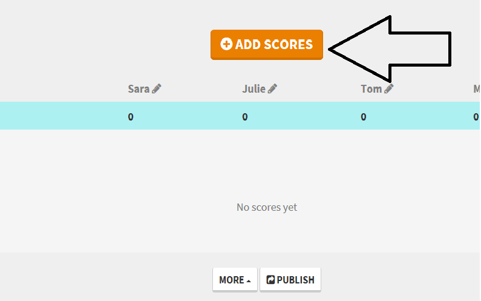

## Lesson Plan: Contingency Networking Capture the Flag 

### Overview

Today, students will compete in a capture the flag activity that will test many of the networking skills and tools learned so far.

### Instructor Resources

- Students will fill out the capture the flag challenge in a spreadsheet designed specifically for the activity. 

- The class will also have the option of tracking scores online. See Section 03 for details. 

### Lab Environment

Lab Details

 

It is not required, but you can use your local Vagrant virtual machine for today's activities to access Wireshark. Please note that instructors and students have different access credentials.

  - Instructor access:
    - Username: `instructor`
    - Password: `instructor`
  - Student access:
    - Username: `sysadmin`
    - Password: `cybersecurity`

### Slideshow

- The lesson slides are available on Google Drive here: [Networking CTF Slides](https://docs.google.com/presentation/d/1UOMXrdzBrCDXR3Im-_xCm_ZrkzpT8GSP00N0P1Ps6CQ/edit#slide=id.g7060886a85_0_251) 

---

### 01. Instructor Do: Welcome and Introduction to the Networking Capture the Flag (0:05)

Welcome the students to the last day of the second week of networking. Explain that today we will review everything we've learned about networks with an engaging and fun competition.

- Explain that today we will be conducting a **Capture the Flag (CTF)** contest.

- CTFs are very common cybersecurity training exercises, and often take place at security conferences or training events.

Today's CTF will focus solely on the networking concepts learned in the past two weeks. 

### 02. Instructor Do: CTF Instructions and Rules (0:10)

Explain how this CTF will work: 

- Students will be provided a spreadsheet with networking questions and challenges.

- Questions and challenges are separated into networking categories.

- Students will have to download PCAP files to answer questions.

- The answers to questions and activities are the **flags** that students must collect and document in their spreadsheet. 

- Each flag has a different numeric point value. The higher the point value, the more challenging the question/activity.

- Total points of flags will be calculated automatically in the spreadsheet.

- The student with the most points at the end of class, or who completes all the flags correctly first, wins the CTF. 

#### CTF Spreadsheet Walkthrough

While the spreadsheet document makes it easy to understand how to complete the CTF, give a brief overview.

  

  - When students figure out an answer (find a flag), they should place it in the **Flag** column.

  - Emphasize that all text answers must be **typed in lowercase (and without commas in numbers)** for the spreadsheet to work properly.
  
  - The **Flag Value** column indicates how many points each flag is worth. 

  - If the student gets the flag right, they will automatically receive the points and the field will turn green.

Explain that total points will be automatically calculated and displayed at the top of the spreadsheet.

  

Cover the following rules of the CTF:

- Students are allowed to use all class notes, slides, and online materials to solve the challenges.

- Flags do not need to be answered in any specific order. If a student is stuck on a question, they should move on to the next one.

- Instructors or TAs should assist with any technical CTF issues (e.g., a PCAP won't download), but should not provide guidance on answers.

Ask students if they have any questions before proceeding to the CTF scoring setup.
    
### 03. Instructor Do: CTF Scoring (0:10)

If you want to set up online scoring, use the [Keep the Score]( https://keepthescore.co/new/) website.

Go to the website and complete the following fields.

  - **Title**: Choose a name for your class, or you can call it "Networking CTF." 

  - Specify the number of students participating.

  - Leave the other values as they are.

  Select **Next**.

   

  - Enter the student names.

  Select **Next**.

   

   - On the next page, select **Add Scores**.

  

This where the students will add their own scores:

  - Send this link to all students on Slack and ask them to open it on their computers.

  

Explain to the class that this is where they will update their own scores.

  - They will select the **+1** or **+10** to adjust their scores to match the scores on their CTF. 
  
  - Explain that you will display the scoreboard for the class. 
  
  - To display the scoreboard:
   
    - Click **Back**.
     
    - Click **Publish** on the bottom of the screen.
     
    - Select **View** in the leaderboard. 
    

  
       
 - Explain that you will leave the scoreboard on the screen to display the scores of everyone in class.

 
    
  Ask the students if they have any questions on the scoring before beginning the CTF.

### 04. Student Do: The CTF Challenge (2:20)

We are ready to begin the Networking CTF!

 - Send the following file to students: 
    - [Activity File: Capture the Flag](./Resources/Networking_CTF_Version_II.xlsx)

 - Students who do not have Excel can use the free program [Libre](https://www.libreoffice.org/download/download/), which they should have already downloaded in Week 2. 

Emphasize that for this activity, all the flags entered into the CTF file need to be **lowercase**.

**Instructor Notes**

- Reference [the CTF answer key](./Resources/Networking_CTF_Version_II_Solution.xlsx) in case any issues come up during the activity.

- All the PCAPs are located in the Resources folder for reference.

- Be sure to wrap up the CTF 15 minutes before class ends to leave time for review.

### 04. Instructor Review: The CTF Challenge Review (0:15)

Begin by congratulating the winner and the second and third place finishers.

Send the [answer key](./Resources/Networking_CTF_Version_II_Solution.xlsx) to students and review some of the answers that were a bit more challenging:

- **Question 11**: The answer to this question required an online search. The answer can be found in this [web article](https://portforward.com/transformers-war-for-cybertron/).

- **Question 12**: The total packet count is displayed on the bottom of the Wireshark screen.

- **Question 15**: In the first packet's packet details, you will see: `Dst: ec2-54-225-163-14.compute-1.amazonaws.com (54.225.163.14)`

- **Question 16**: In the first packet's packet details, you will see under the Ethernet option: `Source:  08:00:27:1f:30:76`

- **Question 17**: Under the Time column you will see the day is 11-17-2020. If you look this date up in a calendar, you will see it is a Tuesday.

- **Question 19**: From the toolbar, go to **Statistics** > **Capture File Properties**, and the hash data is at the top of this page.  If you dont see **Capture File Properties** as an option, you may need to download the current version of Wireshark.

- **Question 20**: In the packet details, expand **Transmission Control Protocol**. Under the Flags section you will see the other flag is psh.

- **Question 21**: In the second packet, under **Transport Layer Security** > **TLS v1.2** > **Extension** > **Server Name** you will see www.tenetfilm.com. The answer is tenet.

- **Question 22**: From the toolbar, go to **Statistics** > **Conversations** > **TCP**. For the packet with the source port of `44222`,  under the column **Bytes A** > **B**. The answer is 634.

- **Question 23**: From the toolbar, go to **Statistics** > **Capture File Properties**. Average packet size B is 1513.

- **Question 24**: Run from a command line: `nslookup -type=ns tenetfilm.com`. The answer is warnerbros.

- **Question 26**: Use a binary to text webpage such as [Rapid Tables](https://www.rapidtables.com/convert/number/binary-to-ascii.html). The answer is beetlejuice.
  
- **Question 28**: ASCII of  65 = e,  6C = l,  66 = f. The answer is elf.

- **Question 30**: Use a [Base 64 decoder](https://cryptii.com/pipes/base64-to-text) web tool. You have to run the conversion **two** times to get the answer. In other words: decode once, then decode that answer with Base 64.

- **Question 31**: [ipinfo.io](https://ipinfo.io/) will provide the country code for the IP.

- **Question 32**: The range is `HostMin:   192.168.0.0 - 192.168.63.255`. Therefore the highest IP is `192.168.63.255`.

- **Question 49**: Using any binary to text converter to convert the results to `62:33:73:31:6D`. 

- **Question 50/51**: To decrypt the packets in Wireshark, go to **Edit** > **Preferences**. In the protocols menu, select **IEEE 802.11**.
  
  - Check **Enable decryption**, then select **Edit** and enter in the WEP key : `62:33:73:31:6D`. Filter by http and arp.

- **Question 51/52**: In packet 439, the packet details have both values:  `Internet Protocol Version 4, Src: Karens-iMac.local (192.168.0.50), Dst: rr.pmtpa.wikimedia.org (66.230.200.100).`

- **Question 53**: From the top of the toolbar, select **Wireless** > **WLAN traffic**, and the SSID will display.

- **Question 54**: Filter by http and you will see that that IP matches the domain of lostar.com.  If you go to that webpage on a browser, you will see the answer is london.

- **Question 55**: Use the following filter to see the answer on the bottom of the Wireshark page: `http.response.code >= 302`.

- **Question 56**: Filter by DNS. In packet 3864 you will see the CNAME of www.facebook.com. The TTL under DNS is 3506.

- **Question 59**: There are a couple ways to find this. Filter by DNS and you will see several queries are looking for the movie Rocky and its sequels.  

- **Question 60**: Filter by http. The packet number 135 redirects the user to the webpage rocky.design. 

- **Question 61**: Viewing a subnet mask chart, you will see that the subnet mask closest to 131072 hosts is `255.254.0.0`. 

- **Question 62**:  (224 + 127 + 254 + 2) = 607

     - First octet in lowest IPv4 multicast range:   (`224.0.0.0`) = 22
     - First octet in the loopback address: (`127.0.0.1`) = 127
     - Second octet in IP used when there is no DHCP server: (`169.254.x.x`) = 254
     - First digit of the Facebook IPV6 address (`2a03:2880:f11c:8183:face:b00c::25de`) = 2

- **Question 63**: Use the following site: [TCP Thoroughput calculator](https://www.switch.ch/network/tools/tcp_throughput/).  Enter  the data provided and you will calculate the following answer: 1600.00 Mbit/sec.

- **Question 64**: 

  - The max throughput for ALOHA = 0.184
  - The max throughput in frames/sec = (832000 bits/sec) x (1 frame/1000 bits) x 0.184 = 153.088 or (832 x .184) = 153.088
  - The max throughput (rounded to a whole number) is approximately 153 frames/sec.

   
-------

### Copyright

© 2020 Trilogy Education Services, a 2U, Inc. brand. All Rights Reserved.
