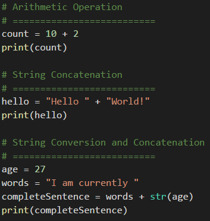
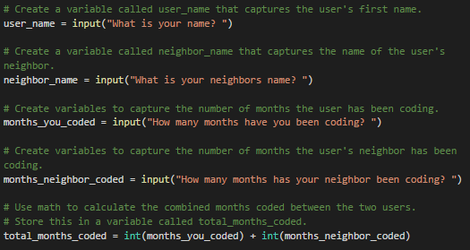

## 3.1 Lesson Plan: Power of Python

### Overview

In today's class, students will receive their first exposure to Python programming, and will understand its use cases in security. They will understand Python's basic syntax, starting first with variables and then covering lists and dictionaries. 

### Objectives

By the end of class, students will be able to:

* Explain how and why Python is used in cybersecurity.
* Create and run Python files via the terminal using VS Code.
* Use the `print()` function to print lines to the console.
* Use basic Python elements like variables and operators. 
* Employ the Python `input()` function to retrieve, store, and utilize user inputs. 
* Reference and store collections of data using lists.
* Create and reference data in dictionaries.
* Use `listVariable.append(Value)`, `listVariable.index(Value)`, and `listVariable.remove(Value)` to add, return, and delete values from a list.
* Use `len(listVariable)` function to return the length of a list.

### Instructor Notes

* This week's classes could be one of the most difficult units for your students (and potentially yourself). Take the time to practice the activities in this lesson plan. If you have questions that emerge during prep work, use the instructional community channel in Slack. 

* Spend ample time at the beginning of class to ensure that students have mastered the very basics of Python work. At a bare minimum, each of your students should be able to comfortably create a Hello World script and run it using the command line. Don't gloss over this! It's easy for students to get flustered right out the gate. If you breeze through the activities too quickly, students will struggle for the entire class.

* Load the unit folder into a VS Code window to help establish the workflow for today's class. Navigate between each of the activities from your VS Code window. This will enable you to quickly flip between exercises and solved/unsolved files. 

* Remind students on Macs that when they access Python via their terminal they should use the `python3` command (instead of `python`) otherwise they will be using the wrong version of Python and certain things won't run correctly. 

* Stay track of time as best possible, but always feel free to add a few extra minutes to the clock if students are struggling with an activity. As always, have your TAs refer to the [Time Tracker](../timetracker.xlsx) to help you stay on track.

### Sample Class Video

* To view an example class lecture, visit: [Class Video Part 1](https://codingbootcamp.hosted.panopto.com/Panopto/Pages/Viewer.aspx?id=321a4752-c3fc-49de-b5d5-a975000dcb0f),
[Part 2](https://codingbootcamp.hosted.panopto.com/Panopto/Pages/Viewer.aspx?id=a66647e1-ff6b-40e5-ba3c-a975000e0bcd),
[Part 3](https://codingbootcamp.hosted.panopto.com/Panopto/Pages/Viewer.aspx?id=44ba6742-58e8-45b5-97c3-a975000e9f4e), 
[Part 4](https://codingbootcamp.hosted.panopto.com/Panopto/Pages/Viewer.aspx?id=58d313fc-4ff1-4df2-a55c-a975000ed462).

### Slideshow

- The lesson slides are available on Google Drive here:[Python Day 1 Slides](https://docs.google.com/presentation/d/1oyjrVzFQcJjtK1eSP6LO8q27MTAM8kghZuIipWOAa-I/)

- To add slides to the student-facing repository, download the slides as a PDF by navigating to File > "Download as" and choose "PDF document." Then, add the PDF file to your class repository along with other necessary files.

- **Note:** Editing access is not available for this document. If you or your students wish to modify the slides, please create a copy by navigating to File > "Make a copy...". 

----

### 1. Direct Instruction: Why Python? (0:08)

* Welcome the students to their third week of Cybersecurity boot camp and their first true foray into the wonderful world of programming. 

* For the next couple of weeks students will be diving into the Python programming language. This first week will focus on the building blocks of the language. In the second week, we will dive into some of the libraries and modules cybersecurity programmers often use in their day-to-day work.  

* Use the slides to guide your discussion. 

* Specifically explain why students will be learning Python as opposed to any of the other programming languages on the market. Some reasons you can include are the following: 

  * Python is a high-level, general purpose programming language used for a variety of applications. It has an enormous community of developers with backgrounds in a wide variety of industries and jobs.

  * The syntax makes it incredibly readable, making it an excellent introductory programming language, while still being immensely powerful.  Python forces you to follow certain rules to make the code readable. Well written code makes it easier for everyone to read, which makes team collaboration easier. 

  * Learning Python is also a huge competitive advantage for technically oriented cybersecurity jobs. Again, feel free to share specific examples of this.  

* Compare and contrast the shell scripts covered in Unit 2 to the Python scripts covered in this unit. Explain that shell scripts are great for OS level interaction, dealing with processes, and interacting with the file system. Python is great for simple or complex logic-based applications and for automating complex tasks. 

  * Most programmers will use both Python and Bash. Python allows us to write complex applications and do logic with relative ease, but the terminal/Bash is indispensable for OS and file system interaction. 

  * Give real-world examples of how you use Python in your day-to-work as well. 

### 2. Guided Practice: Updating the VM

* Students need to update their VM's to get the python content directly downloaded onto the VM.

* Move to the vagrant directory that was used to download the VM originally. If this wasn't changed it should be `$HOME/Documents/Cybersecurity-Bootcamp/Linux-Module`
  * If students need a refresher on how the vagrant VM was setup, they can refer to [this document.](https://docs.google.com/document/d/1h-zcoKt6c4AnZBENHLPWsXJ1djs1c96-9zkf7Jsb_GQ/edit)

* Run `vagrant box update` to get the latest VM.

* When the update finishes, run `vagrant destroy --force && vagrant up`.
  * NOTE: This command will delete the old version of the VM and any changes made to it.
  * **Do not destroy your existing VM if it still contains work you need to refer to later.**

### 3. Guided Practice: VS Code setup inside the VM
Explain that VS Code is a coding environment that will allow you to see your code and run it using a built in command line.

* Once the VM is running, the students will login with `sysadmin:cybersecurity` 

* To open code, open your terminal and run the command `code ~/python`

* This opens the directory `~/python` in VS Code and you can see all of these activities and directly work on your code.

* Alternatively, you can click on the grid in the bottom left hand corner to open applications
  * Search for VS Code and click to open it. 
  * On the left panel, click the button to 'open a folder', and find the `~/python` directory.

* This directory has a folder for each day of python (1, 2, 3) and inside each day are directories for each activity, with an unsolved and a solved script. 

* Students should work with the unsolved scripts during the activity time, and then the instructor will review the solved script after each activity.

Press `ctrl + ~` to open a terminal window at the bottom of the VS Code window:

Code has 3 main panels:
The panel on the left is a file explorer where you can see and browse the files you are working on.

The panel on the top middle of the screen is where you will edit your files and enter your code.

The panel on the bottom is a terminal (toggle it up or down with `ctrl + ~`) and you can run your code there.

* Instructor demonstration scripts are also included in the `~/python` directory so students can follow along on their own VMs with the demonstrations.

### 4. Direct Instruction: Hello World! (0:10)

* Now that everything is ready to go, it is time to create our first Python application! Following in the footsteps of programmers across the globe, this first script will simply print the words "Hello World!" to the command line.

  * Explain that the purpose of this first application is not to perform some vital cybersecurity task but instead is an introduction to creating and running Python scripts.

  * The steps taken during this demo are the same steps they will perform countless times as they create new Python scripts for the rest of their lives.

* Open VS Code and create a new file.

* Before typing anything into the editor, save the file as `HelloWorld.py` and explain that the `.py` extension lets the computer know that the contents of this file should be read as Python code.

* Type the line `print("Hello World!")` into the editor and ask the class what they think this line will do when the computer runs it. Give them a moment to answer the question and then announce that this line will print the phrase "Hello World!" to the console.

* Add a new line just above the one you just wrote and, using the  `ctrl+/` shortcut, create a new comment: `# My First Python Program!`.

  Comments are heavily used by programmers to explain what the lines (or blocks) of code will do when they are run. Comments do not affect the running of the code.

  

* Save the application again and then open your terminal. Go to the folder where you saved `HelloWorld.py` and then type `python HelloWorld.py` into the console. Hit enter and watch the code run.

  

* Point out how important it is for the terminal to be located in the same directory as the Python file when running the application. If we try and run `python HelloWorld.py` inside of a folder without the `HelloWorld.py` application, the code will not run.

### 5. Guided Practice: Goodnight World! (0:07)

* Now that the class has seen how to create and run a Python script, they will now make a program of their own and practice running it from within the terminal.

* When the students have finished this activity (in most cases, they will be able to do this activity in less than 7 minutes), do a quick review with them and send out the solved [GoodnightWorld.py](Activities/02-Stu_GoodnightWorld/Solved/Goodnight.py) file.

* Send the students the following instructions over Slack.

* **Instructions:**

  * Create a new file in VS Code and save it as `GoodnightWorld.py`.

  * Write a line of code that will print out the line "Goodnight World!" to the terminal when it is run.

  * Go to the folder where you saved `GoodnightWorld.py` and run the application.

* **Tips:** 

  * The `print()` function allows you to print lines to the console. 

  * Remember to put the phrase in quotes so that it prints properly.

### 6. Direct Instruction: Variables and Data Types (0:10)

* Much of programming involves performing logical operations on data. Programming languages provide the set of instructions to manipulate and work with data. 

  * You can use the Programming Fundamentals section in the slides to guide your discussion. Keep in mind that you will reiterate a lot of the concepts in the slides with the below activity. Having students hear concepts multiple times is a good reinforcement tool. 

* Open [Variables-1-Basics-Types.py](Activities/03-Ins_Variables/Variables-1-Basics-Types.py) in VS Code and explain that, since data is such a large part of programming, it is important to note how data is stored and handled in Python using variables. 

  * Variables are the holding ground for data. They essentially allow us to attach specific values to keywords for use later on in an application.

  * Quickly point out that variables that have been assigned can then be referenced and reassigned in the code later. This makes variables a powerful tool when crafting more complex applications. **Note:** You don't have to go in greater depth here, but students that already have an understanding of coding might benefit from hearing this now. 

* Explain that variables can hold different types of data. The following are a few different data types within Python:

  * ***Integers*** are whole numbers that can be either positive or negative. While there are limits to how large integers can be in other programming languages, Python allows for integers of any length.

  * ***Floats*** are numbers specified with a decimal point. They are different from integers in that integers have to be whole numbers while floats can contain decimals within them.

  * ***Strings*** are any collection of characters bounded by a pair of quotation marks. They can contain numbers within them but these numbers are seen as characters without any numeric value.

  * ***Booleans*** are logic data which denote whether something is considered true or false.

    

* Run the `print` function on the above variables and explain to students what `print` does.

* Lastly, we'll address ***operators***.Open [Variables-2-Concatenation.py](Activities/03-Ins_Variables/Variables-2-Concatenation.py) and point out that another important facet of variables and data types is how they can be altered using  simple **arithmetic** or **concatenation**. 

  * As you go through the examples below, be sure you use the `print` function to show the output.

  * By taking numeric values and using arithmetic symbols like plus (+) for addition, dash (-) for subtraction, star (*) for multiplication, and slash (/) for division, we can create mathematic formulae to manipulate and create variables.

  * Create and show your own examples of arithmetic functions for subtraction, multiplication, and division. 

  * Strings can also be added together using the plus (+) symbol.

    **Important!** Using the plus symbol only works when only strings are supplied. If an integer or Boolean were to be concatenated with a string, an error would be returned.

  * If the variable hold an integer, you can convert that integer into a string by using the `str()` function. Demo this for the class and walk them through where you insert the variable within the string function. 

  * In the last example, we are converting an integer to a string. We are then concatenating that output with a variable that contains a string (that variable is words) and storing that output into a new variable (complete sentences).

    

* Answer any questions the class may have before moving onto the next activity.

### 7. Direct Instruction: Variable Dissection (0:10)

* Open the unsolved version of the [Variable Dissection](Activities/04-Evr_VariableDissection/Unsolved/UNSOLVED_Variables-Dissect.py) activity and go through the script with the class. How to create variables and store information to the variable.

* Ask students to predict what each block of code will print to the terminal.

* Also have the class predict what data type is being printed so that they get additional practice in determining data types. 

### 8. Guided Practice: Variable Address (0:12)

* Now that we have an understanding of variables and data types, students will create some variables for a website, including those that store the daily hits in order to print out a summary of this information.

* Send the following file and instructions to students over Slack.

* **File:** [VariableAddress](Activities/05-Stu_VariableAddress/Unsolved)

* **Instructions:**  

  * Create a variable called `URL` which will contain a URL in string form.

  * Create a variable called `IP_address` which will contain an IP address in string form.

  * Create a new variable for each weekday and, using integers, set them equal to how many hits the site got on those days. **Note:** You can use an arbitrary number for each.

  * Create a variable called `weekly_hits` and set it equal to the sum of the hits on each day of the week.

  * Create a variable called `average_hits` which takes the weekly_hits and divides it by the number of weekdays in a week.

  * Print out each variable to the terminal. **Note:** Remember to *cast* your integer variables as strings when printing!

### 9. Direct Instruction: Review Variable Address (0:05)

* Open the [solved version](Activities/05-Stu_VariableAddress/Solved/VariableAddress.py) of the Variable Address activity and go through the solution with the class, making sure to cover the following points:

  * In order to store the website's daily hits for the week, take the variables for each day of the week and add them up before storing the result within the `weekly_hits` variable.

    

  * To store the average number of hits per day, take the `weekly_hits` variable and divide it by seven before storing the result within the `average_hits` variable.

    

  * When printing out the weekly and average hits for the website, the `weekly_hits` and `average_hits` variables must be converted into strings. If this is not done, an error will be returned.

    

* Answer any questions the class may have before moving to the next activity.

### 10. Direct Instruction: User Input (0:05)

* Use the slide on User Input in the slides to introduce this concept. 

* Next, open [UserInput.py](Activities/06-Ins_UserInput/UserInput.py) in VS Code and explain that often we will want to pull in some information from a user. We will use the information in our programs and so when we collect that information we will need to store it typically in a variable. 

* Give a real-world example of when you would need user input in your program.

* In order to get that user input in Python, we use the `input()` function and store the result to a variable.

  * If you place a string inside of the parentheses of the `input()` function, this will be a prompt that the user sees.

  * The `input()` function waits to execute any code that follows it until after the user has entered a value.

  * Walk students through the syntax of the example below `name = input("What is your name? ")'`. Run this in the terminal so students can see that what follows is the "What is your name?" prompt.

  * Follow this with entering a string that holds a name and then run the variable name so that students can see that the name variable now holds that name you entered.

    **Note:** The value always comes back as a string, therefore if you want the user to enter in an integer or a float, it will need to be converted.

  * Then run `print("Hello "  + name)`. Quickly explain why we use a space before the end quotation mark in hello. 

    

* Answer any questions that the students may have before moving to the next activity.

### 11. Guided Practice: Down to Input (0:10)

* In this activity, students will create an application by gathering information from your neighbor and then running some code.

* Send the following file and instructions to students over Slack.

* **File:** [DownToInput](Activities/07-Stu_DownToInput/Unsolved)

* **Instructions:**

  * Create two different variables, `user_name` and `neighbors_name`, that will take the input of your first name and your neighbor's first name.

  * Create two more variables, `months_you_coded` and `months_neighbor_coded`, that will take the input of how many months each of you have been coding.

  * Create another variable, `total_months_coded` that combines the total number of months that each of you have been coding. 

  * Print out the following two statements:
    *  The first should say `I am [user_name] and my neighbor is [neighbor_name]`.
    *  The second should say `Together we have been coded for total_months_coded`.

### 12. Direct Instruction: Review Down to Input (0:05)

* Open the [solved version](Activities/07-Stu_DownToInput/Solved/DownToInput.py) of the input activity and go through the solution with the students, making sure to cover the following points:

  * There are two prompts in this activity whose responses require conversion. 

    The first is in response to how many months the you have coded and the second is in response to how many months your neighbor has coded. 

    These values need to be converted into integers so that they can be added together to find the total number of months both users have been coding combined.

    

  * Since the `total_months_coded` variable is an integer, however, it will need to be converted back into a string when printing the result of the previous equation to the terminal.

    

* Answer any questions students may have before letting them out on break.

----
### 13. Break (0:15)
----

### 14. Direct Instruction: Intro to Lists (0:10)

* Welcome students back from their break. 

* The next data type we will be covering is lists. Use the List section of the slides and explain the following information about lists in your discussion: 

  * Lists hold multiple pieces of data within a single variable. In other programming languages, they can be called arrays. 

  * The data that is stored within lists can be of multiple types as well. This means that strings, integers, floats, and Boolean values can all be stored within a single list. For the most part, lists are generally used to contain data of a similar type.

* Open [Lists.py](Activities/08-Ins_Lists/Lists.py) in VS Code and use it as a guide to explain the following:

  * To create a list, set a variable equal to a series of values contained within a pair of square brackets; each value is separated from the one before it by using a comma.

  * Each individual value within a list is called an element and each element's position in the list is marked by an index. These indexes always start at zero and move up from there. This means that the first element in a list is located at the index of zero while the second element is located at the index of one.

  * To reference the value at a specific index you include the name of the list with a pair of square brackets after it and then, inside of those brackets, you place the element’s index, for example see the following image:

    

* Explain that there are also a number of methods that work with lists as follows:

  * The `listVariable.append(Value)` method adds an element on to the end of a list with the value provided.

  * The `listVariable.index(Value)` method returns the numeric location of the given value within a list.

  * The `listVariable.remove(Value)` method deletes the given value from a list.

  * The `len(listVariable)` function returns the length of a list.

    

* Answer any questions students may have before moving onto the next activity.

### 15. Guided Practice: Messy Lists (0:15)

* In this activity, students will be given a large list of IP addresses and will answer some basic questions based on its contents. Afterwards, they will add and remove IP addresses to and from the list.

* Send the following file and instructions to students over Slack.

* **File:** [MessyLists](Activities/09-Stu_MessyLists/Unsolved)

* **Instructions:**

  * Determine the length of the list and print the length out to the terminal.

  * Determine the indexes for the IPs "82.82.0.22" and "207.209.106.220" and then print the indexes out to the terminal.

  * Add the following IP addresses to the list:

      * "220.66.146.40"
      * "245.201.208.161"
      * "208.222.148.199"
      * "104.216.140.187"
      * "73.57.167.115"

  * Remove the following IP addresses from the list:

      * "53.239.114.76"
      * "65.136.121.223"

### 16. Direct Instruction: Messy Lists Review (0:05)

* Open the [solved version](Activities/09-Stu_MessyLists/Solved/MessyLists.py) of the Messy Lists activity and go through the solution with the students, making sure to cover the following points:

  * To find and print the length of the list, use the `len(IP_addresses)` function, convert the result into a string, and then concatenate this response into a print statement.

  * To find the index of an element within the list, use `IP_addresses.index(Value)`, convert the result into a string, and then concatenate this response into a print statement.

    

  * To add in new IP addresses to the list, use the `IP_address.append()` function and then pass the new value to add in-between the parentheses.

  * To remove old IP addresses from the list, use the `IP_address.remove()` function and pass in the old value to remove in-between the parentheses.

    

* Answer any questions students may have before moving onto the next activity.

### 17. Direct Instruction: Dictionaries (0:10)

* The final data type students will commonly run across over the course of their programming careers is dictionaries.

* Use the Dictionaries section of the slides and explain the following points in your discussion:

  * Like lists, dictionaries can contain multiple values and types of data within them.

  * Unlike lists, however, dictionaries store data in key-value pairings where the key is a string that can be referenced in order to collect the value that is associated with it.

* Open [dictionaries.py](Activities/10-Ins_Dictionaries/Dictionaries.py) in VS Code and explain the code that is contained within it. Make sure to review the following:

  * A pair of curly braces is used to create a dictionary: `variable = {}`.

  * Values can be added to dictionaries at declaration by creating a key that is stored within a string, following it with a colon, and then placing the value desired afterwards.

  * Referencing a value within a dictionary is as simple as calling the dictionary and following it up with a pair of brackets containing the key for the value desired.

    

  * Dictionaries can hold multiple pieces of information by following up each key-value pairing with a comma and then placing another key-value pair afterwards.

  * Dictionaries can also store lists. They can be accessed by first calling the key and then indexing the list. Assure students they only need a basic understanding of this for now and that when they get into APIs they will get a lot more practice.

  * Dictionaries can also contain other dictionaries. In order to access the values inside nested dictionaries, simply add another key to the reference.

    

  * It is important to note how dictionaries in Python will always auto-sort alphabetically. This means that the order in which key-value pairs were declared many not be the order they would be when printed in the console.

* Answer any questions students may have before moving onto the next activity.

### 18. Guided Practice: Hobby Book (0:15)

* In this activity, students will practice creating and accessing their own dictionaries based on their hobbies.

* Open [HobbyBook.py](Activities/11-Stu_HobbyBook/Solved/HobbyBook.py) within the terminal and run the code to show the end results of the application before sending the following instructions over Slack. Make sure you don't send them the solved file until after the activity.

* Send the following files and instructions to students over Slack. 

* **File:** [HobbyBook](Activities/11-Stu_HobbyBook/Unsolved) 

* **Instructions:**

  * Create a dictionary that will store the following:

    * Your name
    * Your age
    * A list of a few of your hobbies
    * A dictionary of the times you wake up during the week

  * Print out three statements: 
    * Hello I am (name) and I am a (occupation)
    * I have (number of) hobbies!
    * On the weekend I get up at (time)

  * Use the file provided to help you get started.
  
### 19. Direct Instruction: Hobby Book Review (0:05)

* Open the [solved version](Activities/11-Stu_HobbyBook/Solved/HobbyBook.py) in VS Code and walk through the code, making sure to explain the following:

  * A variable called my_info stores the primary dictionary as noted by the curly braces.

  * The keys are "name", "occupation", "age", "hobbies", and "wake-up". Their values are what is stored after the colons with each new key-value pair being separated by a comma. 

  * In order to find the number of values stored within the "hobbies" key, the `len()` function is used.

    

  ### 20. Direct Instruction: Review and Close Class (0:03)
  
  * Let students know that we covered a lot and that it's fine if concepts still seem confusing. We'll solidify them as the week goes along. 
  
  * Review anything you noticed students struggled with in particular. 
  
  ### 21. END 

-------

### Copyright

Trilogy Education Services © 2018. All Rights Reserved.
