## 3.2 Lesson Plan: Picking Up the Python Pace

### Overview

Today's class will pick up the Python programming pace by introducing students to conditionals and loops. 

### Objectives

By the end of class, students will be able to:

* Use simple and complex conditionals to create branching paths for programs to execute. 

* Build a command-line application using conditionals and user input.

* Use `for` and `while` loops to iterate through lists and dictionaries to perform basic operations on collections of data.

* Use the `range` function to loop through a list with defined ranges. 

* Use the `enumerate` function to loop through a list with a built-in counter. 

* Use `key`, `value`, and `item` methods with loops to convert data from dictionaries into lists.

### Instructor Notes

* Today's class covers a lot of material, and based on the time tracker will run 10 minutes over. If you cannot fit everything into today's session, feel free to move the final activities to the next session as the main class activites then will end early. 

* You and your TAs should walk around the room during activities and be ready to help any students who are struggling. 

* Take the time necessary before class to familiarize yourself with each activity for today. In particular, make sure to practice your workflow before class. Take the time necessary to articulate what you are doing at each step. Today's class, like the first one in this unit, is very activity based. 

* Try to stay on track of time as best possible. As always, have your TAs refer to the [Time Tracker](../timetracker.xlsx) to help you stay on track.

### Sample Class Video

* To view an example class lecture, visit: [Class Video](https://codingbootcamp.hosted.panopto.com/Panopto/Pages/Viewer.aspx?id=3c07d626-cacb-4b67-a9fc-a9990183e855)

### Slideshow

- The lesson slides are available on Google Drive here: [Python Day 2 Slides](https://docs.google.com/presentation/d/1Fk02kWTJZevy_YmEOd_1wx_k1ZMUZ3lsg_3aNhPTkVM/).

- To add slides to the student-facing repository, download the slides as a PDF by navigating to File > "Download as" and choose "PDF document." Then, add the PDF file to your class repository along with other necessary files.

- **Note:** Editing access is not available for this document. If you or your students wish to modify the slides, please create a copy by navigating to File > "Make a copy...".

----

### 1. Direct Instruction: Welcome Class (0:05)

* Welcome students to their second day of Python!

* Today we will be making simple command-line applications that use looping and conditionals.

* Use the slides to review the goals for today's class. 

* Before launching into anything new, we will start with a warm-up activity based what we've learned so far.

### 2. Guided Practice: Doling Out Data Types (0:12)

* In this activity, students will create a wide variety of variables and print out the information contained within them to the screen.

* Send students the following files and instructions over Slack. 

* **File:** [Doling out Data Types](Activities/01-Stu_DolingOutData/Unsolved) 

* **Instructions:**

  * Declare a variable called `name` and store your name inside it.

  * Print the message: "My name is *YOUR NAME HERE*."

  * Declare a variable called `age` and store your age inside it.

  * Print the message: "I am *YOUR AGE HERE* years old."

  * Declare a variable called `pizza_price` and store a number inside it.

  * Declare a variable called `number_of_pizzas` and store a number inside it.

  * Store the total price for all the pizzas in a variable called `total_price_of_pizzas`.

  * Print the message: "The price of pizza is *PRICE OF PIZZA* dollars."

  * Print the message: "We are buying *NUMBER OF PIZZAS* pizzas."

  * Print the message: "The total price for all the pizzas is *TOTAL PRICE OF PIZZAS*."

  * Create a list, called `favorite_countries`. Store the name of four favorite countries inside it.

  * Print the message: "My favorite countries are *LIST OF COUNTRIES HERE*."

  * Create a dictionary called `contact_information` and store a home phone number, a cellphone number, and an email address inside of it.

  * Print out the message: "Please contact me at *EMAIL* or call me at *HOME PHONE*"

  * Print out the message: "In case of an emergency call *CELL NUMBER*"
  
  * **Use the script file provided to help you through your solution. We filled in the first few answers for you.**
  

### 3. Direct Instruction: Doling Out Data Types Review (0:05)

* Open the [solved version](Activities/01-Stu_DolingOutData/Solved/DolingOutData.py) of the previous activity within VS Code and walk through the code, make sure to explain the following:

  * Since the `age` variable is most likely an integer, it has to be converted into a string before being added into its associated print statement. Not doing so would cause an error.

  * The same is true of the `pizza_price`, `number_of_pizzas`, and `total_price` variables. Since these are all integers, they must be converted into strings before being passed into their print statements as well.

    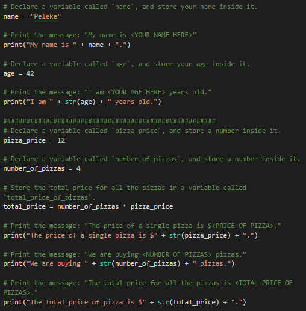

  * While it would be acceptable to print out each element in the `favorite_countries` list individually using their index, it is also possible to just convert the entire list into a string and print that instead.

    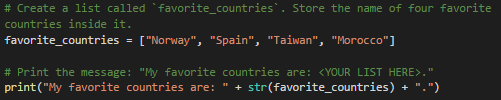

  * Remind the class that referencing the values stored within a dictionary is similar to referencing an element stored within a list. Instead of using a numeric index, however, each value has an associated string index that is its key.

    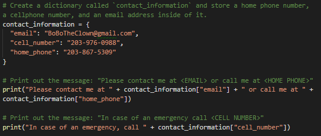

* Answer any questions students may have before moving to the next activity.

### 4. Direct Instruction: Simple Conditionals (0:10)

* Explain that often we will want to write more complex programs where we run code only when certain conditions are met.

* Use the slides to introduce conditionals or jump right into the activity which also covers the basics. 

* Open [SimpleConditionals.py](Activities/02-Ins_SimpleConditionals/SimpleConditionals.py) within VS Code and go over conditionals and their syntax with the class.

* Nearly every single conditional statement in code starts with an `if` statement. The if statement is the cornerstone on which conditional statements are built.

  Consider the following about the syntax and structure of simple conditionals:

  * The equation after the `if` statement is declared is called the condition. This is a statement that if true, will cause the code block below the condition to run. If the condition is false, the code block will not run.

  * The colon after the condition is required in Python. It separates the condition from the body of code that follows.

  * The lines of code after the colon must be indented. It is standard in Python to use four spaces for indenting, but any kind of indentation will work so long as it is consistent.

  * The indented lines after the colon will be executed whenever the condition is true. These lines will not run when the condition is false.

  * When the script reaches code that is not indented, the conditional is considered to have ended. 

    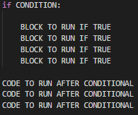

* Go over the following comparison operators that we use with conditional statements:

  * The `==` operator indicates that the value of one variable is equal to another. So if the values are equal then the conditional statement will evaluate as True.

  * The `!=` operator indicates that the value of one variable is NOT equal to another. So if the values are NOT equal then the conditional statement will evaluate as True.

  * Go through the remaining operators and explain how the conditional statement will evaluate: 

    * The `<` operator indicates that the value of one variable is less than another. 
    
    * The `>`  operator indicates that the value of one variable is greater than another.
    
    * The `<=` operator indicates that the value of one variable is less than or equal to another. 
    
    * The `>=` operator indicates that the value one variable is greater than or equal to another.

    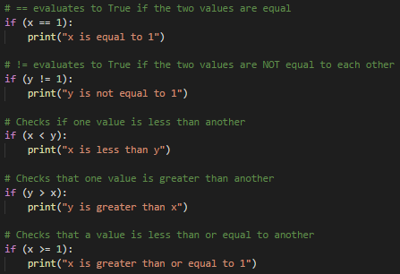

* In many cases, if our `if` condition evaluates as false, we may want another block of code to execute instead. For this, we need to use an  `else` statement. `else` statement. 

  * The else statement cannot be used on its own. It must follow an `if` statement and can only be used once per conditional block. In other words you can't have two `else` statements in one conditional block.
  * The indented code stored after the `else` statement only runs when the preceding `if` condition fails.

* The `else` statement could be seen as a kind of failsafe for conditionals because it does not require any specific condition to be met. It simply requires the previous conditions to fail.

  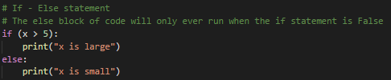

* Answer any questions students may have before moving to the next activity.

### 5. Guided Practice: Password Check (0:07)

* Now it's time for a student activity!

* In this activity you will create a command-line application that will ask users for their password and will check it against the correct one. It will ask users for their password, and store their response into a variable. And then it checks to see whether this response matches the master password.

* Send the students the following file and instructions over Slack:
  * **File:** [UNSOLVED_PasswordCheck](Activities/03-Stu_PasswordChecker/Unsolved)

  * **Instructions:**

    * Use the **PasswordCheck.py** file to create a command-line application that asks users for their password. 

      * If the password matches the value stored within the `master_password` variable, alert the user with a message stating: "You have been granted access!"

      * If the password does not match the value stored within the `master_password`, alert the user with a message stating: "You have been denied access!"
     

### 06. Direct Instruction: Password Check Review (0:03)

* Open the [solved version](Activities/03-Stu_PasswordChecker/Solved/PasswordCheck.py) of the activity and go through the solution with the students. Explain the following points:

  * The application first needs to capture the user's password within a variable through the use of the `input()` function.

  * Create a conditional statement which checks whether the user's password matches the value stored within the `master_password` variable using the line `if (password == master_password):`.

  * An `else` statement is then used to account for any time in which the password entered by the user does not match the value of the `master_password`.

    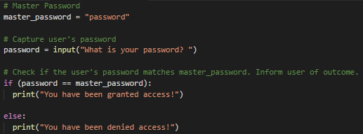

### 07. Direct Instruction: Complex Conditionals (0:10)

* While there are plenty of applications we can make with simple conditions that use only one`if` and `else` statements, there will be times when we will want our programs to include more complex behavior.

* Open the [ComplexConditions.py](Activities/04-Ins_ComplexConditionals/ComplexConditions.py) file.

* For example, we can use the `and` keyword in our conditional statements. This allows multiple conditions to be combined and requires evaluate as True for the entire conditional statement to evaluate as True.

* We can also use the  `or` keyword in our conditional statements. This allows multiple conditions to be combined but it only requires that one of the conditions evaluates as True for the entire conditional statement to evaluate as True.

  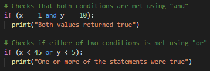

* The `elif` statement acts as a combination of both the `if` and `else` statements.

  * The code stored after an `elif` only runs when all preceding `if` and `elif` conditions have failed **and** an attached condition is met. This means that any number of `elif` statements can be chained together to account for any number of precise conditions.

  * An `else` statement can still be placed at the end of an `elif` chain to act as a catchall just in case none of the preceding conditions return as True.

    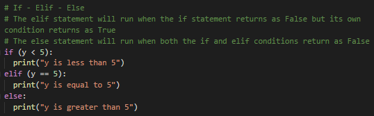

* Sometimes within a conditional block, we will want our code to check for other conditions. For this we use the nested `if` statement.

* Nested conditionals are primarily used to create increasingly specific pathways for code to follow that may not otherwise be possible with just the `and`/`or` keywords.

* There can be any number of nested conditionals, but it is often best to try and keep them under control. Too many nested `if` statements tend to create increasingly confusing code and there are usually other methods which could be employed to reduce this complexity.

  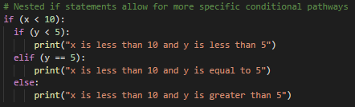

* The `in` keyword allows programmers to check whether one value is located somewhere inside of a list or a dictionary.

  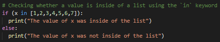

* Answer any questions the class may have before moving to the next activity.

### 08. Guided Practice: Bad Bartending (0:15)

* In this activity, students will create a digital bartender. This application will first ask the user for their age in order to determine if the user can be served drinks and then will ask for the user's order. If the order is in the known list of drinks, it will then print "Cheers!" to the terminal.

* Send the students following files and instructions over Slack. 

  * **File:** [Bad Bartending](Activities/05-Stu_BadBartending/Unsolved) 

  * **Instructions:**
    * Set a variable called `drinking_age` to 21.
    * Prompt the user for their age in years and then check if the user is 21 or older.

      * If the user is 21 or older, create a list called `drinks` and store the names of 4 cocktails inside of it. Then prompt the user for the drink they want, check if the user's selection is in the`drinks` list, and print "Cheers!" to the terminal if it is.

      * If the user is not 21 or older, print "your fake looks really fake" to the terminal instead.
      
    * Use the script file provided to get started. We have provided you with the initial code as well as some important pieces throughout. Use the comments to help you with the rest of the code.

### 09. Direct Instruction: Bad Bartending Review (0:05)

* Open the [solved version](Activities/05-Stu_BadBartending/Solved/Bad_Bartending.py) of the activity and go through the solution with the class, making sure to cover the following points: 

  * Point out we converted the user's inputted age into an integer in a different way. This time we nested the `input()` function within an `int()` function. This means that whatever the user types into the terminal will immediately be converted into an integer as it is being stored to the `user_age` variable.

  * The first `if` statement simply checks whether the `user_age` variable's value is greater than or equal to 21. So long as this is true, the application will continue.

  * We are using a nested `if` statement here since the only time in which a user will be asked to input a drink is if they are 21 or older. The second conditional then checks to see if their inputted drink is inside of the `drinks` list.

    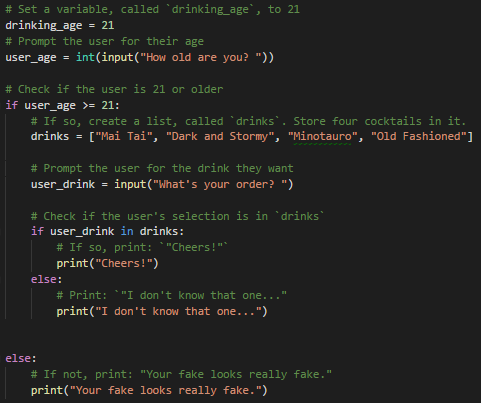

* Answer any questions the class may have before moving to the next section.

### 10. Direct Instruction: For Loops (0:06)

* Point out that having to type the same line of code multiple times is bad practice. For example if we have three items and we wanted to print out these items, we wouldn’t want to create three print statements. Instead we can put those items into a list and loop through the list.

  Include the following points in your discussion and use the slides.

  * Loops allow programmers to run a block of code multiple times without having to repeatedly type that block of code.

  * For example, let's say we have a list of zoo animals and want to print them to the terminal one at a time. We could write out individual print statements for each element in the list, but that would take up a lot of space and be inefficient. Instead we can use something called a `for` loop in order to iterate through the list one element at a time and run each element through the same block of code.

  * This is done using the following syntax: `for temp_variable in list_variable:`.

    Where `temp_variable` is a temporary variable which holds a single element from within the `list_variable`. Each time the loop completes, the value of `temp_variable` is modified to be the next element in the list until there are no values left.

  * Continue to use the slides to explain this with the zoo animals' example. 

* Continue with the slides, if necessary, for a more explicit discussion of for loops using the looping example with the vegetables array.

* Say that we have a list of hobbies and we want to print them to the terminal one at a time. We could write out individual print statements for each element in the list, but that would be inefficient. So instead we use the `for` loop in order to iterate through the list one element at a time and run each element through the same block of code.

    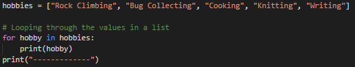

### 11. Direct Instruction: Range and Enumerate (0:04)

* The `range(x,y)` function allows programmers to loop through a sequence of numbers where `x` is the number to start from and `y` is the number to end before.

  * **Important!** It is critical that students understand that the second value passed into the `range()` function is exclusive. 
  
  * This means that this number will NEVER actually be reached. The final number reached using the `range()` function is the number just before the one passed.

  * Because each element in a list has an associated index, we use the `range()` function to loop through a specific set of elements within a list.

    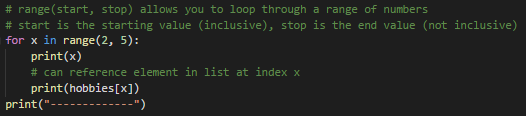

* The `enumerate()` function could also be used to loop through a list but adds a built-in counter. In other words, the `enumerate()` command allows users to both loop through a list and count the current iteration of said loop.

  * Two temporary variables have to be created when using `enumerate()`. The first variable is an integer that points to the current iteration of the loop while the second variable is the value of the current element in the list being looped through.

  * This function also allows programmers to choose what number to start the counter out at. This means that they can have the counter begin counting from the number one instead of zero.

    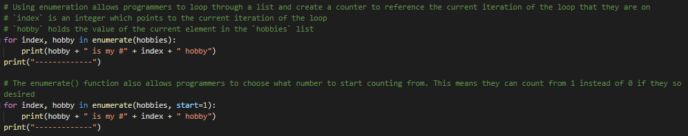

* Answer any questions students may have before moving to the next activity.

### 12. Guided Practice: Vulnerable List (0:10)

* In this activity, students will create two `for` loops to navigate through a list of vulnerable IP addresses. The first loop uses `range()` to collect the five most vulnerable addresses in the list while the second uses `enumerate()` to collect all the IP addresses and print out their individual ranks.

* Send the students following file and instructions to the class:

  * **File:** [VulnerableList.py](Activities/07-Stu_VulnerableList/Unsolved)

  * **Instructions:**

    * Using the file provided, do the following: 

      * Create a loop using range() that moves through only the first 5 IP_addresses and prints them in order to the screen with their rank.

      * Create a loop using enumerate() that goes through all the IP_addresses and prints out the vulnerability ranking for each one.

* **Hint:** The *ranking* for an IP address is determined by its position in the list. The first element has the ranking of 1, the second has the rank of 2, and so on.

* We have provided the initial code for you in the script file. Use the comments to help you with the rest of the code.

### 13. Direct Instruction: Vulnerable List Review (0:05)

* Open the [solved version](Activities/07-Stu_VulnerableList/Solved/VulnerableList.py) of the activity and go through the solution with the class. Make sure to cover the following points:

  * The first loop uses `range(0,5)` to loop through the first 5 elements within the `IP_addresses` list since the first element in a list is located at the index of 0 while the fifth element would be located at the index of 4.

  * The `rank` variable is set equal to the current iteration of the loop plus 1 so that the element located at the index of 0 has a ranking of #1.

    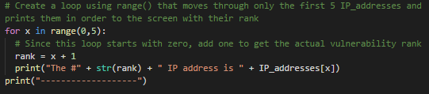

  * The second loop uses `enumerate()` to loop through all the addresses within the `IP_addresses` list and sets the counter to start at one. This is so that they rankings are counted in a more natural fashion than starting with a rank of zero.

    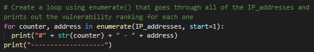

* Answer any questions the class may have before moving to break.

----
### 14. Break  (0:15)
----

### 15. Direct Instruction: Nested For Loops (0:10)

* While looping through a single list is pretty simple, things get a bit more difficult when multiple lists or more complex data types, like dictionaries, have to be iterated through each loop at the same time.

  * Open [NestedFor.py](Activities/08-Ins_NestedForLoops/NestedForLoops.py) within VS Code, and use the file to explain when a nested `for loop` is used. 

  * Nested loops are loops that contain other loops inside of them.

  * Through the use of nested `for` loops, programmers can easily compare or combine the values of two lists with different lengths. 

    The way in which this works is by collecting a value from the first list and then looping through the values of the second list. Once all the values in the second list have been exhausted, only then do we move to the next value in the first list and repeat the process.

    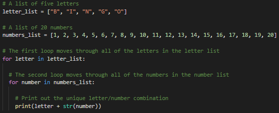

* Dictionaries can also store vast quantities of data within them. Unlike lists, however, the data stored within dictionaries are not stored with numeric indexes and require a bit more effort to loop through.

  * There are three methods that every single dictionary includes that allows programmers to work with the data and store them inside of a list.

  * The `dictionary.keys()` method collects all the keys from a dictionary and places it into a list.

  * The `dictionary.values()` method collects all the values from a dictionary and places them into a list.

  * The `dictionary.items()` method collects both the keys and the values from a dictionary and places them into a list. Because this has both the keys and the values in it, two temporary variables will have to be used when looping through the collection.

    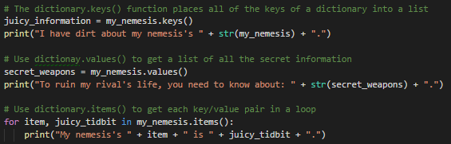

* Answer any questions the class may have before moving to the next activity.

### 16. Guided Practice: Programmer Loop (0:07)

* In this activity, students are given a short list of dictionaries of people who work as programmers and must print out all the key/value pairs for each programmer using a series of nested for loops.

* Send the students the following file and instructions over Slack:

* **File:** [ProgrammerLoop.py](Activities/09-Stu_ProgrammerLoops/Unsolved/ProgrammerLoop.py)

* **Instructions:**

  * Using the list of dictionaries in the file provided, do the following:

    * Loop through the `programmers_list` one dictionary at a time.

    * Loop through each of the dictionary's keys and values.

    * Print out each key and its associated value to the terminal.

    * Print out a line which will separate each programmer from the next.
   
  * We added a lot of the code for you in the script file. Use the comments to help you with the rest. 

### 17. Direct Instruction: Programmer Loop Review (0:03)

* Open the [solved version](Activities/09-Stu_ProgrammerLoops/Solved/ProgrammerLoop.py) of the activity and go through the solution with the class.

### 18. Direct Instruction: While Loops (0:10)

* All the loops we've gone through so far have iterated through every element of the specified list. This means that the beginning and end of all the loops we have done so far are set in stone.

* Use the slides to introduce `while` loops.

  * Distinguish between `for` and `while` loops. 

  * Use the slides to explain the syntax of the `while` loop as well as how it runs. 

  * Make sure to cover the addition of `print(f)` in this example. In Python, the `print(f)` is a shortcut to format other data types into a string for ease of printing. In this example, we want to print a variable `i` in our string, but we can’t interpolate an integer into a string without formatting it. The `print(f)` does that for us.

* Open `WhileLoops.py` .

  * Emphasize that the `while` loop works similarly to a conditional statement insomuch as the loop will continue for as long as the condition is met. This means that the loop could, in theory, loop forever or until something is done to break it out of its conditional statement.

  * This is likely why `while` loops are so commonly used in creating command-line interfaces. The loop begins and the user is prompted with a question. So long as the answer to the question falls in line with the condition, the loop continues, and the application continues to function. Once the user decides to exit, however, then the loop concludes and the application closes.

    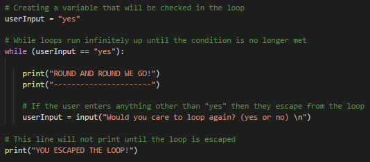

* Explain that through the combination of `for` loops, `while` loops, and conditionals, any number of fun/helpful applications can be created.

* Answer any questions the class may have before moving to the next activity.

### 19. Guided Practice: The Number Chain (0:15)

* In this activity, you will build a command-line game that will ask the user for a number and then will print all the numbers from 0 up until that number.

* Send the students the following files and instructions over Slack:

* **File:** [The Number Chain](Activities/11-Stu_TheNumberChain/Unsolved) 

* **Instructions:**

  * In this activity, you will build a command-line game that will ask the user for a number and then will print all the numbers from 0 up until that number.

    * Ask the user "How many numbers?" and then print out a chain of ascending numbers from 0 up to, but not including, the number input.

  * After the results have printed, ask the user if they would like to continue. If "y" is entered, keep the chain running by inputting a new number and starting a new count from 0 to the number input. If "n" is entered, exit the application.
  
* We added some of the initial code for you in the script file. Use the comments to help you with the rest. 

* **Hint:** You will need to use both `for` and `while` loops for this activity. We provided the start of the `while` loop for you in the script file. 

* **Bonus:** Rather than just displaying numbers starting at 0, have the numbers begin at the end of the previous chain.

### 20. Direct Instruction: The Number Chain Review (0:05)

* Open the [solved version](Activities/11-Stu_TheNumberChain/Solved) of the activity and go through the solution with the class, make sure to cover the following points:

  * The initial value for `user_play` is set to "y" so that the `while` loop will run initially. This loop will continue to run so long as the value of `user_play` is "y" at the end of the code block.

  * An input number is asked for and then a `for` loop will then run to count from 0 to that number.

  * The user is then prompted to either enter "y" if they would like to create a new number chain or "n" if they would like to terminate the application.

    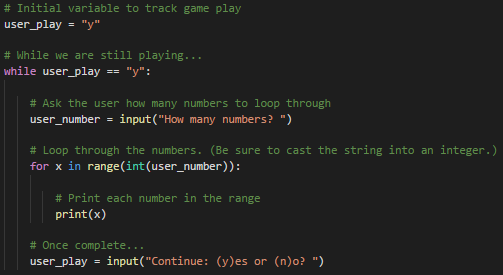

  * For the bonus solution, just add in a variable called `start_number` whose initial value is 1 and whose value will be set to the last number used in the loop after the `for` loop has completed.

  * The `for` loop will now run from the range of `start_number` to `user_number` plus `start_number`. This means that the code will always count up the inputted amount from the previous input amount.

    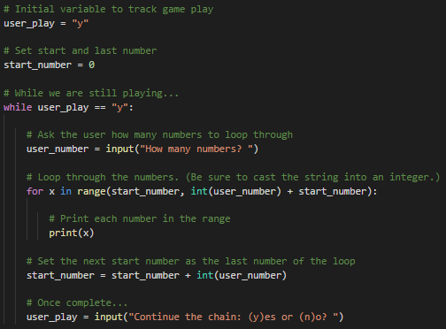

* Answer whatever questions the class may have before moving to the next activity.

### 21. Guided Practice: Kid in a Candy Store (0:20)

* In this activity, pretend you're a kid going to the candy store with your parents. After pestering your parents for a while, they finally let you pick out some candy to take home.

* This is a challenging activity, so feel free to have your students work in pairs. 

* Send the students the following file and instructions over Slack:

* **File:** [KidInCandyStore.py](Activities/12-Par_KidInCandyStore/Unsolved)

* **Instructions:**

  * In this activity, you are a kid in a candy store with your parents. 
    * There is a specific selection of candies, and each candy costs $1. 
    * You have an allowance of $5. 
    * You will select 5 candies, and once you’ve chosen all of them, the terminal will print a message of what candies you brought home.

  * Below is the code required in the script file. 
  
  * Print out the list of candies provided to you in the file along with their index numbers stored in brackets beside them.
   * To do this, create a loop that prints all of the candies in the store to the terminal with their index stored in brackets beside them.
   * **Example:** `"[0] Snickers"`.
  * ***Note:** This has been already completed in the script file. 

   * Then print out a prompt that asks “Which candy would you like to bring home?” The user will have to input the index associated with the candy. This prompt will run until all 5 choices have been made.
    * To do this, create a loop that runs for a number of times as determined by the variable `allowance`. 
    * **Example:** If allowance is equal to five, the loop should run five times.
    * Each time this second loop runs, take in a user's input, preferably a number, and then add the candy with a matching index to the variable `candyCart`.
    * **Example:** If the user enters "0" as their input, "Snickers" should be added into the `candyCart` list.
   
   
   * Print out a statement that says which candies the user brought home with them.
    * To do this, create another loop to print all of the candies selected to the terminal.

   * **Bonus:** Create a version of the same code which allows a user to select as much candy as they want up until they say they do not want any more.

### 22. Direct Instruction: Kid in a Candy Store Review (0:05)

* Send the students the [solved version](Activities/12-Par_KidInCandyStore/Solved/KidInCandyStore.py) of the activity and go over the code with the students, answering any questions they have.

* Make sure to cover the following key points about the code:

  * There are three `for` loops being used in this activity. One to print out the original candy list. A second to collect all the candy choices the user has. And a third to print the final list of choices to the screen.

  * When adding candies into the `candyCart` list, the `selection` variable has to be cast as an integer since all inputs are naturally set as strings.

  * In order to solve the bonus, we would simply use a While loop instead of a For loop, asking after each selection whether the user would like to make another selection. If they ever answer anything other than "Yes", the loop will stop.
  

### 23. Direct Instruction: Close Class and Announce Homework (0:03) 

* Answer any student questions. 

* Announce the homework for the week. 
