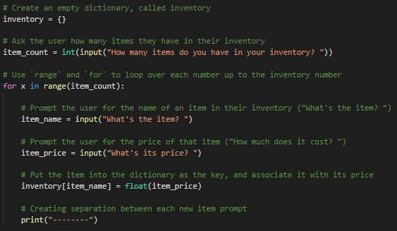
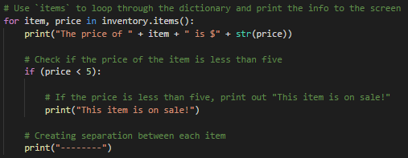
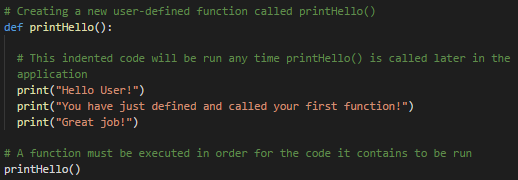
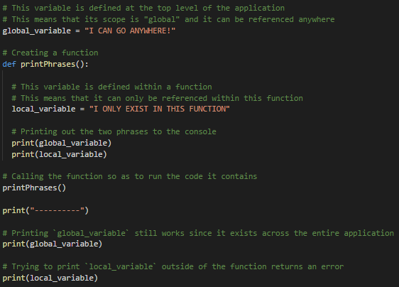
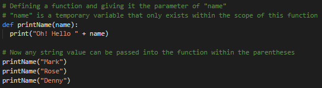
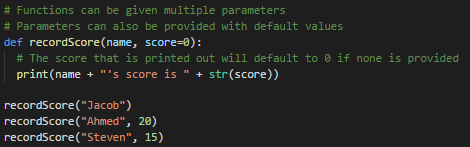

## 3.3 Lesson Plan: Python and Functions

### Overview

Today's class, like the previous one, will introduce new programming building blocks with Python. The focus today will be functions. 


### Objectives

By the end of class, students will be able to:

* Define and call functions. 

* Create functions to print data from a dictionary.

* Create functions with arguments to make them more modular.

* Create functions with return values.

* Build command-line applications that both return and print out values to the user.

### Instructor Notes

* Today's class is all about functions and will be heavily activity focused. Specifically we will cover defining and calling functions, parameters and arguments with functions, and return values

* The slides primarily cover just the activities students will be doing in class. For demonstrations use the code files provided.

* The activities are challenging and will build in complexity as the day progresses. If you notice students are confused, you can show them how to get started with activities they find confusing. We have provided script files for all activities that provides some of the code already for them. 

* When discussing returning values, it's a good idea to compare and contrast returning values with printing values, as students may find it challenging. 

* Today's class will end early, but use the remaining time to review the week and address any student concerns. 

### Sample Class Video

* To view an example class lecture, visit: [Class Video Part 1](https://codingbootcamp.hosted.panopto.com/Panopto/Pages/Viewer.aspx?id=1f59a95a-71f7-4087-be81-a99b00fd2f07),
[Part 2](https://codingbootcamp.hosted.panopto.com/Panopto/Pages/Viewer.aspx?id=fe9ec7e2-1b71-4d8f-b8ac-a99b011ea39d).

### Slideshow

- The lesson slides are available on Google Drive here: [Python Day 3 Slides](https://docs.google.com/presentation/d/1DgVK_npPtFJXBl9lw-fTtxgBTWxgpckpuRcYgP6hQTI/).

- To add slides to the student-facing repository, download the slides as a PDF by navigating to File > "Download as" and choose "PDF document." Then, add the PDF file to your class repository along with other necessary files.

- **Note:** Editing access is not available for this document. If you or your students wish to modify the slides, please create a copy by navigating to File > "Make a copy...".

------

### 1. Direct Instruction: Welcome Class (0:05)

* Welcome students to their third day of Python!

* Explain that so far the class has covered many of the essentials of programming in Python but we haven't dived into one of the building blocks of writing code, functions. 

* Point out though that students have been using built-in functions throughout the first two days, so we'll build on that knowledge for them to create custom functions.

* Start the day off with a warm-up activity based on the material from the last class.

### 2. Warm-Up Activity: Inventory Collector (0:15)

* In this activity, students will create an application that allows its users to create and fill in a store's inventory before printing out the inventory to the terminal.

* Tell students the provided code file will walk them step-by-step through the code they will need to create. 

* Send the students the following file and instructions over Slack:

   * **File:** [Inventory_Collector](Activities/01-Stu_InventoryCollector/Unsolved)
  
   * **Instructions:**
  
     * Using the file we sent you, create an empty dictionary and call it `inventory`.
    
     * Ask the user how many items they have in their inventory and store it in a variable called `item_count`.
     
     * You will need to create a `for` loop and use `range` to loop over the item count.
    
       * For each item, ask the user what the item is and what the price is.
      
       * Store the item name as a variable called `item_name` and store the item price in a variable called `item_price`.                * **Note:** Item prices need to be entered in as integers and not strings.
      
       * Create a dictionary that has for its key/value pairs, the item name and the item price.
      
     * Print the key/value pairs to the console. For each item that is less than five dollars, also indicate that the item is on sale.
    
        * You will need to loop through all the items in the dictionary and print their keys/values to the console.
        
       * Inside of this loop, you will also need to create a conditional that checks the price.
      
   * **Hint:** The file we provided to you guides you step-by-step through the code you will have to create. We have also added some of the code for you to get you started.

### 3. Direct Instruction: Inventory Collector Review (0:05)

* Open the [solved version](Activities/01-Stu_InventoryCollector/Solved/inventory_collector.py) of the activity within VS Code and walk-through the code, make sure to explain the following:

  * The first loop uses `range()` in order to specify how many iterations of the loop should take place. The number of iterations is determined by the first `input()`, and the response is converted to an integer using `int()`.

  * After the user has entered in the name of the item and its price, the `item_name` variable is used to create the new key inside of `inventory` while `item_price` is used to create the associated value.

    

  * The second loop moves through both the keys and the values of the `inventory` dictionary by using the `.items()` method. 

  * The `if` statement checks the price of the current item and compares it to the number five. If the value is greater than five, then nothing happens. If the value is less than five, then a new line is printed to the terminal.

    

* Answer any questions the class may have before moving to the next activity.

### 4. Direct Instruction: Introduction to Functions (0:10)

* One of the primary tenets of coding is to create easy-to-understand code that avoid repetition. 

* A function is a block of organized, reusable code that can be used to perform a single action multiple times.

* We've already used a wide-variety of functions since Python comes pre-packaged with many of them. Some examples of the functions the class has used so far include `print()` to post data to the terminal and `input()` to get data from the user.

* But programmers will also want to create their own functions for more specific use cases. These are commonly referred to as **user-defined functions**.

- Open [IntroToFunctions.py](Activities/02-Ins_IntroToFunctions/IntroToFunctions.py) in VS Code and use the script to review the following points:


* The first step is to **define** our functions. To define a function, we use the `def` keyword followed by the function's name and a pair of parentheses. The block of code contained within the function then starts with a colon and must be indented in order to work properly.

* ```python 
  def printHello():
    print("Hello User!")
    print("You have just defined and called your first function!")
    print("Great job!")
  ```

* Defining a function in our file does not mean that it will run.

* In the IntrotoFunctions.py file, remove `printHello()` at the bottom of the file, and save and then run the file. Students will see that nothing happens.

* Code can only be executed when we **call** the function later in the script. Add back `printHello()` to the script, save, and then run the file. Students should now see an output to the screen:

  

- Open [Scope.py](Activities/03-Ins_Scope/Scope.py) and explain to the class that there are some rules to consider when it comes to variables and scope. 

- Not all variables are accessible or available to all parts of our program. How accessible a variable is defined as its scope. The *scope* of a variable refers to the places that the application can see/access a specific variable.

- If you define a variable at the top of your program or in the main body of your program, it is considered a *global variable*. This means that any part of your program, for example any functions, can access that variable and use it for example as a parameter in the function.

  - In the file, point out the `global_variable` at the top of the file and note that it is outside the scope of the function.
  
- If you define a function within a specific function, then that that variable is *local* and accessible only to that function. This means that any other function outside of that one in your program cannot access it.

  - In the file, point out the local_variable in the printPhrases function, and note that it is accessible only within the scope of that function.

* If you define a variable at the top level of your script, this is considered to be a global variable and can be accessed anywhere within the application.

* Variables that are defined inside of a function are considered to be a local variable and can only be accessed by the function it is contained within.

  

Answer whatever questions the class may have before moving to the next activity.

### 5. Guided Practice: My Very First Functions (0:15)

* In this activity, the students are given a dictionary and asked to create three functions to print valuable information to the terminal.

* Send students the following file and instructions to the class over Slack:

  * **File:** [FirstFunctions](Activities/04-Stu_FirstFunction/Unsolved)

  * **Instructions:**
  
    * Using the provided dictionary of names and social security numbers (SSNs), complete the following tasks:

      * Create a function that will loop through all of the keys in the dictionary and print them out one at a time.
      * Create a function that will loop through all of the values in the dictionary and print them out one at a time.
      * Create a function that will loop through all of the keys AND values in the dictionary and print them out one at a time.
      
  * **Hints:**
  
    * You will need to use loops within your functions.
    
    * The file we provided to you guides you step by step through the code you will have to create.
    
    * Remember that you will need to call your functions to execute them.

### 6. Direct Instruction: My Very First Functions Review (0:05)

* Open the [solved version](Activities/04-Stu_FirstFunction/Solved/FirstFunctions.py) of the activity within VS Code and walk-through the code. Make sure to explain the following:

  * Defining the functions is only step one. In order to actually run the code contained within a function, it has to be called later on in the application.

  * All of the loops in this code are `for` loops which loop through the lists created by the `keys()`, `values()`, and `items()` methods.

* Answer any questions the class may have before moving to the next section.

### 7. Direct Instruction: Parameters (0:10)

- In the previous activity, we we defined and called the following functions:
  `printAllKeys()`
  `printAllValues()`
  `printAllItems()`
  
- Explain that these functions do not contain any parameters. Functions can take parameters, which are values that you provide the function, so that the function can perform actions using those values.

- A *parameter* is the variable. The *argument* is the specific value that is contained in that variable.

- Open [Parameters.py](Activities/05-Ins_Parameters/Parameters.py) in VS Code and use it to explain the following concepts:
  - The parameter is defined in the `def` statement of the function and is a variable you pass into the function. 

  - When you call the function, you will pass the specific value, or argument, into the function. 

    

  - Function parameters can include a default value. This mean that if you call a function but do not include a specific argument, then the default value will be assigned.  All parameters with default values must come after those parameters without.

  

Answer any questions the class may have before moving to the next activity.

### 8. Guided Practice: Calculator Activity (0:20)

* In this activity, students will be making a command-line calculator application. The application will ask the user what kind of arithmetic operation they would like to perform. 

* Send the students the following instructions over Slack: 

  * **File:** [FunctionalCalculator](Activities/06-Stu_FunctionalCalculator/Unsolved)
  
  * **Instructions:**
  
    * In this activity you are creating a command-line calculator application. When completed, the app should perform the following:

      * Ask the user what kind of arithmetic operation they would like to use.
      
      * Add two integers together if the user selects addition.
      
      * Subtract two integers from one another if the user selects subtraction.
      
      * Multiply two integers together if the user selects multiplication.
      
      * Divide two integers by one another if the user select division.

    * Each of the arithmetic operations should be contained within functions that take in two integers as parameters.

    * **Hint:** The file we provided to you guides you through the code you will use to create your calculator. We also added some of the code for you to get you started.

* Open the [solved version](Activities/06-Stu_FunctionalCalculator/Solved/FunctionalCalculator.py) of the activity in VS Code and walk-through the code, make sure to explain the following.

  * All  the functions are defined with the same two parameters: `x` and `y`. These variables can be reused multiple times since parameters only exist within the scope of their function. 

  * Point out to students that there is a repetitive aspect to the solution in how the two integers are collected. Let them know that cover how to write cleaner code after the break.

* Answer any questions the class may have before going to break.

-----

### 9. BREAK (0:45)

-----

### 10. Direct Instruction: Returning Values (0:10)

* So far we've seen that we can pass parameters and values into functions. Once the function completes, we can also return those values. This can be done using the `return` keyword and return statements.

* Open [ReturnStatements.py](Activities/07-Ins_Return/ReturnStatements.py) in VS Code and explain the following:

  * Whatever value is placed after `return` will be passed back into the main script. 
  
  * The `return` statement concludes whatever function it is placed inside of. This means that only one `return` can be reached within a function.
  
  * When a function containing a `return` statement is called, it is commonplace to store the result within a variable so that the value could be referred to multiple times throughout the remainder of the application.
  
* Answer any questions the class may have before moving to the next activity.

### 11. Guided Practice: Validate Password (0:15)

* In this activity, students will create an application that checks whether or not a password entered by the user is of valid length or not.

* Send students the following files and instructions over Slack. 

  * **Files:** [Validate Password](Activities/08-Stu_ValidatePassword/Unsolved)

  * **Instructions:**

   * Use the script file provided. We've added a lot of the code for you to get started.

   * Define a function called `validate_password` which accepts a `password` parameter that will be a string.

   * Inside the function, check if the password is longer than six characters long. Return `True` if it is and return `False` if it is not.

   * Prompt the user to enter a password and then send this password into the `validate_password` function. Save the result of the function to a variable called `result`.

   * Print out the value of `result` to the terminal.

 * **Hints:**

  * Strings can be looped through just like lists can except, in this case, the application is looping through each character in the string instead.

  * Since strings can be looped through like lists, the length of a string can also be collected using the `len()` function.

### 12. Direct Instruction: Validate Password Review (0:05)

* Open the [solved version](Activities/08-Stu_ValidatePassword/Solved/validate_password.py) of the activity in VS Code and walk-through the code, and make sure to explain the following:

  * The `len()` function can not only take in lists, but can also take in strings to check their length. As such, `if (len(password) > 6)` is used in this code to check whether or not the password entered by a user is greater than six characters in length.

* Answer any questions before moving to the next activity.

### 13. Guided Practice: User Creation (0:30)

* Building on the previous Validate Password activity, students will now create a command-line application which allows users to create new usernames, passwords, and email addresses for a fake account.

* Send students the following files and instructions over Slac. 

  * **File:** [User Creation](Activities/09-Stu_UserCreation/Unsolved)
  
  * **Instructions:**

    * Building on the previous Validate Password activity, in this activity you will now create a command-line application which allows users to create new usernames, passwords, and email addresses for a fake account.  Users will only be able to create accounts if their password meets the password length. It should also print out the account information to the terminal. 

    * Use the script file provided. We've added a lot of the code to get you started.

    * Your application should have the following features.
  
      * A function called `collect_user_information` that will prompt the user for their username, password, and email address. It should return this information in a list that contains those three values.

      * The above returned list should be passed into a function called `create_user` that checks if the password entered is valid.
                
      * If the password is valid, it will create a new dictionary for the user with their information. The dictionary should have keys for username, password, and email with the associated values that the user entered. It should then print a message to the screen with this information.
          
      * If the password is not valid, it will print a message to the screen letting the user know that their password isn’t valid.
      
### 14. Direct Instruction: User Creation Review (0:10)

- Open the [solved version](Activities/09-Stu_UserCreation/Solved/create_user_functions_refactored.py) of the activity in VS Code and walk-through the code, make sure to explain the following:

  - The `collect_user_information()` collects the usernames, passwords, and email addresses from the users. All the values are stored within the `user_info` variable as a list. This list is then returned from the function.
  
  - Inside of the `create_user()` function, the `validate_password()` function is called within an `if` statement. This works because `validate_password()` returns `True` or `False` values based on whether or not the password is of the correct length.

### 15. Direct Instruction: Review (0:30)

* Students learned a lot this week, so use the remaining 30 minutes for review.

* You can structure review however you like. One suggestion is to ask students for the activities that they struggled the most with during the week.

* Using student responses, choose three activities to work on. 

* Let students know that we will break out into three separate groups, and each group will focus on one of those three activities. Students can choose which group/activity they will work on.

* Each group should have an instructor or TA that will lead and guide students.


