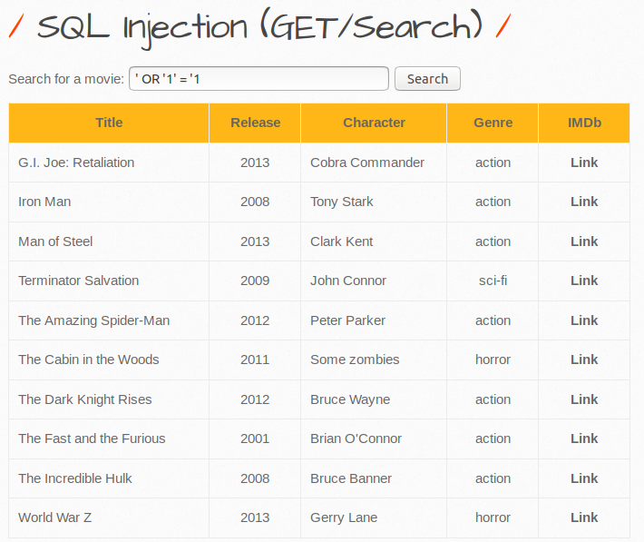
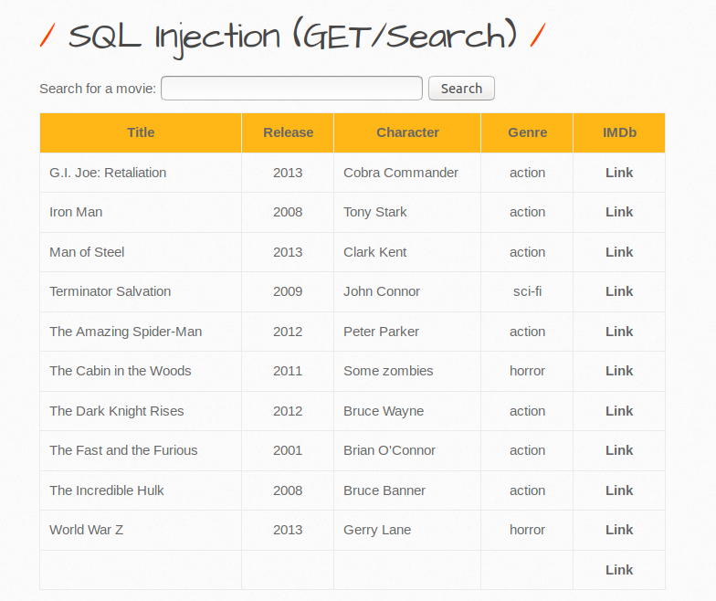
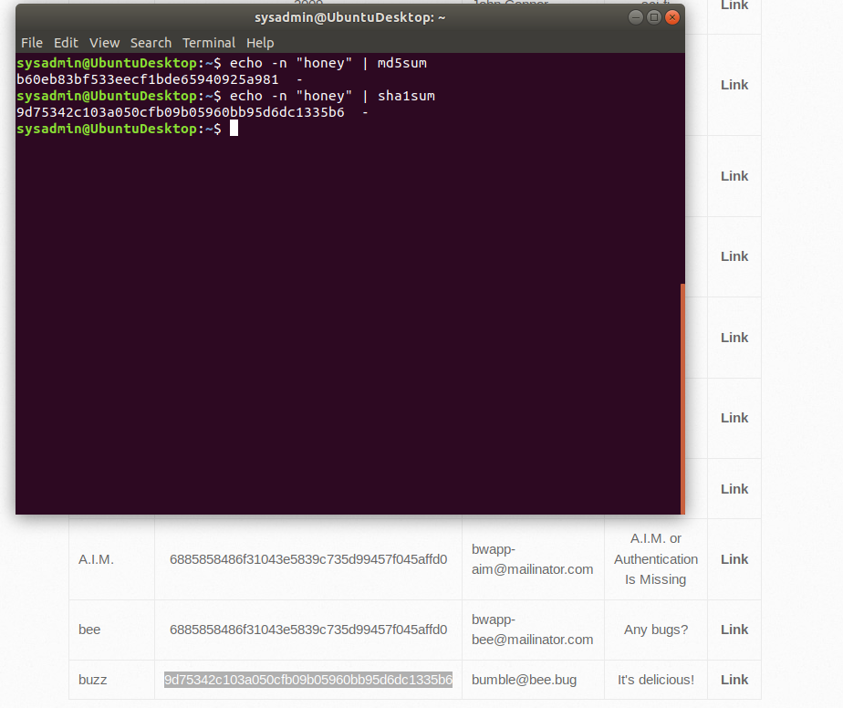

### SQL Injection with bWAPP (Solutions Guide)

The purpose of this activity was to review previously learned SQL injection techniques to exploit search fields without proper input sanitization.

For this activity, you expanded upon your previously used SQL injection techniques to exploit another web application.

Completing this activity required the following steps:

- Using an `Always True` SQL injection to return the list of movies.
- Modifying a `union` SQL injection to find out what the backend SQL query structure looks like.
- Further modifying the `union` SQL injection to return sensitive user data.
- Run some tests to see which hashing algorithm was used to store passwords.

---

#### Walkthrough

1. Based on the confirmed working SQL payloads that you've used before, an `Always True` statement is always a good place to start off. 

   - If we use `' OR '1' = '1` on the search form, we get a listing of all the movies.

     

     - :warning: There are other `Always True` SQL injection variations such as `or 1=1-- ` (must have a space after the `--`) that will work here too.

2. Next, you had to use repeated `UNION` attacks to see how many columns were being pulled from database. The goal was to edit the SQL injection `' union select NULL,<etc>` until you got to using 7 `NULL`'s:

   - Using less or more than 7 `NULL`'s will return the following error:

     

   - Using 7 `NULL`'s returned the table back to us: `' union select NULL,NULL,NULL,NULL,NULL,NULL,NULL-- `. Don't forget the space after `--`

     

   - This means that we can replace any of these `NULL`'s with some educated guesses of column names. 

3. Now we'll use this knowledge to try to return columns from the `users` database using the different fields we filled when we first signed up, such as `login`, `password`, `email`, and `secret`. 

   - It'll likely have taken a few attempts to get the proper columns to show up, but when done correctly, it should look like the following:

     - `'union select NULL,login,password,secret,email,NULL,NULL from users-- `

   - This injection will return the `login`, `password`, `email`, and `secret` user database entries into the movie field columns.

       

   - In the returned entries from the `user` database, we can see our newly created user, `buzz`, along with the already existing users. 

   - As a bonus we were able to retrieve sensitive data, such as user password hashes!

#### Bonus 

- For your bonus you had to use various checksum tools to figure out which hashing function was used to to save password hashes. The following checksum tools are installed on our machine:

  - `md5sum`
  - `sha1sum`
  - `sha256sum`
  - `sha512sum`

- In order to figure out which one was used, the quickest method was to use the password we created when we registered our user, `buzz`, and then pass it to the checksum tools. To do this, we needed to run:

  - `echo -n "honey" | <checksum tool>`

- When piping our password to the various checksum tools, we can see that the result from `sha1sum` matches the result from the database.

    

___

© 2021 Trilogy Education Services, a 2U, Inc. brand. All Rights Reserved. 