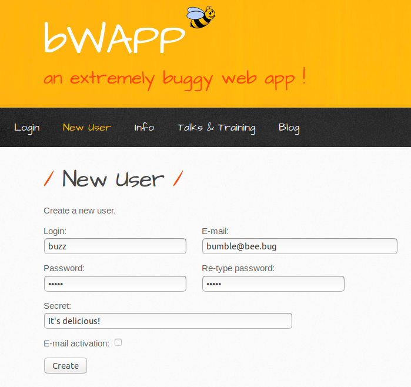

### SQL Injection with bWAPP (Activity)

In this activity, you will act the role of an Application Security Engineer tasked with testing a new web application by running SQL injection payloads on it.

#### Activity Instructions

First we'll need to setup our administrative toolkit that we'll use to test for SQL Injection vulnerabilities using the following steps:

1. The new web server can be launched locally on our Vagrant machines with `docker-compose`.

   - Log into your Vagrant Ubuntu virtual machines if you haven't already and then navigate to the following directory:

     - `/home/sysadmin/Documents/web-vulns`

   - Launch the web app using Docker Compose:

     - `docker-compose up`

2. Once the website is launched, use your browser to launch your SQL injection attacks.

   - Open `Google Chrome` and then navigate to the following URL: `http://localhost:10011/install.php`

3. You will be presented with the the Broken Web App (bWAPP) website. You'll need to set up the application and create a user to get started.

   - At the **Installation** page, click `here` where it says **Click here to install bWAPP.**

   - Navigate to the **New User** page to create a user. For quick and easy user creation, enter the following in the corresponding fields and click **Create**:

     - **Login**: `buzz`
     - **E-mail**: `bumble@bee.bug`
     - **Password**: `honey`
     - **Re-type password**: `honey`
     - **Secret**: `It's delicious!`

      

   - You should see a green-colored **User successfully created!** at the bottom of the page.

     - **Note**: For the purposes of this lesson, **bWAPP** represents the live production website.

4. Login by going to the **Login** page and entering your **Login** ID and **Password**. Leave the security level at **low**, and click the **Login** button.

5. In the top-right drag-down menu under **Choose your bug:**, select **SQL Injection (GET/Search)** while leaving the security level at **low**. Click on **Hack**.

   - Note that this page contains a simple search form where you can search for movies.

   - Here you will perform your SQL injection tests and observe the results.

#### SQL Injection Tests

You'll need to use what you've learned in the previous SQL injection activity combined with some of the newly learned SQL injection techniques we've discussed earlier.

1. First, you'll want to baseline the normal functionality of this search page. Start by entering "iron" to see what the results are. You can also try single letters, numbers, and whole words. You may also want to try leaving the field blank then running a search to see what happens. 

   - Document the query that you think is being executed when you click this button.

2. Next, modify your documented query and create an `Always True` SQL injection payload in the `Search for a movie:` field. Remember this is a type of statement where something has to _equal_ another thing.

   - If the database accepted and processed your malicious code, what shows up underneath?

   - **Note**: When your **always true** statement works, it is a good thing because that means you have crafted a working injection payload without breaking the query.

3. Next, you'll need to use the `' union select <entry1, entry2, etc.>-- ` payload technique to grab the correct number of columns.

   - You can use anything in place of the `<entry>` placeholder for this task. Remember that we used `NULL` in our examples.

   - Remember: **Not** producing an error means that the number of columns is correct!

4. Once you have figured out the correct number of columns to modify your payload with, edit the injection payload so that you return various types of columns from the `users` table. 

   - If you're unsure what the column names exist in the `users` table, check the `Create User` page where we created our `buzz` user.

5. **Bonus**: Find out what type of hashing algorithm was used to store the password hashes. Using the following checksum tools:

      - `md5sum`
      - `sha1sum`
      - `sha256sum`
      - `sha512sum`

       **Hint** You'll want to use `echo -n`  to pipe a string to a checksum tool. (`-n` strips newline characters.)

___

© 2021 Trilogy Education Services, a 2U, Inc. brand. All Rights Reserved. 