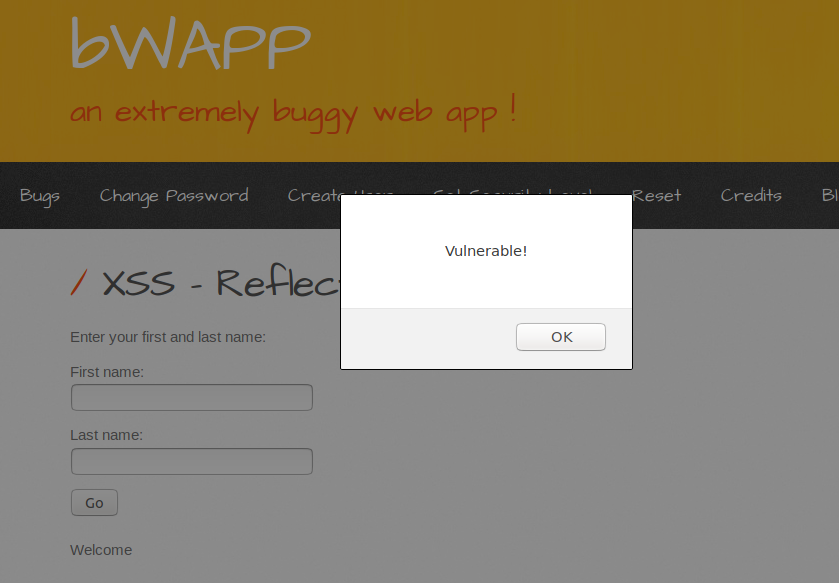
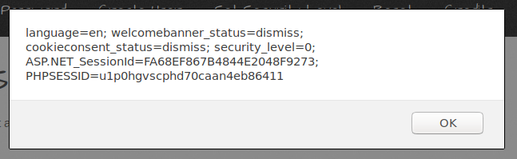
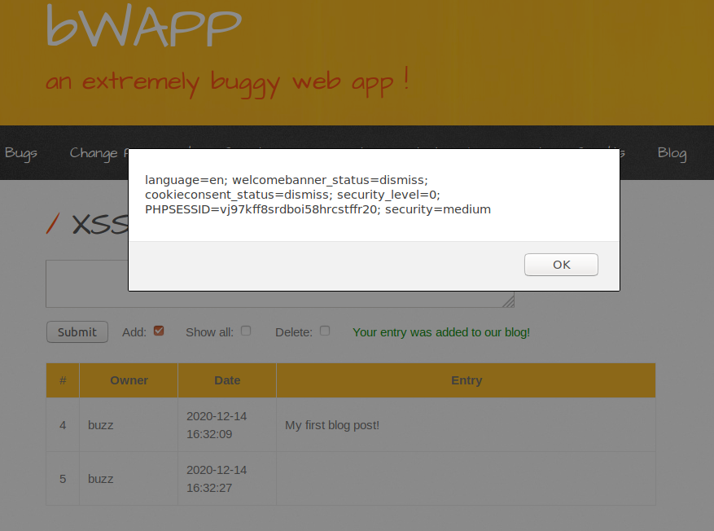
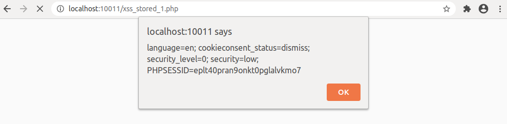

## Solution Guide: XSS with BWAPP 


In this activity, you ran multiple XSS attacks against the bWAPP application. The first two tasks were to re-familiarize yourself with XSS attacks while the third one expanded on what you've learned before to conduct a JSON-based XSS attack.

Completing this activity required the following steps:

- Use a reflected XSS attack that launches the alert pop-up window.
- Launch a stored-XSS attack that retrieves the contents of the stored browser cookie.
- Craft a JSON-based XSS payload to successfully create an alert message or display our browser cookie.

### Walkthrough

1. For the first `Cross-Site Scripting - Reflected (GET)` task, you had to enter a full `<script>`-based XSS payload in either name field to launch the alert pop-up. The other name field can contain anything. Your XSS payload should have looked like the following:

    - `<script>alert('Vulnerable!')</script>` which would show the following upon hitting `Go`.

      

     :warning: If you entered the payload into both fields and the `Prevent this page from creating additional dialogs` shows up underneath the alert message, do **NOT** check the box before hitting `OK`.

2. For the second `Cross-Site Scripting - Reflected (GET)` task, you had to once again enter a full `<script>`-based XSS payload that displays your local browser cookie in an alert message. When done correctly, your payload should look like the following:

    - `<script>alert(document.cookie)</script>`, which will show your session and cookie information upon running:

     

3. For the third `Cross-Site Scripting - Stored (Blog)` task, you should have once again used the `<script>alert(document.cookie)</script>` payload.

    - For the first part of the task, after selecting the `Show all:` checkbox and clicking `Submit`, you should see your payload get executed:

     

      - The blog entry itself should be empty.

    - For the second part of the task when you created the `Happy Bee-logging, fellow Bees!` post, you should have noticed that your `PHPSESSID` had changed, as you are now logged into the user `bee`, as opposed to `buzz`.

      - This task demonstrated how a stored XSS payload can be executed for other visitors of the page.

      - If you used a different browser for the second part of the task, this further demonstrates that the stored XSS payload can execute on an entirely different web client.
      
        

**Bonus Walkthrough**

4. For the bonus task on the `XSS - Reflected (JSON)` page, you had to execute an XSS payload inside the search field that first created an error and then successfully executed a script. There are a few things to check here.

    - The first thing to test out here was what a successful and unsuccessful search looked like. There are technically two "successful" search results. One for movie that exist in the site's database and one for movies that don't exist.

        - If we enter `Iron Man` into the search field, we'll see a `Yes! We have that movie...` and nothing else.

        - If we enter `The Dark Knight` we'll get a `The Dark Knight??? Sorry, we don't have that movie :(`.

        - So these seem to be the two intended results. Now let's get to breaking the site.

    - The next step was to create an intentional "break" within the JSON retrieval. First, we need to know what the JSON response looks like. Instead of attempting multiple variations of JSON enders, we'll find what we need if we open the browser developer console by pressing `F12` and then attempting a search.

        - Open the developer console by pressing `F12` and navigate to the `Networks` tab.

        - Leave the field blank and hit `Search` to see the `HINT: our master really loves Marvel movies :)` response.

        -  Select the `xss_json.php` response and go to the response body portion. In the response body or "payload", we can see the following variable being set within `<Script></Script>` tags:

            - `var JSONResponseString = '{"movies":[{"response":"HINT: our master really loves Marvel movies :)"}]}';`

    - If we inspect the variable, we can see that it sends a response in JSON format. We can unpack it to visually to look like the following. The `<--` notes provide some JSON-formatting refreshers.

      ```JSON
      { <-- This is the start of the entire JSON response

          "movies": [ <-- This is an array within the JSON

              { <-- This is a nested JSON object within the array

                  "response":"HINT: our master really loves Marvel movies :)"

              }

          ]

      }
      ```

        - We can see that all of this is stored within the variable, `JSONResponseString`, inside of the single quotes and semi-colon.

        - Just like with our SQL injection findings, the important part here is finding where the end of the message response terminates, which is everything after the smiley face, or `"}]}';`. We'll want to create a payload to inject our malicious code here.

    - Now that we know where we want to place our code, let's try entering `"}]}'; </script>` and hit `Search` to see the following error:

        - `??? Sorry, we don't have that movie :("}]}'; // var JSONResponse = eval ("(" + JSONResponseString + ")"); var JSONResponse = JSON.parse(JSONResponseString); document.getElementById("result").innerHTML=JSONResponse.movies[0].response; `

    - This shows that we ended the script early and the rest of the script printed as regular text on the page. Now let's try running an alert. Enter the following and hit `Search`:

        - `"}]}'; alert(document.cookie)</script>`

    - Once again, we'll be able to see our stored cookie, proving that our XSS exploit was successful!

        

---

© 2021 Trilogy Education Services, a 2U, Inc. brand. All Rights Reserved.    