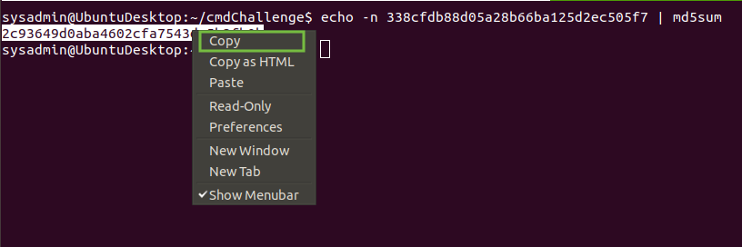
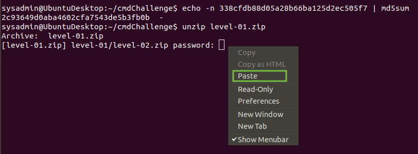
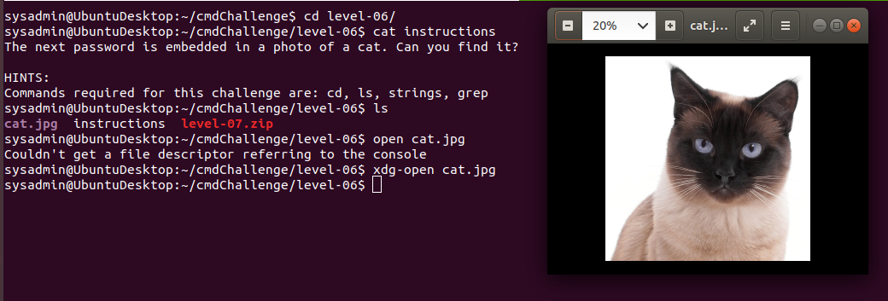
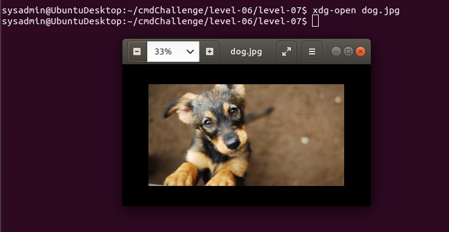
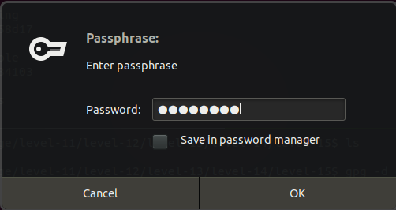

## cmdCTF Solutions and Walkthrough

### Introduction

Welcome to the walkthrough for the cmdCTF. It is recommended that you go through this walk through even if you completed the CTF on your own, as you may see some tips and tricks that you didn't know. 

On the other hand, if you are stuck on one of the challenges and need to see the solution, they are all here for you! There is no shame in viewing a solution when you are stuck, in fact, that's a great way to learn!


<details>
<summary>Getting Started</summary>

Start by moving into the `cmdCTF` directory:

```bash
cmdChallenge$ ls -1
instructions
level-01.zip
level-06.zip
level-11.zip
level-16.zip
level-21.zip
```

Use the `cat` or `less` or `more` commands to read the instructions:

```bash
cmdChallenge$ cat instructions
Welcome to the Command Line Challenge!

This game is organized by levels. Each level is found inside a compressed directory with the same name.
e.g. the 'level-01.zip' directory contains all the instructions for level one, except, you need a password to unzip it.

..._truncated_...
```
</details>
<details>
<summary>Level Zero</summary>

This CTF starts by giving you the first flag towards the bottom of the instructions file:

```
The password for level 1 is: fumigators_water_pass

For your first challenge, use the command line to create an MD5 sum of 'fumigators_water_pass'.

HINTS:
Commands you may need to complete this challenge: echo, md5sum
Don't forget about using pipes! '|'
You must use the '-n' option with echo to ignore the newline character and get the correct hash.
```

To create an MD5 sum of this password, we want to use the command `md5sum`. This command will produce a sum of any file that you give it, but in this case, we want to just get the sum of a string. We can do that using `echo` and a pipe `|` to feed the string into the `md5sum` command. Doing it this way requires that you use the `-n` option with echo, so that echo doesn't add a _new line character_ to the end of your string, and thus change the resulting sum.

The solution looks like this:

```bash
cmdChallenge$ echo -n fumigators_water_pass | md5sum
338cfdb88d05a28b66ba125d2ec505f7  -
```

Now that we have this sum, we can use it as a password to open the level 1 zip file. Use the `unzip` command to unzip the `level-01.zip` file and paste in the sum string `338cfdb88d05a28b66ba125d2ec505f7` when asked for the password:

**NOTE:** The easiest way to copy and paste the password string is to use the right click inside the terminal and choose 'copy' or 'paste'.




Now we have a new directory labeled `level-01`!

```bash
cmdChallenge$ ls -1
instructions
level-01
level-01.zip
level-06.zip
level-11.zip
level-16.zip
level-21.zip
```

</details>

<details>
<summary>Level One</summary>

Start by moving into the `level-01` directory and listing the contents:

```bash
cmdChallenge/level-01$ ls
data  instructions  level-02.zip
```

Let's read the instructions using `cat`:

```bash
The password for level 2 is inside a file called data.

Commands required for this challenge are: cd, ls, cat
```

Let's read the `data` file:

```bash
level-01$ cat data 
babblers_asterisk_frostily
``` 

Make an md5sum of the password:

```bash
level-01$ echo -n babblers_asterisk_frostily | md5sum
87f784a793dc66f265c00902f1eded90  -
```

We have the password! Let's move on to level 2:

```bash
level-01$ unzip level-02.zip 
Archive:  level-02.zip
   creating: level-02/
[level-02.zip] level-02/.data password: 
 extracting: level-02/.data          
  inflating: level-02/instructions   
 extracting: level-02/level-03.zip   
level-01$ ls -1
data
instructions
level-02
level-02.zip
```

</details>
<details>
<summary>Level Two</summary>

Start by moving into the `level-02` directory and reading the instructions file:

```bash
level-01$ cd level-02/
level-01/level-02$ ls 
instructions  level-03.zip
level-02$ cat instructions 
The password for level 3 is here somewhere...

Commands required for this challenge are: cd, ls, cat

sysadmin@UbuntuDesktop:~/cmdChallenge/level-01/level-02$
```

Let's try listing _all_ files (including hidden files). The `ls` flag for this is `-a`:

```bash
level-02$ ls -a
.  ..  .data  instructions  level-03.zip
```

If you didn't know the `-a` flag, we can find it using the `man` pages for `ls` like this:

```bash
level-02$ man ls
```

And we can see the `-a` option right up top:

```bash
LS(1)                                                     User Commands                                                     LS(1)

NAME
       ls - list directory contents

SYNOPSIS
       ls [OPTION]... [FILE]...

DESCRIPTION
       List information about the FILEs (the current directory by default).  Sort entries alphabetically if none of -cftuvSUX nor
       --sort is specified.

       Mandatory arguments to long options are mandatory for short options too.

       -a, --all
              do not ignore entries starting with .
```

So, we list all the files using `ls -a`. Did you see the hidden `.data` file?

```bash
level-02$ ls -a
.  ..  .data  instructions  level-03.zip
```

Let's cat the `.data` file:

```bash
level-02$ cat .data 
landholders_stratospheres_dissidents
```

We found the flag! Don't forget to convert it to an md5sum before using it to unlock the `level-03.zip` directory:

```bash
level-02$ echo -n landholders_stratospheres_dissidents | md5sum
800517a381fb2aee4020d48b0bad582b  -
level-02$ unzip level-03.zip 
Archive:  level-03.zip
   creating: level-03/
[level-03.zip] level-03/- password: 
 extracting: level-03/-              
  inflating: level-03/instructions   
 extracting: level-03/level-04.zip   
level-02$ ls -1
instructions
level-03
level-03.zip
```

Let's move on to Level Three!

</details>
<details>
<summary>Level Three</summary>

Start by moving into the `level-03` directory and taking a look at the files there:

```bash
level-02$ cd level-03/
sysadmin@UbuntuDesktop:~/cmdChallenge/level-01/level-02/level-03$ ls
-  instructions  level-04.zip
```

Let's read the instructions using `cat`:

```bash
level-03$ cat instructions 
The password for level 4 is in a filed named '-'.

Commands required for this challenge are: cd, ls, cat
```

Interesting. Let's take another look at the files:

```bash
level-03$ ls
-  instructions  level-04.zip
```

How can we open the file named `-` on the command line?

Using `cat -` gives us a blinking cursor...

```bash
level-03$ cat -

```

Use `ctrl C` to get the prompt back:

```bash
level-03$ cat -
^C
level-03$
```

Why? Remember that `-` is a special character to the shell. We use it for flags like `ls -a`!

To tell the shell that we want to use that as a file, we need to specify it's location more precisely. When you open a file with `cat my-file` what you are really saying is `cat ./my-file`. The `./` says 'Look in the current directory'.

Consequently, to read this file named `-` we need to use the `./` before it to precisely notate that we are looking for a file:

```bash
level-03$ cat ./-
propitiatory libretto keepers
```

Use this password to make an md5sum and unlock level 4!
Notice that this password doesn't have any underscores in it. Using quotation marks will ensure we get the correct hash:

```bash
level-03$ echo -n "propitiatory libretto keepers" | md5sum
390303cc34bb7511f9bb6f3369645bf4  -
level-03$ unzip level-04.zip 
Archive:  level-04.zip
   creating: level-04/
[level-04.zip] level-04/instructions password: 
  inflating: level-04/instructions   
   creating: level-04/.../
 extracting: level-04/.../.data      
 extracting: level-04/level-05.zip   
level-03$ ls -1
-
instructions
level-04
level-04.zip
```

Nice work! Let's move on to Level 4.

</details>
<details>
<summary>Level Four</summary>

Start by moving into the directory, taking a look at the files and reading the instructions:

```bash
level-03$ cd level-04/
level-04$ ls
instructions  level-05.zip
level-04$ cat instructions 
The password for level 5 is here somewhere...

Commands required for this challenge are: cd, ls, cat
```

Let's look for hidden files:

```bash
level-04$ ls -a
.  ..  ...  instructions  level-05.zip
```

Did you notice the extra '...' ?

We know that the `.` and `..` designations are for the _current_ directory, and the _previous_ directory respectively. But what about `...`?

Let's get more information about all the items in this directory with the 'long' flag for `ls` (Not familiar with the `-l` flag for `ls`? You can find it in the man pages):

```bash
level-04$ ls -la
total 20
drwxr-xr-x 3 sysadmin sysadmin 4096 Dec 18 16:16 .
drwxr-xr-x 3 sysadmin sysadmin 4096 Jan  4 15:05 ..
drwxr-xr-x 2 sysadmin sysadmin 4096 Dec 18 15:16 ...
-rw-r--r-- 1 sysadmin sysadmin  102 Dec 18 15:16 instructions
-rw-rw-r-- 1 sysadmin sysadmin  687 Dec 18 16:16 level-05.zip
```

Remember that the first character in each line tells you if the item is a directory (`d`) or a file (`-`).

We can see from the permissions `drwxr-xr-x` that the `...` item is a directory.

Move into the directory named `...`:

```bash
cd ...
level-04/...
```

At first, it looks to be an empty directory, but, let's list _all_ the files here:

```bash
level-04/...$ ls
level-04/...$ ls -a
.  ..  .data
```

The `.data` file! 

```bash
level-04/...$ cat .data 
dishwater_blurts_heralding
```

We found the flag! Create an md5sum and unlock Level 5!

```bash
level-04$ echo -n dishwater_blurts_heralding | md5sum
3b903b661c735742dcb00c7545cf0579  -
level-04$ unzip level-05.zip 
Archive:  level-05.zip
   creating: level-05/
[level-05.zip] level-05/d a t a password: 
 extracting: level-05/d a t a        
  inflating: level-05/instructions   
level-04$ ls
instructions  level-05  level-05.zip
```

</details>

<details>
<summary>Level Five</summary>

Start by moving into the `level-05` directory, looking at the files and reading the instructions:

```bash
level-04$ cd level-05/
level-04/level-05$ ls
'd a t a'   instructions
level-05$ cat instructions 
The password for level 6 is located in the only other file in this directory.

Commands required for this challenge are: cd, ls, cat
```

Looks like we have a file with spaces in the name:

```bash
level-05$ ls
'd a t a'   instructions
```

If we try to use `cat d a t a` the shell will think that each letter is a different file:

```bash
level-05$ cat d a t a
cat: d: No such file or directory
cat: a: No such file or directory
cat: t: No such file or directory
cat: a: No such file or directory
```

There are a few ways to solve this problem.

1. We can use quotations, just as the file is shown in the output for `ls`:

```bash
level-05$ cat 'd a t a'
humanest_plumber_allergens
```

2. We can also use the `\` to _escape_ the spaces so that the shell knows to ignore the spaces and count them as part of the file name:

```bash
level-05$ cat d\ a\ t\ a 
humanest_plumber_allergens
```

3. We can use _tab completion_ to find the correct name for us! To use Tab Completion, just type the first letter of any file and then hit the tab key and the shell will auto-complete the name! _If_ you are hitting the tab key and the name is not auto-completing, something is wrong. Either the file doesn't exist, or there are more than one file starting with the same letter, or something similar. Note that this only works on file names you are typing _after_ you type the command you are using. Tab Completion does not work on command names.

Make an md5sum of the flag and unlock Level Six!

```bash
level-05$ echo -n humanest_plumber_allergens | md5sum
07c9dde53a5d8e15d517e17dd55d91a0  -
sysadmin@UbuntuDesktop:~/cmdChallenge/level-01/level-02/level-03/level-04/level-05$ ls
'd a t a'   instructions
sysadmin@UbuntuDesktop:~/cmdChallenge/level-01/level-02/level-03/level-04/level-05$ cd ..
sysadmin@UbuntuDesktop:~/cmdChallenge/level-01/level-02/level-03/level-04$ cd ..
sysadmin@UbuntuDesktop:~/cmdChallenge/level-01/level-02/level-03$ cd ..
sysadmin@UbuntuDesktop:~/cmdChallenge/level-01/level-02$ cd ..
sysadmin@UbuntuDesktop:~/cmdChallenge/level-01$ cd ..
sysadmin@UbuntuDesktop:~/cmdChallenge$ ls
cmdChallenge-Solutions.md  instructions  level-01  level-01.zip  level-06.zip  level-11.zip  level-16.zip  level-21.zip
sysadmin@UbuntuDesktop:~/cmdChallenge$ unzip level-06.zip 
Archive:  level-06.zip
   creating: level-06/
[level-06.zip] level-06/cat.jpg password: 
  inflating: level-06/cat.jpg        
 extracting: level-06/level-07.zip   
  inflating: level-06/instructions   
sysadmin@UbuntuDesktop:~/cmdChallenge$ ls
cmdChallenge-Solutions.md  instructions  level-01  level-01.zip  level-06  level-06.zip  level-11.zip  level-16.zip  level-21.zip
```

</details>

<details>
<summary>Level Six</summary>

Start by moving into the `level-06` directory, reading the instructions and looking at the files:

```bash
level-06$ cat instructions 
The next password is embedded in a photo of a cat. Can you find it?

HINTS:
Commands required for this challenge are: cd, ls, strings, grep
sysadmin@UbuntuDesktop:~/cmdChallenge/level-06$ ls
cat.jpg  instructions  level-07.zip
```

Interesting! We have a `cat.jpg`. Let's open this file to look at it. We can use the file explorer like we normally would, or we can open it directly from the command line with the command `xdg-open`:



Looks like it's a cat! That's weird...

Remember the hint in the instructions said we may need to use the command `strings`. Let's read the man pages for the `strings` command:

```bash
/level-06$ man strings

STRINGS(1)                                            GNU Development Tools                                            STRINGS(1)

NAME
       strings - print the strings of printable characters in files.

SYNOPSIS
       strings [-afovV] [-min-len]
               [-n min-len] [--bytes=min-len]
               [-t radix] [--radix=radix]
               [-e encoding] [--encoding=encoding]
               [-] [--all] [--print-file-name]
               [-T bfdname] [--target=bfdname]
               [-w] [--include-all-whitespace]
               [-s] [--output-separatorsep_string]
               [--help] [--version] file...

DESCRIPTION
       For each file given, GNU strings prints the printable character sequences that are at least 4 characters long (or the
       number given with the options below) and are followed by an unprintable character.
```

Let's run `strings` on the `cat.jpg` file:

```
/level-06$ strings cat.jpg

c?ks
vN0P
MJNd
h8e6
4h3)
Lo>#
4!:{B7
i4r_
nk0j
 A0@QP
aq2
h]T)
h]b=[
e1w1X
,Y!]
,lXJ
/Cd]
Xo4(
(Yx_=
a       $6
lHXK
eax_
6!!x

```

Looks like a lot of random strings. How can we narrow this down a bit?

We have a few ways:

1. We could use the `less` command to page through the output:

```bash
level-06$ strings cat.jpg | less
```

2. We could use the `grep` command to search the output for 'data', or 'password', or 'flag':

```bash
level-06$ strings cat.jpg | grep 'password'
m password: willowiest_fuzzier_earlobes
```

3. We could also search for just underscores '_':

```bash
level-06$ strings cat.jpg | grep "_"

...truncated...

i4r_
(Yx_=
eax_
m password: willowiest_fuzzier_earlobes
F_gl
_1!!
B_xpq
```

We now have the password! Make an md5sum of it and use it to unlock Level Seven!

```bash
level-06$ echo -n willowiest_fuzzier_earlobes | md5sum
729f38638fd5480cc16997872a75895c  -
level-06$ unzip level-07.zip 
Archive:  level-07.zip
   creating: level-07/
[level-07.zip] level-07/level-08.zip password: 
 extracting: level-07/level-08.zip   
  inflating: level-07/dog.jpg        
  inflating: level-07/instructions
```

</details>

<details>
<summary>Level Seven</summary>

Start with moving into the `level-07` directory, reading the instructions and looking at the files:

```bashlevel-06$ cd level-07/
sysadmin@UbuntuDesktop:~/cmdChallenge/level-06/level-07$ cat instructions 
Can you extract a file from this picture of a dog?

HINTS:
Commands required for this challenge are: cd, ls, steghide, md5sum
If you're asked for a password, use 'password'.
sysadmin@UbuntuDesktop:~/cmdChallenge/level-06/level-07$ ls
dog.jpg  instructions  level-08.zip
```

Let's look at the `dog.jpg` file using the file explorer, or `xdg-open`:



Looks like just a dog.

Let's try strings on it:

```bash
level-07$ strings dog.jpg | grep '_'

i^O_]^
O_{{
>_eBq
__y%%-g
=q_=9
p%f/_
gm_^
M_Kn
gs_4
m_:y
Zs9_

...truncated

```

Nothing obvious here...

Remember the hint in the instructions said: 
"Commands required for this challenge are: cd, ls, steghide, md5sum
If you're asked for a password, use 'password'."

Let's look at the man pages for this `steghide` command:

```bash
steghide(1)                                          General Commands Manual                                          steghide(1)

NAME
       steghide - a steganography program

SYNOPSIS
       steghide command [ arguments ]

DESCRIPTION
       Steghide  is  a  steganography  program  that  is able to hide data in various kinds of image- and audio-files. The color-
       respectivly sample-frequencies are not changed thus making the embedding resistant against first-order statistical tests.
```

Interesting! How do we use it? Run `steghide -h` to try and get the help pages:

```
level-07$ steghide -h
steghide: unknown command "-h".
steghide: type "steghide --help" for help.
```

Looks like it's `steghide --help` ! Let's run that:

```
...truncated

options for the info command:
 -p, --passphrase        specify passphrase
   -p <passphrase>       use <passphrase> to get info about embedded data

To embed emb.txt in cvr.jpg: steghide embed -cf cvr.jpg -ef emb.txt
To extract embedded data from stg.jpg: steghide extract -sf stg.jpg
```

The final line of this output shows us how to extract data from an image! Let's run it:

```bash
level-07$ steghide extract -sf dog.jpg 
Enter passphrase: 
wrote extracted data to "password".
```

Remember the instructions said to use 'password' if we were asked for a password.

Now we have a new file named password!

```bash
level-07$ ls
dog.jpg  instructions  level-08.zip  password
level-07$ cat password 
monograph_enterprise_rumblings
```

Awesome! Make an md5sum of this password and unlock Level Eight!

```bash
level-07$ echo -n monograph_enterprise_rumblings | md5sum
9908d6f81c2fb703a1d377f14936c1de  -
level-07$ unzip level-08.zip 
Archive:  level-08.zip
   creating: level-08/
[level-08.zip] level-08/data password: 
  inflating: level-08/data           
  inflating: level-08/instructions   
 extracting: level-08/level-09.zip   
```

</details>

<details>
<summary>Level Eight</summary>

Start by moving into the directory, reading the instructions and looking at the files:

```
level-08$ cat instructions 
The password for the next level is the street listed on line 4000 of the info file.

Commands required for this challenge are: cd, ls, nl, grep, md5sum

level-08$ ls
data  instructions  level-09.zip
```

Let's look at the `data` file:

```
...truncated
Konstadinos Justus      M       23      Hinckley Street, line 371
Paula Tom       F       70      Saint Richard Street, line 450
Qiang Hradecka  M       70      Westbrook Street, line 57
Jennifer Athanasiadis   F       81      Bickford Avenue, line 311
Elena Costa     F       20      Fair Oaks Street, line 233
Aleksandra Gordon       F       75      Yard Way, line 365
Hyobi Magnini   F       56      Ardee Street, line 269
Ian Rhodes      M       71      K Street Place, line 440
Tsagaanbaatar Kjellberg M       77      Atkinson Street, line 299
Catriona Mottram        F       38      Pasadena Road, line 450
Louise Fernandez        F       84      Sanger Street, line 458
Jonathan Cornelius      M       31      Monmouth Street, line 467
Matt Waite      M       24      Alpine Street, line 79
Tomasz Lanzone  M       86      Necco Court, line 16
Dirk Steuer     M       43      Bagnal Street, line 175
Lukasz Dudas    M       58      Birchcroft Road, line 247
Virginie Medina F       27      Waldorf Street, line 143
Andriy Hrachov  M       16      Bantry Way, line 299
Ziwei Braas     F       70      Lyne Road, line 168
Hector Moutoussamy      M       66      Muller Avenue, line 110
Xiaodong Dulko  F       69      Homewood Road, line 242
Ivan Radu       M       29      Clinton Place, line 181
Christopher Sadauskas   M       86      Lancaster Street, line 47
Lizeth Coertzen F       58      Greenock Street, line 402
Alexander Heffernan     M       43      Oleander Street, line 147
```

We need to get to line 4000...

Let's count the lines in this file with `wc -l`:

```
level-08$ wc -l data
5029 data
```

5029 lines and we need line 4000. Maybe we can number all the lines?
Remember the hint said:
"Commands required for this challenge are: cd, ls, nl, grep, md5sum"

Let's look at this `nl` command:

```
level-08$ man nl

NL(1)                                                     User Commands                                                     NL(1)

NAME
       nl - number lines of files

SYNOPSIS
       nl [OPTION]... [FILE]...

DESCRIPTION
       Write each FILE to standard output, with line numbers added.
```

That's what we want! Let's use it:

```
level-08$ nl data

...truncated

5006  Qiang Hradecka  M       70      Westbrook Street, line 57
  5007  Jennifer Athanasiadis   F       81      Bickford Avenue, line 311
  5008  Elena Costa     F       20      Fair Oaks Street, line 233
  5009  Aleksandra Gordon       F       75      Yard Way, line 365
  5010  Hyobi Magnini   F       56      Ardee Street, line 269
  5011  Ian Rhodes      M       71      K Street Place, line 440
  5012  Tsagaanbaatar Kjellberg M       77      Atkinson Street, line 299
  5013  Catriona Mottram        F       38      Pasadena Road, line 450
  5014  Louise Fernandez        F       84      Sanger Street, line 458
  5015  Jonathan Cornelius      M       31      Monmouth Street, line 467
  5016  Matt Waite      M       24      Alpine Street, line 79
  5017  Tomasz Lanzone  M       86      Necco Court, line 16
  5018  Dirk Steuer     M       43      Bagnal Street, line 175
  5019  Lukasz Dudas    M       58      Birchcroft Road, line 247
  5020  Virginie Medina F       27      Waldorf Street, line 143
  5021  Andriy Hrachov  M       16      Bantry Way, line 299
  5022  Ziwei Braas     F       70      Lyne Road, line 168
  5023  Hector Moutoussamy      M       66      Muller Avenue, line 110
  5024  Xiaodong Dulko  F       69      Homewood Road, line 242
  5025  Ivan Radu       M       29      Clinton Place, line 181
  5026  Christopher Sadauskas   M       86      Lancaster Street, line 47
  5027  Lizeth Coertzen F       58      Greenock Street, line 402
  5028  Alexander Heffernan     M       43      Oleander Street, line 147
```

Perfect! How can we look at only line 4000? 
Let's use `grep` again!

```
level-08$ nl data | grep 4000
  4000  Vasyl Malaquias M       52      northern_magnesia_Street, line 238
```

That's it! Let's make an md5sum and use it to unlock the next level:

```
level-08$ echo -n northern_magnesia_Street | md5sum
bed60423a87ba3fa541489b5cf7635aa  -
sysadmin@UbuntuDesktop:~/cmdChallenge/level-06/level-07/level-08$ unzip level-09.zip 
Archive:  level-09.zip
   creating: level-09/
[level-09.zip] level-09/data password: 
  inflating: level-09/data           
  inflating: level-09/instructions   
 extracting: level-09/level-10.zip   
```

</details>

<details>
<summary>Level Nine</summary>

Start by moving into the new directory, reading the instructions and listing out the files there:

```
level-09$ cat instructions 
Count the number of uniq IP addresses inside the data file.

HINTS:
Commands required for this challenge are: cd, ls, cat, sort, uniq, wc
level-09$ ls
data  instructions  level-10.zip
```

Take a look at the `data` file:

```
level-09$ cat data
192.168.99.91
192.168.99.92
192.168.99.92
192.168.99.92
192.168.99.93
192.168.99.93
192.168.99.93
192.168.99.94
192.168.99.94
192.168.99.94
192.168.99.95
192.168.99.95
```

Let's count the number of lines in this file:

```
level-09$ cat data | wc -l
195062
```

Looks like a lot of lines, and a lot of duplicates!

How can we filter out all the duplicate lines?

Remember the hint from the instructions: "Commands required for this challenge are: cd, ls, cat, sort, uniq, wc"

Let's look at `uniq`'s man page:

```
UNIQ(1)                                                   User Commands                                                   UNIQ(1)

NAME
       uniq - report or omit repeated lines

SYNOPSIS
       uniq [OPTION]... [INPUT [OUTPUT]]

DESCRIPTION
       Filter adjacent matching lines from INPUT (or standard input), writing to OUTPUT (or standard output).
```

That sounds good! Let's try it:

```
level-09$ uniq data
...truncated...
192.168.9.99
192.168.99.9
192.168.99.90
192.168.99.91
192.168.99.92
192.168.99.93
192.168.99.94
192.168.99.95
192.168.99.96
192.168.99.97
192.168.99.98
192.168.99.99

level-09$ uniq data | wc -l
65031
```

This gave us more `uniq` results, but are we _sure_ there aren't any duplicates? How can we make sure?

Let's look at the man page for `sort`:

```
SORT(1)                                                   User Commands                                                   SORT(1)

NAME
       sort - sort lines of text files

SYNOPSIS
       sort [OPTION]... [FILE]...
       sort [OPTION]... --files0-from=F

DESCRIPTION
       Write sorted concatenation of all FILE(s) to standard output.
```

Let's try it:

```
level-09$ uniq data | sort
...truncated...  
192.168.99.80
192.168.99.81
192.168.99.82
192.168.99.83
192.168.99.84
192.168.99.85
192.168.99.86
192.168.99.87
192.168.99.88
192.168.99.89
192.168.9.99
192.168.99.9
192.168.99.90
192.168.99.91
192.168.99.92
192.168.99.93
192.168.99.94
192.168.99.95
...truncated...  
```

We can look through the output with `less` to look for duplicates but that would take a looong time. 

Is there a difference between `uniq data | sort | wc -l` and `sort data | uniq | wc -l`?

```
level-09$ sort data | uniq | wc -l
65025
level-09$ uniq data | sort | wc -l
65031
```

Why are these different? It is because `uniq` only removes lines that are duplicated in order. If a duplicate line shows up again later in the file, it is counted again. Because of this, we _must_ use `sort` first to put _all_ duplicates in order, then, `uniq` can count them correctly.

```bash
level-09$ sort data | uniq | wc -l
65025
```

Let's make an md5sum of `65025` and use it to unlock level Ten!

```
level-09$ echo -n 65025 | md5sum
85e0e9925a8fb321d8afa5bbfd0d7daf  -
level-09$ unzip level-10.zip 
Archive:  level-10.zip
   creating: level-10/
[level-10.zip] level-10/data password: 
  inflating: level-10/data           
  inflating: level-10/instructions   
sysadmin@UbuntuDesktop:~/cmdChallenge/level-06/level-07/level-08/level-09$ ls
data  instructions  level-10  level-10.zip
```

</details>

<details>
<summary>Level Ten</summary>

Start by moving into the `level-10` directory, reading the instructions and looking at the files:

```
level-10$ cat instructions 
You know that the data file contains 65025 IP addresses.
Each of those addresses is duplicated multiple times, except for 1.

Find the IP address that appears only once in the data file. 

HINTS:
Commands required for this challenge are: ls, cat, sort, uniq
Explore the man pages for the uniq command.
level-10$ ls
data  instructions
```

Can `uniq` find _one_ unique line in a file full of duplicates? Let's open the man pages. On the second or third page, you will start to see flag options:

```
       -f, --skip-fields=N
              avoid comparing the first N fields

       --group[=METHOD]
              show all items, separating groups with an empty line; METHOD={separate(default),prepend,append,both}

       -i, --ignore-case
              ignore differences in case when comparing

       -s, --skip-chars=N
              avoid comparing the first N characters

       -u, --unique
              only print unique lines

       -z, --zero-terminated
              line delimiter is NUL, not newline

       -w, --check-chars=N
              compare no more than N characters in lines

       --help display this help and exit
```

Looks like the `-u` option will do what we want! Let's try it:

```
level-10$ uniq -u data
192.168.108.105
192.168.108.188
192.168.108.133
192.168.108.188
192.168.108.188
192.168.108.188
192.168.145.35
```

Interesting... What if we sort the file first?

```
level-10$ sort data | uniq -u
192.168.145.35
```

Awesome! Let's make an md5sum and unlock Level Eleven!

``` 
level-10$ sort data | uniq -u
192.168.145.35
sysadmin@UbuntuDesktop:~/cmdChallenge/level-06/level-07/level-08/level-09/level-10$ echo -n 192.168.145.35 | md5sum
2fcbe482df5e2565f9c6c42a8c45bc23  -
sysadmin@UbuntuDesktop:~/cmdChallenge/level-06/level-07/level-08/level-09/level-10$ ls
data  instructions
sysadmin@UbuntuDesktop:~/cmdChallenge/level-06/level-07/level-08/level-09/level-10$ cd ../../../../../
sysadmin@UbuntuDesktop:~/cmdChallenge$ ls
cmdChallenge-Solutions.md  instructions  level-01  level-01.zip  level-06  level-06.zip  level-11.zip  level-16.zip  level-21.zip
sysadmin@UbuntuDesktop:~/cmdChallenge$ unzip level-11.zip 
Archive:  level-11.zip
   creating: level-11/
[level-11.zip] level-11/data password: 
  inflating: level-11/data           
  inflating: level-11/instructions   
 extracting: level-11/level-12.zip   
sysadmin@UbuntuDesktop:~/cmdChallenge$ ls
cmdChallenge-Solutions.md  level-01      level-06      level-11      level-16.zip
instructions               level-01.zip  level-06.zip  level-11.zip  level-21.zip
```

</details>

<details>
<summary>Level Eleven</summary>

Start by moving into the `level-11` directory, reading the instructions and looking at the files:

```
cmdChallenge$ cd level-11/
sysadmin@UbuntuDesktop:~/cmdChallenge/level-11$ cat instructions 
The 'password' is inside the data file somewhere...

HINTS:
Commands required for this challenge are: cd, ls, cat, grep
sysadmin@UbuntuDesktop:~/cmdChallenge/level-11$ ls
data  instructions  level-12.zip
```

Let's take a look at the data file:

```
$ cat data

...truncated...

Section 5. General Information About Project Gutenberg-tm electronic works.

Professor Michael S. Hart was the originator of the Project
Gutenberg-tm concept of a library of electronic works that could be
freely shared with anyone. For forty years, he produced and
distributed Project Gutenberg-tm eBooks with only a loose network of
volunteer support.

Project Gutenberg-tm eBooks are often created from several printed
editions, all of which are confirmed as not protected by copyright in
the U.S. unless a copyright notice is included. Thus, we do not
necessarily keep eBooks in compliance with any particular paper
edition.

Most people start at our Web site which has the main PG search
facility: www.gutenberg.org

...truncated...
```

Seems like a big file! Let's do a word count:

```
level-11$ wc data 
  2185  29651 170713 data
```

Wow! 29651 words... and only one of them has the passowrd.

Let's review the hints from the instructions. 
"Commands required for this challenge are: cd, ls, cat, grep"

`grep` is the only command we haven't used yet. Let's try it. We can search for 'flag', '_', 'password', etc.

```
level-11$ grep password data
“I don’t much care where— The password is: divest_stallion_imperiously” said Alice. 

level-11$ grep _ data
“I don’t much care where— The password is: divest_stallion_imperiously” said Alice. 
```

Found it! Let's make an md5sum and use it to unlock Level Twelve!

```
level-11$ echo -n divest_stallion_imperiously | md5sum
b185cd749ee2f720c9937d456fba0941  -
sysadmin@UbuntuDesktop:~/cmdChallenge/level-11$ unzip level-12.zip 
Archive:  level-12.zip
[level-12.zip] level-12/data/file-33399976 password: 

...truncated...
inflating: level-12/data/file-938991  
  inflating: level-12/data/file-259909  
  inflating: level-12/data/file-5993978  
  inflating: level-12/data/file-218131  
  inflating: level-12/data/file-41553314  
  inflating: level-12/data/file-604403  
  inflating: level-12/data/file-9004767  
  inflating: level-12/data/file-71186817  
  inflating: level-12/data/file-18441251  
  inflating: level-12/data/file-71226767  
  inflating: level-12/data/file-0953437  
...truncated...
```

Wow! A ton of output. Do we have a new directory?

```
level-11$ ls
data  instructions  level-12  level-12.zip
```

Yep! Let's go!

</details>

<details>
<summary>Level Twelve</summary>

Start by moving into the `level-12` directory, reading the instructions and looking at the files:

```
level-12$ cat instructions 
The 'password' is here somewhere...

HINTS:
Commands required for this challenge are: cd, ls, cat, grep
Can grep search 'recursively' through a directory?
You may need to ignore case...
sysadmin@UbuntuDesktop:~/cmdChallenge/level-11/level-12$ ls
data  instructions  level-13.zip
```

Looks like we have a `data` directory this time...
Let's take a look:

```
level-12$ ls data/
...truncated...
file-092423    file-1933118   file-3128999   file-4299898   file-566707    file-7066082   file-8402388   file-9666149
file-0953437   file-19577850  file-3140662   file-4335306   file-56784802  file-706620    file-8421696   file-97043057
file-096267    file-2058907   file-31635890  file-4366523   file-56892213  file-707438    file-8464899   file-9709892
file-102490    file-210355    file-3201508   file-44533008  file-57236791  file-708943    file-84688694  file-9711852
file-109118    file-218131    file-322305    file-4463090   file-5739404   file-7103823   file-849256    file-9712946
file-1108561   file-221039    file-32365018  file-448086    file-5766907   file-71186817  file-85262552  file-9728756
file-114661    file-223913    file-324389    file-45615686  file-5774468   file-71226767  file-8531248   file-97393699
file-11495001  file-2277882   file-325611    file-457117    file-5782759   file-71298441  file-856221    file-97409610
file-116803    file-229443    file-32639981  file-457451    file-579105    file-7180973   file-8586380   file-980963
file-11705111  file-23167806  file-32712166  file-466195    file-5835471   file-71993338  file-861780    file-982013
file-11783660  file-2326746   file-331178    file-4673074   file-586668    file-720268    file-862173    file-9824821
file-11817172  file-23371263  file-332596    file-46773428  file-58910793  file-7254073   file-862717    file-98912259
file-1186827   file-233800    file-33399976  file-47246024  file-5905106   file-728181    file-8631232   file-9901455
file-1205060   file-2415821   file-340396    file-4735823   file-591273    file-730123    file-86395001  file-9912172
file-1250176   file-243703    file-34041151  file-4765278   file-5993978   file-73035802  
...truncated...
```

Looks like it's too many files to look through manually. 

Review the instruction hints:

Commands required for this challenge are: cd, ls, cat, grep
Can grep search 'recursively' through a directory?
You may need to ignore case...

Let's look at the man pages for `grep` to answer these questions.
On the second or third page, we will start to find flag options. 
There are a lot of options! Let's narrow it down with a search.

When using the man pages, you have availible to you any navigation options you have when using `less` or `more`, including _search_!

To search the man pages just type `/` followed by your search term. Let's search for 'recursive' by typing `/recursive` and hitting 'enter'.

```
       -I     Process  a  binary  file  as if it did not contain matching data; this is equivalent to the --binary-files=without-
              match option.

       --include=GLOB
              Search only files whose base name matches GLOB (using wildcard matching as described under --exclude).

       -r, --recursive
              Read all files under each directory, recursively, following symbolic links only if they are on  the  command  line.
/recursive
```

There it is! `-r` gives us a recursive search. 

The hint also said we may need to ignore case. Let's search for `/case`!

```      -r, --recursive
              Read all files under each directory, recursively, following symbolic links only if they are on  the  command  line.
Pattern not found  (press RETURN)
```

Pattern not found. Let's search for 'ignore' with `/ignore`

```
Matching Control
       -e PATTERN, --regexp=PATTERN
              Use  PATTERN  as  the  pattern.   If this option is used multiple times or is combined with the -f (--file) option,
              search for all patterns given.  This option can be used to protect a pattern beginning with “-”.

       -f FILE, --file=FILE
              Obtain patterns from FILE, one per line.  If this option is  used  multiple  times  or  is  combined  with  the  -e
              (--regexp)  option,  search  for  all patterns given.  The empty file contains zero patterns, and therefore matches
              nothing.

       -i, --ignore-case
              Ignore case distinctions, so that characters that differ only in case match each other.

       -v, --invert-match
              Invert the sense of matching, to select non-matching lines.
```

Found it! Looks like `-i` will ignore case distinctions.

Let's try these out a few searches for our password:

```
level-12$ grep -r password data
level-12$

level-12$ grep -ir password data
data/file-509105:PAssWord: mussel_fireball_welshing

level-12$ grep -r _ data
data/file-7066082:_I_ shan't be able! I shall be a great deal too far off to trouble
data/file-485229:him,) 'I'll give him sixpence. _I_ don't believe there's an atom of
data/file-509105:PAssWord: mussel_fireball_welshing
```

Looks like we _must_ ignore case to find 'PAssWord'. However, if we just search for '_' again, we only need our `-r` option.

Let's make a sum and use it to unlock Level Thirteen!

```
level-12$ echo -n mussel_fireball_welshing | md5sum
0a1a6a51a3f60eba17882fe98aab442b  -
level-12$ unzip level-13.zip 
Archive:  level-13.zip
   creating: level-13/
[level-13.zip] level-13/data password: 
  inflating: level-13/data           
  inflating: level-13/instructions   
 extracting: level-13/level-14.zip   
level-12$ ls
data  instructions  level-13  level-13.zip
```

</details>

<details>
<summary>Level Thirteen</summary>

Start by moving into the `level-13` directory, reading the instructions and looking at the files.

```
level-13$ cat instructions 
Find Crime Scene Report #027446662191. 
What did the dodo say?

HINTS:
Commands required for this challenge are: cd, ls, cat, grep, md5sum
Grep has a 'Context' flag you might find useful.
sysadmin@UbuntuDesktop:~/cmdChallenge/level-11/level-12/level-13$ ls
data  instructions  level-14.zip
```

Let's look at the `data` file:

```
level-13$ head -20 data 
*******
Crime Scene Report #262227712435
********

'Nor I,' said the March Hare.

Alice sighed wearily. 'I think you might do something better with the
time,' she said, 'than waste it in asking riddles that have no answers.'

'If you knew Time as well as I do,' said the Hatter, 'you wouldn't talk
about wasting IT. It's HIM.'


*******
Crime Scene Report #142164895957
********
The Hatter was the first to break the silence. 'What day of the month
is it?' he said, turning to Alice: he had taken his watch out of his
pocket, and was looking at it uneasily, shaking it every now and then,

```

Let's search for Crime Scene Report #027446662191

```
level-13$ grep 027446662191 data
Crime Scene Report #027446662191
```

Found it! But, how can we see more of that report? Is there a way `grep` can output more lines than just the line it matched on?

Review the hints from the instructions:
"Grep has a 'Context' flag you might find useful."

Let's search the man pages for `context`.

There are a lot of matches! We can use 'n' to cycle through each match ('N' cycles backwards):

```
 Context Line Control
       -A NUM, --after-context=NUM
              Print  NUM lines of trailing context after matching lines.  Places a line containing a group separator (--) between
              contiguous groups of matches.  With the -o or --only-matching option, this has no effect and a warning is given.

       -B NUM, --before-context=NUM
              Print NUM lines of leading context before matching lines.  Places a line containing a group separator (--)  between
              contiguous groups of matches.  With the -o or --only-matching option, this has no effect and a warning is given.

       -C NUM, -NUM, --context=NUM
              Print  NUM  lines  of output context.  Places a line containing a group separator (--) between contiguous groups of
              matches.  With the -o or --only-matching option, this has no effect and a warning is given.
```

There it is! Looks like we can use one of these flags to output more context. We use the flag followed by a number of lines we want to output.
`grep -A 10 [search term] [file to search]`
Let's try it!

```
level-13$ grep -A 10  027446662191 data
Crime Scene Report #027446662191
********

'Only a thimble,' said Alice sadly.

'hoarsely_dukedom_readouts' said the Dodo.

Then they all crowded round her once more, while the Dodo solemnly
presented the thimble, saying 'We beg your acceptance of this elegant
thimble'; and, when it had finished this short speech, they all cheered.
```

There we go! 

FWIW: You can also use the `-C` flag followed by the number of lines you wish to output.

Let's make an md5sum and use it to unlock Level Fourteen!

```
level-13$ echo -n hoarsely_dukedom_readouts | md5sum
ef8f07d96d728cb29d6b1f577489ffb1  -
sysadmin@UbuntuDesktop:~/cmdChallenge/level-11/level-12/level-13$ unzip level-14.zip 
Archive:  level-14.zip
   creating: level-14/
[level-14.zip] level-14/data1 password: 
  inflating: level-14/data1          
 extracting: level-14/level-15.zip   
  inflating: level-14/instructions   
  inflating: level-14/data2          
sysadmin@UbuntuDesktop:~/cmdChallenge/level-11/level-12/level-13$ ls
data  instructions  level-14  level-14.zip
```

</details>
<details>
<summary>Level Fourteen</summary>

Start by moving into the directory, reading the instructions and looking at the files.

```
level-13$ cd level-14/
level-14$ cat instructions 
This password is the only line that is different between data1 and data2.
Don't forget to make an md5sum.

Commands required for this challenge are: cat, md5sum, diff, cd, ls
level-14$ ls
data1  data2  instructions  level-15.zip
```

We want to find the only line that is different between data1 and data2...

Let's look at `data1`:

```
level-14$ head data1
devoting_enshrines_ingrained
jerkin_palimpsest_impossibility
timekeeper_turtle_balustrade
lumpish_laughingly_hangman
handiest_poisoners_shippers
prepayments_tenths_dogging
slanderous_engagement_atop
suns_pegging_keel
serpents_others_musk
misquotation_populists_saltshakers
level-14$ wc -l data1
301 data1
```

Looks like there are 301 passwords in `data1`. Let's examine `data2` in the same way:

```
level-14$ head data2
devoting_enshrines_ingrained
jerkin_palimpsest_impossibility
timekeeper_turtle_balustrade
lumpish_laughingly_hangman
handiest_poisoners_shippers
prepayments_tenths_dogging
slanderous_engagement_atop
suns_pegging_keel
serpents_others_musk
misquotation_populists_saltshakers
level-14$ wc -l data2
300 data2
```

Looks like there are only 300 lines in `data2` so we are looking for the _one_ line that is different.

We _could_ look through these files manually to solve this, but that would be time consuming.

Review the instruction hints: "Commands required for this challenge are: cat, md5sum, diff, cd, ls"

Let's examine the 'diff' command man pages.

```
DIFF(1)                                                   User Commands                                                   DIFF(1)

NAME
       diff - compare files line by line

SYNOPSIS
       diff [OPTION]... FILES

DESCRIPTION
       Compare FILES line by line.
```

That sounds good! Let's try it:

```
level-14$ diff data1 data2
49d48
< purled_parroted_philandering
```

Found it! Let's make a sum and unlock Level Fifteen!

```
level-14$ echo -n purled_parroted_philandering | md5sum
01a052ebd7ab80d4957e1b62a6458d17  -
level-14$ unzip level-15.zip 
Archive:  level-15.zip
   creating: level-15/
[level-15.zip] level-15/instructions password: 
  inflating: level-15/instructions   
 extracting: level-15/data.txt.gpg   
level-14$ ls
data1  data2  instructions  level-15  level-15.zip
```

</details>

<details>
<summary>Level Fifteen</summary>

Start by moving into the directory, reading the instructions and listing out the files:

```
level-14$ cd level-15/

level-15$ cat instructions 
The next password can be found inside the file data.txt.
However, that file is encrypted with the password: password

Decrypt the file, read it and create an md5 hash to get the password.

HINTS:
Commands required for this challenge are: cat, md5sum, gpg

level-15$ ls
data.txt.gpg  instructions
```

Looks like we have a file that ends in `.gpg`!
The instruction hints say: "Commands required for this challenge are: cat, md5sum, gpg"

Let's examine the `gpg` command.

```
GPG(1)                                                GNU Privacy Guard 2.1                                                GPG(1)

NAME
       gpg - OpenPGP encryption and signing tool

SYNOPSIS
       gpg [--homedir dir] [--options file] [options] command [args]
```

Great! Looks like we can use gpg to encrypt files. Can we use it to 'decrypt' a file though? Let's search for 'decrypt' with `/decrypt`. There are a lot of matches, so we will use `n` to cycle through them:

```
 --store
              Store only (make a simple literal data packet).

       --decrypt
       -d     Decrypt the file given on the command line (or STDIN if no file is specified) and write it to STDOUT (or  the  file
              specified  with  --output).  If  the decrypted file is signed, the signature is also verified. This command differs
              from the default operation, as it never writes to the filename which is included in the file and it  rejects  files
              that don't begin with an encrypted message.

       --verify
              Assume  that  the  first argument is a signed file and verify it without generating any output.  With no arguments,
              the signature packet is read from STDIN.  If only one argument is given, the specified file is expected to  include
              a complete signature.
```

Found it! We can use `-d` to decrypt a file.

Let's try it:

```
level-15$ ls
data.txt.gpg  instructions
sysadmin@UbuntuDesktop:~/cmdChallenge/level-11/level-12/level-13/level-14/level-15$ gpg -d data.txt.gpg 
gpg: AES encrypted data
gpg: encrypted with 1 passphrase
```

You should see a pop-up asking for a password.

Remember the instructions said, the "file is encrypted with the password: password". Enter 'password' into the popup.



You might notice that the password backs right up against your prompt.

```
The password is: liquidated-overbear-pitiablesysadmin@UbuntuDesktop:...truncated...
```

The promt starts with `sysadmin@UbuntuDesktop` so the password ends with:`pitiable`. Let's make a sum and unlock Level Sixteen!

```
level-15$ echo -n liquidated-overbear-pitiable | md5sum
7df68e1500c160ebd808ef3490f34103  -
sysadmin@UbuntuDesktop:~/cmdChallenge/level-11/level-12/level-13/level-14/level-15$ cd ../../../../..
sysadmin@UbuntuDesktop:~/cmdChallenge$ ls
cmdChallenge-Solutions.md  level-01      level-06      level-11      level-16.zip
instructions               level-01.zip  level-06.zip  level-11.zip  level-21.zip
sysadmin@UbuntuDesktop:~/cmdChallenge$ unzip level-16.zip 
Archive:  level-16.zip
   creating: level-16/
[level-16.zip] level-16/data password: 
 extracting: level-16/data           
 extracting: level-16/level-17.zip   
  inflating: level-16/instructions   
sysadmin@UbuntuDesktop:~/cmdChallenge$ ls
cmdChallenge-Solutions.md  level-01      level-06      level-11      level-16      level-21.zip
instructions               level-01.zip  level-06.zip  level-11.zip  level-16.zip
```

</details>

<details>
<summary>Level Sixteen</summary>

Start with moving into the `level-16` directory and reading the instructions.

```
cmdChallenge$ cd level-16
sysadmin@UbuntuDesktop:~/cmdChallenge/level-16$ cat instructions 
The next password is in a file that contains base64 encoding.
Decode the base64 to get the password.

HINT:
Commands required for this challenge are: cd, ls, cat, md5sum, base64
```

Let's examine the file:

```
cmdChallenge/level-16$ ls
data  instructions  level-17.zip

level-16$ cat data 
aHVudGluZ19wdWxtb25hcnlfZW1wYW5lbHM=
```

How can we decode base64 on the command line? Let's read the man pages once more.

```
level-16$ man base64

BASE64(1)                                                 User Commands                                                 BASE64(1)

NAME
       base64 - base64 encode/decode data and print to standard output

SYNOPSIS
       base64 [OPTION]... [FILE]

DESCRIPTION
       Base64 encode or decode FILE, or standard input, to standard output.

       With no FILE, or when FILE is -, read standard input.

       Mandatory arguments to long options are mandatory for short options too.

       -d, --decode
              decode data

       -i, --ignore-garbage
              when decoding, ignore non-alphabet characters
```

Awesome! Looks like the first flag `-d` can decode `base64`! Let's try it.

```
level-16$ base64 -d data 
hunting_pulmonary_empanelssysadmin@UbuntuDesktop:~/cmdChallenge/

level-16$ cat data | base64 -d
hunting_pulmonary_empanelssysadmin@UbuntuDesktop:~/cmdChallenge/level-16$ 

level-16$ echo -n aHVudGluZ19wdWxtb25hcnlfZW1wYW5lbHM= | base64 -d
hunting_pulmonary_empanelssysadmin@UbuntuDesktop:~/cmdChallenge/level-16$
```

All of the above techniques work! Looks like our password is right up against the prompt again...

Let's make a sum and unlock Level Seventeen!

```
level-16$ echo -n hunting_pulmonary_empanels | md5sum
252ab7895b7e6db238aca9ede2185ae8  -
level-16$ unzip level-17.zip 
Archive:  level-17.zip
   creating: level-17/
[level-17.zip] level-17/data password: 
  inflating: level-17/data           
  inflating: level-17/instructions   
 extracting: level-17/level-18.zip   
level-16$ ls
data  instructions  level-17  level-17.zip
level-16$ 
```

</details>

<details>
<summary>Level Seventeen</summary>

Start with moving into the directory and reading the instructions:

```
level-16$ cd level-17/
level-17$ cat instructions 
There are a bunch of passwords inside a file, except the words got jumbled...
Change all of the letter a's to e's, all the letter v's to f's and all the letters i's to l's.
The password for the next level is the password ending in 'trefoll'.

HINTS:
Commands required for this challenge are: cd, ls, cat, grep, md5sum, sed
You may need to chain the same command a few times.
```

Let's start by looking at the data file:

```
level-17$ head -5 data
anthusad_parakaat_umptaanth
snot_homastaadars_twaivths
davaiuas_dawdias_abrasivanass
hyphanating_ionizar_basanass
intarnationaiizad_buriy_man

level-17$ wc -l data
300 data
```

Looks like there are 300 passwords here. 
How can we replace letters over an entire file?

The hints mentioned a command we haven't used yet: `sed`

Let's look at the man pages for `sed`.

```
SED(1)                                                    User Commands                                                    SED(1)

NAME
       sed - stream editor for filtering and transforming text

SYNOPSIS
       sed [OPTION]... {script-only-if-no-other-script} [input-file]...

DESCRIPTION
       Sed is a stream editor.  A stream editor is used to perform basic text transformations on an input stream (a file or input
       from a pipeline).  While in some ways similar to an editor which permits scripted edits (such as ed), sed works by  making
       only one pass over the input(s), and is consequently more efficient.  But it is sed's ability to filter text in a pipeline
       which particularly distinguishes it from other types of editors.
```

This sounds like it may do what we need. Let's try to find an example of how to use it.

```
level-17$ sed --help

Usage: sed [OPTION]... {script-only-if-no-other-script} [input-file]...
```

Looks like the man pages and the help page aren't quite as helpfull here. Google may be a better option.

Digital Ocean's website has a great `sed` tutorial [HERE](https://www.digitalocean.com/community/tutorials/the-basics-of-using-the-sed-stream-editor-to-manipulate-text-in-linux). The section on 'Substituting Text' will be particularly helpfull. 

`sed` can be tricky to get the hang of. There is a lot of info on the web around using `sed` and the home page is here: [sed home page](http://www.gnu.org/software/sed/).

When you use `sed` to do a search and replace, you will not need any flags. The format for the command is `sed 's/[item to search]/[item to replace]/g' [input file]`

The `s/` stands for search and the `/g` stands for 'globally'. In other words, this will change _all_ occurences. 

Using this we should be able to complete the first part of the instructions with this command: `sed 's/a/e/g' data` This will change all of the `a's` to `e's` across the entire file. Let's try it.

```
level-17$ head -5 data
anthusad_parakaat_umptaanth
snot_homastaadars_twaivths
davaiuas_dawdias_abrasivanass
hyphanating_ionizar_basanass
intarnationaiizad_buriy_man

level-17$ sed 's/a/e/g' data | head -5
enthused_perekeet_umpteenth
snot_homesteeders_tweivths
deveiues_dewdies_ebresiveness
hypheneting_ionizer_beseness
internetioneiized_buriy_men
```

Looks like that worked! 
How can we complete the rest of the instructions? Use pipes!

Review the instruction hints again, "You may need to chain the same command a few times."

We should be able to use `sed` with pipes to complete each letter transformation. The full command would look like this: `sed 's/a/e/g' data | sed 's/v/f/g' | sed 's/i/l/g'`

Let's try it!

```
level-17$ head -5 data
anthusad_parakaat_umptaanth
snot_homastaadars_twaivths
davaiuas_dawdias_abrasivanass
hyphanating_ionizar_basanass
intarnationaiizad_buriy_man

level-17$ sed 's/a/e/g' data | sed 's/v/f/g' | sed 's/i/l/g' | head -5
enthused_perekeet_umpteenth
snot_homesteeders_twelfths
defelues_dewdles_ebreslfeness
hyphenetlng_lonlzer_beseness
lnternetlonellzed_burly_men
```

Great! How can we now find the password ending in 'trefoll'?
We can use `grep`! Let's try it.

```
level-17$ sed 's/a/e/g' data | sed 's/v/f/g' | sed 's/i/l/g' | grep trefoll
fernlshed_trefolls_opuses
besements_sulten_trefoll
```

Found it! Let's make a sum and unlock Level Eighteen.

```
level-17$ echo -n besements_sulten_trefoll | md5sum
01886e7a9fdc5ce0ae7faa7ec013a8df
level-17$ unzip level-18.zip 
Archive:  level-18.zip
[level-18.zip] level-18/data/productbuild password: 

...truncated...
inflating: level-18/data/uptime    
  inflating: level-18/data/perl5.18  
  inflating: level-18/data/profiles  
  inflating: level-18/data/scandeps5.28.pl  
  inflating: level-18/data/vtool     
  inflating: level-18/data/tidy      
  inflating: level-18/data/git-shell  
  inflating: level-18/data/atos      
  inflating: level-18/data/tkcon     
  inflating: level-18/data/shasum5.18 
...truncated...

level-17$ ls
data  instructions  level-18  level-18.zip
```

</details>

<details>
<summary>Level Eighteen</summary>

Start by moving into the `level-18` directory, reading the instructions and listing out the files there.

```
level-17$ cd level-18/

level-18$ cat instructions 
The password is inside a file that has the permissions read, write and execute set for the user and the group and only read and execute for everyone else.

HINTS:
Commands required for this challenge are: cd, ls, cat, find
The find command has a permissions flag you may find interesting.

level-18$ ls
data  instructions  level-19.zip
```

We _could_ do this manually and list out all the permissions using `ls -l` and then look for our file. 

Let's see what that looks like:

```
data$ ls -l
...truncated...
-rwxr-xr-x 1 sysadmin sysadmin    31696 Dec 18 15:16 which
-rwxr-xr-x 1 sysadmin sysadmin    36672 Dec 18 15:16 who
-rwxr-xr-x 1 sysadmin sysadmin    36368 Dec 18 15:16 whoami
-rwxr-xr-x 1 sysadmin sysadmin    36912 Dec 18 15:16 whois
-r-xr-xr-x 1 sysadmin sysadmin      127 Dec 18 15:16 wish
-r-xr-xr-x 1 sysadmin sysadmin      127 Dec 18 15:16 wish8.5
-r-xr-xr-x 1 sysadmin sysadmin    37072 Dec 18 15:16 write
-rwxr-xr-x 1 sysadmin sysadmin    38880 Dec 18 15:16 wsgen
-rwxr-xr-x 1 sysadmin sysadmin    38880 Dec 18 15:16 wsimport
-rwxr-xr-x 1 sysadmin sysadmin    51792 Dec 18 15:16 xar
-rwxr-xr-x 1 sysadmin sysadmin    41456 Dec 18 15:16 xargs
-rwxr-xr-x 1 sysadmin sysadmin      512 Dec 18 15:16 xattr
-rwxr-xr-x 1 sysadmin sysadmin      512 Dec 18 15:16 xattr-2.7
-rwxr-xr-x 1 sysadmin sysadmin    31488 Dec 18 15:16 xcodebuild
-rwxr-xr-x 1 sysadmin sysadmin    37104 Dec 18 15:16 xcode-select
-rwxr-xr-x 1 sysadmin sysadmin    31088 Dec 18 15:16 xcrun
-rwxr-xr-x 1 sysadmin sysadmin    31488 Dec 18 15:16 xcscontrol
-rwxr-xr-x 1 sysadmin sysadmin    31504 Dec 18 15:16 xcsdiagnose
-rwxr-xr-x 1 sysadmin sysadmin    31488 Dec 18 15:16 xed
-r-xr-xr-x 1 sysadmin sysadmin     6650 Dec 18 15:16 xgettext5.18.pl
-r-xr-xr-x 1 sysadmin sysadmin     6650 Dec 18 15:16 xgettext5.28.pl
-rwxr-xr-x 1 sysadmin sysadmin      811 Dec 18 15:16 xgettext.pl
-rwxr-xr-x 1 sysadmin sysadmin    41936 Dec 18 15:16 xip
-rwxr-xr-x 1 sysadmin sysadmin    38880 Dec 18 15:16 xjc
-rwxr-xr-x 1 sysadmin sysadmin     1866 Dec 18 15:16 xml2-config
-rwxr-xr-x 1 sysadmin sysadmin    31488 Dec 18 15:16 xml2man
-rwxr-xr-x 1 sysadmin sysadmin    41600 Dec 18 15:16 xmlcatalog
-rwxr-xr-x 1 sysadmin sysadmin    81344 Dec 18 15:16 xmllint
-rwxr-xr-x 1 sysadmin sysadmin      811 Dec 18 15:16 xpath
-r-xr-xr-x 1 sysadmin sysadmin     1445 Dec 18 15:16 xpath5.18
...truncated...
```

There are a LOT of files here, so maybe we can find a faster way!

From the instruction hints, it looks like we should take a look at the find command and the permissions flag!

Let's take a look:

I'll run: `man find` and then `/permission` to search for permissions:

A few pages in, we can see:
```
-perm mode
        File's permission bits are exactly mode (octal or symbolic).  Since an exact match is required, if  you
        want  to  use  this form for symbolic modes, you may have to specify a rather complex mode string.  For
        example `-perm g=w' will only match files which have mode 0020 (that is, ones  for  which  group  write
        permission  is  the  only  permission set).  It is more likely that you will want to use the `/' or `-'
        forms, for example `-perm -g=w', which matches any file with group write permission.  See the  EXAMPLES
        section for some illustrative examples.

-perm -mode
        All  of  the  permission bits mode are set for the file.  Symbolic modes are accepted in this form, and
        this is usually the way in which you would want to use them.  You must specify `u', `g' or `o'  if  you
        use a symbolic mode.   See the EXAMPLES section for some illustrative examples.

-perm /mode
        Any  of  the permission bits mode are set for the file.  Symbolic modes are accepted in this form.  You
        must specify `u', `g' or `o' if you use a symbolic mode.  See the EXAMPLES section for  some  illustra‐
        tive  examples.  If no permission bits in mode are set, this test matches any file (the idea here is to
        be consistent with the behaviour of -perm -000).
```

And later under examples, we can see:
```
find . -perm 664

       Search for files which have read and write permission for their owner, and group, but which  other  users  can
       read  but  not  write to.  Files which meet these criteria but have other permissions bits set (for example if
       someone can execute the file) will not be matched.

```

Great! We can use the `-perm` flag to search for files that match the permissions we require. 

Review the instructions again, "a file that has the permissions read, write and execute set for the user and the group and only read and execute for everyone else". 

Remember Octal permissions? 

r = 4, w = 2, x = 1

We want all 3 for the user and group, so this equals 7 for the user and 7 for the group.

Everyone else gets read and execute. That equals 5.

All together we have 775. Let's try our find command!

The full command should be `find . -perm 775`

```
level-18/data$ find . -perm 775
./al
```

Let's read that file named `al`!

```
data$ cat al
flaw_pokier_kudzus
```

Got it! Let's make a sum and unlock Level Nineteen!

```
echo -n fumigators_water_pass | md5sum
338cfdb88d05a28b66ba125d2ec505f7  -
level-18$ unzip level-19.zip 
Archive:  level-19.zip
[level-19.zip] level-19/level-20.zip password: 

...truncated...
inflating: level-19/data/fold      
  inflating: level-19/data/mailx     
  inflating: level-19/data/fmt       
  inflating: level-19/data/fdesetup  
  inflating: level-19/data/openssl   
  inflating: level-19/data/fileproviderctl  
  inflating: level-19/data/man       
  inflating: level-19/data/mddiagnose  
  inflating: level-19/data/orbd      
  inflating: level-19/data/file      
  inflating: level-19/data/format-sql5.18  
  inflating: level-19/data/findrule  
  inflating: level-19/data/mdutil    
  inflating: level-19/data/macerror  
  inflating: level-19/data/make      
  inflating: level-19/data/mib2c     
  inflating: level-19/data/mdfind    
  inflating: level-19/data/memory_pressure  
  inflating: level-19/data/msgs      
  inflating: level-19/data/osacompile  
  inflating: level-19/data/fwkpfv    
  inflating: level-19/data/format-sql  
  inflating: level-19/data/open      
  inflating: level-19/data/mktemp    
  inflating: level-19/data/mail      
  inflating: level-19/data/fixproc   
...truncated
```

</details>

<details>
<summary>Level Nineteen</summary>

Start by moving into the `level-19` directory and reading the instructions.

```
level-19$ cat instructions 
The password for level 9 is inside the only human readable file (ASCII text).

HINTS:
Commands required for this challenge are: cd, ls, cat, find, file, grep
What does the 'file' command do?
The find command has an '-exec' flag that will be useful.
level-19$ ls
data  instructions  level-20.zip
```

Let's look inside the data directory.

```
level-19$ ls data/
false            fixproc         fs_usage   mailx           mdls             mktemp          open
fc               flex            funzip     make            mdutil           mmroff          opendiff
fdesetup         flex++          fuser      makeinfo        memory_pressure  mnthome         openssl
fgrep            fmt             fwkdp      malloc_history  mesg             moose-outdated  orbd
file             fold            fwkpfv     man             mg               more            osacompile
fileproviderctl  fontrestore     m4         manpath         mib2c            mp2bug          osadecompile
filtercalltree   footprint       macbinary  mcxquery        mig              msgs            osalang
find             format-sql      macerror   mcxrefresh      mkbom            objdump         osascript
find2perl        format-sql5.18  machine    mddiagnose      mkdep            ocspcheck       otool
findrule         format-sql5.28  mail       mdfind          mkfifo           od
finger           from            mailq      mdimport        mklocale         odutil
```

The instructions gave us a few hints:
What does the 'file' command do?
The find command has an '-exec' flag that will be useful.

Let's look at the `file` command. I'll run `man file`.

```
FILE(1)                                      BSD General Commands Manual                                      FILE(1)

NAME
     file — determine file type

SYNOPSIS
     file [-bcdEhiklLNnprsvzZ0] [--apple] [--extension] [--mime-encoding] [--mime-type] [-e testname] [-F separator]
          [-f namefile] [-m magicfiles] [-P name=value] file ...
     file -C [-m magicfiles]
     file [--help]

DESCRIPTION
     This manual page documents version 5.32 of the file command.

     file tests each argument in an attempt to classify it.  There are three sets of tests, performed in this order:
     filesystem tests, magic tests, and language tests.  The first test that succeeds causes the file type to be
     printed.
```

Ok, let's try running the file command on a file in the `data` directory.

```
data$ file man
man: Mach-O 64-bit x86_64 executable, flags:<NOUNDEFS|DYLDLINK|TWOLEVEL|PIE>
```

Great! We want to run the file command on every file in the data directory and look for the file that has 'ASCII' text.

Let's look at the `--exec` flag for `find`.

Run: `man find` and then `/--exec` to search.

```
 -exec command {} +
    This variant of the -exec action runs the specified command on the selected files, but the command line
    is  built  by appending each selected file name at the end; the total number of invocations of the com‐
    mand will be much less than the number of matched files.  The command line is built in  much  the  same
    way  that xargs builds its command lines.  Only one instance of `{}' is allowed within the command, and
    (when find is being invoked from a shell) it should be quoted (for example, '{}') to  protect  it  from
    interpretation  by  shells.   The  command  is  executed  in the starting directory.  If any invocation
    returns a non-zero value as exit status, then find returns a non-zero exit status.  If find  encounters
    an  error,  this can sometimes cause an immediate exit, so some pending commands may not be run at all.
    This variant of -exec always returns true.
```

Looks like the `-exec` command would allow us to run a command (like `file`) on every file. Let's look for an example. I'll keep cycling through the man pages hitting `n` to see if any examples show up. You could also run `/examples` to search for examples and hit `n` to cycle through results.

In the examples section, we can see:
```
find . -type f -exec file '{}' \;

    Runs `file' on every file in or below the current directory.  Notice that the braces are  enclosed  in  single
    quote  marks to protect them from interpretation as shell script punctuation.  The semicolon is similarly pro‐
    tected by the use of a backslash, though single quotes could have been used in that case also.
```

Let's try it!

```
data$ find . -type f -exec file '{}' \;
./mg: Mach-O 64-bit x86_64 executable, flags:<NOUNDEFS|DYLDLINK|TWOLEVEL|PIE>
./moose-outdated: Perl script text executable
./filtercalltree: Mach-O 64-bit x86_64 executable, flags:<NOUNDEFS|DYLDLINK|TWOLEVEL|PIE>
./ocspcheck: Mach-O 64-bit x86_64 executable, flags:<NOUNDEFS|DYLDLINK|TWOLEVEL|PIE>
./mdls: Mach-O 64-bit x86_64 executable, flags:<NOUNDEFS|DYLDLINK|TWOLEVEL|PIE>
./m4: Mach-O 64-bit x86_64 executable, flags:<NOUNDEFS|DYLDLINK|TWOLEVEL|PIE>
./mdimport: Mach-O 64-bit x86_64 executable, flags:<NOUNDEFS|DYLDLINK|TWOLEVEL|PIE>
./manpath: Mach-O 64-bit x86_64 executable, flags:<NOUNDEFS|DYLDLINK|TWOLEVEL|PIE>
./fwkdp: Mach-O 64-bit x86_64 executable, flags:<NOUNDEFS|DYLDLINK|TWOLEVEL|PIE>
./mnthome: Mach-O 64-bit x86_64 executable, flags:<NOUNDEFS|DYLDLINK|TWOLEVEL|PIE>
./mailq: Mach-O 64-bit x86_64 executable, flags:<|DYLDLINK|PIE>
./mig: Mach-O 64-bit x86_64 executable, flags:<NOUNDEFS|DYLDLINK|TWOLEVEL|PIE>
./macbinary: Mach-O 64-bit x86_64 executable, flags:<NOUNDEFS|DYLDLINK|TWOLEVEL|PIE>
./finger: Mach-O 64-bit x86_64 executable, flags:<NOUNDEFS|DYLDLINK|TWOLEVEL|PIE>
./mp2bug: Perl script text executable
./objdump: Mach-O 64-bit x86_64 executable, flags:<NOUNDEFS|DYLDLINK|TWOLEVEL|PIE>
./osascript: Mach-O 64-bit x86_64 executable, flags:<NOUNDEFS|DYLDLINK|TWOLEVEL|PIE>
./flex++: Mach-O 64-bit x86_64 executable, flags:<NOUNDEFS|DYLDLINK|TWOLEVEL|PIE>
```

Great! Let's use `grep` to look for 'ASCII'.

```
data$ find . -type f -exec file '{}' \; | grep ASCII
./fc: POSIX shell script, ASCII text executable
```

Awesome! Let's cat `fc` file.

```
data$ cat fc
#!/bin/sh
# $FreeBSD: src/usr.bin/alias/generic.sh,v 1.2 2005/10/24 22:32:19 cperciva Exp $
# This file is in the public domain.
builtin `echo ${0##*/} | tr \[:upper:] \[:lower:]` ${1+"$@"}


Password: immunized_vagabond_inflated
```

Got it! Make a sum and unlock Level Twenty!

```
data$ echo -n immunized_vagabond_inflated | md5sum
c6a5ca74950cd167519740a4c44cb1bd  -
data$ cd ..
level-19$ 
level-19$ ls
data  instructions  level-20.zip
level-19$ unzip level-20.zip 
Archive:  level-20.zip
   creating: level-20/
   creating: level-20/data/
[level-20.zip] level-20/data/ldappasswd password: 
  inflating: level-20/data/ldappasswd  
  inflating: level-20/data/drutil    
...truncated...
```

</details>

<details>
<summary>Level Twenty</summary>

Start by moving into the `level-20` directory and reading the instructions.

```
level-19$ cd level-20/
level-20$ ls
data  instructions
level-20$ cat instructions 
Count the number of human readable files (ASCII) in the data directory. 

HINTS:
Commands required for this challenge are: cd, ls, cat, find, file, grep, wc
```

For this challenge, we can use the same command as the last challenge and then count the output!

The command would be: `find . -type f -exec file '{}' \; | grep ASCII | wc -l`

Let's try it! Make sure to move into the `data` directory first!

```
level-20$ cd data/
level-20/data$ find . -type f -exec file '{}' \; | grep ASCII | wc -l
42
```

Let's try make an md5sum of `42` and use it to unlock Level Twentyone!

```
data$ echo -n 42 | md5sum
a1d0c6e83f027327d8461063f4ac58a6  -
sysadmin@UbuntuDesktop:~/cmdChallenge/level-16/level-17/level-18/level-19/level-20/data$ cd ../../../../..
sysadmin@UbuntuDesktop:~/cmdChallenge/level-16$ cd ..
sysadmin@UbuntuDesktop:~/cmdChallenge$ unzip level-21.zip 
Archive:  level-21.zip
[level-21.zip] level-21/data password: 
  inflating: level-21/data           
 extracting: level-21/level-22.zip   
  inflating: level-21/instructions
```
</details>
<details>
<summary>Level Twentyone</summary>

Start by moving into the `level-21` directory and reading the instructions:

```
sysadmin@UbuntuDesktop:~/cmdChallenge$ ls
cmdChallenge-Solutions.md  level-01      level-06      level-11      level-16      level-21
instructions               level-01.zip  level-06.zip  level-11.zip  level-16.zip  level-21.zip
sysadmin@UbuntuDesktop:~/cmdChallenge$ cd level-21/
sysadmin@UbuntuDesktop:~/cmdChallenge/level-21$ ls
data  instructions  level-22.zip
sysadmin@UbuntuDesktop:~/cmdChallenge/level-21$ cat instructions 
The password can be found inside the data file. This file is a hexdump of a compressed file.
It needs to be converted back from hex, and then uncompressed to read it.

HINTS:
Commands required for this challenge are: cat, grep, md5sum, file, xxd, unzip
Everything can be completed on the command line to get this password.
```

Let's examine the data file:

```
level-21$ file data
data: ASCII text
level-21$ cat data
00000000: 504b 0304 0a00 0000 0000 b2bb 9251 1fba  PK...........Q..
00000010: 3f90 1a00 0000 1a00 0000 0800 1c00 7061  ?.............pa
00000020: 7373 776f 7264 5554 0900 03af 81dd 5ffc  sswordUT......_.
00000030: 81dd 5f75 780b 0001 04e8 0300 0004 e803  .._ux...........
00000040: 0000 686f 6172 7365 6c79 5f64 756b 6564  ..hoarsely_duked
00000050: 6f6d 5f72 6561 646f 7574 730a 504b 0102  om_readouts.PK..
00000060: 1e03 0a00 0000 0000 b2bb 9251 1fba 3f90  ...........Q..?.
00000070: 1a00 0000 1a00 0000 0800 1800 0000 0000  ................
00000080: 0100 0000 b481 0000 0000 7061 7373 776f  ..........passwo
00000090: 7264 5554 0500 03af 81dd 5f75 780b 0001  rdUT......_ux...
000000a0: 04e8 0300 0004 e803 0000 504b 0506 0000  ..........PK....
000000b0: 0000 0100 0100 4e00 0000 5c00 0000 0000  ......N...\.....
```

Looks like we can see the password right here on the right side! `hoarsely_dukedom_readouts`

Let's figure out how to convert this hex text anyway.

Looks like we have a new command listed in the hints: `xxd`

Let's read the man pages. 

Run `man xxd`

```
XXD(1)                                         General Commands Manual                                         XXD(1)

NAME
       xxd - make a hexdump or do the reverse.

SYNOPSIS
       xxd -h[elp]
       xxd [options] [infile [outfile]]
       xxd -r[evert] [options] [infile [outfile]]

DESCRIPTION
       xxd creates a hex dump of a given file or standard input.  It can also convert a hex dump back to its original
       binary form.  Like uuencode(1) and uudecode(1) it allows the transmission of  binary  data  in  a  `mail-safe'
       ASCII  representation, but has the advantage of decoding to standard output.  Moreover, it can be used to per‐
       form binary file patching.
```

Perfect! Let's look at the help menu.

Run: `xxd -h`

```
level-21$ xxd -h
Usage:
       xxd [options] [infile [outfile]]
    or
       xxd -r [-s [-]offset] [-c cols] [-ps] [infile [outfile]]
Options:
    -a          toggle autoskip: A single '*' replaces nul-lines. Default off.
    -b          binary digit dump (incompatible with -ps,-i,-r). Default hex.
    -c cols     format <cols> octets per line. Default 16 (-i: 12, -ps: 30).
    -E          show characters in EBCDIC. Default ASCII.
    -e          little-endian dump (incompatible with -ps,-i,-r).
    -g          number of octets per group in normal output. Default 2 (-e: 4).
    -h          print this summary.
    -i          output in C include file style.
    -l len      stop after <len> octets.
    -o off      add <off> to the displayed file position.
    -ps         output in postscript plain hexdump style.
    -r          reverse operation: convert (or patch) hexdump into binary.
    -r -s off   revert with <off> added to file positions found in hexdump.
    -s [+][-]seek  start at <seek> bytes abs. (or +: rel.) infile offset.
    -u          use upper case hex letters.
    -v          show version: "xxd V1.10 27oct98 by Juergen Weigert".
```

Awesome! Looks like the `-r` flag will reverse this file back into a binary. 

Review the instructions, "It needs to be converted back from hex, and then uncompressed to read it."

Let's try the `xxd -r` command!

```
level-21$ xxd -r data 
PK
���Q�?�passwordUT	���_���_ux
                                   ��hoarsely_dukedom_readouts
PK
���Q�?���passwordUT���_ux
                              ��PKN
```

There's the password again! Let's save this output into a file anyways.
The full command would be `level-21$ xxd -r data > output-file` 
Note that `output-file` can be named anything we want.

```
level-21$ xxd -r data > output-file
sysadmin@UbuntuDesktop:~/cmdChallenge/level-21$ ls
data  instructions  level-22.zip  output-file
```

Let's check what kind of file this is!

```
level-21$ file output-file 
output-file: Zip archive data, at least v1.0 to extract
```

It's a `Zip` archive, so we should be able to `unzip` it!

```
level-21$ unzip output-file
Archive:  output-file
 extracting: password                
sysadmin@UbuntuDesktop:~/cmdChallenge/level-21$ ls
data  instructions  level-22.zip  output-file  password
```

Now we have a file called `password`!

```
level-21$ cat password
hoarsely_dukedom_readouts
```

Let's sum it and unlock Level Twentytwo!

```
level-21$ echo -n hoarsely_dukedom_readouts | md5sum
ef8f07d96d728cb29d6b1f577489ffb1  -
level-21$ unzip level-22.zip 
Archive:  level-22.zip
   creating: level-22/
[level-22.zip] level-22/data password: 
  inflating: level-22/data           
 extracting: level-22/final.zip   
  inflating: level-22/instructions   
```

</details>

<details>
<summary>Level Twentytwo</summary>
Start by moving into the `level-22` directory and reading the instructions:

```
level-22$ cat instructions 
This level is similar to the previous level, but more complex.

HINTS:
Commands required for this challenge are: cat, md5sum, xxd, gzip, bzip2, tar
This file has been compressed several times.
Make sure any file you attempt to decompress has the correct file extension.

sysadmin@UbuntuDesktop:~/cmdChallenge/level-21/level-22$ ls
data  instructions  final.zip
```

We have a lot of new commands on this one. Let's look at the `data` file:

```
level-22$ cat data
00000000: 1f8b 0808 c87f dd5f 0003 6172 6368 6976  ......._..archiv
00000010: 6500 011d 01e2 fe42 5a68 3931 4159 2653  e......BZh91AY&S
00000020: 5911 f112 4500 00b6 ffff ff78 4445 4001  Y...E......xDE@.
00000030: 7f80 0009 6641 f627 dff4 a100 1200 0400  ....fA.'........
00000040: 0040 0008 4002 0040 0028 3000 d954 354c  .@..@..@.(0..T5L
00000050: d537 a9a9 ea32 6801 a000 0000 f519 36a0  .7...2h.......6.
00000060: 0734 c4c0 4698 1184 6000 0002 6118 0912  .4..F...`...a...
00000070: 426a 3268 3d40 d0d1 a00d 3468 034f 5007  Bj2h=@....4h.OP.
00000080: 8a51 5c61 be76 67da ba89 a010 73c8 3646  .Q\a.vg.....s.6F
00000090: c791 ac0c 4230 8d0d a6c4 221d 432a d884  ....B0....".C*..
000000a0: 54c7 bda8 7041 14ce 95fc 5092 0935 9184  T...pA....P..5..
000000b0: 5a12 df98 2051 8218 cdf2 0471 6a60 f80c  Z... Q.....qj`..
000000c0: 0942 2ed0 e65b 4b28 8439 add7 1210 819b  .B...[K(.9......
000000d0: 3a49 9972 c38d 689e 49cf 0448 8a31 1d6a  :I.r..h.I..H.1.j
000000e0: 8e6b 23f0 ce6d 9234 74da a55c c9d7 98bd  .k#..m.4t..\....
000000f0: b81d 9009 2c4c 418c 2920 5462 36cd 782c  ....,LA.) Tb6.x,
00000100: 2d0b 9448 4f87 8d10 8513 43ce 86d4 29f8  -..HO.....C...).
00000110: 9e79 bee4 69c8 bc33 ebf8 8b29 2d3b 8c17  .y..i..3...)-;..
00000120: 0ec2 d2ec c1a0 9d08 3fc5 dc91 4e14 2404  ........?...N.$.
00000130: 7c44 9140 2702 39a3 1d01 0000            |D.@'.9.....
```

Another Hex file! This time we can't see the password. 

**Important** If you skiped some steps in level 21, you may want to backtrack and take a look at the solutions there.

In the previous level, we learned how to convert this file back from hex into a binary. Let's do that using `xxd -r` again.

```
level-22$ xxd -r data > output
level-22$ ls
data  instructions  final.zip  output
```

Let's use the `file` command on our output file again to determine what kind of file it is.

```
level-22$ file output
output: gzip compressed data, was "archive", last modified: Sat Dec 19 04:21:28 2020, from Unix
```

Looks like this is a `gzip` file!
Review the hints in the instructions, "gzip, bzip2, tar" were the new commands we haven't used.

Let's look at the `gzip` help options to see how to decompress a gzip file.

```
level-22$ gzip -h
Usage: gzip [OPTION]... [FILE]...
Compress or uncompress FILEs (by default, compress FILES in-place).

Mandatory arguments to long options are mandatory for short options too.

  -c, --stdout      write on standard output, keep original files unchanged
  -d, --decompress  decompress
  -f, --force       force overwrite of output file and compress links
  -h, --help        give this help
  -k, --keep        keep (don't delete) input files
  -l, --list        list compressed file contents
  -L, --license     display software license
  -n, --no-name     do not save or restore the original name and time stamp
  -N, --name        save or restore the original name and time stamp
  -q, --quiet       suppress all warnings
  -r, --recursive   operate recursively on directories
  -S, --suffix=SUF  use suffix SUF on compressed files
  -t, --test        test compressed file integrity
  -v, --verbose     verbose mode
  -V, --version     display version number
  -1, --fast        compress faster
  -9, --best        compress better
  --rsyncable       Make rsync-friendly archive

With no FILE, or when FILE is -, read standard input.

Report bugs to <bug-gzip@gnu.org>.

```

Awesome! Looks like `-d` will decompress a file. Let's try it:

```
level-22$ gzip -d output
gzip: output: unknown suffix -- ignored
```

What happened? This error means that `gzip` doesn't recognize this file as a gzip file.
Review the hints in the instructions: "Make sure any file you attempt to decompress has the correct file extension."

Let's make sure our file has the correct `gzip` extension. 
To the `man` pages!

Run `man gzip`
The fifth paragraph in the 'DESCRIPTION' section:
```
 gunzip takes a list of files on its command line and replaces each file whose name ends with .gz, -gz, .z, -z,
       or _z (ignoring case) and which begins with the correct magic number with an  uncompressed  file  without  the
       original extension.  gunzip also recognizes the special extensions .tgz and .taz as shorthands for .tar.gz and
       .tar.Z respectively.  When compressing, gzip uses the .tgz extension if necessary instead of truncating a file
       with a .tar extension.
```

Let's change our `output` file to the correct extension and try to decompress it again!

```
level-22$ mv output output.gz

level-22$ ls
data  instructions  final.zip  output.gz

level-22$ gzip -d output.gz 
level-22$ ls
data  instructions  final.zip  output
```

Ok! The instructions said it would be compressed multiple times, so, let's repeat the process of figuring out what kind of file it is, and decompressing it.

```
level-22$ file output 
output: bzip2 compressed data, block size = 900k
```

Now we have a `bzip2` file. Let's look at the help menu for the `bzip2` command!

```
level-22$ bzip2 -h
bzip2, a block-sorting file compressor.  Version 1.0.6, 6-Sept-2010.

   usage: bzip2 [flags and input files in any order]

   -h --help           print this message
   -d --decompress     force decompression
   -z --compress       force compression
   -k --keep           keep (don't delete) input files
   -f --force          overwrite existing output files
   -t --test           test compressed file integrity
   -c --stdout         output to standard out
   -q --quiet          suppress noncritical error messages
   -v --verbose        be verbose (a 2nd -v gives more)
   -L --license        display software version & license
   -V --version        display software version & license
   -s --small          use less memory (at most 2500k)
   -1 .. -9            set block size to 100k .. 900k
   --fast              alias for -1
   --best              alias for -9

   If invoked as `bzip2', default action is to compress.
              as `bunzip2',  default action is to decompress.
              as `bzcat', default action is to decompress to stdout.

   If no file names are given, bzip2 compresses or decompresses
   from standard input to standard output.  You can combine
   short flags, so `-v -4' means the same as -v4 or -4v, &c.

```

Awesome! It has the same `-d` flag. Let's try it!

```
level-22$ bzip2 -d output
bzip2: Can't guess original name for output -- using output.out
level-22$ ls
data  instructions  final.zip  output.out
```

Looks like `bzip2` didn't need us to change the file extension! 

Let's examine the `output.out` file:

```
level-22$ file output.out 
output.out: POSIX tar archive (GNU)
```

A tar archive! Let's open the help menu for the `tar` command:

```
level-22$ tar --help
Usage: tar [OPTION...] [FILE]...
GNU 'tar' saves many files together into a single tape or disk archive, and can
restore individual files from the archive.

Examples:
  tar -cf archive.tar foo bar  # Create archive.tar from files foo and bar.
  tar -tvf archive.tar         # List all files in archive.tar verbosely.
  tar -xf archive.tar          # Extract all files from archive.tar.

...truncated...
```

Great! Looks like `tar -xf archive.tar` will extract all the files. Let's try it!

```
level-22$ ls 
data  instructions  final.zip  output.out
level-22$ tar -xf output.out
level-22$ ls
data  data.zip  instructions  final.zip  output.out
```

We have a new file `data.zip`!

```
level-22$ unzip data.zip 
Archive:  data.zip
 extracting: password                

level-22$ ls
data  data.zip  instructions  final.zip  output.out  password
```

We got a password file!

```
level-22$ cat password 
bedridden_salines_overboard
```

Make a hash and unlock `final.zip`

```
level-22$ echo -n bedridden_salines_overboard | md5sum
62a0fe37ebc6954dc2598966be43a761  -
level-22$ unzip final.zip 
Archive:  final.zip
[final.zip] Congratulations password: 
  inflating: Congratulations         
```

</details>

<details>
<summary>Final</summary>

Once you unlock `final.zip` you will see a `Congratulations` file.

Cat the file to see the final message.

```
level-22$ ls
Congratulations  data  final.zip  instructions
level-22$ cat Congratulations 
You have completed this command line CTF!
Nice work.

A wise cow said:
< The command line is strong in this one. >
 -----------------------------------------
        \   ^__^
         \  (oo)\_______
            (__)\       )\/\
                ||----w |
                ||     ||

We agree!

If you have completed this without looking at any answers, 
you are encouraged to go through the solutions file to learn 
solutions that you may not have thought of.

Congratulations!
```
</details>