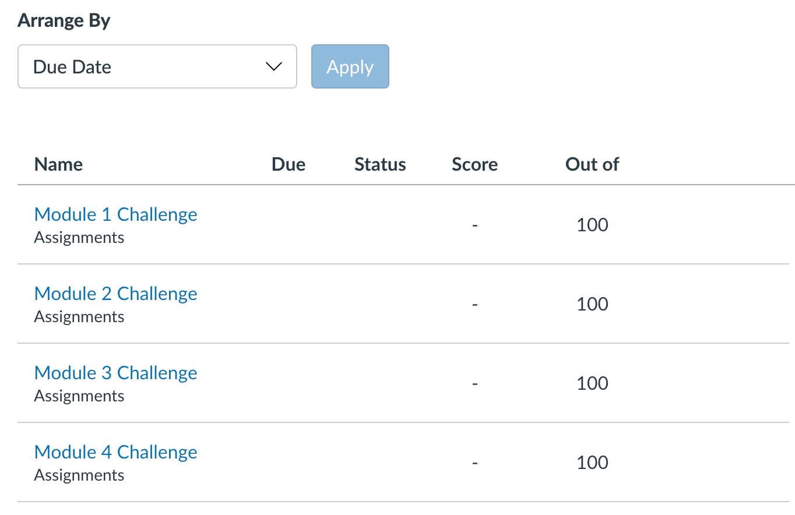
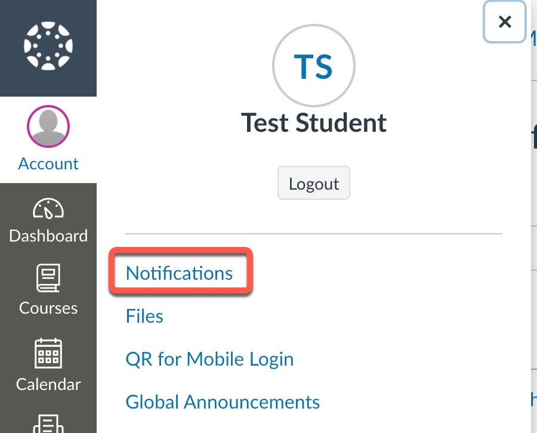

## Lesson 5: Grade Notifications

### Overview

When you log in to this platform, there may be alerts and notifications about grades and course updates. In this lesson, you’ll learn how to access your grades and set up notifications. 

### What You'll Learn

By the end of this lesson, you’ll be able to set up notifications.

### Activities

1. Review the following information about grade notifications:
     - Once your assignment has been graded, an alert will appear next to the Grades link in the course navigation.
     - On the Grades page, shown in the following image, you can find details about your assignments and links to additional feedback:

        

     - You can also set your notification preferences so that you're notified when grades have been posted.

2. Set your notification preferences for the boot camp. From your Canvas dashboard, click "Account" and then "Notifications," as the following image shows:

      

     You can set your notification preferences for grades in the Course Activities section (locate the Grading row). Review your other notification options and set them up according to your preferences. 
