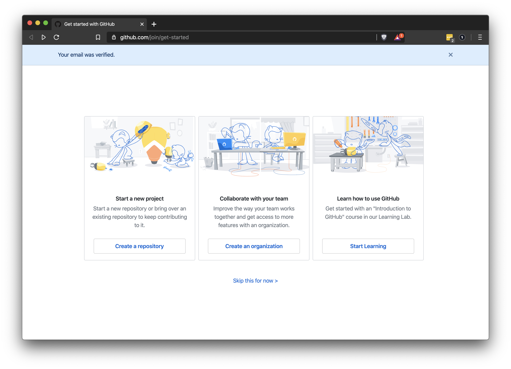
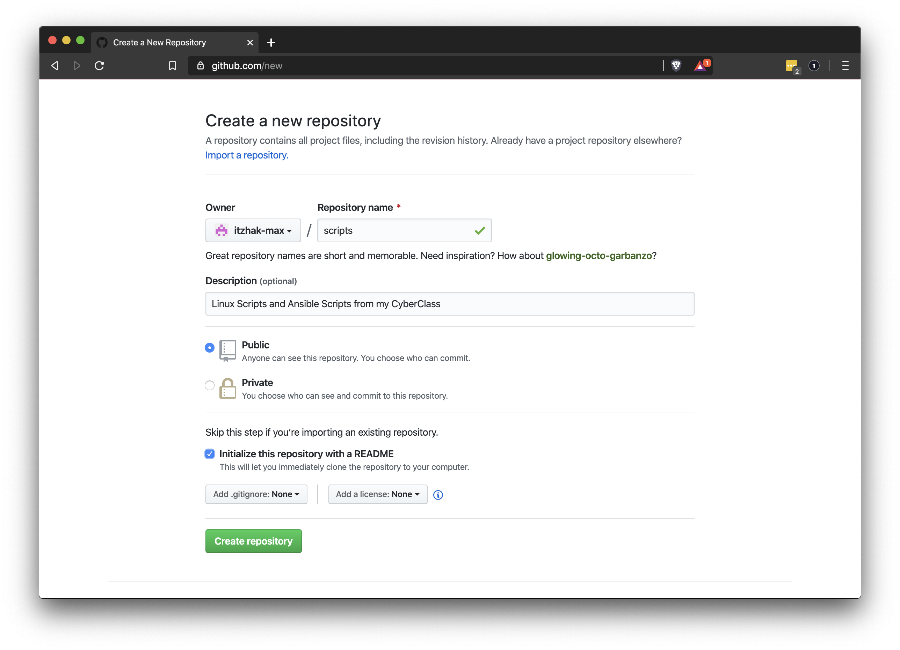
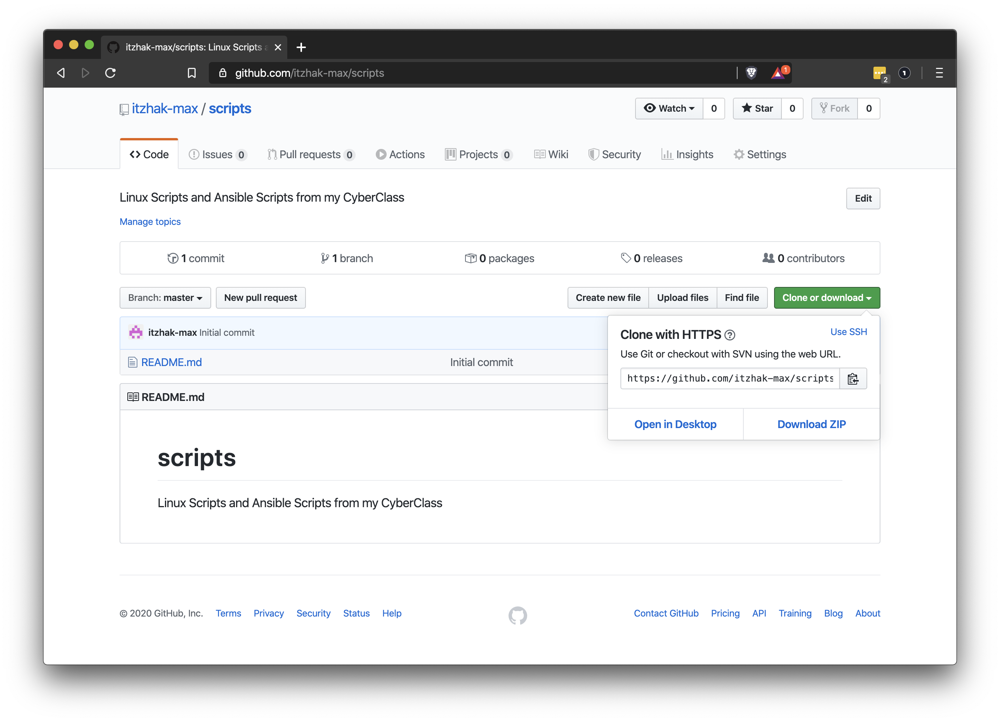
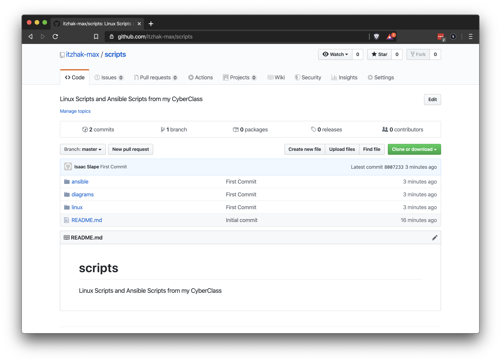
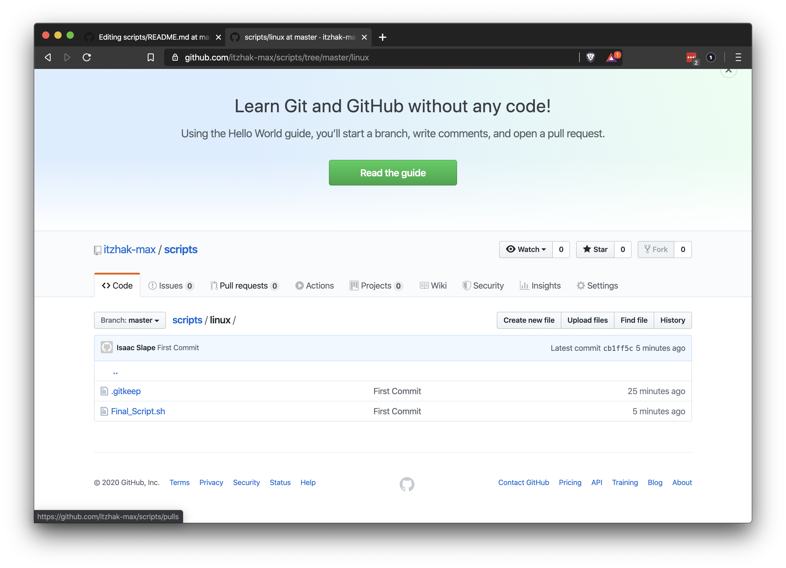
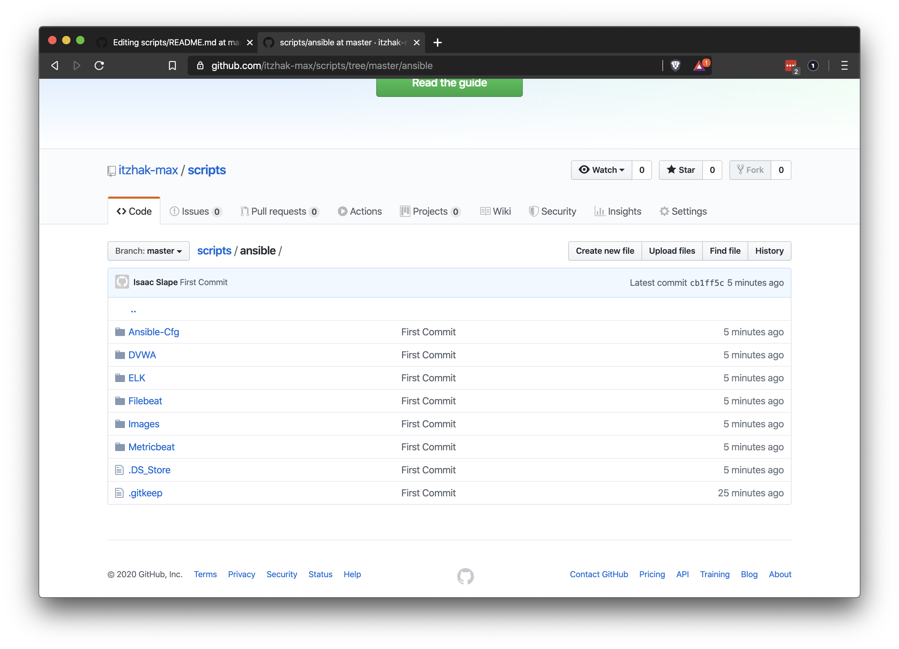
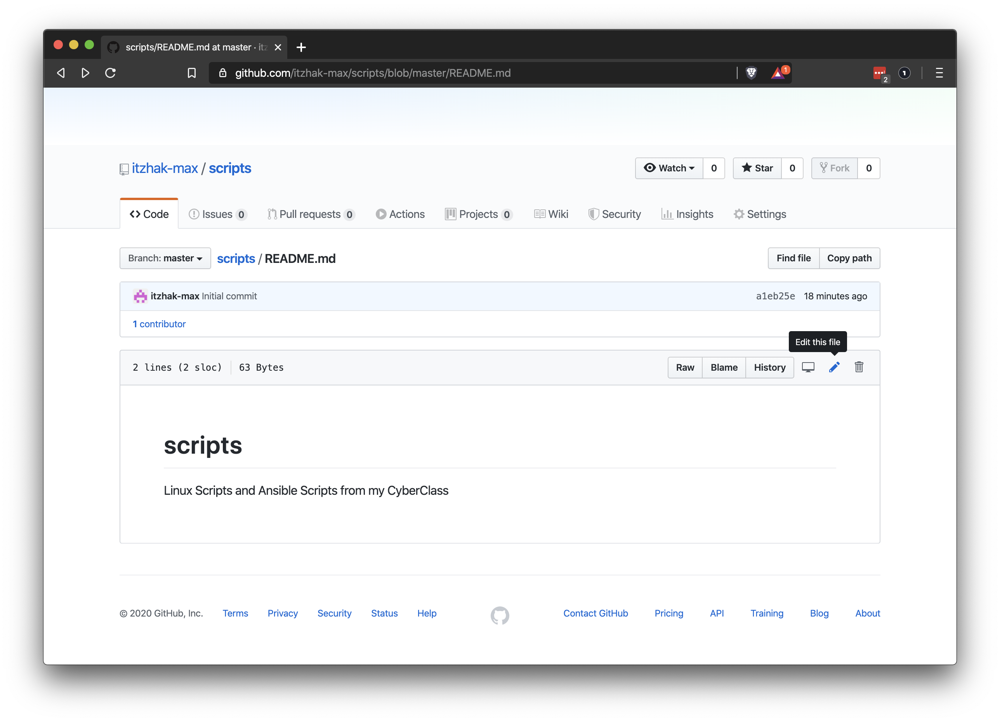
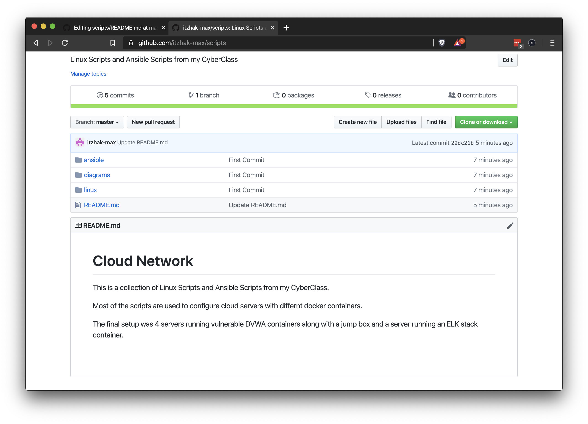

# Homework for Github-Fundamentals

### Background

Before we learn Github, we want to give a brief overview of 'source control'. Source control is a system that allows users to save all versions of a file as they work on it. It's like adding an un-do function to any document or file. As you work, you create save points and at any time, you can revert to a previous save point.

`Git` is the most popular software used for version control. It runs on your local computer and allows you create save points (known as 'commits') for your documents. You can have `Git` manage any directory you wish, and every item inside that directory will be tracked with Git. At any time, you can revert the the `Git` directory (known as a `repository`) and all the items in it to a previous `commit`. 

`GitHub` is a website that allows you to sync your local git repository with a repository in the cloud. This allows you to save your work to the cloud, share your work with others and easily collaborate on a project. Multiple users can access the online repository and sync their own changes. They can also make a copy of your repository if they would like to create an entire new project based on your original project (known as `forking`).

In this activity, we will create a new empty `Github` online repository and then sync it to your local machine. Once we have it working, we will add all of our Ansible Scripts, Bash Scripts and Network Diagrams to the repository, and sync it again with the cloud. Once everything is synced, we will create a `README.md` file that will explain each of the items and display a network diagram. This will give you a nice `GitHub` account to talk about with future employers. We will also utilize this account for other activities as the class moves forward.

### Files Required 

- Ansible YML Scripts from Cloud week.
    - Gather all of your Ansible YML Scripts from your Ansible Container on your Jump box.
    - You can copy and paste these into new documents on your local machine.
- Bash Scripts from Linux week.
    - Gather all of your system configuration scripts you created in Linux weeks.
- Network Diagrams
    - Gather all of the network diagrams you have created in cloud week and networking weeks. 

### Your Goal 

Create a GitHub repository for all of your files. Copy all of your files into the repository and create a README.MD file explaining the repository.

- Create a Free Github account
- Create a repository with the given instructions
- Copy all of your scripts and diagrams to the repository.
- Sync (push) all of your files to your 'remote repository'.
- Create a new README.MD file that displays your diagrams and explains the repository.

### Topics Covered in Your Assignment
The topics covered in this homework assignment are:

- Creating a new github repository with a README.MD file
- Cloning the repository to your machine
- Commands include:
    - git clone
    - git add
    - git commit -m
    - git push
- Editing the README.MD file (requires a bit of [Markdown](https://github.com/adam-p/markdown-here/wiki/Markdown-Cheatsheet))


## Homework Instructions
- Go to Github.com and sign up for github.
- Confirm your email address
- Click on 'Create a Repository'
- Name your Repository and give it a short description
- Check the box for 'Initialize this repository with a README'
- Click on 'Create Repository'

**Solutions:**




Congratulations on creating your first repository!

- Click on the green 'Clone or Download' button on the right side.
- Copy the link presented
- Go to your command line and run the command `git clone https://github.com/your-username/yourlink.git`
    - Enter your username and password to complete the download

**Solutions:**



```bash
% git clone https://github.com/itzhak-max/scripts.git
Cloning into 'scripts'...
Username for 'https://github.com':
Password for 'https://itzhak-max@github.com': 
remote: Enumerating objects: 3, done.
remote: Counting objects: 100% (3/3), done.
remote: Compressing objects: 100% (2/2), done.
remote: Total 3 (delta 0), reused 0 (delta 0), pack-reused 0
Unpacking objects: 100% (3/3), done.

% ls
Desktop         Downloads       Library         Music           Public          scripts         Documents
```

Once you have the repository downloaded:
- Create a folders for Linux, Ansible and Diagrams
- Copy your scripts to each directory
- Run the github commands to sync your local repo to your remote repo:
    - From the top directory of your repo, Run `git add .` to specify you wish to sync _all_ the items and directories in your repo.
    - Run the command `git commit -m "First Commit"` to confirm the items you are syncing with a note. 
    - Run `git push` to sync all of your content.

**Solutions:**
```bash
% mkdir linux
% mkdir ansible
% mkdir diagrams
% ls
README.md       ansible         diagrams        linux
```
```bash
% git push
Enumerating objects: 5, done.
Counting objects: 100% (5/5), done.
Delta compression using up to 12 threads
Compressing objects: 100% (2/2), done.
Writing objects: 100% (4/4), 338 bytes | 338.00 KiB/s, done.
Total 4 (delta 0), reused 0 (delta 0)
To https://github.com/itzhak-max/scripts.git
   a1eb25e..8007233  master -> master
```

Go back to github and confirm your content is there. You may have to refresh the page.

Main Directory:

Linux Folder:

Ansible Folder:


Edit your README file to make a nice presentation.
- Click on the README.MD file
- Click on the small pencil for `edit this file`
- Edit your README to reflect your current repository. 
    - Check out this [Markdown Cheatsheet](https://github.com/adam-p/markdown-here/wiki/Markdown-Cheatsheet)
    - You can create headers using the pound sign '#'
    - You can display the pictures of your network diagrams using the format ``

Edit the README:


To complete this assignment you should have at least few sentences describing your work, and display your network diagram.

**Solutions:**

The Raw Markdown:

```markdown
# Cloud Network
This is a collection of Linux Scripts and Ansible Scripts from my CyberClass.

Most of the scripts are used to configure cloud servers with differnt docker containers.

The final setup was 4 servers running vulnerable DVWA containers along with a jump box and a server running an ELK stack container.


```

The page displayed in GitHub:

