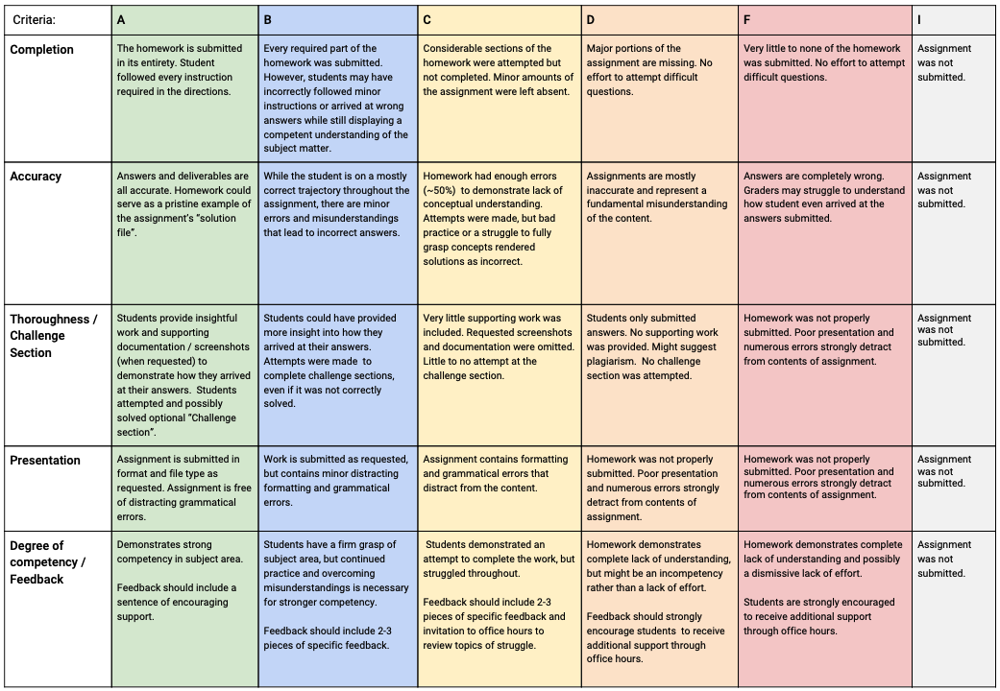

## Cybersecurity Homework README

### Strategies for Completing Homework

- Budget time during the week for studying and completing homework. If possible, set aside three hours three to four times a week. The coursework won’t feel as overwhelming and you won’t be working on assignments last-minute.

- If you are having trouble, don't dwell on one part of a homework assignment for an extended period of time. If you do get stuck, continue on to the next activity and reach out to your TAs or classmates for assistance.

- Create **homework study groups**: You're encouraged to collaborate with your classmates to work through assignments and solve problems. A fresh perspective and another pair of eyes can help you overcome a bug or understand a challenging concept. Form study groups with your peers and learn from each other in the process.

- You will get more out of class if you keep pace with homework. The homework assignments are how you absorb the deep learning you need to succeed as Cybersecurity professionals.

----

### Homework Deliverables

:orange_book: [Homework Sharing with Google Drive](https://coding-bootcamp-cybersecurity-prework.readthedocs-hosted.com/en/latest/modules/sharing-files-using-google-drive/)

#### Access Google Drive and Create a Link

- Navigate to Google Drive at `https://google.com/drive` and login.
- Click `New` then add a **File**.
- Add the file to Google Drive.
- Locate the file in your Google Drive.
- **Right-Click** the file and then click **Share**.
- Make sure the link has the permission set to **Anyone with the link can view**.
- Copy link.

#### Submit to BCS

- Log in to BCS (bootcampspot.com)
- Go to the **Homework** for **Week 5**.
- Add the Google Drive Link
- Submit Homework.

----

### Plagiarism is Unacceptable

Plagiarism is the act of presenting the material, concepts, or products of another person, group, or entity as one’s own work without providing citation or reference. Acts of plagiarism will not be accepted and could lead to dismissal from the program.

- :mag: [What is Plagiarism?](https://coding-bootcamp-cybersecurity-prework.readthedocs-hosted.com/en/latest/modules/module-6-Be-Original/)

**Note**: You may share ideas among peers as long as you cite all sources accordingly.

----

### Methods of Assessment

Homework will be graded based upon the following rubric:

---