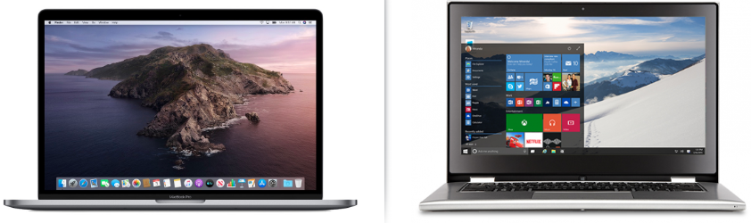
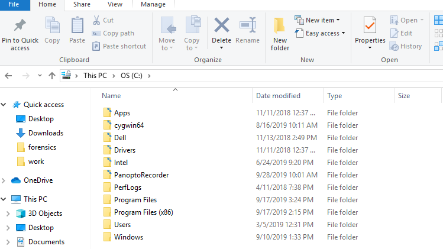

# 3.1 Lesson Plan: How Sweet Is the Terminal?

### Overview

In today's class, students will begin to learn about the terminal and bash commands. Throughout the day, students will complete activities focused on using the command line for basic file navigation and retrieval tasks.

### Class Objectives

By the end of class, students will be able to:

  - Discuss the prominence and utility of the command line in IT and security professions.

  - Use commands like `ls`, `cd`, `mkdir`, `touch`, `cp`, `mv`, `rm`, `rmdir`, and `cat` for basic file navigation and manipulation.

  - Navigate deeply nested folder structures using relative and absolute file paths.

  - Use commands like `head`, `tail`, `more`, and `less` to preview files in the command line.

  - Combine the above commands in sequence to accomplish relevant IT tasks.

### Lab Environment   

You will use your local Vagrant virtual machine for today's activities. Please note that instructors and students have different access credentials.
  
  - Instructor access:
    - Username: `instructor`
    - Password: `instructor`

  - Student access:
    - Username:`sysadmin`
    - Password: `cybersecurity`

:warning: **Heads Up**: In the event of lab malfunctions, use a backup zip file containing this unit's student activity directories.

  - [Backup Student Activity Directories: Terminal Unit](Resources/terminal.zip)


### Instructor Notes

- Welcome back! This week, students will be taking their first step in building their technical tool belt by learning about terminal and command-line applications.


- In today's class, you may find that some of your students may be intimidated and struggle to keep up, while others may find the content easy to follow. For those students who are struggling, encourage them to be patient with themselves. Remind them that practice builds competence. For those students who want more of a challenge, assure them that the complexity level will increase quickly over the coming weeks.

- It's worth noting that we will *not* be teaching the Windows command line for any of these activities. In order to create a consistent learning experience, we will be teaching all students Unix-based bash commands. All of the lessons will be taught on an Ubuntu VM.

- Take the necessary time before class to familiarize yourself with each activity. In particular, make sure to practice your workflow before class. It is easy get lost on stage when working in the command line. Each extra keystroke you show on screen is an opportunity for your students to get lost, so be intentional with each command. Take the time necessary to articulate what you are entering at each step.

### Slideshow 

The lesson slides are available on Google Drive here: [3.1 Slides](https://docs.google.com/presentation/d/1somkgdlwclBB7TNYD1QR9-Hc6tMAqMxgC5BHwm8zJFM/).

- To add slides to the student-facing repository, download the slides as a PDF by navigating to File > "Download as" and choose "PDF document." Then, add the PDF file to your class repository along with any other necessary files.

- **Note:** Editing access is not available for this document. If you or your students wish to modify the slides, please create a copy by navigating to File > "Make a copy...".

### Time Tracker

The time tracker is available on Google Drive here: [3.1 Time Tracker](https://docs.google.com/spreadsheets/d/18jHileJ4feOD3YuQQV6bxTey37utF-sUBQSo1xWj_qc/edit#gid=0).

- **Note:** Editing access is not available for this document. If you or your students wish to modify the slides, please create a copy by navigating to File > "Make a copy...".

### Student Guide 

Send class the student-facing version of the lesson plan: [3.1 Student Guide](StudentGuide.md)  

-------

### 01. Instructor Do: Why Terminal Matters (0:10)

Welcome students to the third week of class and inform them that today they will be learning the basics of the command line.

Note that most of them are likely familiar with a Microsoft Windows or a Mac interface that looks like the following:

   

- These interfaces are called **Graphical User Interfaces** or **GUI** (pronounced "gooey").

- They are called GUIs because they contain graphical elements, such as  icons, windows, and buttons.

Explain that within these Mac and Windows GUIs, you can accomplish many user tasks by directly clicking your mouse on the screen, such as:

  - Creating files
  - Viewing files
  - Moving files
  - Searching through directories    

Explain that this week we will be learning how to use a different interface to complete these tasks called the **command line**.

Conduct a quick poll to determine how many students have worked with the command line in the past. Note the "Fist to Five" slide.

:bar_chart: If online, use [Zoom's](https://support.zoom.us/hc/en-us/articles/213756303-Polling-for-meetings) or [Slack's](https://slack.com/help/articles/229002507-Create-a-poll-) poll feature to host this poll, with the numbers 1-5 as the possible answers. 

- If there are just a few, assure students that it's okay, as the command line is easy enough to learn with a bit of practice.

- If there are many questions, let them know that they will be building on their existing knowledge throughout the week.

#### What is the Command Line?

Introduce the command line by covering the following:

  - Unlike the Windows and Mac interfaces, command line users do not directly interact with icons and buttons on the screen.

  - Rather, users complete tasks on their machine by issuing commands with a line or lines of text.

    For example: rather than clicking on a file to open it, we type a command that opens the file.

  -  The command line is a critical core competency for IT and security professionals.

#### Why the Command Line?

Explain that while the command line may seem challenging at first, learning and using it provides important benefits for IT and security professionals. The command line can be:

- **The only way to achieve a desired outcome.**
  - In many cybersecurity and IT jobs, you will find yourself working with systems and tools that have no GUI interface. This is typical of many servers.

  - For example: As a security professional, you may need to configure a system that does not have a GUI, and the command line will be your only mode for configuration.

- **The fastest way to achieve a desired outcome.**

  - The command line has many tools and scripts that are not available on a GUI. These tools can often speed up a task.

  - For example: You can develop a script on a command line that can automate and repeat a task.

- **The most flexible way to achieve a desired outcome.**

  - While working with a GUI may be the most familiar, working directly with the command line provides greater control.

  - For example: You can output logs to exactly where you want, combine files in unique ways, and string together commands with more flexibility.

Finally, stress that the best way to learn the command line is to use it. Therefore, this week is built around hands-on exercises.

Let students know that in today's exercises, they will be playing the role of security analysts at a candy manufacturing company, Wonka Corp.

- They will be using the command line to  investigate a potential rogue employee, who may be selling secret Wonka Corp recipes to a rival organization, Slugworth Corp.  

- Students will be tasked with using the command line to identify evidence on the system of suspicious activity from this rogue employee.

Take a moment to address questions before proceeding.


### 02. Instructor Do: Basic Terminal Commands (0:15)

We will begin by showing the common GUI equivalent of a directory:



Point out that each one of these folders can contain other sub-folders and files.

Explain that within this Windows Explorer, you can complete the following common tasks:

- View your current location by viewing the current directory path at the top of the explorer page.

- Navigate through the directories and files by clicking directly onto the folder to access its sub-folders or files.

- Create folders by right-clicking and selecting **New** > **Folder**.

Explain that we will be completing these same tasks on the command line using the following text commands:
- `pwd` to display the current working directory.
- `ls` to list the directories and files in the current directory.
- `cd` to navigate into a directory.
- `mkdir` to make a directory.
- `rmdir` to remove a directory.
- `touch` to create an empty file.
- `rm` to remove a file.
- `clear` to clear out the terminal history on the page.

#### Demonstration Setup

Explain that the upcoming demonstration will introduce many of the most common text commands used by IT and security professionals.

Introduce the common commands with the following scenario:

  - You are a security analyst at ACME Corp and your manager has assigned you several security investigations.

  - They provided you access to a computer in the evidence room and need you to do the following:

     1. Create several directories to organize your investigations: (`Case1` and `Case2`).

     2. Put your directories in the existing folder `security_evidence`.

     3. Put an empty file in the `Case1` directory titled `case1_evidence`. Later, you will use this file to store evidence.

This computer doesn't have a GUI, so we have to complete all these tasks on the command line.  

#### Basic Terminal Demonstration

|                                                                          :warning: `root` and `sudo` :warning:                                                                          |
|:-------------------------------------------------------------------------------------------------------------------------------------------------------------------------------:|
| Be prepared to conduct activities as `root` or run `sudo` prior to demonstrations and activities. There may be instances requiring `sudo` that aren't called out in the instructions. |
1. Open an instance of a terminal on your Ubuntu VM.
   - :warning: **Heads Up**: Complete this demonstration in the `/03-instructor/day1` directory.

   - Explain that for our scenario, this is the new computer.


2. First, we need to know our current location in the file directory.

   - To find our current location, run the `pwd` command to display the path.

   - Explain that `pwd` stands for "print working directory," and this command displays your current location.

   - Our current location should display as `/03-instructor/day1/terminal_demonstration`

3. Now that we know where we are located, we need to know which other folders we can access and navigate into.

   - Run the `ls` command to see all the files and folders in your current directory.

   - Explain that `ls` provides a list of files and folders in the current folder.

   - Point out that the results only display a directory called  `security_evidence`.

4. Next, we will navigate into  the  `security_evidence` folder, as your manager requested.

   - Run the command `cd security_evidence` to navigate into that folder.

   - Explain that `cd` stands for "change directory."

   - The syntax is  `cd  <folder name>`.

   - Run the `pwd` command and show that you are now located in the `/03-instructor/day1/terminal_demonstration/security_evidence` folder.

5. Explain that we are now in the `evidence_folder` and can create several directories to place our evidence.

   - Run the command `mkdir Case1`.

   - Explain that `mkdir` stands for "make directory" and the syntax is `mkdir  <folder name>`.

   - Run the `ls` command to display that the directory of `Case1` has been created.

   - Run the command `mkdir Case2`.

   - Run the `ls` command again and see that the directory for `Case1` and `Case2` have been created.

6. Security analysts often make mistakes when creating directories. Fortunately there is a command to undo these mistakes.

   -  Run the command `mkdir Case3`. Point out that you accidentally created a directory that wasn't requested by the manager.

   -  Explain that `rmdir` stands for "remove directory" and will remove a directory as long as it has no contents.

    - The syntax is   `rmdir  <folder name>`

   -  Run the `rmdir` command and then run `ls` to display that `Case3` no longer exists.   

7. Your manager's last request was to put an empty file called `case1_evidence` in the `Case1` directory.

   - Explain that we will first run `cd Case1` to navigate into that folder.

   - Run the following command `touch case1_evidence`.

    - Explain that `touch` is a command that creates an empty file.

    - The syntax is   `touch <file name>`

    - Run `ls` and point out that `case1_evidence` has been created.

    - Explain that if you accidentally create the wrong file, similar to `rmdir`, you can use `rm  <file name>` to remove a file.


8. You have now completed your manager's requests and can use the `clear` command to clear the terminal history on your page.

   - Explain that `clear` removes the text from the page and starts from a fresh command line.

Summarize this demonstration by using the slides to review the commands just covered:

   - `pwd` displays the current working directory.
   - `ls` lists the directories and files in that current directory.
   - `cd` navigates into a directory.
   - `mkdir` makes a directory.
   - `rmdir` removes a directory.
   - `touch` creates an empty file.
   - `rm` removes a file.
   - `clear` clears the terminal history on the page.


Explain that in the first command line activity of the day, you will use these commands to prepare for an investigation into the malicious employee who may or may not be selling secrets to your rival organization, Slugworth Corp.

:bar_chart: Take a moment to run a comprehension check poll and address any questions before moving on.

### 03. Student Do: Take Five and Practice the Command Line (0:20)

Explain the following to students:

- You are security analyst at Wonka Corp.

- Wonka Corp believes one of their employees might be selling secret recipes to Slugworth Corp.

- You have been tasked with creating evidence directories for `email`, `logs`, and `web_access`.  

- These directories will be used later to organize your investigation notes on the rogue employee.

Send students the following instructions:

- [Activity File: Take Five and Practice the Command Line](Activities/04_takefive/unsolved/readme.md)


### 04. Instructor Review: Take Five and Practice the Command Line (0:10)

:bar_chart: Using [Zoom's](https://support.zoom.us/hc/en-us/articles/213756303-Polling-for-meetings) or [Slack's](https://slack.com/help/articles/229002507-Create-a-poll-) poll feature, conduct a comprehension check and evaluate how well students completed the activity. 

The goal of this activity was to practice using the most common command-line commands.

Completing this activity requires the following steps:

  - Making a directory.
  - Navigating into the directory.
  - Printing the working directory.
  - Creating empty files.
  - Deleting files.
  - Listing files.
  - Clearing the terminal window.

Share the solution guide with the class:
- [Solution Guide: Take Five and Practice the Command Line](Activities/04_takefive/solved/readme.md)

#### Walkthrough

First, navigate into the `student/take_5` folder on your VM.

- To complete this, run the following commands:


  `cd /03-student/day1`

  `cd take_5`


Create a folder called `Internal_Investigation_Employee_A`.

- Run:

  `mkdir Internal_Investigation_Employee_A`


- To confirm the folder was created, you can run:

  `ls`

Next, navigate into `Internal_Investigation_Employee_A`.

- Run:

  `cd Internal_Investigation_Employee_A`

From within the `Internal_Investigation_Employee_A` folder, print the working directory to confirm you are in the correct location.

- Run:

  `pwd`

- This should display 
  ```
  /03-student/day1/Internal_Investigation_Employee_A/
  ```

Now, create three files inside the `Internal_Investigation_Employee_A` folder: `email_evidence`, `log_evidence`, `web_evidence`.

- Run:

  `touch email_evidence log_evidence web_evidence`

- Explain that we are creating three files with one command by putting a space between each of the files. We could also have created each file one at a time.

Delete the file `web_evidence`.

- Run:    

  `rm  web_evidence`

Display (list) all the files created.

- Run:

  `ls`

- Point out that the only two files that display are `email_evidence` and `log_evidence`.


Finally, clear the terminal window.

- Run:

  `clear`


Emphasize that these are just a few of the most common commands you will use from the command line. The best way to get comfortable using them is to practice.

Answer any questions that remain before proceeding to the next lesson.


### 05. Instructor Do: Relative vs. Absolute Paths and the cp and mv Commands (0:10)

Remind  students that we just covered several commands that assist with file navigation and creation.

Explain to  students that the unique location in the directory where the file is created is called a **file path**.

- A file path is like a physical path, as you have to follow a specific route to reach your destination.

Use the following hypothetical example:

`/home/Sally/Desktop/my_images/cat.jpg`

  - The file is an image called `cat.jpg`.

  - The directory path is `/home/Sally/Desktop/my_images/`.

- The `cat.jpg` image file is located in the `my_images` directory, which is in the `Desktop` directory, which is in the `Sally` directory, which is in the `home` directory.

Explain that file paths are often used by IT and security professionals to describe where files or other directories are loaded.

  - For example, if you are a security administrator and need to access a network log in order to conduct an investigation,  you may need to ask the Network team for the location or path of a network log file. The Network team would likely provide you with a path such as `/var/log/logfile1.txt`.

  - This means the `logfile1.txt` log file is in the `log` directory, which is in the `var` directory.

Explain that there are two methods for providing paths to a file or directory on the command line: **absolute paths** and **relative paths**.


Explain absolute paths by noting the following:  

- An absolute path indicates the location of a file regardless of the user's current location in the file directory.

- In other words, if a we are in the `Applications` directory and need to access a file in the `Desktop` directory, we can use an absolute path to get that file without first navigating to the `Desktop` directory.

- When writing an absolute path, we need to include the top of the directory structure:

  For example: We want to access a file in `/home/Sally/Desktop/Sallysfiles/textfiles/Sallyfile.txt`.

  *  If we are located in another directory, such as `/home/bob/file_logs/`, we can use an absolute path of `/home/Sally/Desktop/Sallysfiles/textfiles/Sallyfile.txt` to access `Sallyfile.txt`.

A relative path, on the other hand, starts at the user's current location in the file directory. It doesn't require starting from the top of the directory structure.

- In other words, if you need to access a file in the `Desktop` directory and you are already in the `Desktop` directory, you can create a path starting from your current location.

  For example: To access `Sallyfile.txt`, we can use  `Sallysfiles/textfiles/Sallyfile.txt`.

  - The user is in the `Desktop` directory, therefore `home/Sally/Desktop/` is assumed and is not written.
  

Explain that, for relative paths, you can also use `./`, known as the **dotslash**, to indicate a relative path from the current directory.

- The `.` indicates the current directory, and the `/` is the start of the relative path.
  
  For example: To access `Sallyfile.txt`, we can use  `./Sallysfiles/textfiles/Sallyfile.txt`.

#### File Paths on the Command Line

Explain that relative and absolute paths are very helpful shortcuts when working on the command line.

  - For example: Let's say you want to access the `Sallysfiles` directory from the previous example, starting at the `home/Sally` directory.
    - Instead of running the following three commands from the `home/Sally` directory:
      - `cd Desktop`
      - `cd Sallysfiles`
      - `cd textfiles`


      You can use the  relative path from the home/Sally directory as a single command: `cd Desktop/Sallysfiles/textfiles/`.

#### File Path Demonstration Setup

Explain that we will practice relative and absolute paths in the following demo by using this scenario:

  - In your role as security analyst at ACME Corp, your manager asks you to create several additional evidence files to prepare for your investigation.

  - They provide you with the following instructions, which require relative and absolute paths:

     - Navigate into the directory `/03-instructor/day1/pathnav_demonstration/security_evidence/Case2/` and create an empty file called `case2_evidence`.

     - Navigate into the directory `/Case1/`  and create an empty file called `Web_logs`.

     - Navigate back to the home folder.

#### Path Navigation Demonstration  

1.  Explain that, similar to the last demonstration, you need to know your current location in the file directory.

    - **Instructor Note:** Complete this demonstration in the  `/03-instructor/day1/pathnav_demonstration/` folder.

    - To find out your current location, run the `pwd` command to retrieve the path.

    - Your current location should display as `/03-instructor/day1/pathnav_demonstration/`.


2.  Next, your manager asked you to navigate to the `security_evidence/Case2/` directory.

     - To navigate to that directory using a relative path, you would run:

        `cd security_evidence/Case2/`

       - Point out that you have to be in the `pathnav_demonstration` directory to use this relative path.

     - Run `pwd`. You should now be in the `/03-instructor/day1/pathnav_demonstration/security_evidence/Case2/` directory.

     - Create an empty file called `case2_evidence` by running `touch case2_evidence`.

     - Run `ls` to confirm the file has been created.

3.  Next, your manager requested you to navigate into the directory `Case1`.   

      - To navigate into that directory using an absolute path, you would run:
        `cd /03-instructor/day1/pathnav_demonstration/security_evidence/Case1/`.

      - Point out that no matter where in the file system you are, this absolute path will take you to the `Case1` directory.

      - Run `pwd` again. You should now be in the `/03-instructor/day1/pathnav_demonstration/security_evidence/Case2/` directory.
      - Create an empty file called `Web_logs` by running `touch Web_logs`.

      - Run `ls` to confirm the file has been created.

4. Lastly, you have been asked to return back to the home directory.

    - Explain that in order to go backwards out of a directory, we use the `cd ../` command.

    - To go out of multiple directories, you simply add a `../` for each directory.

      - For example, to go backwards out of four directories, you would enter the command `cd ../../../../`.

    - Explain that to go back to the `03-instructor` from our current location, we need to go back home directories.

      - Run the command `cd ../../../../`.

    - Run `pwd` again to demonstrate that you should now be back in the `/03-instructor/` directory.


Check if students have questions before continuing to the next part of the lesson.

:bar_chart: Using [Zoom's](https://support.zoom.us/hc/en-us/articles/213756303-Polling-for-meetings) or [Slack's](https://slack.com/help/articles/229002507-Create-a-poll-) poll feature, conduct a comprehension check. 

#### Copying and Moving Files

Explain that, similar to using the `cd` command with the absolute and relative paths, several other important basic  commands can also be used.

Note that security and IT professionals are often asked to copy files from one location to another.

  - For example, a security analyst may be asked to make a copy of a log file and place the copy in a separate evidence folder. This way, if notes need to be added to the copied file, the original will remain untouched.

The command `cp`, which stands for "copy," creates a copy of the file and places it in a specified location.

  - The original file will remain and a copy of the original will be moved to the new location.

Security professionals are also often asked to move files from one location to another.

   - For example, an image file may have been accidentally placed in the email directory.  An IT professional may need to move the file out of the email directory and into the correct image directory.

The command `mv`, which stands for "move," moves the file from the current location into a new, specified location.
  - Unlike copy, the original file will not remain, and the file will be moved into the new location.  

  - Point out that `mv` is similar to cut and paste commands.


Explain that the syntax for both `cp` and `mv` is:

   `<command> <file> <location to copy or move>`  
   - For example:  `mv cat.jpg  /dirA`
        - Explain that this command will move the file `cat.jpg` into the directory `dirA`.

Further explain that the `<file>` or `<location>` can be indicated with an absolute or relative path if the file is not in your current location.

  - For example:  `mv  dirA/dirB/dirC/cat.jpg  /dirA/dirB`

    - This command will move the file `cat.jpg` from  the `dirC` directory to the `dirB` directory

#### Copy and Move Demonstration Setup

 Explain that we will demonstrate how to use `cp` and `mv` by continuing with the same scenario.

  - Your manager realized they made a mistake. The web activity they want you to gather is only for Case 2. Therefore, you need to move the `Web_logs` file from the `Case1` directory to the `Case2` directory.

  - After you move the file into the `Case2` directory, make a copy of the file `Web_logs` in the `security_evidence` folder. You'll be able to add notes to this file later.


#### Copying and Moving Files Demonstration

1. Similar to the previous demonstrations, you need to know your current location in the file directory to get started.

   :warning: **Heads Up**: Continue to complete this demonstration in the  `/03-instructor/day1/pathnav_demonstration` folder.

    - Run the `pwd` command to retrieve the path of your current location.

    - Your current location should display as `/03-instructor/day1/pathnav_demonstration`.

    - Change back to `/03-instructor/day1/pathnav_demonstration` if you are not currently there.

2.  Your manager has asked you to move the file called `Web_logs` from `Case1` to `Case2`.  

    - We will use the move command.

    - Run the following:

      `mv /03-instructor/day1/pathnav_demonstration/security_evidence/Case1/Web_logs /03-instructor/day1/pathnav_demonstration/security_evidence/Case2/`

    - Explain that this command will move the `Web_logs` file  from the `Case1` directory into the `Case2` directory.

    - Note we are using absolute paths for the file and the new destination.

 3. Your manager asked you to make a copy of the file `Web_logs` from `Case2` in the `security_evidence` folder.

    - We will use the copy command.

    - Run the following:  

      `cp /03-instructor/day1/pathnav_demonstration/security_evidence/Case2/Web_logs /03-instructor/day1/pathnav_demonstration/security_evidence/`

    - This will make a copy of the the `Web_logs` file from the `Case2` directory in the `security_evidence` directory.

    - Note we are using absolute paths for the file and the new destination.

4.  Lastly, we should check to confirm our copy and move commands worked.

    - Explain that first, we will `cd` into the `/security_evidence` directory.

    - Run `ls` and confirm that the copy of the `Web_logs` file is in this directory.

    - Next, run  `cd Case1` in the `Case1` directory and confirm the `Web_logs` has been moved out of this directory.

    - Then, by using an absolute path, change into the `Case2` directory by running:

       `cd /03-instructor/day1/pathnav_demonstration/security_evidence/Case2/`.

    - Confirm the `Web_logs` file has been copied to this directory by running `ls`.

Summarize the commands covered in the previous two demonstrations:

   -  `file path` identifies a unique location in a file system.

   - `absolute path` is a path that includes the top directory of the file system.

   - `relative path` is a path that begins from the current directory.

   - `cp` copies files.

   - `mv` moves files.


Explain that in the next activity, students will use these same concepts to continue preparing for an investigation into the malicious employee that may or may not be selling secret recipes to Wonka Corp's rival organization, Slugworth Corp.

Check if students have questions before continuing to the next part of the lesson.      

### 06. Student Do: Finding your Milky Way (0:20)

Explain the following to students:

- You will continue to play the role of a security analyst at Wonka Corp investigating the employee potentially selling secret recipes to Slugworth Corp.

- Your manager at Wonka Corp needs you to create an additional directory, as they believe there is a second employee working with Slugworth Corp.

- You also must copy and move several of the evidence files after creating this new directory.

Send students the following instructions:

- [Activity File: Finding your Milky Way](Activities/07_milkway/unsolved/readme.md)


### 07. Instructor Review: Finding your Milky Way  (0:10)

:bar_chart: Using [Zoom's](https://support.zoom.us/hc/en-us/articles/213756303-Polling-for-meetings) or [Slack's](https://slack.com/help/articles/229002507-Create-a-poll-) poll feature, conduct a comprehension check and evaluate how well students completed the activity. 


The goal of this activity was to practice using the copy and move commands with absolute and relative paths.

Explain that this activity required the following steps:

  - Making an additional directory.
  - Using the move command with an absolute path.
  - Using the copy command with an absolute path.
  - Navigating to directories with absolute or relative paths.
  - Confirming the files have been moved or copied correctly.

Share the solution guide with the class:
- [Solution Guide: Finding your Milky Way](Activities/07_milkway/solved/readme.md)

#### Walkthrough

Explain that the first step is to navigate into the `students` folder on your VM using an absolute path.

-  Run:

   `cd /03-student/day1/take_5`


Create an additional folder called `Internal_Investigation_Employee_B`.

- Run:

  `mkdir Internal_Investigation_Employee_B`

- To confirm the folder was created, run:

  `ls`

Move the file `email_evidence` from `Internal_Investigation_Employee_A` to `Internal_Investigation_Employee_B`.

- Run:

  `mv /03-student/day1/take_5/Internal_Investigation_Employee_A/email_evidence /03-student/day1/take_5/Internal_Investigation_Employee_B/`

Copy the file `log_evidence` from `Internal_Investigation_Employee_A` to `Internal_Investigation_Employee_B`.

- Run:

  `cp /03-student/day1/take_5/Internal_Investigation_Employee_A/log_evidence /03-student/day1/take_5/Internal_Investigation_Employee_B/`


Check your directories to confirm the files are in the correct locations.

To check `Employee_A`'s directory:

  - Run:

    `cd /03-student/day1/take_5/Internal_Investigation_Employee_A/`

    `ls`

- Only the `log_evidence` file should remain.

To check `EmployeeB`'s directory:

- Run
  `cd /03-student/day1/take_5/Internal_Investigation_Employee_B/`

  `ls`

- The existing files should be `log_evidence` and `email_evidence`.


Check if students have questions before continuing to the next part of the lesson.  

### 08. Break (0:15)


### 09. Instructor Do: Preview Commands (0:10)

Remind the class that we have just covered commands used to navigate the file system as well as to create, move, and copy files.

Explain that there are times that IT and security professionals will need to preview the contents of a file. For example:

  - A security administrator wants to preview the top 10 lines of an email file to figure out whom the email was sent to.

  - A network administrator wants to preview the bottom of a log file to see the last timestamp captured in a file.

Explain that multiple preview commands can assist with these tasks.

Introduce the preview commands by covering the following:  

  - To preview and scroll through a whole file, we can use the `more` or `less` commands.

    - `more`: Used to view a file one page at a time. To move to the next page, you press space bar.

    - `less`: This command is similar to `more` except it allows you to scroll up and down in a file.

  - To preview a file by a certain number of lines, we can use the `head` or `tail` command.

    - `head`: Displays the top 10 lines of a file.

    - `tail`: Displays the bottom 10 lines of a file.

  - 10 is the default number of lines, but this number can be easily changed.

    - The syntax for `head` is   `head -number  file`.

    - For example: `head -50 logfile.txt`  will display the top 50 lines in the `logfile.txt` file.

    - The same syntax applies for the `tail` command.

#### Preview Demonstration Setup

Explain that we will walk through how to use the preview commands in the following scenario:

  - In your role as security analyst at ACME Corp, you are asked to examine several potential evidence files.

  - Your manager provides a directory called `evidence_directory` that contains four files (`File1`, `File2`, `File3`, `File4`).

  - Your manager explains that these files are log files pulled from a secret computer at ACME Corp. They should be access logs that show who logged in to this secret computer.

  - We will use the preview commands to determine which of these files are actually access logs.

  - Once you determine that a file is an access log, document the last timestamp in the file.


#### Preview Commands Demonstration


1. First, navigate into the `evidence_directory`.

    - :warning: **Heads Up**: This is located in the `/03-instructor/day1/preview_demonstration/` folder.

    - Run `cd evidence_directory`  

2.  Your manager told you there are four evidence files in this directory.

     - Confirm this is correct by running `ls`.

     - Output should confirm the presence of four files: `File1`, `File2`, `File3`, `File4`.

3. Next, we need to preview the first file  with the `more` command in order to determine it is an access log file.

     - First, use the `more` command by running:
        - `more File1`

     - Note that this file clearly does not look like an access log file.

     - Demonstrate using the space bar to scroll down through the file.

4. Explain that we will preview the next file using the `less` command.

     - Use the less command by running `less File2`.

     - This file also clearly does not look like an access log file.

     - Demonstrate using the up and down arrow keys to preview a file.

     - Explain that to exit this preview, you need to press the `q` button on your keyboard.

5. Explain we will use the `head` command to display the top 10 lines of `File3`.

     - Run the command `head File3`.

     - Point out that this also does not appear to be an access log file, but it only shows the top 10 lines.

     - View a larger set of lines (30) by running `head -30 File3`.

     - Note that now it displays the top 30 lines, but none of the records look like access logs.

6.  Next, we will open up the last file with the `head` command again.

     - Run the command `head File4`.

     - This clearly looks like an access log file, as it has times, usernames, and login times.

7.  Lastly, since we have found the access log file, we now need to preview the bottom of the file to view the last timestamp.

     - Run the command `tail File4`.

     - Point out that the last timestamp of the file shows Sally logged out at 12/23/19 04:33 p.m.


Summarize the demonstration as covering the following preview commands:

   - `more`: View a file one page at a time, and press space bar to go to the next page.

   - `less`: Similar to `more`, but allows you to scroll up and down on the page.

   - `head`: Previews the top 10 lines of a file.

   - `tail`: Previews the bottom 10 lines of a file.

   - Adding a `-number` after `head` or `tail` will change the number of lines previewed.


Explain that in the next activity, students will use these preview commands to begin investigating the malicious employees that may be selling secret recipes to Wonka Corp's rival organization, Slugworth Corp.      


Check if there are any questions before proceeding.

### 10. Student Do: Oh Henry, What Did You Do? (0:15)

Explain the following to students:

- You continue in your role as security analyst at Wonka Corp, investigating the insider employee potentially selling secret recipes to Slugworth Corp.

- Your manager at Wonka has identified two possible insiders who may be working with Slugworth: Henry and Ruth.

- Your manager has quickly pulled some files from Henry and Ruth's computers, without their knowledge.

- Some of the files contain gibberish, but some may have useful data.

- Your manager has asked you to preview the files to determine which have readable text data that can be analyzed later.

Send students the following:

- [Activity File: Oh Henry, What Did You Do?](Activities/11_oh_henry/unsolved/readme.md)
- [Directories/Files: Oh Henry, What Did You Do?](Resources/oh_henry.zip)


### 11. Instructor Review: Oh Henry, What Did You Do? (0:05)

:bar_chart: Using [Zoom's](https://support.zoom.us/hc/en-us/articles/213756303-Polling-for-meetings) or [Slack's](https://slack.com/help/articles/229002507-Create-a-poll-) poll feature, conduct a comprehension check and evaluate how well students completed the activity. 

The goal of this activity was to practice using the the various preview commands to view file contents from the command line.

Completing this activity requires the following steps:

  - Using the `more`, `less`, and `head` commands to preview content from several files.

  - Using the `tail` command to view data at the bottom of a file.

  - Using the `mv` command to rename a file.

Share the solution guide with the class:
- [Solution Guide: Oh, Henry, What Did You Do?](Activities/11_oh_henry/solved/readme.md)

#### Walkthrough

First, navigate into the `oh_henry` folder on your VM:

- Run:

   `cd /03-student/day1/oh_henry/`

Next, you will need to navigate into Henry's Folder:

- Run:    

  `cd oh_henry`

There are many files in this directory and we can preview each by using `head`, `more`, or `less`.

   - For example: `head do.txt` or `more do.txt`

- Note that most of them contain non-ASCII data because they are actually image files.

The three files that contain text data for each employee are:   

  - Henry:   `do.txt` `sp.txt` `wp.txt`
  - Ruth:    `l8.txt`  `hy.txt` `ud.txt`

Now, we need to delete the other files. We'll delete Henry's files first.

- Run:  

  `rm dj.txt bb.txt b7.txt sd.txt ta.txt`

We can confirm that only the correct files remain by running `ls`.

  - The three files that should remain are: `do.txt`  `sp.txt` `wp.txt`.

Now we'll complete this same process in Ruth's folder.

- The files that should remain are:  `l8.txt  hy.txt ud.txt`

**Bonus**

Explain that to view the date on the bottom of each file, we will run the `tail` command.

- Run:

  `tail do.txt`

On the bottom of the file called `do.txt` is the date October 10, 2019.

- To add this date to file name, we will run the following command:

  `mv do.txt do.txt_10_13_2019`

Explain that we will follow this same process on all the files.

- The final results for Henry will be:
   - `do.txt_10_13_2019`
   - `sp.txt_10_14_2019`
   - `wp.txt_10_15_2019`

- The final results for Ruth will be:
   - `l8.txt_10_13_2019`
   - `hy.txt_10_14_2019`
   - `ud.txt_10_15_2019`


Check if students have remaining questions before proceeding to the lesson.

### 12. Instructor Do: Data Streams and the cat Command (0:10)

Explain that IT and security professionals are often tasked with combining files together.

  -  For example: A security professional may need to combine several of the same type of log files into a single log file.

     -  Combining files lets you do one single analysis of data, rather than analyzing multiple files.

Explain that we can use the `cat` command to complete this task.

Introduce the `cat` command with the following notes:

  - `cat` is short for "concatenate," a word meaning to link together.

  - `cat` combines the designated files and displays the results back to the user, but does not save the result beyond the command line.

    -  For example, to combine two separate files, `1.txt` and `2.txt`, you would run
      `cat 1.txt 2.txt`.

    - This will display back to the user the combined results of `1.txt` and `2.txt`, but not save the results beyond the command line.    

  - In order to save the results of the `cat` command, you have to redirect the data stream.


Introduce data streams by explaining the following:

  -  A **data stream** is a way to describe channels of data as they are processed and moved through a system.

  - Data streams are used to move data from one process or program to another.

  - The two most used data streams are called `stdin` and `stdout`, pronounced "standard in" and "standard out."

  - In the context of a command, input data is usually the `argument` given to the program. The output data is the information returned by the program when the command is successful.

  - Input data is streamed using the data stream `stdin`.

  - Output data is streamed using the data stream `stdout`.


Explain that this idea will start to become clear as we use redirection with `stdin` and `stdout` when using the `cat` command.

Explain how to use redirection with `cat` by noting the following:

  - To save the results of `cat`, the user has to use either:

    - `>` to write or overwrite a file.

    - `>>` to write or add to a file.

For example: You want to combine two separate files, `1.txt` and `2.txt`, into a single file called `combined_1_and_2.txt`.

- You would run the following command:

  - `cat 1.txt 2.txt > combined_1_and_2.txt`

- This command will create a new file called `combined_1_and_2.txt`. If the file name already exists, it will overwrite it with the combined data from `1.txt` and `2.txt`.

Another example: You want to combine two separate files, `3.txt` and `4.txt`, into a single file called `combined_3_and_4.txt`.

- You would run the following command:

   - `cat 3.txt 4.txt >> combined_3_and_4.txt`

- This command will create a new file called `combined_3_and_4.txt`. If the file name already exists, it will add to the bottom of the file the combined data from `3.txt` and `4.txt`.

To explain how `cat` works with `stdin` and `stdout`, use the following example:

   `cat 1.txt 2.txt > combined_1_and_2.txt`

- `cat`  takes data directly from `stdin` and directs it to `stdout`.

  - `1.txt` and `2.txt` is being sent to `stdin`.

- `cat` takes `stdin`, concatenates the data, and sends it to `stdout`.

  - The results of combining `1.txt` and `2.txt` is `stdout`.

- `stdout` is then redirected and written to a file called `combined_1_and_2.txt`.

#### cat Demo Setup  

We will walk through using the `cat` command with the following scenario:

  - You are a security analyst at ACME Corp and tasked with combining several evidence log files from a potential rogue employee.

  - Your manager provided you a directory called `Logfile_evidence_directory` that contains four files (`LogFile1`, `LogFile2`, `LogFile3`, `LogFile4`).  Each file has logs from a different day.

  - Your manager explained that your forensic team will be doing an analysis of these logs, but the team's job will be easier if you can combine the log files into a single file.

  - You must use the `cat` command to combine them into a single file called `rogue_employee_log_evidence`.


#### `cat` Walkthrough

1. Start by navigating into the `Logfile_evidence` directory.

    - :warning: **Heads Up**: This is located in the `/03-instructor/day1/cat_demonstration` folder.

    - Run `cd Logfile_evidence`.  

2.  Confirm there are four log files in this directory.

     - Run `ls`.

     - There are four files in this directory: `LogFile1`, `LogFile2`, `LogFile3`, `LogFile4`.
     - Use the `more` command to preview the files and show that each log file is a log for a different day.
    - For example, run `more LogFile1`.

3. Next, we will use the `cat` command to combine these four log files together, but first we will do it without saving.

     - Type the following command: `cat LogFile1 LogFile2 LogFile3 LogFile4`.

     - Point out that the syntax is simply `cat` followed by the files we want to combine separated out by spaces.

     - Run the command and note that the results of combining the four files display on the screen.

      - Also note that the files `LogFile1` `LogFile2` `LogFile3` `LogFile4` are sent to `stdin` and the combined four files displayed is the `stdout`.      

4. You were tasked by your manager to combine all four files into a file called `rogue_employee_log_evidence`.

     - Type the following command `cat LogFile1 LogFile2 LogFile3 LogFile4 > rogue_employee_log_evidence`.

     - Note that the syntax is the same as the previous command, except we are using the `>` command to redirect the results into a file called `rogue_employee_log_evidence`.

     - Run the command and then run `ls` to display a file called `rogue_employee_log_evidence` has been created.

5. Finally, preview the file called  `rogue_employee_log_evidence`  to show that the four files were successfully combined.

     - Run `more rogue_employee_log_evidence` and push the space bar to scroll through the file and confirm the combination of the four log files.


Summarize the demonstration by recapping the following commands:

   - `cat` is used to concatenate and combine multiple files together.

   - To combine the files into another file, use redirection commands such as `>` or `>>`.

     - `>` will write to a file, but overwrite the file if the file name already exists.

     - `>>` will write to a file, but append to the file if the file name already exists.

Explain that in the final command line activity of the day, students will use all the commands they've learned that day to help Wonka Corp identify the insider selling secret recipes to Slugworth Corp.


Answer any remaining questions before proceeding.


### 13. Student Do: Internal Investigation: Finding the Kit Cat Burglar (0:20)

Explain the following to students:

- You will continue to play the role of a security analyst at Wonka Corp investigating the employees potentially selling secret recipes to Slugworth Corp.

- Your manager believes that Henry and Ruth are sharing secret recipes. Your manager has collected some additional files from Henry and Ruth's computers in order to help build a case against them.

- Your manager wants you to analyze this additional data and prepare a combined evidence file for the local authorities.

- You must act fast so the secret recipes don't get into the hands of Slugworth Corp.

Send students the following:

- [Activity File: Internal Investigation: Finding the Kit Cat Burglar](Activities/14_kitcat/unsolved/readme.md)
- [Directories/Files: Internal Investigation: Finding the Kit Cat Burglar](Resources/find_kit_cat_burglar.zip)


### 14.  Instructor Review: Internal Investigation: Finding the Kit Cat Burglar (0:10)

:bar_chart: Using [Zoom's](https://support.zoom.us/hc/en-us/articles/213756303-Polling-for-meetings) or [Slack's](https://slack.com/help/articles/229002507-Create-a-poll-) poll feature, conduct a comprehension check and evaluate how well students completed the activity. 


In the exercise, students analyzed several directories on a  file system to find several hidden files.  The students used the terminal commands they learned today to complete the activity.

Completing this activity required the following steps:

- Navigating through multiple directories to find hidden files.
- Previewing files.
- Concatenating the found files to create an evidence file.

Share the solution guide with the class:
- [Solution Guide: Internal Investigation: Finding the Kit Cat Burglar](Activities/14_kitcat/solved/readme.md)

#### Walkthrough

Explain that the first step is to navigate into the `/03-student/day1/find_kit_cat_burglar` folder on your VM.

- Run the following commands:

  - `cd /03-student/day1/`
  - `cd find_kit_cat_burglar`

In this directory are folders for evidence gathered from oh_henry and Ruth.

- Explain that within oh_henry and Ruth's directories are sub-directories for:
     - Emails
     - Files
     - Logs
     - Other

- We will need to preview all the files in each of these directories to find files that can be used as evidence.

- We can use `more`, `less`, or `head` to view the file contents.

The files that contain "evidence" to provide to the authorities are:

  - `/03-student/day1/find_kit_cat_burglar/ruth/emails/emailA`
  - `/03-student/day1/find_kit_cat_burglar/ruth/files/sd.txt`
  - `/03-student/day1/find_kit_cat_burglar/henry/emails/email1`
  - `/03-student/day1/find_kit_cat_burglar/henry/emails/email4`
  - `/03-student/day1/find_kit_cat_burglar/henry/logs/log1`
  - `/03-student/day1/find_kit_cat_burglar/henry/logs/log2`
  - `/03-student/day1/find_kit_cat_burglar/henry/other/top_secret/recipe_for_sugarplum`
  - `/03-student/day1/find_kit_cat_burglar/henry/other/top_secret/recipe_for_sweetums`     

Next, we'll go back to the `find_kit_cat_burglar` directory, and make a directory called `Evidence_for_authorities`.

- Run:

  `mkdir Evidence_for_authorities`

Next, we will need to copy all the evidence files into this directory.

- To do this, run the following commands using absolute paths:

```cp /03-student/day1/find_kit_cat_burglar/ruth/emails/emailA   /03-student/day1/find_kit_cat_burglar/Evidence_for_authorities
   cp /03-student/day1/find_kit_cat_burglar/ruth/files/sd.txt     /03-student/day1/find_kit_cat_burglar/Evidence_for_authorities
   cp /03-student/day1/find_kit_cat_burglar/henry/emails/email1  /03-student/day1/find_kit_cat_burglar/Evidence_for_authorities
   cp /03-student/day1/find_kit_cat_burglar/henry/emails/email4   /03-student/day1/find_kit_cat_burglar/Evidence_for_authorities
   cp /03-student/day1/find_kit_cat_burglar/henry/logs/log1    /03-student/day1/find_kit_cat_burglar/Evidence_for_authorities
   cp /03-student/day1/find_kit_cat_burglar/henry/logs/log2  /03-student/day1/find_kit_cat_burglar/Evidence_for_authorities
   cp /03-student/day1/find_kit_cat_burglar/henry/other/top_secret/recipe_for_sugarplum  /03-student/day1/find_kit_cat_burglar/Evidence_for_authorities
   cp /03-student/day1/find_kit_cat_burglar/henry/other/top_secret/recipe_for_sweetums /03-student/day1/find_kit_cat_burglar/Evidence_for_authorities
```   

The final step is to concatenate all the files together.

- Move into `Evidence_for_authorities` and run:

    `cat  emailA sd.txt  email1 email4 log1 log2 recipe_for_sugarplum  recipe_for_sweetums > Wonka-evidence.txt `     

 **Bonus**
 
 - The hidden files are `lp.txt`, `dj.txt`, `bb.txt` and `b7.txt` in Ruth's `files` directory.

 - To change the file extension from .txt to .jpg, run:
   - `mv lp.txt  lp.jpg`
   - `mv dj.txt  dj.jpg`
   - `mv bb.txt  bb.jpg`
   - `mv b7.txt  b7.jpg`
   
 - Open the file to display the images. 

Congratulate the class on a job well done! They have saved Wonka Corp by handing the evidence over to the authorities before Slugworth got their hands on the secret recipes!

Answer any remaining questions.


### 15. Instructor Do: Optional -  Review Key Commands (0:00)

* If time allows,  return to the slides to guide students through a brief review of the commands covered today. This is a great way to build confidence among students and remind them of all they've learned. Try to engage individual students as you go through the review.

* As you make your way to the end, be sure to encourage students to continue practicing. Without your nudge, many students will assume their studies start and end during class hours. Let them know that practice outside of class is required to build proficiency!

* Also let them know that the next class will cover additional terminal commands for finding files based on search parameters and, more broadly, how to use documentation to uncover new commands.  

### 16. Instructor Do: Optional - Preview Challenge (0:00)

* If time allows, end class by pointing students to the posted Challenge assignment. This is just a preview of the Challenge. Students don't yet have all the skills and information needed to complete the Challenge, but it won't hurt to take an early look.

-------

© 2020 Trilogy Education Services, a 2U, Inc. brand. All Rights Reserved.
