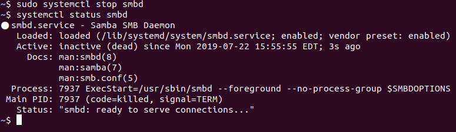

## 4.3 Lesson Plan: Managing Permissions and Services

### Overview

Today's class will continue our introduction of Linux by covering more topics related to auditing a malfunctioning system, ranging from file permissions to service users, managing services, and securing the root account.

### Class Objectives

By the end of class students should be able to:

- Inspect and set file permissions for sensitive files on the system.

- Manage and monitor services on the system, including removing unused services.

- Create and assign users for services.

### Instructor Notes

- Remind students to pull frequently. It is being consistently refined and improved. 

- Be prepared to conduct activities as `root` or run `sudo` prior to demonstrations and activities. There may be instances requiring `sudo` that aren't called out in the instructions.


### Lab Environment

- You will use your local Vagrant virtual machine for today's activities. Please note that instructors and students have different access credentials.

  - Instructor access:
    - Username: `instructor`
    - Password: `instructor`
    
  - Student access:
    - Username:`sysadmin`
    - Password: `cybersecurity`

:warning: **Heads Up**: Before completing today's activities, the setup script for Day 3 should be executed.
  - Have students execute the following script before they go to break.
  - Run `/home/sysadmin/Documents/setup_scripts/sysadmin/day3_stu_setup.sh`

### Slideshow 

The slides for today can be accessed on Google Drive here: [4.3 Slides](https://docs.google.com/presentation/d/1C-tlM9NHyD-mF2CcYFV7FONs5r9hRntZa-4OhovT92g)

- To add slides to the student-facing repository, download the slides as a PDF by navigating to File > "Download as" and choose "PDF document." Then, add the PDF file to your class repository along with other necessary files.

- **Note:** Editing access is not available for this document. If you or your students wish to modify the slides, please create a copy by navigating to File > "Make a copy...".

### Time Tracker

The time tracker for today's lesson can be accessed on Google Drive here: [4.3 Time Tracker](https://docs.google.com/spreadsheets/d/1OjjRuTsG-JJC02HyInFAPeXNpr0MrJeAK0IrkYf_6OI/edit#gid=1047115118)

### Student Guide

Distribute the student-facing version of the lesson plan: [Student Guide](StudentGuide.md)

---

### 01. Instructor Do: Welcome and Review (0:05)

Welcome students to class and review the accomplishments of last class:

- Auditing passwords using `john`.

- Elevating privileges with `sudo` and `su`.

- Creating and managing users and groups.

- Inspecting and setting file permissions for sensitive files on the system.

Explain that today we will pick up with covering permissions on the system before moving on to services and service users, and some physical security topics.

- Mention that while no system is completely safe, there are many steps we can take to make a system harder for an attacker to exploit.

- Our strategies revolve around reducing attack surfaces and continuing to practice the principle of least privilege.

- We will continue our junior Linux administrator narrative, learning a few more techniques to protect the system.  

- Inform students that this week's Challenge will use all of the new techniques they have learned.

| :warning: Day 3 Setup Script :warning: |
|:-:|
| We need to run a script before completing today's activities. Have students run the following script before proceeding: |
| `/home/sysadmin/Documents/setup_scripts/sysadmin/day3_stu_setup.sh` |


### 02. Instructor Do: Access Controls and Permissions (0:20)

:question: **Ask class**: Introduce the concept of access control by taking a poll of how many students have used Google Docs.

- Explain that Google Docs is a fantastic resource because we can choose who we share files with and what permission they have when they receive the file, such as whether they have read, comment, or edit permissions for the file.

Identify this function as **access control** and cover the following:

- These controls determine which actions users are able to take on a file (edit, view, etc.).  

- **Permission** regulates who can take which actions. For example, Jane has read and write permission, but Ivan only has read permission.

Mention that most of the day we have been discussing why it's important to limit access on the system. Access controls and permissions also help us follow the principle of least privilege.

Explain that Linux has a very granular way of setting these permissions:

- Linux categorizes files, programs, and directories as items.

- Each item has permissions allowing or preventing access to **read**, **write**, and **execute**. We'll delve into these actions more in a moment.

- For each item, we specify the access that the **owner**, the **group**, and **others** have.

  - The _owner_ is typically the user that created the item. However, this can be changed.

  - The _group_ is typically the primary group of the owner. However, this can also be changed.  

  - _Others_ includes everyone who is not the owner, and not in the group.


#### Read, Write, and Execute

Explain that for each of the three mentioned categories—owner, group, and other, we have three options we can manipulate: read, write, and execute.

- read determines if the item can be read, or reviewed.
- write determines if the item can be written to, or modified.
- execute determines if the item can be executed.

Mention that while execute can be applied to a file, it really only affects items that can be executed, like a program or a directory.

Explain that for any given item, we can specify if the owner can read, write, or execute, if the group can read, write, or execute, and if others can read, write, or execute.

- This is called **Discretionary Access Control**, or **DAC**. It is called _discretionary_ because these permissions can be passed from one item to another. For instance, a directory may pass on its permissions to items inside it.

- We saw an example of an item passing its permissions to another item in our previous activity, when the program `less` passed on its root permissions to the bash shell that ran inside it.

Explain that this gives us nine options for any given item, and each option can either be allowed or not allowed in any combination.

- To keep things as concise as possible, when we observe each of these options on the command line, they are abbreviated to one letter: `r` for read, `w` for write, and `x` for execute.

#### Permissions Demonstration Setup

Explain that in this demo we will create a file and a directory and examine the default permissions. Then, we will change these permissions to deny particular users and groups access.

Mention that in order to read and manipulate these file permissions, we need the following commands:

- `ls -l` to display the permissions info.

- `chmod` to change the permissions info.

- `chown` to change the owner and group of a file.

Emphasize that the goal will not be how to use the commands, but rather learning the syntax of the permissions themselves and how to combine them with users and groups to create custom access controls.

#### Inspecting Permissions

Explain that we'll start by creating a file and inspecting its permissions.

Move into your `Documents` folder.

- Run `touch my_file` to create a file.

- Run `mkdir my_dir` to create a directory.

- Run `ls -l` to display these files and their permissions info. Your output should be similar to the following:

  ```
    drwxrwxr-x 2 sysadmin sysadmin 4096 Aug 24 13:03 my_dir
    -rw-rw-r-- 1 sysadmin sysadmin    0 Aug 24 13:03 my_file

  ```

Mention that this list includes more information than just the file name. Use `my_file` as an example:

- File or directory permissions: `-rw-r--r--`

- Number of links to this file: `1`

- Username of file or directory owner: `sysadmin`

- Group assigned to the file or directory: `sysadmin`

- Size (in bytes): `0`

- Date and time of last modification: This will be the date and time when the items were created.

- File or directory name: `my_file`

Explain that for this demo, we will focus only on the permissions, and cover the following:

- Permissions are always listed in the order of read, write, and execute for the user, then group, then other.

Explain that directories will always be labeled `d`. Items that are files will always be labeled with a hyphen (`-`).

Explain that the next three characters will show the owner permissions:

- For the directory, the owner permissions is `rwx`, meaning the owner can read, write and execute for the directory.

- The execute permission allows a user to enter that directory with `cd` as opposed to just creating files inside the directory (`w`) or listing the files in the directory (`r`).

- For the file, permission is `rw-`, meaning the owner can read and write to the file. The `-` indicates the absence of permission for execute on the `my_file` file. The owner does not have permission to execute on the file.

- This makes sense, because the file isn't something that can be executed. If we wrote code into this file, and we wanted the computer to run it as a program, we could then enable the execute permission so it could be executed.

Explain that the middle three characters indicate the group permissions.

- For the directory, the group permission is `r-x`. The hyphen `-` indicates an absence of write permission.

- The group does not have permission to create files inside the `my_dir` directory, but anyone from the group can enter the directory and review the files inside it.

- For the file, the group permissions are `r--` . The group has permission to read the file, but it does not have permission to write to or execute the file.

Explain that the last three characters indicate the permissions for all other users:

- For the directory, other permission is `r-x`. All other users have permission to read and execute for the directory. They can only move inside the directory and list the files inside. They cannot create files or otherwise change the contents of the directory.

- For the file, the other permission is `r--`. Everyone on the system who is not the owner and not in the group only has permission to read the `my_file` file. They do not have permission to change the file or execute it.

Summarizing by explaining that:

- `my_file` has read and write enabled for the owner and only read enabled for the group and others.

- `my_dir` has read, write, and execute enabled for the owner but only read and execute for the group and others.

Pause and ask if there are any questions about permissions so far.

#### Changing the Owner and Group

Explain that now we will change the owner and the group by using `chown`.

Explain that the command `sudo chown owner:group <item>` can change the owner or the group of a file or directory. Break down the syntax:

- `sudo`: Only `root` can make ownership and group changes to an item, which is why we’re using `sudo`.
- `chown`: Stands for "change owner." This command can be used to change groups and owners of items.
- `owner`: The owner we are specifying for the item.
- `:`: separates owner and group
- `group`: The group we are specifying for the item.
- `<item>`: The item we want to change. It can be a file or a directory.

- Note: `chown` can also be used to change only the user or group as follows:
  `sudo chown <username> <item>` and `sudo chown :<groupname> <item>`

Next, we will change the owner and the group of `my_file` so that you are no longer the owner and you are no longer in the group.

- Run `sudo chown root:root my_file`

Ask the class if they know what effect this change will have on your permissions for the file.

- You are not the owner, and you are not in the group, so you now fall into the _other_ category.

  - Run `ls -l my_file` to verify the new permissions.

  - :question: **Ask class**: What permissions do you have now that you are in the other category? 

    - **Answer**: Now you only have read permissions for `my_file`. You cannot write or make changes to it.

- Run `nano my_file` and mention that Nano gives you a message stating you cannot make changes to the file.

- Run `rm my_file` to demonstrate that you can still delete this file after confirming that you are deleting a write-protected file.

- Answer `n` to cancel deleting `my_file`. (Run `touch my_file` if you accidentally delete it.)

Explain that we can still delete this file because it lives inside our `Documents` directory and we have full ownership and permissions for our `Documents` directory.

Mention that because you have `sudo` access you can still take any action you want _if_ you invoke those privileges. But without `sudo` access, you cannot edit this file.

Pause and ask if there are questions about changing the user or the group of an item.

#### Changing Permissions

Remind the students that we have the _nine_ options of read, write, and execute for each of the owner, group, and other categories.

Explain that these options can be changed using one of two notations:

- **Symbolic notation**: Uses the letters `r`, `w`, and `x` to set read, write, and execute permissions.

- **Octal notation**: Uses base-8 numbers to set file permissions. For example, `rwx` is `7` in octal. Octal notation will be covered in more depth momentarily.

Let students know that, if it is more comfortable for them, they can always use the symbolic notation when setting permissions themselves, but octal notation will come up in their real-world jobs, so they should be familiar with it.

- Run `ls -l my_file`.

  - This file was created with the default permissions: `-rw-r--r--`.

Explain that you change permissions with the command `chmod`, which stands for _change mode_.

- Run `sudo chmod u=rw,g=rw,o=rw my_file`.
  - Explain to students that unless their user is the owner of the file, only `root` can make permissions changes, which is why we are using `sudo`.

  - The command reads: "Change permissions such that the user has read and write permissions; the group has read and write permissions; and 'others' have read and write permissions."

    - Confirm updated permissions by running `ls -l`

- Run `nano my_file` and mention that you can now edit the file again because we have given write access to the other category, which you are currently part of.

Explain that you can remove permissions by leaving out the `r`, `w`, or `x`, and can also remove them or add them for all three categories with a `-` or a `+`.

- Run `sudo chmod +x my_file`

- Run `ls -l my_file`

Mention that the `x` option has been set for each the owner, group _and_ other.

- Finally, run: `sudo chmod -x my_file`

  - Run: `ls -l`

  - We have removed the `x` permission from all three categories.

#### Octal Notation

Now, we will use octal notation to set permissions.

Explain that permissions in octal notation are denoted by numbers. Just as `-`,`r`, `w`, and `x` represent specific permissions in symbolic; `0`,`1`,`2`, and `4` represent the same permissions in octal.

- `0` indicates that you have no permissions.

- `1` indicates that you can _execute_ the file.

- `2` indicates that you can _write_ to the file.

- `4` indicates that you can _read_ the file.

Explain that, unlike symbolic, in octal, we can add numbers. The sum of these numbers results in specific permission sets.

  - `4` indicates that you can only _read_ the file.

  - `6` indicates that you can _read_ and _write_. (_Read_ + _write_ = `4 + 2` = `6`)

  - `7` indicates that can _read_, _write_, and _execute_. (_Read_ + _write_ + _execute_ = `4 + 2 + 1` = `7`)

Run `sudo chmod 766 my_file`

- The numbers in `766` represent permissions for the owner, group, and world, respectively. In other words, the owner = 7, the group = 6, other = 6.

- Ask students if they can decipher the permission for the owner, group, and other.

  - The owner has permission to read, write, and execute (`7`). The group has permission to read and write (`6`). All others have permission to read and write (`6`).

- Run `ls -l`

  - The permissions now read: `-rwxrw-rw-`.  While this notation tells us the same information as `766`, it is much less compact.

Provide another example:

  - Run `sudo chmod 444 my_file` and explain that this will give everyone only read permissions.

Ask students what command they should run to give everyone read and write permissions.

- To add `2` to each `4`, we will run the following command:

  `sudo chmod 666 my_file`

Ask students what they should run to give the user read, write, and execute permissions; give the group read and execute permissions; and give other read permissions. The answer should be `chmod 754 my_file`.

- Run `chmod 754 my_file`

:bar_chart: Take a moment to run a comprehension check poll and address any questions before moving on.  


#### Summary

Reiterate that in this demo we created a file and a directory and reviewed at all the permissions they had by default. Then, we changed the permissions to deny particular users and groups access to this directory and file.

Emphasize again that students can use the more intuitive symbolic notation but should become familiar with octal notation, as it is very commonly used by system administrators.

Remind them that we needed the following commands:

- `ls -l` to display the permissions info.

- `chown user:group` to change the owner and group of a file.

- `chmod` to change the permissions info.

### 03. Student Do: Access Controls and Permissions (0:25)

Explain the following:

- The senior administrator would like you to make sure a few important files and directories are secure by checking and modifying their permissions.

- In this activity, you will inspect and set file permissions on some of the most sensitive files on the Linux system.

Send students the following file:

- [Activity File: Permissions](Activities/03_Permissions/Unsolved/README.md)


### 04. Instructor Review: Access Controls and Permissions (0:10)

:bar_chart: Run a comprehension check poll before reviewing the activity. 

Remind students that, when hardening a Linux system, we want to make sure a few important files and directories are locked down by checking and modifying their permissions.

Send students the solution file:

- [Solution Guide: Permissions](Activities/03_Permissions/Solved/README.md)

Explain that in order to complete this activity, the basic steps include:

- Set permissions `600` on `/etc/shadow` (`rw` for root only).

- Set permissions `600` on `/etc/gshadow` (`rw` for root only).

- Set permissions `644` on `/etc/group` (`rw` for root and `r` for all others).

- Set permissions `644` on `/etc/passwd` (`rw` for root and `r` for all others).

- Verify all accounts have passwords. (Bonus)

- Verify that no users have UID of 0 besides `root`. If you find one that does, change UID to any value greater than `1000`. (Bonus)

- Provide a list of what you find in your research directory. (Bonus)

Ask students which of these above files contains hashes of all users' passwords, and can be used by an attacker to reverse-engineer, or crack those hashes.

- Answer: `/etc/shadow`.

#### Walkthrough  

Explain that we’ll first inspect the file permissions on each of the files listed, and determine if they are already set correctly or if we’ll need to change them.

- Instead of doing this one by one, we can use one command to display the permissions for all files.

  - Run `ls -l /etc/shadow /etc/gshadow /etc/group /etc/passwd`

The permissions for `/etc/shadow` are set to `640`.

- To change this to `600`, run `sudo chmod 600 /etc/shadow`.

The permissions for `/etc/gshadow` are also set to `640`.

- To change this to `600`, run `sudo chmod 600 /etc/gshadow`.

The permissions for `/etc/group` are already set to `644`. We don’t need to make any changes here.

The permissions for `/etc/passwd` are already set to `644`. We don’t need to make any changes here.


**Bonus**

Next, explain that we’ll verify that all accounts have passwords.

- Run `sudo head /etc/shadow`

- The root user doesn't have a password.

- Your output should be similar to the following:

  ```bash
  root:!:17874:0:99999:7:::
  ```

Explain that now we want to verify that each account has a password hash or a `*` and not a `!` in the second field of each listing in the `/etc/shadow` file. `!` indicates that there is no password set for that user.

Next explain that we will verify that no users have UID of `0` besides `root`. If we find one that does, we will change its UID to any value > `1000`.

- We need to examine the third field of each line in the `/etc/passwd` file. Only the root user should have a `0` in this field, and everything else should be > `1000` if it's a standard user and < `1000` if it's a system user.

  - Run `grep adam /etc/passwd` and mention that the user `adam` also has a UID of `0`.

    - This is a serious security issue, as we now effectively have two root users.  

    - Run `su adam`, and `welcome` when prompted for a password, and then `whoami`.  Notice that Linux thinks `adam` is `root`, because Linux only pays attention to UIDs, not usernames.

We will fix this by manually editing `/etc/passwd`, but this will cause serious errors if we choose an existing UID.  So we have to be careful to assign a unique UID.
   
   - Run `sudo nano /etc/passwd`, and change adam's UID from `0` to a number greater than `1000` that is _not_ in use.

To document what we found in our research directory, we run `nano ~/research/permissions.txt` to create a document that will hold our findings.

#### Summary

Recap the following:

- The first step of the solution required us to secure the file that contains all the users' hashed passwords. Attackers often target this file in the hopes of being able to crack those hashes, and obtain password(s).

- Administrators are often tasked with this type of file hardening, which is why the UID is so important.
  - Linux considers a user's UID, and not the username when it gives permissions. A UID of `0` will automatically have `root` access.


### 05. Break (0:15)

### 06. Instructor Do: Managing Services (0:20)

Explain to students where we are in the day's lesson:

- After reviewing permissions, we are moving on to service and service users.

- The next lecture, demo, and activity will focus on managing services, a common activity for sysadmins.

#### A Brief Introduction to Services and the SMB Exploit

Begin by covering what a service is:

- **Servers** are just computers that offer **services** to other computers.

- A **service** is a function/capability that one machine makes available to another. For example, file-sharing services allow computers to send and receive data.

- Some services are only run locally on the server and not provided to other computers. Tripwire is an example of a local security service.

- These services are packages that you can install and remove, just like other programs.

Explain that manipulating services to do things they are not designed to do is a common form of attack.

- Administrators are responsible for securing services that are running and removing services that are not in use.

- It's crucial for system administrators to be able to start, stop, and inspect services, to ensure they're running when they should be.

Explain that, in this following demo, you will find, stop, and uninstall an unnecessary Samba file-sharing service.

Explain that Samba (also known as SMB) is a protocol that allows users to observe, download, and store files remotely.

- It is commonly used for file sharing among Windows computers, but Linux can use it as well.

- SMB is extremely useful for legitimate users, but has obvious security risks.

- If a malicious user is able to gain access to a shared folder, they can exfiltrate, alter, or delete sensitive files.

- SMB can be secured, but often isn't. Attackers frequently target SMB and similar services for just this reason.

#### Finding and Stopping SMB Demo

Explain that, since this server has already been compromised, you will proceed by stopping the SMB service, and then uninstalling it from the system. This will require the following steps:

1. Listing all running services.

2. Identifying the Samba service in the list to verify that it's running, then stopping it.

3. Ensuring that Samba doesn't start when the machine is started up.

4. Ensuring that Samba is no longer running.

5. Uninstalling the Samba service completely.

Explain that `systemctl` has a lot of options, but, to complete these actions, we only need to know the following:

- `systemctl -t service --all` to list all the running services.

- `sudo systemctl stop <service-name>` to stop the service.

- `sudo systemctl disable <service-name>` to stop a service from starting automatically when the machine starts.

- `systemctl status <service-name>` to determine if a single service is running.

- `sudo apt remove <service-package-name>` to remove the service from the system.

- Note:  We need root access in order to change the status of a service, but not to display the status.  Hence we use `sudo` for `start`, `stop`, `enable`, and `disable`, but not `status`.

Pause and ask if the students have any questions so far.

Run `systemctl -t service --all` and explain the syntax:

- `-t` stands for type.
- `--all` ensures that we can observe all the available services on the system, even if they aren't running.

Output should be similar to the following:

```bash
 UNIT                                  LOAD      ACTIVE   SUB    DESCRIPTION                           
  apparmor.service                     loaded    inactive dead    AppArmor initialization                                          
  apt-daily-upgrade.service            loaded    inactive dead    Daily apt upgrade and clean activities                           
  apt-daily.service                    loaded    inactive dead    Daily apt download activities                                    
  auditd.service                       not-found inactive dead    auditd.service                                                   
  avahi-daemon.service                 loaded    inactive dead    Avahi mDNS/DNS-SD Stack                                          
```

Talk about each column in the list and mention the following:

- `UNIT` has the name of the service.

- `LOAD` displays whether the service module is found on the system or not.

- `ACTIVE` displays the high-level, general state of the service.

- `SUB` displays the low-level, detailed service state (this changes depending on the service).

- `DESCRIPTION` describes the service.

Mention that we can easily note services that the system has searched for and are not found on the system. Those are marked in red under the `LOAD` column and have a yellow dot to the left of the service name.

Explain that you will demonstrate how to identify the `smbd` process and then stop and disable it.

Mention you _enable_ and _disable_ a service to configure whether or not it starts automatically on system boot.

- Run `systemctl -t service --all` and mention the `smbd` service.

- Run `systemctl status smbd` to get the status of the `smbd` service.

- Your output should be similar to the following:

  

  - Mention that the service is marked as `Active: active (running)`.

- Run `sudo systemctl stop smbd` to stop the service.

- Run `systemctl status smbd` to get the status of the `smbd` service again.

- Your output should be similar to the following:

  

  - Mention that the service is marked as `Active: inactive (dead)`.

- Run  `sudo systemctl disable smbd`

Mention that services are just packages. Remind students how to remove a package by running `sudo apt remove <service name>`.

- Run `sudo apt remove samba`

Pause and ask if there are any questions.

Let the students know that if they accidentally `stop` or `disable` the wrong service, they can use `start` and `enable` to reverse the action.

Mention that you have removed Samba from the system, so the following commands won't work. But if you wanted to start and enable that service, you would do the following:

- Type `sudo systemctl enable smbd` as an example of enabling a service.

- Press Ctrl+U to clear the prompt.

- Type `sudo systemctl start smbd` as an example of starting a service.

Before moving on to the next student activity, ask if there are any questions.

### 07. Student Do: Managing Services (0:25)

Explain the following to students:
- In this activity, you will continue auditing the services running on this server.

- Your senior administrator wants you to audit the services being run on the server and shut down old and unused services. They have provided a list of services to check.

- You will check for this list of services and shut down and remove any old service that you find.

Send students the following file:

- [Activity File: Managing Services](Activities/07_Managing_Services/Unsolved/Readme.md)


### 08. Instructor Review: Managing Services (0:10)

:bar_chart: Run a comprehension check poll before reviewing the activity. 

Remind the students that this activity was an audit of the services running on this server. Your senior administrator wants you to audit the services that are running and shut down old and unused services. They provided a list of services to check.

Students should have checked the server for this list of specific services, and shut down and removed any found.

The general steps they needed to complete:

- Identify four services in the list that are installed and running on the machine.

- Stop each service.

- Disable each service.

- Uninstall each service.

Send students the following file: 

- [Solution Guide: Managing Services](Activities/07_Managing_Services/Solved/Readme.md)


Explain that these are very common steps that system administrators often have to take to remove system services.

Run `systemctl -t service --all` and mention the following services from this list on the server:

- vsftpd.service (FTP)

- apache2.service (HTTP)

- nginx.service (HTTP)

**Bonus**

- xinetd.service (Telnet)

- dovecot.service (IMAP or POP3)

Let students know that they'll learn about each of these protocols in great detail in the Networking modules. For now, emphasize that these services can help attackers gain access to the server, and none of them are necessary for the server to function properly.

Mention that this is useful because it lets you know if services are:
- Active
- Inactive
- Failed

Explain that in the cases that one of our services have failed, we will have to check the log files to discover why. We will learn how to review these log files and how to resolve these issues in future classes.

One of the principles of good security is that machines should provide only the services that they need to, and no more. This ensures the machine doesn't leak information that could be useful to attackers.

For the `nginx` and `apache2` services, take the students through the process of:

- Stopping the services.

  - Run `sudo systemctl stop nginx`

  - Run `sudo systemctl stop apache2`

- Verifying that the service is stopped.

  - Run `systemctl status nginx`

  - Run `systemctl status apache2`

- Disabling the service.

  - Run `sudo systemctl disable nginx`

  - Run `sudo systemctl disable apache2`

- Removing the service from the system.

  - Type `sudo apt remove <service_name>`

    :warning: **Heads Up**:  Do not remove ngnix or apache2 from the system. We will need to use them later. 

Explain that we aren't going to actually remove `nginx` and `apache2` but that removing them only requires `sudo apt remove nginx` or `sudo apt remove apache2`.


Before moving to break, ask the class if there are any questions.

### 09. Instructor Do: Service Users (0:15)

Welcome the students back from break.

Start this section by reminding students that, so far, we have reviewed permissions on our server. Then, we found and removed some old, unused, and insecure services.

Next, we are going to explore managing service users and then end the day with a section on securing the root account.

Cover the importance of running services by their own users:

- Services should be run by a user dedicated to running that service.

- Running services by their dedicated users offers a number of security benefits. In particular, it makes it easier to start, stop, and manage the service, and control which files the user's permissions need to access.

- A service user usually has a system UID under 1000 and is not able to log in to use a shell.

  - Assigning service users a UID under 1000 is a convention of Linux. It makes it easier to determine at a glance who is a "normal" user and who is a service user.

  - Since service users are not humans who need to log in and interact with the machine, it's best practice to ensure that service usernames cannot log into interactive shells.

    - For example, it should be impossible to log in to a bash session as the `ftp` user.

    - This reduces the number of ways attackers can gain shell access.

  - All users are assigned a shell for logging in by default. Linux has a shell called `nologin` that is assigned to service users, and does not allow a login.

- Typically when you install a service with the package manager, a service user is automatically created and configured.

- It is a best practice to run a service only with the privileges that it needs. Sometimes, a service needs to start as `root` but can then run other processes under the service user.

#### Set Up Removing and Adding Service Users Demo

Explain that your senior administrator has asked you to follow up on uninstalling unused services by ensuring the services' corresponding users have also been removed from the system. Previously, you disabled `vsftpd`, but its service user, `ftp`, still exists.

Reiterate that processes, such as the `vsftpd` FTP server, require an existing user and group to run under and also to access files. In Debian and Debian-based (Ubuntu) Linux distributions, the service user `ftp` exists to serve this purpose.

- Additionally, your senior administrator plans to install a security service called Splunk, a tool for collecting and analyzing logs for suspicious activity. Along with tools like Tripwire, Splunk makes it much easier for administrators and security personnel to detect and stop malicious behavior.

- They've informed you that they'll handle the installation and configuration themselves, but have requested that you start by creating a service user that they can use to do so.

Explain that, in this demonstration, you'll teach students how to:

- Delete an old, unused service user with `deluser`.

- Create and validate a new service user with `adduser`.

Explain that these commands will use some flags that the students haven't observed yet.

- **When deleting a user:** `--remove-all-files` will remove any file for which the user is the owner, including the home folder and all its contents.

- **When creating a user:** `--system` creates a user with a UID under 1000, sets the login shell to `/sbin/nologin`, locks the user from logging in, and does not assign it a password.

  - Mention that assigning the user `/sbin/nologin` gives that user a shell that does not allow a login.

  - Mention that if the shell assignment were changed, the user would still be locked and unable to log in.

- `--no-create-home` will create a user without a home folder.

  - Because the user isn't a human user, it does not need any dedicated space to save files.

#### Adding and Removing Service Users Demo

Begin the demonstration by identifying the `ftp` user.

- Run `grep ftp /etc/passwd` and mention the `ftp` user in the list.

Explain that we want to remove that user along with any files it created. We also want to remove the group by the same name.

- Run `grep ftp /etc/group` to confirm that the group still exists, as well.

- Type `sudo deluser --remove-all-files ftp`

  - Mention that the `--remove-all-files` flag will remove every file created by that user, including the home folder for that user and the system group by the same name.

- Run `sudo deluser --remove-all-files ftp`

- Run `grep ftp /etc/passwd` and mention that the user for `ftp` entry has been removed.

- Run `grep ftp /etc/group` to confirm that the group is gone.

Explain that you will now create a user for the Splunk service that the administrator would like to install.

- Run `sudo adduser --system --no-create-home splunk`

Remind the students that the `--system` flag creates a user with a UID under 1000, sets the login shell to `/usr/sbin/nologin` and locks the user without a password.

Remind the students that the `--no-create-home` flag creates a user without a home folder.

- Run `tail /etc/passwd` and mention that the user has been created.

  - Mention that the `shell` has been set to `/usr/sbin/nologin`.

  - Mention that the UID is less than 1000.

  - Note: `tail` is better than `grep` here, because we know that the user we just created will be last on the list. 

Remind students that we could also use the `id` command to verify the `UID` is under 1000.

- Run `id splunk` to verify that the UID is under 1000.

- Run `ls /home` to confirm that no home folder was created the `splunk` user.

- Run `tail /etc/group` to verify that a `splunk` group was created.

Remind students that you can display password entries in the `/etc/shadow` file.

- Run `sudo tail /etc/shadow` to verify this user doesn't have a password.

Mention the `*` in the password field for the `splunk` user and explain that this means the user is `locked` without a password.

Explain to the students that after you set up a service user, you would schedule the user to run the service as needed.

Explain that scheduling programs to run at certain times is a topic for next week's class. For now, we just want to be able to manage creating and removing the user.

Pause and ask if there are any questions before moving on.

### 10. Student Do: Service Users (0:25)

Explain the following to students:

- In the previous activity, we stopped and removed a few old services from the system.

- In this activity, you will continue with auditing the same server for your senior administrator.

- The senior administrator would like to remove any old service users from the system and create a new user that will be dedicated to running the Tripwire program.

- To complete this activity, you will use the `adduser` and `deluser` commands with the correct flags to clean up the system and create this new Tripwire user. Tripwire can only be run as `root` so you will also need to add a line to the `sudoers` file to allow this.

Send students the following file:

- [Activity File: Service Users](Activities/10_Service_Users/Unsolved/Readme.md)


### 11. Instructor Review: Service Users (0:10)

:bar_chart: Run a comprehension check poll before reviewing the activity. 

Mention that in the previous activity, we stopped and removed a few old services from the system. In this activity, we are removing those users from the system before adding a new service user for Tripwire.

Explain that in order to complete this activity, you will need to:

- Use the `deluser` command to remove four lingering users.

- Use the `adduser` command with the correct flags to create a new `tripwire` user.

- Edit the `sudoers` file to allow the `tripwire` user to run `tripwire` with `sudo`.

- Change the `tripwire` permissions to only allow the owner of `tripwire` to run the service.

Explain that these steps are not always needed as most services create their own user when the package is installed.

Send students the solution file:

- [Solution Guide: Service Users](Activities/10_Service_Users/Solved/Readme.md)

#### Walkthrough

Remove any service users associated with the services that you removed in the previous activity.

Remind students that the services we shut down during the previous exercise were: `xinetd`, `apache2`, `nginx`, `vsftpd` and `dovecot`. 

For their activity, they needed to remove services specific to `vsftpd` and `dovecot`. 

- Remove one or as many of the following service users: `ftp`, `dovecot`, `dovenull`.

:warning: **Heads Up**: The bonus solution is included in this tour. 

- Run `sudo deluser --remove-all-files <username>`

    - For example, `sudo deluser --remove-all-files dovecot`

Explain that you will create a `tripwire` user that will be dedicated to running `tripwire`:

- Run `sudo adduser --system --no-create-home tripwire`.

- Run `id tripwire` and verify that the `UID` is less than 1000.

- Run `ls /home` to verify there is no `tripwire` home folder.

Remind students that you can display password entries in the `/etc/shadow` file.

- Run `sudo tail /etc/shadow`

Mention the `*` in the password field for the `tripwire` user and explain that this means the user is `locked` without a password.

- Run `sudo tail /etc/passwd`

Mention `usr/sbin/nologin` at the end of the `tripwire` line.


Explain that you will add a line to the `sudoers` file in order to allow this user to run only `tripwire` using `sudo` privileges.

- Run `sudo visudo`

- Add `tripwire ALL= NOPASSWD: /usr/sbin/tripwire` to the user section of the file and save it.

- The section should display as:

    ```bash
    # User privilege specification
    root ALL=(ALL:ALL) ALL
    tripwire ALL= NOPASSWD: /usr/sbin/tripwire
    ```

Explain that you will change the permission of the `tripwire` program to allow only the owner to execute it.

- Run `which tripwire` to locate the `tripwire` package.

- Run `sudo chmod 700 /usr/sbin/tripwire`

- Run `ls -l /usr/sbin/tripwire` to verify.

#### Summary

Mention again that in this activity, we should have removed old users from the system, before adding a new service user for `tripwire` to the system.

Explain that to complete this activity, you needed to:

- Use the `deluser` command to remove four lingering users.

- Use the `adduser` command with the correct flags to create a new `tripwire` service user.

- Edit the `sudoers` file to allow the `tripwire` user to run `tripwire` with `sudo`.

- Change the `tripwire` permissions to only allow the owner of `tripwire` to run the service.


Pause and ask if there are any questions about these solutions.


### 12. Challenge Instructions (0:00)

If time permits, introduce the Challenge assignment. 

Explain that this week, students will practice all of the hardening steps they have learned this week, but on a new system. They will also be running a few new tools: `chkrootkit` and `lynis`.

Send students the following Challenge file over Slack:
  - [Challenge File: Linux SysAdmin Fundamentals](https://github.com/coding-boot-camp/cybersecurity-v2/blob/master/2-Homework/04-Linux-SysAdmin-Fundamentals/Readme.md)


Take a moment to address remaining questions before ending class.

---

© 2020 Trilogy Education Services, a 2U, Inc. brand. All Rights Reserved.
