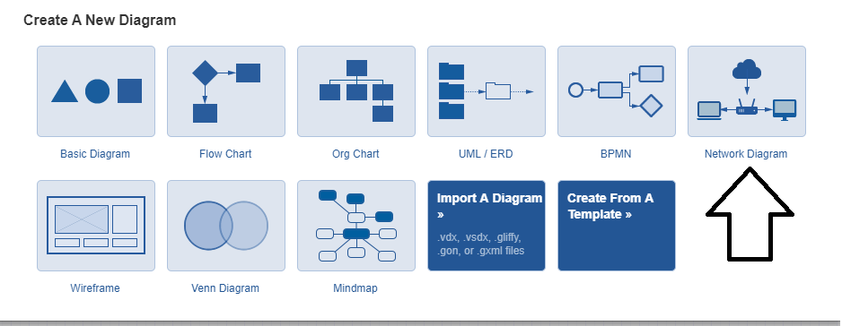
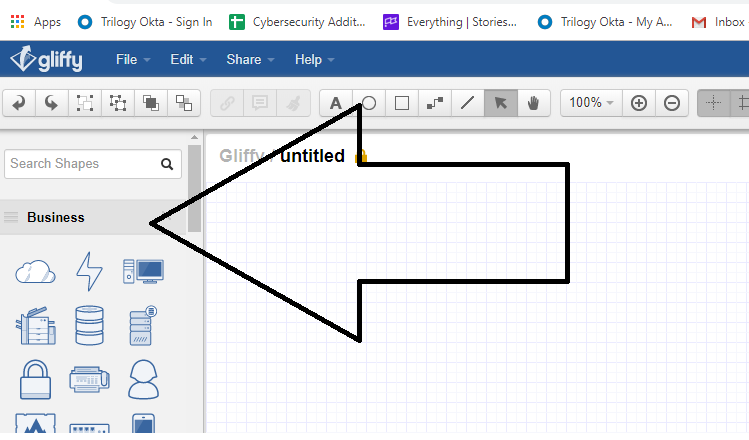
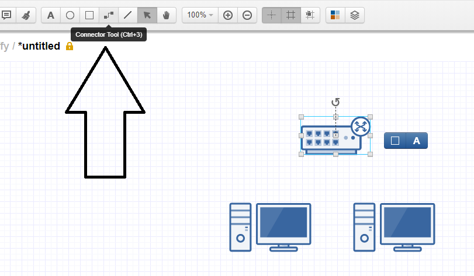
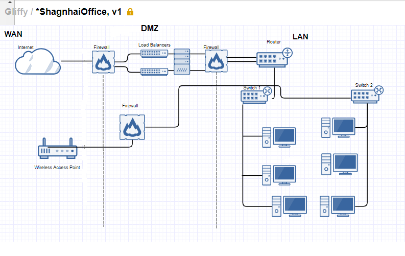
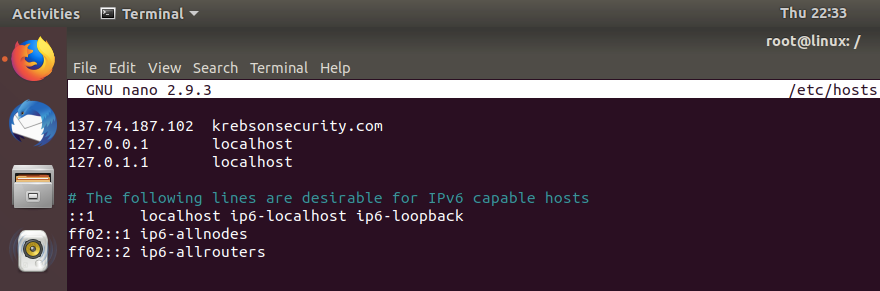
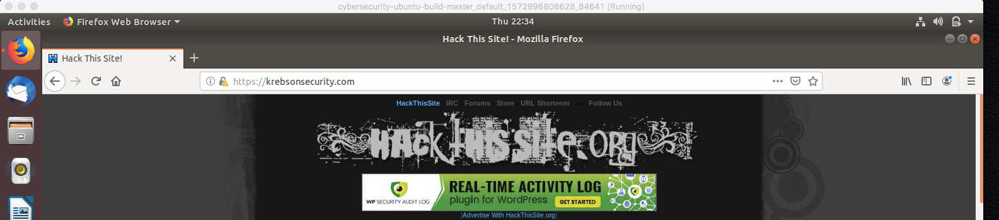

##  8.1 Lesson Plan: Introduction to Networking

### Overview

Today's class is the first part of our introduction to networking.  Students will learn about the client-server model and use this knowledge to assess given scenarios and identify clients, servers, requests, and responses.  They'll learn network topology and network devices and use what they learn to map their own network using the web tool Gliffy.

After studying these foundational networking concepts, the class will focus on network IP addressing, private and public IP addresses, and subnetting. The class concludes by covering similar addressing concepts as they apply to the internet, including DNS, URLs, and their security implications.

### Class Objectives

By the end of class, students should be able to:

- Identify clients, servers, requests, and responses in network communications.

- Identify network topologies and compare their advantages and disadvantages.

- Design a conceptual network made of various network and network security devices.

- Convert binary numeric representations to readable IP addresses and determine which servers the IP addresses belong to.

- Modify Host files to circumvent DNS and redirect the access of a website.

### Lab Environment

Lab Details

 

You will use your local Vagrant virtual machine for today's activities. Please note that instructors and students have different access credentials.

- Instructor access:
    - Username: `instructor`
    - Password: `instructor`

- Student access:
    - Username:`sysadmin`
    - Password: `cybersecurity`

    

### Online Classroom Strategies 

Refer to the following guidelines and best practices for conducting this class online: 

- [Cybersecurity Online Classroom Strategies](../../../00-Teaching-Staff-Prework/OnlineStrategies.md)

### Slideshow

- The lesson slides are available on Google Drive: [8.1 Slides](https://docs.google.com/presentation/d/10BZnME4j8d3vvkkrMjhHftfONQMV3fQz0NUUyp3BM9s/edit#slide=id.g105d828d2f1_0_1245)

- To add slides to the student-facing repository, download the slides as a PDF by navigating to File > "Download as" and choose "PDF document." Then, add the PDF file to your class repository along with other necessary files.

- **Note:** Editing access is not available for this document. If you or your students wish to modify the slides, please create a copy by navigating to File > "Make a copy...".

### Time Tracker

The Time Tracker for today can be viewed on Google Drive: [8.1 Time Tracker](https://docs.google.com/spreadsheets/d/11RQcttIfu44UsT2pJ0je8IihxQlUasl_3IZsEvo5fF8/edit#gid=0)

### Student Guide

Distribute a student-facing version of the lesson plan: [8.1 Student Guide](StudentGuide.md)

---

### 01. Instructor Do: Welcome and Introduction  (0:05)

Welcome students to the first day of Networking and use the daily objectives slides to explain that we will cover the following concepts:

- Client and servers, requests, and responses

- Network topologies and design

- IP addresses and their binary and clear text representations

- DNS and DNS hijacking

### 02. Instructor Do: Intro to Networks and Network Security (0:10)

Explain that this week we'll be switching gears and focusing on one of the most important topics in cybersecurity: computer networking.

Explain that while it's pretty simple to pull up a webpage on your browser or send an email to your friends, a lot of complex technologies and systems go into making this magic happen.

Define a **computer network** as multiple devices connected together to shared resources and/or services.

- **Devices**, also known as **nodes**, can be computers, laptops, mobile phones, printers, servers, etc.

- **Resources** can be webpages, emails, images, data files, etc.

- **Services** are computer programs that have a function, such as processing an online order or doing a calculation.

Emphasize that computer networking is essential for the following technical roles, among others:

  - **Security Operations Center (SOC) Staff:** SOC staff commonly diagnose and troubleshoot network related security issues and attacks. Understanding network devices and network design helps them to quickly resolve and identify issues.

  -  **Network Security Engineer:** Network security engineers may work on the design of a company's network architecture to protect their organization from security risks.

  - **Penetration Tester:** Penetration testers often test for vulnerabilities in a company's network. Understanding network design and common network vulnerabilities is core knowledge for penetration testers.

Explain that a defined model is required for devices to share resources.

#### Client-Server Model

Explain that the **client-server model** is a network computing model that defines how resources and services are shared across a network. Cover the following:

  - In this model, the **client** requests a resource or a service.

  - The **server** hosts the resources and services that the client is requesting.

  - The **server** will return the requested resource or execute the service requested.

For example: You go on Facebook to check your friend's vacation photos.

- Your web browser is the client requesting the resource—your friend's vacation photos.

- Facebook's web server is the server that hosts the image files of your friend's vacation photos.

- Facebook's web server is responsible for returning the requested photos back to your web browser.

Explain that this **two-way conversation** between the client and server is known as the **request and response method** of device communication. Cover the following:  

- The **request** is the process in which the client sends a message to a server asking for a resource or to run a service.

- The **response** is sent back to the client after the server receives and processes the request.

- The **response message** can be:
  - An acknowledgement of the request.

  - The resource requested.

  - An error message.

- Using the Facebook example:

    - The browser makes a **request**: "Facebook, can you please get me my friend's vacation photo?"

    - Facebook's web server provides a **response**: "Yes, here is your friend's vacation photo."

Point out that the client-server model doesn't mean a "one client, one server" relationship. Typically, servers receive resource requests from many clients.

  - For example, if other friends went on Facebook to view your friend's vacation photos, each friend would be using a different client (browser) to pull the same resource (vacation photo) from the single Facebook web server.

#### Introduction to Network Security

Explain that while computer networks provide many advantages, many network security risks and threats exist within them. As we cover new tools and concepts, students will also be introduced to relevant inherent security risks.

Define **network security** as the practices and policies used to protect and monitor computer networks' resources against threats and risks.

Explain that network security threats and risks can include:
- Unauthorized access into networks
- Denial of service  (DoS) attacks
  - For example: An attacker floods your network with traffic to make your resources unavailable.

- Eavesdropping
- Data modification
  - For example: An attacker steals your data and modifies it without your knowledge.

Point out that network security professionals are the staff that design and implement practices and policies to protect against these threats and risks.

- As security professionals, you will often be asked to not only monitor and identify potential network security threats and risks, but also to determine the best way to mitigate them.

Let the students know that in the next exercise, they will see several types of network security attack scenarios and be asked to determine the client, server, and associated request and response.

Take a moment to address remaining questions before proceeding to the next exercise.   

### 03. Student Do: Network Security Activity (0:10)

Explain the following to students:

- In this activity, you will play the role of a security analyst at Acme Corp.

- Several suspicious activities have occurred on Acme's products and systems.

- For each suspicious activity, you must list out the client and servers, and then describe the request and response in simple terms.

Send students the following file:

- [Activity File: Network Security](Activities/03_netsec/unsolved/readme.md)

### 04. Instructor Review: Network Security Activity  (0:05)

:bar_chart: Run a comprehension check poll before reviewing the activity. 

In the exercise, students practiced identifying pieces of the client-server architecture using specific examples involving a business's network security.

Explain that completing this activity required the following steps:

- Reviewing the three examples of suspicious activity.

- Documenting the client and server and describing the request and response in simple terms.  

Send students the following solution guide and use it for your review:

- [Solution Guide: Network Security](Activities/03_netsec/solved/readme.md)

#### Walkthrough

### Scenario 1

A hacker logged into Microsoft Outlook with the stolen username and password of Acme's CFO.  The hacker sent an email to the head of accounting asking them to wire $10,000 to a foreign account owned by the hacker.

- Client: Microsoft Outlook.
- Server: Email server or the mail exchange server.

- Request: Send the email.
- Response: Confirmation from  exchange server that the email is received.

### Scenario 2

 A hacker used Firefox to visit the administrative website of Acme Corp, where they attempted to log into the CFO's account multiple times, until they correctly guessed the password.

- Client: The browser, Mozilla Firefox.
- Server: The web server hosting the administrative webpage.

- Request: Attempt to log into the admin site.
- Response: Login attempt is accepted or denied.

### Scenario 3

A hacker stole the Acme CFO's mobile phone. Login credentials were saved on the phone, so the hacker was able to log into Acme Corp's mobile admin application.

- Client: The mobile admin app on the mobile phone.

- Server: Web application hosting the data, which the app is pulling from.

- Request: Attempt to log into the mobile admin application.

- Response: Login attempt is accepted or denied.

Take a moment to address remaining questions before proceeding to the next section.   

### 05. Instructor Do: Network Structure (0:15)

Emphasize that we defined a computer network as multiple devices (or nodes) connected to each other. This next section will focus on how those devices are connected.

Explain that when computer networks were first created, they were smaller, private networks initially designed to connect devices within the same room or building.  These small networks were known as local area networks.

#### Local Area Network (LAN)

Define a **Local area network (LAN)** as a private computer network that connects devices in smaller physical areas like a room or single building, such as a small office or home network.

Point out the many advantages of using a LAN:

  - **Network speed and performance:** Since the devices are physically and geographically connected near each other, connections are significantly faster and perform better.

  - **Network security:** With security devices, a business can control what data comes in and out of their local network as well as who has access to resources.

  - **Versatility:** New network devices can be easily added or removed inside a LAN due to the proximity of the devices within the network.

Explain that larger companies often do not have a single LAN for their organization, but instead have multiple LANs for different departments or offices within their organization.  

Explain that while these local area networks are great for sharing resources, they are limited to sharing only within their own network.

#### Wide Area Network (WAN)

As technology advanced, computer networks expanded and small networks in different locations were able to connect.

Explain that a **Wide Area Network (WAN)** is a network used to connect multiple LANs.     
- The most widely-known example of a WAN is the Internet.

Explain the biggest advantage of using a WAN is that you are able to share or access resources across a much larger geographic area.

Disadvantages of using a WAN include:
- **Security issues**: Traffic that travels from your LAN and into a WAN needs to be encrypted and never captured.

- **Troubleshooting**: Traffic issues outside of your LAN can be challenging to troubleshoot and resolve.

Now that we know that WANs are a connection of multiple LANs, we'll look at the specific designs and techniques used to make these connections.

#### Network Topology

Explain that computers on a network are connected using a specific design that properly serves the required performance, data flow, and other factors.

Define **network topology** as the design or technique with which computers are set up on a network.

  - The topology can determine the way data flows within a local area network.
  - The topology can also impact the performance and speed of a network.

  - There are a variety of network topologies, with names based on the geometric shape of their design.

Next, we will cover various topologies, along with their advantages and disadvantages.

**Ring**: In a ring topology, each device is connected to the next device in the chain.

- Point out that there are two sub-types of ring topologies
  - **Bidrectional**, in which the topology allows traffic to move in either direction.
  - **Unidirectional**, in which the traffic flows in a single direction.
  
- Explain that for this lesson, we will be referring to the Unidirectional Ring Topology.  

  - **Advantages**
    - Simple to build.
    - Does not require a central node to manage data transmission.

    - Adding devices to the network is easy.

  - **Disadvantages**
    - If any one device goes down, the entire network is affected. In other words, every device is a **point of failure**.

    - Latency (how long it takes for data to travel between devices) is variable between devices on the network. For example, one-way communication between two devices will be relatively quick from device A to device B, but it will be relatively high for communication when B needs to communicate back to A. 

**Linear**: In a linear topology, each device is connected to the adjacent device by a two-way link. The two devices at the "ends" of the network are not connected to one another (unlike a ring topology.)

- **Advantages**
    - Adding devices to the network is easy.

- **Disadvantages**
    - A single device failure can interrupt the entire network.

    - Latency is variable between devices on the network. For example, devices near one another will trade data quickly, but devices far away will experience high communication delay.

**Star**: In a star topology, all devices in the network are attached to a central node.
Devices transmit data by sending it to the central node, which then determines which other device on the network to forward it to.

  - **Advantages**
    - Communication delay is consistent between devices, since every node is the same distance from the central manager, which is ultimately responsible for forwarding data.

    - Failure of an end device doesn't endanger the entire network—the node is the only point of failure.

    - Extending the network is easy.

  - **Disadvantages**
    - The number of devices on the network is constrained by the number of connections available on the central node.

    - Can be difficult to set up if the central node is physically far away from any of the end devices.

**Bus**: In a bus topology, every device is attached to a central data link. When a device transmits data, it sends it on the link, at which point every device on the network can receive it simultaneously.

  - **Advantages**
    - Data transmission is fast between all devices.

    - Easy to expand the network.

  - **Disadvantages**
    - Sending data to every device on a network wastes bandwidth.

    - Two devices cannot transmit data simultaneously.

**Tree**: A tree topology is a special type of topology in which many connected devices are arranged like the branches of a tree.  In a tree, there can be only one connection between any two connected devices.

  - **Advantages**
    - Easy to expand the network.

  - **Disadvantages**
    - If the top node is impacted, all devices below are impacted.

**Fully Connected**:  In a fully connected topology, every device on the network is directly connected to every other.

- **Advantages**:
    - Highly redundant: If a single link between devices fails, both devices can still communicate with the rest of the network.

    - Data transmission is point-to-point between directly connected devices. Since all devices are directly connected, transmission is fast.

- **Disadvantages**:

    - Very complicated to set up and manage.

    - The number of links in the network scales exponentially with each single device added to the network, making fully connected topologies very expensive to establish.   

**Mesh**: A mesh topology is similar to a fully connected topology. However, not every device is directly connected. Rather, many of them are connected and devices on the network cooperate to find the shortest path to forward data to one another.

- The advantages and disadvantages are the same as a fully connected topology.

**Hybrid**: A hybrid topology is any combination of the above topologies.

- For example: a linear topology with star networks attached to the endpoints.

- The advantages and disadvantages depend on the types of networks combined.

- Most modern networks are hybrid topologies.

#### Topologies and Network Security

As security professionals, understanding the different network topologies is important for the following reasons:

  - If an attacker takes down or takes control of an isolated device with no connections to any other device, only the compromised device is impacted.

  - If an attacker takes down a device that is a "point of failure," then that local area network will be impacted.

    - For example, in the ring topology, each device is a "point of failure." If one connection breaks, the whole network shuts down.

  - If an attacker takes control of a device on a topology in which that device is connected to other devices, the attacker may also be able to move from the compromised device to any other device on the network, which would have considerably more impact on the business.

Emphasize that network security design focuses on building a topology that not only prevents security compromises, but also reduces the impact any compromises or failures might have.

Take a moment to address remaining questions before proceeding.

### 06. Instructor Do: Network Devices (0:15)

Up to this point, we have been looking at the network devices (or nodes) like connect-the-dots. When these nodes are in their proper order, the links between machines are established and the network functions.

As we will soon learn, these nodes are actually a variety of devices, each with  complex responsibilities.

- For example, even if all devices are connected, how are resources directed correctly and efficiently from client to server and server to client?

In the following section, we will examine various network devices and the roles they play in connecting and directing the data transported across networks.

Explain that understanding how network devices work and the connectivity function they provide are critical skills for any security professional.

- For example, if a security professional is alerted that the local network is being attacked by a flood of requests, it is crucial to understand where the attack has taken place, and what network or network security device can mitigate the attack.

Remind the class that LANs are private networks that have interconnected computers within a small geographic area. On the other hand, WANs are much larger networks that connect multiple LANs.

#### Primary Network Devices

We will now cover the primary network devices found on LANs and WANs.

**Routers**

- A **router** is a networking device that forwards (routes) resources to other networks.

- A router can connect two different LANs, two different WANs, or a LAN to a WAN.

- Routers are commonly used to connect your home network (a LAN) to the internet (a WAN).

**Switches**

  - A **switch** is a networking device that forwards resources within a network. In other words, switches connect devices within a LAN.

  - Switches are typically used in large businesses that have many computers.

  - Switches typically feed into routers.

  - Switches are **intelligent devices**, which means they can be programmed to direct resources to certain computers.

**Hubs**

  - A **hub** serves the exact same purpose as a switch, except it is not an intelligent device.

  - Therefore, hubs cannot be programmed. Instead, they direct a copy of the exact same resource to all computers they are connected to.

  - Hubs are less secure than switches because they direct resources to all computers, even those that do not need them.

  - Hubs are outdated and no longer commonly used.

**Bridges**

  - A **bridge** is basically a switch that only has two connections, one in and one out.

  - Bridges are often used to tie two LANs together.

**Network Interface Controller (NIC)**

  - An **NIC** is a type of computer hardware that connects a computer to a computer network.

  - An NIC is usually a circuit board or chip installed on a computer.

  - Each computer must have an NIC in order to receive or send resources.

  - NICs can either be wired or wireless.

    - **Wired**: Data is transmitted through physical wires.

    - **Wireless**: Data is transmitted with an antenna to provide wireless connections, designed primarily for WiFi.

**Modem**  

- A **modem** converts resource data into a format that the next type of connection can understand.

- In simple terms: your computer and your internet service provider speak different languages. Your computer speaks "digital" and your internet service provider speaks "analog."   

 - A modem translates between your computer and the internet service provider so they can understand each other.

- Modem is short for _modulator-demodulator_.

**Wireless Access Points (WAPs)**

- **WAPs** give wireless devices the ability to connect to a wired network.

**All-in-One Devices**

  - **All-in-one devices**  could have modems, WAPs, routers, and more all built into a single device. Most students should be familiar with these common household devices.

  - The advantage is that they are easy to use, as less equipment needs to be set up and maintained.

  - The disadvantage is that they are a single point of failure, and it can be difficult to troubleshoot where an issue is in a network transmission.

#### Network Security Devices

Explain that while these devices work to forward and process data at its intended destination, there are also network devices that provide **security** features to protect organization's resources.

**Firewall**

- A **firewall** is an intelligent network security device that monitors incoming and outgoing traffic based on security rules.

- Firewalls are typically placed right at the entry point of a LAN. This placement protects the confidentiality and integrity of resources within that LAN.

- There are many types of firewalls and specific firewall functionalities, which will be covered in more detail in future lessons.

**Load Balancers**

- A **load balancer**  is an intelligent network security device that distributes that incoming network traffic across multiple servers.

- A load balancer ensures no single server has to handle too much traffic.

- Load balancers help protect the availability of resources.

     - For example: If a server receives more resource requests than it can handle, it may go down or fail to handle a resource request.

- Load balancers are typically placed right after a firewall.

**Demilitarized Zone (DMZ)**

  - A **DMZ** is a smaller subnetwork, usually within a LAN.

  - DMZs add an additional layer of security to an organization's LAN, protecting secure data within the internal networks.

  - A DMZ typically has its own network security devices, such as firewalls, that attempt to detect network attacks before they access the internal networks.

We have just covered many of the network and security devices that organizations use to build their network.

#### Network Visualization

Explain that a common task for network and security professionals is to visually design a setup before purchasing, installing, and configuring a network with these devices.

Visually designing a network can assist with the following:

  - Making networks more efficient, since proximity of certain devices can reduce latency.

  - Avoiding the creation of a "single point of failure."

  - Ensuring private resources are protected from unauthorized sources.

Explain to the class that we will use the free web tool **Gliffy** to practice designing a basic network with the following devices:

  - Two computers
  - One switch
  - One router
  - One firewall
  - One representation of the internet

#### Gliffy Demo

Open up your web browser and go to gliffy.com.

Explain that **Gliffy** is a free web tool that can be used to visually design a network.

:warning: **Heads Up**: It has been noted that  Gliffy may not send a confirmation email when you register to use the site.  If the drawing application does not open, try again with another email or use **draw.io**, another free web application, to complete the demonstration

To set up Gliffy, complete the following steps:

1. Select **Free Trial** on the top right of the homepage.
2. Sign up for the free trial by entering your information on the right side of your page.
3. Select **Start Gliffy Diagram for Free**.

  

Select **Network Diagram** from the list of choices.

   

Explain that this page is where you create your Gliffy design.

Point out the different features of the page:

- On the left-hand side are all the devices and shapes used to create a network design, separated by category.

- Hover your mouse over some of the devices and shapes. Their names should display.

  - Focus on the devices under the the Home and Business categories.

  - Point out several devices we've covered in class, such as routers, switches, computers, and firewalls.

    

- Add a device to the design by simply dragging and dropping them in the gridded space.

Let's start by adding the required devices for our LAN:

  - Add two computers to the grid.

  - Then, add the switch. To review, ask the class what a switch does.

     - A switch routes traffic among the computers within the LAN.

  - Since we need to connect the switch to the computers, we will use the "Connecter Tool" from the top toolbar to connect each computer to the switch.

    

  - Demonstrate how to drag the connecter from the device to the switch.

  - The lines signify connections.

    

Explain that now we will add a router that can send traffic outside of the LAN to the internet.

  - Add a router.

  - Explain that the router needs to connect to the switch, and add a connecting line between those devices.

Explain that before we add the internet, we want to add a firewall between the router and the internet to protect our LAN.

  - Add a firewall and connect it to the router.

  - Include a representation of the internet and connect it to the firewall.

    

Finally, explain that network and security professionals like to visualize the division between the LAN and the WAN.

  - Add a line to create a separation between the LAN and the WAN at the firewall.
    - Select "Straight Line Tool" from the top toolbar

  - Explain that you can add text to the design by selecting the **A** icon at the top of the toolbar and typing your text.

  - Add text to indicate where the LAN and WAN are.

    

Let the students know that this is a very basic network design. The next exercise will give them an opportunity to design a more complex network with several more devices.

Take a moment to address remaining questions before proceeding to the next exercise.   

### 07. Student Do: Network Devices Activity  (0:25)

Explain the following to students:

- In this activity, you will continue to play the role of a security analyst at Acme Corp.

- Acme Corp just opened a new office in Shanghai, China.

- Acme Corp has a list of employee computers and network devices they want to have in the Shanghai office.

- Your task is to design the network layout for the Shanghai office using  **Gliffy**.  

- Additionally, you need to add network security devices to the design to protect against a network attack.

Send students the following file:

- [Activity File: Network Devices](Activities/09_netdev/unsolved/readme.md)

### 08. Instructor Review: Network Devices Activity (0:05)

:bar_chart: Run a comprehension check poll before reviewing the activity. 

In this exercise, students used their knowledge of network devices to set up a network design. Additionally, this activity implemented network security devices, with focus on how their placement affects the protection an organization's resources.

Completing this activity required the following steps:

- Designing a network using the online tool Gliffy to visualize the network structure of the Shanghai office.

- Including several network security devices to protect the office from a network attack.

Send students the following solution file:

- [Solution Guide: Network Devices ](Activities/09_netdev/solved/readme.md)

#### Walkthrough

- The solution is a general guideline. There are many ways to design the Shanghai network with the required devices. Use the following screenshots to guide the solution review.

- It is important that students' designs includes the following characteristics:

    1. The internet is protected by a firewall.
    2. The load balancers are placed after the firewall.
    3. The router comes after the load balancers.
    4. The switches come after the router.
    5. The computers come after the switches.
    6. The server can be placed in many places, as long as it is behind the load balancers.
    7. There is a firewall between the wireless access point and the network.
    8. The firewall of the wireless access point connects somewhere in the network (behind the load balancers).

  

### Bonus

To complete the bonus, students should add:
  1. An additional firewall separating the load balancers and server from the LAN.
  2. Lines indicating the separation of the DMZ, LAN, and WAN.

  

Take a moment to address remaining questions before proceeding to the next section.

### 09. Break (0:15)

### 10. Instructor Do: What's my (Network) Address? (0:15)

Welcome the class back from break. Begin by explaining that computers and networks don't communicate the same way people do. They use a language called **binary**.

Explain that everything we see on our computers, whether it's numbers, words, images, videos, or music, is all a representation of binary data.

#### Binary

Explain that at the lowest level, computers communicate with electrical signals.

  - The electrical signals have two states:  **on** and **off**.

  - Binary is a **two digit** numerical system that computers use to communicate:
    - `1` signifies an **on** signal.
    - `0` signifies an **off** signal.

  - Computers transmit these electrical signals from one computer to another, and the electrical signals get converted into binary data.

  - Once the receiving computer receives the binary data, it gets translated into a form that humans can understand.

For example: If one computer wants to transmit `1 2 3 4 5` to another computer, it can't simply transmit these five numbers as we read them, since computers only speak in binary.  

  - The computer would transmit the binary data: `00000001 00000010 00000011 00000100 00000101` which represents `1   2   3  4  5`:
      - `00000001` = 1
      - `00000010` = 2
      - `00000011` = 3
      - `00000100` = 4
      - `00000101` = 5

Explain that the conversion of this binary data into a numerical representation of  `1   2   3  4  5`  is one type of conversion called "binary to decimal." Receiving computers use other conversions as well, such as:

- Binary to ASCII:

  - ASCII is primarily used to convert binary to readable text that humans understand.
   - For example, `01101000 01101001`  represents `hi`.

- Binary to hexadecimal:

  - Hexadecimal, or hex, shortens binary data to letters and numbers.
    - For example, `11000111 00000110 10100110 11100110 11110110 01000110` represents `C7 6 A6 E6 F6 46`.

- Binary to octal:

  - Octal is another way to shorten binary data with  numbers.  
    - For example, `11000111 00000110` represents `307 6`.

  - Octal isn't as widely used as the others, but it is important to understand that binary can be converted into multiple formats.

#### Binary and Network Addresses

Explain that binary data is relevant to this module because it is used by networks to identify network addresses to determine where to send data.          

- A **network address** is similar to a mailing address. Without a mailing address, we wouldn't know where to send mail. Likewise, we need a specific address to send our data over networks.

- The network addresses we'll look at today are known as **IP addresses**.

Define an **Internet Protocol (IP) address** as a numerical network address associated with a device such as a computer, printer, router or server.

- Point out that every student's machine has an IP address. They can easily view these by going to [Whatsmyip.org](https://www.whatsmyip.org/).

- Have each student check their own IP address.

Explain that IP addresses are managed by a global organization known as the **Internet Assigned Numbers Authority (IANA)**.

- The IANA has sub-organizations responsible for the distribution of IP addresses.

- Two primary versions of IP addresses are distributed today. The main version is **IPv4** (IP version 4).

#### IPv4

Explain that IPv4 IP addresses are made up of four **octets** separated by decimals. These octets are the conversion of eight binary **bits** or one **byte** to standard decimal numbers.     

Explain that a **bit** is simply a single binary digit—a one or a zero.
  - A **byte** is eight bits strung together.
    - For example:
      - `1`  = one bit
      - `10110111` = one byte   

Use the following IP address as an example: `10.0.3.254`.

- Ask the class, "If an IP address is written as four octets separated by decimal points, why is the first part of this address  `10`?"

  - `10` is the human-readable *decimal* representation of the first binary octet.

  - `10` in binary is: `00001010`.

    - Remind the class that networks communicate in binary, so they will read `0001010`. But when the number is displayed for humans to read, it is converted to `10`.

- The second octet value of `0` has a raw binary value of `00000000`.

- The third octet value of `3` has a raw binary value of `00000011`.

- The fourth octet value of `254` has a raw binary value of `11111110`.

To summarize: networks communicate in binary. When they read the IP address, they read `00001010.00000000.00000011.11111110`. That would be a little difficult for humans to read, so when displayed, it is converted to decimals, as `10.0.3.254`.

Explain that each octet can range from zero to 255. This is because:

- The lowest value of eight bits is `00000000`, which equals `0`.

- The highest value of eight bits is `11111111`, which equals `255`.

All these conversions can be tricky. Fortunately, there is a web tool that can easily convert binary to IP and IP to binary.
  - [Browserling IP to Binary Converter](https://www.browserling.com/tools/ip-to-bin)
  - [Browserling Binary to IP Converter](https://www.browserling.com/tools/bin-to-ip)

   Simply enter the IP address or the binary representation and click "Convert."

 Demonstrate each of these by converting the above IP address and binary representation on the website.

Confirm that students understand this subject and see if they have any questions before moving on.  

#### IPv6

Explain that there is another version of IP addresses called **IPv6** (IP version 6).

- IPv6 was created due to concern about the lack of possible addresses provided by IPv4.

- IPv6 addresses are divided into eight groups of two bytes. However, these bytes are not binary or decimal. They use letters and numbers in hexadecimal (or, hex) format. We will cover this number format in greater detail later.
  - An example of an IPv6 IP address is `2001:0db8:85a3:0000:0000:8a2e:0370:7334`.

- IPv6 has not yet been widely adopted. Many devices need to be updated before acceptting and sending traffic with IPv6. For this reason, we won't be discussing IPv6 in more detail. But it is still important to know that there are two possible IP versions.

#### Public and Private IP Addresses  

Explain that for either IP version, IP addresses are classified into two types: **private and public**.

  - **Public** IP addresses are any addresses that can be accessed over the internet.

    - **Advantages:** Public IPs are beneficial because their resources are accessible over the internet.
    - **Disadvantages:** Not all devices should be accessible over the internet, as this access potentially exposes devices to malicious actors.

    - Public IP addresses are typically assigned in **IP ranges** by an internet service provider.
      - **IP ranges** are groups of IP addresses in which the numbers are typically sequential.

        - For example, the IP range `108.0.0.1` - `108.0.0.3`  would include the IPs `108.0.0.1`, `108.0.0.2`, and `108.0.0.3`.

  - **Private** IP addresses are addresses that are not exposed to the internet. Instead, they are typically located within a LAN.

    - **Advantages:** Private IP addresses are beneficial because they aren't publicly accessible, and therefore more secure.
       - They can also be reused, as long as they are within different LANs. Private IPs can't conflict across different networks.

    - **Disadvantages:** They are not directly accessible over the public internet.

    - Private IP addresses are assigned by the network administrator of the LAN they belong to.

-  Three IPv4 ranges are saved as private addresses and are only used for private addressing:

    |Starting IP  | Ending IP       | IP Addresses Available |  
    |-------------|-----------------|------------------------|
    | 10.0.0.0    | 10.255.255.255  | 16,777,216             |  
    | 172.16.0.0  | 172.31.255.255  | 1,048,576              |
    | 192.168.0.0 | 192.168.255.255 | 65,536                 |

 All addresses not in these three ranges are considered public.

#### Subnetting

We know that an IP address is the address of a user's device. These addresses have to be assigned manually by the user or the organization that manages their local network. But how do organizations decide what IP addresses are assigned?

- Organizations are typically provided a range of IP addresses that they distribute across their departments and devices.

- Organizations often group devices together on a network for organizational and efficiency reasons.  For example: A company would group together servers designated for finance, and servers designated for marketing.

- These groups of devices are given a specific range of IP addresses.

This process of breaking up the IP address range into smaller, more specific networks for different groupings of devices is called **subnetting**.

  - For example: If a company has 100 new IP addresses to distribute, they can assign 50 to finance and 50 to marketing by subnetting the IP range they were provided.

#### Classless Inter-Domain Routing (CIDR)

To subnet, we don't have to list and assign the IP addresses in a range one by one. Instead, we use a format known as **Classless Inter-Domain Routing (CIDR)**.

Explain that the CIDR format is made of two numbers: an IP address and a number indicating the range of IPs and number of IPs available.  This two number combination is referred to as either slash notation or CDIR notation.  This notation helps to identify the network portion, or network ID, of a given IP address.  It also helps to understand what host IDs are available for a given subnet.

For example: `192.243.3.0/24`:
  

- The **prefix**, or the number before the slash, is `192.243.3.0`. This is the IP address.

  - Using the `/24`, we know the 192.243.3 portion, or the first 3 octets, of the address above would be the Network ID.

- The **suffix**, or the number after the slash, is `24`. This number indicates both the range of IPs and the number of IPs available.

  - The last octet is used for hosts on the network with the exception of 0 and 255.  
  - The 0 is reserved for the subnet ID.
  - The 255 is reserved for the broadcast.  
  - This leaves 1-254 available for hosts on the subnet.

This example CIDR says that everything after the first `24` bits is **variable**.

- Remind students that an IP address is always four octets, or 32 bits. (Four sets of eight bits: 8 x 4 = 32)

  - In the previous example, the octets `192`, `243`, `3`, and `0` are each eight bits.

- The CIDR suffix number ranges from `0` - `32`. This number indicates how many of the IP address bits are static.

  - When we know how many bits are static, we know the remaining bits are variable.

  - These variable bits create the **range**.  

In the previous example of `192.243.3.0/24`, `24` means:

- The first 24 bits (`192.243.3`), or first three octets (3 x 8 = 24), of the IP address are a **static** number assigned to the network. These octets will not change.  
    
    - This also tells us that the subnet mask for the network will be 255.255.255.0.  As stated earlier, these numbers are derived from binary conversions of 8 bit numbers.  
    
    - The number 24 used in this CIDR notation comes from the binary conversion of the first 24 bits.  
    
    - If we take the first eight bits used in the first octet and convert it to binary, 11111111 would be the number.  
    
    - The binary number 11111111 converted to decimal would be 255. 
    
    - Since all of bits in the next two octets are also being used, the numbers would be 11111111 and 11111111.  
    
    - The end result could be written as 11111111.11111111.11111111.0 or 255.255.255.0 to indicate the subnet mask.  

- The last 8 bits (`.0`)  are **variable**. The numbers `1` - `254` are available for the host IP addresses.

  - Therefore, there are 256 available IP addresses in the range `192.243.3.0/24`.  As mentioned above, the 0 and 255 are reserved for the subnet ID and broadcast.

  - In other words, `192.243.3.0/24` means the range of IPs actually available for hosts is` 192.243.3.1` - `192.243.3.254`

- The lower the suffix, the higher the amount of host IP addresses available to use.

  - For example: `/0` indicates roughly 4.2 billion available IP addresses, *or* every single possible IP address combination.

- The higher the suffix, the lower the amount of host IP addresses available to use.

  - For example: `/32` indicates one IP address available.

Share the following image with the class over Slack to illustrate the relationship between the suffix indicator and the range of IP addresses:

Explain that while it is important to understand the concepts behind **CIDR** and **subnetting**, there are online tools you can use to easily calculate an IP address range.

- Go to the online CIDR-IP Range Calculator on your browser:  ipaddressguide.com/cidr.

- Explain that this website can easily show the range of IPs by using CIDR notation. It can also create a CIDR notation from a range of IP addresses.

  - Put in the CIDR example of: `192.243.3.0/24`

  - Note that it returns the range and count of host IP addresses as follows:

    | First IP   |Last IP   | Total Host |
    |------------|----------|------------|
    | 192.243.3.0 | 192.243.3.255 | 256  |

#### MAC Addresses

Next, we'll look at another important network address used to route traffic *within* a LAN.

- Remind students that computers must have a network interface controller (NIC) in order to transmit or receive data.

- Each of these NICs has a network address called a **media access control address (MAC address)**.

Cover the following about MAC addresses:

- MAC addresses are burned-in addresses assigned to network interface cards (NICs) and must be unique to each NIC located on the same network.

- A MAC address is a string of six sets of alphanumeric characters, each commonly separated by colons. The first 24-bits (first six characters) of a MAC address identify the vendor, manufacturer, or organization associated with the NIC. Companies like Apple, Cisco, and Microsoft all have their own unique OUI numbers assigned to them that identify their types of devices on a network.
  
    - For example: 00:0a:95:9d:68:16 (First 24-bits, 00:0a:95, identify that this address indicates that it is an Apple NIC)
    Understanding that the MAC address can also indicate the manufacturer of network devices can be helpful. It provides an ability to identify devices that are located on a network.

 Explain that switches use MAC adresses within a LAN to direct the traffic to specific devices.

  - We will cover how switches obtain the MAC Addresses of their device in the next lesson.

Let class know that the next exercise will give them an opportunity to convert raw binary numbers into an IP address, and to analyze a list of CIDRs and determine their IP ranges.

Take a moment to address remaining questions before proceeding to the next exercise.   

### 11. Student Do: Network Addressing Activity (0:20)

Explain the following to students:

- In this activity, you will continue to play the role of a security analyst at Acme Corp.

- Your security manager has identified the potential hacker that works at Acme Corp. Your manager has also been capturing the potential hacker's traffic. They believe the hacker is accessing secret internal resources.

- While your security manager was able to capture the server IP address that the hacker was accessing, they were only able to capture the raw binary traffic.

- Your task is to convert the binary traffic into an IP address, determine if it is a public or private address, and compare the IP to a list of Acme's servers to see which system the hacker is trying to access.

Send students the following files:

- [Activity File: Network Addressing](Activities/13_netadr/unsolved/readme.md)
- [Acme's Server List](Images/acmeserverlist.png)

### 12. Instructor Review: Review Network Addressing Activity  (0:05)

:bar_chart: Run a comprehension check poll before reviewing the activity. 

The goal of this exercise was to introduce the students to IP network addressing and public and private IP addresses. Additionally they learned how CIDR notations can assist with showing the range of IP addresses,

Completing this activity required the following steps:

- Converting binary representations into numeric IP addresses.

- Determining if the numeric IP addresses are public or private.

- Comparing the numeric IP addresses to the Acme server list in order to determine which server the IPs belong to.

- Summarizing findings to determine what types of resources the hacker is trying to access.

Send students the following solution guide:

- [Solution Guide: Network Addressing](Activities/13_netadr/solved/readme.md)

#### Walkthrough

IP Address 1:

- Use the [Browserling web tool](https://www.browserling.com/tools/bin-to-ip) to convert the numeric IP representation of `11000000101010000100010110010001` to `192.168.69.145`.

- This is a private IP address and falls in the network range of Acme Trade Secrets.

IP Address 2:

- The numeric IP representation of `00001010000000000000000000101010` is `10.0.0.42`.

- This is a private IP address and falls in the network range of Acme Trade Secrets.

IP Address 3:

- The numeric IP representation of `11000000101011000100010110010001` is `192.172.69.145`.

- This is a public IP address and falls in the network range of Acme Trade Secrets.

IP Address 4:

- The numeric IP representation of `00101001001011011011011000100000` is `41.45.182.32`.

- This is a public IP address and falls in the network range of Acme Intellectual Property Secrets.

IP Address 5:

- The numeric IP representation of `00001010000000000000000001001100` is `10.0.0.76`.

- This is a private IP address, and falls in the network range of Acme Trade Secrets.

Final Summary

- Based on the findings, the hacker is primarily trying to access Acme Corp's trade secrets as well as a server containing data for intellectual property.

Bonus

- The binary data of `100010001111011111000111011001010001101000110110` is actually a binary representation of a physical MAC Address.

- This is likely the MAC address of the machine that the hacker is trying to access, or even the machine belonging to the hacker.  

- MAC addresses are displayed in hex, so this needs to be converted with a binary to hex converter, such as the one available here: [Rapid Tables Binary to Hex Converter](https://www.rapidtables.com/convert/number/binary-to-hex.html).

- When converted, the hex representation is: `88F7C7651A36`    or  `88:F7:C7:65:1A:36`.

Take a moment to address remaining questions before proceeding to the next section.

### 13. Instructor Do: Addresses and the Internet (0:15)

We just covered how network addresses assist with directing network traffic to its final destination.

Explain that when you visit a website on a browser, a similar process takes place.  

  - For example, if you need an image from Facebook, your computer browser (the client) needs to get the image from Facebook (the server). Facebook's IP is: `31.13.65.36`.

#### DNS

It would be challenging to remember the IP `31.13.65.36` every time we wanted to visit facebook.com.

Thankfully, we just have to remember "facebook.com," because the **Domain Name System (DNS)** translates the domain of the website (facebook.com) into an IP address (`31.13.65.36`).

- DNS is like the phone book of the internet.   

- When you visit a webpage on your browser, your browser is looking up the associated IP address of the domain behind the scenes.  

- This automated process is called the **DNS lookup**.

Explain that the DNS lookup process is "behind the scenes" and made up of several different processes:

- When a website is entered in a browser, the browser will check **DNS caches** to see if they already have the DNS translation of the domain's IP address stored.

- The caches are searched in ascending order of scope, starting at your browser's DNS cache and ending, if necessary, at the top-level domain DNS cache. We'll cover each cache in sequential order now:

Explain the sequence of the DNS lookup process:

1. When a website is entered into a browser, the browser first checks its own DNS cache to see if the translation already exists for that particular website.  

    - Note that each browser on a device, for example Google Chrome or Firefox, may have its own independent DNS cache.  The cache in one browser could potentially have differing entries from another browser on the same system.

    - If there is no record of that domain in the browser's DNS cache, it will move through the following steps until it finds the translation.

2. Next, it will look in the operating system's DNS cache. The operating system's DNS cache is locally on the system.  Entries get loaded by resolving sites and get loaded from a stored file called the **hosts file**.

    - Entries in the host file can override other sources

    - In **Windows**, it is located at: `C:\Windows\System32\drivers\etc\hosts`.

    - In **Linux**, it is located at: `/etc/hosts/`.

3. If the domain is not in the local cache, the operating system will check the its configured source for DNS requests.

    - DNS sources can be an **Internet Service Provider (ISP)**.
    - Enterprise systems often use a locally configured DNS server.

4. If the domain is not resolved, requests will be sent up the DNS hierarchy until it is able to be resolved or time out. Possibly reaching a **top-level domain (TLD)** to determine the authoritative server for the requested domain name.

    - The TLD is the highest point of the internet's Domain Name System hierarchy.

    - TLDs are the last part of the domain name of the website following the dot (".").

    - Examples of TLDs are: com ,net ,org, and biz.

    - The TLD of facebook.com is _com_.

    - TLDs are responsible holding all the DNS translations for all domains within their TLD.

5. Finally the TLD will pass the DNS translation back to the ISP, then to the operating system cache, then to the browser.

 All of these systems will now store that DNS translation in their own **DNS cache**, meaning the next time this domain is looked up, this lookup process won't be necessary.

#### URLs   

Explain that a domain is the website we access for resources, and the resources we're requesting are typically at a specific location within that domain.

   - For example: If we are viewing a picture from Facebook, the picture likely isn't located at the URL facebook.com.  It is likely at a specific location, such as facebook.com/photos/catpicture.jpg.

The resource is located in the **URL (Uniform Resource Locator)**. Cover the following about URLs:

- A URL is the full address of a resource on the internet.

- Like file structures, URLs have a specific syntax indicating where to find the specific resource being requested.

   The syntax is: `scheme://subdomain.domain.TLD/path/filename`

  - For example: `https://www.facebook.com/photos/catpicture.jpg`

    - **https**: (_Hyper Text Transfer Protocol_) Scheme indicating a file on the internet.  

    - **www**: Subdomain of facebook.com.

    - **facebook**: Primary domain.

    - **.com**: TLD, or top-level domain.

    - **/photos/**: Path where the resource is located.

    - **catpicture.jpg**: Resource or file being requested.

- Summarize the above by explaining that the web server will use the URL to determine the exact location of the resource being requested, then return this resource back to the client—the browser.

#### DNS, URLs and Security

Explain that while DNS and URLs provide many benefits for accessing resources from the internet, these technologies also introduce security risks.

- Remind the class that DNS caches indicate where to request the resources from, based on the domain being accessed.

- Therefore, if a hacker is able to manipulate the DNS cache, they can trick and exploit a user's request by returning a domain or resource that was not originally requested.

  - For example:

    - A hacker owns a malicious site located at the IP `137.74.187.102`.

    - The hacker accesses your hosts file DNS cache and updates a record that makes browser requests for facebook.com go instead to `137.74.187.102`.

    - Now, every time you go to facebook.com, you are redirected to the hacker's malicious website.

Explain that this process is called **DNS hijacking**, a type of network attack that exploits DNS vulnerabilities to divert web traffic away from legitimate servers and towards fake or malicious servers.

#### DNS hijacking Demonstration

Now we'll walk through the process of DNS hijacking using the previous example.

Open up your terminal.

Explain that on the Linux server, the host's file is located at `/etc/hosts`.

- Run `cd /etc`

- Run `ls` to confirm there is a file called `hosts`.

Open up the file using `nano`.

  - Run `sudo nano hosts`.

Explain that the `hosts` file is where the DNS translation occurs on your Linux operating system.

- Explain the syntax for adding in a record: `[IP address]       [domain]`

- Add in the following record: `137.74.187.102  krebsonsecurity.com`

  

Save the file:
  - Hit `ctrl+x` then `y` then press enter.

Explain to the class that all browser requests for krebsonsecurity.com on your operating system will now be directed to the IP address
  `137.74.187.102`.

- Demonstrate this by pulling up a browser and entering krebsonsecurity.com. The page displayed obviously isn't krebsonsecurity.com.

   **Note**: You may have to override a few browser warnings.

    

Emphasize that security professionals must understand how DNS hijacking works.

- For example: A hacker can use this attack to direct users to malicious phishing sites that look exactly like real sites, but are designed to capture users' credentials.  

- The hosts file can also be edited for non-malicious purposes, such as preventing users from accessing certain social media sites.

The next exercise will give the class an opportunity to do DNS hijacking by editing a hosts file to prevent hackers from accessing certain websites.

Take a moment to address remaining questions before proceeding to the next exercise.   

### 14. Student Do: DNS hijacking Activity (0:20)

Explain the following to students:

- In this activity, you will continue to play the role of a security analyst at Acme Corp.

- In the previous activity, you determined that the hacker is trying to access Acme Corp's trade secrets.

- Acme Corp is concerned the hacker may try to access a website called acmetradesecrets.com. Acme must prevent the hacker from accessing this website.

- Your task is to create and test out a DNS spoof record that will redirect any hacker trying to visit acmetradesecrets.com to another website.

- This will first be tested on on your machine, but later it will be added to the hacker's computer.

Send students the following files:

- [Activity File: DNS Hijacking](Activities/16_netdns/unsolved/readme.md)

### 15. Instructor Review:  DNS Hijacking Activity (0:05)

:bar_chart: Run a comprehension check poll before reviewing the activity. 

Remind students that the point of this exercise was to introduce the students to DNS and the DNS hosts file, and to practice modifying for DNS hijacking.

Explain that completing this activity required the following steps:

  - Accessing the DNS hosts file on their Linux server.

  - Modifying the DNS hosts file to create a redirect the access of a website.

  - Validate the DNS hijacking is working by pulling up the website to verify the site is redirected.

Send students the following solution guide:

- [Solution Guide: DNS Hijacking](Activities/16_netdns/solved/readme.md)

#### Walkthrough

Access the DNS hosts file on a Linux server:

- On the Linux server, the hosts file is located at `/etc/hosts`.

- To get there, run `cd /etc` from the Terminal.

- Run `ls` to confirm you see a file called `hosts`.

Modify the DNS hosts file to redirect the access of a website:

- Edit the file by entering  `sudo nano hosts`.

- Add the following record to the bottom of the file:

    `52.202.62.202            www.acmetradesecrets.com`

- Exit and Save your changes by entering `CTRL+X` and select `Y` when prompted to save to save the file.

Validate the DNS hijacking works by going to acmetradesecrets.com and verifying the site is redirected:

- Open up a browser in your Linux host and enter www.acmetradesecrets.com.

- This should automatically redirect to the other website, which should be msn.com.

### Bonus

If you have a Windows machine or VM, research how to apply the same DNS spoof record on your Windows machine and do so. If you don't have access to a Windows machine, simply document the steps to create a DNS spoof record on a Windows system.

On a Windows machine:

- Edit the file using the same steps as in Linux, but find the hosts file at
`C:\Windows\System32\drivers\etc`.

- Note: You must be administrator to make this change.

- To become an administrator, right-click on the Notepad application and select `Run as administrator`.

- Copy and paste the whole hosts file, with your change, into the blank file.

- Save the file as `Hosts` in `C:\Windows\System32\drivers\etc`.

 - Click `OK` to replace the current file.

Validate that the changes have taken place by going to www.acmetradesecrets.com in your browser in Windows.

Take a moment to address remaining questions.

---

© 2020 Trilogy Education Services, a 2U, Inc. brand. All Rights Reserved.
