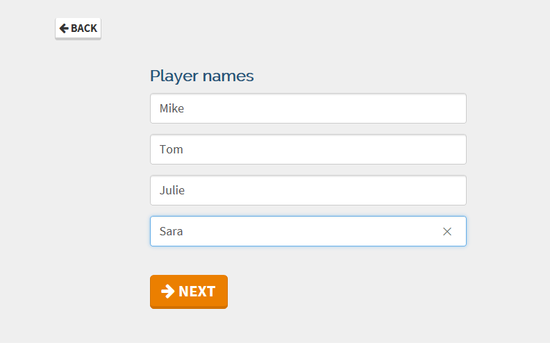
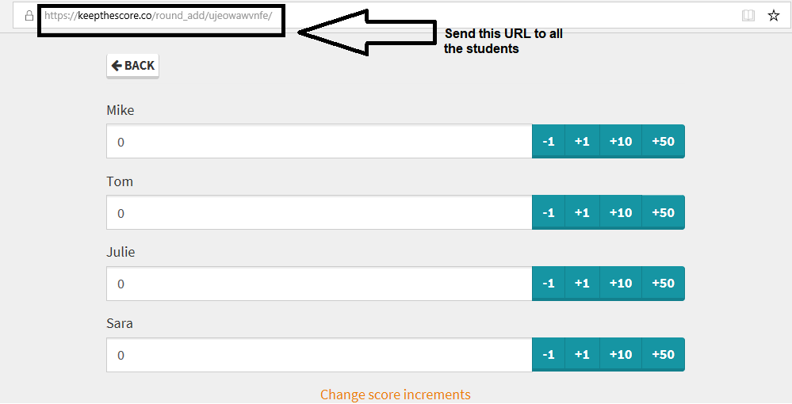
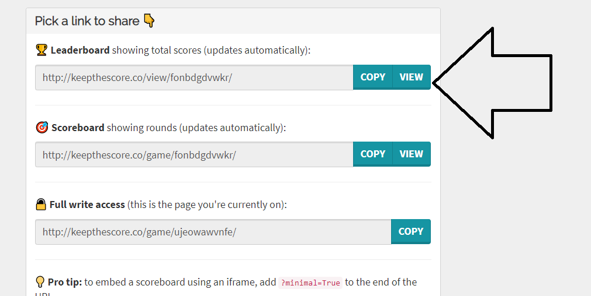
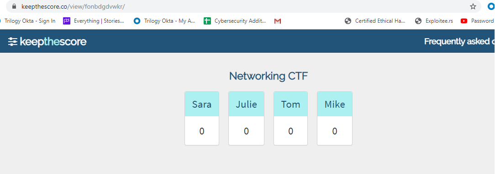

##  9.3 Lesson Plan: Networking Capture the Flag 

### Overview

Today, students will compete in a capture the flag activity that will test many of the networking skills and tools learned so far.

### Instructor Resources

- Students will fill out the capture the flag answers in a spreadsheet designed specifically for the activity. 

- The class will also have the option of tracking scores online. See Section 03 for details. 

### Lab Environment

Lab Details

 

You will use your local Vagrant virtual machine for today's activities. Please note that instructors and students have different access credentials.

  - Instructor access:
    - Username: `instructor`
    - Password: `instructor`
  - Student access:
    - Username:`sysadmin`
    - Password: `cybersecurity`

### Online Classroom Strategies 

Refer to the following guidelines and best practices for conducting this class online: 

- [Cybersecurity Online Classroom Strategies](../../../00-Teaching-Staff-Prework/OnlineStrategies.md)

### Slideshow

- The lesson slides are available on Google Drive here: [9.3 Slides](https://docs.google.com/presentation/d/1fi6FPqxfn3iQIBVsMmh9jLNFi7QVZBjGNv0YuIpJGuE/edit#slide=id.g4789b2c72f_0_6) 

- To add slides to the student-facing repository, download the slides as a PDF by navigating to **File** > **Download as** and choosing **PDF document**. Then, add the PDF file to your class repository along with any other necessary files.

- **Note**: Editing access is not available for this document. If you or your students wish to modify the slides, please create a copy by navigating to **File** > **Make a copy**.

### Time Tracker

- The lesson slides are available on Google Drive here: [9.3 Time Tracker](https://docs.google.com/spreadsheets/d/12tDEik_fcO3LwJsrWr7EVPZuTd1urMVSui6egtNcbhE/edit#gid=1047115118)

---

### 01. Instructor Do: Welcome and Introduction to the Networking Capture the Flag (0:05)

Welcome the students to the last day of the second week of networking. Explain that today we will review everything we've learned about networks with an engaging and fun competition.

- Explain that today we will be conducting a **Capture the Flag (CTF)** contest.

- CTFs are very common cybersecurity training exercises, and often take place at security conferences or training events.

Today's CTF will focus solely on the networking concepts learned over the past two weeks. 

### 02. Instructor Do: CTF Instructions and Rules (0:10)

Explain how this CTF will work by covering the following: 

- In this CTF, students will be provided a spreadsheet of various networking questions and activities.

- Questions and activities are separated into various networking categories.

- Students are required to download PCAP files in order to answer questions.

- The answers to questions and activities will serve as the **flags** that students must collect and document in their spreadsheet. 

- Each flag has a different numeric point value. The higher the point value, the more challenging the question/activity.

- Total points of flags will be calculated automatically in the spreadsheet.

- The student with the most points at the end of class, or who completes all the flags correctly first, wins the CTF. 

#### CTF Spreadsheet Walkthrough

While the process is fairly straightforward when referencing the document, give an overview of how to complete the CTF. 
  
  
  
  - Once the students figure out an answer (find the flag), they will place it in the **Flag** column.

  - Emphasize that all text answers must be **typed in lowercase (and without commas in numbers)** for the spreadsheet to properly process them.
  
  - The **Flag Value** column indicates how many points each flag is worth. 

  - If the student gets the flag right, they will automatically be assigned the points and the field color will change to green.

Explain that total points will be automatically calculated and displayed at the top of the spreadsheet.
  
  
   
Cover the following rules of the CTF:

- Students are allowed to use all class notes, slides, and online materials to solve the questions/activities.

- Flags do not need to be answered in any specific order. If a student is stuck on a question, they should move on to the next one.

- Instructors or TAs should assist with any technical CTF issues (e.g., a PCAP won't download), but should not provide guidance on answers.

Ask students if they have any questions before proceeding to the CTF scoring setup.
    
### 03. Instructor Do: CTF Scoring (0:10)

If you wish to set up online scoring, use the [Keep the Score]( https://keepthescore.co/new/) website.

Go to the website and complete the following fields.
 
  - **Title**: Choose a name for your class, or you can call it the "Networking CTF". 
 
  - Specify the number of students participating.
 
  - Leave the other values as they are.

  Select **Next**.
  
   
  
  - Enter the student names.

  Select **Next**.
  
   
   
   - On the next page, select **Add Scores**.
  
  
  
This where the students will add their scores themselves:

  - Send this link to all the students on Slack and ask them to open it on their computers.
  
  
  
Explain to the class that this is where they will update their own scores.

  - They will select the +1 or +10 to adjust their scores to reflect the scores on their CTF. 
  
  - Explain that you will be displaying the scoreboard. 
  
  - To display the scoreboard:
   
    - Click **Back**.
   
    - Click **Publish** on the bottom of the screen.
   
    - Select **View** in the leaderboard. 
    
  
       
 - Explain that you will leave the scoreboard on the screen to display the scores of everyone in class.
 
 
    
  Ask the students if they have any questions on the scoring before we begin the CTF.
  
### 04. Student Do: The CTF Competition (2:20)
  
We are ready to begin the Networking CTF!
  
 - Send the following file to students: 
    - [Activity File: Capture the Flag](./Resources/Networking_CTF.xlsx)
 
 - Students who do not have Excel can use the free program [Libre](https://www.libreoffice.org/download/download/), which they should have already downloaded in Week Two. 

Emphasize that for their activity, all of the flags entered into the CTF file need to be in **lowercase**.

Instructor Notes:

- Reference [the CTF answer key](./Resources/Networking_CTF_Key.xlsx) in case any issues come up during the activity.

- All the PCAPs are located in the Resources folder for reference.

- Be sure to wrap up the CTF 15 minutes before class ends to leave time for a class review.

### 04. Instructor Review: The CTF Challenge Review (0:15)

Begin by congratulating the winner and the second and third place finishers.

Send out the [answer key](./Resources/Networking_CTF_Key.xlsx) to the students and review the following answers:

Guides to answers that were not as straightforward:

- **Question 11**: The answer to this question required an online search. The answer is found [in this Activision Support article](https://support.activision.com/articles/en_US/FAQ/Ports-Used-for-Call-of-Duty-Games).

- **Question 12**: The total packet count is displayed on the bottom of the Wireshark screen.

- **Question 13**: Adding a filter of ARP will show 19 packets displayed on the bottom of the screen.

- **Question 14**: Filter by HTTP. The first GET request is for the host of thesimpsons.com.

- **Question 15**: Packet number 24 shows the response code of `301 Moved Permanently`.

- **Question 16**: In the same packet in the HTTP details, the redirect goes to fox.com/the-simpsons, the primary domain is fox.com.

- **Question 18**: Packet 23 has the original source port of `50568`.

- **Question 19**: Filter by DNS. In packet 20, in the packet details under **Domain Name Systems** > **Authoritative Nameservers**,  ns01.foxinc.com is shown as the primary nameserver.

- **Question 20**: Filter by DNS. In the DNS response for the A record, packet 19, under Answers, is the TTL of 600.

- **Question 21**: Filter by TCP. There is one SYN > ACK packet, packet 26. Under Timestamps in the packet details is the time since previous frame: 0.026018000.

- **Question 22/23**: These are tricky. The recommended technique is: 
  - Search by "homer."
    - Use a filter `frame contains homer`. 
  - Only one packet displays: packet 46. 
  - This contains the data, but you have the scroll through the packet bytes data to get the answers.

  

- **Question 24**: In that same packet, the MAC address of Homer, the sender of the message, is `a0:a4:c5:10:ac:c0`. Using any web tool, you will find the vendor is Intel.

- **Question 28**: ASCII of 68 = `h`, 69 = `i`. The answer is `hi`.

- **Question 29/30**: Use the [Browserling Binary to IP translation](https://www.browserling.com/tools/bin-to-ip) web tool. You have to run the conversion three times to get the answer: `38.42.56.32`.

- **Question 31**: Arin.net will provide the AS number for the IP.

- **Question 49**: Using any binary to text converter to will convert the results to `Induction`. The **flag**, however, needs to be lower-case.

- **Question 50**: To decrypt the packets in Wireshark, go to **Edit** > **Preferences**. In the protocols menu, select **IEEE 802.11**.
  
  - Check **Enable decryption**, then select **Edit**, enter in the WPA key of `wpa-pwd` : `Induction`, then filter by HTTP. **Note**: The first `I` in `Induction` is capitalized.  

  

- **Question 51/52**: In packet 439, the packet details have both the values:  `Internet Protocol Version 4, Src: Karens-iMac.local (192.168.0.50), Dst: rr.pmtpa.wikimedia.org (66.230.200.100).`

- **Question 53**: From the top of the toolbar, select **Wireless** > **WLAN traffic**, and the SSID will display.

- **Question 54**: Filter by DNS. The TTL is in packet 429.

- **Question 55**: Filter by ICMP. All responses are unreachable, so the answer is zero.

- **Question 56**: Filter by HTTP. Packet 778 (and several others) has a destination address with the word transcripts, snltranscripts.jt.org. The answer is Saturday Night Live, or snl.

- **Question 58/59**: Packet 2 shows the original (good) MAC that was already assigned, and a new (potentially bad) MAC that it was trying to be changed to.

- **Question 60**: We can see 2015 in the frame part of the packet details of any packet. For example, `Oct  6, 2015 05:28:18.174006000 Eastern Daylight Time.`

- **Question 61**: The formula is n(n -1) / 2 , so (352 * 351) / 2 = 61,776.

- **Question 62**: Number of hosts is 8,192. Subtract the broadcast and network address. Usable hosts: 8,190.

- **Question 63**: For the ARPA, take the IP and switch the order of the octets from last to first. `66.56.54.194` becomes the ARPA IP of `194.54.56.66`.

- **Question 64**: Using an [IPv6 CIDR calculator](https://www.ultratools.com/tools/ipv6CIDRToRange
 ), enter the IPV6 value with the CIDR notation, `2001:db8:85a3::8a2e:370:7334/107`, and it returns the number of hosts: 2,097,152.

   
-------

### Copyright

© 2020 Trilogy Education Services, a 2U, Inc. brand. All Rights Reserved.
